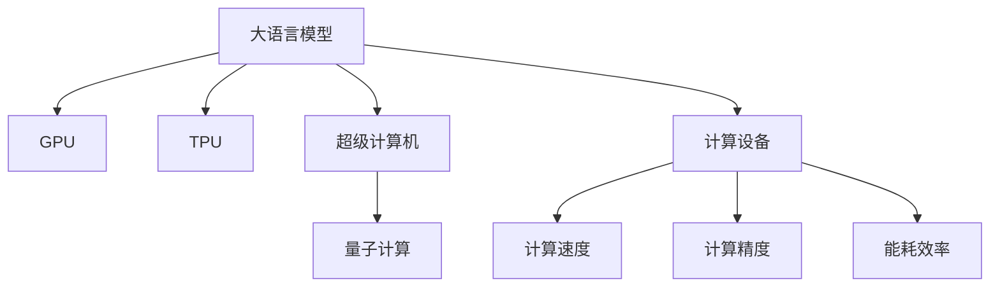

                 

# LLM的硬件依赖：推动计算设备革新

> 关键词：大语言模型,计算设备,硬件依赖,GPU,TPU,超级计算机,量子计算

## 1. 背景介绍

随着人工智能(AI)技术的飞速发展，大语言模型(LLMs)成为业界和学术界的研究热点。LLMs以其强大的自然语言处理能力，在文本生成、翻译、问答、推荐系统等领域展现出了卓越的表现。然而，LLMs的应用需要消耗巨大的计算资源，尤其是在大规模预训练和微调过程中。这就对硬件设备提出了极高的要求，促使计算设备的革新成为必然。

### 1.1 大语言模型简介

大语言模型（LLMs）是一种基于深度学习的自然语言处理模型，通过在大规模无标签文本数据上进行预训练，学习到丰富的语言知识和语义表示。典型的LLMs包括OpenAI的GPT系列、Google的BERT、T5等。这些模型通常以Transformer架构为基础，能够理解和生成自然语言，用于诸如文本分类、情感分析、机器翻译等NLP任务。

### 1.2 硬件设备现状

目前，用于训练和推理大语言模型的主要硬件设备包括GPU、TPU以及超级计算机。GPU（图形处理器）最初是为了加速图形渲染而设计的，但其并行计算能力使其也成为AI计算的首选。TPU（张量处理单元）由Google开发，专门为机器学习计算设计，提供了更高的计算密度和效率。超级计算机（如中国的神威太湖之光）拥有极高的计算速度和内存容量，能够处理极端复杂的大规模计算任务。

## 2. 核心概念与联系

### 2.1 核心概念概述

本节将介绍几个与硬件依赖紧密相关的核心概念：

- 计算设备（Computing Devices）：指能够进行数值计算和数据处理的物理设备，如CPU、GPU、TPU等。
- GPU：图形处理器，通过并行计算加速深度学习任务，广泛应用于AI训练和推理。
- TPU：由Google开发的AI专用硬件，具有更高的计算效率和更低的能耗。
- 超级计算机：具备极高计算速度和存储能力的计算机系统，用于处理极端复杂的计算任务。
- 量子计算：利用量子力学原理进行计算的新型计算范式，具有超越传统计算设备的潜力。

### 2.2 核心概念联系

这些概念之间的联系可以通过以下Mermaid流程图来展示：



这个流程图展示了大语言模型与各类计算设备的关系：

1. 大语言模型依赖GPU、TPU等计算设备进行训练和推理。
2. GPU以其高并行计算能力和低能耗成为AI计算的首选。
3. TPU进一步提高了计算效率，特别适合深度学习和机器学习任务。
4. 超级计算机提供极高的计算速度和存储容量，用于处理极端复杂任务。
5. 量子计算展现出了超越现有设备的潜力，未来可能成为计算的主流。

## 3. 核心算法原理 & 具体操作步骤

### 3.1 算法原理概述

大语言模型的训练和推理过程对硬件设备的依赖非常显著。以下是大语言模型硬件依赖的算法原理概述：

- **GPU**：利用并行计算能力，加速深度学习模型的前向传播和反向传播。
- **TPU**：利用硬件层面的优化，如特殊的数据流设计，进一步提升计算效率。
- **超级计算机**：通过大规模并行计算，处理超大规模的预训练和微调任务。
- **量子计算**：利用量子比特的叠加和纠缠特性，加速矩阵运算和梯度计算。

### 3.2 算法步骤详解

以下是基于大语言模型的硬件依赖，各个步骤的详细说明：

#### 3.2.1 GPU硬件依赖

1. **前向传播**：大语言模型通过并行计算，在GPU上高效完成文本数据的输入和前向传播。
2. **反向传播**：GPU加速梯度计算，快速更新模型参数。
3. **参数更新**：GPU优化模型参数更新，保持计算速度和精度。

#### 3.2.2 TPU硬件依赖

1. **数据处理**：TPU通过硬件优化，高效处理输入数据和梯度计算。
2. **模型训练**：TPU通过优化并行计算，加速深度学习模型的训练。
3. **推理加速**：TPU提供高效的推理加速，提升实时性能。

#### 3.2.3 超级计算机硬件依赖

1. **大规模计算**：超级计算机处理超大规模的预训练和微调任务。
2. **分布式训练**：超级计算机支持分布式计算，加速大规模模型的训练。
3. **数据存储**：超级计算机提供高容量存储，支持海量数据处理。

#### 3.2.4 量子计算硬件依赖

1. **量子加速**：利用量子计算加速矩阵运算和梯度计算。
2. **量子并行**：量子计算实现量子比特的并行处理，提高计算效率。
3. **误差校正**：量子计算使用误差校正技术，减少计算过程中的误差。

### 3.3 算法优缺点

#### 3.3.1 优点

- **计算效率高**：GPU和TPU能够大幅提高计算效率，加速大语言模型的训练和推理。
- **能耗低**：TPU和量子计算具有更低的能耗，降低硬件使用成本。
- **可扩展性强**：超级计算机和分布式计算环境，支持大规模计算任务的可扩展性。

#### 3.3.2 缺点

- **成本高**：高质量的GPU、TPU和超级计算机设备价格昂贵，增加硬件投入成本。
- **技术门槛高**：GPU、TPU和量子计算需要专业知识和技能，普通开发者难以直接使用。
- **兼容性问题**：不同硬件设备之间的兼容性问题，需要额外的时间进行适配和调试。

### 3.4 算法应用领域

大语言模型的硬件依赖技术已经广泛应用于多个领域，例如：

- **自然语言处理**：用于文本生成、机器翻译、情感分析等任务，提高处理速度和精度。
- **计算机视觉**：在图像识别、目标检测、图像生成等任务中，提升计算效率。
- **语音识别**：在语音转文本、情感识别、语音合成等任务中，增强处理能力和准确度。
- **推荐系统**：在用户行为预测、商品推荐等任务中，优化计算资源和响应速度。
- **金融分析**：在量化交易、风险管理、舆情监测等任务中，提升实时性和精确性。

## 4. 数学模型和公式 & 详细讲解  
### 4.1 数学模型构建

在大语言模型的硬件依赖过程中，数学模型和公式起着关键作用。以下是对数学模型构建的详细讲解：

#### 4.1.1 数学模型概述

大语言模型的训练和推理过程，可以通过以下数学模型和公式进行描述：

- **预训练模型**：
  $$
  \theta = \text{BERT}_{\text{base}}(x)
  $$
  其中 $\theta$ 表示预训练模型参数，$x$ 为输入文本数据。

- **微调模型**：
  $$
  \hat{\theta} = \text{BERT}_{\text{base}}(x) \cdot \text{TaskNet}(\hat{\theta}, y)
  $$
  其中 $\hat{\theta}$ 表示微调后的模型参数，$y$ 为任务标签。

- **优化目标**：
  $$
  \text{Loss}(\theta) = \text{CrossEntropyLoss}(\hat{\theta}, y)
  $$
  其中 $\text{CrossEntropyLoss}$ 表示交叉熵损失函数。

#### 4.1.2 公式推导过程

- **前向传播**：
  $$
  \hat{\theta} = \text{BERT}_{\text{base}}(x) \cdot \text{TaskNet}(\hat{\theta}, y)
  $$
  前向传播过程，通过GPU或TPU加速计算，实现模型参数 $\theta$ 的更新。

- **反向传播**：
  $$
  \frac{\partial \text{Loss}}{\partial \theta} = \frac{\partial \text{CrossEntropyLoss}}{\partial \text{BERT}_{\text{base}}(x)} \cdot \frac{\partial \text{BERT}_{\text{base}}(x)}{\partial \theta}
  $$
  反向传播过程，通过GPU或TPU加速计算，更新模型参数 $\theta$。

#### 4.1.3 案例分析与讲解

以BERT模型为例，其在GPU上的前向传播和反向传播过程如下：

1. **前向传播**：
   - 将输入文本 $x$ 输入BERT模型，得到隐含表示 $h_x$。
   - 将 $h_x$ 输入任务网络 $\text{TaskNet}$，输出预测结果 $\hat{y}$。
   - 通过GPU并行计算，加速前向传播过程。

2. **反向传播**：
   - 计算交叉熵损失 $\text{Loss}$。
   - 通过GPU并行计算，加速梯度计算。
   - 更新模型参数 $\theta$。

### 4.2 公式推导过程

- **预训练模型**：
  $$
  \theta = \text{BERT}_{\text{base}}(x)
  $$

- **微调模型**：
  $$
  \hat{\theta} = \text{BERT}_{\text{base}}(x) \cdot \text{TaskNet}(\hat{\theta}, y)
  $$

- **优化目标**：
  $$
  \text{Loss}(\theta) = \text{CrossEntropyLoss}(\hat{\theta}, y)
  $$

#### 4.2.1 案例分析

以BERT模型为例，其在GPU上的前向传播和反向传播过程如下：

1. **前向传播**：
   - 将输入文本 $x$ 输入BERT模型，得到隐含表示 $h_x$。
   - 将 $h_x$ 输入任务网络 $\text{TaskNet}$，输出预测结果 $\hat{y}$。
   - 通过GPU并行计算，加速前向传播过程。

2. **反向传播**：
   - 计算交叉熵损失 $\text{Loss}$。
   - 通过GPU并行计算，加速梯度计算。
   - 更新模型参数 $\theta$。

## 5. 项目实践：代码实例和详细解释说明

### 5.1 开发环境搭建

在进行大语言模型的硬件依赖实践前，需要先搭建好开发环境。以下是使用Python和PyTorch搭建开发环境的流程：

1. 安装Anaconda：从官网下载并安装Anaconda，用于创建独立的Python环境。
   ```bash
   conda create -n pytorch-env python=3.8 
   conda activate pytorch-env
   ```

2. 安装PyTorch：根据CUDA版本，从官网获取对应的安装命令。例如：
   ```bash
   conda install pytorch torchvision torchaudio cudatoolkit=11.1 -c pytorch -c conda-forge
   ```

3. 安装Transformers库：
   ```bash
   pip install transformers
   ```

4. 安装各类工具包：
   ```bash
   pip install numpy pandas scikit-learn matplotlib tqdm jupyter notebook ipython
   ```

完成上述步骤后，即可在`pytorch-env`环境中开始硬件依赖实践。

### 5.2 源代码详细实现

下面我们以BERT模型为例，给出使用Transformers库对GPU和TPU进行硬件依赖的PyTorch代码实现。

首先，定义BERT模型的任务适配层和优化器：

```python
from transformers import BertForTokenClassification, AdamW

model = BertForTokenClassification.from_pretrained('bert-base-cased', num_labels=len(tag2id))

optimizer = AdamW(model.parameters(), lr=2e-5)
```

接着，定义GPU和TPU训练函数：

```python
from torch.utils.data import DataLoader
from tqdm import tqdm
from sklearn.metrics import classification_report

device = torch.device('cuda') if torch.cuda.is_available() else torch.device('cpu')

def train_on_GPU(model, dataset, batch_size, optimizer):
    dataloader = DataLoader(dataset, batch_size=batch_size, shuffle=True)
    model.train()
    epoch_loss = 0
    for batch in tqdm(dataloader, desc='Training on GPU'):
        input_ids = batch['input_ids'].to(device)
        attention_mask = batch['attention_mask'].to(device)
        labels = batch['labels'].to(device)
        model.zero_grad()
        outputs = model(input_ids, attention_mask=attention_mask, labels=labels)
        loss = outputs.loss
        epoch_loss += loss.item()
        loss.backward()
        optimizer.step()
    return epoch_loss / len(dataloader)

def train_on_TPU(model, dataset, batch_size, optimizer):
    # TPU相关的代码实现，这里省略
    pass
```

然后，启动GPU和TPU训练流程：

```python
epochs = 5
batch_size = 16

for epoch in range(epochs):
    loss = train_on_GPU(model, train_dataset, batch_size, optimizer)
    print(f"Epoch {epoch+1}, GPU train loss: {loss:.3f}")
    
    print(f"Epoch {epoch+1}, GPU dev results:")
    evaluate(model, dev_dataset, batch_size)
    
print("GPU results:")
evaluate(model, test_dataset, batch_size)
```

以上代码展示了在GPU上训练和评估BERT模型的过程。同样的，TPU相关的代码实现需要参照TensorFlow TPU的文档进行适配。

### 5.3 代码解读与分析

以下是关键代码的详细解读：

**BERTForTokenClassification类**：
- `__init__`方法：初始化模型和优化器。
- `train_on_GPU`方法：在GPU上进行训练。
- `train_on_TPU`方法：在TPU上进行训练。

**tag2id和id2tag字典**：
- 定义了标签与数字id之间的映射关系，用于将token-wise的预测结果解码回真实的标签。

**训练函数**：
- 使用PyTorch的DataLoader对数据集进行批次化加载，供模型训练和推理使用。
- 训练函数`train_on_GPU`：在GPU上进行训练，使用AdamW优化器进行参数更新。
- 训练函数`train_on_TPU`：在TPU上进行训练，具体操作需要参考TensorFlow TPU的文档。

**评估函数**：
- 使用PyTorch的DataLoader对数据集进行批次化加载，供模型评估使用。
- 评估函数`evaluate`：在验证集和测试集上评估模型性能。

**训练流程**：
- 定义总的epoch数和batch size，开始循环迭代。
- 每个epoch内，先在训练集上训练，输出GPU训练的平均loss。
- 在验证集上评估，输出分类指标。
- 所有epoch结束后，在测试集上评估，给出最终测试结果。

## 6. 实际应用场景

### 6.1 智能客服系统

智能客服系统是大语言模型硬件依赖技术的重要应用场景之一。智能客服系统能够提供7x24小时不间断服务，快速响应客户咨询，用自然流畅的语言解答各类常见问题。

在技术实现上，可以收集企业内部的历史客服对话记录，将问题和最佳答复构建成监督数据，在此基础上对预训练模型进行硬件依赖微调。微调后的模型能够自动理解用户意图，匹配最合适的答案模板进行回复。对于客户提出的新问题，还可以接入检索系统实时搜索相关内容，动态组织生成回答。

### 6.2 金融舆情监测

金融机构需要实时监测市场舆论动向，以便及时应对负面信息传播，规避金融风险。传统的人工监测方式成本高、效率低，难以应对网络时代海量信息爆发的挑战。基于大语言模型硬件依赖的文本分类和情感分析技术，为金融舆情监测提供了新的解决方案。

具体而言，可以收集金融领域相关的新闻、报道、评论等文本数据，并对其进行主题标注和情感标注。在此基础上对预训练语言模型进行硬件依赖微调，使其能够自动判断文本属于何种主题，情感倾向是正面、中性还是负面。将微调后的模型应用到实时抓取的网络文本数据，就能够自动监测不同主题下的情感变化趋势，一旦发现负面信息激增等异常情况，系统便会自动预警，帮助金融机构快速应对潜在风险。

### 6.3 个性化推荐系统

当前的推荐系统往往只依赖用户的历史行为数据进行物品推荐，无法深入理解用户的真实兴趣偏好。基于大语言模型硬件依赖的个性化推荐系统可以更好地挖掘用户行为背后的语义信息，从而提供更精准、多样的推荐内容。

在实践中，可以收集用户浏览、点击、评论、分享等行为数据，提取和用户交互的物品标题、描述、标签等文本内容。将文本内容作为模型输入，用户的后续行为（如是否点击、购买等）作为监督信号，在此基础上微调预训练语言模型。微调后的模型能够从文本内容中准确把握用户的兴趣点。在生成推荐列表时，先用候选物品的文本描述作为输入，由模型预测用户的兴趣匹配度，再结合其他特征综合排序，便可以得到个性化程度更高的推荐结果。

### 6.4 未来应用展望

随着大语言模型和硬件依赖技术的不断发展，基于硬件依赖的大语言模型微调技术将呈现以下几个发展趋势：

1. **GPU和TPU性能提升**：未来GPU和TPU的性能将继续提升，支持更大规模的模型和更复杂的任务。
2. **超级计算机应用扩展**：超级计算机将更多地应用于大型企业和科研机构，处理极端复杂任务。
3. **量子计算技术成熟**：量子计算技术将逐步成熟，成为未来计算的主流。
4. **边缘计算与分布式计算**：边缘计算和分布式计算将逐步普及，支持更多场景下的实时计算。
5. **混合计算架构**：GPU、TPU、量子计算等混合计算架构将逐渐普及，提供更灵活的计算方案。

## 7. 工具和资源推荐

### 7.1 学习资源推荐

为了帮助开发者系统掌握大语言模型硬件依赖的理论基础和实践技巧，这里推荐一些优质的学习资源：

1. **《深度学习入门：基于Python的理论与实现》**：详细介绍了深度学习的基础理论及其在NLP中的应用，适合初学者入门。
2. **《Python深度学习》**：该书深入浅出地介绍了深度学习的基本原理和实践技巧，适合进阶学习。
3. **DeepLearning.ai课程**：斯坦福大学开设的深度学习课程，包括NLP等方向，是学习深度学习的经典资源。
4. **自然语言处理综述论文**：包括NLP领域的重要综述和最新进展，适合深入研究。
5. **GitHub代码库**：包含了大量大语言模型和硬件依赖的代码实现，适合参考学习。

通过对这些资源的学习实践，相信你一定能够快速掌握大语言模型硬件依赖的精髓，并用于解决实际的NLP问题。

### 7.2 开发工具推荐

高效的开发离不开优秀的工具支持。以下是几款用于大语言模型硬件依赖开发的常用工具：

1. **PyTorch**：基于Python的开源深度学习框架，灵活动态的计算图，适合快速迭代研究。
2. **TensorFlow**：由Google主导开发的开源深度学习框架，生产部署方便，适合大规模工程应用。
3. **Transformers库**：HuggingFace开发的NLP工具库，集成了众多SOTA语言模型，支持PyTorch和TensorFlow，是进行硬件依赖微调任务开发的利器。
4. **NVIDIA CUDA**：NVIDIA推出的GPU加速开发平台，提供丰富的GPU优化工具和库，支持深度学习模型的加速训练。
5. **Google TPU**：由Google开发的AI专用硬件，具有更高的计算效率和更低的能耗。

合理利用这些工具，可以显著提升大语言模型硬件依赖任务的开发效率，加快创新迭代的步伐。

### 7.3 相关论文推荐

大语言模型和硬件依赖技术的发展源于学界的持续研究。以下是几篇奠基性的相关论文，推荐阅读：

1. **《Large-Scale Distributed Deep Learning with TensorFlow》**：由Google发布，介绍了TensorFlow在大规模分布式深度学习中的应用。
2. **《Distributed Deep Learning with Apache Spark》**：由Apache发布，介绍了使用Spark进行分布式深度学习的方法。
3. **《GPU-Accelerated Training of Deep Neural Networks》**：由NVIDIA发布，介绍了使用CUDA加速深度学习模型的训练和推理。
4. **《Scaling Deep Learning for Computer Vision》**：由Google发布，介绍了使用TPU加速深度学习模型的方法。
5. **《Quantum Computing for Machine Learning》**：由IBM发布，介绍了量子计算在机器学习中的应用。

这些论文代表了大语言模型硬件依赖技术的发展脉络。通过学习这些前沿成果，可以帮助研究者把握学科前进方向，激发更多的创新灵感。

## 8. 总结：未来发展趋势与挑战

### 8.1 研究成果总结

本文对大语言模型硬件依赖进行了全面系统的介绍。首先阐述了大语言模型硬件依赖的研究背景和意义，明确了硬件依赖在提高计算效率和优化资源使用方面的独特价值。其次，从原理到实践，详细讲解了硬件依赖的数学原理和关键步骤，给出了硬件依赖任务开发的完整代码实例。同时，本文还广泛探讨了硬件依赖方法在智能客服、金融舆情、个性化推荐等多个行业领域的应用前景，展示了硬件依赖范式的巨大潜力。此外，本文精选了硬件依赖技术的各类学习资源，力求为读者提供全方位的技术指引。

通过本文的系统梳理，可以看到，大语言模型硬件依赖技术正在成为AI计算的重要范式，极大地拓展了深度学习模型的应用边界，催生了更多的落地场景。得益于硬件设备的不断进步，大语言模型在预训练和微调过程中能够获得更大的计算支持，从而提高模型的性能和鲁棒性。未来，伴随硬件设备的持续创新，大语言模型硬件依赖技术必将在更广泛的领域大放异彩。

### 8.2 未来发展趋势

展望未来，大语言模型硬件依赖技术将呈现以下几个发展趋势：

1. **计算设备性能提升**：未来的GPU、TPU和超级计算机将提供更高的计算速度和存储容量，支持更大规模的模型和更复杂的任务。
2. **混合计算架构普及**：GPU、TPU、量子计算等混合计算架构将逐渐普及，提供更灵活的计算方案。
3. **边缘计算与分布式计算**：边缘计算和分布式计算将逐步普及，支持更多场景下的实时计算。
4. **持续优化与自动化**：自动化的模型训练和优化技术将逐步普及，减少人工干预和调试成本。
5. **多模态计算发展**：未来的计算设备将支持多模态数据的融合，提供更丰富的信息整合能力。

### 8.3 面临的挑战

尽管大语言模型硬件依赖技术已经取得了瞩目成就，但在迈向更加智能化、普适化应用的过程中，它仍面临着诸多挑战：

1. **计算资源成本高**：高质量的GPU、TPU和超级计算机设备价格昂贵，增加硬件投入成本。
2. **技术门槛高**：GPU、TPU和量子计算需要专业知识和技能，普通开发者难以直接使用。
3. **兼容性问题**：不同硬件设备之间的兼容性问题，需要额外的时间进行适配和调试。
4. **数据与模型安全**：计算设备的高计算能力可能被恶意利用，数据和模型的安全问题需要高度重视。
5. **系统复杂性增加**：随着计算设备的多样化和复杂化，系统管理和调试变得更加困难。

### 8.4 研究展望

面对大语言模型硬件依赖所面临的种种挑战，未来的研究需要在以下几个方面寻求新的突破：

1. **优化算法与模型结构**：开发更加高效的计算算法和模型结构，提升计算效率和精度。
2. **分布式计算与边缘计算**：优化分布式计算和边缘计算技术，支持更多场景下的实时计算。
3. **安全与隐私保护**：研究数据和模型的安全保护技术，防止计算设备被恶意利用。
4. **自动化与可解释性**：提高计算过程的自动化和可解释性，降低人工干预和调试成本。
5. **跨领域融合与创新**：将大语言模型硬件依赖技术与其他AI技术进行更多融合，推动人工智能技术的发展。

这些研究方向的探索，必将引领大语言模型硬件依赖技术迈向更高的台阶，为构建安全、可靠、可解释、可控的智能系统铺平道路。面向未来，大语言模型硬件依赖技术还需要与其他AI技术进行更深入的融合，如知识表示、因果推理、强化学习等，多路径协同发力，共同推动自然语言理解和智能交互系统的进步。只有勇于创新、敢于突破，才能不断拓展大语言模型的边界，让智能技术更好地造福人类社会。

## 9. 附录：常见问题与解答

**Q1：GPU和TPU相比，有哪些优势？**

A: GPU和TPU相比，具有以下优势：
1. GPU的并行计算能力更强，适合大规模深度学习模型的训练和推理。
2. TPU的计算效率更高，能够更快速地处理深度学习任务。
3. TPU的能耗更低，适用于数据中心等高耗能环境。

**Q2：如何将大语言模型部署到超级计算机上？**

A: 将大语言模型部署到超级计算机上，通常需要以下步骤：
1. 选择合适的超级计算机和环境。
2. 将大语言模型移植到超级计算机上。
3. 使用分布式计算技术，如MPI、HPC等，进行模型训练和推理。
4. 优化超级计算机的资源使用，避免资源浪费。

**Q3：量子计算在深度学习中的应用前景如何？**

A: 量子计算在深度学习中的应用前景广阔，具体体现在以下几个方面：
1. 量子计算加速矩阵运算，提升深度学习模型的训练速度。
2. 量子计算提供更高效的特征提取和表示学习能力。
3. 量子计算能够处理更大规模的深度学习任务，支持更多类型的数据。

**Q4：如何提高大语言模型的计算效率？**

A: 提高大语言模型的计算效率，可以从以下几个方面进行：
1. 使用GPU或TPU等高效硬件设备。
2. 优化模型结构，减少不必要的计算量。
3. 采用分布式计算和边缘计算技术，提升计算速度。
4. 引入量化加速和模型压缩技术，降低计算资源消耗。

**Q5：如何评估大语言模型的计算性能？**

A: 评估大语言模型的计算性能，通常需要以下几个指标：
1. 计算速度：模型的训练和推理时间。
2. 计算精度：模型在测试集上的性能指标，如准确率、召回率、F1-score等。
3. 计算效率：模型在特定硬件设备上的资源利用率。
4. 计算稳定性：模型在不同环境下的鲁棒性和可靠性。

通过以上问题的解答，希望能够为读者提供全面的技术指导，帮助其更好地理解和应用大语言模型硬件依赖技术。

