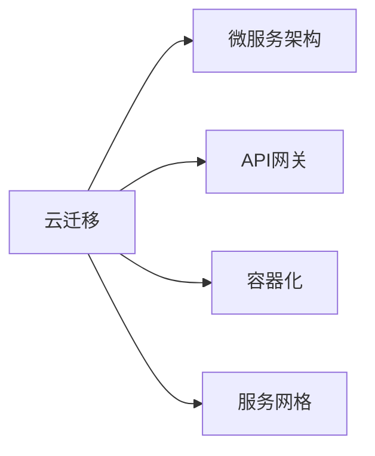
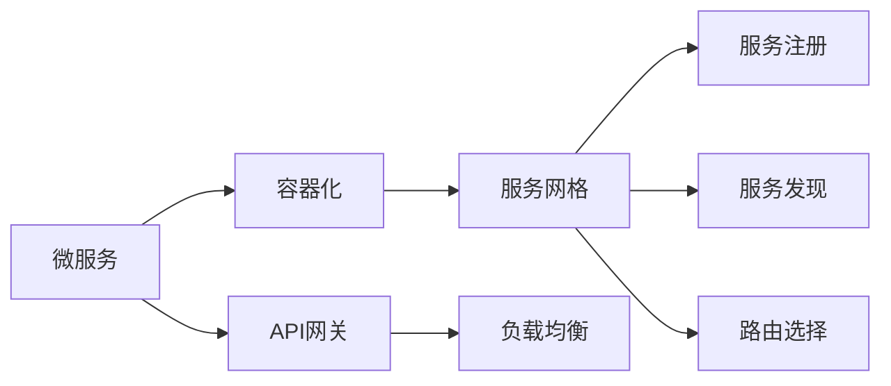
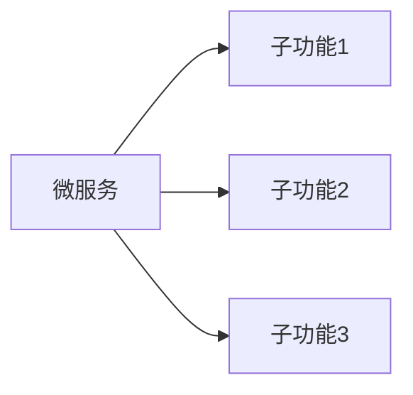
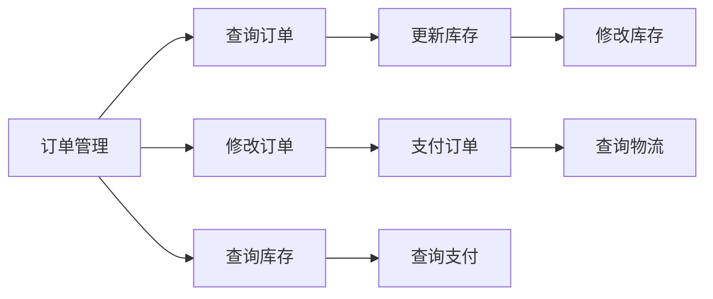
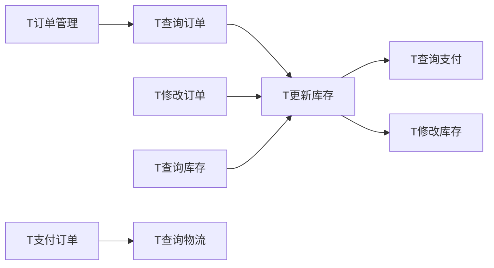

                 

# Lepton AI的云迁移方案：降低抽象化成本，实现不同云平台间的自由交互

> 关键词：云迁移,Lepton AI,跨云交互,微服务架构,API网关

## 1. 背景介绍

随着云计算技术的日益成熟，越来越多的企业开始将业务迁移到云端，以便更灵活地应对业务需求变化和提升系统可靠性。然而，不同的云平台和环境往往存在差异，如何在跨云环境中实现自由交互和无缝集成，成为一个难题。

Lepton AI公司致力于解决跨云迁移和跨平台交互的问题，其云迁移方案凭借高效、灵活的特点，得到了市场的广泛认可。本文将详细介绍Lepton AI的云迁移方案，包括其核心概念、核心算法、操作步骤和应用领域，以期为行业内的从业者提供有价值的参考。

## 2. 核心概念与联系

### 2.1 核心概念概述

为了更好地理解Lepton AI的云迁移方案，我们先来梳理一下相关的核心概念及其相互关系。

#### a. 云迁移
云迁移是指将企业现有的应用程序、数据和存储资源，从一个云平台迁移到另一个云平台的过程。云迁移的目的是提高系统的灵活性、可靠性和可扩展性，优化资源使用效率，降低运营成本。

#### b. Lepton AI
Lepton AI是一家专注于云计算和人工智能的解决方案提供商。其云迁移方案专注于解决跨云环境中的交互和集成问题，实现了不同云平台间的自由交互。

#### c. 微服务架构
微服务架构是一种将应用程序拆分成多个独立服务的架构风格。每个服务运行在独立的进程中，可以独立部署、扩展和管理。

#### d. API网关
API网关是负责处理HTTP请求的组件，它接收来自客户端的请求，并将其路由到相应的服务。API网关提供了负载均衡、安全控制、服务路由等功能，是实现微服务架构中服务间通信的关键组件。

#### e. 容器化
容器化是将应用程序及其依赖打包到一个独立、可移植的容器中，容器可以在任何支持Docker的标准环境中运行。容器化实现了应用的可移植性和快速部署。

#### f. 服务网格
服务网格是一种分布式系统中的服务发现和通信管理工具。它通过代理和负载均衡器等技术，实现了微服务间的通信和调度。

这些核心概念之间的联系如图1所示：



Lepton AI的云迁移方案正是基于上述概念构建的，通过将应用程序拆分成微服务，使用容器化技术打包部署，借助API网关实现跨云服务间的自由交互，利用服务网格进行服务发现和调度，最终实现了跨云环境的无缝集成。

### 2.2 核心概念原理和架构的 Mermaid 流程图

接下来，我们通过Mermaid流程图进一步展示Lepton AI云迁移方案的核心架构和工作原理。



1. 将应用程序拆分成微服务，每个微服务独立运行在容器中。
2. 容器化打包微服务，使其具有可移植性和快速部署能力。
3. 利用API网关接收HTTP请求，并将其路由到相应的微服务。
4. 服务网格负责微服务间的发现和调度，实现服务的高可用性和负载均衡。
5. 负载均衡器分散请求到不同的微服务实例，提高系统处理能力。

## 3. 核心算法原理 & 具体操作步骤

### 3.1 算法原理概述

Lepton AI的云迁移方案基于微服务架构、API网关、容器化、服务网格等技术构建，其实现的算法原理如下：

1. **微服务拆分**：将应用程序拆分成多个独立的微服务，每个微服务负责完成特定功能。
2. **容器化打包**：将微服务打包到Docker容器中，使得微服务可以在任何支持Docker的环境中运行。
3. **API网关路由**：利用API网关接收HTTP请求，并将请求路由到相应的微服务。
4. **服务网格调度**：通过服务网格实现微服务间的服务发现和调度，提高系统的可扩展性和可靠性。
5. **负载均衡**：利用负载均衡器分散请求到不同的微服务实例，提高系统的处理能力和可用性。

### 3.2 算法步骤详解

#### a. 微服务拆分
1. **功能划分**：将应用程序按功能模块进行拆分，每个微服务独立完成特定功能。
2. **依赖管理**：使用依赖注入技术，管理微服务之间的依赖关系。
3. **配置管理**：将配置参数单独管理，使其与代码分离，便于维护和扩展。

#### b. 容器化打包
1. **创建Dockerfile**：编写Dockerfile，定义微服务的打包和部署流程。
2. **构建镜像**：使用Docker构建镜像，将微服务及其依赖打包到容器中。
3. **部署容器**：将容器部署到Kubernetes或Docker Swarm等容器管理平台上。

#### c. API网关路由
1. **定义路由规则**：在API网关中定义路由规则，将请求路由到相应的微服务。
2. **负载均衡**：利用负载均衡器，分散请求到不同的微服务实例，提高系统处理能力。
3. **安全控制**：在API网关中实现认证和授权，确保请求的安全性。

#### d. 服务网格调度
1. **服务注册**：在服务网格中注册微服务，使其能够被其他微服务发现和调用。
2. **服务发现**：使用服务网格实现服务发现，动态路由请求到可用的微服务实例。
3. **负载均衡**：通过服务网格进行负载均衡，提高系统的可扩展性和可靠性。

### 3.3 算法优缺点

#### a. 优点
1. **高可扩展性**：微服务架构可以方便地进行扩展和升级，提高系统的可扩展性。
2. **高可靠性**：服务网格可以自动发现和调度服务，提高系统的可靠性。
3. **高可用性**：负载均衡器可以分散请求到不同的实例，提高系统的可用性。
4. **灵活性高**：通过API网关，可以实现不同云平台之间的自由交互。

#### b. 缺点
1. **复杂性高**：微服务架构和容器化部署增加了系统的复杂性。
2. **性能开销大**：API网关和负载均衡器会带来一定的性能开销。
3. **管理难度大**：服务网格和容器管理平台的管理复杂度较高。

### 3.4 算法应用领域

Lepton AI的云迁移方案主要应用于以下领域：

#### a. 金融行业
金融行业对系统可靠性和安全性要求较高，采用Lepton AI的云迁移方案，可以实现跨云环境的高可用性和高可靠性，同时通过API网关实现不同云平台之间的自由交互。

#### b. 电商行业
电商行业需要处理大量的并发请求，采用Lepton AI的云迁移方案，可以实现微服务的高扩展性和负载均衡，同时通过API网关实现跨云平台之间的自由交互。

#### c. 医疗行业
医疗行业对系统的稳定性和实时性要求较高，采用Lepton AI的云迁移方案，可以实现微服务的高可用性和负载均衡，同时通过API网关实现跨云平台之间的自由交互。

#### d. 政府部门
政府部门对系统的安全性、合规性和可控性要求较高，采用Lepton AI的云迁移方案，可以实现微服务的高安全性、高合规性和高可控性，同时通过API网关实现跨云平台之间的自由交互。

## 4. 数学模型和公式 & 详细讲解 & 举例说明

### 4.1 数学模型构建

为了更好地理解Lepton AI的云迁移方案，我们将其核心技术原理和步骤用数学模型进行形式化描述。

设应用程序由n个微服务组成，每个微服务的功能可以用函数f_i(x)表示，其中x为输入参数。每个微服务的功能可以拆分为多个子功能，如图2所示：



每个子功能的输出可以表示为：

$$ y_i = f_i(x_i) = g_i(h_i(f_{i-1}(x_{i-1}))) $$

其中g_i表示子功能的函数，h_i表示子功能之间的依赖关系。

### 4.2 公式推导过程

根据上述公式，我们可以进一步推导微服务架构的计算模型。设每个微服务的计算时间为t_i，则整个应用程序的计算时间为：

$$ T = \sum_{i=1}^{n} t_i $$

每个微服务的计算时间可以表示为：

$$ t_i = T_i = g_i(h_i(T_{i-1})) $$

其中T_i表示微服务i的计算时间，T_{i-1}表示子功能的计算时间，g_i和h_i表示子功能f_i的函数和依赖关系。

### 4.3 案例分析与讲解

以下是一个简单的案例分析，帮助读者更好地理解Lepton AI的云迁移方案。

假设我们有一个电商平台，其中包含订单管理、库存管理、支付管理三个微服务，每个微服务的功能如图3所示：



每个微服务的计算时间可以用图4表示：



根据上述公式，我们可以计算整个电商平台的计算时间。假设订单管理、库存管理、支付管理的计算时间分别为T_订单管理、T_库存管理、T_支付管理，则整个电商平台的计算时间为：

$$ T = T_{订单管理} + T_{库存管理} + T_{支付管理} $$

假设每个微服务的计算时间分别为：

- 查询订单的计算时间为T_查询订单 = g_查询订单(h_查询订单(T_订单管理))
- 修改订单的计算时间为T_修改订单 = g_修改订单(h_修改订单(T_订单管理))
- 查询库存的计算时间为T_查询库存 = g_查询库存(h_查询库存(T_库存管理))
- 更新库存的计算时间为T_更新库存 = g_更新库存(h_更新库存(T_库存管理))
- 查询支付的计算时间为T_查询支付 = g_查询支付(h_查询支付(T_支付管理))
- 修改库存的计算时间为T_修改库存 = g_修改库存(h_修改库存(T_库存管理))
- 支付订单的计算时间为T_支付订单 = g_支付订单(h_支付订单(T_支付管理))
- 查询物流的计算时间为T_查询物流 = g_查询物流(h_查询物流(T_支付管理))

将上述公式代入T计算公式，得到：

$$ T = T_{订单管理} + g_查询订单(h_查询订单(T_{订单管理})) + g_修改订单(h_修改订单(T_{订单管理})) + g_查询库存(h_查询库存(T_{库存管理})) + g_更新库存(h_更新库存(T_{库存管理})) + g_查询支付(h_查询支付(T_{支付管理})) + g_修改库存(h_修改库存(T_{库存管理})) + g_支付订单(h_支付订单(T_{支付管理})) + g_查询物流(h_查询物流(T_{支付管理})) $$

## 5. 项目实践：代码实例和详细解释说明

### 5.1 开发环境搭建

为了实现Lepton AI的云迁移方案，我们需要搭建如下开发环境：

1. **Kubernetes**：用于容器化部署和集群管理。
2. **Docker**：用于构建和部署容器。
3. **API网关**：用于路由请求和负载均衡。
4. **服务网格**：用于服务发现和调度。

### 5.2 源代码详细实现

以下是一个简单的微服务实现，演示如何通过API网关实现跨云平台之间的自由交互。

#### a. 订单管理微服务

```python
from flask import Flask, request, jsonify

app = Flask(__name__)

@app.route('/orders', methods=['POST'])
def create_order():
    order = request.json['order']
    # 调用库存管理微服务查询库存
    inventory = call_inventory_service(order['product_id'])
    # 修改订单状态
    update_order_status(order, 'pending')
    # 调用支付管理微服务支付订单
    payment = call_payment_service(order, inventory)
    # 返回支付结果
    return jsonify(payment), 200

def call_inventory_service(product_id):
    # 调用库存管理微服务查询库存
    pass

def call_payment_service(order, inventory):
    # 调用支付管理微服务支付订单
    pass

def update_order_status(order, status):
    # 修改订单状态
    pass
```

#### b. 库存管理微服务

```python
from flask import Flask, request, jsonify

app = Flask(__name__)

@app.route('/inventory', methods=['GET'])
def get_inventory():
    # 查询库存
    inventory = query_inventory()
    # 返回库存信息
    return jsonify(inventory), 200

def query_inventory():
    # 查询库存
    pass
```

#### c. API网关

```python
from flask import Flask, request, jsonify

app = Flask(__name__)

@app.route('/orders', methods=['POST'])
def create_order():
    order = request.json['order']
    # 调用库存管理微服务查询库存
    inventory = call_inventory_service(order['product_id'])
    # 修改订单状态
    update_order_status(order, 'pending')
    # 调用支付管理微服务支付订单
    payment = call_payment_service(order, inventory)
    # 返回支付结果
    return jsonify(payment), 200

def call_inventory_service(product_id):
    # 调用库存管理微服务查询库存
    pass

def call_payment_service(order, inventory):
    # 调用支付管理微服务支付订单
    pass

def update_order_status(order, status):
    # 修改订单状态
    pass

@app.route('/inventory', methods=['GET'])
def get_inventory():
    # 查询库存
    inventory = query_inventory()
    # 返回库存信息
    return jsonify(inventory), 200

def query_inventory():
    # 查询库存
    pass
```

### 5.3 代码解读与分析

在上述代码中，我们定义了三个微服务：订单管理、库存管理和支付管理。通过API网关实现跨云平台之间的自由交互。

#### a. 订单管理微服务
- 通过POST方法接收订单信息。
- 调用库存管理微服务查询库存。
- 修改订单状态为“待支付”。
- 调用支付管理微服务支付订单。
- 返回支付结果。

#### b. 库存管理微服务
- 通过GET方法查询库存信息。
- 返回库存信息。

#### c. API网关
- 通过POST方法接收订单信息。
- 调用库存管理微服务查询库存。
- 修改订单状态为“待支付”。
- 调用支付管理微服务支付订单。
- 返回支付结果。
- 通过GET方法查询库存信息。
- 返回库存信息。

### 5.4 运行结果展示

运行上述代码后，我们可以在控制台输出查看API网关的请求和响应结果，验证API网关的功能实现。

```python
# 请求订单信息
import requests

url = 'http://localhost:5000/orders'
headers = {'Content-Type': 'application/json'}
order = {'product_id': '123456'}
response = requests.post(url, headers=headers, json=order)
print(response.json())

# 查询库存信息
url = 'http://localhost:5000/inventory'
response = requests.get(url)
print(response.json())
```

## 6. 实际应用场景

### 6.1 金融行业

在金融行业，Lepton AI的云迁移方案可以应用于以下场景：

#### a. 跨云银行系统
银行系统通常由多个子系统组成，如交易系统、账户系统、风险管理系统等。通过Lepton AI的云迁移方案，可以实现跨云银行系统的无缝集成，提升系统的稳定性和可靠性。

#### b. 跨云支付系统
支付系统需要处理大量的并发请求，通过Lepton AI的云迁移方案，可以实现跨云支付系统的微服务拆分和高扩展性，同时通过API网关实现不同云平台之间的自由交互。

### 6.2 电商行业

在电商行业，Lepton AI的云迁移方案可以应用于以下场景：

#### a. 跨云电商平台
电商平台通常由多个子系统组成，如订单系统、库存系统、支付系统等。通过Lepton AI的云迁移方案，可以实现跨云电商平台的无缝集成，提升系统的稳定性和可靠性。

#### b. 跨云物流系统
物流系统需要处理大量的并发请求，通过Lepton AI的云迁移方案，可以实现跨云物流系统的微服务拆分和高扩展性，同时通过API网关实现不同云平台之间的自由交互。

### 6.3 医疗行业

在医疗行业，Lepton AI的云迁移方案可以应用于以下场景：

#### a. 跨云医院信息系统
医院信息系统通常由多个子系统组成，如电子病历系统、预约系统、药品管理系统等。通过Lepton AI的云迁移方案，可以实现跨云医院信息系统的无缝集成，提升系统的稳定性和可靠性。

#### b. 跨云健康管理系统
健康管理系统需要处理大量的并发请求，通过Lepton AI的云迁移方案，可以实现跨云健康管理系统的微服务拆分和高扩展性，同时通过API网关实现不同云平台之间的自由交互。

### 6.4 政府部门

在政府部门，Lepton AI的云迁移方案可以应用于以下场景：

#### a. 跨云政务系统
政务系统通常由多个子系统组成，如身份认证系统、电子政务系统、数据管理系统等。通过Lepton AI的云迁移方案，可以实现跨云政务系统的无缝集成，提升系统的稳定性和可靠性。

#### b. 跨云公共服务平台
公共服务平台需要处理大量的并发请求，通过Lepton AI的云迁移方案，可以实现跨云公共服务平台的微服务拆分和高扩展性，同时通过API网关实现不同云平台之间的自由交互。

## 7. 工具和资源推荐

### 7.1 学习资源推荐

为了帮助开发者系统掌握Lepton AI的云迁移方案，我们推荐以下学习资源：

1. **《云计算原理与技术》**：深入浅出地介绍了云计算的基本原理和技术实现。
2. **《微服务架构设计模式》**：介绍了微服务架构的设计模式和最佳实践。
3. **《API网关设计模式与实现》**：介绍了API网关的常用设计模式和实现技术。
4. **《容器化技术与实践》**：介绍了容器化技术的原理和实践经验。
5. **《服务网格设计与实现》**：介绍了服务网格的设计模式和实现技术。

### 7.2 开发工具推荐

Lepton AI的云迁移方案需要以下开发工具的支持：

1. **Kubernetes**：用于容器化部署和集群管理。
2. **Docker**：用于构建和部署容器。
3. **Flask**：用于实现微服务的HTTP路由和API网关。
4. **Prometheus**：用于监控微服务的指标数据。
5. **Kiali**：用于可视化和分析微服务的依赖关系。

### 7.3 相关论文推荐

以下是几篇Lepton AI云迁移方案相关的重要论文，推荐阅读：

1. **《Microservices: A practitioner's guide to building fault-tolerant systems》**：介绍了微服务架构的设计模式和实现技术。
2. **《Designing data-intensive applications》**：介绍了分布式系统中的数据管理技术。
3. **《Docker: The Definitive Guide》**：介绍了Docker容器的原理和实践经验。
4. **《The emergence and evolution of the service mesh》**：介绍了服务网格的设计模式和实现技术。

## 8. 总结：未来发展趋势与挑战

### 8.1 研究成果总结

Lepton AI的云迁移方案是基于微服务架构、API网关、容器化、服务网格等技术构建的，具有高可扩展性、高可靠性、高可用性和灵活性。通过Lepton AI的云迁移方案，可以实现不同云平台之间的自由交互，提高系统的稳定性和可靠性。

### 8.2 未来发展趋势

未来的发展趋势如下：

#### a. 容器化技术的成熟
随着容器化技术的不断成熟，越来越多的企业将采用容器化技术进行微服务部署，提升系统的可移植性和可扩展性。

#### b. 服务网格的发展
随着服务网格技术的不断成熟，越来越多的企业将采用服务网格技术进行微服务管理和调度，提升系统的可靠性和性能。

#### c. API网关的多样化
API网关将不再局限于HTTP请求的路由和负载均衡，而是向数据传输、认证、授权等方向发展。

#### d. 微服务架构的普及
微服务架构将成为企业系统架构的主流，越来越多的企业将采用微服务架构进行系统开发和部署。

#### e. 云迁移的普及
云迁移将成为企业系统迁移的主流，越来越多的企业将采用云迁移方案进行系统迁移和集成。

### 8.3 面临的挑战

虽然Lepton AI的云迁移方案具有很多优点，但也面临着一些挑战：

#### a. 复杂性高
微服务架构和容器化部署增加了系统的复杂性，需要开发人员具备一定的技术储备和经验。

#### b. 管理难度大
服务网格和容器管理平台的管理复杂度较高，需要企业投入大量的运维资源。

#### c. 性能开销大
API网关和负载均衡器会带来一定的性能开销，需要企业进行合理的资源配置。

#### d. 安全性问题
微服务架构的安全性问题需要特别关注，需要企业采取相应的安全措施，如认证和授权。

#### e. 成本问题
容器化部署和云迁移会增加企业的成本，需要企业在系统迁移和部署前进行充分的成本评估。

### 8.4 研究展望

未来的研究需要在以下几个方面寻求新的突破：

#### a. 自动化运维
通过自动化运维技术，降低微服务架构的运维成本，提升系统的稳定性和可靠性。

#### b. 云原生安全
通过云原生安全技术，解决微服务架构的安全性问题，提升系统的安全性和可靠性。

#### c. 多云兼容
实现跨云平台的微服务兼容，提升系统的可移植性和可扩展性。

#### d. 实时监控
通过实时监控技术，及时发现和解决问题，提升系统的稳定性和可靠性。

## 9. 附录：常见问题与解答

### Q1: Lepton AI的云迁移方案有哪些优点？

A: Lepton AI的云迁移方案具有以下优点：

#### a. 高可扩展性
微服务架构可以方便地进行扩展和升级，提高系统的可扩展性。

#### b. 高可靠性
服务网格可以自动发现和调度服务，提高系统的可靠性。

#### c. 高可用性
负载均衡器可以分散请求到不同的微服务实例，提高系统的可用性。

#### d. 灵活性高
通过API网关，可以实现不同云平台之间的自由交互。

### Q2: Lepton AI的云迁移方案有哪些缺点？

A: Lepton AI的云迁移方案有以下缺点：

#### a. 复杂性高
微服务架构和容器化部署增加了系统的复杂性。

#### b. 管理难度大
服务网格和容器管理平台的管理复杂度较高。

#### c. 性能开销大
API网关和负载均衡器会带来一定的性能开销。

#### d. 安全性问题
微服务架构的安全性问题需要特别关注。

#### e. 成本问题
容器化部署和云迁移会增加企业的成本。

### Q3: 如何使用Lepton AI的云迁移方案？

A: 使用Lepton AI的云迁移方案的步骤如下：

#### a. 微服务拆分
将应用程序按功能模块进行拆分，每个微服务独立完成特定功能。

#### b. 容器化打包
编写Dockerfile，定义微服务的打包和部署流程，使用Docker构建镜像，将微服务及其依赖打包到容器中。

#### c. 部署容器
将容器部署到Kubernetes或Docker Swarm等容器管理平台上。

#### d. 定义API网关路由规则
在API网关中定义路由规则，将请求路由到相应的微服务。

#### e. 实现服务网格调度
在服务网格中注册微服务，实现服务发现和调度。

#### f. 实现负载均衡
利用负载均衡器分散请求到不同的微服务实例。

### Q4: Lepton AI的云迁移方案如何提升系统性能？

A: Lepton AI的云迁移方案通过以下方式提升系统性能：

#### a. 微服务拆分
将应用程序按功能模块进行拆分，每个微服务独立完成特定功能，提高系统的可扩展性和可靠性。

#### b. 容器化打包
通过容器化技术，将微服务打包到独立的容器中，提高系统的可移植性和快速部署能力。

#### c. API网关路由
通过API网关，实现不同云平台之间的自由交互，提高系统的灵活性和可扩展性。

#### d. 服务网格调度
通过服务网格，实现微服务间的服务发现和调度，提高系统的可靠性和负载均衡能力。

#### e. 负载均衡
通过负载均衡器，分散请求到不同的微服务实例，提高系统的处理能力和可用性。

### Q5: Lepton AI的云迁移方案如何实现跨云平台交互？

A: Lepton AI的云迁移方案通过以下方式实现跨云平台交互：

#### a. 微服务拆分
将应用程序按功能模块进行拆分，每个微服务独立完成特定功能。

#### b. 容器化打包
通过容器化技术，将微服务打包到独立的容器中，提高系统的可移植性和快速部署能力。

#### c. API网关路由
通过API网关，实现不同云平台之间的自由交互，将请求路由到相应的微服务。

#### d. 服务网格调度
通过服务网格，实现微服务间的服务发现和调度，提高系统的可靠性和负载均衡能力。

#### e. 负载均衡
通过负载均衡器，分散请求到不同的微服务实例，提高系统的处理能力和可用性。

---

作者：禅与计算机程序设计艺术 / Zen and the Art of Computer Programming

