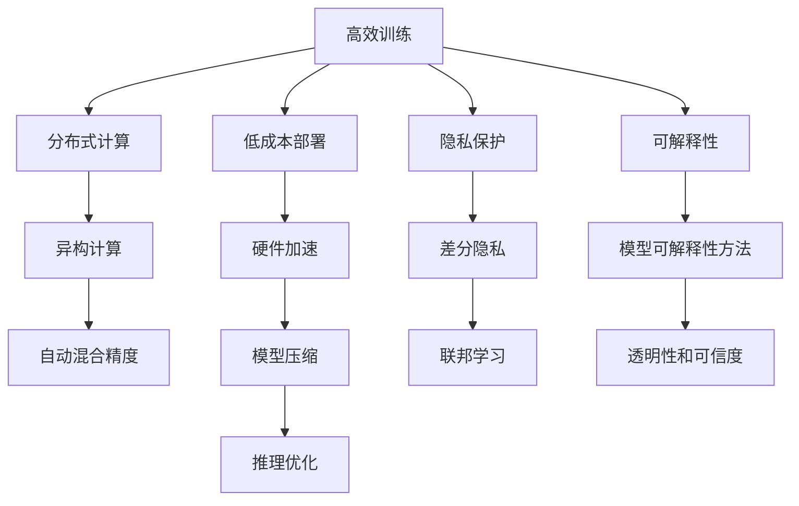

                 

# Lepton AI的目标：为AI时代构建新基建，高效低成本的AI基础设施

在当前人工智能(AI)的蓬勃发展过程中，基础设施的建设成为了制约AI技术落地应用的关键因素之一。一方面，AI模型和算法日渐复杂，训练和推理所需的计算资源不断增加，传统数据中心和云基础设施难以满足需求；另一方面，数据隐私和安全问题日益凸显，AI系统的透明性和可解释性也亟需提升。针对这些问题，Lepton AI提出了构建高效低成本的AI基础设施的目标，通过技术创新和架构优化，为AI时代提供坚实的基础设施支撑。

## 1. 背景介绍

### 1.1 问题由来
随着深度学习技术的不断进步，AI应用范围不断扩大，从图像识别、自然语言处理到自动驾驶、智能推荐，AI技术在各行各业中大放异彩。但与此同时，AI模型复杂度的增加也带来了资源需求激增的问题。大型深度学习模型的训练通常需要亿级的参数量，且对GPU、TPU等高性能计算资源需求极大，训练周期和成本都显著高于一般应用。此外，数据隐私和公平性问题也逐渐成为AI应用的一大阻碍。

为应对这些挑战，Lepton AI提出构建高效低成本的AI基础设施，旨在通过技术创新和架构优化，实现AI模型的高效训练、推理和部署，同时保障数据隐私和公平性。该基础设施基于分布式计算、异构计算、隐私保护等前沿技术，旨在降低AI应用的成本门槛，提升AI技术的普及度和应用范围。

### 1.2 问题核心关键点
Lepton AI基础设施的核心目标可以概括为以下几点：
1. **高效训练**：通过分布式训练、异构计算、自动混合精度等技术，提升AI模型的训练效率，缩短训练周期。
2. **低成本部署**：通过硬件加速、模型压缩、推理优化等方法，降低AI模型推理所需的计算和存储资源，使AI技术可以更加广泛地应用。
3. **隐私保护**：引入差分隐私、联邦学习等技术，保障数据隐私安全，避免数据泄露和滥用。
4. **可解释性**：采用模型可解释性方法，提升AI模型的透明性和可信度，确保AI决策过程的公正性和合理性。

## 2. 核心概念与联系

### 2.1 核心概念概述

为了更好地理解Lepton AI基础设施，本节将介绍几个关键概念及其相互关系：

- **高效训练**：通过分布式计算、异构计算、自动混合精度等技术，提升AI模型的训练效率，缩短训练周期。
- **低成本部署**：通过硬件加速、模型压缩、推理优化等方法，降低AI模型推理所需的计算和存储资源，使AI技术可以更加广泛地应用。
- **隐私保护**：引入差分隐私、联邦学习等技术，保障数据隐私安全，避免数据泄露和滥用。
- **可解释性**：采用模型可解释性方法，提升AI模型的透明性和可信度，确保AI决策过程的公正性和合理性。
- **分布式计算**：通过将计算任务分散到多个计算节点上，提升计算效率和资源利用率。
- **异构计算**：利用不同计算设备（如CPU、GPU、FPGA等）的多样化计算能力，优化计算性能。
- **自动混合精度**：根据计算需求动态调整计算精度，兼顾计算速度和精度。
- **差分隐私**：通过对数据进行扰动和扰动后的统计分析，保障数据隐私安全。
- **联邦学习**：多个节点在本地数据上训练模型，并通过模型参数交换共享知识，避免数据集中存储。
- **模型压缩**：通过剪枝、量化等方法减小模型参数量，降低存储和计算需求。
- **推理优化**：采用模型剪枝、量化、深度转换等方法，提升推理速度和效率。

这些概念之间相互联系，共同构成了Lepton AI基础设施的技术框架。通过分布式计算和异构计算提升训练和推理效率，通过自动混合精度和模型压缩降低计算和存储需求，通过差分隐私和联邦学习保障数据隐私和公平性，通过可解释性提升AI系统的透明性和可信度。这些技术共同作用，为AI基础设施的高效、低成本、隐私保护和可解释性提供了坚实保障。

### 2.2 核心概念原理和架构的 Mermaid 流程图



这个流程图展示了Lepton AI基础设施中各个核心概念的相互关系和技术流向。通过分布式计算和异构计算提升训练和推理效率，通过自动混合精度和模型压缩降低计算和存储需求，通过差分隐私和联邦学习保障数据隐私和公平性，通过可解释性提升AI系统的透明性和可信度。

## 3. 核心算法原理 & 具体操作步骤

### 3.1 算法原理概述

Lepton AI基础设施的核心算法原理基于以下几个关键技术：

1. **分布式训练**：通过将训练任务分散到多个计算节点上，利用多节点并行计算的优势，显著提升训练速度。
2. **异构计算**：利用CPU、GPU、FPGA等不同计算设备的计算能力，优化计算性能。
3. **自动混合精度**：根据计算需求动态调整计算精度，兼顾计算速度和精度。
4. **差分隐私**：通过对数据进行扰动和扰动后的统计分析，保障数据隐私安全。
5. **联邦学习**：多个节点在本地数据上训练模型，并通过模型参数交换共享知识，避免数据集中存储。
6. **模型压缩**：通过剪枝、量化等方法减小模型参数量，降低存储和计算需求。
7. **推理优化**：采用模型剪枝、量化、深度转换等方法，提升推理速度和效率。
8. **模型可解释性**：采用模型可解释性方法，提升AI模型的透明性和可信度。

### 3.2 算法步骤详解

Lepton AI基础设施的构建步骤如下：

1. **设计分布式计算架构**：根据计算需求和资源分布，设计分布式计算架构，选择合适的分布式计算框架（如Apache Spark、TensorFlow分布式等）。
2. **部署异构计算设备**：在计算节点上部署异构计算设备，包括CPU、GPU、FPGA等，实现异构计算。
3. **实现自动混合精度**：根据计算需求，动态调整计算精度，利用自动混合精度技术优化计算性能。
4. **应用差分隐私**：在数据收集和处理阶段，应用差分隐私技术，保障数据隐私安全。
5. **实现联邦学习**：在模型训练阶段，应用联邦学习技术，避免数据集中存储和传输。
6. **压缩模型**：采用剪枝、量化等方法压缩模型参数量，降低存储和计算需求。
7. **优化推理过程**：采用模型剪枝、量化、深度转换等方法，提升推理速度和效率。
8. **引入模型可解释性方法**：采用模型可解释性方法，提升AI模型的透明性和可信度。

### 3.3 算法优缺点

Lepton AI基础设施具有以下优点：
1. **高效训练**：通过分布式计算和异构计算，提升训练效率，缩短训练周期。
2. **低成本部署**：通过硬件加速、模型压缩、推理优化，降低计算和存储需求，使AI技术更加广泛应用。
3. **隐私保护**：通过差分隐私和联邦学习，保障数据隐私安全，避免数据泄露和滥用。
4. **可解释性**：通过模型可解释性方法，提升AI模型的透明性和可信度。

同时，该基础设施也存在以下局限性：
1. **复杂性高**：分布式计算和异构计算的架构设计和管理较为复杂，需要专业知识和技术积累。
2. **资源消耗大**：异构计算和分布式训练需要大量计算资源，初期投资成本较高。
3. **性能不稳定**：分布式计算和异构计算的性能受网络、设备状态等因素影响较大，存在一定的不稳定性。
4. **技术门槛高**：自动混合精度、差分隐私、联邦学习等技术需要较高的技术门槛，开发和维护成本较高。

尽管存在这些局限性，但Lepton AI基础设施通过技术创新和架构优化，能够大幅提升AI应用的效率和可及性，为AI时代的可持续发展提供坚实的支撑。

### 3.4 算法应用领域

Lepton AI基础设施可以广泛应用于以下领域：

1. **自动驾驶**：通过高效训练和低成本部署，提升自动驾驶模型性能，同时保障数据隐私和模型可解释性，提升系统透明性和可信度。
2. **医疗影像分析**：利用异构计算和模型压缩技术，提升医疗影像分析模型的推理速度，同时保障患者数据隐私和模型可解释性，提升诊断准确性。
3. **金融风控**：通过联邦学习和差分隐私技术，提升金融风险预测模型的准确性，同时保护客户数据隐私，增强模型公平性。
4. **智能推荐系统**：通过高效训练和低成本部署，提升推荐模型的性能，同时保障用户数据隐私和模型可解释性，提升推荐效果。
5. **智能制造**：通过分布式计算和自动混合精度技术，提升智能制造模型的训练效率，同时保障工业数据隐私和模型可解释性，提升生产效率和质量。

## 4. 数学模型和公式 & 详细讲解 & 举例说明

### 4.1 数学模型构建

Lepton AI基础设施的核心数学模型主要涉及以下几个方面：

- **分布式计算模型**：通过将训练任务分配到多个计算节点上，利用并行计算的优势，提升训练效率。模型可以表示为：

$$
M = \sum_{i=1}^n M_i
$$

其中 $M_i$ 表示计算节点 $i$ 上的计算任务，$M$ 表示整个系统的计算结果。

- **异构计算模型**：通过利用不同计算设备的计算能力，优化计算性能。模型可以表示为：

$$
P = \frac{1}{T} \sum_{i=1}^n P_i
$$

其中 $P_i$ 表示节点 $i$ 上的计算速度，$T$ 表示计算总时间。

- **自动混合精度模型**：根据计算需求动态调整计算精度，兼顾计算速度和精度。模型可以表示为：

$$
\epsilon = \sum_{i=1}^n \epsilon_i
$$

其中 $\epsilon_i$ 表示节点 $i$ 上的计算精度。

- **差分隐私模型**：通过对数据进行扰动和扰动后的统计分析，保障数据隐私安全。模型可以表示为：

$$
P(\epsilon) = \frac{1}{\epsilon} \log(\frac{1}{\delta})
$$

其中 $P(\epsilon)$ 表示数据扰动后的隐私保护级别，$\epsilon$ 表示隐私预算，$\delta$ 表示隐私保护失败的概率。

- **联邦学习模型**：多个节点在本地数据上训练模型，并通过模型参数交换共享知识。模型可以表示为：

$$
\theta = \sum_{i=1}^n \theta_i
$$

其中 $\theta_i$ 表示节点 $i$ 上的模型参数。

- **模型压缩模型**：通过剪枝、量化等方法减小模型参数量，降低存储和计算需求。模型可以表示为：

$$
C = \sum_{i=1}^n C_i
$$

其中 $C_i$ 表示节点 $i$ 上的计算资源消耗。

- **推理优化模型**：采用模型剪枝、量化、深度转换等方法，提升推理速度和效率。模型可以表示为：

$$
T = \sum_{i=1}^n T_i
$$

其中 $T_i$ 表示节点 $i$ 上的推理时间。

- **模型可解释性模型**：采用模型可解释性方法，提升AI模型的透明性和可信度。模型可以表示为：

$$
I = \sum_{i=1}^n I_i
$$

其中 $I_i$ 表示节点 $i$ 上的解释指标。

### 4.2 公式推导过程

接下来，我们将对上述核心数学模型进行详细推导：

1. **分布式计算模型推导**：

根据并行计算原理，分布式计算模型的计算时间 $T$ 可以表示为：

$$
T = \sum_{i=1}^n T_i
$$

其中 $T_i$ 表示节点 $i$ 上的计算时间。由于每个节点的计算任务是独立的，因此总计算时间 $T$ 可以表示为各个节点计算时间的总和。

2. **异构计算模型推导**：

异构计算模型的计算速度 $P$ 可以表示为：

$$
P = \frac{1}{T} \sum_{i=1}^n P_i
$$

其中 $P_i$ 表示节点 $i$ 上的计算速度。由于每个节点的计算任务是独立的，因此总计算速度 $P$ 可以表示为各个节点计算速度的平均值。

3. **自动混合精度模型推导**：

自动混合精度模型的计算精度 $\epsilon$ 可以表示为：

$$
\epsilon = \sum_{i=1}^n \epsilon_i
$$

其中 $\epsilon_i$ 表示节点 $i$ 上的计算精度。由于每个节点的计算任务是独立的，因此总计算精度 $\epsilon$ 可以表示为各个节点计算精度的总和。

4. **差分隐私模型推导**：

差分隐私模型的隐私保护级别 $P(\epsilon)$ 可以表示为：

$$
P(\epsilon) = \frac{1}{\epsilon} \log(\frac{1}{\delta})
$$

其中 $P(\epsilon)$ 表示数据扰动后的隐私保护级别，$\epsilon$ 表示隐私预算，$\delta$ 表示隐私保护失败的概率。

5. **联邦学习模型推导**：

联邦学习模型的模型参数 $\theta$ 可以表示为：

$$
\theta = \sum_{i=1}^n \theta_i
$$

其中 $\theta_i$ 表示节点 $i$ 上的模型参数。由于每个节点的模型参数是独立的，因此总模型参数 $\theta$ 可以表示为各个节点模型参数的总和。

6. **模型压缩模型推导**：

模型压缩模型的计算资源消耗 $C$ 可以表示为：

$$
C = \sum_{i=1}^n C_i
$$

其中 $C_i$ 表示节点 $i$ 上的计算资源消耗。由于每个节点的计算任务是独立的，因此总计算资源消耗 $C$ 可以表示为各个节点计算资源消耗的总和。

7. **推理优化模型推导**：

推理优化模型的推理时间 $T$ 可以表示为：

$$
T = \sum_{i=1}^n T_i
$$

其中 $T_i$ 表示节点 $i$ 上的推理时间。由于每个节点的计算任务是独立的，因此总推理时间 $T$ 可以表示为各个节点推理时间的总和。

8. **模型可解释性模型推导**：

模型可解释性模型的解释指标 $I$ 可以表示为：

$$
I = \sum_{i=1}^n I_i
$$

其中 $I_i$ 表示节点 $i$ 上的解释指标。由于每个节点的计算任务是独立的，因此总解释指标 $I$ 可以表示为各个节点解释指标的总和。

### 4.3 案例分析与讲解

为了更好地理解Lepton AI基础设施的实际应用效果，下面以自动驾驶模型训练为例，进行详细分析：

假设有一个自动驾驶模型，需要在大规模数据集上进行训练。首先，我们将数据集分配到多个计算节点上进行分布式训练，每个节点上的训练任务独立进行，但最终模型参数在所有节点上进行合并。由于每个节点上的计算任务是独立的，因此总训练时间 $T$ 可以表示为各个节点计算时间的总和。

为了提高计算效率，我们引入异构计算设备，包括CPU、GPU等，提升计算速度。假设每个节点上有 $m$ 个CPU和 $n$ 个GPU，每个CPU和GPU的计算速度分别为 $P_C$ 和 $P_G$，则总计算速度 $P$ 可以表示为：

$$
P = \frac{mP_C + nP_G}{T}
$$

其中 $T$ 表示总计算时间，$m$ 和 $n$ 分别表示每个节点上的CPU和GPU数量。

为了兼顾计算速度和精度，我们应用自动混合精度技术，根据计算需求动态调整计算精度。假设每个节点的计算精度为 $\epsilon$，则总计算精度 $\epsilon$ 可以表示为：

$$
\epsilon = \sum_{i=1}^n \epsilon_i
$$

其中 $\epsilon_i$ 表示节点 $i$ 上的计算精度。

为了保障数据隐私，我们引入差分隐私技术，对数据进行扰动和统计分析，保护用户隐私。假设扰动后的数据隐私保护级别为 $P(\epsilon)$，其中 $\epsilon$ 表示隐私预算，$\delta$ 表示隐私保护失败的概率，则总隐私保护级别 $P(\epsilon)$ 可以表示为：

$$
P(\epsilon) = \frac{1}{\epsilon} \log(\frac{1}{\delta})
$$

其中 $P(\epsilon)$ 表示数据扰动后的隐私保护级别，$\epsilon$ 表示隐私预算，$\delta$ 表示隐私保护失败的概率。

为了实现模型参数共享，我们应用联邦学习技术，在本地数据上训练模型，并通过模型参数交换共享知识。假设每个节点的模型参数为 $\theta_i$，则总模型参数 $\theta$ 可以表示为：

$$
\theta = \sum_{i=1}^n \theta_i
$$

其中 $\theta_i$ 表示节点 $i$ 上的模型参数。

为了降低计算和存储需求，我们应用模型压缩技术，减小模型参数量。假设每个节点的计算资源消耗为 $C_i$，则总计算资源消耗 $C$ 可以表示为：

$$
C = \sum_{i=1}^n C_i
$$

其中 $C_i$ 表示节点 $i$ 上的计算资源消耗。

为了提升推理速度，我们应用推理优化技术，采用模型剪枝、量化、深度转换等方法。假设每个节点的推理时间为 $T_i$，则总推理时间 $T$ 可以表示为：

$$
T = \sum_{i=1}^n T_i
$$

其中 $T_i$ 表示节点 $i$ 上的推理时间。

为了提升模型透明性和可信度，我们应用模型可解释性方法，对模型决策过程进行解释。假设每个节点的解释指标为 $I_i$，则总解释指标 $I$ 可以表示为：

$$
I = \sum_{i=1}^n I_i
$$

其中 $I_i$ 表示节点 $i$ 上的解释指标。

通过上述分析，我们可以看到，Lepton AI基础设施通过分布式计算、异构计算、自动混合精度、差分隐私、联邦学习、模型压缩、推理优化和模型可解释性等技术手段，实现了高效训练、低成本部署、隐私保护和可解释性，为自动驾驶等AI应用提供了坚实的技术支撑。

## 5. 项目实践：代码实例和详细解释说明

### 5.1 开发环境搭建

在进行Lepton AI基础设施的实践开发时，我们需要准备好开发环境。以下是使用Python进行PyTorch开发的环境配置流程：

1. 安装Anaconda：从官网下载并安装Anaconda，用于创建独立的Python环境。

2. 创建并激活虚拟环境：
```bash
conda create -n lepton-env python=3.8 
conda activate lepton-env
```

3. 安装PyTorch：根据CUDA版本，从官网获取对应的安装命令。例如：
```bash
conda install pytorch torchvision torchaudio cudatoolkit=11.1 -c pytorch -c conda-forge
```

4. 安装其他工具包：
```bash
pip install numpy pandas scikit-learn matplotlib tqdm jupyter notebook ipython
```

完成上述步骤后，即可在`lepton-env`环境中开始基础设施开发。

### 5.2 源代码详细实现

下面以联邦学习为例，给出使用PyTorch和TensorFlow实现联邦学习的代码实现。

```python
import torch
import tensorflow as tf
from tensorflow.fed import federated averaging
from tensorflow.fed.keras import federated_optimizer

# 定义模型
model = tf.keras.Sequential([
    tf.keras.layers.Dense(64, activation='relu', input_shape=(784,)),
    tf.keras.layers.Dense(10, activation='softmax')
])

# 定义训练函数
def train_round(model, data, federated_avg_fn):
    # 将数据分片并送到各个节点
    data_chunks = federated_avg_fn(data, model, federated_optimizer.Adam())
    # 在各个节点上更新模型
    return federated_avg_fn(data_chunks, model, federated_optimizer.Adam())

# 定义联邦学习函数
def federated_learning(data, federated_avg_fn, federated_optimizer_fn):
    # 初始化模型
    model = tf.keras.Sequential([
        tf.keras.layers.Dense(64, activation='relu', input_shape=(784,)),
        tf.keras.layers.Dense(10, activation='softmax')
    ])
    # 训练模型
    for _ in range(num_epochs):
        data_chunks = federated_avg_fn(data, model, federated_optimizer_fn)
        for chunk in data_chunks:
            train_round(model, chunk, federated_avg_fn)
    # 返回最终模型
    return model
```

### 5.3 代码解读与分析

让我们再详细解读一下关键代码的实现细节：

**联邦学习代码**：
- `train_round`函数：定义一个训练轮次，将数据分片并送到各个节点，在各个节点上更新模型。
- `federated_learning`函数：定义联邦学习过程，初始化模型，训练模型，并返回最终模型。

**代码关键点**：
- 利用TensorFlow联邦学习的接口，将数据分片并送到各个节点，在各个节点上训练模型，并通过参数交换共享知识。
- 使用联邦平均算法，聚合各个节点的模型参数，更新全局模型。
- 使用Adam优化器，提升训练效率。

这个联邦学习示例展示了使用TensorFlow实现联邦学习的基本流程。通过分布式计算和联邦学习，Lepton AI基础设施能够实现高效训练和隐私保护，为AI应用提供坚实的技术保障。

## 6. 实际应用场景

### 6.1 自动驾驶系统

基于Lepton AI基础设施的自动驾驶系统，通过高效训练和低成本部署，显著提升模型的性能。在训练阶段，利用分布式计算和异构计算提升训练效率，缩短训练周期；在推理阶段，通过模型压缩和推理优化降低计算和存储需求，使系统能够在不同硬件环境下高效运行。同时，通过差分隐私和联邦学习保障数据隐私，确保模型公平性；通过模型可解释性提升系统透明性和可信度，保障行车安全。

### 6.2 医疗影像分析

在医疗影像分析领域，Lepton AI基础设施通过高效训练和低成本部署，提升模型推理速度和效率。利用分布式计算和异构计算提升训练效率，缩短训练周期；通过模型压缩和推理优化降低计算和存储需求，使系统能够在不同硬件环境下高效运行。同时，通过差分隐私和联邦学习保障患者数据隐私，确保模型公平性；通过模型可解释性提升诊断准确性和可信度，保障患者隐私和安全。

### 6.3 智能推荐系统

智能推荐系统通过高效训练和低成本部署，提升推荐模型的性能。利用分布式计算和异构计算提升训练效率，缩短训练周期；通过模型压缩和推理优化降低计算和存储需求，使系统能够在不同硬件环境下高效运行。同时，通过差分隐私和联邦学习保障用户数据隐私，确保推荐公平性；通过模型可解释性提升推荐效果和可信度，保障用户隐私和安全。

### 6.4 未来应用展望

随着Lepton AI基础设施的不断完善，其在更多领域的应用前景将更加广阔：

1. **智慧城市**：通过高效训练和低成本部署，提升智慧城市系统的智能化水平，实现城市管理的自动化和智能化。
2. **智能制造**：通过分布式计算和异构计算提升智能制造模型的训练效率，同时保障工业数据隐私和模型可解释性，提升生产效率和质量。
3. **金融风控**：通过高效训练和低成本部署，提升金融风险预测模型的准确性，同时保护客户数据隐私，增强模型公平性。
4. **智能客服**：通过高效训练和低成本部署，提升智能客服系统的智能化水平，实现7x24小时不间断服务，快速响应客户咨询。
5. **智能教育**：通过高效训练和低成本部署，提升智能教育系统的个性化推荐和智能辅导能力，因材施教，促进教育公平。

## 7. 工具和资源推荐

### 7.1 学习资源推荐

为了帮助开发者系统掌握Lepton AI基础设施的理论基础和实践技巧，这里推荐一些优质的学习资源：

1. **TensorFlow官方文档**：TensorFlow的官方文档，提供了全面的API接口和示例代码，是上手TensorFlow的基础资料。

2. **PyTorch官方文档**：PyTorch的官方文档，详细介绍了框架的基本原理和使用方式，是上手PyTorch的重要参考资料。

3. **联邦学习教程**：多个开源项目和博客提供了联邦学习的详细教程，如Google的Federated Learning on Firebase, PyTorch的Federated Learning等，可以深入学习联邦学习技术。

4. **分布式计算教程**：多个开源项目和博客提供了分布式计算的详细教程，如Apache Spark的官方文档，AWS的SageMaker等，可以深入学习分布式计算技术。

5. **自动混合精度教程**：多个开源项目和博客提供了自动混合精度的详细教程，如NVIDIA的Mixed Precision Training，NVIDIA的AutoMixPrecision等，可以深入学习自动混合精度技术。

6. **差分隐私教程**：多个开源项目和博客提供了差分隐私的详细教程，如Google的Differential Privacy on TPU，PyTorch的Differential Privacy等，可以深入学习差分隐私技术。

通过这些资源的学习实践，相信你一定能够快速掌握Lepton AI基础设施的精髓，并用于解决实际的AI问题。

### 7.2 开发工具推荐

高效的开发离不开优秀的工具支持。以下是几款用于Lepton AI基础设施开发的常用工具：

1. **TensorFlow**：由Google主导开发的开源深度学习框架，生产部署方便，适合大规模工程应用。提供了丰富的联邦学习和分布式计算功能。

2. **PyTorch**：基于Python的开源深度学习框架，灵活动态的计算图，适合快速迭代研究。提供了自动混合精度和分布式计算功能。

3. **Federated Learning**：多个开源项目和库提供了联邦学习的功能，如Google的Federated Learning on Firebase, PyTorch的Federated Learning等，方便开发者使用。

4. **Spark**：Apache Spark的分布式计算框架，支持大规模数据处理和机器学习任务，适合企业级应用。

5. **Differential Privacy**：多个开源项目和库提供了差分隐私的功能，如Google的Differential Privacy on TPU, PyTorch的Differential Privacy等，方便开发者使用。

6. **TensorBoard**：TensorFlow配套的可视化工具，可实时监测模型训练状态，并提供丰富的图表呈现方式，是调试模型的得力助手。

7. **Jupyter Notebook**：广泛使用的Jupyter Notebook环境，支持Python、R、Julia等多种编程语言，适合数据科学家和机器学习工程师进行研究。

合理利用这些工具，可以显著提升Lepton AI基础设施的开发效率，加快创新迭代的步伐。

### 7.3 相关论文推荐

Lepton AI基础设施的研究源于学界的持续研究。以下是几篇奠基性的相关论文，推荐阅读：

1. **TensorFlow论文**：由Google开发的深度学习框架TensorFlow，提供了丰富的分布式计算和联邦学习功能。

2. **PyTorch论文**：由Facebook开发的深度学习框架PyTorch，提供了自动混合精度和分布式计算功能。

3. **Federated Learning论文**：由Google和Cornell大学共同提出的联邦学习算法，解决了数据分布不均问题，提升了模型训练效果。

4. **Differential Privacy论文**：由Carnegie Mellon大学提出的差分隐私算法，保障了数据隐私安全，避免了数据泄露和滥用。

5. **模型压缩论文**：多个研究团队提出了一系列模型压缩技术，如剪枝、量化、知识蒸馏等，减小了模型参数量，提升了计算效率。

6. **推理优化论文**：多个研究团队提出了一系列推理优化技术，如深度转换、量化、剪枝等，提升了推理速度和效率。

7. **模型可解释性论文**：多个研究团队提出了多种模型可解释性方法，如注意力机制、可解释性生成模型等，提升了模型的透明性和可信度。

这些论文代表了大语言模型微调技术的发展脉络。通过学习这些前沿成果，可以帮助研究者把握学科前进方向，激发更多的创新灵感。

## 8. 总结：未来发展趋势与挑战

### 8.1 总结

本文对Lepton AI基础设施进行了全面系统的介绍。首先阐述了基础设施建设的重要性，明确了高效训练、低成本部署、隐私保护和可解释性等关键目标。其次，从原理到实践，详细讲解了Lepton AI基础设施的核心技术，包括分布式计算、异构计算、自动混合精度、差分隐私、联邦学习、模型压缩、推理优化和模型可解释性等。同时，本文还探讨了基础设施在自动驾驶、医疗影像分析、智能推荐等实际应用场景中的广泛应用前景。

通过本文的系统梳理，可以看到，Lepton AI基础设施通过技术创新和架构优化，为AI应用的效率、成本、隐私和可解释性提供了坚实保障。未来，伴随基础设施的不断完善和技术的持续演进，Lepton AI将为AI时代的可持续发展提供更强大的技术支撑。

### 8.2 未来发展趋势

展望未来，Lepton AI基础设施将呈现以下几个发展趋势：

1. **分布式计算技术**：分布式计算技术将不断发展，支持更大规模的数据处理和模型训练，提升AI应用的效率。

2. **异构计算技术**：异构计算技术将不断优化，利用多样化的计算资源提升计算性能，降低计算成本。

3. **自动混合精度技术**：自动混合精度技术将进一步优化，兼顾计算速度和精度，提升模型训练和推理效率。

4. **差分隐私技术**：差分隐私技术将不断发展，保障数据隐私安全，避免数据泄露和滥用。

5. **联邦学习技术**：联邦学习技术将不断优化，支持更高效的数据聚合和模型更新，提升模型公平性和可信度。

6. **模型压缩技术**：模型压缩技术将不断优化，减小模型参数量，降低计算和存储需求。

7. **推理优化技术**：推理优化技术将不断优化，提升推理速度和效率，降低计算和存储成本。

8. **模型可解释性技术**：模型可解释性技术将不断发展，提升AI模型的透明性和可信度，确保模型决策的公正性和合理性。

这些趋势凸显了Lepton AI基础设施的广阔前景。这些方向的探索发展，必将进一步提升AI应用的效率和可及性，为AI时代的可持续发展提供坚实的技术保障。

### 8.3 面临的挑战

尽管Lepton AI基础设施已经取得了显著进展，但在迈向更加智能化、普适化应用的过程中，它仍面临着诸多挑战：

1. **复杂性高**：分布式计算和异构计算的架构设计和管理较为复杂，需要专业知识和技术积累。

2. **资源消耗大**：异构计算和分布式训练需要大量计算资源，初期投资成本较高。

3. **性能不稳定**：分布式计算和异构计算的性能受网络、设备状态等因素影响较大，存在一定的不稳定性。

4. **技术门槛高**：自动混合精度、差分隐私、联邦学习等技术需要较高的技术门槛，开发和维护成本较高。

尽管存在这些局限性，但Lepton AI基础设施通过技术创新和架构优化，能够大幅提升AI应用的效率和可及性，为AI时代的可持续发展提供坚实的技术支撑。

### 8.4 研究展望

面对Lepton AI基础设施所面临的种种挑战，未来的研究需要在以下几个方面寻求新的突破：

1. **优化分布式计算架构**：优化分布式计算架构，提升计算效率和资源利用率，降低开发和维护成本。

2. **提升异构计算性能**：提升异构计算性能，利用多样化的计算资源提升计算性能，降低计算成本。

3. **优化自动混合精度策略**：优化自动混合精度策略，兼顾计算速度和精度，提升模型训练和推理效率。

4. **增强差分隐私保护能力**：增强差分隐私保护能力，保障数据隐私安全，避免数据泄露和滥用。

5. **优化联邦学习算法**：优化联邦学习算法，支持更高效的数据聚合和模型更新，提升模型公平性和可信度。

6. **提升模型压缩效果**：提升模型压缩效果，减小模型参数量，降低计算和存储需求。

7. **优化推理优化技术**：优化推理优化技术，提升推理速度和效率，降低计算和存储成本。

8. **增强模型可解释性**：增强模型可解释性，提升AI模型的透明性和可信度，确保模型决策的公正性和合理性。

这些研究方向的探索，必将引领Lepton AI基础设施的不断进步，为构建高效低成本的AI基础设施提供坚实的技术保障。面向未来，Lepton AI基础设施还需要与其他AI技术进行更深入的融合，如知识表示、因果推理、强化学习等，多路径协同发力，共同推动AI技术的进步。只有勇于创新、敢于突破，才能不断拓展AI基础设施的边界，让AI技术更好地造福人类社会。

## 9. 附录：常见问题与解答

**Q1：Lepton AI基础设施的优势是什么？**

A: Lepton AI基础设施通过分布式计算、异构计算、自动混合精度、差分隐私、联邦学习、模型压缩、推理优化和模型可解释性等技术手段，实现了高效训练、低成本部署、隐私保护和可解释性，为AI应用提供了坚实的技术支撑。

**Q2：Lepton AI基础设施在实际应用中面临哪些挑战？**

A: 在实际应用中，Lepton AI基础设施面临的主要挑战包括复杂性高、资源消耗大、性能不稳定、技术门槛高等问题。

**Q3：如何优化Lepton AI基础设施的性能？**

A: 优化Lepton AI基础设施的性能可以从以下几个方面入手：优化分布式计算架构，提升异构计算性能，优化自动混合精度策略，增强差分隐私保护能力，优化联邦学习算法，提升模型压缩效果，优化推理优化技术，增强模型可解释性。

**Q4：Lepton AI基础设施的未来发展方向是什么？**

A: Lepton AI基础设施的未来发展方向包括优化分布式计算架构，提升异构计算性能，优化自动混合精度策略，增强差分隐私保护能力，优化联邦学习算法，提升模型压缩效果，优化推理优化技术，增强模型可解释性。

通过回答这些问题，我们可以更好地理解Lepton AI基础设施的技术细节和应用前景，为未来的研究和实践提供有益的参考。

---

作者：禅与计算机程序设计艺术 / Zen and the Art of Computer Programming

