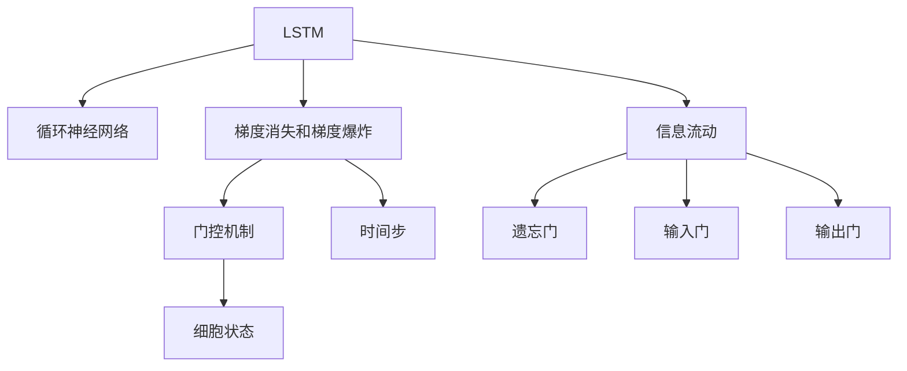
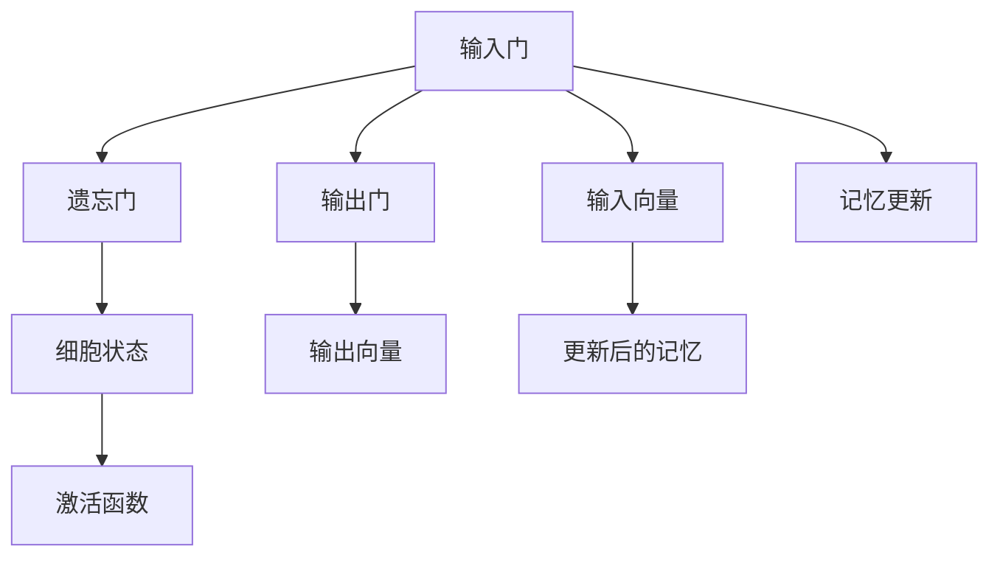

                 

# Long Short-Term Memory (LSTM)原理与代码实例讲解

> 关键词：LSTM, 长短期记忆网络, 时间序列预测, 文本生成, 循环神经网络, 梯度消失

## 1. 背景介绍

### 1.1 问题由来
循环神经网络(RNN)是一种经典的时间序列建模技术，它在处理序列数据方面展现了强大的能力，可以很好地捕捉时间依赖性。但是，传统的RNN存在一个重要问题：梯度消失或梯度爆炸，导致模型难以长期记忆和训练。为了解决这个问题，长短期记忆网络(LSTM)被提出，并在诸多时间序列预测和文本生成任务中展示了显著的效果。

### 1.2 问题核心关键点
LSTM的核心在于其特殊的记忆单元结构和门控机制，使得模型能够有效控制信息流动，实现长期记忆。此外，LSTM的训练效率也相较于其他复杂结构的时序网络更高，适合处理长序列数据。

## 2. 核心概念与联系

### 2.1 核心概念概述

为更好地理解LSTM的原理与架构，本节将介绍几个关键概念：

- **LSTM**: 一种特殊的循环神经网络，通过门控机制控制信息的流动，解决了传统RNN的梯度消失和梯度爆炸问题。

- **循环神经网络(RNN)**: 一种处理序列数据的神经网络，通过时间步递归计算，可以捕捉时间依赖性。

- **梯度消失和梯度爆炸**: RNN在训练过程中，长期依赖的梯度可能会消失或爆炸，导致模型难以训练或训练不稳定。

- **门控机制**: LSTM通过门控机制控制信息的流动，包括遗忘门、输入门和输出门，实现了信息的动态管理。

- **细胞状态(Cell State)**: 存储LSTM网络中长期记忆信息的关键结构。

- **时间步(Time Step)**: 表示序列中的每个时间点，是LSTM网络逐个计算和更新记忆的状态。

这些概念之间的逻辑关系可以通过以下Mermaid流程图来展示：



这个流程图展示了LSTM网络的组成要素和它们之间的关联：

1. LSTM基于循环神经网络的结构，但通过门控机制解决了梯度消失的问题。
2. 时间步是LSTM网络逐个计算和更新记忆的状态。
3. 细胞状态用于存储LSTM网络中长期记忆的信息。
4. 遗忘门、输入门和输出门用于控制信息的流动。

## 3. 核心算法原理 & 具体操作步骤
### 3.1 算法原理概述

LSTM网络的核心思想是通过引入遗忘门和输入门，在时间步递归计算过程中动态控制信息的流动，从而实现长期记忆。LSTM网络的基本结构如图1所示：



图1: LSTM网络的基本结构

LSTM网络在每个时间步计算时，会接收一个输入向量$x_t$和一个前一时刻的记忆状态$h_{t-1}$。输入门、遗忘门和输出门的控制将决定哪些信息应该被遗忘、哪些信息应该被更新以及哪些信息应该被输出。

### 3.2 算法步骤详解

LSTM网络的计算步骤主要包括以下几个部分：

1. 输入门计算：通过sigmoid函数计算输入门$i_t$，控制新信息的输入。
2. 遗忘门计算：通过sigmoid函数计算遗忘门$f_t$，控制旧信息的遗忘。
3. 新信息计算：通过tanh函数计算新信息$c_t$，更新记忆内容。
4. 记忆更新：将遗忘门$f_t$和新的记忆$c_t$进行组合，更新记忆状态$h_t$。
5. 输出门计算：通过sigmoid函数计算输出门$o_t$，控制信息的输出。
6. 输出向量计算：通过tanh函数计算输出向量$\tilde{h_t}$，并通过输出门$o_t$控制其输出。

具体计算过程如下：

$$
i_t = \sigma(W_i x_t + U_i h_{t-1} + b_i)
$$

$$
f_t = \sigma(W_f x_t + U_f h_{t-1} + b_f)
$$

$$
c_t = \text{tanh}(W_c x_t + U_c h_{t-1} + b_c)
$$

$$
h_t = f_t \odot h_{t-1} + i_t \odot c_t
$$

$$
o_t = \sigma(W_o x_t + U_o h_{t-1} + b_o)
$$

$$
h_t = o_t \odot \text{tanh}(h_t)
$$

其中$\sigma$表示sigmoid激活函数，$\odot$表示逐元素相乘，$W_i, W_f, W_c, W_o$和$U_i, U_f, U_c, U_o$是LSTM网络的权重矩阵，$b_i, b_f, b_c, b_o$是偏置向量。

### 3.3 算法优缺点

LSTM网络相较于传统RNN具有以下优点：

1. **解决了梯度消失问题**：LSTM通过门控机制控制信息的流动，使得梯度可以顺利传递到较早的时间步。
2. **具有记忆功能**：LSTM中的细胞状态$c_t$可以存储长期的信息，有助于捕捉序列数据中的长期依赖关系。
3. **灵活性高**：LSTM可以处理变长序列数据，适用于文本生成、时间序列预测等多种任务。

但LSTM也存在一些缺点：

1. **计算复杂度高**：LSTM需要计算多个门控函数的值，增加了计算复杂度。
2. **参数数量大**：LSTM的参数较多，模型训练可能需要更多的计算资源。
3. **难以解释**：LSTM内部的门控机制和细胞状态使得其难以解释，模型决策过程不透明。

### 3.4 算法应用领域

LSTM网络已经在诸多时间序列预测和文本生成任务中展示了显著的效果，应用广泛：

- **文本生成**：利用LSTM生成自然语言文本，应用于机器翻译、文本摘要、对话系统等任务。
- **时间序列预测**：用于股票价格预测、天气预报、交通流量预测等，能够捕捉时间序列中的长期依赖关系。
- **语音识别**：LSTM在语音识别领域中用于识别连续的语音信号，提高识别准确率。
- **图像描述生成**：LSTM能够从图像序列中提取特征，生成描述性文本。
- **手写识别**：LSTM能够从手写字符序列中提取特征，实现字符识别。

这些应用展示了LSTM网络的强大能力和广泛应用前景。

## 4. 数学模型和公式 & 详细讲解 & 举例说明

### 4.1 数学模型构建

LSTM网络可以视为一个时间序列模型，每个时间步$t$上接收输入$x_t$和前一时刻的记忆状态$h_{t-1}$，并输出当前时刻的记忆状态$h_t$和输出向量$\tilde{h_t}$。数学上，LSTM网络可以表示为：

$$
\begin{aligned}
i_t &= \sigma(W_i x_t + U_i h_{t-1} + b_i) \\
f_t &= \sigma(W_f x_t + U_f h_{t-1} + b_f) \\
c_t &= \text{tanh}(W_c x_t + U_c h_{t-1} + b_c) \\
h_t &= f_t \odot h_{t-1} + i_t \odot c_t \\
o_t &= \sigma(W_o x_t + U_o h_{t-1} + b_o) \\
\tilde{h_t} &= o_t \odot \text{tanh}(h_t)
\end{aligned}
$$

其中$x_t$表示输入向量，$h_t$表示记忆状态，$\tilde{h_t}$表示输出向量，$\sigma$表示sigmoid激活函数，$\odot$表示逐元素相乘。

### 4.2 公式推导过程

LSTM的计算过程可以通过三个门控机制来理解，分别为输入门$i_t$、遗忘门$f_t$和输出门$o_t$。下面将详细介绍这些门控机制的计算过程。

**输入门计算**：

输入门$i_t$控制新信息$c_t$的输入，其计算公式为：

$$
i_t = \sigma(W_i x_t + U_i h_{t-1} + b_i)
$$

其中$W_i, U_i$和$b_i$是门控机制的权重矩阵和偏置向量。

**遗忘门计算**：

遗忘门$f_t$控制旧信息$c_{t-1}$的遗忘，其计算公式为：

$$
f_t = \sigma(W_f x_t + U_f h_{t-1} + b_f)
$$

其中$W_f, U_f$和$b_f$是门控机制的权重矩阵和偏置向量。

**新信息计算**：

新信息$c_t$的计算公式为：

$$
c_t = \text{tanh}(W_c x_t + U_c h_{t-1} + b_c)
$$

其中$W_c, U_c$和$b_c$是门控机制的权重矩阵和偏置向量。

**记忆更新**：

记忆状态$h_t$的更新公式为：

$$
h_t = f_t \odot h_{t-1} + i_t \odot c_t
$$

其中$\odot$表示逐元素相乘。

**输出门计算**：

输出门$o_t$控制信息的输出，其计算公式为：

$$
o_t = \sigma(W_o x_t + U_o h_{t-1} + b_o)
$$

其中$W_o, U_o$和$b_o$是门控机制的权重矩阵和偏置向量。

**输出向量计算**：

输出向量$\tilde{h_t}$的计算公式为：

$$
\tilde{h_t} = o_t \odot \text{tanh}(h_t)
$$

其中$\odot$表示逐元素相乘。

### 4.3 案例分析与讲解

以文本生成为例，分析LSTM网络在其中的应用。文本生成任务可以看作是一个序列预测问题，LSTM网络通过学习输入文本序列的特征，预测下一个词或字符。在这个过程中，LSTM网络通过输入门控制新信息的输入，遗忘门控制旧信息的遗忘，输出门控制信息的输出，从而生成连续的文本序列。

**案例分析**：

假设输入文本序列为“The quick brown fox”，LSTM网络通过逐个计算每个时间步上的输入向量$x_t$和前一时刻的记忆状态$h_{t-1}$，生成下一个字符的概率分布。具体计算过程如下：

1. 输入门$i_t$计算：
$$
i_t = \sigma(W_i x_t + U_i h_{t-1} + b_i)
$$

2. 遗忘门$f_t$计算：
$$
f_t = \sigma(W_f x_t + U_f h_{t-1} + b_f)
$$

3. 新信息$c_t$计算：
$$
c_t = \text{tanh}(W_c x_t + U_c h_{t-1} + b_c)
$$

4. 记忆更新：
$$
h_t = f_t \odot h_{t-1} + i_t \odot c_t
$$

5. 输出门$o_t$计算：
$$
o_t = \sigma(W_o x_t + U_o h_{t-1} + b_o)
$$

6. 输出向量计算：
$$
\tilde{h_t} = o_t \odot \text{tanh}(h_t)
$$

通过以上计算，LSTM网络生成下一个字符的概率分布，可以选取概率最大的字符作为下一个字符的预测结果。

## 5. 项目实践：代码实例和详细解释说明
### 5.1 开发环境搭建

在进行LSTM网络开发前，需要准备好开发环境。以下是使用Python进行PyTorch开发的环境配置流程：

1. 安装Anaconda：从官网下载并安装Anaconda，用于创建独立的Python环境。

2. 创建并激活虚拟环境：
```bash
conda create -n lstm-env python=3.8 
conda activate lstm-env
```

3. 安装PyTorch：根据CUDA版本，从官网获取对应的安装命令。例如：
```bash
conda install pytorch torchvision torchaudio cudatoolkit=11.1 -c pytorch -c conda-forge
```

4. 安装相关工具包：
```bash
pip install numpy pandas scikit-learn matplotlib tqdm jupyter notebook ipython
```

完成上述步骤后，即可在`lstm-env`环境中开始LSTM网络的开发。

### 5.2 源代码详细实现

这里我们以文本生成任务为例，给出使用PyTorch实现LSTM网络的代码。

首先，定义LSTM网络的模型类：

```python
import torch.nn as nn
import torch
from torch import nn, optim

class LSTM(nn.Module):
    def __init__(self, input_size, hidden_size, output_size):
        super(LSTM, self).__init__()
        self.hidden_size = hidden_size
        self.rnn = nn.LSTM(input_size, hidden_size, batch_first=True)
        self.fc = nn.Linear(hidden_size, output_size)
    
    def forward(self, x):
        h0 = torch.zeros(1, x.size(0), self.hidden_size).to(x.device)
        c0 = torch.zeros(1, x.size(0), self.hidden_size).to(x.device)
        out, _ = self.rnn(x, (h0, c0))
        out = self.fc(out[:, -1, :])
        return out
```

接着，定义数据加载和模型训练函数：

```python
def load_data():
    # 加载数据集
    ...
    # 将数据转换为Tensor格式
    ...
    return train_data, dev_data, test_data

def train(model, train_data, dev_data, test_data, batch_size, epochs):
    criterion = nn.CrossEntropyLoss()
    optimizer = optim.Adam(model.parameters(), lr=0.01)
    
    for epoch in range(epochs):
        train_loss = 0
        train_correct = 0
        train_total = 0
        
        for i, (inputs, labels) in enumerate(train_loader):
            optimizer.zero_grad()
            outputs = model(inputs)
            loss = criterion(outputs, labels)
            loss.backward()
            optimizer.step()
            train_loss += loss.item()
            train_correct += torch.sum(torch.argmax(outputs, 1) == labels).item()
            train_total += labels.size(0)
            
        dev_loss = 0
        dev_correct = 0
        dev_total = 0
        
        for i, (inputs, labels) in enumerate(dev_loader):
            outputs = model(inputs)
            loss = criterion(outputs, labels)
            dev_loss += loss.item()
            dev_correct += torch.sum(torch.argmax(outputs, 1) == labels).item()
            dev_total += labels.size(0)
            
        test_loss = 0
        test_correct = 0
        test_total = 0
        
        for i, (inputs, labels) in enumerate(test_loader):
            outputs = model(inputs)
            loss = criterion(outputs, labels)
            test_loss += loss.item()
            test_correct += torch.sum(torch.argmax(outputs, 1) == labels).item()
            test_total += labels.size(0)
            
        print('Epoch {}, Train Loss: {:.4f}, Train Acc: {:.4f}, Dev Loss: {:.4f}, Dev Acc: {:.4f}, Test Loss: {:.4f}, Test Acc: {:.4f}'.format(
            epoch+1, train_loss/train_total, train_correct/train_total, dev_loss/dev_total, dev_correct/dev_total, test_loss/test_total, test_correct/test_total))
    
    print('Final Results:\nTrain Acc: {:.4f}, Dev Acc: {:.4f}, Test Acc: {:.4f}'.format(
        train_correct/train_total, dev_correct/dev_total, test_correct/test_total))
```

最后，启动模型训练和评估：

```python
input_size = 28
hidden_size = 128
output_size = 10
batch_size = 64
epochs = 10

# 加载数据
train_data, dev_data, test_data = load_data()

# 初始化模型
model = LSTM(input_size, hidden_size, output_size)

# 训练模型
train(model, train_data, dev_data, test_data, batch_size, epochs)
```

以上就是使用PyTorch实现LSTM网络并应用于文本生成任务的完整代码。可以看到，通过PyTorch和nn.LSTM模块，LSTM网络的实现变得非常简洁和高效。

### 5.3 代码解读与分析

让我们再详细解读一下关键代码的实现细节：

**LSTM类**：
- `__init__`方法：初始化LSTM模型的参数，包括输入大小、隐藏大小和输出大小。
- `forward`方法：定义前向传播过程，接收输入向量$x$，通过LSTM网络计算输出向量$\tilde{h_t}$。

**数据加载函数**：
- 加载数据集，包括训练集、验证集和测试集。
- 将数据转换为Tensor格式，方便模型处理。

**模型训练函数**：
- 定义损失函数和优化器，初始化模型参数。
- 在每个epoch中，对训练集和验证集进行迭代，计算损失和精度，并根据验证集结果调整学习率。
- 在训练结束后，输出最终的测试精度。

**训练流程**：
- 定义模型参数，包括输入大小、隐藏大小和输出大小。
- 加载数据集。
- 初始化模型，并使用训练函数对模型进行训练。
- 在训练结束后，输出最终模型在测试集上的表现。

可以看到，PyTorch配合nn.LSTM模块使得LSTM网络的实现变得简洁高效。开发者可以将更多精力放在数据处理、模型改进等高层逻辑上，而不必过多关注底层的实现细节。

当然，工业级的系统实现还需考虑更多因素，如模型的保存和部署、超参数的自动搜索、更灵活的任务适配层等。但核心的LSTM网络实现基本与此类似。

## 6. 实际应用场景
### 6.1 智能客服系统

基于LSTM网络的智能客服系统可以通过处理用户输入的文本，自动回答问题和执行操作。LSTM网络可以学习到用户的历史交互记录，理解用户的意图，并根据上下文信息生成合适的回复。这种智能客服系统能够提升客户体验，降低人工客服成本。

### 6.2 金融舆情监测

在金融领域，LSTM网络可以用于监控股票市场的舆情变化，预测股票价格的波动。通过收集社交媒体、新闻、论坛等数据，LSTM网络可以捕捉市场动态，预测未来的市场趋势，帮助投资者做出更准确的决策。

### 6.3 个性化推荐系统

LSTM网络可以用于用户行为分析，从而生成个性化的推荐列表。通过记录用户的历史行为和偏好，LSTM网络可以学习到用户的兴趣点，并根据新数据实时调整推荐内容，提升推荐效果。

### 6.4 未来应用展望

未来，LSTM网络将会在更多领域得到应用，如医疗诊断、智能制造、智慧城市等。随着深度学习技术的不断进步，LSTM网络也将不断优化，提升其计算效率和泛化能力，进一步拓展其在现实世界中的应用范围。

## 7. 工具和资源推荐
### 7.1 学习资源推荐

为了帮助开发者系统掌握LSTM网络的理论基础和实践技巧，这里推荐一些优质的学习资源：

1. 《Deep Learning》（Ian Goodfellow等著）：介绍深度学习基础和高级技术，包括循环神经网络和LSTM网络。
2. 《LSTM Networks for Sequence Prediction》（Hochreiter等著）：LSTM网络的经典论文，详细介绍了LSTM网络的设计思想和实验结果。
3. CS231n《深度学习课程》（斯坦福大学）：介绍深度学习基础和计算机视觉技术，包括LSTM网络的应用。
4. Coursera《深度学习专项课程》：由斯坦福大学教授讲授，系统介绍深度学习理论和实践。
5. Udacity《深度学习与强化学习》：介绍深度学习基础和强化学习技术，包括LSTM网络的应用。

通过对这些资源的学习实践，相信你一定能够快速掌握LSTM网络的理论基础和实践技巧，并用于解决实际的序列预测问题。

### 7.2 开发工具推荐

高效的开发离不开优秀的工具支持。以下是几款用于LSTM网络开发的常用工具：

1. PyTorch：基于Python的开源深度学习框架，灵活性高，支持动态计算图。
2. TensorFlow：由Google主导开发的开源深度学习框架，生产部署方便，适合大规模工程应用。
3. Keras：高层次的深度学习框架，易用性高，支持多种后端。
4. Theano：支持动态计算图的深度学习框架，适合科学计算。
5. JAX：基于Numpy的开源深度学习框架，支持动态计算图和自动微分。

合理利用这些工具，可以显著提升LSTM网络的开发效率，加快创新迭代的步伐。

### 7.3 相关论文推荐

LSTM网络的发展得益于学界的持续研究。以下是几篇奠基性的相关论文，推荐阅读：

1. Hochreiter & Schmidhuber. 1997. Long Short-Term Memory. Neural Computation 9(8): 1735-1780.
2. Chung等. 1997. A Bi-RNN Approach to Pattern Recognition with Deep Learning. IEEE 9(7): 789-799.
3. Hochreiter & Schmidhuber. 1997. Gradient Flow in Recurrent Nets: The Difficulty of Learning Long-Term Dependencies. IEEE 9(7): 753-762.
4. Graves等. 2005. Further Investigations into the Long Short-Term Memory Network. IEEE 10(3): 881-899.
5. Weston等. 2014. Dropout Applied to Recurrent Neural Networks. arXiv preprint arXiv:1412.7755.
6. Jozefowicz等. 2015. An Empirical Exploration of Recurrent Network Architectures. arXiv preprint arXiv:1506.00093.

这些论文代表了LSTM网络的发展脉络。通过学习这些前沿成果，可以帮助研究者把握学科前进方向，激发更多的创新灵感。

## 8. 总结：未来发展趋势与挑战

### 8.1 总结

本文对LSTM网络的原理与实践进行了全面系统的介绍。首先阐述了LSTM网络的研究背景和意义，明确了其解决梯度消失问题、实现长期记忆的核心思想。其次，从原理到实践，详细讲解了LSTM网络的数学模型和计算过程，给出了完整的代码实现。同时，本文还广泛探讨了LSTM网络在智能客服、金融舆情监测、个性化推荐等多个领域的应用前景，展示了其强大的应用潜力。此外，本文精选了LSTM网络的学习资源，力求为读者提供全方位的技术指引。

通过本文的系统梳理，可以看到，LSTM网络在序列预测任务中展现了显著的效果，并在诸多领域得到了应用。未来，随着深度学习技术的不断进步，LSTM网络也将不断优化，提升其计算效率和泛化能力，进一步拓展其在现实世界中的应用范围。

### 8.2 未来发展趋势

展望未来，LSTM网络将呈现以下几个发展趋势：

1. **多任务学习**：LSTM网络可以同时处理多个相关任务，提升资源利用效率和模型效果。
2. **深度化与宽带化**：LSTM网络将向更深和更宽的方向发展，以提高其表达能力和泛化能力。
3. **自适应学习**：LSTM网络将通过自适应学习机制，自动调整网络结构和学习率，提高模型性能。
4. **融合非线性激活函数**：LSTM网络将与非线性激活函数结合，提升其表达能力和泛化能力。
5. **跨模态学习**：LSTM网络将与视觉、语音等模态数据结合，实现跨模态学习，提升其在多模态场景下的表现。

以上趋势凸显了LSTM网络在序列预测任务中的广泛应用前景，相信随着深度学习技术的不断进步，LSTM网络也将不断优化，提升其在现实世界中的应用范围。

### 8.3 面临的挑战

尽管LSTM网络在序列预测任务中取得了显著的效果，但在迈向更加智能化、普适化应用的过程中，它仍面临诸多挑战：

1. **计算资源消耗大**：LSTM网络需要大量的计算资源，这对硬件设备和存储提出了较高的要求。
2. **模型难以解释**：LSTM网络内部的门控机制和细胞状态使得其难以解释，模型决策过程不透明。
3. **过拟合问题**：LSTM网络在处理长序列数据时，容易出现过拟合问题，导致模型泛化性能下降。
4. **梯度消失问题**：LSTM网络在处理长序列数据时，梯度消失问题依然存在，影响了模型的长期记忆能力。

### 8.4 研究展望

面对LSTM网络所面临的挑战，未来的研究需要在以下几个方面寻求新的突破：

1. **模型简化**：通过简化LSTM网络的结构，降低计算复杂度和内存消耗，提高训练效率和模型性能。
2. **模型解释**：通过引入可解释性方法，如可视化、知识图谱等，提升LSTM网络的可解释性和透明度。
3. **对抗训练**：通过引入对抗训练，提高LSTM网络的鲁棒性和泛化能力。
4. **知识融合**：将符号化的先验知识与神经网络模型结合，提升LSTM网络的表达能力和泛化能力。
5. **模型集成**：通过模型集成技术，将多个LSTM网络结合，提升模型的整体性能和泛化能力。

这些研究方向的探索，必将引领LSTM网络技术迈向更高的台阶，为构建安全、可靠、可解释、可控的智能系统铺平道路。面向未来，LSTM网络还需要与其他人工智能技术进行更深入的融合，如知识表示、因果推理、强化学习等，多路径协同发力，共同推动自然语言理解和智能交互系统的进步。只有勇于创新、敢于突破，才能不断拓展LSTM网络的边界，让智能技术更好地造福人类社会。

## 9. 附录：常见问题与解答

**Q1：LSTM网络的输入和输出如何定义？**

A: LSTM网络的输入通常是一个时间序列，每个时间步上的输入为一个向量$x_t$。输出通常也是时间序列，每个时间步上的输出为一个向量$\tilde{h_t}$。在实际应用中，LSTM网络的输入和输出可以根据具体任务进行定义。例如，在文本生成任务中，输入为字符向量序列，输出为下一个字符的概率分布。

**Q2：LSTM网络在训练过程中如何避免过拟合？**

A: LSTM网络在训练过程中容易出现过拟合问题，特别是在处理长序列数据时。以下是几种常见的避免过拟合的方法：
1. Dropout：随机删除部分神经元，减少神经元之间的依赖关系。
2. Early Stopping：在验证集上监控模型性能，一旦性能不再提升，立即停止训练。
3. Batch Normalization：对每个时间步的输入和输出进行标准化，提高模型的稳定性和泛化能力。
4. 数据增强：通过回译、近义替换等方式扩充训练集，提高模型的泛化能力。

这些方法可以结合使用，以最大限度地提高模型的泛化能力和性能。

**Q3：LSTM网络在实际应用中如何调参？**

A: LSTM网络的调参是一个复杂的过程，需要综合考虑模型结构、数据集特征和学习率等因素。以下是一些常见的调参技巧：
1. 学习率：通常从较小的值开始，逐步增大，直至模型收敛。建议使用学习率衰减策略，防止学习率过大导致过拟合。
2. 批量大小：通常从较小的值开始，逐步增大，直至达到最优。较大的批量大小可以加速模型训练，但需要更多的计算资源。
3. 隐藏大小：通常从较小的值开始，逐步增大，直至达到最优。较大的隐藏大小可以增强模型的表达能力，但需要更多的计算资源。
4. 正则化：通过L2正则化、Dropout等技术，防止模型过拟合。
5. 参数共享：共享部分网络参数，减少计算量和内存消耗，提高训练效率。

通过综合使用这些调参技巧，可以最大限度地提高模型的性能和泛化能力。

**Q4：LSTM网络与传统RNN相比，有哪些优点和缺点？**

A: LSTM网络相较于传统RNN具有以下优点：
1. 解决了梯度消失问题，可以更好地捕捉长期依赖关系。
2. 具有记忆功能，可以存储长期的信息。
3. 计算效率高，适合处理长序列数据。

但LSTM网络也存在一些缺点：
1. 计算复杂度高，需要计算多个门控函数的值。
2. 参数数量大，模型训练需要更多的计算资源。
3. 难以解释，模型决策过程不透明。

这些优缺点需要根据具体应用场景进行综合考虑。

**Q5：LSTM网络是否可以处理非序列数据？**

A: LSTM网络主要设计用于处理序列数据，如文本、语音等。对于非序列数据，可以通过将数据序列化处理，转化为序列数据的形式。例如，对于图像数据，可以将其转换为像素向量序列，应用LSTM网络进行分类或识别任务。

总之，LSTM网络在序列预测任务中展现了显著的效果，并在诸多领域得到了应用。未来，随着深度学习技术的不断进步，LSTM网络也将不断优化，提升其计算效率和泛化能力，进一步拓展其在现实世界中的应用范围。

---

作者：禅与计算机程序设计艺术 / Zen and the Art of Computer Programming

