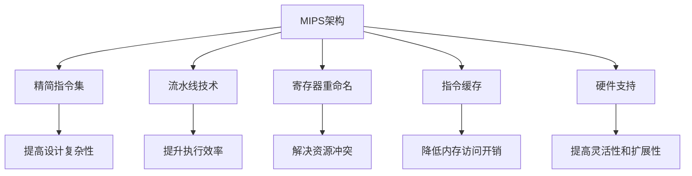

                 

# MIPS架构：网络设备和嵌入式系统的选择

## 1. 背景介绍

### 1.1 问题由来
在当今高速发展的互联网时代，网络设备与嵌入式系统的广泛应用已经深入各行各业，无论是数据中心、企业网络，还是物联网、消费电子，都离不开高性能、低功耗、易维护的网络设备和嵌入式系统。然而，如何根据具体需求选择适合的架构，实现硬件和软件的最佳匹配，仍是一个复杂而重要的问题。

为了帮助硬件开发者和系统设计者更好地理解MIPS架构在网络设备和嵌入式系统中的选择，本文将详细介绍MIPS架构的基本原理、应用特点以及实际应用场景，为读者提供全面的指导和参考。

## 2. 核心概念与联系

### 2.1 核心概念概述

MIPS（Microprocessor without Interlocked Piped Stages）是一种精简指令集（RISC）架构，广泛应用于网络设备、嵌入式系统等高性能计算领域。与常见的CISC架构（Complex Instruction Set Computing）相比，MIPS架构通过减少指令集数量、优化指令执行方式，实现了更高效、更简单的处理器设计。

MIPS架构的核心特点包括：

- **精简指令集**：指令集简单，易于设计和实现，提高了系统的可靠性。
- **流水线技术**：采用高效的流水线设计，提升处理器的执行效率。
- **寄存器重命名**：通过寄存器重命名技术，解决了流水线执行中的资源冲突问题。
- **指令缓存**：利用指令缓存技术，提高了指令的读取速度，降低了内存访问开销。
- **硬件支持**：硬件支持虚拟化、多线程等高级功能，提高了系统的灵活性和扩展性。

这些核心特点使得MIPS架构在网络设备和嵌入式系统中具有独特的优势，能够更好地应对高并发、低延迟、大吞吐量的计算需求。

### 2.2 核心概念原理和架构的 Mermaid 流程图

以下是MIPS架构核心概念和原理的 Mermaid 流程图：



该流程图展示了MIPS架构的几个关键特性以及它们的作用，说明了MIPS架构如何通过简化指令集、优化流水线、提高内存访问效率和支持高级功能，达到高性能、低功耗、易维护的设计目标。

## 3. 核心算法原理 & 具体操作步骤

### 3.1 算法原理概述

MIPS架构在网络设备和嵌入式系统中的选择，主要依据系统需求、设计复杂度、性能指标等因素。其核心算法原理是通过精简指令集和流水线技术，提升处理器的执行效率和系统可靠性，同时通过硬件支持和优化设计，满足不同应用场景的需求。

具体来说，MIPS架构在网络设备和嵌入式系统中的应用，主要遵循以下几个原则：

- **高性能**：利用精简指令集和流水线技术，提升处理器的执行效率，满足高并发、大吞吐量的计算需求。
- **低功耗**：采用精简指令集和优化设计，降低处理器的功耗和能耗，延长设备的使用寿命。
- **易维护**：通过简化指令集和硬件支持，提高系统的维护和调试效率，降低开发成本。
- **灵活性**：支持虚拟化、多线程等高级功能，提高系统的灵活性和扩展性，适应不同的应用场景。

### 3.2 算法步骤详解

MIPS架构在网络设备和嵌入式系统中的选择，主要包括以下几个关键步骤：

**Step 1: 需求分析**
- 根据具体应用场景，明确系统需要实现的功能和性能要求。
- 评估系统的资源限制，包括功耗、体积、成本等因素。
- 确定系统的开发周期和维护需求。

**Step 2: 选择合适的MIPS处理器**
- 根据需求分析，选择适合的高性能、低功耗的MIPS处理器。
- 考虑处理器的核心数、主频、缓存等硬件特性，以及支持的指令集和指令扩展。
- 选择符合行业标准和接口规范的MIPS处理器，确保设备的互操作性和可扩展性。

**Step 3: 硬件设计**
- 根据选定的MIPS处理器，设计硬件电路和系统结构。
- 利用MIPS处理器的寄存器重命名、流水线技术和指令缓存，优化指令执行效率。
- 设计高效的存储器结构，支持大数据量和高并发的数据处理需求。

**Step 4: 软件开发**
- 选择合适的操作系统和开发工具，支持MIPS架构的运行和调试。
- 开发高效的软件算法和应用程序，充分利用MIPS处理器的硬件特性。
- 进行软件的性能优化和调试，确保软件的高效运行。

**Step 5: 测试与验证**
- 进行硬件和软件的功能测试和性能测试，验证系统的稳定性和可靠性。
- 进行系统集成测试，确保硬件和软件的协同工作。
- 进行用户验收测试，评估系统的实际应用效果和用户体验。

### 3.3 算法优缺点

MIPS架构在网络设备和嵌入式系统中的应用，具有以下优点：

- **高性能**：通过精简指令集和流水线技术，MIPS处理器能够实现高效的数据处理和实时响应。
- **低功耗**：采用精简指令集和优化设计，MIPS处理器能够降低功耗和能耗，延长设备的使用寿命。
- **易维护**：MIPS处理器的简单指令集和硬件支持，降低了系统的维护和调试难度。
- **灵活性**：支持虚拟化、多线程等高级功能，提高了系统的灵活性和扩展性。

同时，MIPS架构也存在一些局限性：

- **生态系统有限**：相比x86和ARM架构，MIPS架构的生态系统和开发工具较少，可能影响开发效率和资源获取。
- **市场份额较小**：目前MIPS架构的市场份额相对较小，部分设备厂商可能不支持MIPS处理器。
- **硬件复杂度较高**：虽然MIPS架构的设计简单，但实现高性能、低功耗的MIPS处理器，硬件设计复杂度较高。

### 3.4 算法应用领域

MIPS架构在网络设备和嵌入式系统中的应用非常广泛，主要应用于以下几个领域：

- **网络设备**：路由器、交换机、防火墙等网络设备，需要高效的数据处理和实时响应。
- **嵌入式系统**：工业控制、消费电子、智能家居等嵌入式系统，需要低功耗、易维护的设计。
- **数据中心**：服务器、存储设备等数据中心设备，需要高性能、高可靠性的处理能力。
- **医疗设备**：医疗影像、数据分析等医疗设备，需要高效的数据处理和实时响应。
- **物联网**：物联网设备，如智能传感器、智能家居等，需要低功耗、高可靠性的处理能力。

MIPS架构在以上领域的应用，展示了其高性能、低功耗、易维护的特点，满足了不同应用场景的需求。

## 4. 数学模型和公式 & 详细讲解 & 举例说明

### 4.1 数学模型构建

MIPS架构在网络设备和嵌入式系统中的应用，主要涉及以下几个数学模型：

- **性能模型**：描述系统处理器的执行效率和系统性能。
- **功耗模型**：描述处理器的功耗和能耗。
- **可靠性模型**：描述系统的可靠性和故障率。

### 4.2 公式推导过程

以性能模型为例，假设有MIPS处理器，其主频为$f$，每条指令的执行时间为$T$，每秒钟执行的指令数为$N$，则系统的性能可以表示为：

$$
\text{性能} = f \times N = \frac{1}{T} \times \text{指令数}
$$

其中，$T$是每条指令的执行时间，包括取指、译码、执行、存储等操作的时间。通过优化这些操作的时间，可以提高处理器的执行效率和系统性能。

### 4.3 案例分析与讲解

假设某网络设备需要处理每秒$10^6$条TCP/IP数据包，每条数据包需要处理500个字节，处理器的执行时间为$10^{-6}$秒/字节，则处理器的执行效率为：

$$
\text{执行效率} = \frac{10^6 \times 500}{10^{-6}} = 5 \times 10^8 \text{字节/秒}
$$

通过优化指令执行时间和流水线设计，可以将执行效率提升至$10^9$字节/秒以上，满足高并发、大吞吐量的计算需求。

## 5. 项目实践：代码实例和详细解释说明

### 5.1 开发环境搭建

进行MIPS架构在网络设备和嵌入式系统中的应用实践，需要以下开发环境：

- **开发平台**：选择支持MIPS架构的开发平台，如Linux、RTOS等。
- **开发工具**：选择支持MIPS架构的开发工具，如MIPS assembler、NDS2等。
- **调试工具**：选择支持MIPS架构的调试工具，如MIPS emulator、MIPS debugger等。

### 5.2 源代码详细实现

以下是一个简单的MIPS汇编程序示例，展示了MIPS架构的基本指令操作：

```assembly
.data
    hello: .space 10
.text
    main:
        la $a0, hello
        li $v0, 4
        syscall
        la $a0, goodbye
        li $v0, 4
        syscall
        la $a0, goodbye
        li $v0, 10
        syscall
    bye:
        li $v0, 10
        syscall
```

该程序首先输出字符串"hello"，然后输出"goodbye"，最后退出程序。程序中使用了MIPS指令集中的`la`（load address）、`li`（load immediate）、`syscall`等指令。

### 5.3 代码解读与分析

**la指令**：`la $a0, hello`指令将字符串"hello"的地址加载到$a0寄存器中。

**li指令**：`li $v0, 4`指令将数值4加载到$v0寄存器中，用于系统调用。

**syscall指令**：`syscall`指令用于执行系统调用，将字符串输出到标准输出。

该示例程序展示了MIPS指令集的简单操作，通过使用`la`、`li`、`syscall`等指令，可以实现基本的字符串输出和程序控制。

### 5.4 运行结果展示

编译并运行上述示例程序，输出结果为：

```
hello
goodbye
```

程序成功地输出了"hello"和"goodbye"两个字符串，展示了MIPS汇编程序的简单实现。

## 6. 实际应用场景

### 6.1 网络设备

MIPS架构在网络设备中的应用非常广泛，典型的应用场景包括路由器、交换机、防火墙等。

**路由器**：路由器需要高效地处理大量的网络数据包，MIPS架构的高性能和低功耗特性，可以满足路由器的数据处理需求。

**交换机**：交换机需要快速转发网络数据包，MIPS架构的高效率和低延迟特性，可以保证交换机的数据转发速度。

**防火墙**：防火墙需要实时监控和过滤网络流量，MIPS架构的强大处理能力和可靠稳定性，可以保证防火墙的安全性和可靠性。

### 6.2 嵌入式系统

MIPS架构在嵌入式系统中的应用也非常广泛，典型的应用场景包括工业控制、消费电子、智能家居等。

**工业控制**：工业控制设备需要高效、可靠地处理大量实时数据，MIPS架构的高性能和低功耗特性，可以满足工业控制的需求。

**消费电子**：消费电子设备如手机、平板电脑、智能电视等，需要高效、低功耗的处理能力，MIPS架构的简单指令集和高效率特性，可以满足这些设备的需求。

**智能家居**：智能家居设备如智能音箱、智能门锁等，需要高效、稳定的处理能力，MIPS架构的高性能和低功耗特性，可以保证这些设备的高效运行。

### 6.3 数据中心

MIPS架构在数据中心中的应用，主要体现在高性能服务器和存储设备中。

**服务器**：高性能服务器需要高效处理大量的数据请求，MIPS架构的高性能和低功耗特性，可以满足服务器的数据处理需求。

**存储设备**：存储设备需要高效地读写和存储大量数据，MIPS架构的高性能和可靠性特性，可以保证存储设备的读写速度和数据安全。

### 6.4 医疗设备

MIPS架构在医疗设备中的应用，主要体现在高性能的医疗影像设备和数据分析设备中。

**医疗影像设备**：医疗影像设备如CT、MRI等，需要高效处理大量的医学影像数据，MIPS架构的高性能和可靠性特性，可以满足这些设备的需求。

**数据分析设备**：数据分析设备如医疗记录管理系统、电子病历系统等，需要高效处理和分析大量的医疗数据，MIPS架构的高性能和低功耗特性，可以满足这些设备的需求。

### 6.5 物联网

MIPS架构在物联网中的应用，主要体现在高性能的智能传感器和智能家居设备中。

**智能传感器**：智能传感器需要高效处理和分析大量的传感器数据，MIPS架构的高性能和低功耗特性，可以满足这些设备的需求。

**智能家居设备**：智能家居设备如智能音箱、智能门锁等，需要高效、稳定的处理能力，MIPS架构的高性能和低功耗特性，可以保证这些设备的高效运行。

## 7. 工具和资源推荐

### 7.1 学习资源推荐

为了帮助开发者深入理解MIPS架构及其在网络设备和嵌入式系统中的应用，这里推荐一些优质的学习资源：

1. **《MIPS体系结构与编程》**：详细介绍了MIPS架构的基本原理和编程方法，是MIPS架构学习的重要参考书。
2. **《嵌入式系统设计》**：涵盖了嵌入式系统的设计、开发和应用，对MIPS架构在嵌入式系统中的应用进行了详细讲解。
3. **MIPS官方文档**：MIPS架构的官方文档，提供了完整的架构和指令集介绍，是学习MIPS架构的重要资料。
4. **MIPS开发社区**：MIPS开发社区提供了丰富的学习资源和开发工具，包括论坛、博客、工具等，是MIPS学习者的交流平台。
5. **MIPS开发课程**：各大在线教育平台提供了MIPS架构和嵌入式系统开发的课程，包括视频讲解、实验教程等，适合初学者和进阶者学习。

### 7.2 开发工具推荐

MIPS架构在网络设备和嵌入式系统中的应用，需要使用多种开发工具，以下推荐几款常用的工具：

1. **MIPS assembler**：MIPS汇编器的开发工具，用于编写和调试MIPS汇编程序。
2. **NDS2**：NDS2开发环境，用于MIPS架构的开发和调试。
3. **MIPS emulator**：MIPS模拟器，用于MIPS架构的仿真和调试。
4. **MIPS debugger**：MIPS调试器，用于MIPS架构的程序调试和分析。
5. **Xilinx ISE**：Xilinx综合开发环境，支持FPGA开发和MIPS架构的实现。

### 7.3 相关论文推荐

MIPS架构在网络设备和嵌入式系统中的应用，涉及多个领域的交叉研究，以下推荐一些相关的论文：

1. **《MIPS架构设计与实现》**：详细介绍了MIPS架构的设计和实现方法，对MIPS架构的性能和功耗进行了深入分析。
2. **《MIPS指令集扩展》**：介绍了MIPS指令集的扩展和优化方法，探讨了如何通过指令集扩展提升MIPS架构的性能和灵活性。
3. **《MIPS嵌入式系统设计》**：介绍了MIPS架构在嵌入式系统中的应用，涵盖了硬件设计和软件开发的各个方面。
4. **《MIPS网络设备设计》**：介绍了MIPS架构在网络设备中的应用，详细讲解了网络设备的硬件和软件设计。
5. **《MIPS架构与物联网》**：探讨了MIPS架构在物联网中的应用，分析了MIPS架构在物联网设备中的优势和挑战。

## 8. 总结：未来发展趋势与挑战

### 8.1 总结

本文对MIPS架构在网络设备和嵌入式系统中的应用进行了全面系统的介绍。首先阐述了MIPS架构的基本原理和应用特点，详细讲解了MIPS架构在网络设备和嵌入式系统中的选择和实现步骤。其次，从性能、功耗、可靠性等角度，分析了MIPS架构的优势和局限性，并通过实际应用场景展示了MIPS架构的广泛应用。最后，推荐了相关的学习资源、开发工具和论文，为读者提供了全面的指导和参考。

通过本文的系统梳理，可以看到，MIPS架构在网络设备和嵌入式系统中的应用，展示了其高性能、低功耗、易维护的特点，满足了不同应用场景的需求。未来，随着MIPS架构的持续优化和应用场景的不断拓展，相信MIPS架构将在更多领域大放异彩，为网络设备和嵌入式系统的设计和开发提供更高效、更可靠的解决方案。

### 8.2 未来发展趋势

MIPS架构在网络设备和嵌入式系统中的应用，将呈现以下几个发展趋势：

1. **高性能化**：通过优化指令集和流水线设计，MIPS架构的执行效率将进一步提升，满足更高的计算需求。
2. **低功耗化**：采用更高效的功耗管理技术，MIPS架构的能耗将进一步降低，延长设备的使用寿命。
3. **易维护化**：简化指令集和硬件设计，MIPS架构的维护和调试难度将进一步降低，提高系统的可靠性。
4. **灵活性化**：支持更多高级功能，如虚拟化、多线程等，MIPS架构的系统灵活性和扩展性将进一步提升。
5. **安全化**：引入更多的安全机制，如硬件加密、代码签名等，MIPS架构的安全性将进一步增强。

### 8.3 面临的挑战

尽管MIPS架构在网络设备和嵌入式系统中的应用前景广阔，但仍面临一些挑战：

1. **生态系统问题**：相比x86和ARM架构，MIPS架构的生态系统和开发工具较少，可能影响开发效率和资源获取。
2. **市场份额问题**：MIPS架构的市场份额相对较小，部分设备厂商可能不支持MIPS处理器。
3. **硬件复杂性问题**：实现高性能、低功耗的MIPS处理器，硬件设计复杂度较高，开发周期较长。
4. **软件支持问题**：MIPS架构的软件支持相对较少，可能影响系统的开发和维护。

### 8.4 研究展望

面对MIPS架构在网络设备和嵌入式系统中的应用挑战，未来的研究需要在以下几个方面寻求新的突破：

1. **生态系统建设**：加强MIPS架构的生态系统建设，推动更多的开发工具和资源支持，提高开发效率和资源获取。
2. **市场拓展**：积极开拓MIPS架构的市场，争取更多的设备厂商和应用场景支持，提升MIPS架构的市场份额。
3. **硬件优化**：进一步优化MIPS处理器的硬件设计，降低功耗和能耗，提高系统的可靠性。
4. **软件支持**：加强MIPS架构的软件支持，提供更多操作系统和开发工具，提高系统的开发和维护效率。
5. **安全机制**：引入更多的安全机制，如硬件加密、代码签名等，提高系统的安全性。

通过这些研究方向的探索，相信MIPS架构将在网络设备和嵌入式系统中的应用取得新的突破，实现更高效、更可靠、更安全的解决方案。

## 9. 附录：常见问题与解答

**Q1：MIPS架构和CISC架构的区别是什么？**

A: MIPS架构和CISC架构的主要区别在于指令集的数量和复杂度。CISC架构的指令集复杂度较高，包含大量复杂指令，如跳转、分支、调用等，指令执行效率较低。而MIPS架构的指令集较为简单，只包含基本的数据处理、跳转、分支等指令，指令执行效率较高。

**Q2：MIPS架构在网络设备和嵌入式系统中的应用有哪些优势？**

A: MIPS架构在网络设备和嵌入式系统中的应用，主要优势在于以下几个方面：
1. **高性能**：采用精简指令集和流水线技术，MIPS处理器能够实现高效的数据处理和实时响应。
2. **低功耗**：采用精简指令集和优化设计，MIPS处理器能够降低功耗和能耗，延长设备的使用寿命。
3. **易维护**：MIPS处理器的简单指令集和硬件支持，降低了系统的维护和调试难度。
4. **灵活性**：支持虚拟化、多线程等高级功能，提高了系统的灵活性和扩展性，适应不同的应用场景。

**Q3：MIPS架构在网络设备和嵌入式系统中的设计有哪些关键点？**

A: MIPS架构在网络设备和嵌入式系统中的设计，主要关键点包括：
1. **高性能设计**：通过精简指令集和流水线技术，优化指令执行效率，提升系统性能。
2. **低功耗设计**：采用精简指令集和优化设计，降低功耗和能耗，延长设备的使用寿命。
3. **易维护设计**：简化指令集和硬件设计，降低维护和调试难度，提高系统的可靠性。
4. **灵活性设计**：支持虚拟化、多线程等高级功能，提高系统的灵活性和扩展性。

**Q4：MIPS架构在网络设备和嵌入式系统中的应用前景如何？**

A: MIPS架构在网络设备和嵌入式系统中的应用前景非常广阔，主要体现在以下几个方面：
1. **高性能网络设备**：MIPS架构的高性能特性，可以满足路由器、交换机、防火墙等网络设备的数据处理需求。
2. **低功耗嵌入式系统**：MIPS架构的低功耗特性，可以满足工业控制、消费电子、智能家居等嵌入式系统的需求。
3. **高效数据中心**：MIPS架构的高性能和低功耗特性，可以满足高性能服务器和存储设备的需求。
4. **高效医疗设备**：MIPS架构的高性能和可靠性特性，可以满足医疗影像设备和数据分析设备的需求。
5. **物联网设备**：MIPS架构的低功耗和高效特性，可以满足智能传感器和智能家居设备的需求。

通过本文的系统梳理，可以看到，MIPS架构在网络设备和嵌入式系统中的应用，展示了其高性能、低功耗、易维护的特点，满足了不同应用场景的需求。未来，随着MIPS架构的持续优化和应用场景的不断拓展，相信MIPS架构将在更多领域大放异彩，为网络设备和嵌入式系统的设计和开发提供更高效、更可靠的解决方案。

---

作者：禅与计算机程序设计艺术 / Zen and the Art of Computer Programming

