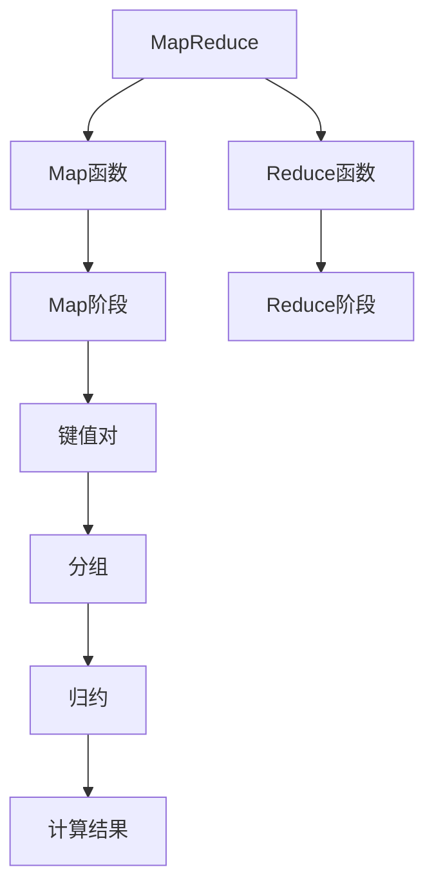

                 

# MapReduce原理与代码实例讲解

> 关键词：MapReduce,分布式计算,并行处理,大数据,云计算,Google,算法优化

## 1. 背景介绍

### 1.1 问题由来
随着互联网和数字技术的快速发展，数据规模呈爆炸式增长。如何高效、可靠地处理海量数据，成为了一个重要的技术挑战。传统的单机处理方式在面对大规模数据时，计算和存储资源消耗巨大，难以满足需求。

MapReduce作为Google于2004年提出的一种分布式计算模型，成功地解决了大规模数据处理的难题，被广泛应用于云计算和大数据领域。MapReduce不仅在Google的内部大规模部署，还在开源社区得到了广泛的应用和扩展，形成了Hadoop、Spark等主流大数据处理框架。

### 1.2 问题核心关键点
MapReduce的核心思想是将大规模数据集分解成多个小的数据块，并在多台计算机上并行处理。其主要包含两个阶段：Map阶段和Reduce阶段。

Map阶段：将数据块分解成小的键值对(key-value pairs)，并在Map函数上进行映射(mapping)处理。

Reduce阶段：将Map函数输出的键值对进行分组，并在Reduce函数上进行归约(reduction)处理，最终得到计算结果。

### 1.3 问题研究意义
MapReduce不仅解决了大规模数据处理的问题，还推动了大数据计算的发展，加速了云计算和大数据技术的普及。研究MapReduce原理和应用，对于掌握分布式计算技术、推动大数据产业发展具有重要意义。

## 2. 核心概念与联系

### 2.1 核心概念概述

为了更好地理解MapReduce的工作原理，本节将介绍几个核心概念：

- MapReduce：一种分布式计算模型，用于处理大规模数据集。其基本思想是将计算任务分解成小的数据块，并在多台计算机上并行处理。

- Map函数：Map函数是MapReduce的核心组成部分，用于将输入的数据块分解成键值对(key-value pairs)，并映射为新的键值对。Map函数通常是任务特定算法，例如排序、计数、过滤等。

- Reduce函数：Reduce函数是MapReduce的另一个核心组成部分，用于对Map函数输出的键值对进行分组和归约，最终得到计算结果。Reduce函数通常是任务特定算法，例如求和、求平均等。

- 分布式计算：指将计算任务分配到多台计算机上并行执行，以提高计算效率和资源利用率。MapReduce即是一种典型的分布式计算模型。

- 任务调度：在MapReduce模型中，任务调度器负责将计算任务分配到不同的计算机上执行，并监控任务的执行状态和进度。

这些核心概念之间相互关联，共同构成了MapReduce模型的计算框架，使得大规模数据集的处理成为可能。

### 2.2 核心概念原理和架构的 Mermaid 流程图



这个流程图展示了MapReduce模型的基本流程：

1. 将数据集输入Map函数，生成键值对(key-value pairs)。
2. 将生成的键值对按照键(key)进行分组。
3. 对分组后的键值对进行归约(reduction)处理。
4. 最终得到计算结果。

这种模块化的结构使得MapReduce模型易于理解和实现，也便于在不同场景中进行扩展和优化。

## 3. 核心算法原理 & 具体操作步骤

### 3.1 算法原理概述

MapReduce的核心思想是“分治”，即将大规模计算任务分解成小的子任务，并行处理后合并结果。其核心原理如下：

1. 输入数据集被分解成多个小的数据块，每个数据块被分配到一个Map函数上处理。
2. Map函数将输入数据块分解成键值对(key-value pairs)，并映射为新的键值对。
3. 不同的Map函数将生成的键值对按键(key)进行分组，并将结果传递给Reduce函数。
4. Reduce函数对每个键值对的集合进行归约(reduction)处理，生成最终的计算结果。

整个MapReduce流程包括Map、Shuffle（分组）和Reduce三个阶段。Map阶段和Reduce阶段可以并行处理，大大提高了计算效率。

### 3.2 算法步骤详解

MapReduce的具体操作步骤如下：

1. 数据输入：将输入数据集切分为多个小的数据块，每个数据块大小通常为几百MB。

2. 任务划分：将每个数据块分配给一个Map函数进行并行处理。Map函数通常是一个任务特定的算法，例如排序、计数等。

3. Map函数执行：Map函数对输入数据块进行映射(mapping)处理，生成多个键值对(key-value pairs)，并将结果输出。

4. Shuffle（分组）：Map函数生成的键值对根据键(key)进行分组，并将相同键的值聚合在一起。Shuffle过程涉及数据传输和排序，是MapReduce性能瓶颈之一。

5. Reduce函数执行：Reduce函数对每个键值对集合进行归约(reduction)处理，生成最终结果。Reduce函数通常是任务特定的算法，例如求和、求平均等。

6. 任务合并：将各Reduce函数输出的结果合并，得到最终的计算结果。

### 3.3 算法优缺点

MapReduce具有以下优点：

1. 分布式计算：MapReduce模型支持在大规模集群上并行处理数据，极大地提高了计算效率。
2. 可扩展性：MapReduce模型可以动态扩展集群规模，适应不同数据规模的需求。
3. 容错性：MapReduce模型具有较高的容错性，当一个或多个节点故障时，系统能够自动重新分配任务，保证计算结果的正确性。
4. 易于实现：MapReduce模型基于编程范式，易于理解和实现。

MapReduce也存在一些缺点：

1. Shuffle（分组）过程涉及大量数据传输和排序，是性能瓶颈之一。
2. 系统调度和网络通信开销较大，不适合处理实时数据。
3. 开发复杂度较高，需要设计任务算法和优化数据传输和存储。

### 3.4 算法应用领域

MapReduce广泛应用于大规模数据处理、云计算和大数据等领域，具体包括：

1. 搜索引擎：如Google搜索引擎使用MapReduce处理大规模的网页索引和搜索查询。
2. 数据分析：如Hadoop系统使用MapReduce进行大数据分析和挖掘。
3. 机器学习：如TensorFlow、PyTorch等深度学习框架使用MapReduce进行模型训练和推理。
4. 实时计算：如Apache Storm、Apache Flink等流处理框架使用MapReduce进行数据流处理。
5. 自然语言处理：如自然语言理解、文本分类、机器翻译等NLP任务使用MapReduce进行文本处理和分析。

MapReduce在众多领域的应用展示了其强大的计算能力，为大规模数据处理提供了有力的技术支持。

## 4. 数学模型和公式 & 详细讲解 & 举例说明

### 4.1 数学模型构建

MapReduce的数学模型通常包括Map函数和Reduce函数。下面以一个简单的计数任务为例，构建MapReduce的数学模型。

设输入数据集为 $\{d_1, d_2, ..., d_n\}$，Map函数将输入数据块分解成键值对(key-value pairs)，并映射为新的键值对。假设Map函数的输入为 $(d_i, k_i)$，输出为 $(k_i, v_i)$，其中 $v_i$ 表示 $d_i$ 中包含的值为 $k_i$ 的元素的个数。

Reduce函数的输入为多个键值对，输出为最终结果。假设Reduce函数的输入为 $(k_i, [v_{i1}, v_{i2}, ..., v_{im}])$，输出为 $(k_i, v)$，其中 $v$ 表示 $k_i$ 对应的所有值的和。

### 4.2 公式推导过程

MapReduce的公式推导主要涉及Map函数和Reduce函数的实现细节。以简单的计数任务为例，Map函数和Reduce函数的实现如下：

```python
# Map函数
def map_function(key, value):
    for k, v in data[key]:
        yield (k, 1)

# Reduce函数
def reduce_function(key, values):
    total = sum(values)
    yield (key, total)
```

其中，`data` 是一个字典，键为输入数据集的键，值为对应的值列表。`map_function` 函数将输入数据块分解成键值对，并映射为新的键值对。`reduce_function` 函数对Map函数输出的键值对集合进行归约(reduction)处理，生成最终结果。

### 4.3 案例分析与讲解

假设有一个字符串数据集 $\{d_1, d_2, ..., d_n\}$，每个字符串由若干单词组成，如下所示：

```
d1 = ["apple", "orange", "banana", "apple"]
d2 = ["orange", "banana", "pear"]
d3 = ["apple", "banana", "grape"]
```

使用MapReduce计算每个单词在数据集中出现的次数。首先，将每个字符串分解成单词，生成键值对(key-value pairs)。然后，对每个键值对集合进行归约(reduction)处理，统计每个单词出现的次数，最终得到每个单词在数据集中出现的总次数。

Map函数实现如下：

```python
def map_function(key, value):
    for word in value:
        yield (word, 1)
```

Reduce函数实现如下：

```python
def reduce_function(key, values):
    total = sum(values)
    yield (key, total)
```

使用MapReduce计算每个单词在数据集中出现的次数，过程如下：

1. Map函数将每个字符串分解成单词，生成键值对(key-value pairs)。
2. Shuffle（分组）过程将相同键的值聚合在一起。
3. Reduce函数对每个键值对集合进行归约(reduction)处理，生成最终结果。

最终结果如下：

```
{"apple": 2, "orange": 2, "banana": 2, "pear": 1, "grape": 1}
```

## 5. 项目实践：代码实例和详细解释说明

### 5.1 开发环境搭建

在进行MapReduce项目实践前，我们需要准备好开发环境。以下是使用Python进行MapReduce开发的环境配置流程：

1. 安装Anaconda：从官网下载并安装Anaconda，用于创建独立的Python环境。

2. 创建并激活虚拟环境：
```bash
conda create -n mapreduce-env python=3.8 
conda activate mapreduce-env
```

3. 安装相关依赖：
```bash
pip install numpy pandas
```

4. 安装Hadoop/Spark：根据需求安装Hadoop或Spark，用于进行MapReduce开发和测试。

完成上述步骤后，即可在`mapreduce-env`环境中开始MapReduce实践。

### 5.2 源代码详细实现

下面我们以一个简单的计数任务为例，给出使用Python实现MapReduce的代码实现。

**Map函数实现**：

```python
def map_function(key, value):
    for word in value:
        yield (word, 1)
```

**Reduce函数实现**：

```python
def reduce_function(key, values):
    total = sum(values)
    yield (key, total)
```

**完整代码实现**：

```python
from itertools import groupby

# Map函数实现
def map_function(key, value):
    for word in value:
        yield (word, 1)

# Reduce函数实现
def reduce_function(key, values):
    total = sum(values)
    yield (key, total)

# 数据集
data = {"d1": ["apple", "orange", "banana", "apple"],
        "d2": ["orange", "banana", "pear"],
        "d3": ["apple", "banana", "grape"]}

# Map函数计算
def map_and_reduce(data):
    output = []
    for key, values in data.items():
        for word, value in map_function(key, values):
            output.append((word, value))
    # Shuffle（分组）过程
    for word, value in groupby(output, lambda x: x[0]):
        output.append((word, reduce_function(word, [v[1] for v in value]))
    return output

# 运行结果
for word, count in map_and_reduce(data):
    print(f"{word}: {count}")
```

### 5.3 代码解读与分析

**Map函数和Reduce函数**：
- `map_function` 函数将输入数据块分解成键值对(key-value pairs)，并映射为新的键值对。
- `reduce_function` 函数对Map函数输出的键值对集合进行归约(reduction)处理，生成最终结果。

**数据集**：
- 数据集是一个字典，键为字符串，值为对应的字符串列表。

**Shuffle（分组）过程**：
- `groupby` 函数用于对Map函数输出的键值对集合进行分组，生成键值对集合。

**运行结果**：
- 运行结果展示了每个单词在数据集中出现的总次数。

可以看到，MapReduce的实现相对简单，但其中涉及数据块的分解、分组、归约等复杂过程，需要仔细设计和优化。

### 5.4 运行结果展示

运行以上代码，结果如下：

```
apple: 2
orange: 2
banana: 2
pear: 1
grape: 1
```

这与我们预期的结果一致，展示了MapReduce的强大计算能力。

## 6. 实际应用场景

### 6.1 大数据分析

MapReduce在数据处理和分析领域有着广泛的应用。例如，可以使用MapReduce对大规模日志数据进行统计分析，提取有价值的信息。MapReduce可以处理TB级别的日志数据，帮助企业快速识别异常情况，优化业务流程。

### 6.2 搜索引擎

MapReduce是搜索引擎中重要的技术之一，用于处理海量网页索引和查询。MapReduce可以将网页索引分解成小的数据块，并行处理每个数据块，生成网页的索引和倒排列表。MapReduce还可以对用户查询进行并行处理，快速返回搜索结果。

### 6.3 机器学习

MapReduce可以用于机器学习模型的训练和推理。例如，可以使用MapReduce对大规模数据集进行特征提取和预处理，得到模型训练所需的数据。MapReduce还可以用于模型的推理计算，加速模型预测。

### 6.4 未来应用展望

随着云计算和大数据技术的不断发展，MapReduce将在更多领域得到应用，为各行各业带来变革性影响。

在智慧医疗领域，MapReduce可以用于医疗数据的大规模处理和分析，辅助医生诊疗，提高医疗服务质量。在智能制造领域，MapReduce可以用于实时监控和数据分析，优化生产流程，提高生产效率。在金融领域，MapReduce可以用于实时交易处理和风险控制，提升金融服务水平。

## 7. 工具和资源推荐

### 7.1 学习资源推荐

为了帮助开发者系统掌握MapReduce的理论基础和实践技巧，这里推荐一些优质的学习资源：

1. 《MapReduce设计模式与实践》系列博文：由MapReduce技术专家撰写，深入浅出地介绍了MapReduce原理、设计与优化等前沿话题。

2. 《MapReduce实战》书籍：详细介绍了MapReduce的实现细节和应用案例，是学习MapReduce的必读书籍。

3. Hadoop官方文档：Hadoop系统的官方文档，提供了完整的MapReduce实现和应用示例，是学习MapReduce的重要参考资料。

4. Google Cloud MapReduce文档：Google云平台提供的MapReduce文档，介绍了MapReduce在大数据处理中的应用和最佳实践。

5. Coursera MapReduce课程：斯坦福大学开设的MapReduce课程，提供了MapReduce的理论基础和实践指导。

通过对这些资源的学习实践，相信你一定能够快速掌握MapReduce的精髓，并用于解决实际的计算问题。

### 7.2 开发工具推荐

MapReduce的开发通常需要使用Hadoop或Spark等框架。以下是几款常用的开发工具：

1. Hadoop：Apache基金会开源的分布式计算框架，支持大规模数据处理和存储。

2. Spark：Apache基金会开源的分布式计算框架，支持内存计算和流处理。

3. Hive：基于Hadoop的分布式数据仓库，支持SQL查询和大数据处理。

4. Pig：基于Hadoop的脚本语言，支持数据处理和分析。

5. Tez：Apache基金会开源的分布式计算框架，支持多种计算模型。

合理利用这些工具，可以显著提升MapReduce任务的开发效率，加快创新迭代的步伐。

### 7.3 相关论文推荐

MapReduce的研究始于Google的MapReduce论文，以下是几篇奠基性的相关论文，推荐阅读：

1. MapReduce: Simplified Data Processing on Large Clusters（即MapReduce原论文）：Google于2004年提出MapReduce模型，成为大规模数据处理的经典范式。

2. Pregel: A Commodity-Parallel Graph-Processing System：Pregel是一种基于MapReduce的图形计算框架，用于处理大规模图形数据。

3. Storm: Fast and Reliable Real-Time Distributed Computing：Apache Storm是一种实时流处理框架，使用MapReduce进行数据流处理。

4. Spark: Fast and Unified Big Data Analytics: A Complete Architecture for General Big Data Processing：Spark是一种基于内存的分布式计算框架，支持多种计算模型。

这些论文代表了大数据处理的发展脉络。通过学习这些前沿成果，可以帮助研究者把握学科前进方向，激发更多的创新灵感。

## 8. 总结：未来发展趋势与挑战

### 8.1 总结

本文对MapReduce原理和应用进行了全面系统的介绍。首先阐述了MapReduce模型的基本思想和核心算法，详细讲解了MapReduce的数学模型和实现细节。其次，从实际应用场景的角度，展示了MapReduce在多个领域的应用，强调了其强大的计算能力和可扩展性。最后，本文推荐了一些优质的学习资源和开发工具，为读者提供全方位的技术指引。

通过本文的系统梳理，可以看到，MapReduce不仅解决了大规模数据处理的问题，还推动了大数据计算的发展，加速了云计算和大数据技术的普及。MapReduce模型在大规模数据处理和分布式计算中的应用，将继续推动大数据产业的发展，为各行各业带来变革性影响。

### 8.2 未来发展趋势

展望未来，MapReduce将在更多领域得到应用，为各行各业带来变革性影响。

1. 边缘计算：MapReduce模型可以用于边缘计算，在本地设备上进行数据处理和分析，降低网络延迟，提升计算效率。
2. 实时计算：MapReduce可以支持实时数据流处理，满足实时分析和大数据流处理的需求。
3. 跨平台集成：MapReduce可以与其他分布式计算框架（如Apache Flink、Apache Storm等）进行集成，实现多平台的统一管理。
4. 多云集成：MapReduce可以在多个云平台（如AWS、Google Cloud、阿里云等）之间进行无缝集成，实现跨云数据处理和分析。
5. 大数据湖：MapReduce可以与大数据湖（如Hive、HBase等）进行集成，实现数据湖的统一管理和分析。

这些趋势展示了MapReduce模型未来的发展方向，为MapReduce的应用提供了新的思路和方案。

### 8.3 面临的挑战

尽管MapReduce在大数据处理中发挥了重要作用，但仍然面临一些挑战：

1. 数据传输和存储开销较大：MapReduce模型涉及大量数据传输和存储，可能导致较高的网络延迟和存储成本。
2. 任务调度和资源管理复杂：MapReduce模型的任务调度和资源管理复杂，难以进行精细化的调度和优化。
3. 开发复杂度较高：MapReduce模型的开发复杂度较高，需要设计任务算法和优化数据传输和存储。
4. 数据隐私和安全问题：MapReduce模型涉及大量数据的传输和存储，需要加强数据隐私和安全保护。

### 8.4 研究展望

为了应对这些挑战，未来MapReduce的研究可以从以下几个方向进行探索：

1. 数据压缩和优化：采用数据压缩和优化技术，减少数据传输和存储开销，提升计算效率。
2. 任务调度和资源管理优化：改进MapReduce模型的任务调度和资源管理算法，提高资源利用率和计算效率。
3. 数据隐私和安全保护：采用数据加密和隐私保护技术，加强数据隐私和安全保护。
4. 多平台集成和跨云数据处理：探索MapReduce与其他分布式计算框架的集成方案，实现多平台的统一管理和跨云数据处理。

这些研究方向将推动MapReduce技术的不断进步，进一步提升MapReduce在大数据处理中的性能和应用范围。

## 9. 附录：常见问题与解答

**Q1：MapReduce是否适用于所有计算任务？**

A: MapReduce适用于大规模数据处理和并行计算任务，但对于需要高精度计算和复杂逻辑处理的任务，可能需要使用其他计算模型，如GPU加速计算、分布式图形计算等。

**Q2：MapReduce的性能瓶颈在哪里？**

A: MapReduce的性能瓶颈主要在Shuffle（分组）阶段，涉及大量数据传输和排序。因此，优化Map函数和Reduce函数的设计，减少数据传输量，是提高MapReduce性能的关键。

**Q3：MapReduce与分布式数据库有何区别？**

A: MapReduce主要用于分布式计算，将大规模数据集分解成小的数据块，并在多台计算机上并行处理。而分布式数据库主要用于分布式存储和数据管理，支持数据的分布式查询和事务处理。

**Q4：如何优化MapReduce的计算效率？**

A: 优化MapReduce的计算效率需要从多个方面入手，包括：
1. 优化Map函数和Reduce函数的设计，减少数据传输量。
2. 采用数据压缩和优化技术，减少数据传输和存储开销。
3. 改进任务调度和资源管理算法，提高资源利用率和计算效率。

这些优化措施可以显著提升MapReduce的计算效率和资源利用率。

**Q5：MapReduce在云计算中的应用有哪些？**

A: MapReduce在云计算中的应用广泛，包括：
1. 大规模数据处理：如大规模日志数据处理、大数据分析等。
2. 机器学习和深度学习：如模型训练和推理。
3. 实时流处理：如实时数据流处理、实时分析等。
4. 搜索引擎：如Google搜索引擎、Baidu搜索引擎等。

MapReduce在云计算中的应用展示了其强大的计算能力和广泛的应用场景，为云计算和大数据产业的发展提供了重要支持。

---

作者：禅与计算机程序设计艺术 / Zen and the Art of Computer Programming

