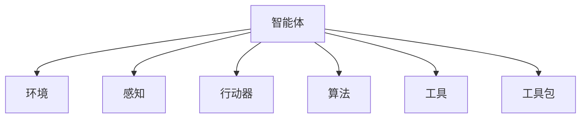

                 

# Module：Agent, Tools, Toolkits

> 关键词：智能体(Agent), 工具(Tools), 工具包(Toolkits)

## 1. 背景介绍

### 1.1 问题由来
随着人工智能技术的发展，智能体(Agent)在各个领域中的应用日益广泛。从机器人到自动驾驶，从智能推荐到金融交易，智能体技术正在深刻改变着我们的生活方式。然而，构建和部署一个高效的智能体系统并非易事，它涉及到模型构建、算法优化、工具选择、资源管理等多方面的挑战。为了应对这些挑战，工具和工具包(Tools and Toolkits)在这一过程中扮演了关键角色。

### 1.2 问题核心关键点
智能体技术涉及的核心关键点主要包括：

- **模型构建**：选择合适的模型框架，如深度学习、强化学习、符号推理等，构建智能体的知识表示和推理能力。
- **算法优化**：设计高效的学习算法，如梯度下降、蒙特卡洛树搜索等，使智能体能够在复杂的任务环境中不断优化策略。
- **工具选择**：选取合适的开发工具和框架，如TensorFlow、PyTorch、OpenAI Gym等，提高开发效率和系统性能。
- **资源管理**：合理配置和管理计算资源，如GPU、TPU等，确保系统的高效运行和扩展性。

这些关键点之间相互关联，共同构成了智能体技术的核心框架。

### 1.3 问题研究意义
智能体工具和工具包的合理使用，对于提高智能体系统的开发效率、降低开发成本、提升系统性能具有重要意义。

1. **提高开发效率**：通过使用高效的工具和工具包，开发者可以快速搭建智能体系统，加速模型的训练和测试过程。
2. **降低开发成本**：使用成熟的工具和工具包，可以减少对开发人员技能的要求，降低开发和维护成本。
3. **提升系统性能**：工具和工具包通常包含了优化的算法和数据结构，能够显著提升智能体系统的计算效率和运行速度。
4. **增强系统可扩展性**：工具和工具包通常具有良好的模块化和插件机制，便于系统的扩展和升级。

## 2. 核心概念与联系

### 2.1 核心概念概述

为更好地理解智能体技术中的工具和工具包，本节将介绍几个密切相关的核心概念：

- **智能体(Agent)**：在复杂环境中通过感知环境、执行动作、学习优化，达到特定目标的自主决策实体。
- **环境(Environment)**：智能体运行的外部世界，包括物理世界和虚拟世界，为智能体提供信息反馈和奖励信号。
- **感知(Sensor)**：智能体获取环境信息的传感器，如摄像头、激光雷达、GPS等。
- **行动器(Actor)**：智能体执行动作的执行机构，如电机、舵机、指令执行器等。
- **算法(Algorithm)**：智能体用于优化决策策略的学习算法，如强化学习、神经网络等。
- **工具(Tools)**：用于辅助开发、测试、部署智能体的软件工具，如IDE、调试器、可视化工具等。
- **工具包(Toolkits)**：集合多种工具和算法的框架或库，如TensorFlow、PyTorch、OpenAI Gym等。

这些核心概念之间的逻辑关系可以通过以下Mermaid流程图来展示：



这个流程图展示了的智能体技术中的核心概念及其之间的关系：

1. 智能体通过感知环境信息，执行动作，在环境中学习优化决策策略。
2. 算法是智能体学习优化策略的基础。
3. 工具和工具包是辅助智能体开发、测试、部署的软件支持。
4. 环境是智能体学习、执行的基础。
5. 感知和行动器是智能体与环境交互的桥梁。

这些概念共同构成了智能体技术的核心框架，使得智能体能够在一个复杂环境中自主决策和优化。

## 3. 核心算法原理 & 具体操作步骤
### 3.1 算法原理概述

智能体的学习算法通常包括强化学习和深度学习两大类。

- **强化学习**：通过智能体与环境的交互，利用奖励信号和状态转移模型，不断优化决策策略。
- **深度学习**：通过神经网络模型，学习复杂的非线性映射关系，用于特征提取和决策优化。

强化学习的核心算法包括Q-learning、SARSA、Deep Q-Network等。深度学习则广泛应用于模型训练和特征提取。

### 3.2 算法步骤详解

以强化学习中的Deep Q-Learning为例，其基本步骤如下：

1. **环境选择**：选择合适的模拟环境或真实环境，作为智能体学习的训练场。
2. **智能体设计**：设计智能体的感知器、行动器和算法模块，实现智能体的基本功能。
3. **状态和动作空间定义**：定义智能体可感知的环境状态和可执行的动作空间。
4. **Q-网络初始化**：初始化Q-网络的权重和偏置，如随机初始化或预训练模型。
5. **训练循环**：在每个训练轮次中，智能体通过与环境交互，观察状态，执行动作，获取奖励，更新Q-网络权重。
6. **策略优化**：通过不断迭代训练，优化智能体的决策策略，使其在特定任务中表现最优。

### 3.3 算法优缺点

**Deep Q-Learning的优点**：

- **通用性**：可以应用于各种连续型和离散型任务，适用范围广。
- **收敛性**：通过不断的经验积累，能够收敛到最优策略。
- **可扩展性**：可以通过添加层和节点，提高模型的表达能力。

**Deep Q-Learning的缺点**：

- **过拟合风险**：在复杂环境中，模型容易过拟合，导致泛化能力差。
- **训练时间长**：在大规模环境中，模型需要较长的训练时间。
- **计算资源需求高**：需要大量的计算资源进行模型训练和优化。

### 3.4 算法应用领域

Deep Q-Learning在多个领域得到了广泛应用，例如：

- **机器人控制**：机器人通过与环境的交互，学习最优控制策略。
- **自动驾驶**：自动驾驶车辆通过感知器和行动器，学习最优驾驶策略。
- **游戏AI**：游戏中的AI角色通过感知环境和执行动作，学习最优游戏策略。
- **推荐系统**：推荐系统通过用户行为数据，学习最优推荐策略。
- **金融交易**：金融模型通过市场数据，学习最优交易策略。

除了以上应用领域外，Deep Q-Learning还在资源优化、供应链管理、物联网等多个领域得到了应用。

## 4. 数学模型和公式 & 详细讲解 & 举例说明

### 4.1 数学模型构建

智能体的学习算法通常基于数学模型构建。以强化学习中的Deep Q-Learning为例，其数学模型包括：

- **状态(s)**：智能体感知到的环境状态。
- **动作(a)**：智能体执行的动作。
- **奖励(r)**：智能体执行动作后，从环境中获得的奖励。
- **Q值(Q)**：状态动作对的价值评估。

Q值可以通过Q-网络进行估计，其数学表达式为：

$$
Q(s,a) = w^T\phi(s,a)
$$

其中，$w$为Q-网络的权重，$\phi(s,a)$为状态动作的特征表示。

### 4.2 公式推导过程

在Deep Q-Learning中，Q值的更新公式为：

$$
Q(s_t,a_t) = Q(s_t,a_t) + \alpha(r_t + \gamma \max_{a'} Q(s_{t+1},a_{t+1}) - Q(s_t,a_t))
$$

其中，$\alpha$为学习率，$\gamma$为折扣因子。公式右侧的第一项为即时奖励，第二项为未来奖励的预期值。

这个公式的意义是：智能体在当前状态动作对$(s_t,a_t)$下，通过与环境的交互，获得了即时奖励$r_t$，并且根据未来状态动作对$(s_{t+1},a_{t+1})$的Q值，对当前状态动作对的Q值进行更新。

### 4.3 案例分析与讲解

以AlphaGo为例，其核心算法为蒙特卡洛树搜索(MCTS)和深度神经网络。MCTS用于构建搜索树，深度神经网络用于评估搜索树的节点价值。

AlphaGo通过与AlphaGo Zero进行多局对弈，不断优化神经网络的权重和MCTS的参数，最终在围棋领域取得了超越人类的成绩。

## 5. 项目实践：代码实例和详细解释说明
### 5.1 开发环境搭建

在进行智能体项目开发前，我们需要准备好开发环境。以下是使用Python进行TensorFlow开发的环境配置流程：

1. 安装Anaconda：从官网下载并安装Anaconda，用于创建独立的Python环境。

2. 创建并激活虚拟环境：
```bash
conda create -n tf-env python=3.8 
conda activate tf-env
```

3. 安装TensorFlow：根据CUDA版本，从官网获取对应的安装命令。例如：
```bash
conda install tensorflow tensorflow-estimator tensorflow-model-optimization tensorflow-addons -c conda-forge
```

4. 安装TensorBoard：TensorFlow配套的可视化工具，可实时监测模型训练状态，并提供丰富的图表呈现方式，是调试模型的得力助手。

5. 安装GitHub、Git等版本控制系统，方便源代码管理和协同开发。

完成上述步骤后，即可在`tf-env`环境中开始智能体项目开发。

### 5.2 源代码详细实现

这里我们以AlphaGo为例，展示使用TensorFlow构建深度神经网络和蒙特卡洛树搜索的代码实现。

首先，定义AlphaGo的结构：

```python
from tensorflow.keras.layers import Dense, Input
from tensorflow.keras.models import Model
from tensorflow.keras.optimizers import Adam
from tensorflow.keras.losses import MeanSquaredError

# 定义神经网络结构
def build_network(input_dim):
    inputs = Input(shape=(input_dim,))
    hidden = Dense(64, activation='relu')(inputs)
    output = Dense(1, activation='tanh')(hidden)
    model = Model(inputs=inputs, outputs=output)
    model.compile(optimizer=Adam(learning_rate=0.001), loss=MeanSquaredError())
    return model

# 定义蒙特卡洛树搜索结构
class Node:
    def __init__(self, state, parent=None):
        self.state = state
        self.parent = parent
        self.children = []
        self.untried_actions = []
        self.reward = 0
        self.value = 0
        self.exploitation = 0
        self.exploitation_count = 0
        self.exploration_count = 0

    def expand(self):
        for action in self.untried_actions:
            child_state = self.state.get_new_state(action)
            self.children.append(Node(child_state, self))
            self.untried_actions.remove(action)

    def select(self, temperature=1.0):
        if len(self.children) == 0:
            return self
        if temperature == 0:
            return self.children[0]
        return self.children[np.argmax([np.exp(child.value / temperature) for child in self.children])]

    def rollout(self):
        node = self
        while len(node.untried_actions) > 0:
            action = node.untried_actions[np.random.randint(len(node.untried_actions))]
            node = node.children[0]  # 目前只考虑单步扩展
        node.reward += self.sen(nnext, self.parent.state)
        return node

    def backpropagate(self, reward):
        node = self
        while node is not None:
            node.value += reward
            node.exploitation += reward
            node.exploitation_count += 1
            node = node.parent

    def sen(self, next_state, current_state):
        return self.reward + self.gamma * np.max([node.value for node in self.children])
```

然后，定义AlphaGo的主函数：

```python
def alphago():
    state = State()
    node = Node(state)
    for _ in range(1000):
        node.expand()
    node = node.select()
    if node.parent is not None:
        node.parent.exploitation += node.exploitation
        node.parent.exploitation_count += 1
    return node
```

最后，定义训练过程：

```python
# 训练循环
for epoch in range(1000):
    state = State()
    node = Node(state)
    for _ in range(100):
        node = node.select()
        if node.parent is not None:
            node.parent.exploitation += node.exploitation
            node.parent.exploitation_count += 1
    node = node.select()
    node.exploitation += node.sen(next_state, node.parent.state)
    node.parent.exploitation += node.exploitation
    node.parent.exploitation_count += 1
```

以上就是使用TensorFlow对AlphaGo进行实现的完整代码。可以看到，TensorFlow提供了强大的深度学习框架，可以方便地构建神经网络模型和蒙特卡洛树搜索。

### 5.3 代码解读与分析

让我们再详细解读一下关键代码的实现细节：

**Node类**：
- `__init__`方法：初始化节点，包括状态、父节点、子节点、未尝试动作、奖励、价值、探索次数、选择次数等属性。
- `expand`方法：扩展节点，添加未尝试动作对应的子节点。
- `select`方法：选择扩展节点，根据温度参数进行探索或利用。
- `rollout`方法：进行模拟滚动，选择未尝试动作直到所有动作都尝试过。
- `backpropagate`方法：回溯更新父节点的价值和探索次数。

**alphago函数**：
- 初始化游戏状态和根节点，进行1000次蒙特卡洛树搜索。
- 在每次搜索中，选择扩展节点，更新其父节点的探索次数和价值。
- 返回最优节点。

**训练过程**：
- 在每个epoch中，随机选择状态，进行100次蒙特卡洛树搜索。
- 选择最优节点，更新其父节点的价值和探索次数。
- 重复进行1000个epoch，训练模型。

通过这个简单的例子，可以看到TensorFlow和Python的结合，可以方便地构建和训练智能体模型。

## 6. 实际应用场景
### 6.1 自动驾驶

自动驾驶系统需要实现环境感知、路径规划和决策执行三大核心功能。智能体技术在其中发挥了关键作用，特别是在路径规划和决策执行环节。

以Uber的AutoPilot系统为例，其核心算法为深度强化学习。系统通过传感器感知环境，在预定义的路径上通过强化学习策略，优化路径选择和速度控制。在复杂的城市交通环境中，系统能够自主决策，安全、高效地行驶。

### 6.2 机器人控制

机器人控制是智能体技术的典型应用场景。智能体通过感知环境，执行动作，优化控制策略，实现自主导航和作业。

以ROS(机器人操作系统)为例，其提供了丰富的智能体开发工具和框架，支持多种感知器和行动器。开发者可以使用OpenCV、PCL等库，实现环境感知和动作执行，使用PyTorch、TensorFlow等框架，优化智能体的学习策略。

### 6.3 游戏AI

游戏AI是智能体技术的重要应用领域之一。通过强化学习，智能体可以在游戏环境中不断学习，优化决策策略，提升游戏性能。

以AlphaGo为例，其通过蒙特卡洛树搜索和深度神经网络，学习了围棋的高阶策略，成为世界上最强的人类围棋玩家。

### 6.4 未来应用展望

随着智能体技术的不断发展和应用，未来将会在更多领域得到应用，为各行各业带来变革性影响。

在智慧医疗领域，智能体技术可以帮助医生进行诊断和治疗方案优化，提高医疗服务的智能化水平。

在智慧城市治理中，智能体技术可以用于城市事件监测、应急响应、交通管理等环节，提高城市管理的自动化和智能化水平。

在智能家居领域，智能体技术可以实现智能设备和家居系统的协同控制，提升用户的生活质量和便利性。

未来，智能体技术将在更多领域得到应用，推动人工智能技术的广泛落地。

## 7. 工具和资源推荐
### 7.1 学习资源推荐

为了帮助开发者系统掌握智能体技术，这里推荐一些优质的学习资源：

1. **深度学习入门课程**：如Coursera上的《深度学习专项课程》，从基础到高级，详细讲解深度学习和智能体技术的核心概念。

2. **强化学习算法库**：如OpenAI Gym，提供了丰富的环境库和算法库，方便开发者进行智能体开发和测试。

3. **强化学习论文集**：如ArXiv上的强化学习论文集，涵盖各类算法和应用案例，提供丰富的理论支持。

4. **深度学习框架**：如TensorFlow、PyTorch、MXNet等，提供了强大的深度学习工具和框架，支持智能体开发和模型训练。

5. **智能体框架**：如ROS、Gazebo等，提供了丰富的智能体开发工具和环境，支持多种传感器和行动器。

通过对这些资源的学习实践，相信你一定能够快速掌握智能体技术的精髓，并用于解决实际的智能体问题。

### 7.2 开发工具推荐

高效的开发离不开优秀的工具支持。以下是几款用于智能体开发常用的工具：

1. **Jupyter Notebook**：用于编写和运行Python代码，支持多种环境配置和数据可视化。

2. **PyCharm**：Python开发环境，支持代码调试、版本控制、自动化测试等功能。

3. **ROS**：机器人操作系统，提供了丰富的智能体开发工具和环境，支持多种传感器和行动器。

4. **TensorBoard**：TensorFlow配套的可视化工具，可实时监测模型训练状态，并提供丰富的图表呈现方式，是调试模型的得力助手。

5. **OpenAI Gym**：强化学习环境库，提供了丰富的环境库和算法库，方便开发者进行智能体开发和测试。

合理利用这些工具，可以显著提升智能体系统的开发效率，加快创新迭代的步伐。

### 7.3 相关论文推荐

智能体技术涉及多个领域的研究，以下是几篇奠基性的相关论文，推荐阅读：

1. **DeepMind的AlphaGo**：提出了蒙特卡洛树搜索和深度神经网络，学习了围棋的高阶策略，成为世界上最强的围棋玩家。

2. **强化学习基本原理**：Littman教授的论文《强化学习》，介绍了强化学习的核心算法和理论基础。

3. **神经网络在强化学习中的应用**：Watkins教授的论文《Q-learning》，介绍了Q-learning算法及其在智能体中的应用。

4. **深度强化学习**：Mnih教授的论文《Human-level Control through Deep Reinforcement Learning》，介绍了深度强化学习在控制任务中的应用。

5. **智能体技术的应用**：Dean教授的论文《Large-Scale Distributed Deep Learning》，介绍了智能体技术在大规模分布式系统中的应用。

这些论文代表了大语言模型微调技术的发展脉络。通过学习这些前沿成果，可以帮助研究者把握学科前进方向，激发更多的创新灵感。

## 8. 总结：未来发展趋势与挑战

### 8.1 总结

本文对智能体技术中的工具和工具包进行了全面系统的介绍。首先阐述了智能体技术的研究背景和意义，明确了工具和工具包在智能体系统开发中的重要作用。其次，从原理到实践，详细讲解了智能体的数学模型和核心算法，给出了智能体系统开发的完整代码实例。同时，本文还广泛探讨了智能体技术在自动驾驶、机器人控制、游戏AI等多个领域的应用前景，展示了智能体技术的巨大潜力。此外，本文精选了智能体技术的学习资源，力求为读者提供全方位的技术指引。

通过本文的系统梳理，可以看到，智能体技术正在成为人工智能技术的重要范式，极大地拓展了人工智能的应用边界，催生了更多的落地场景。受益于深度学习、强化学习等技术的不断进步，智能体技术将在更多领域得到应用，为人工智能技术的产业化进程带来新的突破。

### 8.2 未来发展趋势

展望未来，智能体技术将呈现以下几个发展趋势：

1. **深度学习和强化学习的融合**：未来的智能体系统将更加注重深度学习和强化学习的融合，利用深度学习的强大表征能力和强化学习的决策优化能力，提升系统的智能水平。

2. **分布式智能体系统**：随着计算资源的不断增加，未来的智能体系统将更多地采用分布式计算，实现多智能体的协同合作和决策优化。

3. **多模态智能体系统**：未来的智能体系统将更多地融合视觉、听觉、触觉等多模态信息，提升系统的感知能力和决策效果。

4. **自适应智能体系统**：未来的智能体系统将更多地利用自适应算法，根据环境变化动态调整策略，提升系统的适应性和鲁棒性。

5. **混合智能体系统**：未来的智能体系统将更多地采用混合智能体，利用人类专家的知识和经验，提升系统的决策质量和安全性。

以上趋势凸显了智能体技术的广阔前景。这些方向的探索发展，必将进一步提升智能体系统的性能和应用范围，为人工智能技术的发展带来新的动力。

### 8.3 面临的挑战

尽管智能体技术已经取得了瞩目成就，但在迈向更加智能化、普适化应用的过程中，它仍面临着诸多挑战：

1. **环境感知能力不足**：智能体系统在复杂环境中，难以准确感知环境信息，导致决策错误。
2. **行动器执行能力不足**：智能体系统在执行动作时，可能面临机械故障、能耗限制等问题。
3. **学习效率低**：智能体系统在复杂环境中，需要进行大量尝试和探索，导致学习效率低下。
4. **安全性有待保障**：智能体系统在执行决策时，可能面临潜在的风险和安全隐患。
5. **可解释性亟需加强**：智能体系统的决策过程缺乏可解释性，难以理解和调试。

这些挑战凸显了智能体技术的复杂性和难度，需要从多个方面进行改进和优化。

### 8.4 研究展望

未来的智能体技术需要在以下几个方面进行深入研究：

1. **环境感知能力的提升**：开发更加高效的环境感知算法，提升智能体系统的感知能力。

2. **行动器执行能力的提升**：开发更加高效和可靠的行动器执行系统，提升智能体系统的执行能力。

3. **学习效率的提升**：开发更加高效的学习算法，提升智能体系统的学习效率。

4. **安全性和可解释性的增强**：开发更加安全可解释的智能体系统，确保系统决策的可靠性和透明性。

5. **混合智能体的开发**：开发混合智能体系统，利用人类专家的知识和经验，提升系统的决策质量和安全性。

这些研究方向将进一步推动智能体技术的发展，为人工智能技术的产业化进程带来新的突破。

## 9. 附录：常见问题与解答

**Q1: 智能体技术在实际应用中面临哪些挑战？**

A: 智能体技术在实际应用中面临以下挑战：

1. **环境感知能力不足**：智能体系统在复杂环境中，难以准确感知环境信息，导致决策错误。
2. **行动器执行能力不足**：智能体系统在执行动作时，可能面临机械故障、能耗限制等问题。
3. **学习效率低**：智能体系统在复杂环境中，需要进行大量尝试和探索，导致学习效率低下。
4. **安全性有待保障**：智能体系统在执行决策时，可能面临潜在的风险和安全隐患。
5. **可解释性亟需加强**：智能体系统的决策过程缺乏可解释性，难以理解和调试。

**Q2: 如何提升智能体的学习效率？**

A: 提升智能体的学习效率，可以从以下几个方面入手：

1. **优化算法**：使用更加高效的强化学习算法，如A3C、PPO等，提升学习效率。
2. **模型压缩**：使用模型压缩技术，如知识蒸馏、剪枝等，减小模型规模，提高学习效率。
3. **数据增强**：使用数据增强技术，如数据扩充、数据混合等，丰富训练数据，提升学习效率。
4. **分布式训练**：使用分布式计算技术，并行训练多个智能体，提升学习效率。

**Q3: 智能体技术在开发过程中需要注意哪些问题？**

A: 智能体技术在开发过程中需要注意以下问题：

1. **算法优化**：选择合适的算法和模型，进行充分的算法优化。
2. **数据质量**：确保训练数据的质量，避免噪声和偏差。
3. **硬件适配**：选择合适的硬件设备，确保系统的高效运行。
4. **安全性保障**：确保系统的安全性，避免安全隐患。
5. **可解释性增强**：提高系统的可解释性，便于理解和调试。

**Q4: 智能体技术在实际应用中有哪些典型的应用场景？**

A: 智能体技术在实际应用中有以下典型的应用场景：

1. **自动驾驶**：自动驾驶车辆通过感知环境和执行动作，优化驾驶策略。
2. **机器人控制**：机器人通过感知环境和执行动作，实现自主导航和作业。
3. **游戏AI**：游戏中的AI角色通过感知环境和执行动作，学习最优游戏策略。
4. **推荐系统**：推荐系统通过用户行为数据，学习最优推荐策略。
5. **金融交易**：金融模型通过市场数据，学习最优交易策略。

通过本文的系统梳理，可以看到，智能体技术正在成为人工智能技术的重要范式，极大地拓展了人工智能的应用边界，催生了更多的落地场景。随着智能体技术的不断发展和应用，未来将会在更多领域得到应用，为人工智能技术的产业化进程带来新的突破。

