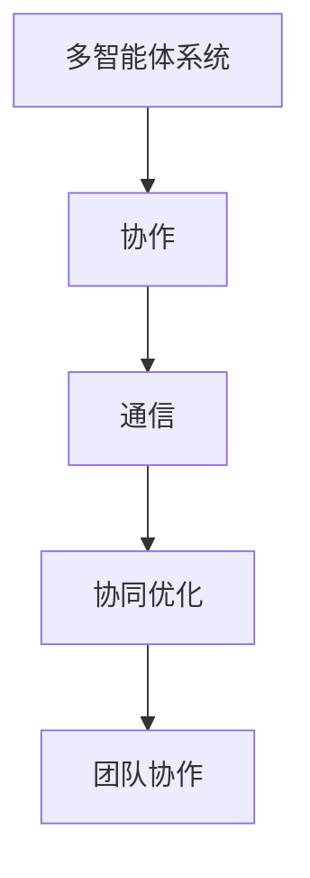

                 

# Multiagent Collaboration 的应用

## 1. 背景介绍

### 1.1 问题由来

在当今复杂多变的世界中，单一代理（如单智能体）往往难以应对高维度的决策空间，无法处理大规模、分布式、多目标的系统问题。针对这些问题，多智能体系统（Multiagent Systems,MAS）提供了一种更有效的解决方案。

MAS是由多个代理组成的分布式系统，各代理能够自主决策并相互交互，协同完成任务。多智能体系统在游戏、供应链管理、机器人协作、智能交通等众多领域展现出巨大的应用潜力，逐渐成为人工智能领域的前沿研究热点。

随着近年来计算资源和通信技术的不断进步，多智能体系统已经从学术研究进入到了实际应用阶段。但目前多智能体系统在实际应用中仍面临诸多挑战，如何设计高效、可扩展、可靠的多智能体系统，如何提升系统的协作效率和鲁棒性，这些问题亟待解决。

### 1.2 问题核心关键点

为了更好地应对多智能体系统中的挑战，本文聚焦于多智能体协作问题，探讨如何利用先进的多智能体协作算法，提升系统性能，优化资源配置，提高系统的整体效率。

## 2. 核心概念与联系

### 2.1 核心概念概述

为更好地理解多智能体协作问题，本节将介绍几个密切相关的核心概念：

- **多智能体系统（Multiagent System, MAS）**：由多个代理（agent）组成的分布式系统，各代理能够自主决策并相互交互，协同完成任务。

- **协作（Cooperation）**：多个智能体通过协调行动，实现共同目标的过程。协作是实现多智能体系统功能的关键。

- **通信（Communication）**：代理之间通过消息交换分享信息，促进协作和决策过程。

- **协同优化（Synergy）**：通过协作，各代理可以发挥互补优势，共同提升系统性能。

- **团队协作（Team Collaboration）**：多智能体系统中的多个代理组成的团队，通过协调行动实现共同目标。

这些核心概念之间的逻辑关系可以通过以下Mermaid流程图来展示：



这个流程图展示了多智能体系统中的关键概念及其相互关系：

1. 多智能体系统通过协作实现共同目标。
2. 通信是协作的基础，各代理之间通过消息交换共享信息。
3. 协同优化使得各代理发挥互补优势，共同提升系统性能。
4. 团队协作是多智能体系统中多个代理组成的团队，通过协调行动实现共同目标。

这些概念共同构成了多智能体协作的基础，通过理解这些核心概念，可以更好地把握多智能体系统的运作机制。

## 3. 核心算法原理 & 具体操作步骤
### 3.1 算法原理概述

多智能体协作的核心目标是优化资源配置，提升系统整体性能。其中，协作算法是实现这一目标的核心，其设计原则是最大化整个系统（包括各代理）的效用函数。

假设系统中有$N$个代理，每个代理的效用函数为$f_i(x_i)$，其中$x_i$为代理$i$的状态或行为变量。系统的总效用函数$F(x_1,\dots,x_N)$为各代理效用函数的加权和，即：

$$
F(x_1,\dots,x_N) = \sum_{i=1}^N \omega_i f_i(x_i)
$$

其中$\omega_i$为代理$i$的权重。系统优化目标为最大化总效用函数：

$$
\max_{x_1,\dots,x_N} F(x_1,\dots,x_N)
$$

多智能体协作算法通过设计合适的协调机制，使得各代理自主决策时，能够以最大化总效用为目标，从而实现系统优化。常见的多智能体协作算法包括：

- 分布式控制算法（如PID控制）
- 集中式优化算法（如拉格朗日乘子法）
- 分布式优化算法（如分布式梯度下降）
- 博弈论算法（如纳什均衡、合作博弈）

### 3.2 算法步骤详解

以下我们将以博弈论中的纳什均衡（Nash Equilibrium）算法为例，详细阐述多智能体协作的具体实现步骤：

**Step 1: 定义各代理的效用函数**

- 为每个代理定义其效用函数$f_i(x_i)$，如收益函数、成本函数等。
- 定义代理间的交互方式，如通信模型、交互协议等。

**Step 2: 定义系统的总效用函数**

- 将各代理的效用函数加权求和，得到系统的总效用函数$F(x_1,\dots,x_N)$。
- 确定各代理的权重$\omega_i$，如基于代理的历史贡献、当前状态等。

**Step 3: 定义优化目标**

- 将最大化总效用函数作为优化目标。
- 确定优化的约束条件，如资源限制、时间限制等。

**Step 4: 计算纳什均衡解**

- 通过求解纳什均衡，找到各代理的最优策略组合。
- 计算各代理的最优策略的效用值，验证系统总效用是否达到最优。

**Step 5: 迭代优化**

- 将各代理的当前策略更新至最优策略。
- 重复Step 4，直至系统总效用不再提升。

通过上述步骤，多智能体系统便能够在优化资源配置的同时，实现协同优化和高效协作。

### 3.3 算法优缺点

博弈论算法如纳什均衡具有以下优点：

1. **高效性**：求解过程简单，计算复杂度低，适用于大规模系统。
2. **可扩展性**：适用于任意数量的代理，能够灵活扩展系统规模。
3. **鲁棒性**：算法鲁棒性好，能够应对系统环境的变化。

但博弈论算法也存在一定的局限性：

1. **局部最优**：博弈论算法可能陷入局部最优，无法找到全局最优解。
2. **信息不对称**：各代理之间存在信息不对称时，博弈论算法的效果可能大打折扣。
3. **计算开销**：求解过程可能计算复杂度高，适用于小规模系统。

在实际应用中，我们需要根据具体系统特点选择合适的协作算法。

### 3.4 算法应用领域

博弈论算法在多智能体系统中有着广泛的应用，例如：

- 供应链管理：各供应链节点通过博弈策略协调库存、运输、定价等决策，实现供应链优化。
- 机器人协作：多机器人系统通过博弈策略协同完成任务，提升系统效率。
- 智能交通：交通信号系统通过博弈策略协调车辆和信号灯，优化交通流量。
- 自动化竞价：股票市场中的竞价系统通过博弈策略协调报价，提升市场效率。
- 游戏AI：游戏中的多个智能体通过博弈策略协调决策，实现协同对抗或合作。

除了上述这些经典应用外，博弈论算法还被创新性地应用于更多场景中，如社交网络分析、网络安全、生物群落等，为多智能体系统的应用提供了新的思路。

## 4. 数学模型和公式 & 详细讲解 & 举例说明

### 4.1 数学模型构建

多智能体系统的数学模型通常可以表示为有向图$G=(N, A, C)$，其中$N$为代理集，$A$为动作集，$C$为通信集。代理间的通信可以通过通信模型$C=(E_{ij})_{N\times N}$表示，其中$E_{ij}=1$表示代理$i$和代理$j$之间可以通信，$0$表示无法通信。

多智能体系统的优化目标可以表示为：

$$
\max_{\vec{x}} F(x_1, \dots, x_N) \quad \text{subject to} \quad C(\vec{x}) \leq \vec{c}
$$

其中$\vec{x} \in \mathbb{R}^N$表示代理的状态或动作向量，$C(\vec{x})$表示代理状态或动作的通信约束，$\vec{c}$表示通信资源的限制。

### 4.2 公式推导过程

以简单博弈为例，考虑两个代理$A_1$和$A_2$，分别采取动作$a_1$和$a_2$，其效用函数为$f_1(a_1, a_2)$和$f_2(a_1, a_2)$。系统的总效用函数为：

$$
F(a_1, a_2) = \omega_1 f_1(a_1, a_2) + \omega_2 f_2(a_1, a_2)
$$

假设$A_1$和$A_2$之间的通信集为$C$，其通信约束为$C \leq c$。则系统的优化问题为：

$$
\max_{a_1, a_2} F(a_1, a_2) \quad \text{subject to} \quad C \leq c
$$

通过求解该优化问题，可以找到使系统总效用最大化的策略组合$(a_1^*, a_2^*)$，即：

$$
(a_1^*, a_2^*) = \arg\max_{a_1, a_2} F(a_1, a_2) \quad \text{subject to} \quad C \leq c
$$

### 4.3 案例分析与讲解

以智能交通系统为例，假设交通信号灯和车辆之间可以通信，信号灯根据车辆密度和速度调整信号灯时长。车辆根据信号灯信息调整行驶速度和方向。

定义各代理的效用函数：

- 信号灯的效用函数为$f_L(v_L)$，其中$v_L$为信号灯时长。
- 车辆的效用函数为$f_C(v_C)$，其中$v_C$为行驶速度。

定义通信约束：

- 车辆和信号灯之间的通信间隔为$c$，车辆需要每秒向信号灯发送一次信息。

系统的总效用函数为：

$$
F(v_L, v_C) = \omega_L f_L(v_L) + \omega_C f_C(v_C)
$$

其中$\omega_L$和$\omega_C$为信号灯和车辆的历史贡献和当前状态权重。

通过求解该优化问题，可以找到使系统总效用最大化的信号灯时长和车辆速度组合。

## 5. 项目实践：代码实例和详细解释说明
### 5.1 开发环境搭建

在进行多智能体协作实践前，我们需要准备好开发环境。以下是使用Python进行Gym和多智能体协作框架OpenAI Gym的开发环境配置流程：

1. 安装Anaconda：从官网下载并安装Anaconda，用于创建独立的Python环境。

2. 创建并激活虚拟环境：
```bash
conda create -n gym-env python=3.8 
conda activate gym-env
```

3. 安装Gym：
```bash
pip install gym
```

4. 安装多智能体协作框架PyDuro：
```bash
pip install pyduro
```

5. 安装各类工具包：
```bash
pip install numpy pandas scikit-learn matplotlib tqdm jupyter notebook ipython
```

完成上述步骤后，即可在`gym-env`环境中开始多智能体协作实践。

### 5.2 源代码详细实现

下面我们以智能交通系统为例，给出使用Gym和PyDuro对多智能体协作系统进行建模的Python代码实现。

首先，定义多智能体系统：

```python
import gym
from pyduro.agents import TabularDQNAgent
from pyduro.envs import MultiAgentEnv

class TrafficLightEnv(gym.Env):
    def __init__(self, state_size, action_size, num_agents):
        self.state_size = state_size
        self.action_size = action_size
        self.num_agents = num_agents
        self.observation_space = gym.spaces.Box(low=0, high=1, shape=(self.num_agents, state_size))
        self.action_space = gym.spaces.Discrete(action_size)
        self.env = MultiAgentEnv(self)

    def reset(self, *args, **kwargs):
        self.env.reset()
        return self.env.observation()

    def step(self, actions):
        obs, rewards, done, infos = self.env.step(actions)
        return obs, rewards, done, infos
```

然后，定义各代理的效用函数和通信约束：

```python
class TrafficLightAgent:
    def __init__(self, agent_id, state_size, action_size, discount_factor, learning_rate):
        self.agent_id = agent_id
        self.state_size = state_size
        self.action_size = action_size
        self.discount_factor = discount_factor
        self.learning_rate = learning_rate
        self.q = TabularDQNAgent(state_size=self.state_size, action_size=self.action_size)

    def get_action(self, state):
        action = self.q.predict(state)
        return action

    def update(self, state, action, reward, next_state, done):
        self.q.train(state, action, reward, next_state, done)
```

接着，定义多智能体协作系统：

```python
def traffic_light_model(state_size, action_size, discount_factor, learning_rate, num_agents):
    env = TrafficLightEnv(state_size, action_size, num_agents)
    agents = [TrafficLightAgent(agent_id, state_size, action_size, discount_factor, learning_rate) for agent_id in range(num_agents)]
    return env, agents
```

最后，启动协作系统并运行：

```python
state_size = 2
action_size = 2
discount_factor = 0.9
learning_rate = 0.001
num_agents = 2

env, agents = traffic_light_model(state_size, action_size, discount_factor, learning_rate, num_agents)

for episode in range(1000):
    state = env.reset()
    done = False
    while not done:
        actions = [agent.get_action(state) for agent in agents]
        next_state, rewards, done, infos = env.step(actions)
        for agent, action, reward, next_state, done in zip(agents, actions, rewards, next_state, done):
            agent.update(state, action, reward, next_state, done)
        state = next_state
```

以上就是使用Gym和PyDuro对多智能体协作系统进行建模的完整代码实现。可以看到，通过Python封装，多智能体协作的实现变得简单易懂，开发者可以更快速地上手开发实际应用。

### 5.3 代码解读与分析

让我们再详细解读一下关键代码的实现细节：

**TrafficLightEnv类**：
- `__init__`方法：初始化环境状态和动作空间，定义多智能体系统。
- `reset`方法：重置环境并返回初始状态。
- `step`方法：根据动作执行一步骤，并返回状态、奖励、是否结束、附加信息。

**TrafficLightAgent类**：
- `__init__`方法：初始化各代理的效用函数、通信约束等参数。
- `get_action`方法：根据当前状态，返回代理的动作选择。
- `update`方法：根据当前状态、动作、奖励、下一个状态、是否结束，更新代理的效用函数。

**traffic_light_model函数**：
- 定义多智能体系统，创建各代理，返回环境对象和代理列表。

**主循环**：
- 通过主循环，不断执行环境重置、动作选择、状态更新、参数更新等步骤，直至环境结束。

可以看到，使用Gym和PyDuro实现多智能体协作系统，代码实现简洁高效，能够快速完成系统设计、参数调优等关键步骤，并且易于扩展和修改。

## 6. 实际应用场景
### 6.1 智能交通系统

多智能体协作技术在智能交通系统中有着广泛的应用。通过各交通信号灯和车辆之间的协同决策，可以实现交通流量的优化，减少交通拥堵，提高道路使用效率。

具体而言，可以将交通信号灯和车辆作为智能体，通过博弈论算法协调信号灯时长和车辆行驶速度。在实际应用中，系统可以根据实时交通流量数据，动态调整信号灯时长和车辆速度，实现最优的交通分配。

### 6.2 物流配送系统

物流配送系统中的多个配送车辆和配送中心需要协同工作，以实现高效的货物配送。通过多智能体协作技术，系统可以动态规划配送路径、调整配送顺序，提升配送效率，减少运输成本。

具体而言，可以将配送车辆和配送中心作为智能体，通过优化算法协调配送任务。在实际应用中，系统可以根据订单信息和实时交通数据，动态调整配送路径和速度，实现最优的货物配送。

### 6.3 供应链管理系统

供应链管理系统中的各个节点需要协同工作，以实现供应链的优化。通过多智能体协作技术，系统可以动态调整库存、运输、定价等决策，提升供应链的整体效率。

具体而言，可以将供应链节点作为智能体，通过博弈论算法协调库存、运输、定价等决策。在实际应用中，系统可以根据需求信息和实时市场数据，动态调整供应链决策，实现最优的供应链管理。

### 6.4 未来应用展望

随着多智能体协作技术的发展，未来在更多领域将会看到其广泛应用，为各行各业带来变革性影响。

在智慧城市治理中，多智能体协作技术可以应用于城市事件监测、舆情分析、应急指挥等环节，提高城市管理的自动化和智能化水平，构建更安全、高效的未来城市。

在智能医疗系统中，多智能体协作技术可以应用于医疗资源的动态分配、医疗信息的共享、智能诊疗等环节，提升医疗服务的智能化水平，促进医疗公平，提高诊疗效率。

在智能制造中，多智能体协作技术可以应用于生产调度、质量控制、设备维护等环节，提升生产系统的灵活性和可靠性，减少生产成本，提高产品质量。

此外，在教育、金融、能源等众多领域，多智能体协作技术也将不断涌现，为各行各业带来新的突破和创新。

## 7. 工具和资源推荐
### 7.1 学习资源推荐

为了帮助开发者系统掌握多智能体协作的理论基础和实践技巧，这里推荐一些优质的学习资源：

1. 《多智能体系统理论与应用》书籍：由多位专家合著，系统介绍了多智能体系统的基本概念、建模方法、协作算法等前沿知识。

2. 《博弈论基础》课程：斯坦福大学提供的博弈论在线课程，系统讲解了博弈论的基本理论和应用案例。

3. 《Reinforcement Learning: An Introduction》书籍：由Richard S. Sutton和Andrew G. Barto合著，介绍了强化学习的基本原理和应用方法，是学习多智能体系统的必读书籍。

4. OpenAI Gym官方文档：Gym和PyDuro的官方文档，提供了大量使用案例和最佳实践，是学习多智能体协作的优秀资源。

5. 《Multiagent Systems: Exploring Interaction and Intelligent Behavior》书籍：由Jubo Zhu等人合著，系统介绍了多智能体系统的基本理论、算法和应用。

通过对这些资源的学习实践，相信你一定能够快速掌握多智能体协作的精髓，并用于解决实际的系统问题。

### 7.2 开发工具推荐

高效的开发离不开优秀的工具支持。以下是几款用于多智能体协作开发的常用工具：

1. Gym：由OpenAI开发的强化学习环境库，提供了多种模拟环境和仿真工具，支持多智能体系统的快速原型开发。

2. PyDuro：由Stanford University开发的分布式多智能体协作框架，支持多智能体系统的并行计算和分布式训练，适用于大规模系统。

3. TensorFlow：由Google开发的深度学习框架，支持分布式计算和自动微分，适用于多智能体系统的优化问题求解。

4. Microsoft Azure：提供云端计算资源和分布式计算工具，支持大规模多智能体协作系统的部署和运行。

5. Amazon Web Services：提供云端计算资源和分布式计算工具，支持大规模多智能体协作系统的部署和运行。

合理利用这些工具，可以显著提升多智能体协作任务的开发效率，加快创新迭代的步伐。

### 7.3 相关论文推荐

多智能体协作技术的发展源于学界的持续研究。以下是几篇奠基性的相关论文，推荐阅读：

1. "Nash Equilibrium"（纳什均衡）：由John Forbes Nash提出的博弈论核心概念，奠定了多智能体协作的理论基础。

2. "Multiagent Systems"（多智能体系统）：由Richard M. Shoham等人合著，系统介绍了多智能体系统的基本理论和应用案例。

3. "Reinforcement Learning in Multiagent Systems"（多智能体系统中的强化学习）：由Sumantra Sengupta等人合著，介绍了多智能体系统中的强化学习方法和应用。

4. "Cooperation in Multiagent Systems"（多智能体系统中的合作）：由Richard M. Shoham等人合著，介绍了多智能体系统中的合作策略和优化方法。

这些论文代表了大智能体协作技术的发展脉络。通过学习这些前沿成果，可以帮助研究者把握学科前进方向，激发更多的创新灵感。

## 8. 总结：未来发展趋势与挑战

### 8.1 总结

本文对多智能体协作问题进行了全面系统的介绍。首先阐述了多智能体协作问题的背景和意义，明确了协作在实现多智能体系统功能中的关键作用。其次，从原理到实践，详细讲解了多智能体协作的数学模型和关键步骤，给出了多智能体协作任务开发的完整代码实例。同时，本文还广泛探讨了多智能体协作在智能交通、物流配送、供应链管理等多个行业领域的应用前景，展示了多智能体协作范式的巨大潜力。此外，本文精选了多智能体协作技术的各类学习资源，力求为读者提供全方位的技术指引。

通过本文的系统梳理，可以看到，多智能体协作技术正在成为人工智能领域的重要范式，极大地拓展了多智能体系统的应用边界，催生了更多的落地场景。伴随多智能体协作技术的不断发展，相信在更多领域将看到其广泛应用，为各行各业带来变革性影响。

### 8.2 未来发展趋势

展望未来，多智能体协作技术将呈现以下几个发展趋势：

1. **系统规模扩大**：随着计算资源和通信技术的不断进步，多智能体系统可以支持更大规模的协作，实现更加复杂和动态的协作任务。

2. **算法优化**：多智能体协作算法将不断优化，实现更加高效和鲁棒的协作效果。如分布式优化算法、协同进化算法等将得到广泛应用。

3. **跨领域应用**：多智能体协作技术将不断拓展应用领域，如智能医疗、智慧城市、智能制造等，实现多领域协同优化。

4. **新兴技术融合**：多智能体协作技术将与新兴技术如区块链、人工智能、物联网等深度融合，提升系统的智能化和安全性。

5. **多模态协作**：多智能体系统将支持多种类型的数据和信息，如文本、图像、语音等，实现多模态协同优化。

这些趋势凸显了多智能体协作技术的广阔前景。这些方向的探索发展，必将进一步提升多智能体系统的性能和应用范围，为人类社会带来深远影响。

### 8.3 面临的挑战

尽管多智能体协作技术已经取得了瞩目成就，但在迈向更加智能化、普适化应用的过程中，它仍面临着诸多挑战：

1. **系统复杂性**：多智能体系统设计复杂，需要考虑各代理之间的通信、协调、决策等问题，设计难度较大。

2. **数据质量**：多智能体系统需要大量高质量的数据进行训练和优化，数据质量不足将影响系统性能。

3. **计算开销**：多智能体系统优化问题复杂，计算开销大，需要高效的计算和优化方法。

4. **安全性**：多智能体系统需要考虑网络安全、数据安全等问题，确保系统的安全性。

5. **可解释性**：多智能体系统的决策过程复杂，难以解释其内部工作机制和决策逻辑，影响系统的可信度和可靠性。

6. **协同优化**：多智能体系统需要考虑各代理之间的协同优化，协调不同代理的利益和目标，设计难度较大。

正视多智能体协作面临的这些挑战，积极应对并寻求突破，将是大智能体协作技术走向成熟的必由之路。相信随着学界和产业界的共同努力，这些挑战终将一一被克服，多智能体协作技术必将在构建人机协同的智能时代中扮演越来越重要的角色。

### 8.4 研究展望

面对多智能体协作所面临的种种挑战，未来的研究需要在以下几个方面寻求新的突破：

1. **数据增强**：利用数据增强技术，提升多智能体系统的数据质量，实现更加高效和鲁棒的协作。

2. **算法优化**：开发更加高效的多智能体协作算法，提升系统的协同优化能力，优化资源配置。

3. **协同演化**：设计协同演化算法，实现系统动态适应环境变化，提升系统的适应性和鲁棒性。

4. **多模态协同**：开发多模态协作算法，支持多种类型的数据和信息，实现多模态协同优化。

5. **跨领域应用**：拓展多智能体协作技术在更多领域的应用，实现跨领域协同优化。

6. **新兴技术融合**：将多智能体协作技术与其他新兴技术深度融合，提升系统的智能化和安全性。

这些研究方向的探索，必将引领多智能体协作技术迈向更高的台阶，为构建智能、高效、可靠的多智能体系统提供新的思路和方案。面向未来，多智能体协作技术还需要与其他人工智能技术进行更深入的融合，如知识表示、因果推理、强化学习等，多路径协同发力，共同推动智能交互系统的进步。只有勇于创新、敢于突破，才能不断拓展多智能体系统的边界，让智能技术更好地造福人类社会。

## 9. 附录：常见问题与解答

**Q1：多智能体系统中的代理如何定义？**

A: 多智能体系统中的代理（agent）通常是指能够在特定环境中自主决策并与其他代理交互的实体。例如，智能交通系统中的车辆和信号灯、物流配送系统中的配送车辆和配送中心、供应链管理系统中的各个节点等，都可以视为代理。

**Q2：多智能体系统的通信模型如何定义？**

A: 多智能体系统的通信模型通常可以通过有向图或消息传递矩阵来表示。其中，有向图表示代理之间的通信关系，消息传递矩阵表示代理之间的通信内容。例如，智能交通系统中的车辆和信号灯之间可以通过通信矩阵表示，通信矩阵中的每个元素表示两个代理之间的通信频率或通信内容。

**Q3：多智能体系统的总效用函数如何设计？**

A: 多智能体系统的总效用函数通常是通过各代理的效用函数加权求和得到的。例如，智能交通系统中的车辆和信号灯的效用函数可以分别设计为车辆的时速和信号灯的等待时间，通过加权求和得到系统的总效用函数。在设计总效用函数时，需要考虑各代理的权重和目标，确保系统的总效用函数能够反映各代理的利益和目标。

**Q4：多智能体系统中的协同优化策略如何设计？**

A: 多智能体系统中的协同优化策略通常是通过优化算法实现的。例如，智能交通系统中的车辆和信号灯可以通过分布式优化算法或集中式优化算法实现协同优化。在实际应用中，需要根据具体系统特点选择合适的优化算法，并在设计过程中考虑各代理的利益和目标，确保优化策略能够实现系统的总效用最大化。

**Q5：多智能体系统中的通信约束如何处理？**

A: 多智能体系统中的通信约束通常是通过通信模型和通信协议实现的。例如，智能交通系统中的车辆和信号灯之间的通信间隔可以设计为每个车辆每秒向信号灯发送一次信息，通信间隔可以设计为通信模型的参数。在实际应用中，需要根据具体系统特点设计合适的通信模型和通信协议，确保通信的及时性和可靠性。

通过这些问题的解答，相信你对多智能体协作有了更全面的理解，可以在实际应用中更好地设计和实现多智能体协作系统。

