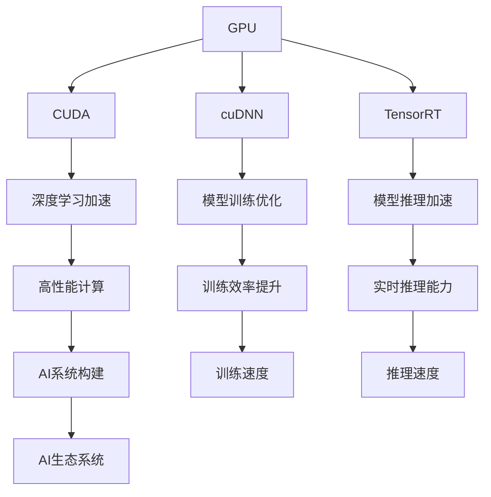

                 

# NVIDIA与AI算力的进化

## 1. 背景介绍

### 1.1 问题由来

随着人工智能技术的快速发展，算力作为AI系统的核心基础设施，其重要性日益凸显。尤其是NVIDIA作为AI计算领域的佼佼者，其在GPU、TPU等硬件设施上的创新，以及在CUDA、cuDNN、TensorRT等软件栈上的优化，极大地推动了AI技术的进步。本节将系统回顾NVIDIA在AI算力方面的主要历程，并对未来趋势进行展望。

### 1.2 问题核心关键点

NVIDIA在AI算力方面的成功主要归功于其在以下几个关键领域的创新：

1. **GPU硬件架构的革新**：NVIDIA的CUDA平台采用了独特的架构设计，使得其GPU在并行计算和能效比上具有显著优势。
2. **深度学习优化库cuDNN**：cuDNN作为深度学习加速库，大大提升了深度学习模型的训练速度和效率。
3. **深度学习推理加速器TensorRT**：TensorRT提供了高效的深度学习推理引擎，使得AI模型在边缘设备上的实时推理成为可能。
4. **生态系统的构建**：NVIDIA通过其强大的GPU生态系统，与多家AI公司和研究机构合作，推动AI技术的广泛应用。
5. **硬件和软件协同优化**：NVIDIA在硬件设计和软件优化上的协同，使得其AI算力解决方案具备了极高的性价比。

这些创新不仅提升了NVIDIA在AI市场的竞争力，也为整个AI行业的算力基础设施建设树立了标杆。

### 1.3 问题研究意义

NVIDIA在AI算力方面的持续创新，不仅提升了自身的市场份额和品牌影响力，也为AI技术在各行业的应用提供了坚实的技术基础。通过系统梳理NVIDIA在AI算力方面的历程和成就，可以帮助读者更全面地理解AI计算架构的设计理念和技术演进，从而更好地规划未来AI系统的发展方向。

## 2. 核心概念与联系

### 2.1 核心概念概述

为更好地理解NVIDIA在AI算力方面的技术历程，本节将介绍几个关键概念：

- **GPU（图形处理单元）**：一种专门设计用于并行处理任务的硬件设备，适用于深度学习和AI推理等计算密集型任务。
- **CUDA（计算统一设备架构）**：NVIDIA开发的一种并行计算模型，用于高效利用GPU的计算能力，加速深度学习模型的训练和推理。
- **cuDNN（CUDA Deep Neural Network库）**：NVIDIA提供的深度学习优化库，包含多种深度学习算法的实现，用于加速模型的训练过程。
- **TensorRT（深度学习推理加速器）**：NVIDIA开发的深度学习推理优化平台，用于提升深度学习模型的实时推理性能。
- **AI生态系统**：包括硬件设备、深度学习框架、中间件等在内的综合解决方案，旨在提供全栈AI计算能力。

这些核心概念之间的逻辑关系可以通过以下Mermaid流程图来展示：



这个流程图展示了NVIDIA在AI计算方面的关键技术栈：GPU作为计算基础，CUDA平台提供了并行计算模型，cuDNN库和TensorRT平台分别优化了模型训练和推理过程，从而构建出高性能、高效能的AI生态系统。

## 3. 核心算法原理 & 具体操作步骤
### 3.1 算法原理概述

NVIDIA在AI算力方面的核心算法原理主要体现在以下几个方面：

1. **并行计算架构**：NVIDIA的GPU采用了多核、多线程、多块等并行计算架构，使得其能够高效利用硬件资源。
2. **内存管理优化**：NVIDIA在GPU内存管理上进行了优化，如使用P2P技术减少内存访问延迟，提升数据传输效率。
3. **深度学习优化算法**：NVIDIA在深度学习算法上进行了针对性优化，如使用卷积核共享、矩阵分解等技术，提升模型训练和推理效率。
4. **硬件和软件协同设计**：NVIDIA的GPU与CUDA、cuDNN、TensorRT等软件栈进行了深度协同设计，确保硬件资源和计算逻辑的完美匹配。

这些算法原理使得NVIDIA的GPU在深度学习领域具备了卓越的性能和能效比，为其在AI算力市场的领先地位奠定了坚实基础。

### 3.2 算法步骤详解

NVIDIA在AI算力方面的具体操作流程主要包括以下几个步骤：

**Step 1: GPU硬件设计**
- 设计高性能GPU架构，包括多核、多线程、多块等。
- 优化GPU内存管理，如使用P2P技术减少内存访问延迟。
- 集成高带宽内存和高速缓存，提升数据传输和处理效率。

**Step 2: CUDA平台开发**
- 开发CUDA并行计算模型，提供高效的内存管理和任务调度机制。
- 提供丰富的并行计算API，方便开发者进行任务并行化。
- 支持多种编程语言，如C++、Python等，方便开发者使用。

**Step 3: cuDNN库优化**
- 实现多种深度学习算法的优化版本，如卷积、池化、归一化等。
- 提供高效的算法实现，如使用矩阵分解、核共享等技术。
- 支持多种深度学习框架，如TensorFlow、PyTorch等。

**Step 4: TensorRT平台开发**
- 开发深度学习推理加速器TensorRT，提升模型的实时推理能力。
- 提供优化工具和插件，如量化、剪枝、融合等，提升模型推理效率。
- 支持多种推理模型和设备，如CPU、GPU、FPGA等。

**Step 5: AI生态系统构建**
- 构建完整的AI生态系统，包括硬件、软件和工具。
- 提供丰富的API和SDK，方便开发者进行AI应用开发。
- 与多家AI公司和研究机构合作，推动AI技术的广泛应用。

通过以上步骤，NVIDIA能够全面覆盖从硬件设计到软件优化的各个环节，提供一站式的AI算力解决方案。

### 3.3 算法优缺点

NVIDIA在AI算力方面的优势主要体现在以下几个方面：

1. **高性能**：NVIDIA的GPU在并行计算和能效比上具有显著优势，适用于深度学习和AI推理等计算密集型任务。
2. **易用性**：NVIDIA提供的CUDA、cuDNN和TensorRT等软件栈，具有高效、易用的特点，大大降低了AI应用的开发难度。
3. **广泛应用**：NVIDIA的AI算力解决方案广泛应用于各行业，如自动驾驶、医疗、金融等，推动了AI技术的广泛应用。
4. **持续创新**：NVIDIA在硬件和软件上的持续创新，使得其AI算力解决方案能够紧跟技术发展趋势，保持市场竞争力。

然而，NVIDIA在AI算力方面的劣势也较为明显：

1. **成本高**：NVIDIA的高性能GPU价格较高，对一些中小企业和小规模应用可能存在成本压力。
2. **软件兼容性**：虽然NVIDIA的软件栈丰富，但与其他厂商的软件兼容问题仍需解决，增加了开发和维护的难度。
3. **生态系统复杂**：NVIDIA的AI生态系统复杂庞大，新手开发者可能需要一定时间学习和适应。

## 4. 数学模型和公式 & 详细讲解 & 举例说明

### 4.1 数学模型构建

NVIDIA在AI算力方面的数学模型构建主要涉及深度学习模型的优化和加速。以卷积神经网络（Convolutional Neural Networks, CNN）为例，其数学模型可以表示为：

$$
y = f(x; \theta) = \sigma(Wx + b)
$$

其中，$x$ 为输入数据，$y$ 为输出结果，$\theta$ 为模型参数，$f$ 为非线性激活函数，$W$ 为权重矩阵，$b$ 为偏置向量。

### 4.2 公式推导过程

以卷积层为例，其公式推导如下：

$$
y_{i,j,k} = \sum_{m,n} w_{m,n} x_{i-m,j-n,k} + b_k
$$

其中，$y_{i,j,k}$ 为卷积层的输出特征图，$x_{i-m,j-n,k}$ 为输入特征图，$w_{m,n}$ 为卷积核权重，$b_k$ 为偏置项。

### 4.3 案例分析与讲解

以NVIDIA在深度学习优化库cuDNN中的应用为例，cuDNN实现了多种深度学习算法的优化版本，如卷积、池化、归一化等。以卷积算法为例，cuDNN的优化实现如下：

$$
y_{i,j,k} = \sum_{m,n} w_{m,n} x_{i-m,j-n,k} + b_k
$$

其中，$w_{m,n}$ 为卷积核权重，$x_{i-m,j-n,k}$ 为输入特征图，$b_k$ 为偏置项。

通过cuDNN的优化，卷积算法在GPU上的执行速度得到了显著提升，从而大大加速了深度学习模型的训练和推理过程。

## 5. 项目实践：代码实例和详细解释说明

### 5.1 开发环境搭建

在进行AI算力实践前，我们需要准备好开发环境。以下是使用NVIDIA CUDA进行深度学习开发的环境配置流程：

1. 安装NVIDIA CUDA Toolkit：从官网下载并安装CUDA Toolkit，用于CUDA开发环境的设置。
2. 配置环境变量：将CUDA目录添加到系统环境变量中，确保编译器能够找到CUDA库和头文件。
3. 安装依赖库：如TensorRT、OpenCV等，确保项目所需的库和工具包能够正确安装。

完成上述步骤后，即可在NVIDIA CUDA环境中开始深度学习开发。

### 5.2 源代码详细实现

下面以TensorRT为例，给出使用NVIDIA CUDA进行深度学习推理加速的PyTorch代码实现。

```python
import torch
import torchvision
import torchvision.transforms as transforms
import tensorrt as trt

# 加载模型
model = torchvision.models.resnet50(pretrained=True)
model.eval()

# 配置TensorRT
TRT_LOGGER = trt.Logger(trt.Logger.INFO)
network = trt.Net()
network.build_model(TRT_LOGGER, TRT_LOGGER, [trt.InputShape(*[1, 3, 224, 224])])

# 转换模型
trt_model = trt.Builder(TRT_LOGGER)
converted_model = trt_model.build_model(network, TRT_LOGGER)

# 进行推理
inputs = torch.randn(1, 3, 224, 224)
result = converted_model.run(inputs)

print(result)
```

在这个代码中，我们首先加载了ResNet50模型，然后配置了TensorRT，并将模型转换为TensorRT引擎。最后，我们对模型进行了推理，并输出了结果。

### 5.3 代码解读与分析

让我们再详细解读一下关键代码的实现细节：

**TensorRT配置**：
- `TRT_LOGGER`：用于记录TensorRT日志，方便调试和优化。
- `network.build_model()`：使用TensorRT构建网络模型，指定输入输出形状和维度。
- `trt_model.build_model()`：使用TensorRT编译模型，生成TRT引擎。

**模型转换**：
- `trt_model.build_model()`：使用TensorRT编译模型，生成TRT引擎。

**推理**：
- `inputs`：输入张量，指定模型推理的输入数据。
- `result`：模型推理的结果，包含模型输出的张量。

通过TensorRT的优化，深度学习模型的推理速度得到了显著提升，从而在边缘设备上实现了高效的实时推理。

## 6. 实际应用场景
### 6.1 自动驾驶

NVIDIA在自动驾驶领域的AI算力解决方案主要体现在以下几个方面：

1. **感知**：利用深度学习模型进行环境感知，识别道路、车辆、行人等障碍物。
2. **决策**：基于感知结果，使用深度学习模型进行路径规划和决策。
3. **执行**：控制车辆转向、加速、制动等，实现自动驾驶。

NVIDIA的AI算力解决方案在自动驾驶领域的应用，大大提升了自动驾驶系统的感知、决策和执行能力，为自动驾驶技术的落地打下了坚实的基础。

### 6.2 医疗影像分析

在医疗影像分析方面，NVIDIA的AI算力解决方案主要体现在以下几个方面：

1. **图像增强**：使用深度学习模型进行图像去噪、增强等预处理操作。
2. **病灶检测**：利用深度学习模型进行肿瘤、病灶等异常区域的检测。
3. **诊断分析**：基于检测结果，使用深度学习模型进行疾病诊断和分析。

NVIDIA的AI算力解决方案在医疗影像分析领域的应用，大大提升了诊断的准确性和效率，为医疗影像分析技术的应用推广提供了强有力的支持。

### 6.3 金融交易

在金融交易方面，NVIDIA的AI算力解决方案主要体现在以下几个方面：

1. **市场分析**：使用深度学习模型进行股票、期货等市场数据的分析和预测。
2. **风险管理**：基于市场分析结果，使用深度学习模型进行风险管理和控制。
3. **交易策略优化**：基于风险管理结果，使用深度学习模型进行交易策略的优化和调整。

NVIDIA的AI算力解决方案在金融交易领域的应用，大大提升了交易的效率和精度，为金融交易的智能化转型提供了坚实的基础。

### 6.4 未来应用展望

未来，NVIDIA的AI算力解决方案将继续在更多领域得到应用，为各行业带来变革性影响。

1. **智慧城市**：NVIDIA的AI算力解决方案可以应用于智慧城市中的交通管理、环境监测、应急响应等环节，提升城市管理效率和智能化水平。
2. **智能制造**：在智能制造领域，NVIDIA的AI算力解决方案可以应用于质量检测、生产调度、设备维护等环节，提升生产效率和质量。
3. **智能家居**：在智能家居领域，NVIDIA的AI算力解决方案可以应用于语音识别、智能控制、安全监控等环节，提升用户的生活体验。

总之，随着NVIDIA在AI算力方面的持续创新和优化，AI技术将在更多领域得到广泛应用，为各行业带来深远的变革。

## 7. 工具和资源推荐
### 7.1 学习资源推荐

为了帮助开发者系统掌握NVIDIA在AI算力方面的技术知识，这里推荐一些优质的学习资源：

1. **NVIDIA CUDA文档**：NVIDIA官方提供的CUDA文档，包含了详细的API、编程指南和最佳实践。
2. **NVIDIA cuDNN文档**：NVIDIA官方提供的cuDNN文档，包含了深度学习算法的优化实现和使用方法。
3. **NVIDIA TensorRT文档**：NVIDIA官方提供的TensorRT文档，包含了深度学习推理的优化方法和应用案例。
4. **NVIDIA AI开发者平台**：NVIDIA提供的AI开发者平台，包含了丰富的AI工具和资源，方便开发者进行深度学习开发和应用。
5. **深度学习在线课程**：如Coursera、Udacity等在线课程平台上的深度学习课程，包含NVIDIA的CUDA、cuDNN和TensorRT等内容。

通过对这些资源的学习实践，相信你一定能够快速掌握NVIDIA在AI算力方面的技术知识，并用于解决实际的深度学习问题。

### 7.2 开发工具推荐

高效的深度学习开发离不开优秀的工具支持。以下是几款用于深度学习开发的常用工具：

1. **PyTorch**：NVIDIA官方支持的深度学习框架，具有灵活的动态计算图和丰富的API，适合NVIDIA硬件平台的深度学习开发。
2. **TensorFlow**：由Google主导开发的深度学习框架，具有强大的分布式计算能力和灵活的模型构建方法，适合大规模深度学习开发。
3. **TensorRT**：NVIDIA官方提供的深度学习推理加速平台，具有高效的模型优化和推理加速能力，适合边缘设备的实时推理。
4. **Visual Studio**：微软提供的IDE，支持深度学习开发和调试，适合NVIDIA硬件平台的深度学习开发。
5. **GitHub**：全球最大的代码托管平台，适合深度学习项目和代码的共享和协作。

合理利用这些工具，可以显著提升深度学习开发和优化的效率，加速创新迭代的步伐。

### 7.3 相关论文推荐

NVIDIA在AI算力方面的成功得益于其持续的研究和创新。以下是几篇奠基性的相关论文，推荐阅读：

1. **CUDA: A Parallel Computing Platform and Programming Model**：NVIDIA开发的CUDA平台，奠定了GPU并行计算的基础。
2. **cuDNN: An Open-Source Deep Learning Library**：NVIDIA开发的深度学习优化库，提供了高效的深度学习算法实现。
3. **TensorRT: A High-Performance Deep Learning Inference Optimizer**：NVIDIA开发的深度学习推理加速器，大大提升了深度学习模型的实时推理能力。
4. **NVIDIA's Next-Gen AI Supercomputing Solution**：NVIDIA最新的AI超级计算解决方案，展示了其在AI算力方面的最新进展和创新。

这些论文代表了大语言模型微调技术的发展脉络，通过学习这些前沿成果，可以帮助研究者把握学科前进方向，激发更多的创新灵感。

## 8. 总结：未来发展趋势与挑战

### 8.1 总结

本文对NVIDIA在AI算力方面的主要历程和成就进行了系统回顾，并对未来趋势进行了展望。通过全面梳理NVIDIA在GPU硬件、CUDA平台、cuDNN库、TensorRT平台等方面的技术进展，帮助读者更好地理解AI算力的构建原理和技术演进，从而更好地规划未来AI系统的发展方向。

### 8.2 未来发展趋势

展望未来，NVIDIA在AI算力方面的发展趋势主要体现在以下几个方面：

1. **硬件性能提升**：NVIDIA将继续在GPU硬件性能上进行创新，提升其并行计算能力和能效比，为深度学习和大规模计算提供更强大的支持。
2. **软件生态优化**：NVIDIA将进一步优化其CUDA、cuDNN和TensorRT等软件栈，提升深度学习算法的执行效率和优化能力，为开发者提供更易用的开发环境。
3. **跨平台支持**：NVIDIA将进一步拓展其AI算力解决方案的适用范围，支持更多平台和设备，如边缘设备、云平台等，为AI技术的广泛应用提供更多可能性。
4. **AI融合应用**：NVIDIA将进一步推动AI技术与各行业的融合，为自动驾驶、医疗、金融等领域提供更全面、高效的解决方案。

这些发展趋势将使得NVIDIA的AI算力解决方案在全球AI市场保持领先地位，推动AI技术在更多领域得到应用。

### 8.3 面临的挑战

尽管NVIDIA在AI算力方面取得了显著成就，但在迈向更加智能化、普适化应用的过程中，仍面临诸多挑战：

1. **成本问题**：NVIDIA高性能GPU的价格较高，对一些中小企业和小规模应用可能存在成本压力。如何降低AI算力解决方案的成本，提升其普及性，将是一大难题。
2. **软件兼容性**：NVIDIA的软件栈虽然丰富，但与其他厂商的软件兼容性问题仍需解决，增加了开发和维护的难度。
3. **生态系统复杂**：NVIDIA的AI生态系统复杂庞大，新手开发者可能需要一定时间学习和适应。如何简化生态系统，提升开发效率，将是一个重要课题。
4. **性能瓶颈**：尽管NVIDIA在硬件和软件优化上取得了巨大进展，但在一些高并行度、高计算量的场景中，仍可能存在性能瓶颈。如何突破这些瓶颈，提升AI算力的极限性能，将是未来的研究方向。

### 8.4 研究展望

面对NVIDIA在AI算力方面面临的挑战，未来的研究需要在以下几个方面寻求新的突破：

1. **硬件优化**：进一步优化GPU硬件架构，提升其并行计算能力和能效比，为深度学习和大规模计算提供更强大的支持。
2. **软件协同**：进一步优化CUDA、cuDNN和TensorRT等软件栈，提升深度学习算法的执行效率和优化能力，为开发者提供更易用的开发环境。
3. **跨平台支持**：进一步拓展AI算力解决方案的适用范围，支持更多平台和设备，为AI技术的广泛应用提供更多可能性。
4. **生态系统简化**：简化NVIDIA的AI生态系统，提升开发效率，降低开发和维护难度。
5. **性能突破**：突破高性能计算的性能瓶颈，提升AI算力的极限性能，推动AI技术在更多领域的应用。

通过在硬件、软件和生态系统等方面的全面创新和优化，NVIDIA有望在AI算力市场保持领先地位，推动AI技术在更多领域得到应用。

## 9. 附录：常见问题与解答

**Q1：什么是CUDA？**

A: CUDA（Compute Unified Device Architecture）是NVIDIA开发的并行计算模型，用于高效利用GPU的计算能力，加速深度学习模型的训练和推理。

**Q2：什么是cuDNN？**

A: cuDNN（CUDA Deep Neural Network库）是NVIDIA提供的深度学习优化库，包含多种深度学习算法的优化实现，用于加速模型的训练过程。

**Q3：什么是TensorRT？**

A: TensorRT是NVIDIA开发的深度学习推理加速器，提供高效的模型优化和推理加速能力，使得深度学习模型在边缘设备上的实时推理成为可能。

**Q4：如何优化NVIDIA的AI算力解决方案？**

A: 优化NVIDIA的AI算力解决方案可以从以下几个方面入手：
1. 优化GPU硬件架构，提升并行计算能力和能效比。
2. 优化CUDA、cuDNN和TensorRT等软件栈，提升深度学习算法的执行效率和优化能力。
3. 优化模型设计和算法实现，提升模型的训练和推理效率。
4. 优化开发环境和管理工具，提升开发和维护效率。

通过全面优化硬件、软件和开发环境，可以显著提升NVIDIA的AI算力解决方案的性能和可维护性，推动AI技术在更多领域的应用。

**Q5：NVIDIA的AI算力解决方案未来有哪些发展方向？**

A: NVIDIA的AI算力解决方案未来将进一步在以下几个方向进行创新和优化：
1. 提升GPU硬件性能，提升并行计算能力和能效比。
2. 优化CUDA、cuDNN和TensorRT等软件栈，提升深度学习算法的执行效率和优化能力。
3. 拓展AI算力解决方案的适用范围，支持更多平台和设备。
4. 推动AI技术与各行业的融合，为更多领域提供高效的AI解决方案。
5. 简化AI生态系统，提升开发和维护效率。

通过在硬件、软件和生态系统等方面的全面创新和优化，NVIDIA的AI算力解决方案将保持在全球市场的领先地位，推动AI技术在更多领域得到应用。

---

作者：禅与计算机程序设计艺术 / Zen and the Art of Computer Programming

