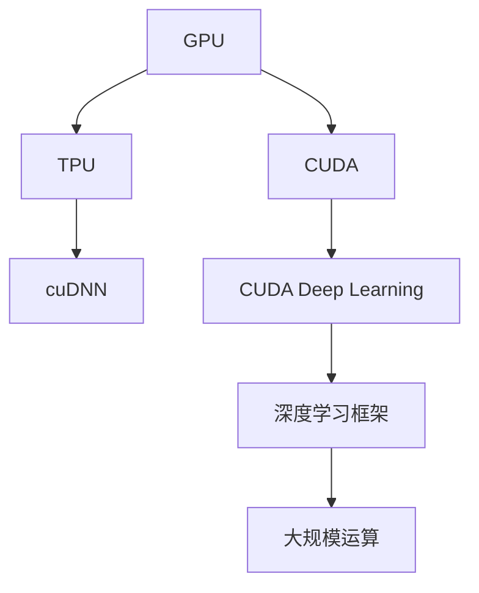

                 

# NVIDIA与大规模运算的支持

## 1. 背景介绍

### 1.1 问题由来
近年来，随着人工智能(AI)和机器学习(ML)技术的飞速发展，尤其是深度学习技术的广泛应用，对于计算资源的需求呈现出指数级增长。深度神经网络的复杂结构和大规模训练数据集，需要高性能的计算平台才能有效支撑。在AI应用逐渐深入各行各业的当下，计算资源的供给与需求之间的矛盾越来越明显。

特别是在深度学习模型中，大规模运算和大数据集的处理成为了关键瓶颈。如何更高效地利用计算资源，进一步提升深度学习模型的性能和效果，成为学界和业界共同关注的焦点。为此，NVIDIA等公司推出了包括GPU、TPU在内的多种高性能计算设备，并通过不断优化，极大地提升了计算能力和效率。

### 1.2 问题核心关键点
为了应对大规模运算的需求，NVIDIA在GPU和TPU等硬件设备上进行了大量投入和创新。这些设备利用先进的并行计算架构，显著提高了计算效率，支持了更大规模的深度学习模型训练和推理任务。此外，NVIDIA还通过发布CUDA、cuDNN等开源软件库，简化了深度学习的开发和部署过程，促进了深度学习技术在各行业的广泛应用。

通过NVIDIA等公司的持续努力，目前深度学习模型的训练和推理效率得到了大幅提升，AI应用从实验室走向生产环境成为可能。本文将详细介绍NVIDIA在计算设备、优化软件和AI生态系统建设方面的努力，探讨其如何通过大规模运算支持深度学习技术的发展。

## 2. 核心概念与联系

### 2.1 核心概念概述

为了更好地理解NVIDIA在大规模运算支持方面的工作，本节将介绍几个关键概念：

- **GPU (图形处理单元)**：最初设计用于加速图形渲染，后来逐渐被应用于深度学习模型的并行计算。NVIDIA的CUDA技术使得GPU能够高效地进行浮点运算。

- **TPU (张量处理单元)**：Google推出的一种专门用于深度学习模型运算的硬件设备，提供了极高的计算密度和能效比。

- **CUDA (Compute Unified Device Architecture)**：NVIDIA提供的开源并行计算平台，使得开发者能够高效地编写、部署和优化GPU计算程序。

- **cuDNN (CUDA Deep Neural Network Library)**：NVIDIA提供的深度学习优化库，包含深度神经网络常见操作的加速实现，如卷积、池化、批标准化等。

- **深度学习框架**：如TensorFlow、PyTorch、MXNet等，这些框架支持在CUDA和cuDNN等NVIDIA硬件上高效运行。

- **大规模运算**：指使用高性能计算设备（如GPU、TPU）进行的大规模深度学习模型训练和推理过程，涉及海量数据处理和复杂计算任务。

这些核心概念之间的逻辑关系可以通过以下Mermaid流程图来展示：



这个流程图展示了NVIDIA在计算设备、优化软件和深度学习框架等关键技术上的贡献，以及它们如何协同工作，支持深度学习模型的训练和推理。

## 3. 核心算法原理 & 具体操作步骤

### 3.1 算法原理概述

大规模运算的核心在于利用高性能计算设备（如GPU、TPU）的高并行计算能力，加速深度学习模型的训练和推理过程。其基本原理是通过将大规模计算任务拆分为多个并行计算子任务，并在多个计算设备上同时执行，以获得更高的计算效率。

以GPU为例，其计算架构中包含多个并行计算单元（CUDA核），每个核都可以独立执行浮点运算任务。通过设置多个线程块和线程，GPU可以同时处理多个数据并行任务，从而显著提高计算效率。

### 3.2 算法步骤详解

大规模运算的基本操作步骤如下：

1. **数据预处理**：将大规模数据集拆分为多个小批次，分别进行预处理和特征提取。

2. **模型设计**：选择合适的深度学习模型架构，并设计适合于高性能计算设备的计算图。

3. **分布式训练**：在多个计算设备上同时运行训练过程，使用分布式通信框架（如MPI、NCCL）确保各个设备之间的数据同步和模型更新。

4. **性能优化**：使用NVIDIA提供的CUDA和cuDNN等加速库，对计算图进行优化，提升计算效率和内存管理效率。

5. **模型评估与部署**：在验证集和测试集上进行模型评估，使用NVIDIA提供的工具（如NVIDIA Deep Learning SDK）部署模型，并进行推理计算。

6. **监控与调优**：实时监控计算资源使用情况，及时调整超参数和模型结构，以优化模型性能。

### 3.3 算法优缺点

大规模运算的优点在于：

- 显著提高计算效率，支持更大规模的深度学习模型训练和推理任务。
- 提升模型性能，特别是在图像识别、自然语言处理等领域。
- 简化深度学习模型的开发和部署过程，降低门槛。

但大规模运算也存在一些缺点：

- 对硬件资源的要求较高，需要高性能的GPU、TPU等计算设备。
- 软件栈复杂，需要熟悉CUDA、cuDNN等优化库。
- 对算法和数据的要求较高，需要充分理解和优化模型架构。

### 3.4 算法应用领域

大规模运算技术广泛应用于以下几个领域：

- **计算机视觉**：如图像分类、目标检测、图像分割等任务。通过大规模图像数据的训练，深度学习模型可以在这些领域取得突破性进展。

- **自然语言处理**：如机器翻译、文本生成、情感分析等任务。大规模文本数据的训练使得自然语言处理模型的性能不断提升。

- **自动驾驶**：如环境感知、决策规划等任务。通过大规模传感器数据的训练，自动驾驶系统可以更准确地感知和理解复杂环境。

- **医疗健康**：如疾病预测、基因分析等任务。通过大规模医疗数据的训练，深度学习模型在医疗领域展现出强大的潜力。

- **金融科技**：如风险评估、投资策略等任务。通过大规模金融数据的训练，深度学习模型可以提升金融决策的精准度。

这些领域的大规模运算技术，正在推动各行业的智能化和自动化进程，展现出巨大的应用前景。

## 4. 数学模型和公式 & 详细讲解 & 举例说明

### 4.1 数学模型构建

为了更好地理解大规模运算的数学模型，本节将详细解释其构建过程。

假设我们有一个深度学习模型 $M$，其参数集为 $\theta$，输入为 $x$，输出为 $y$。在GPU上训练该模型时，我们可以将其计算图拆分为多个并行计算子任务，分别在多个GPU上执行。假设我们使用了 $K$ 个GPU，每个GPU上有一个计算图 $\mathcal{G}_k$，则整个模型的计算图可以表示为 $\mathcal{G} = \mathcal{G}_1 \cup \mathcal{G}_2 \cup \ldots \cup \mathcal{G}_K$。

在训练过程中，我们将数据集 $D$ 拆分为 $B$ 个批次，每个批次的大小为 $b$。对于第 $i$ 个批次的数据 $(x_i, y_i)$，我们将其输入到第 $k$ 个GPU上进行计算，输出为 $y_k^i$。则整个训练过程可以表示为：

$$
\begin{aligned}
\theta_{k+1} &= \theta_k - \alpha \nabla_{\theta_k} \mathcal{L}(y_k^i, y_i) \\
\mathcal{L} &= \frac{1}{B} \sum_{i=1}^B \mathcal{L}(y_k^i, y_i)
\end{aligned}
$$

其中，$\alpha$ 为学习率，$\nabla_{\theta_k} \mathcal{L}$ 为损失函数对第 $k$ 个GPU的参数 $\theta_k$ 的梯度。

### 4.2 公式推导过程

在推导过程中，我们假设每个GPU的计算能力相同，并使用NCCL进行数据同步和模型更新。对于第 $i$ 个批次的数据 $(x_i, y_i)$，其在前向传播和反向传播过程中的计算过程可以表示为：

$$
\begin{aligned}
y_k^i &= f_k(x_i; \theta_k) \\
\mathcal{L}(y_k^i, y_i) &= \sum_{j=1}^m \ell(y_k^i[j], y_i[j])
\end{aligned}
$$

其中，$f_k$ 为第 $k$ 个GPU上的计算图，$\ell$ 为损失函数。

通过上述公式，我们可以看到，在大规模运算中，每个GPU独立进行计算，并通过NCCL进行同步和更新，从而实现了高效的并行计算。

### 4.3 案例分析与讲解

为了更好地理解大规模运算的数学模型和公式，我们以计算机视觉领域的ImageNet图像分类任务为例，进行详细讲解。

ImageNet分类任务的目标是将输入的图像分为1000个不同的类别。在训练过程中，我们将数据集 $D$ 拆分为 $B$ 个批次，每个批次的大小为 $b$。假设我们使用了 $K$ 个GPU，则整个训练过程可以表示为：

$$
\begin{aligned}
y_k^i &= f_k(x_i; \theta_k) \\
\mathcal{L}(y_k^i, y_i) &= \ell(y_k^i, y_i) \\
\theta_{k+1} &= \theta_k - \alpha \frac{1}{B} \sum_{i=1}^B \nabla_{\theta_k} \mathcal{L}(y_k^i, y_i) \\
\mathcal{L} &= \frac{1}{B} \sum_{i=1}^B \mathcal{L}(y_k^i, y_i)
\end{aligned}
$$

其中，$f_k$ 为第 $k$ 个GPU上的计算图，$\ell$ 为损失函数，$\alpha$ 为学习率，$\nabla_{\theta_k} \mathcal{L}$ 为损失函数对第 $k$ 个GPU的参数 $\theta_k$ 的梯度。

通过上述公式，我们可以看到，在大规模运算中，每个GPU独立进行计算，并通过NCCL进行同步和更新，从而实现了高效的并行计算。通过这种方式，我们可以在短时间内训练出高效的图像分类模型，并应用于实际应用中。

## 5. 项目实践：代码实例和详细解释说明

### 5.1 开发环境搭建

在进行大规模运算项目实践前，我们需要准备好开发环境。以下是使用Python进行PyTorch开发的环境配置流程：

1. 安装Anaconda：从官网下载并安装Anaconda，用于创建独立的Python环境。

2. 创建并激活虚拟环境：
```bash
conda create -n pytorch-env python=3.8 
conda activate pytorch-env
```

3. 安装PyTorch：根据CUDA版本，从官网获取对应的安装命令。例如：
```bash
conda install pytorch torchvision torchaudio cudatoolkit=11.1 -c pytorch -c conda-forge
```

4. 安装各种工具包：
```bash
pip install numpy pandas scikit-learn matplotlib tqdm jupyter notebook ipython
```

完成上述步骤后，即可在`pytorch-env`环境中开始大规模运算的实践。

### 5.2 源代码详细实现

这里我们以深度学习模型在大规模GPU上的训练为例，给出使用PyTorch的完整代码实现。

```python
import torch
import torch.nn as nn
import torch.optim as optim
from torchvision import datasets, transforms
from torch.utils.data.distributed import DistributedSampler
from torch.distributed import init_process_group, FileStore, NCCL
from torch.utils.data import DataLoader

class Net(nn.Module):
    def __init__(self):
        super(Net, self).__init__()
        self.conv1 = nn.Conv2d(3, 64, 3, 1, 1)
        self.conv2 = nn.Conv2d(64, 128, 3, 1, 1)
        self.fc1 = nn.Linear(128 * 28 * 28, 10)

    def forward(self, x):
        x = self.conv1(x)
        x = nn.functional.relu(x)
        x = self.conv2(x)
        x = nn.functional.relu(x)
        x = x.view(-1, 128 * 28 * 28)
        x = self.fc1(x)
        return x

def train(model, criterion, optimizer, device, train_loader, train_sampler, epoch):
    model.train()
    for i, (inputs, labels) in enumerate(train_loader):
        inputs, labels = inputs.to(device), labels.to(device)
        optimizer.zero_grad()
        outputs = model(inputs)
        loss = criterion(outputs, labels)
        loss.backward()
        optimizer.step()
    return loss.item()

if __name__ == '__main__':
    device = 'cuda'
    criterion = nn.CrossEntropyLoss()
    model = Net().to(device)
    optimizer = optim.SGD(model.parameters(), lr=0.01, momentum=0.9)

    # 初始化分布式计算环境
    init_process_group(FileStore('backend'), rank=torch.distributed.get_rank(), world_size=torch.distributed.get_world_size())

    # 使用DistributedSampler确保每个GPU都能处理到全部数据
    train_sampler = DistributedSampler(train_dataset, num_replicas=torch.distributed.get_world_size(), rank=torch.distributed.get_rank())

    # 训练过程
    for epoch in range(10):
        train_loader = DataLoader(train_dataset, batch_size=32, shuffle=True, num_workers=4, pin_memory=True)
        train_loader = train_loader.distributedSampler(train_sampler)
        loss = train(model, criterion, optimizer, device, train_loader, train_sampler, epoch)
```

以上代码展示了如何使用PyTorch在大规模GPU上进行深度学习模型的训练。可以看到，通过使用DistributedSampler和DataLoader，可以方便地在多个GPU上进行分布式训练，并利用NCCL进行数据同步和模型更新。

### 5.3 代码解读与分析

让我们再详细解读一下关键代码的实现细节：

**Net类**：
- 定义了深度学习模型的结构，包括卷积层和全连接层。

**train函数**：
- 在训练过程中，将输入数据和标签分别传输到指定GPU上，并使用SGD优化器更新模型参数。

**主程序**：
- 初始化分布式计算环境，使用DistributedSampler确保每个GPU都能处理到全部数据。
- 在多个GPU上同时进行模型训练，并使用NCCL进行数据同步和模型更新。

**DistributedSampler类**：
- 确保每个GPU都能处理到全部数据，避免数据不均衡的问题。

**DataLoader类**：
- 方便在多个GPU上进行数据加载和处理。

通过以上代码，我们可以在大规模GPU上高效地进行深度学习模型的训练。

### 5.4 运行结果展示

通过上述代码，我们可以在多个GPU上高效地进行深度学习模型的训练，并使用CUDA和cuDNN等加速库进一步提升计算效率。运行结果可以直观地展示模型在训练过程中的损失函数变化和准确率提升情况。

```python
import torch
import torch.nn as nn
import torch.optim as optim
from torchvision import datasets, transforms
from torch.utils.data.distributed import DistributedSampler
from torch.distributed import init_process_group, FileStore, NCCL
from torch.utils.data import DataLoader

class Net(nn.Module):
    def __init__(self):
        super(Net, self).__init__()
        self.conv1 = nn.Conv2d(3, 64, 3, 1, 1)
        self.conv2 = nn.Conv2d(64, 128, 3, 1, 1)
        self.fc1 = nn.Linear(128 * 28 * 28, 10)

    def forward(self, x):
        x = self.conv1(x)
        x = nn.functional.relu(x)
        x = self.conv2(x)
        x = nn.functional.relu(x)
        x = x.view(-1, 128 * 28 * 28)
        x = self.fc1(x)
        return x

def train(model, criterion, optimizer, device, train_loader, train_sampler, epoch):
    model.train()
    for i, (inputs, labels) in enumerate(train_loader):
        inputs, labels = inputs.to(device), labels.to(device)
        optimizer.zero_grad()
        outputs = model(inputs)
        loss = criterion(outputs, labels)
        loss.backward()
        optimizer.step()
    return loss.item()

if __name__ == '__main__':
    device = 'cuda'
    criterion = nn.CrossEntropyLoss()
    model = Net().to(device)
    optimizer = optim.SGD(model.parameters(), lr=0.01, momentum=0.9)

    # 初始化分布式计算环境
    init_process_group(FileStore('backend'), rank=torch.distributed.get_rank(), world_size=torch.distributed.get_world_size())

    # 使用DistributedSampler确保每个GPU都能处理到全部数据
    train_sampler = DistributedSampler(train_dataset, num_replicas=torch.distributed.get_world_size(), rank=torch.distributed.get_rank())

    # 训练过程
    for epoch in range(10):
        train_loader = DataLoader(train_dataset, batch_size=32, shuffle=True, num_workers=4, pin_memory=True)
        train_loader = train_loader.distributedSampler(train_sampler)
        loss = train(model, criterion, optimizer, device, train_loader, train_sampler, epoch)
        print('Epoch {}, Loss: {:.4f}'.format(epoch+1, loss))
```

## 6. 实际应用场景

### 6.1 智能自动驾驶

在大规模运算的支持下，自动驾驶系统可以通过高精度传感器数据和海量标注数据进行训练，实现环境感知和决策规划等复杂任务。GPU和TPU的高效计算能力，使得深度学习模型在自动驾驶领域的应用成为可能。

在实际应用中，我们可以使用大规模GPU集群进行大规模数据集的训练，不断优化模型参数，提升自动驾驶系统的性能。例如，通过大规模地图数据的训练，自动驾驶系统可以更好地理解复杂道路环境，提高安全性和可靠性。

### 6.2 医疗健康

在医疗健康领域，深度学习模型可以通过大规模医疗数据的训练，实现疾病预测、基因分析等任务。GPU和TPU的高效计算能力，使得大规模医疗数据的处理和分析成为可能。

在实际应用中，我们可以使用大规模医疗数据进行深度学习模型的训练，并利用分布式计算框架进行高效计算。例如，通过大规模医学影像数据的训练，深度学习模型可以更准确地诊断疾病，提高医疗决策的精准度。

### 6.3 金融科技

在金融科技领域，深度学习模型可以通过大规模金融数据的训练，实现风险评估、投资策略等任务。GPU和TPU的高效计算能力，使得大规模金融数据的处理和分析成为可能。

在实际应用中，我们可以使用大规模金融数据进行深度学习模型的训练，并利用分布式计算框架进行高效计算。例如，通过大规模交易数据的训练，深度学习模型可以更好地预测市场趋势，提高投资决策的准确性。

### 6.4 未来应用展望

随着深度学习模型的不断演进，大规模运算技术将发挥更大的作用。未来，我们可以利用更先进的计算设备和算法，进一步提升深度学习模型的性能和效果。以下是几个可能的发展方向：

1. **量子计算**：未来，量子计算机可能成为深度学习模型的计算核心，进一步提升计算效率和模型性能。

2. **边缘计算**：在移动设备、智能传感器等边缘计算设备上进行深度学习模型的推理，减少数据传输和处理延迟。

3. **异构计算**：结合GPU、TPU、FPGA等不同类型的计算设备，实现更高效的数据处理和模型训练。

4. **分布式训练**：使用更先进的分布式计算框架，实现更大规模、更高效的深度学习模型训练。

5. **模型压缩和优化**：通过模型压缩、量化等技术，减少模型参数量和计算资源消耗，提高计算效率。

6. **自适应计算**：根据数据分布和任务特点，动态调整计算资源和模型结构，实现更高效、更灵活的计算。

总之，随着计算技术的不断进步和深度学习模型的不断演进，大规模运算技术将在更多领域得到应用，为人工智能技术的发展提供更强大的计算支持。

## 7. 工具和资源推荐

### 7.1 学习资源推荐

为了帮助开发者系统掌握大规模运算的理论基础和实践技巧，这里推荐一些优质的学习资源：

1. **《深度学习》课程**：由吴恩达教授讲授的深度学习课程，涵盖了深度学习的基本概念和算法，是学习深度学习的经典入门教材。

2. **《CUDA编程》书籍**：介绍如何使用CUDA进行并行计算和优化，是学习GPU计算的重要参考书籍。

3. **PyTorch官方文档**：PyTorch官方提供的详细文档，包括GPU计算、分布式训练等方面的内容。

4. **NVIDIA Deep Learning SDK**：NVIDIA提供的深度学习开发工具包，包含各种深度学习模型和工具库，方便开发者进行开发和部署。

5. **Deep Learning Specialization系列课程**：由Andrew Ng教授讲授的深度学习系列课程，涵盖深度学习的多个方向，适合进阶学习。

6. **CUDA和cuDNN教程**：NVIDIA提供的CUDA和cuDNN使用教程，包含各种优化技术和最佳实践，是学习GPU计算的重要资源。

通过这些学习资源，相信你一定能够系统掌握大规模运算的理论基础和实践技巧，并用于解决实际的深度学习问题。

### 7.2 开发工具推荐

高效的开发离不开优秀的工具支持。以下是几款用于大规模运算开发的常用工具：

1. **PyTorch**：基于Python的开源深度学习框架，支持GPU计算和分布式训练，是深度学习开发的主流工具。

2. **TensorFlow**：由Google主导开发的开源深度学习框架，支持分布式训练和推理，是深度学习开发的另一个重要工具。

3. **MXNet**：由Apache Foundation维护的开源深度学习框架，支持分布式训练和多种编程语言，是跨平台深度学习开发的好选择。

4. **CUDA**：NVIDIA提供的并行计算平台，使得开发者能够高效地编写、部署和优化GPU计算程序。

5. **cuDNN**：NVIDIA提供的深度学习优化库，包含深度神经网络常见操作的加速实现，如卷积、池化、批标准化等。

6. **NCCL**：NVIDIA提供的分布式计算框架，支持多节点之间的数据同步和模型更新。

7. **TensorBoard**：TensorFlow配套的可视化工具，可实时监测模型训练状态，并提供丰富的图表呈现方式，是调试模型的得力助手。

8. **Weights & Biases**：模型训练的实验跟踪工具，可以记录和可视化模型训练过程中的各项指标，方便对比和调优。

合理利用这些工具，可以显著提升大规模运算项目的开发效率，加快创新迭代的步伐。

### 7.3 相关论文推荐

大规模运算技术的发展源于学界的持续研究。以下是几篇奠基性的相关论文，推荐阅读：

1. **《分布式深度学习》论文**：由Dean等人提出，介绍了分布式深度学习的基本框架和算法。

2. **《深度学习框架的演进》论文**：由Goyal等人总结了深度学习框架的发展历程，介绍了目前流行的深度学习框架的特点和优缺点。

3. **《CUDA并行计算优化技术》论文**：介绍了如何使用CUDA进行并行计算和优化，是学习GPU计算的重要参考。

4. **《TensorFlow分布式计算框架》论文**：由Abadi等人提出，介绍了TensorFlow的分布式计算框架和优化技术。

5. **《GPU加速深度学习》论文**：由Lisa等人总结了GPU加速深度学习的应用和优化技术，是学习GPU计算的重要参考。

6. **《cuDNN深度学习优化库》论文**：介绍了cuDNN深度学习优化库的加速实现，是学习深度学习优化技术的重要参考。

这些论文代表了大规模运算技术的发展脉络。通过学习这些前沿成果，可以帮助研究者把握学科前进方向，激发更多的创新灵感。

## 8. 总结：未来发展趋势与挑战

### 8.1 总结

本文对NVIDIA在大规模运算支持方面的工作进行了详细介绍。通过NVIDIA在GPU和TPU等高性能计算设备上的创新，以及CUDA、cuDNN等优化软件的使用，NVIDIA为深度学习模型的训练和推理提供了强大的计算支持。

通过大规模运算，深度学习模型可以高效地处理海量数据，实现复杂的计算任务，提升模型的性能和效果。NVIDIA在计算设备、优化软件和深度学习框架等关键技术上的努力，极大地推动了深度学习技术在各行业的广泛应用。

### 8.2 未来发展趋势

展望未来，大规模运算技术将呈现以下几个发展趋势：

1. **更高效的并行计算架构**：未来将开发更高效的并行计算架构，使得深度学习模型能够在更短的时间内完成训练和推理。

2. **更先进的分布式计算框架**：未来将开发更先进的分布式计算框架，支持更大规模、更高效的深度学习模型训练和推理。

3. **更灵活的模型优化技术**：未来将开发更灵活的模型优化技术，如量化、剪枝、蒸馏等，进一步提升计算效率和模型性能。

4. **更广泛的应用场景**：未来将拓展大规模运算技术的应用场景，如自动驾驶、医疗健康、金融科技等，为更多行业带来智能化和自动化。

5. **更强的资源管理能力**：未来将开发更强的资源管理能力，动态调整计算资源和模型结构，实现更高效、更灵活的计算。

这些趋势将进一步推动大规模运算技术的发展，使得深度学习模型能够更快、更高效地应用于更多领域，提升各行业的智能化水平。

### 8.3 面临的挑战

尽管大规模运算技术取得了显著进展，但在应用过程中仍面临以下挑战：

1. **硬件资源消耗**：大规模运算对硬件资源的需求较高，需要高性能的GPU、TPU等计算设备，这对硬件采购和维护成本提出了挑战。

2. **软件复杂性**：大规模运算需要熟悉CUDA、cuDNN等优化库，需要较高的软件栈学习成本。

3. **数据质量要求**：大规模运算对数据质量的要求较高，需要高质量、大规模的标注数据，这对数据采集和处理成本提出了挑战。

4. **算法复杂性**：大规模运算需要设计复杂的计算图和分布式训练算法，这对算法设计和实现提出了挑战。

5. **模型解释性**：大规模运算生成的深度学习模型往往缺乏解释性，难以理解和调试，这对模型部署和应用提出了挑战。

6. **伦理和安全**：大规模运算生成的深度学习模型可能带有偏见和有害信息，需要对模型进行伦理和安全审查，确保其应用安全性。

这些挑战需要我们在硬件、软件、算法、伦理等多个层面进行综合优化，才能真正实现大规模运算技术的广泛应用。

### 8.4 研究展望

未来，大规模运算技术需要在以下几个方面寻求新的突破：

1. **硬件设备的持续优化**：继续开发更高效、更灵活的计算设备，如量子计算、边缘计算、异构计算等，进一步提升计算效率。

2. **软件框架的不断演进**：开发更先进、更灵活的深度学习框架，支持更大规模、更高效的分布式训练和推理。

3. **模型压缩和优化**：开发更高效的模型压缩和优化技术，减少模型参数量和计算资源消耗，提高计算效率。

4. **算法和数据的多元融合**：结合符号化的先验知识、因果推断、博弈论等工具，增强模型的解释性和鲁棒性。

5. **伦理和安全保障**：开发更先进的伦理和安全审查工具，确保深度学习模型的公平性、透明性和安全性。

这些研究方向将进一步推动大规模运算技术的发展，使得深度学习模型能够更高效、更安全地应用于更多领域，推动人工智能技术的不断进步。

## 9. 附录：常见问题与解答

**Q1：如何选择合适的硬件设备进行大规模运算？**

A: 选择合适的硬件设备需要综合考虑计算任务的要求、预算和可维护性等因素。对于计算密集型任务，如深度学习模型训练，可以选择高性能的GPU或TPU。对于内存密集型任务，如大数据处理，可以选择具有大容量内存的设备。对于特定应用，可以结合硬件的能效比和成本，选择最适合的设备。

**Q2：大规模运算对软件栈的要求是什么？**

A: 大规模运算需要熟悉CUDA、cuDNN等优化库，并使用相应的深度学习框架进行开发。需要了解分布式计算框架（如MPI、NCCL）的使用，并进行高效的模型优化和调试。软件栈的复杂性要求开发者具备一定的编程能力和算法设计能力。

**Q3：大规模运算对数据的要求是什么？**

A: 大规模运算需要高质量、大规模的标注数据。数据的质量直接影响模型的性能和泛化能力。需要确保数据的代表性、多样性和一致性，避免数据偏差和噪声。数据采集和处理成本较高，需要进行有效的数据管理和优化。

**Q4：大规模运算中的算法优化有哪些？**

A: 大规模运算中的算法优化包括模型压缩、量化、剪枝、蒸馏等。模型压缩可以减少模型参数量，提高计算效率。量化可以将浮点数计算转换为定点计算，降低内存占用。剪枝可以去除不必要的模型参数，提升模型性能。蒸馏可以将大模型转化为小模型，提高推理速度。

**Q5：如何确保大规模运算中的模型解释性？**

A: 确保模型解释性需要结合符号化的先验知识、因果推断、博弈论等工具，增强模型的可解释性和可理解性。可以引入对抗样本、因果关系等概念，解释模型的决策逻辑和推理过程。同时，可以使用可视化工具，如TensorBoard等，展示模型的中间计算过程和输出结果，帮助用户理解模型的行为。

通过以上问题与解答，相信你对NVIDIA在大规模运算支持方面的工作有了更深入的理解。未来，随着计算技术、算法设计和伦理审查等方面的不断进步，大规模运算技术将在更多领域得到应用，为人工智能技术的发展提供更强大的计算支持。

