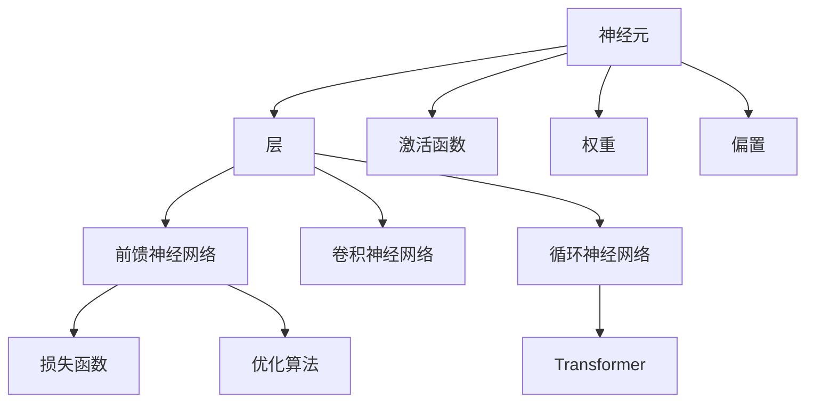

                 

# Neural Networks原理与代码实例讲解

> 关键词：神经网络,深度学习,前馈神经网络,卷积神经网络,循环神经网络,Transformer,PyTorch

## 1. 背景介绍

### 1.1 问题由来
神经网络（Neural Networks）作为深度学习领域的核心技术，近年来取得了巨大突破，已经在图像识别、语音识别、自然语言处理等多个领域展现了强大的能力。但是，对于初学者来说，理解神经网络的原理和实现仍然是一个挑战。本文旨在通过一系列详细的讲解和代码实例，帮助读者深入理解神经网络的基本概念和关键算法，掌握神经网络在实际项目中的应用。

### 1.2 问题核心关键点
神经网络的核心在于它通过多层非线性变换，模拟人脑的神经元网络，实现对复杂数据的表示和处理。其主要特点包括：
- **多层结构**：神经网络通常由多个层组成，每层负责一种特定的非线性变换。
- **反向传播**：利用链式法则，计算损失函数对每个参数的梯度，从而更新模型参数。
- **非线性激活函数**：如Sigmoid、ReLU等，为神经网络引入非线性特性。
- **损失函数**：如均方误差、交叉熵等，用于衡量模型预测与真实标签之间的差异。
- **优化算法**：如SGD、Adam等，通过梯度下降优化模型参数。

这些核心概念构成了神经网络的基本框架，使其能够在各种复杂数据上表现出强大的泛化能力。

### 1.3 问题研究意义
研究神经网络的原理和代码实现，对于理解深度学习算法的本质，掌握实际应用中的模型构建和训练方法，具有重要意义：
- 帮助理解神经网络的核心算法和原理，包括前馈神经网络、卷积神经网络、循环神经网络、Transformer等。
- 掌握代码实现，能够在实际项目中灵活应用神经网络技术。
- 深入理解损失函数和优化算法的原理，提高模型的训练效果和性能。
- 学习如何处理大规模数据集，提升模型的泛化能力。
- 了解常见问题及解决方案，如过拟合、梯度消失、梯度爆炸等。

通过本系列文章的学习和实践，读者将能够系统掌握神经网络的基础知识，并应用于实际项目中，推动人工智能技术的发展和应用。

## 2. 核心概念与联系

### 2.1 核心概念概述

为更好地理解神经网络的基本原理，本节将介绍几个关键概念：

- **神经元（Neuron）**：神经网络的基本单元，通过权重和偏置进行线性变换，并使用激活函数进行非线性映射。
- **层（Layer）**：神经网络的抽象层次结构，每层由多个神经元组成，不同层之间通过权重连接。
- **前馈神经网络（Feedforward Neural Network, FNN）**：数据从输入层到输出层单向流动，适用于处理结构化数据。
- **卷积神经网络（Convolutional Neural Network, CNN）**：通过卷积操作提取特征，适用于图像、音频等非结构化数据的处理。
- **循环神经网络（Recurrent Neural Network, RNN）**：通过循环连接，引入时间维度，适用于处理序列数据。
- **Transformer**：通过自注意力机制，实现序列数据的有效表示和处理，在NLP任务中表现优异。
- **PyTorch**：Python实现的深度学习框架，提供丰富的API和工具，方便神经网络的构建和训练。

这些核心概念之间的逻辑关系可以通过以下Mermaid流程图来展示：



这个流程图展示了神经网络的核心概念及其之间的关系：
1. 神经元是神经网络的基本单元。
2. 层是神经网络的抽象层次结构，包含多个神经元。
3. 前馈神经网络、卷积神经网络和循环神经网络是神经网络的主要类型。
4. Transformer是一种特殊的神经网络结构，适用于序列数据的处理。
5. 激活函数、权重和偏置是神经元的基本属性。
6. 损失函数和优化算法是神经网络训练的核心组件。

## 3. 核心算法原理 & 具体操作步骤

### 3.1 算法原理概述

神经网络的核心算法包括前向传播、反向传播和优化算法。本节将详细讲解这些算法的原理和实现步骤。

### 3.2 算法步骤详解

#### 3.2.1 前向传播

前向传播（Forward Propagation）是指将输入数据经过多层神经元计算，最终得到输出结果的过程。具体步骤如下：
1. **输入层**：接收原始数据，将其转换为向量形式。
2. **隐藏层**：通过权重矩阵和偏置向量进行线性变换，并应用激活函数进行非线性映射。
3. **输出层**：将隐藏层的输出结果进行线性变换，得到最终输出。

#### 3.2.2 反向传播

反向传播（Backpropagation）是指通过计算损失函数对每个参数的梯度，更新模型参数的过程。具体步骤如下：
1. **计算损失函数**：将模型输出与真实标签进行对比，计算损失函数的值。
2. **计算梯度**：通过链式法则，计算每个参数对损失函数的梯度。
3. **更新参数**：利用优化算法，根据梯度更新模型参数。

#### 3.2.3 优化算法

优化算法（Optimization Algorithm）用于更新模型参数，以最小化损失函数。常见的优化算法包括：
- **随机梯度下降（SGD）**：每次使用一个样本计算梯度，更新参数。
- **Adam**：结合动量（momentum）和自适应学习率（adaptive learning rate），具有较好的收敛性和泛化能力。

### 3.3 算法优缺点

神经网络的优点包括：
- **强大的泛化能力**：多层非线性变换能够捕捉复杂数据的多样性和非线性关系。
- **自适应学习**：通过反向传播和优化算法，神经网络能够自适应地学习数据特征和规律。
- **可解释性**：通过可视化手段，可以理解神经网络的特征提取和决策过程。

神经网络的缺点包括：
- **计算复杂度高**：多层神经网络需要大量计算资源，训练时间较长。
- **过拟合风险高**：神经网络容易学习数据中的噪声和异常，导致过拟合。
- **参数调整困难**：神经网络的训练需要精心调参，如学习率、正则化等，否则难以得到理想效果。

### 3.4 算法应用领域

神经网络在多个领域得到广泛应用，包括：
- **计算机视觉**：图像识别、物体检测、图像生成等。
- **自然语言处理**：文本分类、情感分析、机器翻译等。
- **语音识别**：语音转换、说话人识别、语音合成等。
- **信号处理**：信号滤波、音频处理、图像处理等。
- **推荐系统**：商品推荐、内容推荐、广告推荐等。

这些领域中，神经网络通过引入多层非线性变换，利用反向传播和优化算法，实现了对复杂数据的有效表示和处理，取得了显著的成果。

## 4. 数学模型和公式 & 详细讲解 & 举例说明

### 4.1 数学模型构建

神经网络的数学模型由输入层、隐藏层和输出层组成，每层包含多个神经元。假设有 $n$ 个输入特征，$m$ 个隐藏层神经元，$k$ 个输出类别的神经网络，其数学模型如下：

$$
\begin{aligned}
h^{(1)} &= \sigma(W_1x + b_1) \\
h^{(2)} &= \sigma(W_2h^{(1)} + b_2) \\
\hat{y} &= \sigma(W_3h^{(2)} + b_3)
\end{aligned}
$$

其中，$x$ 为输入向量，$h^{(1)}$ 和 $h^{(2)}$ 为隐藏层的输出，$\hat{y}$ 为输出预测结果。$W_1, W_2, W_3$ 和 $b_1, b_2, b_3$ 分别为权重矩阵和偏置向量。$\sigma$ 为激活函数，通常使用ReLU或Sigmoid函数。

### 4.2 公式推导过程

以二分类问题为例，推导神经网络的损失函数和梯度计算公式。

假设模型输出 $\hat{y} \in [0,1]$，表示样本属于正类的概率。真实标签 $y \in \{0,1\}$。则二分类交叉熵损失函数定义为：

$$
\ell(y, \hat{y}) = -[y\log \hat{y} + (1-y)\log(1-\hat{y})]
$$

对于给定的训练集 $D=\{(x_i,y_i)\}_{i=1}^N$，经验风险为：

$$
\mathcal{L} = \frac{1}{N}\sum_{i=1}^N \ell(y_i, \hat{y}_i)
$$

其中 $\hat{y}_i$ 为模型对样本 $x_i$ 的预测结果。

根据链式法则，损失函数对参数 $\theta$ 的梯度为：

$$
\nabla_\theta \mathcal{L} = -\frac{1}{N}\sum_{i=1}^N \nabla_\theta \ell(y_i, \hat{y}_i)
$$

其中：

$$
\nabla_\theta \ell(y_i, \hat{y}_i) = \nabla_{\hat{y}_i} \ell(y_i, \hat{y}_i) \nabla_\theta \hat{y}_i
$$

其中：

$$
\nabla_{\hat{y}_i} \ell(y_i, \hat{y}_i) = -\frac{y_i}{\hat{y}_i} + \frac{1-y_i}{1-\hat{y}_i}
$$

利用反向传播算法，可以高效计算 $\nabla_{\hat{y}_i} \ell(y_i, \hat{y}_i)$。

### 4.3 案例分析与讲解

以图像分类为例，展示神经网络的基本实现和训练过程。

首先，准备数据集和模型结构：

```python
import torch
import torch.nn as nn
import torch.optim as optim
from torchvision import datasets, transforms

# 定义模型结构
class Net(nn.Module):
    def __init__(self):
        super(Net, self).__init__()
        self.conv1 = nn.Conv2d(1, 10, kernel_size=5)
        self.conv2 = nn.Conv2d(10, 20, kernel_size=5)
        self.fc1 = nn.Linear(320, 50)
        self.fc2 = nn.Linear(50, 10)

    def forward(self, x):
        x = nn.functional.relu(nn.functional.max_pool2d(self.conv1(x), 2))
        x = nn.functional.relu(nn.functional.max_pool2d(self.conv2(x), 2))
        x = x.view(-1, 320)
        x = nn.functional.relu(self.fc1(x))
        x = self.fc2(x)
        return nn.functional.log_softmax(x, dim=1)

# 加载数据集
train_dataset = datasets.MNIST('data', train=True, download=True, transform=transforms.ToTensor())
test_dataset = datasets.MNIST('data', train=False, transform=transforms.ToTensor())

# 定义数据加载器
train_loader = torch.utils.data.DataLoader(train_dataset, batch_size=64, shuffle=True)
test_loader = torch.utils.data.DataLoader(test_dataset, batch_size=64, shuffle=False)
```

然后，定义损失函数和优化器：

```python
# 定义损失函数
criterion = nn.CrossEntropyLoss()

# 定义优化器
optimizer = optim.SGD(net.parameters(), lr=0.01, momentum=0.5)
```

接着，进行模型训练：

```python
# 训练模型
for epoch in range(10):
    running_loss = 0.0
    for i, data in enumerate(train_loader, 0):
        inputs, labels = data
        optimizer.zero_grad()
        outputs = net(inputs)
        loss = criterion(outputs, labels)
        loss.backward()
        optimizer.step()
        running_loss += loss.item()
        if i % 100 == 99:
            print('[%d, %5d] loss: %.3f' % (epoch + 1, i + 1, running_loss / 100))
            running_loss = 0.0
```

最后，在测试集上评估模型性能：

```python
# 测试模型
correct = 0
total = 0
with torch.no_grad():
    for data in test_loader:
        images, labels = data
        outputs = net(images)
        _, predicted = torch.max(outputs.data, 1)
        total += labels.size(0)
        correct += (predicted == labels).sum().item()

print('Accuracy of the network on the 10000 test images: %d %%' % (100 * correct / total))
```

以上是使用PyTorch实现神经网络的基本代码，展示了从模型构建、数据加载、损失函数和优化器定义到训练和测试的全过程。通过详细的代码讲解，相信读者能够更好地理解神经网络的实现原理和训练过程。

## 5. 项目实践：代码实例和详细解释说明

### 5.1 开发环境搭建

在进行神经网络项目实践前，需要准备好开发环境。以下是使用Python进行PyTorch开发的环境配置流程：

1. 安装Anaconda：从官网下载并安装Anaconda，用于创建独立的Python环境。

2. 创建并激活虚拟环境：
```bash
conda create -n pytorch-env python=3.8 
conda activate pytorch-env
```

3. 安装PyTorch：根据CUDA版本，从官网获取对应的安装命令。例如：
```bash
conda install pytorch torchvision torchaudio cudatoolkit=11.1 -c pytorch -c conda-forge
```

4. 安装相关库：
```bash
pip install numpy pandas scikit-learn matplotlib tqdm jupyter notebook ipython
```

完成上述步骤后，即可在`pytorch-env`环境中开始神经网络实践。

### 5.2 源代码详细实现

下面我们以手写数字识别为例，展示使用PyTorch实现卷积神经网络的完整代码。

首先，定义数据处理函数：

```python
from torch.utils.data import Dataset
import torch
import torchvision.transforms as transforms

class MNISTDataset(Dataset):
    def __init__(self, root, transform=None):
        self.transform = transform
        self.train_data = torchvision.datasets.MNIST(root, train=True, download=True, transform=transform)
        self.test_data = torchvision.datasets.MNIST(root, train=False, download=True, transform=transform)

    def __len__(self):
        return len(self.train_data)

    def __getitem__(self, idx):
        if self.transform:
            img, target = self.transform(self.train_data[idx])
            return img, target
        else:
            img, target = self.train_data[idx]
            return img, target
```

然后，定义模型结构：

```python
from torch import nn

class Net(nn.Module):
    def __init__(self):
        super(Net, self).__init__()
        self.conv1 = nn.Conv2d(1, 32, kernel_size=3, padding=1)
        self.conv2 = nn.Conv2d(32, 64, kernel_size=3, padding=1)
        self.pool = nn.MaxPool2d(kernel_size=2, stride=2)
        self.fc1 = nn.Linear(64*7*7, 512)
        self.fc2 = nn.Linear(512, 10)

    def forward(self, x):
        x = nn.functional.relu(self.conv1(x))
        x = self.pool(x)
        x = nn.functional.relu(self.conv2(x))
        x = self.pool(x)
        x = x.view(-1, 64*7*7)
        x = nn.functional.relu(self.fc1(x))
        x = self.fc2(x)
        return x
```

接着，定义损失函数和优化器：

```python
from torch import nn, optim

criterion = nn.CrossEntropyLoss()
optimizer = optim.SGD(net.parameters(), lr=0.001, momentum=0.9)
```

最后，进行模型训练和测试：

```python
from torch.utils.data import DataLoader

train_loader = DataLoader(train_dataset, batch_size=64, shuffle=True)
test_loader = DataLoader(test_dataset, batch_size=64, shuffle=False)

for epoch in range(10):
    running_loss = 0.0
    for i, data in enumerate(train_loader, 0):
        inputs, labels = data
        optimizer.zero_grad()
        outputs = net(inputs)
        loss = criterion(outputs, labels)
        loss.backward()
        optimizer.step()
        running_loss += loss.item()
        if i % 100 == 99:
            print('[%d, %5d] loss: %.3f' % (epoch + 1, i + 1, running_loss / 100))
            running_loss = 0.0

correct = 0
total = 0
with torch.no_grad():
    for data in test_loader:
        images, labels = data
        outputs = net(images)
        _, predicted = torch.max(outputs.data, 1)
        total += labels.size(0)
        correct += (predicted == labels).sum().item()

print('Accuracy of the network on the 10000 test images: %d %%' % (100 * correct / total))
```

以上就是使用PyTorch实现卷积神经网络的完整代码实现。可以看到，借助PyTorch的高级API，神经网络的构建和训练过程变得简洁高效。

### 5.3 代码解读与分析

让我们再详细解读一下关键代码的实现细节：

**MNISTDataset类**：
- `__init__`方法：初始化训练和测试数据集，并定义数据转换。
- `__len__`方法：返回数据集的样本数量。
- `__getitem__`方法：对单个样本进行处理，返回模型所需的输入和标签。

**Net类**：
- `__init__`方法：定义卷积层、池化层和全连接层，并设置激活函数。
- `forward`方法：实现神经网络的单次前向传播。

**模型训练和测试**：
- 定义数据加载器，对训练和测试数据进行批处理加载。
- 在每个epoch内，循环迭代训练集数据，进行前向传播和反向传播，计算损失函数并更新模型参数。
- 在测试集上评估模型的准确率。

可以看到，PyTorch提供了一整套完善的API，使得神经网络的构建和训练过程非常便捷。开发者可以通过继承和定制，轻松构建和训练各种神经网络模型。

## 6. 实际应用场景

### 6.1 计算机视觉

神经网络在计算机视觉领域取得了显著成果，广泛应用于图像分类、目标检测、图像生成等任务。例如，卷积神经网络（CNN）通过卷积操作提取图像特征，能够在复杂的图像数据上实现高效的分类和识别。

### 6.2 自然语言处理

神经网络在自然语言处理领域也表现出色，包括文本分类、情感分析、机器翻译等任务。例如，Transformer模型通过自注意力机制，能够有效捕捉文本序列中的长期依赖关系，提升了NLP任务的性能。

### 6.3 语音识别

神经网络在语音识别领域同样取得了突破，广泛应用于语音转换、说话人识别、语音合成等任务。例如，通过卷积神经网络（CNN）和递归神经网络（RNN）的组合，能够实现高效的语音特征提取和分类。

### 6.4 未来应用展望

未来，神经网络的应用将更加广泛，结合多种AI技术，推动更多领域的创新。例如，结合深度学习和强化学习的混合智能，提升自动化决策的能力；结合生成对抗网络（GAN）的生成模型，推动生成式AI的发展。

## 7. 工具和资源推荐

### 7.1 学习资源推荐

为了帮助读者系统掌握神经网络的原理和应用，以下是一些推荐的优质学习资源：

1. **《深度学习》 by Ian Goodfellow**：深入浅出地介绍了深度学习的核心概念和算法，适合初学者和进阶读者。

2. **《深度学习框架PyTorch官方文档》**：详细介绍了PyTorch的使用方法和API，是学习神经网络的核心资源。

3. **Coursera上的深度学习课程**：由斯坦福大学Andrew Ng教授主讲，涵盖深度学习的基础和进阶内容。

4. **《Python深度学习》 by Francois Chollet**：结合TensorFlow和Keras，介绍了深度学习的实际应用，适合动手实践。

5. **Kaggle竞赛平台**：提供丰富的数据集和竞赛项目，实战练兵的好地方。

通过对这些资源的系统学习，相信读者能够深入理解神经网络的核心原理，掌握神经网络的实际应用。

### 7.2 开发工具推荐

以下是一些常用的神经网络开发工具：

1. **PyTorch**：Python实现的深度学习框架，提供丰富的API和工具，方便神经网络的构建和训练。

2. **TensorFlow**：由Google开发的深度学习框架，功能强大，适合大规模工程应用。

3. **Keras**：高层API，提供简单易用的API接口，适合快速开发神经网络模型。

4. **MXNet**：高效的深度学习框架，支持多种编程语言，适合分布式计算。

5. **Caffe**：由加州大学伯克利分校开发的深度学习框架，适用于图像识别任务。

合理利用这些工具，可以显著提升神经网络的开发效率，加快创新迭代的步伐。

### 7.3 相关论文推荐

神经网络的研究已经积累了大量的成果，以下是几篇具有代表性的论文：

1. **ImageNet分类挑战赛**：介绍了使用深度神经网络在图像分类任务上的突破性成果。

2. **AlexNet**：提出了使用深度卷积神经网络进行图像分类的方法。

3. **ResNet**：提出了残差连接的网络结构，解决了深度神经网络的退化问题。

4. **Transformer模型**：提出了自注意力机制，提升了NLP任务的性能。

5. **GAN模型**：提出了生成对抗网络，推动了生成式AI的发展。

这些论文代表了神经网络领域的研究前沿，值得深入学习和理解。

## 8. 总结：未来发展趋势与挑战

### 8.1 总结

本文对神经网络的基本原理和代码实现进行了全面系统的介绍。首先阐述了神经网络的核心概念和关键算法，包括前向传播、反向传播和优化算法。然后通过代码实例，展示了如何使用PyTorch实现神经网络的构建和训练。最后探讨了神经网络在多个领域的应用场景和未来发展趋势。

通过本文的学习，读者能够系统掌握神经网络的基础知识，并应用于实际项目中，推动人工智能技术的发展和应用。

### 8.2 未来发展趋势

未来，神经网络技术将呈现以下几个发展趋势：

1. **深度增强**：深度神经网络将与增强学习、强化学习等技术相结合，提升自动化决策和控制能力。

2. **联邦学习**：在分布式环境中，通过联邦学习技术，使得模型能够在保护隐私的前提下进行协作训练，提升模型的泛化能力。

3. **无监督学习**：利用自监督学习、生成对抗网络等技术，提升模型的自适应能力和泛化能力。

4. **跨模态融合**：结合视觉、语音、文本等多种模态信息，提升神经网络的感知和理解能力。

5. **硬件优化**：利用专用硬件（如GPU、TPU等），优化神经网络的计算效率和资源利用率。

这些趋势将进一步拓展神经网络的应用场景，推动人工智能技术的进步。

### 8.3 面临的挑战

尽管神经网络取得了显著成果，但仍面临以下挑战：

1. **计算资源消耗大**：深度神经网络需要大量的计算资源，训练时间较长，制约了实际应用。

2. **过拟合风险高**：神经网络容易学习数据中的噪声和异常，导致过拟合。

3. **可解释性不足**：神经网络通常被视为“黑盒”系统，难以解释其内部工作机制和决策过程。

4. **模型泛化能力有限**：神经网络在不同的数据分布上，泛化能力可能不足。

5. **数据隐私和安全问题**：神经网络处理敏感数据时，需要考虑数据隐私和安全问题。

这些挑战需要研究者继续探索和解决，以进一步提升神经网络的性能和应用价值。

### 8.4 研究展望

为了应对未来挑战，未来的研究需要在以下几个方面寻求新的突破：

1. **高效计算优化**：开发更加高效的计算模型和算法，提升神经网络的训练和推理速度。

2. **可解释性增强**：研究神经网络的可解释性，提升模型的透明度和可信度。

3. **多模态融合**：研究跨模态信息的融合，提升神经网络的感知和理解能力。

4. **跨领域迁移**：研究模型在跨领域数据上的泛化能力，提升模型的适应性和鲁棒性。

5. **数据隐私保护**：研究神经网络在隐私保护方面的技术，保障数据安全。

这些研究方向将推动神经网络技术向更高的水平发展，为人工智能技术的应用提供更多可能性。

## 9. 附录：常见问题与解答

**Q1：深度神经网络为什么会过拟合？**

A: 深度神经网络容易出现过拟合，主要是因为模型复杂度较高，参数较多，容易学习数据中的噪声和异常。解决过拟合的方法包括数据增强、正则化、早停等。

**Q2：如何提高神经网络的泛化能力？**

A: 提高神经网络的泛化能力可以从以下几个方面入手：
1. 增加数据量，提升模型的统计稳定性。
2. 使用正则化方法，如L1/L2正则、Dropout等，减少过拟合。
3. 使用跨领域迁移学习，提升模型的适应性。
4. 采用生成对抗网络（GAN）等方法，提升模型的泛化能力。

**Q3：神经网络的计算资源消耗大，如何解决？**

A: 解决神经网络计算资源消耗大的问题可以从以下几个方面入手：
1. 使用分布式计算，利用多台机器并行计算。
2. 使用混合精度训练，减少内存消耗。
3. 使用模型剪枝、量化等技术，减少模型参数量。
4. 使用专用硬件（如GPU、TPU等），优化计算效率。

**Q4：神经网络的训练速度慢，如何解决？**

A: 解决神经网络训练速度慢的问题可以从以下几个方面入手：
1. 使用GPU/TPU等高性能设备，加速计算过程。
2. 使用批量梯度下降（Batch Gradient Descent）等高效优化算法。
3. 使用小批量随机梯度下降（Mini-batch Stochastic Gradient Descent），加速训练过程。
4. 使用分布式计算，利用多台机器并行计算。

这些方法的结合，可以显著提升神经网络的训练速度，加速模型开发和优化。

通过本系列文章的学习和实践，相信读者能够系统掌握神经网络的基础知识，并应用于实际项目中，推动人工智能技术的发展和应用。

