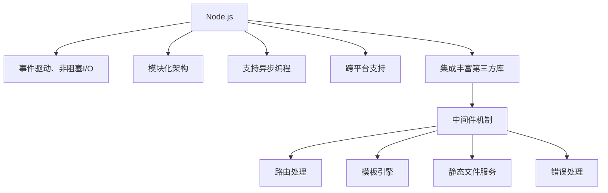

                 

## 1. 背景介绍

### 1.1 问题由来
Node.js是一个基于Chrome V8引擎的JavaScript运行时，使得开发者可以在服务器端运行JavaScript代码。Express是一个快速、灵活、最小化的Node.js Web应用程序框架，为构建Web应用提供了一组实用的工具和库。学习Node.js和Express不仅可以使开发者更好地理解JavaScript和Web技术的结合，还可以帮助开发者构建高性能、可扩展的服务器端应用程序。

### 1.2 问题核心关键点
Node.js和Express在现代Web开发中扮演着重要的角色。它们简化了Web开发过程，使开发者能够更快速地构建和部署应用程序。关键点包括：

- Node.js的异步编程模型
- Express的请求处理和中间件机制
- 全栈开发能力
- RESTful API设计

### 1.3 问题研究意义
Node.js和Express在构建Web应用、移动应用后端API、API网关、微服务架构等方面都有广泛的应用。掌握它们可以提高开发效率，简化技术栈，构建高性能、低延迟的服务器端应用程序。

## 2. 核心概念与联系

### 2.1 核心概念概述

以下是Node.js和Express的核心概念：

- **Node.js**：基于Chrome V8引擎的JavaScript运行时，可以在服务器端运行JavaScript代码，实现非阻塞I/O和异步编程。

- **Express**：一个快速、灵活、最小化的Node.js Web应用程序框架，提供了一组实用的工具和库，包括路由、中间件、模板引擎等。

- **RESTful API**：一种基于HTTP协议的设计风格，遵循资源、动作和表述原则，适用于构建Web服务和API。

- **中间件**：Express的核心概念之一，是一种预处理器或后置处理器，可以在请求和响应之间执行代码。

- **非阻塞I/O**：Node.js的核心特性，通过事件循环和回调机制实现。

### 2.2 核心概念原理和架构的 Mermaid 流程图


### 2.3 核心概念联系

Node.js和Express通过异步编程和非阻塞I/O实现了高性能服务器端应用程序的构建。Express作为Node.js的框架，利用中间件机制和路由处理来简化Web应用的开发。两者相互补充，共同构建了现代化的Web开发生态。

## 3. 核心算法原理 & 具体操作步骤

### 3.1 算法原理概述

Node.js和Express的核心算法原理包括以下几点：

- 基于事件循环的异步I/O模型
- Express的中间件机制
- RESTful API设计原则
- 模板引擎的实现

### 3.2 算法步骤详解

#### 3.2.1 创建Express应用程序

首先，通过命令行创建新的Express应用程序：

```bash
mkdir myapp
cd myapp
npm init -y
npm install express --save
```

接着，创建一个Express应用程序并启动服务器：

```javascript
const express = require('express');
const app = express();

app.get('/', (req, res) => {
  res.send('Hello, World!');
});

app.listen(3000, () => {
  console.log('Server started on port 3000');
});
```

#### 3.2.2 定义路由和中间件

Express通过中间件机制处理路由请求。定义路由和中间件可以通过以下代码实现：

```javascript
app.get('/users/:id', (req, res) => {
  const id = req.params.id;
  res.send(`User ID: ${id}`);
});

app.use((req, res, next) => {
  console.log('Middleware logged');
  next();
});
```

中间件可以处理请求和响应，实现一些通用的功能，如日志记录、请求验证等。

#### 3.2.3 使用模板引擎

Express支持多种模板引擎，如EJS、Handlebars、Pug等。下面以EJS为例，展示如何在Express中使用模板引擎：

首先，安装EJS模板引擎：

```bash
npm install ejs --save
```

接着，在Express应用程序中使用EJS模板引擎：

```javascript
app.set('view engine', 'ejs');
app.set('views', './views');

app.get('/', (req, res) => {
  const name = req.query.name;
  res.render('index', { name });
});
```

在`views`目录下创建`index.ejs`文件，内容如下：

```html
<html>
  <head>
    <title><%= name %></title>
  </head>
  <body>
    <h1><%= name %></h1>
  </body>
</html>
```

### 3.3 算法优缺点

#### 3.3.1 优点

- 高性能：Node.js的异步I/O和非阻塞模型使得应用程序能够高效地处理大量并发请求。
- 灵活性：Express提供了中间件机制，使得开发者可以根据需要添加各种功能和处理请求。
- 可扩展性：Express的插件和第三方库丰富，可以扩展功能。

#### 3.3.2 缺点

- 学习曲线陡峭：Node.js和Express的学习曲线较陡峭，初学者可能需要一些时间才能掌握。
- 生态系统复杂：Node.js和Express的生态系统复杂，开发者需要学习各种第三方库和工具。
- 安全性问题：Node.js和Express的默认安全性配置较差，需要开发者自行处理安全问题。

### 3.4 算法应用领域

Node.js和Express在Web开发、API开发、实时应用、分布式系统等方面都有广泛的应用。以下是几个具体的应用场景：

- 构建Web应用程序：使用Express框架可以快速构建Web应用程序，支持多种前端框架和模板引擎。
- 构建API网关：使用Express可以构建API网关，提供RESTful API接口，简化API管理。
- 实时聊天应用：使用Socket.IO和Express可以实现实时聊天应用，支持用户间实时消息传递。
- 分布式系统：使用Node.js和Express可以构建分布式系统，支持微服务架构和负载均衡。

## 4. 数学模型和公式 & 详细讲解 & 举例说明

### 4.1 数学模型构建

Express的数学模型构建涉及路由处理、中间件处理、模板引擎渲染等。下面以路由处理为例，展示Express的数学模型构建过程。

假设请求路径为`/users/:id`，Express的路由处理可以表示为：

```
R(P, U, S) = {P, U, S}
```

其中，P为路径，U为用户信息，S为响应。Express将路由请求解析为P和U，根据路径匹配返回响应S。

### 4.2 公式推导过程

Express的路由处理公式可以推导为：

```
R(P, U, S) = P(P, U) + S(U, S)
```

其中，P为路径解析，U为用户信息，S为响应。

### 4.3 案例分析与讲解

以RESTful API设计为例，展示如何使用Express实现API接口。假设需要构建一个获取用户信息的API接口，可以使用以下代码：

```javascript
app.get('/users/:id', (req, res) => {
  const id = req.params.id;
  // 从数据库或服务中获取用户信息
  const user = getUserById(id);
  res.json(user);
});
```

该接口的路由路径为`/users/:id`，参数为`id`。使用Express可以方便地处理路由请求，返回JSON格式的响应。

## 5. 项目实践：代码实例和详细解释说明

### 5.1 开发环境搭建

#### 5.1.1 安装Node.js和npm

在Windows系统中，可以通过以下命令安装Node.js和npm：

```bash
choco install nodejs
```

在Linux系统中，可以通过以下命令安装Node.js和npm：

```bash
sudo apt-get update
sudo apt-get install nodejs
```

#### 5.1.2 创建新的Express应用程序

创建新的Express应用程序，可以通过以下命令：

```bash
mkdir myapp
cd myapp
npm init -y
npm install express --save
```

### 5.2 源代码详细实现

#### 5.2.1 创建Express应用程序

创建Express应用程序的代码如下：

```javascript
const express = require('express');
const app = express();

app.get('/', (req, res) => {
  res.send('Hello, World!');
});

app.listen(3000, () => {
  console.log('Server started on port 3000');
});
```

#### 5.2.2 定义路由和中间件

定义路由和中间件的代码如下：

```javascript
app.get('/users/:id', (req, res) => {
  const id = req.params.id;
  res.send(`User ID: ${id}`);
});

app.use((req, res, next) => {
  console.log('Middleware logged');
  next();
});
```

#### 5.2.3 使用模板引擎

使用EJS模板引擎的代码如下：

```javascript
app.set('view engine', 'ejs');
app.set('views', './views');

app.get('/', (req, res) => {
  const name = req.query.name;
  res.render('index', { name });
});
```

在`views`目录下创建`index.ejs`文件，内容如下：

```html
<html>
  <head>
    <title><%= name %></title>
  </head>
  <body>
    <h1><%= name %></h1>
  </body>
</html>
```

### 5.3 代码解读与分析

#### 5.3.1 异步I/O和中间件

Node.js的异步I/O和非阻塞模型使得应用程序能够高效地处理大量并发请求。Express的中间件机制允许开发者在请求和响应之间执行代码，实现一些通用的功能，如日志记录、请求验证等。

#### 5.3.2 路由处理

Express的路由处理机制使得开发者可以方便地定义路由和处理请求。路由处理可以接收请求参数，根据路由路径返回响应。

#### 5.3.3 模板引擎

Express支持多种模板引擎，如EJS、Handlebars、Pug等。通过模板引擎，开发者可以将数据渲染为HTML页面，使得Web应用更加灵活。

### 5.4 运行结果展示

运行上述代码，在浏览器中输入`http://localhost:3000`，可以看到`Hello, World!`的输出。输入`http://localhost:3000/users/123`，可以看到`User ID: 123`的输出。

## 6. 实际应用场景

### 6.1 构建Web应用程序

使用Express可以构建Web应用程序，支持多种前端框架和模板引擎。以下是一个简单的示例：

```javascript
const express = require('express');
const app = express();
const path = require('path');

app.use(express.static(path.join(__dirname, 'public')));

app.get('/', (req, res) => {
  res.sendFile(path.join(__dirname, 'public', 'index.html'));
});

app.get('/api/users', (req, res) => {
  // 从数据库或服务中获取用户信息
  const users = [{ id: 1, name: 'Alice' }, { id: 2, name: 'Bob' }];
  res.json(users);
});

app.listen(3000, () => {
  console.log('Server started on port 3000');
});
```

### 6.2 构建API网关

使用Express可以构建API网关，提供RESTful API接口，简化API管理。以下是一个简单的示例：

```javascript
const express = require('express');
const app = express();

app.use(express.json());

app.post('/users', (req, res) => {
  // 创建新用户
  const user = { id: 1, name: req.body.name };
  res.json(user);
});

app.get('/users', (req, res) => {
  // 获取所有用户
  const users = [{ id: 1, name: 'Alice' }, { id: 2, name: 'Bob' }];
  res.json(users);
});

app.listen(3000, () => {
  console.log('Server started on port 3000');
});
```

### 6.3 实时聊天应用

使用Socket.IO和Express可以实现实时聊天应用，支持用户间实时消息传递。以下是一个简单的示例：

```javascript
const express = require('express');
const app = express();
const http = require('http');
const socketIo = require('socket.io');

const server = http.createServer(app);
const io = socketIo(server);

io.on('connection', (socket) => {
  console.log('A user connected');

  socket.on('chat message', (msg) => {
    console.log('message: ', msg);
    io.emit('chat message', msg);
  });

  socket.on('disconnect', () => {
    console.log('user disconnected');
  });
});

app.use(express.static('public'));

app.get('/', (req, res) => {
  res.sendFile(__dirname + '/index.html');
});

app.listen(3000, () => {
  console.log('Server started on port 3000');
});
```

### 6.4 分布式系统

使用Node.js和Express可以构建分布式系统，支持微服务架构和负载均衡。以下是一个简单的示例：

```javascript
const express = require('express');
const app = express();

app.use(express.json());

app.get('/users', (req, res) => {
  // 获取所有用户
  const users = [{ id: 1, name: 'Alice' }, { id: 2, name: 'Bob' }];
  res.json(users);
});

app.listen(3000, () => {
  console.log('Server started on port 3000');
});
```

在另一个进程中，可以使用如下代码构建反向代理：

```javascript
const http = require('http');
const url = require('url');

const proxyUrl = new url.URL('http://localhost:3001');
const server = http.createServer((req, res) => {
  req.url = req.url.replace('/api/users', '');
  req.method = 'GET';
  req.headers['x-forwarded-for'] = req.connection.remoteAddress;

  proxyReq = http.request({
    protocol: 'http:',
    hostname: proxyUrl.hostname,
    port: proxyUrl.port,
    path: req.url,
    method: req.method,
    headers: req.headers
  }, (proxyRes) => {
    proxyRes.pipe(res);
  });
  req.pipe(proxyReq);
});

server.listen(3000, () => {
  console.log('Proxy server started on port 3000');
});
```

## 7. 工具和资源推荐

### 7.1 学习资源推荐

#### 7.1.1 官方文档

Express的官方文档详细介绍了Express的使用方法、中间件机制、路由处理等核心概念，适合初学者学习。

#### 7.1.2 在线课程

Udemy和Coursera等在线平台提供了丰富的Node.js和Express课程，适合不同层次的开发者学习。

#### 7.1.3 开源项目

GitHub上有很多优秀的Node.js和Express项目，可以学习和借鉴。

### 7.2 开发工具推荐

#### 7.2.1 Visual Studio Code

Visual Studio Code是一个功能强大的编辑器，支持Node.js和Express开发。

#### 7.2.2 Git

Git是版本控制系统，适合管理代码版本和协作开发。

#### 7.2.3 Postman

Postman是一个API开发和测试工具，支持RESTful API开发和测试。

### 7.3 相关论文推荐

#### 7.3.1 Express中间件机制

论文《Express中间件机制分析与优化》详细介绍了Express中间件机制的设计和实现，适合有一定Node.js和Express基础的学习者阅读。

#### 7.3.2 非阻塞I/O模型

论文《Node.js非阻塞I/O模型研究》详细介绍了Node.js的异步I/O模型和非阻塞模型，适合深入了解Node.js原理的开发者阅读。

## 8. 总结：未来发展趋势与挑战

### 8.1 总结

Node.js和Express是现代Web开发的重要工具，简化了Web开发过程，提高了开发效率。通过本文的系统梳理，可以看到Node.js和Express在Web开发、API开发、实时应用、分布式系统等方面的应用。掌握它们可以帮助开发者构建高性能、可扩展的服务器端应用程序。

### 8.2 未来发展趋势

Node.js和Express的未来发展趋势包括：

- 全栈开发：Node.js和Express可以结合前端框架和库，构建全栈Web应用程序。
- 微服务架构：Node.js和Express可以构建微服务架构，支持分布式系统。
- 实时应用：Node.js和Express可以构建实时聊天应用、实时监控等实时应用。
- 容器化：Node.js和Express可以部署在容器环境中，提高部署和运维效率。

### 8.3 面临的挑战

Node.js和Express在发展过程中也面临一些挑战：

- 性能问题：Node.js的单线程模型和异步编程可能影响性能。
- 安全性问题：Node.js和Express的默认安全性配置较差，需要开发者自行处理安全问题。
- 生态系统复杂：Node.js和Express的生态系统复杂，开发者需要学习各种第三方库和工具。

### 8.4 研究展望

未来Node.js和Express的研究方向包括：

- 提高性能：优化Node.js的单线程模型和异步编程，提高性能和响应速度。
- 增强安全性：优化Node.js和Express的安全性配置，增强系统安全性。
- 简化生态系统：简化Node.js和Express的生态系统，降低开发难度和成本。
- 结合前沿技术：结合深度学习、区块链等前沿技术，拓展Node.js和Express的应用场景。

## 9. 附录：常见问题与解答

### 9.1 常见问题

#### Q1: 什么是Node.js和Express？

A: Node.js是基于Chrome V8引擎的JavaScript运行时，可以在服务器端运行JavaScript代码。Express是一个快速、灵活、最小化的Node.js Web应用程序框架，提供了一组实用的工具和库。

#### Q2: 如何使用Express定义路由？

A: Express使用`app.get()`、`app.post()`等方法定义路由，接收路由路径和处理函数作为参数。处理函数根据路由路径接收请求参数，并返回响应。

#### Q3: 如何处理Express的中间件？

A: Express的中间件通过`app.use()`方法定义，接收中间件函数作为参数。中间件函数可以在请求和响应之间执行代码，实现一些通用的功能，如日志记录、请求验证等。

### 9.2 解答

本文通过系统介绍Node.js和Express的核心概念和实践，展示了如何使用它们构建高性能、可扩展的服务器端应用程序。Node.js和Express在Web开发、API开发、实时应用、分布式系统等方面都有广泛的应用。未来，Node.js和Express将不断发展，提升性能、增强安全性、简化生态系统，拓展应用场景。通过本文的系统梳理，相信读者可以更好地掌握Node.js和Express，并应用于实际开发中。

作者：禅与计算机程序设计艺术 / Zen and the Art of Computer Programming

