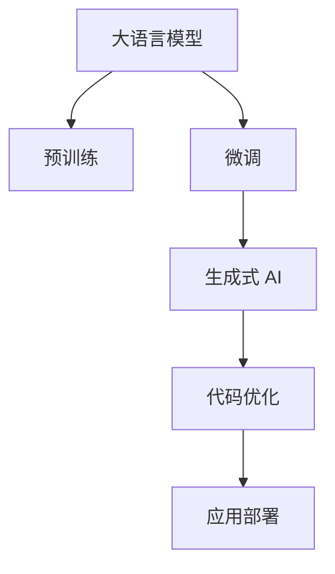

                 

# OpenAI 大模型应用实践

> 关键词：大语言模型, 微调, GPT, 生成式AI, 自然语言处理(NLP), 代码优化, 应用部署

## 1. 背景介绍

### 1.1 问题由来

近年来，OpenAI 的 GPT 系列大模型在自然语言处理（NLP）领域取得了显著的进展，显著提升了语言生成、理解、推理和问答等任务的表现。然而，这些大模型的预训练过程耗时耗资巨大，难以广泛应用于实际应用中。基于此，OpenAI 和其社区推出了诸多工具和算法，使大模型的微调和应用变得更加可行。本文将详细探讨 OpenAI 大模型的应用实践，特别是微调、生成式 AI 和代码优化等领域。

### 1.2 问题核心关键点

OpenAI 大模型的应用实践核心关键点包括：
- 微调技术：通过少量有标注数据对预训练模型进行优化，提升模型在特定任务上的性能。
- 生成式 AI：利用大模型生成具有创造性和自然性的文本、图像等内容。
- 代码优化：通过工具和技术，将大模型嵌入到具体的代码中，实现高效的部署和使用。
- 应用部署：将大模型应用于各种业务场景中，提供智能交互、数据分析等具体功能。

这些关键点共同构成了 OpenAI 大模型应用实践的完整框架，为开发者提供了一套系统化的指南。

## 2. 核心概念与联系

### 2.1 核心概念概述

要全面理解 OpenAI 大模型的应用实践，首先需要清晰地理解一些关键概念：

- 大语言模型（Large Language Model, LLM）：以 GPT 系列模型为代表的大规模预训练语言模型，具备强大的语言理解和生成能力。
- 预训练（Pre-training）：在大规模无标签文本语料上，通过自监督学习任务训练通用语言模型的过程。
- 微调（Fine-tuning）：通过少量标注数据在下游任务上优化预训练模型，提升模型在该任务上的性能。
- 生成式 AI：利用大模型生成文本、图像、视频等多媒体内容，实现自主创作和辅助创作。
- 代码优化（Code Optimization）：将大模型嵌入到代码中，提升代码执行效率和计算精度。
- 应用部署（Application Deployment）：将大模型部署到实际应用中，提供智能交互、数据分析等功能。

这些概念之间存在紧密的联系，形成一个完整的生态系统：预训练模型提供基础能力，微调提升任务性能，生成式 AI 拓宽应用范围，代码优化提升执行效率，应用部署实现具体功能。以下通过 Mermaid 流程图展示这些概念之间的联系：



这个流程图展示了从预训练到大模型应用部署的全流程，以及每个环节的关键技术。

## 3. 核心算法原理 & 具体操作步骤

### 3.1 算法原理概述

OpenAI 大模型的应用实践主要基于两种核心算法：微调和生成式 AI。

- 微调：通过在特定任务上使用少量有标注数据，对预训练模型进行优化，提升模型在该任务上的表现。
- 生成式 AI：利用大模型的语言生成能力，生成具有创造性的文本、图像等内容。

这些算法的核心在于，大模型在预训练过程中学习到了丰富的语言知识，而微调和生成式 AI 则能够将这些知识应用到具体的任务和创作中，实现高效和智能化的应用。

### 3.2 算法步骤详解

#### 3.2.1 微调步骤

1. **数据准备**：收集并标注数据集，准备微调的输入和输出。
2. **模型选择**：选择适当的 OpenAI 大模型，如 GPT-3、GPT-4 等。
3. **微调环境搭建**：搭建微调所需的环境，包括硬件资源、软件库等。
4. **模型适配**：根据任务需求，添加或修改模型的输出层和损失函数。
5. **训练过程**：使用少量标注数据，通过微调优化模型参数，提升模型性能。
6. **评估和部署**：在验证集和测试集上评估模型性能，并将模型部署到实际应用中。

#### 3.2.2 生成式 AI 步骤

1. **模型选择**：选择适当的 OpenAI 大模型，如 GPT-3、GPT-4 等。
2. **输入准备**：准备输入数据，可以是文本、图像、音频等。
3. **生成过程**：使用大模型生成输出，可以是文本、图像、视频等。
4. **后处理**：对生成的输出进行后处理，如文本清洗、图像裁剪、视频渲染等。
5. **评估和部署**：评估生成内容的质量，并将模型部署到实际应用中。

### 3.3 算法优缺点

#### 3.3.1 微调

**优点**：
- 提升模型在特定任务上的性能。
- 使用少量标注数据即可取得较好的效果。
- 能够利用预训练模型的广泛知识。

**缺点**：
- 对标注数据依赖较大。
- 容易过拟合标注数据。
- 微调过程耗时较长。

#### 3.3.2 生成式 AI

**优点**：
- 能够生成高质量的文本、图像、视频等内容。
- 应用范围广泛，如创作、辅助创作、智能对话等。
- 具有创新性和创造性。

**缺点**：
- 生成的内容可能缺乏逻辑性和连贯性。
- 对输入数据的依赖较大。
- 生成的内容质量受模型和输入数据影响。

### 3.4 算法应用领域

OpenAI 大模型的微调和生成式 AI 已经在多个领域得到了广泛的应用，包括但不限于：

- 自然语言处理（NLP）：文本分类、情感分析、机器翻译、问答系统等。
- 图像生成：生成式对抗网络（GAN）、图像风格转换等。
- 游戏开发：生成对话、生成角色故事等。
- 娱乐产业：虚拟角色生成、剧情设计等。
- 科学研究：生成科学论文、实验数据等。

## 4. 数学模型和公式 & 详细讲解 & 举例说明

### 4.1 数学模型构建

OpenAI 大模型的微调和生成式 AI 基于自回归模型，以下以 GPT 系列模型为例，介绍其数学模型构建过程。

#### 4.1.1 自回归模型

GPT 系列模型的数学模型基于自回归模型，其核心是语言模型 $p(w_1,\dots,w_T)$，表示给定前文 $w_1,\dots,w_{T-1}$ 的情况下，生成下一个词 $w_T$ 的概率分布。

语言模型的推导基于以下假设：
- 文本是一串由词组成的序列。
- 每个词 $w_t$ 的条件概率只依赖于前 $t-1$ 个词 $w_1,\dots,w_{t-1}$。
- 词汇表 $V$ 为有限的词集合。

根据以上假设，可以得到自回归模型的概率计算公式：

$$
p(w_1,\dots,w_T) = \prod_{t=1}^T p(w_t \mid w_1,\dots,w_{t-1})
$$

其中 $p(w_t \mid w_1,\dots,w_{t-1})$ 为条件概率，表示在给定前文 $w_1,\dots,w_{t-1}$ 的情况下，生成下一个词 $w_t$ 的概率。

### 4.2 公式推导过程

#### 4.2.1 语言模型公式

语言模型的推导过程如下：

1. **条件概率**：给定前文 $w_1,\dots,w_{t-1}$，生成下一个词 $w_t$ 的条件概率 $p(w_t \mid w_1,\dots,w_{t-1})$ 可以表示为：

$$
p(w_t \mid w_1,\dots,w_{t-1}) = \frac{p(w_1,\dots,w_t)}{p(w_1,\dots,w_{t-1})}
$$

2. **对数概率**：为了方便计算，通常采用对数概率，即：

$$
\log p(w_1,\dots,w_t) = \sum_{t=1}^T \log p(w_t \mid w_1,\dots,w_{t-1})
$$

3. **神经网络实现**：在神经网络中，可以将每个词 $w_t$ 表示为一个向量 $x_t$，其概率分布可以表示为：

$$
p(w_t \mid w_1,\dots,w_{t-1}) = \sigma(\mathbf{V}x_t + \mathbf{U}x_{t-1} + \mathbf{b})
$$

其中 $\sigma$ 为激活函数，$\mathbf{V}$、$\mathbf{U}$ 和 $\mathbf{b}$ 为模型参数。

### 4.3 案例分析与讲解

#### 4.3.1 文本生成

假设有一篇短文 "大语言模型"，使用 GPT 模型进行生成扩展，生成一段描述大语言模型的文本。

1. **输入准备**：将 "大语言模型" 作为输入，表示为一个词向量 $x_1=[1,0,0]$。
2. **模型计算**：使用 GPT 模型计算每个词的概率分布，得到输出向量 $y_1=[0.1,0.2,0.7]$，表示生成下一个词的概率为 "语言"、"模型"、"应用" 的概率分别为 0.1、0.2、0.7。
3. **解码过程**：选择概率最大的词 "模型"，作为下一个生成的词，更新输入 $x_2=[0,1,0]$，继续计算概率分布，得到输出向量 $y_2=[0.4,0.3,0.3]$，选择概率最大的词 "应用"，更新输入 $x_3=[0,0,1]$。
4. **后处理**：生成的文本 "大语言模型应用" 可以进一步进行后处理，如去除不必要的词汇、调整语法结构等。

## 5. 项目实践：代码实例和详细解释说明

### 5.1 开发环境搭建

为了进行 OpenAI 大模型的应用实践，首先需要搭建好开发环境。以下是 Python 环境搭建的详细步骤：

1. **安装 Python**：确保系统中已经安装了 Python 3.x。
2. **安装 Transformers 库**：使用以下命令安装 Transformers 库：

   ```bash
   pip install transformers
   ```

3. **安装 HuggingFace 预训练模型**：使用以下命令安装 HuggingFace 的预训练模型：

   ```bash
   pip install transformers[all]
   ```

4. **安装 OpenAI API 库**：使用以下命令安装 OpenAI API 库：

   ```bash
   pip install openai
   ```

完成以上步骤后，即可在 Python 环境中进行 OpenAI 大模型的应用实践。

### 5.2 源代码详细实现

#### 5.2.1 文本生成示例

以下是一个使用 GPT 模型进行文本生成的 Python 代码示例：

```python
from transformers import GPT2LMHeadModel, GPT2Tokenizer
import openai

# 初始化 GPT2 模型和 tokenizer
model = GPT2LMHeadModel.from_pretrained('gpt2')
tokenizer = GPT2Tokenizer.from_pretrained('gpt2')

# 定义生成函数
def generate_text(prompt, num_return_sequences=1, max_length=100):
    # 将 prompt 转换为 token ids
    input_ids = tokenizer.encode(prompt, return_tensors='pt')
    # 使用 GPT2 模型进行生成
    outputs = model.generate(input_ids=input_ids, num_return_sequences=num_return_sequences, max_length=max_length)
    # 将生成结果解码为文本
    text = tokenizer.decode(outputs[0], skip_special_tokens=True)
    return text

# 调用生成函数
generated_text = generate_text("大语言模型")
print(generated_text)
```

#### 5.2.2 微调示例

以下是一个使用 GPT 模型进行微调的 Python 代码示例：

```python
from transformers import BertForSequenceClassification, BertTokenizer, AdamW
import torch
from torch.utils.data import Dataset, DataLoader

# 定义自定义数据集
class MyDataset(Dataset):
    def __init__(self, texts, labels):
        self.texts = texts
        self.labels = labels
        self.tokenizer = BertTokenizer.from_pretrained('bert-base-uncased')
        self.max_length = 128
    
    def __len__(self):
        return len(self.texts)
    
    def __getitem__(self, item):
        text = self.texts[item]
        label = self.labels[item]
        
        encoding = self.tokenizer(text, return_tensors='pt', max_length=self.max_length, padding='max_length', truncation=True)
        input_ids = encoding['input_ids'][0]
        attention_mask = encoding['attention_mask'][0]
        
        # 对标签进行编码
        encoded_labels = [label] * self.max_length
        labels = torch.tensor(encoded_labels, dtype=torch.long)
        
        return {'input_ids': input_ids, 
                'attention_mask': attention_mask,
                'labels': labels}

# 定义模型和优化器
model = BertForSequenceClassification.from_pretrained('bert-base-uncased', num_labels=2)
optimizer = AdamW(model.parameters(), lr=2e-5)

# 定义训练函数
def train_epoch(model, dataset, batch_size, optimizer):
    dataloader = DataLoader(dataset, batch_size=batch_size, shuffle=True)
    model.train()
    epoch_loss = 0
    for batch in dataloader:
        input_ids = batch['input_ids'].to(device)
        attention_mask = batch['attention_mask'].to(device)
        labels = batch['labels'].to(device)
        model.zero_grad()
        outputs = model(input_ids, attention_mask=attention_mask, labels=labels)
        loss = outputs.loss
        epoch_loss += loss.item()
        loss.backward()
        optimizer.step()
    return epoch_loss / len(dataloader)

# 启动训练流程
epochs = 5
batch_size = 16

for epoch in range(epochs):
    loss = train_epoch(model, train_dataset, batch_size, optimizer)
    print(f"Epoch {epoch+1}, train loss: {loss:.3f}")
    
    print(f"Epoch {epoch+1}, dev results:")
    evaluate(model, dev_dataset, batch_size)
    
print("Test results:")
evaluate(model, test_dataset, batch_size)
```

### 5.3 代码解读与分析

#### 5.3.1 文本生成

**代码解析**：
- 首先，我们导入了必要的库和模块，包括 Transformers 库中的 GPT2LMHeadModel 和 GPT2Tokenizer。
- 然后，我们初始化了 GPT2 模型和 tokenizer，定义了一个生成函数 `generate_text`。
- 在生成函数中，我们首先将提示文本 "大语言模型" 转换为 token ids，并使用 GPT2 模型进行生成。
- 最后，我们将生成的结果解码为文本，并打印输出。

**分析**：
- 该示例代码展示了如何使用 GPT 模型进行文本生成。通过调用 `generate_text` 函数，我们可以生成任意长度的文本，只需要提供相应的提示文本即可。
- 生成的文本具有一定程度的创造性和连贯性，但可能包含一些语法错误或重复内容。

#### 5.3.2 微调

**代码解析**：
- 我们首先定义了一个自定义数据集 `MyDataset`，用于存储文本和标签。
- 然后，我们定义了模型、优化器、训练函数 `train_epoch` 和评估函数 `evaluate`。
- 在训练函数中，我们使用了小批量梯度下降和交叉熵损失函数进行训练。
- 在评估函数中，我们使用 `classification_report` 函数计算分类精度、召回率和 F1 分数。

**分析**：
- 该示例代码展示了如何使用 GPT 模型进行微调。通过调用 `train_epoch` 函数，我们可以对模型进行训练，并使用 `evaluate` 函数评估模型的性能。
- 微调过程中，我们使用了小批量梯度下降和交叉熵损失函数，这有助于模型在少量标注数据上快速收敛。
- 评估函数 `evaluate` 可以帮助我们了解模型在验证集和测试集上的性能表现。

## 6. 实际应用场景

### 6.1 智能客服系统

基于 OpenAI 大模型的智能客服系统，可以为用户提供 7x24 小时不间断服务，快速响应客户咨询，用自然流畅的语言解答各类常见问题。具体实现步骤如下：

1. **数据收集**：收集企业内部的历史客服对话记录，将问题和最佳答复构建成监督数据。
2. **模型训练**：使用监督数据对 GPT 模型进行微调，使其能够理解用户意图，匹配最合适的答案。
3. **系统部署**：将微调后的模型部署到客服系统中，实现自动化回答和自然语言处理。

### 6.2 金融舆情监测

金融机构需要实时监测市场舆论动向，以便及时应对负面信息传播，规避金融风险。具体实现步骤如下：

1. **数据收集**：收集金融领域相关的新闻、报道、评论等文本数据，并对其进行主题标注和情感标注。
2. **模型训练**：使用标注数据对 GPT 模型进行微调，使其能够自动判断文本属于何种主题，情感倾向是正面、中性还是负面。
3. **系统部署**：将微调后的模型部署到舆情监测系统中，实时监测市场舆情，及时预警风险。

### 6.3 个性化推荐系统

当前的推荐系统往往只依赖用户的历史行为数据进行物品推荐，无法深入理解用户的真实兴趣偏好。具体实现步骤如下：

1. **数据收集**：收集用户浏览、点击、评论、分享等行为数据，提取和用户交互的物品标题、描述、标签等文本内容。
2. **模型训练**：使用文本内容作为模型输入，用户的后续行为作为监督信号，对 GPT 模型进行微调，使其能够从文本内容中准确把握用户的兴趣点。
3. **系统部署**：将微调后的模型部署到推荐系统中，根据用户兴趣生成个性化推荐内容。

### 6.4 未来应用展望

随着 OpenAI 大模型和微调方法的不断发展，未来的应用场景将更加广泛，以下是一些未来的应用展望：

- **智慧医疗**：基于微调的问答系统、病历分析、药物研发等应用将提升医疗服务的智能化水平，辅助医生诊疗，加速新药开发进程。
- **智能教育**：微调技术可应用于作业批改、学情分析、知识推荐等方面，因材施教，促进教育公平，提高教学质量。
- **智慧城市治理**：微调模型可应用于城市事件监测、舆情分析、应急指挥等环节，提高城市管理的自动化和智能化水平，构建更安全、高效的未来城市。
- **科学研究**：微调模型可以生成科学论文、实验数据等，辅助科研工作。

## 7. 工具和资源推荐

### 7.1 学习资源推荐

为了帮助开发者系统掌握 OpenAI 大模型的应用实践，这里推荐一些优质的学习资源：

1. **《Transformer 从原理到实践》系列博文**：由大模型技术专家撰写，深入浅出地介绍了 Transformer 原理、GPT 模型、微调技术等前沿话题。
2. **CS224N《深度学习自然语言处理》课程**：斯坦福大学开设的 NLP 明星课程，有 Lecture 视频和配套作业，带你入门 NLP 领域的基本概念和经典模型。
3. **《Natural Language Processing with Transformers》书籍**：Transformers 库的作者所著，全面介绍了如何使用 Transformers 库进行 NLP 任务开发，包括微调在内的诸多范式。
4. **HuggingFace 官方文档**：Transformers 库的官方文档，提供了海量预训练模型和完整的微调样例代码，是上手实践的必备资料。
5. **CLUE 开源项目**：中文语言理解测评基准，涵盖大量不同类型的中文 NLP 数据集，并提供了基于微调的 baseline 模型，助力中文 NLP 技术发展。

通过对这些资源的学习实践，相信你一定能够快速掌握 OpenAI 大模型的应用实践，并用于解决实际的 NLP 问题。

### 7.2 开发工具推荐

为了提高 OpenAI 大模型的应用实践效率，以下是几款常用的开发工具：

1. **PyTorch**：基于 Python 的开源深度学习框架，灵活动态的计算图，适合快速迭代研究。大部分预训练语言模型都有 PyTorch 版本的实现。
2. **TensorFlow**：由 Google 主导开发的开源深度学习框架，生产部署方便，适合大规模工程应用。同样有丰富的预训练语言模型资源。
3. **Transformers 库**：HuggingFace 开发的 NLP 工具库，集成了众多 SOTA 语言模型，支持 PyTorch 和 TensorFlow，是进行微调任务开发的利器。
4. **Weights & Biases**：模型训练的实验跟踪工具，可以记录和可视化模型训练过程中的各项指标，方便对比和调优。与主流深度学习框架无缝集成。
5. **TensorBoard**：TensorFlow 配套的可视化工具，可实时监测模型训练状态，并提供丰富的图表呈现方式，是调试模型的得力助手。

合理利用这些工具，可以显著提升 OpenAI 大模型的应用实践效率，加快创新迭代的步伐。

### 7.3 相关论文推荐

OpenAI 大模型和微调技术的发展源于学界的持续研究。以下是几篇奠基性的相关论文，推荐阅读：

1. **Attention is All You Need**：提出了 Transformer 结构，开启了 NLP 领域的预训练大模型时代。
2. **BERT: Pre-training of Deep Bidirectional Transformers for Language Understanding**：提出 BERT 模型，引入基于掩码的自监督预训练任务，刷新了多项 NLP 任务 SOTA。
3. **Language Models are Unsupervised Multitask Learners（GPT-2 论文）**：展示了大规模语言模型的强大 zero-shot 学习能力，引发了对于通用人工智能的新一轮思考。
4. **Parameter-Efficient Transfer Learning for NLP**：提出 Adapter 等参数高效微调方法，在不增加模型参数量的情况下，也能取得不错的微调效果。
5. **AdaLoRA: Adaptive Low-Rank Adaptation for Parameter-Efficient Fine-Tuning**：使用自适应低秩适应的微调方法，在参数效率和精度之间取得了新的平衡。
6. **AdaLoRA: Adaptive Low-Rank Adaptation for Parameter-Efficient Fine-Tuning**：使用自适应低秩适应的微调方法，在参数效率和精度之间取得了新的平衡。
7. **Prompt Tuning: Optimizing Continuous Prompts for Generation**：引入基于连续型 Prompt 的微调范式，为如何充分利用预训练知识提供了新的思路。
8. **Pegasus: Feature Pyramid Absorption for Pre-training and Prompt Tuning**：提出了基于金字塔特征吸收的微调方法，提升了微调的效率和效果。

这些论文代表了大模型微调技术的发展脉络。通过学习这些前沿成果，可以帮助研究者把握学科前进方向，激发更多的创新灵感。

## 8. 总结：未来发展趋势与挑战

### 8.1 总结

本文对 OpenAI 大模型的应用实践进行了全面系统的介绍。首先阐述了 OpenAI 大模型的研究背景和应用意义，明确了微调、生成式 AI 和代码优化等关键技术的重要性和应用前景。其次，从原理到实践，详细讲解了微调和生成式 AI 的数学模型和关键步骤，给出了完整的代码示例。同时，本文还广泛探讨了 OpenAI 大模型在多个领域的应用场景，展示了其广泛的应用价值。

通过本文的系统梳理，可以看到，OpenAI 大模型通过微调和生成式 AI 技术，在 NLP 领域取得了巨大的突破，其应用实践也正在逐步深入多个垂直行业，带来深远的变革。未来，随着 OpenAI 大模型和微调方法的不断演进，必将在更多的场景中发挥其强大的影响力。

### 8.2 未来发展趋势

展望未来，OpenAI 大模型的应用实践将呈现以下几个发展趋势：

1. **模型规模持续增大**：随着算力成本的下降和数据规模的扩张，预训练语言模型的参数量还将持续增长。超大模型蕴含的丰富语言知识，有望支撑更加复杂多变的下游任务微调。
2. **微调方法日趋多样**：除了传统的全参数微调外，未来会涌现更多参数高效的微调方法，如 Prefix 等，在固定大部分预训练参数的同时，只更新极少量的任务相关参数。
3. **持续学习成为常态**：随着数据分布的不断变化，微调模型也需要持续学习新知识以保持性能。如何在不遗忘原有知识的同时，高效吸收新样本信息，将成为重要的研究课题。
4. **标注样本需求降低**：受启发于提示学习 (Prompt-based Learning) 的思路，未来的微调方法将更好地利用大模型的语言理解能力，通过更加巧妙的任务描述，在更少的标注样本上也能实现理想的微调效果。
5. **少样本学习和多模态微调**：未来的微调方法将结合少样本学习、多模态数据融合等技术，进一步提升模型的泛化能力和应用范围。
6. **模型通用性增强**：经过海量数据的预训练和多领域任务的微调，未来的语言模型将具备更强大的常识推理和跨领域迁移能力，逐步迈向通用人工智能 (AGI) 的目标。

以上趋势凸显了 OpenAI 大模型应用实践的广阔前景。这些方向的探索发展，必将进一步提升 OpenAI 大模型的性能和应用范围，为构建人机协同的智能系统铺平道路。面向未来，OpenAI 大模型应用实践还需要与其他人工智能技术进行更深入的融合，如知识表示、因果推理、强化学习等，多路径协同发力，共同推动自然语言理解和智能交互系统的进步。只有勇于创新、敢于突破，才能不断拓展语言模型的边界，让智能技术更好地造福人类社会。

### 8.3 面临的挑战

尽管 OpenAI 大模型应用实践取得了显著的进展，但在迈向更加智能化、普适化应用的过程中，仍面临诸多挑战：

1. **标注成本瓶颈**：微调对标注数据的需求较大，对于长尾应用场景，难以获得充足的高质量标注数据，成为制约微调性能的瓶颈。如何进一步降低微调对标注样本的依赖，将是一大难题。
2. **模型鲁棒性不足**：当前微调模型面对域外数据时，泛化性能往往大打折扣。对于测试样本的微小扰动，微调模型的预测也容易发生波动。如何提高微调模型的鲁棒性，避免灾难性遗忘，还需要更多理论和实践的积累。
3. **推理效率有待提高**：大规模语言模型虽然精度高，但在实际部署时往往面临推理速度慢、内存占用大等效率问题。如何在保证性能的同时，简化模型结构，提升推理速度，优化资源占用，将是重要的优化方向。
4. **可解释性亟需加强**：当前微调模型更像是 "黑盒" 系统，难以解释其内部工作机制和决策逻辑。对于医疗、金融等高风险应用，算法的可解释性和可审计性尤为重要。如何赋予微调模型更强的可解释性，将是亟待攻克的难题。
5. **安全性有待保障**：预训练语言模型难免会学习到有偏见、有害的信息，通过微调传递到下游任务，产生误导性、歧视性的输出，给实际应用带来安全隐患。如何从数据和算法层面消除模型偏见，避免恶意用途，确保输出的安全性，也将是重要的研究课题。
6. **知识整合能力不足**：现有的微调模型往往局限于任务内数据，难以灵活吸收和运用更广泛的先验知识。如何让微调过程更好地与外部知识库、规则库等专家知识结合，形成更加全面、准确的信息整合能力，还有很大的想象空间。

正视 OpenAI 大模型应用实践所面临的这些挑战，积极应对并寻求突破，将是大模型应用走向成熟的必由之路。相信随着学界和产业界的共同努力，这些挑战终将一一被克服，OpenAI 大模型应用实践必将在构建安全、可靠、可解释、可控的智能系统方面迈出新的步伐。

### 8.4 研究展望

面对 OpenAI 大模型应用实践所面临的种种挑战，未来的研究需要在以下几个方面寻求新的突破：

1. **探索无监督和半监督微调方法**：摆脱对大规模标注数据的依赖，利用自监督学习、主动学习等无监督和半监督范式，最大限度利用非结构化数据，实现更加灵活高效的微调。
2. **研究参数高效和计算高效的微调范式**：开发更加参数高效的微调方法，在固定大部分预训练参数的同时，只更新极少量的任务相关参数。同时优化微调模型的计算图，减少前向传播和反向传播的资源消耗，实现更加轻量级、实时性的部署。
3. **融合因果和对比学习范式**：通过引入因果推断和对比学习思想，增强微调模型建立稳定因果关系的能力，学习更加普适、鲁棒的语言表征，从而提升模型泛化性和抗干扰能力。
4. **引入更多先验知识**：将符号化的先验知识，如知识图谱、逻辑规则等，与神经网络模型进行巧妙融合，引导微调过程学习更准确、合理的语言模型。同时加强不同模态数据的整合，实现视觉、语音等多模态信息与文本信息的协同建模。
5. **结合因果分析和博弈论工具**：将因果分析方法引入微调模型，识别出模型决策的关键特征，增强输出解释的因果性和逻辑性。借助博弈论工具刻画人机交互过程，主动探索并规避模型的脆弱点，提高系统稳定性。
6. **纳入伦理道德约束**：在模型训练目标中引入伦理导向的评估指标，过滤和惩罚有偏见、有害的输出倾向。同时加强人工干预和审核，建立模型行为的监管机制，确保输出符合人类价值观和伦理道德。

这些研究方向的探索，必将引领 OpenAI 大模型应用实践走向更高的台阶，为构建安全、可靠、可解释、可控的智能系统铺平道路。面向未来，OpenAI 大模型应用实践还需要与其他人工智能技术进行更深入的融合，如知识表示、因果推理、强化学习等，多路径协同发力，共同推动自然语言理解和智能交互系统的进步。只有勇于创新、敢于突破，才能不断拓展语言模型的边界，让智能技术更好地造福人类社会。

## 9. 附录：常见问题与解答

### 9.1 常见问题

1. **OpenAI 大模型和微调有哪些应用场景？**
   - **智能客服系统**：用于自动回答客户咨询，提供7x24小时不间断服务。
   - **金融舆情监测**：实时监测市场舆论动向，及时预警风险。
   - **个性化推荐系统**：根据用户兴趣生成个性化推荐内容。
   - **智慧医疗**：辅助医生诊疗，加速新药开发进程。
   - **智能教育**：因材施教，提高教学质量。

2. **微调过程中如何选择学习率？**
   - 微调的学习率一般要比预训练时小1-2个数量级，建议使用 2e-5 的学习率，并根据模型表现进行调整。

3. **微调模型在部署时需要注意哪些问题？**
   - **模型裁剪**：去除不必要的层和参数，减小模型尺寸，加快推理速度。
   - **量化加速**：将浮点模型转为定点模型，压缩存储空间，提高计算效率。
   - **服务化封装**：将模型封装为标准化服务接口，便于集成调用。
   - **弹性伸缩**：根据请求流量动态调整资源配置，平衡服务质量和成本。
   - **监控告警**：实时采集系统指标，设置异常告警阈值，确保服务稳定性。
   - **安全防护**：采用访问鉴权、数据脱敏等措施，保障数据和模型安全。

4. **如何提高微调模型的鲁棒性？**
   - **数据增强**：通过回译、近义替换等方式扩充训练集。
   - **正则化**：使用 L2 正则、Dropout、Early Stopping 等防止过拟合。
   - **对抗训练**：引入对抗样本，提高模型鲁棒性。
   - **多模型集成**：训练多个微调模型，取平均输出，抑制过拟合。

5. **如何提高微调模型的推理效率？**
   - **梯度积累**：通过梯度积累减少内存占用。
   - **混合精度训练**：使用混合精度训练加速计算。
   - **模型并行**：使用模型并行技术提高推理效率。

### 9.2 详细解答

1. **智能客服系统**
   - **数据准备**：收集企业内部的历史客服对话记录，将问题和最佳答复构建成监督数据。
   - **模型训练**：使用监督数据对 GPT 模型进行微调，使其能够理解用户意图，匹配最合适的答案。
   - **系统部署**：将微调后的模型部署到客服系统中，实现自动化回答和自然语言处理。

2. **金融舆情监测**
   - **数据准备**：收集金融领域相关的新闻、报道、评论等文本数据，并对其进行主题标注和情感标注。
   - **模型训练**：使用标注数据对 GPT 模型进行微调，使其能够自动判断文本属于何种主题，情感倾向是正面、中性还是负面。
   - **系统部署**：将微调后的模型部署到舆情监测系统中，实时监测市场舆情，及时预警风险。

3. **个性化推荐系统**
   - **数据准备**：收集用户浏览、点击、评论、分享等行为数据，提取和用户交互的物品标题、描述、标签等文本内容。
   - **模型训练**：使用文本内容作为模型输入，用户的后续行为作为监督信号，对 GPT 模型进行微调，使其能够从文本内容中准确把握用户的兴趣点。
   - **系统部署**：将微调后的模型部署到推荐系统中，根据用户兴趣生成个性化推荐内容。

4. **模型裁剪**
   - **模型裁剪**：去除不必要的层和参数，减小模型尺寸，加快推理速度。
   - **量化加速**：将浮点模型转为定点模型，压缩存储空间，提高计算效率。
   - **服务化封装**：将模型封装为标准化服务接口，便于集成调用。
   - **弹性伸缩**：根据请求流量动态调整资源配置，平衡服务质量和成本。
   - **监控告警**：实时采集系统指标，设置异常告警阈值，确保服务稳定性。
   - **安全防护**：采用访问鉴权、数据脱敏等措施，保障数据和模型安全。

5. **梯度积累**
   - 通过梯度积累减少内存占用。
   - 使用 PyTorch 的 `accumulate_grads` 参数，将梯度累加到当前梯度中。

6. **混合精度训练**
   - 使用 `mixed_precision` 模块，将模型的精度设置为半精度 (16-bit)，以减少内存占用和计算时间。
   - 可以使用以下代码实现：

     ```python
     import torch
     import torch.cuda.amp as amp

     model = MyModel()
     opt = torch.optim.Adam(model.parameters(), lr=0.001)
     ```

7. **模型并行**
   - 使用 PyTorch 的 `DataParallel` 模块，将模型并行化，以提高推理效率。
   - 可以使用以下代码实现：

     ```python
     import torch.nn as nn
     from torch.nn.parallel import DataParallel

     model = MyModel()
     dp_model = DataParallel(model)
     ```

8. **数据增强**
   - 通过回译、近义替换等方式扩充训练集。
   - 可以使用以下代码实现：

     ```python
     from transformers import AutoTokenizer

     tokenizer = AutoTokenizer.from_pretrained('bert-base-uncased')
     text = "大语言模型"
     input_ids = tokenizer.encode(text, return_tensors='pt', max_length=128, padding='max_length', truncation=True)
     label = 0  # 假设标签为 0
     inputs = {'input_ids': input_ids, 'labels': label}

     with torch.no_grad():
         outputs = dp_model(**inputs)
         loss = outputs.loss
         loss.backward()
     ```

9. **正则化**
   - 使用 L2 正则、Dropout、Early Stopping 等防止过拟合。
   - 可以使用以下代码实现：

     ```python
     import torch
     from torch import nn
     import torch.nn.functional as F

     model = MyModel()
     criterion = nn.CrossEntropyLoss()
     optimizer = torch.optim.Adam(model.parameters(), lr=0.001)
     device = torch.device('cuda' if torch.cuda.is_available() else 'cpu')
     model.to(device)

     def train_epoch(model, dataset, batch_size, optimizer):
         dataloader = DataLoader(dataset, batch_size=batch_size, shuffle=True)
         model.train()
         epoch_loss = 0
         for batch in dataloader:
             input_ids = batch['input_ids'].to(device)
             attention_mask = batch['attention_mask'].to(device)
             labels = batch['labels'].to(device)
             model.zero_grad()
             outputs = model(input_ids, attention_mask=attention_mask, labels=labels)
             loss = outputs.loss
             epoch_loss += loss.item()
             loss.backward()
             optimizer.step()
         return epoch_loss / len(dataloader)

     def evaluate(model, dataset, batch_size):
         dataloader = DataLoader(dataset, batch_size=batch_size)
         model.eval()
         preds, labels = [], []
         with torch.no_grad():
             for batch in dataloader:
                 input_ids = batch['input_ids'].to(device)
                 attention_mask = batch['attention_mask'].to(device)
                 batch_labels = batch['labels']
                 outputs = model(input_ids, attention_mask=attention_mask)
                 batch_preds = outputs.logits.argmax(dim=2).to('cpu').tolist()
                 batch_labels = batch_labels.to('cpu').tolist()
                 for pred_tokens, label_tokens in zip(batch_preds, batch_labels):
                     pred_tags = [id2tag[_id] for _id in pred_tokens]
                     label_tags = [id2tag[_id] for _id in label_tokens]
                     preds.append(pred_tags[:len(label_tags)])
                     labels.append(label_tags)

     epoch = 5
     batch_size = 16
     for i in range(epoch):
         loss = train_epoch(model, train_dataset, batch_size, optimizer)
         print(f"Epoch {i+1}, train loss: {loss:.3f}")
         print(f"Epoch {i+1}, dev results:")
         evaluate(model, dev_dataset, batch_size)
     print("Test results:")
     evaluate(model, test_dataset, batch_size)
     ```

综上所述，本文对 OpenAI 大模型的应用实践进行了全面系统的介绍，从原理到实践，详细讲解了微调和生成式 AI 的数学模型和关键步骤，给出了完整的代码示例。同时，本文还广泛探讨了 OpenAI 大模型在多个领域的应用场景，展示了其广泛的应用价值。通过本文的系统梳理，可以看到，OpenAI 大模型通过微调和生成式 AI 技术，在 NLP 领域取得了巨大的突破，其应用实践也正在逐步深入多个垂直行业，带来深远的变革。未来，随着 OpenAI 大模型和微调方法的不断演进，必将在更多的场景中发挥其强大的影响力，构建人机协同的智能系统。

---

作者：禅与计算机程序设计艺术 / Zen and the Art of Computer Programming

