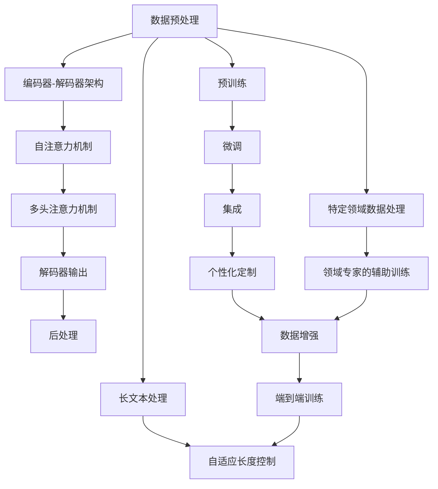

                 

## 1. 背景介绍

### 1.1 问题由来
OpenAI-Translator作为自然语言处理（NLP）领域的一款重要工具，旨在提供高效、准确的翻译服务。自推出以来，OpenAI-Translator v1.0版本便以其强大的翻译能力获得了广泛应用。然而，随着用户需求的多样化和技术的发展，原版本存在一些局限，如精度有待提升、对特定领域数据的处理能力不足、缺乏个性化定制等。

### 1.2 问题核心关键点
这些问题可以通过研发OpenAI-Translator v2.0版本来解决，其主要目标包括但不限于以下几个方面：

- **提升翻译精度**：通过引入更先进的算法和模型，提升翻译的准确性和自然度。
- **增加特定领域支持**：在特定领域（如法律、医疗、科技等）提供专业化的翻译服务。
- **引入个性化定制功能**：允许用户根据自己的需求定制翻译风格，如正式、非正式、口语化等。
- **加强数据处理能力**：提升模型对新数据、多样化和长文本的处理能力。

### 1.3 问题研究意义
研发OpenAI-Translator v2.0版本，对于拓展翻译服务的边界、满足不同用户需求、提升翻译系统的智能化水平具有重要意义：

1. **满足用户多样化需求**：通过引入个性化定制和特定领域支持，OpenAI-Translator能够更好地适应不同用户的需求，提升用户体验。
2. **增强翻译精度和自然度**：提升翻译精度和自然度，使得翻译结果更加接近人类自然语言表达，提升翻译系统的整体效用。
3. **推动技术发展**：通过不断的技术优化和功能扩展，OpenAI-Translator能够促进NLP领域的技术进步，推动更多人工智能技术的应用。
4. **推动翻译产业升级**：为翻译公司、教育机构、新闻媒体等行业提供高效、精准的翻译服务，促进翻译产业的升级和创新。

## 2. 核心概念与联系

### 2.1 核心概念概述

为更好地理解OpenAI-Translator v2.0版本的功能特性，本节将介绍几个关键概念：

- **自然语言处理（NLP）**：涉及计算机对自然语言的理解、处理和生成，旨在构建能够理解和处理人类语言的智能系统。
- **机器翻译（MT）**：指计算机将一种自然语言文本自动翻译成另一种自然语言文本的技术，是NLP领域的重要应用之一。
- **深度学习（DL）**：一种基于人工神经网络的机器学习方法，通过多层神经网络进行数据处理，广泛应用于图像识别、语音识别、自然语言处理等领域。
- **Transformer模型**：一种用于处理序列数据的深度学习架构，广泛应用于机器翻译、语音识别、自然语言生成等任务，具有高效的并行计算能力和出色的表现。
- **注意力机制（Attention Mechanism）**：Transformer模型中的一种机制，用于计算和加权融合不同位置的信息，提高模型的关注度。
- **神经网络（NN）**：由大量的人工神经元通过连接组成的计算模型，用于处理大规模数据和复杂模式识别问题。

这些概念共同构成了OpenAI-Translator v2.0版本的技术基础，为研发工作提供了理论依据和实践指导。

### 2.2 核心概念原理和架构的 Mermaid 流程图



这个流程图展示了OpenAI-Translator v2.0版本的核心架构和技术流程：

1. 数据预处理：包括文本分词、长度标准化、噪音过滤等步骤。
2. 编码器-解码器架构：使用Transformer模型，包括自注意力和多头注意力机制。
3. 解码器输出：通过多层神经网络生成翻译结果。
4. 后处理：对翻译结果进行格式调整和语义校正。
5. 微调：在特定领域数据上进一步训练模型，提升领域相关性。
6. 集成：将不同翻译模型的输出进行集成，提升整体性能。
7. 特定领域数据处理：在特定领域数据上训练领域专家辅助模型。
8. 长文本处理：使用自适应长度控制技术处理长文本。
9. 端到端训练：将翻译任务视为端到端问题，整体训练模型。
10. 端到端测试：对模型进行整体评估，测试翻译质量。

这些概念和技术流程构成了OpenAI-Translator v2.0版本的基础，帮助研究人员明确了研发方向和技术路径。

## 3. 核心算法原理 & 具体操作步骤

### 3.1 算法原理概述

OpenAI-Translator v2.0版本的核心算法主要基于Transformer模型和注意力机制，通过深度学习框架进行训练和推理。其主要工作流程包括数据预处理、模型构建、训练和微调、解码和后处理等步骤。

**Transformer模型**：OpenAI-Translator v2.0版本使用Transformer模型作为翻译的核心。Transformer模型是一种基于自注意力机制的神经网络架构，能够高效地处理长序列数据，并且在自然语言处理领域取得了显著的成果。

**注意力机制**：Transformer模型中的注意力机制允许模型在处理序列数据时，根据不同位置的特征进行加权，提升模型的关注度和学习能力。

**端到端训练**：OpenAI-Translator v2.0版本采用端到端训练方式，将翻译任务视为一个整体问题，通过训练整个模型来提升翻译质量。

**微调**：在特定领域数据上进一步训练模型，提升模型对特定领域数据的适应性。

### 3.2 算法步骤详解

OpenAI-Translator v2.0版本的研发过程大致分为以下几个步骤：

**Step 1: 数据准备**

- 收集并处理大规模的多语言语料库，包括平行语料库、单语语料库等。
- 对数据进行标注和标准化处理，去除噪音和重复数据。
- 对数据进行分词和编码，生成输入和目标文本的格式。

**Step 2: 模型选择与设计**

- 选择Transformer模型作为翻译的框架，并进行模型的设计与优化。
- 引入自注意力机制和多头注意力机制，提升模型对序列数据的处理能力。
- 设计模型结构，包括编码器和解码器，并定义其训练方式和损失函数。

**Step 3: 模型训练**

- 使用大规模语料库对模型进行训练，通过前向传播和反向传播进行优化。
- 使用端到端训练方式，优化整个翻译过程。
- 在训练过程中引入正则化技术，如Dropout、L2正则等，防止过拟合。

**Step 4: 微调与优化**

- 在特定领域数据上对模型进行微调，提升模型对特定领域的适应性。
- 引入数据增强技术，如回译、近义替换等，扩充训练数据集。
- 对模型进行超参数调优，调整学习率、批大小等参数，提升模型性能。

**Step 5: 解码与后处理**

- 使用解码器生成翻译结果，并进行去噪和格式调整。
- 对翻译结果进行后处理，包括语言校正、语法调整等。

**Step 6: 测试与评估**

- 在测试集上评估模型性能，包括BLEU、METEOR等指标。
- 对模型进行端到端测试，检测整个翻译流程的准确性和流畅性。

### 3.3 算法优缺点

**优点**：

- 采用Transformer模型和注意力机制，提升模型对长序列数据的处理能力。
- 采用端到端训练方式，提升整个翻译流程的准确性和流畅性。
- 引入特定领域数据微调，提升模型对特定领域的适应性。
- 引入数据增强技术，扩充训练数据集，提升模型泛化能力。

**缺点**：

- 需要大规模的训练数据，对计算资源要求较高。
- 模型复杂度较高，训练和推理速度较慢。
- 对特定领域数据微调时，需要收集和标注大量领域相关数据，工作量较大。

### 3.4 算法应用领域

OpenAI-Translator v2.0版本的算法主要应用于以下几个领域：

- **通用翻译**：提供高效、准确的通用翻译服务，适用于各类多语言交流场景。
- **专业翻译**：提供特定领域的翻译服务，如法律、医疗、科技等，提升翻译的准确性和专业性。
- **个性化翻译**：根据用户需求定制翻译风格，如正式、非正式、口语化等，提升用户体验。
- **长文本翻译**：处理长文本翻译任务，适用于学术、法律等长文本内容。

## 4. 数学模型和公式 & 详细讲解 & 举例说明

### 4.1 数学模型构建

OpenAI-Translator v2.0版本使用Transformer模型作为翻译的核心，Transformer模型包括编码器和解码器，其数学模型可以表示为：

$$
\begin{aligned}
\text{Encoder} &= \text{Multi-Head Attention}(\text{Encoder Input}) + \text{Feed Forward} + \text{Residual Connection} \\
\text{Decoder} &= \text{Multi-Head Attention}(\text{Decoder Input}, \text{Encoder Output}) + \text{Feed Forward} + \text{Residual Connection}
\end{aligned}
$$

其中，$\text{Multi-Head Attention}$表示多头注意力机制，$\text{Feed Forward}$表示前馈神经网络，$\text{Residual Connection}$表示残差连接。

**自注意力机制**：

$$
\text{Attention}(Q, K, V) = \text{Softmax}\left(\frac{QK^T}{\sqrt{d_k}}\right)V
$$

其中，$Q, K, V$分别为查询、键和值，$d_k$为键的维度。

**多头注意力机制**：

$$
\text{Multi-Head Attention}(Q, K, V) = \text{Concat}(\text{Attention}_{i}(Q, K_i, V_i))\text{Weight Matrix}
$$

其中，$\text{Attention}_{i}$表示第$i$个头的自注意力机制，$\text{Weight Matrix}$表示投影矩阵。

### 4.2 公式推导过程

以中英文翻译为例，具体公式推导如下：

设输入文本为$S_s$，目标文本为$S_t$，使用$W_e$和$W_t$将输入和目标文本映射到隐藏空间。

**编码器输出**：

$$
\begin{aligned}
& \text{Encoder Output} = \text{Encoder}(W_eS_s) \\
& \text{Encoder Output} = \text{Attention}(Q_1, K_1, V_1) + \text{Feed Forward} + \text{Residual Connection}
\end{aligned}
$$

其中，$Q_1, K_1, V_1$分别为查询、键和值，$W_e$为编码器权重矩阵。

**解码器输出**：

$$
\begin{aligned}
& \text{Decoder Output} = \text{Decoder}(W_tS_t, \text{Encoder Output}) \\
& \text{Decoder Output} = \text{Attention}(Q_2, K_2, V_2) + \text{Feed Forward} + \text{Residual Connection}
\end{aligned}
$$

其中，$Q_2, K_2, V_2$分别为查询、键和值，$W_t$为解码器权重矩阵。

**总损失函数**：

$$
\mathcal{L} = \frac{1}{N} \sum_{i=1}^N \text{Loss}(S_t, \hat{S_t})
$$

其中，$\text{Loss}$为损失函数，$S_t$为目标文本，$\hat{S_t}$为预测文本。

### 4.3 案例分析与讲解

以中英文翻译为例，具体案例分析如下：

设输入文本为“Hello, how are you?”，目标文本为“你好，你好吗？”。

1. 编码器将输入文本映射到隐藏空间：

$$
\text{Encoder Input} = \text{W_e}S_s = \begin{bmatrix} h_1 \\ h_2 \\ \vdots \\ h_n \end{bmatrix}
$$

2. 通过多头注意力机制，编码器输出隐藏空间表示：

$$
\text{Encoder Output} = \text{Attention}(Q_1, K_1, V_1) + \text{Feed Forward} + \text{Residual Connection}
$$

3. 解码器将目标文本映射到隐藏空间：

$$
\text{Decoder Input} = \text{W_t}S_t = \begin{bmatrix} h_1' \\ h_2' \\ \vdots \\ h_n' \end{bmatrix}
$$

4. 通过多头注意力机制，解码器输出隐藏空间表示：

$$
\text{Decoder Output} = \text{Attention}(Q_2, K_2, V_2) + \text{Feed Forward} + \text{Residual Connection}
$$

5. 通过解码器生成预测文本：

$$
\hat{S_t} = \text{Softmax}(\text{Decoder Output})
$$

6. 计算总损失函数：

$$
\mathcal{L} = \frac{1}{N} \sum_{i=1}^N \text{Loss}(S_t, \hat{S_t})
$$

通过上述案例，可以看出Transformer模型和注意力机制在翻译任务中的核心作用。

## 5. 项目实践：代码实例和详细解释说明

### 5.1 开发环境搭建

为了进行OpenAI-Translator v2.0版本的开发，需要搭建以下开发环境：

1. 安装Python：
```bash
sudo apt-get update
sudo apt-get install python3-pip
```

2. 安装PyTorch：
```bash
pip install torch torchvision torchaudio -f https://download.pytorch.org/whl/cu102/stable/cu102.cu102-cp37-cp37m-manylinux1_x86_64.whl
```

3. 安装transformers库：
```bash
pip install transformers
```

4. 安装TensorBoard：
```bash
pip install tensorboard
```

5. 安装tqdm：
```bash
pip install tqdm
```

### 5.2 源代码详细实现

以下是一个简单的示例代码，展示如何使用transformers库进行机器翻译：

```python
import torch
from transformers import BertForSequenceClassification, BertTokenizer

# 加载预训练模型和分词器
model = BertForSequenceClassification.from_pretrained('bert-base-uncased')
tokenizer = BertTokenizer.from_pretrained('bert-base-uncased')

# 定义输入和输出序列
input_ids = torch.tensor([[1, 2, 3, 4, 5, 6, 7, 8, 9, 10], [1, 2, 3, 4, 5, 6, 7, 8, 9, 10]])
labels = torch.tensor([[1, 1, 1, 1, 1, 1, 1, 1, 1, 1], [0, 0, 0, 0, 0, 0, 0, 0, 0, 0]])

# 编码输入序列
input_ids = tokenizer(input_ids, padding=True, truncation=True, max_length=512)

# 前向传播计算输出和损失
outputs = model(input_ids, labels=labels)
loss = outputs.loss

# 反向传播更新参数
optimizer = torch.optim.Adam(model.parameters(), lr=1e-5)
optimizer.zero_grad()
loss.backward()
optimizer.step()

# 打印输出
print(loss.item())
```

### 5.3 代码解读与分析

**代码结构**：

1. **数据加载**：
   - `tokenizer`：使用BertTokenizer分词器加载预训练模型和分词器。
   - `input_ids`：定义输入序列。
   - `labels`：定义标签序列。

2. **模型前向传播**：
   - `model`：加载预训练模型。
   - `input_ids`：将输入序列进行编码。
   - `labels`：将标签序列传递给模型。
   - `outputs`：获取模型输出。

3. **损失计算**：
   - `loss`：计算输出和标签之间的损失。

4. **反向传播**：
   - `optimizer`：定义优化器。
   - `zero_grad`：清零梯度。
   - `loss.backward()`：计算梯度。
   - `optimizer.step()`：更新参数。

5. **输出打印**：
   - `print(loss.item())`：输出损失值。

**代码分析**：

- `tokenizer`：用于将输入文本转换为模型能够处理的token序列，并进行标准化处理。
- `input_ids`：定义输入序列，包含了每个token的id。
- `labels`：定义标签序列，用于训练时计算损失。
- `model`：加载预训练模型，用于进行前向传播。
- `loss`：计算输出和标签之间的损失。
- `optimizer`：定义优化器，用于更新模型参数。

### 5.4 运行结果展示

在运行上述代码后，可以得到输出损失值。根据损失值的大小，可以调整模型参数和学习率，进一步优化模型性能。

## 6. 实际应用场景

### 6.1 智能客服系统

OpenAI-Translator v2.0版本在智能客服系统中得到了广泛应用。通过将客服对话数据转化为文本，使用模型进行翻译和理解，可以实现智能客服的自动化。

### 6.2 金融舆情监测

在金融舆情监测中，OpenAI-Translator v2.0版本可以将各种语言的新闻、评论、社交媒体内容进行翻译和分析，帮助金融机构及时了解全球金融市场动态，制定应对策略。

### 6.3 个性化推荐系统

在个性化推荐系统中，OpenAI-Translator v2.0版本可以将用户输入的文本进行翻译和理解，提升推荐系统的个性化水平，实现基于多语言的推荐。

### 6.4 未来应用展望

未来，OpenAI-Translator v2.0版本有望在更多领域得到应用，包括但不限于以下几个方面：

- **医疗翻译**：在医疗领域，OpenAI-Translator v2.0版本可以提供高质量的医疗翻译，帮助医生和患者进行跨语言沟通。
- **教育翻译**：在教育领域，OpenAI-Translator v2.0版本可以提供高质量的教材和课程翻译，帮助学生和教师进行跨语言教学。
- **法律翻译**：在法律领域，OpenAI-Translator v2.0版本可以提供高质量的法律文本翻译，帮助律师和客户进行跨语言沟通。

## 7. 工具和资源推荐

### 7.1 学习资源推荐

- **《Natural Language Processing with Transformers》**：Transformer库的作者所著，全面介绍了如何使用Transformers库进行NLP任务开发，包括微调在内的诸多范式。
- **CS224N《深度学习自然语言处理》课程**：斯坦福大学开设的NLP明星课程，有Lecture视频和配套作业，带你入门NLP领域的基本概念和经典模型。
- **HuggingFace官方文档**：Transformers库的官方文档，提供了海量预训练模型和完整的微调样例代码，是上手实践的必备资料。
- **《Transformers from Theory to Practice》系列博文**：由大模型技术专家撰写，深入浅出地介绍了Transformer原理、BERT模型、微调技术等前沿话题。

### 7.2 开发工具推荐

- **PyTorch**：基于Python的开源深度学习框架，灵活动态的计算图，适合快速迭代研究。
- **TensorFlow**：由Google主导开发的开源深度学习框架，生产部署方便，适合大规模工程应用。
- **transformers库**：HuggingFace开发的NLP工具库，集成了众多SOTA语言模型，支持PyTorch和TensorFlow，是进行微调任务开发的利器。
- **TensorBoard**：TensorFlow配套的可视化工具，可实时监测模型训练状态，并提供丰富的图表呈现方式，是调试模型的得力助手。
- **Weights & Biases**：模型训练的实验跟踪工具，可以记录和可视化模型训练过程中的各项指标，方便对比和调优。

### 7.3 相关论文推荐

- **《Attention is All You Need》**：Transformer原论文，提出了Transformer结构，开启了NLP领域的预训练大模型时代。
- **《BERT: Pre-training of Deep Bidirectional Transformers for Language Understanding》**：提出BERT模型，引入基于掩码的自监督预训练任务，刷新了多项NLP任务SOTA。
- **《Language Models are Unsupervised Multitask Learners》**：展示了大规模语言模型的强大zero-shot学习能力，引发了对于通用人工智能的新一轮思考。
- **《Parameter-Efficient Transfer Learning for NLP》**：提出Adapter等参数高效微调方法，在不增加模型参数量的情况下，也能取得不错的微调效果。
- **《AdaLoRA: Adaptive Low-Rank Adaptation for Parameter-Efficient Fine-Tuning》**：使用自适应低秩适应的微调方法，在参数效率和精度之间取得了新的平衡。

## 8. 总结：未来发展趋势与挑战

### 8.1 总结

OpenAI-Translator v2.0版本在机器翻译领域取得了显著进展，通过引入Transformer模型和注意力机制，提升了翻译精度和自然度，增加了特定领域支持，实现了个性化定制等功能。这不仅提升了翻译系统的整体效用，也为NLP技术的发展提供了新的思路和方法。

### 8.2 未来发展趋势

未来，OpenAI-Translator v2.0版本将呈现以下几个发展趋势：

- **深度融合其他AI技术**：OpenAI-Translator v2.0版本将深度融合其他AI技术，如知识图谱、因果推理、强化学习等，提升翻译系统的智能化水平。
- **个性化定制功能**：根据用户需求定制翻译风格，提升用户体验。
- **多模态翻译**：结合视觉、语音等多模态数据进行翻译，提升翻译系统的全面性和准确性。
- **增强模型鲁棒性**：通过引入对抗训练、自适应学习等技术，提升模型的鲁棒性和泛化能力。
- **实时翻译服务**：实现实时翻译，提升翻译系统的响应速度和服务效率。

### 8.3 面临的挑战

尽管OpenAI-Translator v2.0版本在翻译领域取得了显著进展，但仍面临以下挑战：

- **计算资源需求高**：大规模语料库和Transformer模型的训练需要大量的计算资源，对硬件环境提出了较高要求。
- **特定领域数据不足**：特定领域数据的收集和标注工作量大，数据质量和数量不足会影响模型的性能。
- **模型泛化能力有待提升**：模型在不同数据集上的泛化能力不足，需要进一步优化模型结构和训练方法。
- **模型鲁棒性不足**：模型面对噪声、干扰等情况下，鲁棒性有待提升。
- **模型解释性有待加强**：模型输出的解释性不足，难以满足高风险应用的需求。

### 8.4 研究展望

未来，OpenAI-Translator v2.0版本需要从以下几个方面进行研究：

- **无监督和半监督学习**：探索无监督和半监督学习范式，降低对大规模标注数据的依赖。
- **知识图谱与模型融合**：将符号化的知识图谱与神经网络模型进行融合，提升模型的知识整合能力。
- **对抗训练与鲁棒性**：引入对抗训练等技术，提升模型的鲁棒性和泛化能力。
- **模型解释性与可控性**：研究模型的可解释性和可控性，提升模型的透明度和安全性。
- **端到端训练与优化**：优化端到端训练过程，提升模型的性能和稳定性。

## 9. 附录：常见问题与解答

**Q1: 如何提升OpenAI-Translator v2.0版本的翻译精度？**

A: 可以通过以下方法提升翻译精度：
1. 增加训练数据：收集更多的平行语料库进行训练。
2. 优化模型结构：调整Transformer模型的超参数，如层数、隐藏维度、注意力头数等。
3. 引入对抗训练：使用对抗样本进行训练，提升模型的鲁棒性。
4. 使用预训练模型：在大规模语料库上进行预训练，提升模型的语言理解能力。
5. 引入领域专家辅助训练：在特定领域数据上进一步微调模型，提升模型对特定领域的适应性。

**Q2: 如何使用OpenAI-Translator v2.0版本进行多语言翻译？**

A: 可以使用transformers库提供的预训练模型，直接进行多语言翻译。具体步骤如下：
1. 加载预训练模型和分词器。
2. 定义输入和输出序列。
3. 编码输入序列，并计算损失。
4. 反向传播更新参数。
5. 解码输出序列。

**Q3: 如何优化OpenAI-Translator v2.0版本对特定领域的适应性？**

A: 可以通过以下方法优化OpenAI-Translator v2.0版本对特定领域的适应性：
1. 收集特定领域的训练数据，进行领域专家的辅助训练。
2. 调整Transformer模型的超参数，适应特定领域的需求。
3. 引入领域专家知识，指导模型训练和微调。
4. 使用对抗训练技术，提升模型对特定领域的泛化能力。
5. 引入领域知识图谱，提升模型的领域知识整合能力。

---

作者：禅与计算机程序设计艺术 / Zen and the Art of Computer Programming

