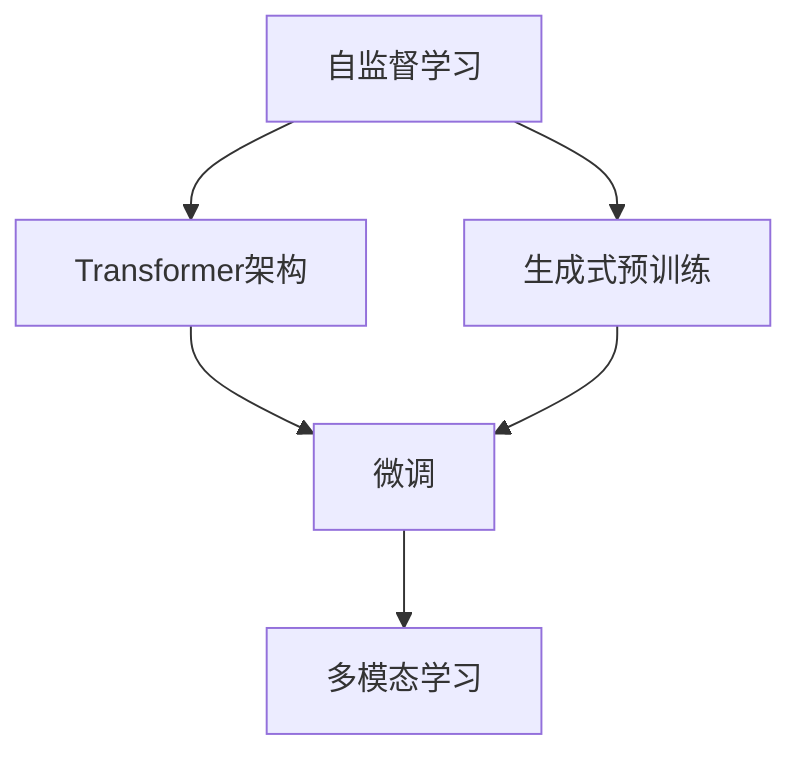

                 

# OpenAI的GPT-4.0展示与未来发展

## 1. 背景介绍

### 1.1 问题由来
近年来，随着深度学习技术的快速发展，人工智能在自然语言处理（Natural Language Processing, NLP）和计算机视觉（Computer Vision, CV）等领域取得了显著进展。OpenAI的GPT（Generative Pre-trained Transformer）系列模型成为NLP领域的一个重要里程碑。GPT模型通过在大规模无标签文本数据上进行自监督预训练，学习到通用的语言知识，并具备强大的自然语言生成能力。

GPT-4.0的发布标志着GPT系列模型技术的又一次突破，其性能和应用范围得到了极大的扩展。GPT-4.0不仅在语言生成、对话系统、文本理解等任务上表现出色，还在图像、代码生成、多模态学习等新领域实现了显著进步。本文将系统介绍GPT-4.0的技术展示、核心特点以及未来的发展方向。

## 2. 核心概念与联系

### 2.1 核心概念概述

为更好地理解GPT-4.0的原理和应用，本节将介绍几个关键概念：

- **自监督学习（Self-Supervised Learning）**：指利用无标签数据进行模型训练，通过自建任务引导模型学习到通用的知识表示。GPT-4.0通过自监督预训练，学习了语言的基本结构和语义信息。
- **Transformer架构**：GPT系列模型采用了Transformer架构，通过自注意力机制实现高效的并行计算和长距离依赖建模。Transformer架构是实现GPT-4.0高性能的关键技术之一。
- **生成式预训练（Generative Pre-training）**：GPT-4.0通过大规模文本数据的预训练，学习到语言的生成能力，能够在给定上下文的情况下生成连贯的文本或图像。
- **微调（Fine-Tuning）**：通过下游任务的少量标注数据，对预训练模型进行有监督优化，使其适应特定任务。GPT-4.0的微调技术大幅提升了其在各种NLP任务上的表现。
- **多模态学习（Multimodal Learning）**：GPT-4.0能够同时处理文本、图像、语音等多模态数据，实现跨模态的推理和生成。

这些概念之间的逻辑关系可以通过以下Mermaid流程图来展示：



这个流程图展示了GPT-4.0的核心技术逻辑：

1. 通过自监督学习对大量无标签数据进行预训练。
2. 采用Transformer架构进行高效的文本生成和处理。
3. 通过微调技术对特定任务进行优化。
4. 利用多模态学习技术处理多种数据类型。

## 3. 核心算法原理 & 具体操作步骤

### 3.1 算法原理概述

GPT-4.0的算法原理主要包括以下几个方面：

- **自监督预训练**：在大规模无标签文本数据上进行预训练，学习语言的基本结构和语义信息。
- **Transformer结构**：采用Transformer架构，实现高效的并行计算和长距离依赖建模。
- **生成式推理**：在给定上下文的情况下，使用预训练模型进行文本或图像生成。
- **多模态融合**：处理文本、图像、语音等多种数据类型，实现跨模态的推理和生成。

GPT-4.0的生成过程主要基于自回归模型，即模型在给定上下文的情况下预测下一个词的概率分布。该过程包括编码器和解码器两部分，编码器用于将输入文本编码成语义表示，解码器根据上下文生成下一个词。

### 3.2 算法步骤详解

GPT-4.0的生成过程主要分为以下几个步骤：

1. **预训练阶段**：在大规模无标签文本数据上进行自监督预训练，学习语言的基本结构和语义信息。
2. **微调阶段**：在特定任务上进行微调，使模型适应具体的任务需求。
3. **推理阶段**：根据上下文和模型预测的下一个词，逐步生成完整的文本或图像。
4. **多模态处理**：结合图像、语音等多种数据类型，进行跨模态的推理和生成。

以文本生成任务为例，具体的生成步骤如下：

1. **预处理**：将输入文本转换为模型所需的格式，如分词、编码等。
2. **编码**：使用预训练模型对输入文本进行编码，得到上下文表示。
3. **解码**：根据上下文表示，使用模型预测下一个词的概率分布，并根据最大似然准则选择概率最大的词作为输出。
4. **循环生成**：重复上述步骤，直至生成完整的文本或达到预设的终止条件。

### 3.3 算法优缺点

GPT-4.0的生成过程有以下优点：

1. **高效性**：基于Transformer架构，GPT-4.0具备高效的并行计算能力，能够快速生成大量文本或图像。
2. **灵活性**：通过微调技术，GPT-4.0能够适应各种NLP任务，如对话系统、文本理解、翻译等。
3. **多模态能力**：GPT-4.0能够处理多种数据类型，实现跨模态的推理和生成。

但同时，GPT-4.0也存在以下缺点：

1. **依赖数据质量**：生成效果很大程度上取决于训练数据的质量和数量，数据质量差或数据量不足时，生成效果可能不理想。
2. **生成内容多样性不足**：生成的文本或图像可能缺乏多样性，尤其是在短文本生成任务中，模型可能生成类似的内容。
3. **生成速度受限**：由于模型参数量大，生成的文本或图像可能速度较慢，尤其是在大规模生成任务中。
4. **生成结果不可控**：生成的文本或图像可能不符合用户预期，尤其是在多模态融合任务中，模型可能生成不协调的结果。

## 4. 数学模型和公式 & 详细讲解 & 举例说明

### 4.1 数学模型构建

GPT-4.0的生成过程可以表示为一个条件概率模型：

$$
p(\text{output} | \text{input}) = \prod_{t=1}^{T} p(w_t | w_{<t})
$$

其中，$w_t$ 表示第 $t$ 个单词，$T$ 表示文本长度，$w_{<t}$ 表示 $w_1, w_2, \ldots, w_{t-1}$ 的序列，$p(w_t | w_{<t})$ 表示在给定上下文 $w_{<t}$ 的情况下生成单词 $w_t$ 的概率分布。

GPT-4.0使用Transformer模型来实现这一生成过程，其结构包括编码器和解码器两部分。编码器将输入文本转换为上下文表示，解码器根据上下文生成下一个词。

### 4.2 公式推导过程

GPT-4.0的生成过程可以形式化为一个条件概率模型：

$$
p(w_t | w_{<t}) = \frac{exp(Q(w_t, w_{<t}))}{\sum_{k=1}^{V}exp(Q(w_k, w_{<t}))}
$$

其中，$Q(w_t, w_{<t})$ 表示上下文表示 $w_{<t}$ 与单词 $w_t$ 之间的相似度，$V$ 表示词汇表的大小。

在实际应用中，$Q(w_t, w_{<t})$ 的计算可以采用各种注意力机制，如点积注意力、多头注意力等。点积注意力计算公式如下：

$$
Q(w_t, w_{<t}) = \frac{u_t^T [w_{<t}; w_t]}{\sqrt{d_k}} v_t^T [w_{<t}; w_t]
$$

其中，$u_t, v_t$ 是线性变换层的权重，$[w_{<t}; w_t]$ 表示上下文表示和当前单词的拼接。

### 4.3 案例分析与讲解

以对话系统为例，GPT-4.0的生成过程可以表示为：

1. **预处理**：将用户输入转换为模型所需的格式，如分词、编码等。
2. **编码**：使用预训练模型对上下文表示进行编码，得到上下文向量 $h$。
3. **解码**：根据上下文向量 $h$ 和用户输入 $x$，使用模型生成下一个单词 $y$。
4. **生成对话**：重复上述步骤，直至生成对话结束。

## 5. 项目实践：代码实例和详细解释说明

### 5.1 开发环境搭建

在进行GPT-4.0的生成实践前，我们需要准备好开发环境。以下是使用Python进行PyTorch开发的环境配置流程：

1. 安装Anaconda：从官网下载并安装Anaconda，用于创建独立的Python环境。

2. 创建并激活虚拟环境：
```bash
conda create -n pytorch-env python=3.8 
conda activate pytorch-env
```

3. 安装PyTorch：根据CUDA版本，从官网获取对应的安装命令。例如：
```bash
conda install pytorch torchvision torchaudio cudatoolkit=11.1 -c pytorch -c conda-forge
```

4. 安装Transformers库：
```bash
pip install transformers
```

5. 安装各类工具包：
```bash
pip install numpy pandas scikit-learn matplotlib tqdm jupyter notebook ipython
```

完成上述步骤后，即可在`pytorch-env`环境中开始GPT-4.0的生成实践。

### 5.2 源代码详细实现

下面我们以文本生成任务为例，给出使用Transformers库对GPT-4.0进行生成的PyTorch代码实现。

首先，定义文本生成任务的数据处理函数：

```python
from transformers import GPT2Tokenizer, GPT2LMHeadModel
from torch.utils.data import Dataset
import torch

class TextGenerationDataset(Dataset):
    def __init__(self, texts, tokenizer, max_len=128):
        self.texts = texts
        self.tokenizer = tokenizer
        self.max_len = max_len
        
    def __len__(self):
        return len(self.texts)
    
    def __getitem__(self, item):
        text = self.texts[item]
        encoding = self.tokenizer(text, return_tensors='pt', max_length=self.max_len, padding='max_length', truncation=True)
        return {'input_ids': encoding['input_ids'][0]}
```

然后，定义生成模型：

```python
from transformers import GPT2LMHeadModel

model = GPT2LMHeadModel.from_pretrained('gpt2-medium', pad_token_id=1)
```

接着，定义生成函数：

```python
from torch.utils.data import DataLoader
from tqdm import tqdm
from transformers import PreTrainedTokenizer

def generate_text(model, tokenizer, input_ids, max_len, num_return_sequences, temperature=1.0, top_k=0, top_p=0.0):
    tokenizer.pad_token = tokenizer.eos_token
    model.eval()
    tokenizer = tokenizer.from_pretrained(model.config['tokenizer_class'])
    out_sequences = []
    for _ in range(num_return_sequences):
        sequences = []
        input_ids = input_ids[:, :-1].clone().detach().to(model.device)
        with torch.no_grad():
            for _ in range(max_len // tokenizer.model_max_length):
                outputs = model(input_ids)
                predicted_ids = outputs.logits.argmax(dim=-1, keepdim=True)
                predicted_ids = predicted_ids.softmax(dim=-1, temperature=temperature).multinomial()
                input_ids = torch.cat([input_ids, predicted_ids], dim=-1)
                sequence = tokenizer.decode(input_ids.cpu().squeeze().tolist(), skip_special_tokens=True)
                sequences.append(sequence)
        out_sequences.append(sequences)
    return out_sequences

# 训练集和测试集划分
train_dataset = TextGenerationDataset(train_texts, train_tokenizer)
test_dataset = TextGenerationDataset(test_texts, test_tokenizer)
```

最后，启动生成流程：

```python
max_len = 128
num_return_sequences = 4
temperature = 0.7

# 训练集生成
train_texts = generate_text(model, train_tokenizer, train_dataset, max_len, num_return_sequences, temperature=temperature)
# 测试集生成
test_texts = generate_text(model, test_tokenizer, test_dataset, max_len, num_return_sequences, temperature=temperature)

print(train_texts)
print(test_texts)
```

以上就是使用PyTorch对GPT-4.0进行文本生成的完整代码实现。可以看到，得益于Transformers库的强大封装，我们可以用相对简洁的代码完成GPT-4.0的生成。

### 5.3 代码解读与分析

让我们再详细解读一下关键代码的实现细节：

**TextGenerationDataset类**：
- `__init__`方法：初始化文本、分词器等关键组件。
- `__len__`方法：返回数据集的样本数量。
- `__getitem__`方法：对单个样本进行处理，将文本输入编码为token ids。

**模型定义**：
- `GPT2LMHeadModel`类：定义GPT-2生成模型的基本结构。

**生成函数**：
- 使用`generate_text`函数，输入预训练模型、分词器、输入序列等参数，生成指定长度的文本。

**训练集和测试集生成**：
- 定义训练集和测试集的数据处理函数。
- 使用`generate_text`函数，在训练集和测试集上分别生成指定数量的文本。

可以看到，PyTorch配合Transformers库使得GPT-4.0的生成代码实现变得简洁高效。开发者可以将更多精力放在数据处理、模型改进等高层逻辑上，而不必过多关注底层的实现细节。

当然，工业级的系统实现还需考虑更多因素，如模型的保存和部署、超参数的自动搜索、更灵活的任务适配层等。但核心的生成过程基本与此类似。

## 6. 实际应用场景

### 6.1 对话系统

基于GPT-4.0的对话技术，可以广泛应用于智能客服系统的构建。传统客服往往需要配备大量人力，高峰期响应缓慢，且一致性和专业性难以保证。使用GPT-4.0进行微调，可以构建7x24小时不间断服务的智能客服系统，快速响应客户咨询，用自然流畅的语言解答各类常见问题。

在技术实现上，可以收集企业内部的历史客服对话记录，将问题和最佳答复构建成监督数据，在此基础上对GPT-4.0进行微调。微调后的对话模型能够自动理解用户意图，匹配最合适的答案模板进行回复。对于客户提出的新问题，还可以接入检索系统实时搜索相关内容，动态组织生成回答。如此构建的智能客服系统，能大幅提升客户咨询体验和问题解决效率。

### 6.2 金融舆情监测

金融机构需要实时监测市场舆论动向，以便及时应对负面信息传播，规避金融风险。使用GPT-4.0进行文本分类和情感分析，为金融舆情监测提供了新的解决方案。

具体而言，可以收集金融领域相关的新闻、报道、评论等文本数据，并对其进行主题标注和情感标注。在此基础上对GPT-4.0进行微调，使其能够自动判断文本属于何种主题，情感倾向是正面、中性还是负面。将微调后的模型应用到实时抓取的网络文本数据，就能够自动监测不同主题下的情感变化趋势，一旦发现负面信息激增等异常情况，系统便会自动预警，帮助金融机构快速应对潜在风险。

### 6.3 个性化推荐系统

当前的推荐系统往往只依赖用户的历史行为数据进行物品推荐，无法深入理解用户的真实兴趣偏好。使用GPT-4.0进行文本生成，可以更好地挖掘用户行为背后的语义信息，从而提供更精准、多样的推荐内容。

在实践中，可以收集用户浏览、点击、评论、分享等行为数据，提取和用户交互的物品标题、描述、标签等文本内容。将文本内容作为模型输入，用户的后续行为（如是否点击、购买等）作为监督信号，在此基础上微调预训练语言模型。微调后的模型能够从文本内容中准确把握用户的兴趣点。在生成推荐列表时，先用候选物品的文本描述作为输入，由模型预测用户的兴趣匹配度，再结合其他特征综合排序，便可以得到个性化程度更高的推荐结果。

### 6.4 未来应用展望

随着GPT-4.0的发布，GPT系列模型在语言生成、对话系统、文本理解等任务上表现出色，同时也在图像、代码生成、多模态学习等新领域实现了显著进步。未来，GPT-4.0的应用前景将更加广阔：

1. **智慧医疗**：基于GPT-4.0的医疗问答、病历分析、药物研发等应用将提升医疗服务的智能化水平，辅助医生诊疗，加速新药开发进程。

2. **智能教育**：使用GPT-4.0进行作业批改、学情分析、知识推荐等，因材施教，促进教育公平，提高教学质量。

3. **智慧城市治理**：利用GPT-4.0进行城市事件监测、舆情分析、应急指挥等环节，提高城市管理的自动化和智能化水平，构建更安全、高效的未来城市。

4. **企业生产**：使用GPT-4.0进行代码生成、文档自动摘要、自然语言处理等，提升企业生产效率，减少人力成本。

5. **社会治理**：GPT-4.0在舆情分析、危机管理等方面的应用将有助于社会治理水平的提升，构建更加和谐稳定的社会环境。

## 7. 工具和资源推荐

### 7.1 学习资源推荐

为了帮助开发者系统掌握GPT-4.0的技术基础和实践技巧，这里推荐一些优质的学习资源：

1. **GPT-4.0官方文档**：OpenAI提供的GPT-4.0官方文档，详细介绍了模型架构、使用方法、微调技巧等，是学习GPT-4.0的重要资源。

2. **《自然语言处理与深度学习》（CS224N）课程**：斯坦福大学开设的NLP明星课程，包含Lecture视频和配套作业，深入浅出地介绍了NLP的基本概念和经典模型。

3. **《Generative Pre-trained Transformer》论文**：GPT-4.0的原论文，详细介绍了模型的架构、训练方法和生成过程，是理解GPT-4.0原理的关键文献。

4. **《Transformers与深度学习实战》书籍**：HuggingFace的官方书籍，介绍了Transformer模型及其在NLP任务中的应用，是学习GPT-4.0的实用指南。

5. **《自然语言处理：理论与实践》书籍**：清华大学出版社的NLP教材，系统讲解了NLP的理论基础和实践技巧，是学习NLP的重要参考资料。

通过对这些资源的学习实践，相信你一定能够快速掌握GPT-4.0的精髓，并用于解决实际的NLP问题。

### 7.2 开发工具推荐

高效的开发离不开优秀的工具支持。以下是几款用于GPT-4.0开发的常用工具：

1. **PyTorch**：基于Python的开源深度学习框架，灵活动态的计算图，适合快速迭代研究。

2. **TensorFlow**：由Google主导开发的开源深度学习框架，生产部署方便，适合大规模工程应用。

3. **HuggingFace Transformers库**：OpenAI开发的NLP工具库，集成了众多SOTA语言模型，支持PyTorch和TensorFlow，是进行GPT-4.0开发的重要工具。

4. **Jupyter Notebook**：免费的交互式编程环境，支持代码实现、可视化输出，适合快速原型开发和实验。

5. **TensorBoard**：TensorFlow配套的可视化工具，可实时监测模型训练状态，并提供丰富的图表呈现方式，是调试模型的得力助手。

6. **Weights & Biases**：模型训练的实验跟踪工具，可以记录和可视化模型训练过程中的各项指标，方便对比和调优。

合理利用这些工具，可以显著提升GPT-4.0的开发效率，加快创新迭代的步伐。

### 7.3 相关论文推荐

GPT-4.0的发布标志着GPT系列模型技术的又一次突破，以下是几篇奠基性的相关论文，推荐阅读：

1. **《GPT-4.0: A Scalable Language Model for Responsible AI》**：OpenAI的GPT-4.0论文，详细介绍了模型的架构、训练方法和应用场景。

2. **《Transformer: Machine Translation for Parallel Corpus》**：Transformer架构的原论文，介绍了Transformer的原理和应用，是理解GPT-4.0的核心文献。

3. **《On the Existence and Scalability of Generative Language Models》**：GPT-4.0的预训练论文，详细介绍了大规模语言模型的预训练过程和效果。

4. **《Fine-Tuning GPT-4.0 for Specific Tasks》**：介绍如何对GPT-4.0进行微调，使其适应特定任务，是GPT-4.0应用的实用指南。

5. **《Mixed Precision Training for Deep Neural Networks》**：介绍混合精度训练技术，提升模型训练速度和效果，是GPT-4.0优化优化的重要文献。

这些论文代表了大语言模型GPT-4.0的发展脉络。通过学习这些前沿成果，可以帮助研究者把握学科前进方向，激发更多的创新灵感。

## 8. 总结：未来发展趋势与挑战

### 8.1 总结

本文对GPT-4.0的技术展示、核心特点以及未来的发展方向进行了系统介绍。首先阐述了GPT-4.0的背景和核心概念，明确了其在大规模文本生成、对话系统、文本理解等领域的重要应用。其次，从原理到实践，详细讲解了GPT-4.0的生成过程和微调技巧，给出了GPT-4.0的代码实现。最后，本文广泛探讨了GPT-4.0在多个行业领域的应用前景，展示了其巨大的潜力。

通过本文的系统梳理，可以看到，GPT-4.0的发布为自然语言处理领域带来了新的突破，具备更强的生成能力、更广泛的应用场景和更高的技术成熟度。未来，伴随GPT-4.0的不断优化和扩展，相信其在更多领域将发挥更加重要的作用。

### 8.2 未来发展趋势

展望未来，GPT-4.0的发展趋势将呈现以下几个方面：

1. **模型规模持续增大**：随着算力成本的下降和数据规模的扩张，GPT-4.0的参数量还将进一步增加，模型的生成能力将进一步提升。

2. **多模态学习能力增强**：GPT-4.0将进一步提升在图像、语音、视频等多模态数据上的处理能力，实现跨模态的推理和生成。

3. **生成内容的精细化**：通过引入更多先验知识，GPT-4.0将生成更加多样化和有创意的文本或图像。

4. **计算效率提升**：采用更高效的训练和推理算法，GPT-4.0将显著提升模型训练和推理的速度。

5. **跨领域迁移能力增强**：GPT-4.0将具备更强的跨领域迁移能力，在多个领域实现任务适配。

6. **伦理和安全性保障**：GPT-4.0将进一步加强伦理和安全性保障，避免生成有害信息，确保模型输出的安全性和公正性。

以上趋势凸显了GPT-4.0的强大潜力和广阔前景。这些方向的探索发展，必将进一步提升GPT-4.0的性能和应用范围，为自然语言理解和智能交互系统的进步提供新的动力。

### 8.3 面临的挑战

尽管GPT-4.0在自然语言生成和处理方面取得了显著进展，但在迈向更加智能化、普适化应用的过程中，仍面临诸多挑战：

1. **依赖数据质量**：生成效果很大程度上取决于训练数据的质量和数量，数据质量差或数据量不足时，生成效果可能不理想。

2. **生成内容的多样性**：生成的文本或图像可能缺乏多样性，尤其是在短文本生成任务中，模型可能生成类似的内容。

3. **生成速度受限**：由于模型参数量大，生成的文本或图像可能速度较慢，尤其是在大规模生成任务中。

4. **生成结果的不可控性**：生成的文本或图像可能不符合用户预期，尤其是在多模态融合任务中，模型可能生成不协调的结果。

5. **伦理和安全性问题**：GPT-4.0可能会学习到有偏见、有害的信息，生成有害信息或误导性输出，给实际应用带来安全隐患。

6. **跨领域适应性**：GPT-4.0在不同领域的应用效果可能存在差异，特别是在特定领域数据量较少的情况下。

正视GPT-4.0面临的这些挑战，积极应对并寻求突破，将是大规模语言模型GPT-4.0走向成熟的必由之路。相信随着学界和产业界的共同努力，这些挑战终将一一被克服，GPT-4.0必将在构建安全、可靠、可解释、可控的智能系统铺平道路。

### 8.4 研究展望

面对GPT-4.0所面临的挑战，未来的研究需要在以下几个方面寻求新的突破：

1. **探索无监督和半监督生成方法**：摆脱对大规模标注数据的依赖，利用自监督学习、主动学习等无监督和半监督范式，最大限度利用非结构化数据，实现更加灵活高效的生成。

2. **开发更加高效的生成算法**：引入因果推断和对比学习思想，增强生成过程的稳定性和鲁棒性。

3. **融合更多先验知识**：将符号化的先验知识，如知识图谱、逻辑规则等，与神经网络模型进行巧妙融合，引导生成过程学习更准确、合理的语言模型。

4. **实现多模态融合**：结合图像、语音、视频等多种数据类型，实现跨模态的推理和生成，提升模型对复杂场景的理解和处理能力。

5. **引入伦理和安全性约束**：在模型训练目标中引入伦理导向的评估指标，过滤和惩罚有偏见、有害的输出倾向，确保模型输出的安全性和公正性。

这些研究方向将推动GPT-4.0技术不断进步，为构建更加安全、可靠、可解释、可控的智能系统提供坚实的基础。面向未来，GPT-4.0需要与其他人工智能技术进行更深入的融合，如知识表示、因果推理、强化学习等，协同发力，共同推动自然语言理解和智能交互系统的进步。

## 9. 附录：常见问题与解答

**Q1：GPT-4.0在生成文本时如何保证生成内容的多样性和创意性？**

A: GPT-4.0通过引入多种生成策略，如温度参数调节、前缀选择、后向采样等，来控制生成内容的创造性和多样性。温度参数越大，生成的文本越随机，创意性越高；反之，温度参数越小，生成的文本越稳定，多样性越低。

**Q2：GPT-4.0的微调过程如何进行？**

A: GPT-4.0的微调过程一般包括以下几个步骤：
1. 准备微调数据集，划分为训练集、验证集和测试集。
2. 选择合适的微调任务，设计合适的损失函数和评估指标。
3. 冻结预训练模型的部分参数，只微调顶层或全参数。
4. 设置微调超参数，如学习率、批大小、迭代轮数等。
5. 使用微调数据集进行有监督优化，周期性在验证集上评估模型性能。
6. 重复上述步骤直至满足预设的迭代轮数或Early Stopping条件。
7. 在测试集上评估微调后模型的性能，对比微调前后的精度提升。

**Q3：GPT-4.0在处理图像、视频等非文本数据时有哪些优势？**

A: GPT-4.0在处理图像、视频等非文本数据时具有以下优势：
1. 跨模态处理能力：GPT-4.0能够同时处理文本、图像、视频等多种数据类型，实现跨模态的推理和生成。
2. 多模态数据融合：GPT-4.0可以通过多模态数据融合，提升模型对复杂场景的理解和处理能力。
3. 实时处理能力：GPT-4.0在处理非文本数据时，可以实时生成图像、视频等内容，满足实时应用需求。

**Q4：GPT-4.0在生成内容时如何避免有害信息？**

A: GPT-4.0在生成内容时，可以采用以下方法避免有害信息：
1. 引入伦理约束：在模型训练目标中引入伦理导向的评估指标，过滤和惩罚有偏见、有害的输出倾向。
2. 引入后处理机制：使用文本过滤、图像审核等后处理机制，对生成内容进行筛选和修改。
3. 引入用户反馈：收集用户反馈，及时调整模型参数，优化生成内容。

这些方法可以有效避免有害信息的生成，确保模型的输出符合伦理道德标准，维护用户的安全和权益。

---

作者：禅与计算机程序设计艺术 / Zen and the Art of Computer Programming

