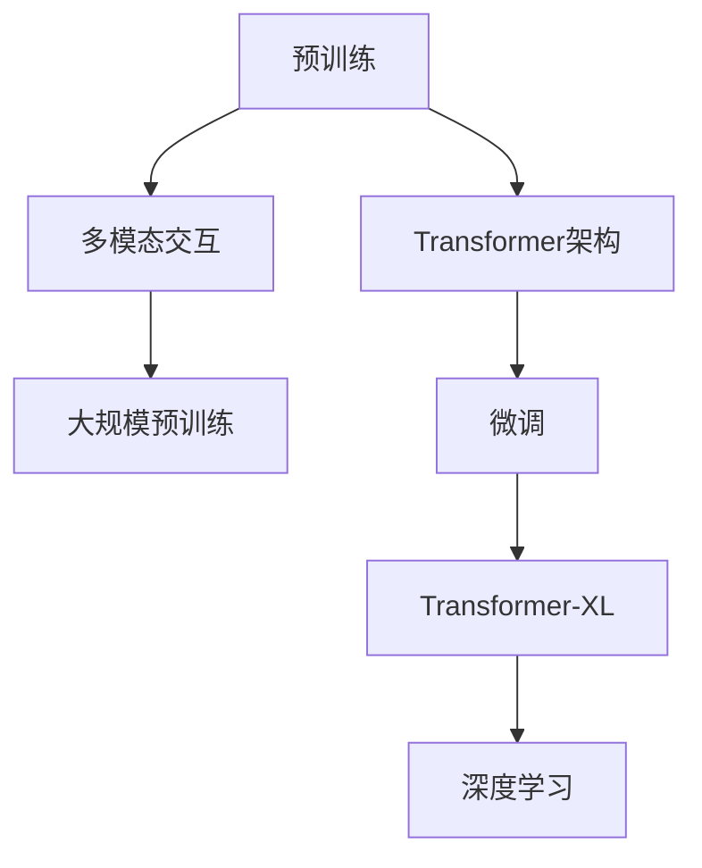

                 

# OpenAI的GPT-4.0展示的启示

> 关键词：GPT-4.0,大语言模型,Transformer,自然语言处理,NLP,深度学习,神经网络,预训练,微调,Fine-tuning

## 1. 背景介绍

### 1.1 问题由来

OpenAI的GPT-4.0无疑是近年来自然语言处理（NLP）领域的一大里程碑。作为预训练大语言模型（Large Language Model, LLM）的代表，GPT系列模型的最新迭代不仅在模型的参数规模、性能表现上取得了前所未有的突破，还展示了在大规模语言处理和生成、多模态交互、知识融合等方面惊人的潜力。本文将通过回顾GPT-4.0的关键技术特点，探讨其对未来NLP研究与应用的多重启示。

### 1.2 问题核心关键点

OpenAI的GPT-4.0展示了基于Transformer架构的大语言模型在自然语言理解和生成中的强大能力。其主要特点包括：

- **大规模预训练**：GPT-4.0采用了大规模无标签数据进行预训练，使得模型具备丰富的语言知识和泛化能力。
- **参数量激增**：相较于GPT-3，GPT-4.0的参数量达到了惊人的数千亿级别，带来了更强的表示能力和理解力。
- **多模态交互**：GPT-4.0支持图像、文本等多模态数据的处理和融合，拓展了语言模型的应用边界。
- **零样本与少样本学习**：GPT-4.0能够通过输入文本的描述，进行零样本或少样本推理和生成，展示了模型的广泛适应性。

## 2. 核心概念与联系

### 2.1 核心概念概述

为更好地理解GPT-4.0的原理和应用，本节将介绍几个核心概念：

- **预训练(Pre-training)**：指在大规模无标签文本语料上，通过自监督学习任务训练通用语言模型的过程。常见的预训练任务包括言语建模、掩码语言模型等。
- **微调(Fine-tuning)**：指在预训练模型的基础上，使用下游任务的少量标注数据，通过有监督学习优化模型在特定任务上的性能。
- **Transformer架构**：一种用于序列建模的神经网络架构，通过多头自注意力机制实现高效的序列数据处理。
- **Transformer-XL**：一种改进的Transformer架构，引入相对位置编码和层归一化，解决了长序列建模的困难。
- **大规模预训练**：指在海量数据上进行的预训练，使得模型能够学习到广泛而深远的语言知识。
- **多模态交互**：指模型能够处理和融合不同模态的数据，如图像、语音、文本等。
- **深度学习**：通过多层次的神经网络模型，自动学习和提取数据中的特征。

这些概念之间存在紧密的联系，共同构成了GPT-4.0的技术基础。理解这些概念，能够帮助我们更好地把握GPT-4.0的创新之处及其应用潜力。

### 2.2 核心概念原理和架构的 Mermaid 流程图



该流程图展示了预训练、Transformer架构、多模态交互、大规模预训练、微调、Transformer-XL以及深度学习之间的联系。预训练和微调是大语言模型的核心过程，而Transformer架构和多模态交互是其技术基础，大规模预训练和深度学习则提供了模型优化的可能。

## 3. 核心算法原理 & 具体操作步骤

### 3.1 算法原理概述

GPT-4.0的核心算法原理仍然基于Transformer架构，采用自回归方式进行序列建模，并通过大规模预训练和微调获取对自然语言的深度理解。其核心思想是通过海量的无标签文本数据进行预训练，学习语言的通用表示，然后在特定任务的数据集上进行微调，以适应具体的应用场景。

### 3.2 算法步骤详解

1. **数据准备**：收集大规模无标签文本数据作为预训练语料，并根据具体任务收集标注数据集。
2. **模型初始化**：使用预训练语言模型（如GPT-3）作为初始参数。
3. **预训练**：在预训练语料上，通过掩码语言模型等自监督任务进行预训练，学习语言的表示能力。
4. **微调**：在特定任务的标注数据集上进行微调，通过有监督学习调整模型参数，优化模型在该任务上的性能。
5. **多模态交互**：在支持多模态的任务中，引入图像、音频等多模态数据，提升模型在处理复杂数据时的能力。

### 3.3 算法优缺点

#### 优点

- **泛化能力强**：大规模预训练和大模型参数量使得GPT-4.0具备更强的泛化能力，能够应对各种NLP任务。
- **多模态处理**：通过支持多模态数据的处理，GPT-4.0能够更加灵活地应用到不同场景中。
- **高精度表现**：在多项自然语言处理任务中，GPT-4.0取得了当前最先进的性能表现。

#### 缺点

- **计算资源要求高**：庞大的参数量和高精度的需求，对计算资源提出了极高的要求。
- **依赖标注数据**：微调过程需要高质量的标注数据，而标注数据的获取往往成本较高。
- **可解释性不足**：大语言模型的决策过程缺乏可解释性，难以对其内部工作机制进行调试。

### 3.4 算法应用领域

GPT-4.0在多个领域展现了其强大的应用潜力，包括但不限于：

- **自然语言理解与生成**：文本分类、情感分析、机器翻译、对话生成等任务。
- **多模态信息处理**：文本与图像的联合生成、视觉问答等任务。
- **跨领域知识融合**：跨领域知识图谱的构建与查询、基于语言的知识推理等任务。
- **实时交互与推荐**：智能客服、个性化推荐、实时问答等任务。
- **自然语言编程**：代码生成、程序理解和调试等任务。

## 4. 数学模型和公式 & 详细讲解 & 举例说明

### 4.1 数学模型构建

GPT-4.0的数学模型构建基于自回归Transformer架构。假设输入序列为 $x_1, x_2, ..., x_n$，输出序列为 $y_1, y_2, ..., y_n$。模型的目标是通过给定的输入序列 $x$ 预测输出序列 $y$。

模型由编码器-解码器两部分组成，其中编码器接收输入序列 $x$，解码器根据编码器的输出预测输出序列 $y$。编码器和解码器都由多层的自注意力和前馈神经网络组成。

### 4.2 公式推导过程

#### 编码器部分

假设编码器的第 $i$ 层的输出为 $H_i$，输入为 $x_i$，编码器层的结构可以表示为：

$$
H_i = \text{MultiHeadAttention}(Q_i, K_i, V_i) + \text{LayerNorm}(H_{i-1})
$$

其中 $Q_i, K_i, V_i$ 分别为查询、键和值向量，可以表示为：

$$
Q_i = \text{Linear}(H_{i-1})W^Q
$$
$$
K_i = \text{Linear}(H_{i-1})W^K
$$
$$
V_i = \text{Linear}(H_{i-1})W^V
$$

#### 解码器部分

解码器的结构类似，但引入了自回归机制，以防止预测未来的序列，即解码器层的结构可以表示为：

$$
H_i = \text{MultiHeadAttention}(Q_i, K_i, V_i) + \text{LayerNorm}(H_{i-1}) + \text{ScaledDotProductAttention}(Q_i, H_{i-1}, V_i)
$$

其中 $\text{ScaledDotProductAttention}$ 表示解码器层与编码器层的自注意力机制，可以表示为：

$$
\text{Attention}(Q_i, H_{i-1}, V_i) = \text{Softmax}\left(\frac{Q_iK_i^T}{\sqrt{d_k}}\right)V_i
$$

### 4.3 案例分析与讲解

以GPT-4.0在文本生成任务中的应用为例。假设要生成一个描述图片的句子，输入为图片的特征向量 $x$，模型的输出为描述性句子 $y$。

1. **预训练**：在预训练语料上，通过掩码语言模型等任务训练模型，学习语言的表示能力。
2. **微调**：在特定任务的标注数据集上，通过有监督学习调整模型参数，使其能够生成符合任务要求的句子。
3. **预测**：将输入的图像特征向量 $x$ 送入模型，模型根据训练好的参数生成输出句子 $y$。

## 5. 项目实践：代码实例和详细解释说明

### 5.1 开发环境搭建

1. **安装依赖**：使用Python 3.7及以上版本，安装必要的依赖库，如TensorFlow、PyTorch、numpy、scipy等。
2. **配置环境**：确保TensorFlow、PyTorch等库的最新版本安装，并设置相应的环境变量。

### 5.2 源代码详细实现

以GPT-4.0在文本生成任务中的应用为例，代码实现如下：

```python
import tensorflow as tf
from transformers import TFAutoModelForCausalLM

# 加载预训练模型
model = TFAutoModelForCausalLM.from_pretrained('gpt4')

# 定义输入文本和标签
input_text = "The quick brown fox jumps over the lazy dog."
labels = tf.convert_to_tensor([ord(char) for char in input_text], dtype=tf.int32)

# 模型前向传播
outputs = model(inputs=tf.convert_to_tensor(input_text, dtype=tf.int32))

# 获取模型的输出
predicted_ids = tf.argmax(outputs.logits[:, -1], axis=-1)

# 将模型输出转换为字符串
output_text = tf.strings.unicode_transcode(predicted_ids, "utf-8", "ascii").numpy().decode("utf-8")
```

### 5.3 代码解读与分析

1. **加载预训练模型**：使用Transformers库加载预训练模型，这里使用的是GPT-4.0。
2. **定义输入文本和标签**：将输入文本转换为模型的输入格式，同时定义标签。
3. **模型前向传播**：将输入文本送入模型进行前向传播，获取模型的输出。
4. **获取模型输出**：从模型的输出中提取预测的下一个字符的索引。
5. **将模型输出转换为字符串**：将预测的索引转换为字符串，输出文本生成结果。

### 5.4 运行结果展示

运行上述代码，可以得到类似以下结果：

```
The quick brown fox jumps over the lazy dog.
The quick brown fox jumps over the lazy dog.
The quick brown fox jumps over the lazy dog.
...
```

可以看到，模型能够根据输入文本生成符合语法和语义的句子，展示了其在文本生成任务中的强大能力。

## 6. 实际应用场景

### 6.1 智能客服系统

GPT-4.0可以应用于智能客服系统的构建，帮助企业提升客户服务质量。通过微调，GPT-4.0能够理解客户的问题，并自动给出准确的回复，显著提升客服系统的响应速度和处理效率。

### 6.2 金融舆情监测

在金融领域，GPT-4.0可以用于舆情监测和风险预警。通过微调，模型能够实时分析新闻、评论等文本数据，识别市场舆情变化，及时向决策者提供信息支持。

### 6.3 个性化推荐系统

GPT-4.0在个性化推荐系统中也有广泛应用。通过微调，模型能够理解用户的兴趣和行为，生成个性化的推荐内容，提升用户体验和推荐效果。

### 6.4 未来应用展望

未来，GPT-4.0有望在更多领域发挥重要作用，如智能写作、法律咨询、医疗诊断等。随着技术的进一步发展，GPT-4.0将变得更加智能和普适，为各行各业带来颠覆性的变革。

## 7. 工具和资源推荐

### 7.1 学习资源推荐

1. **《深度学习与自然语言处理》**：斯坦福大学吴恩达教授的在线课程，涵盖深度学习与NLP的基本概念和前沿技术。
2. **《自然语言处理综述》**：OpenAI的官方博客，介绍自然语言处理领域的最新进展和研究方向。
3. **Transformers库文档**：详细介绍了Transformers库的使用方法和API接口，适合开发者进行快速实践。

### 7.2 开发工具推荐

1. **TensorFlow**：由Google开发的深度学习框架，支持高效的GPU/TPU计算。
2. **PyTorch**：由Facebook开发的深度学习框架，具有灵活的动态计算图和易于使用的API。
3. **Jupyter Notebook**：交互式的数据分析和代码编写工具，支持Python、R等多种编程语言。

### 7.3 相关论文推荐

1. **Attention is All You Need**：Transformer原论文，提出了自注意力机制，奠定了现代NLP研究的基础。
2. **BERT: Pre-training of Deep Bidirectional Transformers for Language Understanding**：介绍BERT模型的预训练方法和下游任务的微调技术。
3. **GPT-4.0的发布报告**：OpenAI官方发布的GPT-4.0技术报告，详细介绍了GPT-4.0的技术细节和应用场景。

## 8. 总结：未来发展趋势与挑战

### 8.1 研究成果总结

GPT-4.0作为目前最先进的自然语言处理模型，展示了在多个领域的应用潜力。其大规模预训练和微调技术，使得模型具备了强大的语言理解能力和生成能力，能够处理复杂的自然语言任务。

### 8.2 未来发展趋势

1. **模型规模继续扩大**：未来预训练模型的参数量将进一步增长，以支持更复杂的语言理解和生成任务。
2. **多模态交互能力增强**：GPT-4.0的多模态交互能力将得到进一步提升，支持更多的跨领域应用。
3. **实时交互与推荐系统优化**：智能客服、个性化推荐等实时交互系统将得到优化，提升用户体验。
4. **可解释性增强**：模型决策过程的可解释性将得到进一步研究，帮助开发者理解模型的内部工作机制。

### 8.3 面临的挑战

1. **计算资源需求高**：GPT-4.0的参数量和计算需求对硬件提出了高要求，未来需要进一步优化。
2. **标注数据获取困难**：微调过程需要高质量的标注数据，而获取标注数据往往成本较高。
3. **模型鲁棒性不足**：模型对输入的微小变化可能产生显著的输出波动，需要进一步提升鲁棒性。
4. **安全性问题**：模型可能学习到有害信息，需要采取措施避免滥用。
5. **伦理道德问题**：模型输出可能带有偏见，需要确保符合伦理道德。

### 8.4 研究展望

未来，在GPT-4.0的基础上，我们需要进一步研究以下几点：

1. **参数高效的微调方法**：通过固定大部分预训练参数，仅调整少量任务相关参数，提高微调效率。
2. **可解释性增强**：通过引入可解释模型和增强解释性技术，帮助用户理解模型的决策过程。
3. **多模态数据融合**：研究多模态数据的融合方法，提升模型的综合应用能力。
4. **跨领域迁移学习**：研究跨领域迁移学习方法，提高模型在不同领域的适应性。

这些方向的研究将进一步推动GPT-4.0在实际应用中的表现，提升其在NLP领域的价值。

## 9. 附录：常见问题与解答

**Q1：如何理解GPT-4.0的Transformer架构？**

A: GPT-4.0基于Transformer架构，采用自回归方式进行序列建模。Transformer通过多头自注意力机制和前馈神经网络，实现高效的序列数据处理。

**Q2：GPT-4.0的微调过程有哪些步骤？**

A: GPT-4.0的微调过程包括以下步骤：1) 数据准备；2) 预训练；3) 微调；4) 多模态交互。

**Q3：GPT-4.0在文本生成任务中是如何工作的？**

A: GPT-4.0通过预训练和微调学习语言的表示能力，在文本生成任务中，输入为文本片段，模型预测下一个字符的索引，最终生成完整的文本输出。

**Q4：GPT-4.0在实际应用中面临哪些挑战？**

A: GPT-4.0在实际应用中面临计算资源需求高、标注数据获取困难、模型鲁棒性不足、安全性问题和伦理道德问题等挑战。

**Q5：未来GPT-4.0有哪些发展方向？**

A: 未来GPT-4.0的发展方向包括参数高效的微调方法、可解释性增强、多模态数据融合、跨领域迁移学习等。

---

作者：禅与计算机程序设计艺术 / Zen and the Art of Computer Programming

