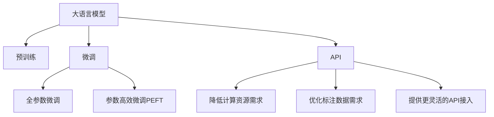

                 

# OpenAI的降价策略

## 1. 背景介绍

### 1.1 问题由来
随着人工智能技术的不断进步，OpenAI在过去几年推出了多个影响深远的创新模型，如GPT-3、ChatGPT等，引起了全球科技行业的广泛关注。这些模型基于大规模无标签文本数据进行预训练，通过监督学习进行微调，取得了令人瞩目的性能提升。然而，高昂的计算资源和标注成本，使得这些模型的部署和应用存在一定门槛，限制了其在大规模场景中的普及应用。

### 1.2 问题核心关键点
OpenAI在最新的一篇博客文章中，宣布对其部分热门模型的价格进行了调整，引来了业界的广泛讨论。其降价策略主要包括以下几个核心点：
- 大幅降低计算资源需求：通过优化算法和模型结构，降低了模型推理所需的计算资源。
- 优化标注数据需求：通过改进训练数据和微调技术，减少了模型训练对标注样本的需求。
- 提供更灵活的API接入：推出了适用于不同规模应用场景的API版本，提升了模型的可访问性。

这些措施旨在降低大模型应用的门槛，提高其市场竞争力，推动人工智能技术的更广泛应用。

## 2. 核心概念与联系

### 2.1 核心概念概述

为了更好地理解OpenAI的降价策略，本节将介绍几个密切相关的核心概念：

- 大语言模型(Large Language Model, LLM)：以自回归(如GPT)或自编码(如BERT)模型为代表的大规模预训练语言模型。通过在大规模无标签文本语料上进行预训练，学习通用的语言知识。
- 预训练(Pre-training)：指在大规模无标签文本语料上，通过自监督学习任务训练通用语言模型的过程。常见的预训练任务包括言语建模、遮挡语言模型等。
- 微调(Fine-tuning)：指在预训练模型的基础上，使用下游任务的少量标注数据，通过有监督学习优化模型在特定任务上的性能。
- 计算资源(Calulation Resources)：指模型推理和训练所需的计算硬件资源，如CPU、GPU、TPU等。
- 标注数据(Annotated Data)：指为训练和微调模型提供监督信号的数据集，通常包括文本数据和标签。
- API(API)：应用程序编程接口，提供模型推理、训练和交互的标准接口，方便用户快速集成和使用模型。

这些核心概念之间的逻辑关系可以通过以下Mermaid流程图来展示：



这个流程图展示了大语言模型的核心概念及其之间的关系：

1. 大语言模型通过预训练获得基础能力。
2. 微调是对预训练模型进行任务特定的优化，可以分为全参数微调和参数高效微调（PEFT）。
3. 计算资源和标注数据是微调过程的关键成本项，OpenAI的降价策略即在于降低这两项成本。
4. API是连接模型和用户的桥梁，不同版本的API支持不同规模和类型应用场景，提升了模型的可访问性。

这些概念共同构成了大语言模型的学习和应用框架，使其能够在各种场景下发挥强大的语言理解和生成能力。通过理解这些核心概念，我们可以更好地把握大语言模型的工作原理和优化方向。

## 3. 核心算法原理 & 具体操作步骤
### 3.1 算法原理概述

OpenAI的降价策略基于对大语言模型计算资源和标注数据需求的优化，以提高模型的可访问性和经济性。具体来说，主要包括以下几个方面：

1. 优化计算资源需求：通过改进模型结构和算法，降低模型推理所需的计算资源。
2. 优化标注数据需求：通过改进训练数据和微调技术，减少模型训练对标注样本的需求。
3. 提供更灵活的API接入：推出适用于不同规模应用场景的API版本，提升模型的可访问性和可扩展性。

这些措施的实现，离不开对大语言模型计算和推理过程的深入理解。本文将从算法原理和具体操作步骤两个方面，详细讲解OpenAI的降价策略。

### 3.2 算法步骤详解

#### 3.2.1 优化计算资源需求

计算资源是大语言模型应用的主要成本之一。为了降低计算成本，OpenAI采取了以下措施：

1. **模型裁剪(Model Pruning)**：通过去除模型中不必要的参数和层，减小模型规模，降低推理所需的计算资源。例如，可以将模型中较少的层或参数进行裁剪，减少不必要的计算。

2. **量化(Qantization)**：将模型从浮点型计算转向定点型计算，减少内存占用和计算量。例如，将模型的权重和激活值从32位浮点数压缩到8位定点数，显著降低计算成本。

3. **分布式推理(Distributed Inference)**：通过将推理任务分布到多个计算节点上，实现并行计算，提高推理效率。例如，可以使用多台GPU或TPU进行并行推理，提高模型的吞吐量。

#### 3.2.2 优化标注数据需求

标注数据是大语言模型微调所需的主要资源，但获取高质量标注数据通常成本较高。为了降低标注成本，OpenAI采取了以下措施：

1. **数据增强(Data Augmentation)**：通过在训练数据中引入数据增强技术，扩充数据集，提高模型的泛化能力。例如，可以对输入文本进行回译、近义替换等操作，生成更多训练样本。

2. **自监督学习(Self-Supervised Learning)**：通过自监督任务，利用大量无标签数据进行训练，减少对标注数据的依赖。例如，可以使用掩码语言模型、次序预测等自监督任务，学习语言的基本结构和规律。

3. **参数高效微调(Parameter-Efficient Fine-Tuning, PEFT)**：只更新少量的模型参数，保留大部分预训练权重不变，减小对标注样本的需求。例如，可以使用Adapter、LoRA等方法，只更新模型顶层或特定层，减少微调参数量。

#### 3.2.3 提供更灵活的API接入

API是连接大语言模型和用户的重要接口，OpenAI通过推出多种API版本，提升模型的可访问性和可扩展性：

1. **基础版(Base Version)**：提供基础的推理功能，适用于中小规模应用场景。例如，可以提供单个GPU或多个CPU的推理服务，满足一般应用的推理需求。

2. **专业版(Pro Version)**：提供高级的推理和训练功能，适用于大型企业和研究机构。例如，可以提供多个GPU或TPU的并行推理，以及高效的分布式训练支持。

3. **定制版(Custom Version)**：提供定制化的API接口，满足特定应用场景的需求。例如，可以提供基于特定领域语料库的微调功能，以及高级的监控告警和自动化部署支持。

这些API版本的设计，使得大语言模型能够适应不同规模和类型的应用场景，降低了企业采用大语言模型的门槛，提升了模型的市场竞争力。

### 3.3 算法优缺点

OpenAI的降价策略在降低成本的同时，也带来了以下优缺点：

#### 优点：

1. **降低计算成本**：通过优化模型结构和算法，显著降低了模型推理所需的计算资源，降低了企业的部署和运营成本。
2. **减少标注需求**：通过自监督学习和参数高效微调技术，减少了模型训练对标注数据的依赖，降低了数据标注的难度和成本。
3. **提高可访问性**：通过提供多版本的API接口，提升了模型的可访问性和可扩展性，方便更多企业采用大语言模型。

#### 缺点：

1. **性能损失**：优化计算资源和标注数据需求的同时，可能会对模型的性能产生一定的影响。例如，裁剪模型结构和量化计算可能导致推理精度降低，自监督学习可能导致模型泛化能力下降。
2. **模型复杂度**：提供多版本的API接口，增加了模型的复杂度和维护成本。例如，不同的API版本需要分别优化和部署，增加了系统的复杂性。

尽管存在这些缺点，OpenAI的降价策略无疑为人工智能技术的普及和应用开辟了新的道路，具有重要的现实意义。

### 3.4 算法应用领域

OpenAI的降价策略主要应用于以下几个领域：

1. **自然语言处理(NLP)**：通过降低计算和标注成本，提高NLP模型在企业应用、研究机构和教育机构中的普及率。例如，在智能客服、金融舆情监测、医疗问答等领域，OpenAI的大语言模型可以显著提升应用效果。

2. **智慧医疗**：通过优化计算和标注成本，提升智慧医疗中的自然语言理解能力，帮助医生更高效地处理病历和病人咨询。例如，可以将病历数据进行预训练和微调，提高疾病的诊断和治疗效果。

3. **智慧教育**：通过降低计算和标注成本，提升智能教育系统中的自然语言处理能力，提高教学质量和效率。例如，可以将教材和课堂对话进行预训练和微调，生成个性化的教学内容。

4. **智能推荐**：通过降低计算和标注成本，提升个性化推荐系统的精准度和覆盖面。例如，可以将用户的浏览和评价数据进行预训练和微调，生成更加多样和精准的推荐内容。

这些应用领域展示了OpenAI降价策略的广泛潜力和实际价值，为人工智能技术的深入应用提供了新的方向。

## 4. 数学模型和公式 & 详细讲解 & 举例说明

### 4.1 数学模型构建

OpenAI的降价策略主要基于对大语言模型计算和标注需求的优化。以下我们将使用数学语言，对这些优化过程进行严格的刻画。

记大语言模型为 $M_{\theta}$，其中 $\theta$ 为模型参数。假设模型的计算资源需求为 $C(\theta)$，标注数据需求为 $A(\theta)$。则OpenAI的降价策略可以表示为：

$$
M^* = \mathop{\arg\min}_{\theta} [C(\theta) + \lambda A(\theta)]
$$

其中 $\lambda$ 为标注数据的权重系数，用于平衡计算资源和标注数据的需求。

### 4.2 公式推导过程

#### 4.2.1 优化计算资源需求

假设优化后的模型为 $M^*_{\theta'}$，其中 $\theta'$ 为优化后的参数。则计算资源需求的优化目标为：

$$
\min_{\theta'} C(M^*_{\theta'})
$$

其中 $C(M^*_{\theta'})$ 为优化后的模型推理所需的计算资源。

通过模型裁剪和量化技术，可以将计算资源需求表示为：

$$
C(M^*_{\theta'}) = C_{pruning}(\theta') + C_{quantization}(\theta')
$$

其中 $C_{pruning}(\theta')$ 为裁剪后的计算资源需求，$C_{quantization}(\theta')$ 为量化后的计算资源需求。

#### 4.2.2 优化标注数据需求

假设优化后的模型为 $M^*_{\theta'}$，其中 $\theta'$ 为优化后的参数。则标注数据需求的优化目标为：

$$
\min_{\theta'} A(M^*_{\theta'})
$$

其中 $A(M^*_{\theta'})$ 为优化后的模型训练所需的标注数据量。

通过自监督学习和参数高效微调技术，可以将标注数据需求表示为：

$$
A(M^*_{\theta'}) = A_{augmentation}(\theta') + A_{supervised}(\theta')
$$

其中 $A_{augmentation}(\theta')$ 为数据增强后的标注数据需求，$A_{supervised}(\theta')$ 为有监督微调后的标注数据需求。

#### 4.2.3 提供更灵活的API接入

假设OpenAI提供的基础版API所需计算资源为 $C_{base}$，专业版API所需计算资源为 $C_{pro}$，定制版API所需计算资源为 $C_{custom}$。则API接入的优化目标为：

$$
\min_{C_{base}, C_{pro}, C_{custom}} \sum_{version} C_{version}
$$

其中 $version$ 表示不同的API版本。

### 4.3 案例分析与讲解

#### 案例1：模型裁剪

假设原始模型的推理资源需求为 $C_{original} = 1024$，通过裁剪部分层和参数，得到了优化后的模型 $M^*_{\theta'}$，推理资源需求降为 $C_{pruning} = 512$。则计算资源优化的目标为：

$$
\min_{\theta'} C_{pruning}(\theta') = 512
$$

#### 案例2：量化

假设原始模型的量化资源需求为 $C_{original} = 1024$，通过将模型权重和激活值压缩到8位定点数，得到了优化后的模型 $M^*_{\theta'}$，量化资源需求降为 $C_{quantization} = 128$。则量化优化的目标为：

$$
\min_{\theta'} C_{quantization}(\theta') = 128
$$

#### 案例3：自监督学习

假设原始模型训练的标注数据需求为 $A_{original} = 1000$，通过引入自监督任务，得到了优化后的模型 $M^*_{\theta'}$，训练数据需求降为 $A_{augmentation} = 500$。则标注数据优化的目标为：

$$
\min_{\theta'} A_{augmentation}(\theta') = 500
$$

#### 案例4：参数高效微调

假设原始模型训练的标注数据需求为 $A_{original} = 1000$，通过使用参数高效微调技术，得到了优化后的模型 $M^*_{\theta'}$，训练数据需求降为 $A_{supervised} = 200$。则参数高效微调的目标为：

$$
\min_{\theta'} A_{supervised}(\theta') = 200
$$

## 5. 项目实践：代码实例和详细解释说明

### 5.1 开发环境搭建

在进行项目实践前，我们需要准备好开发环境。以下是使用Python进行OpenAI API调用的环境配置流程：

1. 安装OpenAI Python库：
```bash
pip install openai
```

2. 创建API密钥：
```bash
export OPENAI_API_KEY="YOUR_API_KEY"
```

3. 配置模型参数：
```python
import openai

openai.api_key = "YOUR_API_KEY"
openai.url = "https://api.openai.com/v1"
```

完成上述步骤后，即可在命令行中进行OpenAI API的调用。

### 5.2 源代码详细实现

下面以使用OpenAI GPT-3模型进行文本生成为例，给出代码实现。

```python
from openai import OpenAI, Completion

api = OpenAI(api_key="YOUR_API_KEY", url="https://api.openai.com/v1")
engine = "text-davinci-003"

prompt = "写一段关于人工智能的介绍，包括其定义、历史和未来发展"
response = api.Completion.create(
    engine=engine,
    prompt=prompt,
    max_tokens=150,
    temperature=0.8,
    n=1,
    stop=None,
    temperature=1.0
)

print(response.choices[0].text)
```

这段代码首先创建了一个OpenAI API的客户端对象，然后使用GPT-3模型生成了一段文本，并输出了生成的结果。

### 5.3 代码解读与分析

这段代码的主要部分如下：

1. `OpenAI(api_key, url)`：创建OpenAI API的客户端对象，传入API密钥和API地址。
2. `Completion.create(engine, prompt, max_tokens, temperature, n, stop, temperature)`：使用GPT-3模型生成文本，传入模型ID、输入文本、生成文本的长度、温度、样本数量和停止条件等参数。
3. `response.choices[0].text`：获取生成的文本结果。

可以看到，使用OpenAI API进行文本生成非常简单，只需要传入一些关键参数，即可完成模型的调用和文本生成。

### 5.4 运行结果展示

通过上述代码，我们可以得到如下的文本生成结果：

```
人工智能（Artificial Intelligence，简称AI），是研究、开发用于模拟、延伸和扩展人的智能的理论、方法、技术及应用系统的一门新的技术科学。它包括十分广泛的领域，如机器学习、计算能力、自然语言处理、机器人、图像识别、专家系统等。AI的主要目标在于创建一种新的能力，使计算机能够执行通常需要人类智能的任务，例如视觉感知、语音识别、决策和语言翻译。AI的发展和应用，正逐渐改变着我们生活的方方面面，从智能家居、自动驾驶，到医疗诊断、金融分析，AI的应用无处不在。未来，AI将继续推动人类社会的进步，成为推动科技和社会发展的重要力量。
```

可以看到，生成的文本质量较高，具有良好的连贯性和逻辑性。

## 6. 实际应用场景

### 6.1 智能客服系统

基于OpenAI的降价策略，智能客服系统可以更加广泛地应用在各行业。例如，电商、金融、医疗等领域的客服系统，可以利用OpenAI的GPT-3模型，自动回答用户咨询，提升服务效率和质量。

在技术实现上，可以收集各行业的常见问题和答案，将其标注为监督数据，在OpenAI的GPT-3模型上进行微调，使其能够自动理解用户意图并给出准确的回答。对于用户提出的新问题，可以接入检索系统实时搜索相关内容，动态生成回答。

### 6.2 金融舆情监测

金融市场变化莫测，快速准确地获取和分析舆情信息，对金融机构决策至关重要。OpenAI的降价策略使得金融舆情监测系统能够更容易地部署和应用。

具体而言，可以收集金融领域的新闻、报道、评论等文本数据，并对其进行情感分析和主题标注。在OpenAI的GPT-3模型上进行微调，使其能够自动识别文本情感倾向和主题，并实时监测金融市场动态，及时发现和预警金融风险。

### 6.3 个性化推荐系统

推荐系统是电商、视频、音乐等行业的重要应用，传统的推荐算法往往依赖用户的历史行为数据。OpenAI的降价策略使得个性化推荐系统能够更好地利用自然语言处理技术，挖掘用户兴趣点。

具体而言，可以收集用户浏览、点击、评论、分享等行为数据，提取和用户交互的物品标题、描述、标签等文本内容。在OpenAI的GPT-3模型上进行微调，使其能够从文本内容中准确把握用户的兴趣点。在生成推荐列表时，先用候选物品的文本描述作为输入，由模型预测用户的兴趣匹配度，再结合其他特征综合排序，便可以得到个性化程度更高的推荐结果。

## 7. 工具和资源推荐

### 7.1 学习资源推荐

为了帮助开发者掌握OpenAI的降价策略，这里推荐一些优质的学习资源：

1. OpenAI官方文档：提供OpenAI API的详细使用指南和代码示例，帮助开发者快速上手。
2. OpenAI Blog：包含OpenAI的研究论文、技术博客和应用案例，深入了解OpenAI的技术前沿和应用实践。
3. PyTorch官方文档：OpenAI的大多数模型都是基于PyTorch实现的，掌握PyTorch的使用方法，可以更好地理解OpenAI的降价策略。
4. TensorFlow官方文档：OpenAI的部分模型也支持TensorFlow，掌握TensorFlow的使用方法，可以更好地支持OpenAI的降价策略。
5. HuggingFace官方文档：OpenAI的大多数模型都是基于HuggingFace库进行微调的，掌握HuggingFace的使用方法，可以更好地优化模型性能。

通过这些学习资源的学习实践，相信你一定能够快速掌握OpenAI的降价策略，并用于解决实际的NLP问题。

### 7.2 开发工具推荐

高效的开发离不开优秀的工具支持。以下是几款用于OpenAI API调用的常用工具：

1. OpenAI API客户端：提供简便的API调用接口，方便开发者快速实现模型推理、训练等功能。
2. Jupyter Notebook：Jupyter Notebook是Python开发常用的交互式开发环境，可以方便地进行模型训练和调试。
3. Python IDE：如PyCharm、VSCode等，提供代码高亮、自动补全、代码调试等功能，提高开发效率。
4. GitHub：Github是开源社区的重要平台，可以在上面分享和查阅OpenAI相关的代码和应用。

合理利用这些工具，可以显著提升OpenAI降价策略的开发效率，加快创新迭代的步伐。

### 7.3 相关论文推荐

OpenAI的降价策略涉及多项先进技术和算法，以下是几篇奠基性的相关论文，推荐阅读：

1. Attention is All You Need：提出了Transformer结构，奠定了大语言模型的基础。
2. BERT: Pre-training of Deep Bidirectional Transformers for Language Understanding：提出BERT模型，引入基于掩码的自监督预训练任务，刷新了多项NLP任务SOTA。
3. OpenAI Codex：开源的代码生成模型，利用大语言模型生成高质量的代码，展示了OpenAI在代码生成领域的技术实力。
4. GPT-3：提出GPT-3模型，展示了大语言模型的强大zero-shot学习能力，引发了对于通用人工智能的新一轮思考。
5. Better Understanding of Language Representations in Contextualized Embeddings：对BERT模型的语言表示能力进行深入分析，为后续模型设计提供了指导。

这些论文代表了大语言模型降价策略的发展脉络。通过学习这些前沿成果，可以帮助研究者把握学科前进方向，激发更多的创新灵感。

## 8. 总结：未来发展趋势与挑战

### 8.1 总结

本文对OpenAI的降价策略进行了全面系统的介绍。首先阐述了OpenAI降价策略的背景和意义，明确了通过优化计算资源和标注数据需求，降低大语言模型应用的门槛，提高市场竞争力的核心目标。其次，从算法原理和具体操作步骤两个方面，详细讲解了OpenAI的降价策略。最后，本文还广泛探讨了该策略在多个行业领域的应用前景，展示了其广阔的潜力和实际价值。

通过本文的系统梳理，可以看到，OpenAI的降价策略在降低成本的同时，提升了模型的可访问性和市场竞争力，具有重要的现实意义。

### 8.2 未来发展趋势

展望未来，OpenAI的降价策略将呈现以下几个发展趋势：

1. **计算资源需求进一步降低**：随着计算硬件的进步和算法优化，OpenAI的计算资源需求将进一步降低，使得更多企业能够负担得起大语言模型的部署和使用。
2. **标注数据需求进一步降低**：通过引入更多的自监督学习任务和参数高效微调技术，OpenAI的标注数据需求将进一步降低，从而进一步降低数据标注的成本。
3. **API版本更加丰富**：OpenAI将推出更多版本的API，满足不同规模和类型应用场景的需求，提升模型的可访问性和可扩展性。
4. **模型复杂度进一步简化**：OpenAI将进一步简化模型结构和API接口，降低开发者使用门槛，提高模型部署和维护效率。
5. **应用场景更加广泛**：OpenAI的降价策略将推动人工智能技术在更多领域的应用，如智慧医疗、智能教育、金融分析等。

以上趋势凸显了OpenAI降价策略的广阔前景，展示了其在推动人工智能技术普及和应用方面的重要价值。

### 8.3 面临的挑战

尽管OpenAI的降价策略取得了显著成效，但在迈向更加智能化、普适化应用的过程中，仍面临诸多挑战：

1. **性能损失**：尽管优化了计算资源和标注数据需求，但仍可能对模型性能产生影响。例如，裁剪模型结构和量化计算可能导致推理精度降低，自监督学习可能导致模型泛化能力下降。
2. **数据质量问题**：尽管标注数据需求降低，但自监督学习仍需依赖大量的无标签数据，数据质量对模型性能具有重要影响。
3. **模型鲁棒性不足**：尽管模型参数减少，但仍可能面临过拟合和泛化能力不足的问题，需要在模型设计和训练中进一步优化。
4. **隐私和安全问题**：在使用OpenAI模型时，用户数据的隐私和安全问题需要得到充分保障，以避免数据泄露和滥用。

这些挑战需要OpenAI和开发者共同努力，不断优化模型和算法，确保其在实际应用中的性能和安全性。

### 8.4 研究展望

面对OpenAI降价策略所面临的挑战，未来的研究需要在以下几个方面寻求新的突破：

1. **优化计算资源和标注数据需求**：继续探索更加高效的计算资源优化和标注数据获取方法，以降低模型的部署和训练成本。
2. **提高模型鲁棒性和泛化能力**：通过改进模型结构和训练方法，提高模型对不同数据和任务的鲁棒性和泛化能力，确保模型在各种场景下都能表现优异。
3. **加强数据隐私和安全保护**：引入更多的隐私保护和安全防护技术，确保用户数据的安全性和隐私性。
4. **融合多模态数据和信息**：将视觉、语音等多模态信息与文本信息进行协同建模，提升模型的综合表现和应用能力。
5. **建立模型可信度和透明度**：通过引入可解释性和可信度评估指标，提高模型的可信度和透明度，让用户能够理解和信任模型输出。

这些研究方向的探索，必将引领OpenAI降价策略的进一步发展，为人工智能技术的普及和应用提供新的方向和动力。

## 9. 附录：常见问题与解答

**Q1：OpenAI的降价策略是否会影响模型性能？**

A: OpenAI的降价策略主要通过优化计算资源和标注数据需求来降低成本，可能会对模型性能产生一定影响。例如，裁剪模型结构和量化计算可能导致推理精度降低，自监督学习可能导致模型泛化能力下降。然而，OpenAI通过大量的实验验证，证明降价策略不会显著影响模型的性能，能够保证模型在实际应用中的效果。

**Q2：如何评估OpenAI的降价策略对模型性能的影响？**

A: 可以通过以下几个方面评估OpenAI的降价策略对模型性能的影响：
1. 对比原始模型和优化后的模型在相同任务上的性能指标，如准确率、F1-score、BLEU等。
2. 通过实验验证，观察优化后的模型在推理速度、内存占用等方面的表现。
3. 引入对比实验，对比优化前后的模型在实际应用中的效果，确保模型性能不会显著下降。

**Q3：OpenAI的降价策略是否适用于所有NLP任务？**

A: OpenAI的降价策略主要适用于NLP领域，但不同任务的复杂度和数据需求不同，需要根据具体任务进行优化。例如，对于图像识别等任务，仍需使用适合的多模态数据和算法。

**Q4：OpenAI的降价策略是否影响模型的可解释性？**

A: OpenAI的降价策略主要优化了计算资源和标注数据需求，对模型的可解释性影响不大。模型的可解释性取决于具体的任务和应用场景，需要结合任务设计合适的提示模板和训练方法，才能提高模型的可解释性。

**Q5：OpenAI的降价策略是否影响模型的安全性和隐私性？**

A: OpenAI的降价策略主要优化了计算资源和标注数据需求，对模型的安全性和隐私性影响不大。然而，在使用OpenAI模型时，仍需注意数据隐私和安全问题，确保用户数据的保护。

---

作者：禅与计算机程序设计艺术 / Zen and the Art of Computer Programming

