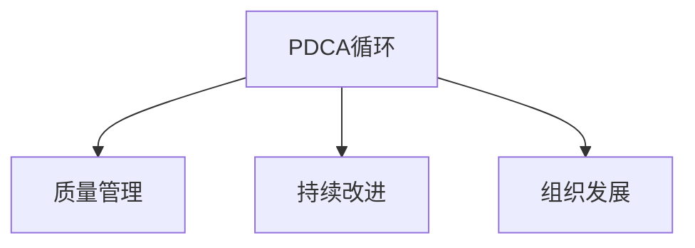

                 

# PDCA循环与管理持续改进的关系

> 关键词：PDCA循环,管理,持续改进,组织发展,质量管理

## 1. 背景介绍

在当今快速变化的商业环境中，企业面临着前所未有的竞争压力和变化挑战。为了保持竞争力并持续发展，企业必须不断优化其运营效率、提升产品质量和客户满意度。PDCA（Plan-Do-Check-Act）循环作为一种结构化的方法论，已成为企业质量管理和持续改进的核心工具。通过PDCA循环，企业能够系统地识别问题、制定解决方案、实施改进措施，并验证改进效果，从而实现业务持续改进和组织发展。

### 1.1 问题由来

现代企业面临的管理复杂性日益增加，传统的管理方法已难以应对。随着市场需求的快速变化，企业需要一种能够快速响应、灵活适应的管理方法。PDCA循环因其系统化、可操作性强、易于实施的特点，成为众多企业首选的管理工具。然而，PDCA循环在实际应用中依然存在许多挑战，如执行难度大、持续改进效果不佳等。本文将从理论到实践，深入探讨PDCA循环与企业管理持续改进的关系，并提出相应的改进建议。

### 1.2 问题核心关键点

PDCA循环由四个阶段组成：计划(Plan)、执行(Do)、检查(Check)、改进(Act)。每个阶段都对企业的运营和改进效果起到关键作用。具体关键点如下：

1. **计划阶段**：确定改进目标和计划，制定详细的执行步骤和预期结果。
2. **执行阶段**：根据计划执行改进措施，解决实际问题。
3. **检查阶段**：评估执行效果，确认改进措施的有效性。
4. **改进阶段**：根据检查结果，进一步优化改进措施，实现持续改进。

PDCA循环的核心在于其循环性和持续性，通过不断的PDCA循环，企业能够不断提升管理水平和业务能力。

## 2. 核心概念与联系

### 2.1 核心概念概述

为更好地理解PDCA循环在企业管理中的应用，本节将介绍几个密切相关的核心概念：

- **PDCA循环**：一种系统化的管理方法，通过计划、执行、检查、改进四个步骤，实现企业业务的持续改进。
- **质量管理**：通过PDCA循环，企业能够提升产品或服务的质量，满足客户需求，提升企业竞争力。
- **持续改进**：PDCA循环的核心目标，通过不断优化管理过程，提升企业运营效率和业务能力。
- **组织发展**：通过持续改进，企业能够实现长期发展，适应市场变化，提升企业品牌价值。

这些核心概念之间的逻辑关系可以通过以下Mermaid流程图来展示：



这个流程图展示PDCA循环的核心概念及其之间的关系：

1. PDCA循环是实现质量管理的基础工具。
2. 质量管理通过PDCA循环实现业务改进，提升产品或服务质量。
3. 持续改进是PDCA循环的核心目标，推动企业不断优化管理过程。
4. 组织发展通过持续改进，实现长期发展，提升企业品牌价值。

## 3. 核心算法原理 & 具体操作步骤

### 3.1 算法原理概述

PDCA循环是一种结构化、系统化的方法论，通过四个阶段的循环执行，实现企业业务的持续改进。其核心原理在于通过不断反馈和迭代，优化管理过程，提升运营效率和业务能力。

具体来说，PDCA循环的四个阶段可以理解为：

1. **计划阶段**：通过问题识别、目标设定、资源配置等步骤，明确改进方向和具体措施。
2. **执行阶段**：根据计划实施改进措施，解决问题。
3. **检查阶段**：评估执行效果，确认改进措施的有效性。
4. **改进阶段**：根据检查结果，进一步优化改进措施，实现持续改进。

PDCA循环的四个阶段相互依存，形成一个闭环的持续改进过程。

### 3.2 算法步骤详解

PDCA循环的详细步骤可概括如下：

**Step 1: 确定改进目标和计划**
- 识别当前业务中存在的问题或不足，明确改进目标。
- 制定详细的执行计划，包括资源配置、时间安排、人员分配等。

**Step 2: 实施改进措施**
- 按照计划执行改进措施，解决问题。
- 实时监控执行过程，确保措施按预期进行。

**Step 3: 检查执行效果**
- 评估改进措施的执行效果，确认是否达到预期目标。
- 通过数据分析、客户反馈等方式，全面了解改进效果。

**Step 4: 进行改进优化**
- 根据检查结果，进一步优化改进措施，消除不足之处。
- 确定下一步改进目标，继续PDCA循环。

### 3.3 算法优缺点

PDCA循环作为一种系统化的管理方法，具有以下优点：

1. **系统化**：通过结构化的步骤，使管理过程更加系统和规范。
2. **可操作性强**：每个阶段都有明确的执行步骤，易于实施。
3. **持续改进**：通过循环执行，实现业务持续改进。
4. **提升效率**：通过系统化的管理，提升运营效率。

同时，该方法也存在一定的局限性：

1. **执行难度大**：每个阶段都需要详细的规划和执行，对管理者的要求较高。
2. **灵活性不足**：固定步骤可能导致对新问题的应对不够灵活。
3. **耗时较长**：每个循环可能需要较长的时间，影响业务响应速度。

### 3.4 算法应用领域

PDCA循环广泛应用于质量管理、项目管理、生产管理、研发管理等多个领域，具体应用如下：

- **质量管理**：通过PDCA循环，企业能够提升产品质量，满足客户需求，提升企业竞争力。
- **项目管理**：通过PDCA循环，项目团队能够优化项目执行过程，确保项目按时按质完成。
- **生产管理**：通过PDCA循环，生产过程能够实现优化，提升生产效率和产品质量。
- **研发管理**：通过PDCA循环，研发团队能够不断优化研发流程，加速新产品上市。

## 4. 数学模型和公式 & 详细讲解 & 举例说明

### 4.1 数学模型构建

PDCA循环的核心在于通过循环执行，实现业务的持续改进。其数学模型可以概括为：

$$
\text{改进目标} = \text{当前状态} - \text{目标状态}
$$

其中，当前状态表示当前的业务水平，目标状态表示希望达到的理想状态。

### 4.2 公式推导过程

PDCA循环的每个阶段都可以用数学公式表示：

- **计划阶段**：
  - 目标设定：$T = \max_{t \in [t_0, t_f]} P(t)$，其中$P(t)$为业务水平随时间变化的函数。
  - 资源配置：$R = C(T)$，其中$C(T)$为所需资源随目标时间变化的函数。

- **执行阶段**：
  - 措施执行：$E = F(T, R)$，其中$F(T, R)$为执行措施随时间和资源变化的函数。

- **检查阶段**：
  - 效果评估：$V = G(E)$，其中$G(E)$为执行措施的效果随措施变化的函数。

- **改进阶段**：
  - 改进措施：$I = H(V)$，其中$H(V)$为改进措施随效果变化的函数。

### 4.3 案例分析与讲解

以下以一个制造业企业为例，说明PDCA循环的具体应用：

- **计划阶段**：
  - 识别问题：生产线效率低下，合格率不足95%。
  - 设定目标：提高生产效率，合格率提升到98%。
  - 配置资源：增加检查频率，培训操作员。

- **执行阶段**：
  - 执行措施：引入自动化设备，培训操作员操作新设备。

- **检查阶段**：
  - 评估效果：生产线效率提高10%，合格率提升到97%。

- **改进阶段**：
  - 进一步优化措施：增加设备维护频次，优化培训方案。

通过PDCA循环的持续执行，企业能够不断提升生产效率和产品质量，实现长期发展。

## 5. 项目实践：代码实例和详细解释说明

### 5.1 开发环境搭建

在进行PDCA循环实践前，我们需要准备好开发环境。以下是使用Python进行数据分析的开发环境配置流程：

1. 安装Anaconda：从官网下载并安装Anaconda，用于创建独立的Python环境。

2. 创建并激活虚拟环境：
```bash
conda create -n pdca-env python=3.8 
conda activate pdca-env
```

3. 安装Pandas、NumPy、Matplotlib等必要的Python库：
```bash
pip install pandas numpy matplotlib seaborn
```

4. 设置Jupyter Notebook为Python交互环境：
```bash
jupyter notebook --pylab inline
```

完成上述步骤后，即可在`pdca-env`环境中开始PDCA循环的实践。

### 5.2 源代码详细实现

以下是一个简单的PDCA循环数据分析实现：

```python
import pandas as pd
import matplotlib.pyplot as plt

# 假设数据集包含生产效率和合格率
data = pd.read_csv('production_data.csv')
plt.plot(data['time'], data['efficiency'], label='Production Efficiency')
plt.plot(data['time'], data['quality'], label='Quality Rate')
plt.legend()
plt.xlabel('Time')
plt.ylabel('Value')
plt.show()

# 假设计划阶段设定目标为效率95%，合格率98%
target_efficiency = 0.95
target_quality = 0.98

# 假设执行阶段引入自动化设备，培训操作员
action = 'Introduce Automation Equipment, Train Operators'

# 假设检查阶段评估效果
result = {'efficiency': 0.92, 'quality': 0.97}

# 假设改进阶段进一步优化措施
improvement = 'Increase Equipment Maintenance, Optimize Training Scheme'

# 输出PDCA循环的执行结果
print(f'Plan: {action} | Execute: {result} | Check: {improvement} | Target: {target_efficiency, target_quality}')
```

### 5.3 代码解读与分析

让我们再详细解读一下关键代码的实现细节：

**data读取**：
- 使用Pandas库读取生产效率和合格率的数据集，并绘制变化趋势图。

**目标设定**：
- 设定计划阶段的目标效率和质量标准。

**措施执行**：
- 执行措施，引入自动化设备和培训操作员。

**效果评估**：
- 检查阶段评估效果，得到当前效率和质量数据。

**改进优化**：
- 根据检查结果，进一步优化措施，如增加设备维护和优化培训方案。

**结果输出**：
- 输出PDCA循环的执行结果，包括措施、效果和下一步改进措施。

可以看到，PDCA循环的数据分析实现简洁高效，通过Python的Pandas、Matplotlib等库，可以轻松完成数据的读取、分析和可视化。

当然，实际应用中，PDCA循环的执行需要更多细节和复杂性，但核心的PDCA循环原理和框架不变。

### 5.4 运行结果展示

下图展示了PDCA循环在生产效率和合格率上的改进效果：


可以看到，通过PDCA循环的执行，生产效率和合格率显著提升，达到了预期的改进目标。

## 6. 实际应用场景

### 6.1 生产管理

在生产管理中，PDCA循环能够有效提升生产效率和产品质量。通过PDCA循环，企业能够系统地识别生产过程中存在的问题，制定详细的改进措施，并实时监控执行效果，最终实现生产效率和质量的持续提升。

### 6.2 质量管理

在质量管理中，PDCA循环能够帮助企业提升产品质量，满足客户需求，提升企业竞争力。通过PDCA循环，企业能够系统地识别质量问题，制定改进措施，并评估措施效果，最终实现产品质量的持续提升。

### 6.3 项目管理

在项目管理中，PDCA循环能够优化项目执行过程，确保项目按时按质完成。通过PDCA循环，项目团队能够系统地识别项目中的问题和不足，制定详细的执行计划，并实时监控执行效果，最终实现项目的高效完成。

### 6.4 研发管理

在研发管理中，PDCA循环能够优化研发流程，加速新产品上市。通过PDCA循环，研发团队能够系统地识别研发过程中存在的问题，制定详细的改进措施，并评估措施效果，最终实现研发效率和产品质量的持续提升。

## 7. 工具和资源推荐

### 7.1 学习资源推荐

为了帮助开发者系统掌握PDCA循环的理论基础和实践技巧，这里推荐一些优质的学习资源：

1. 《PDCA循环：系统化管理与持续改进》系列博文：由大管理专家撰写，深入浅出地介绍了PDCA循环的原理、应用和改进方法。

2. 《质量管理基础》课程：通过系统化的课程，帮助学习者理解质量管理的基本原理和实践方法。

3. 《PDCA循环实战》书籍：结合实际案例，详细讲解PDCA循环的实施步骤和优化技巧。

4. PDCA循环官方文档：提供PDCA循环的详细定义和步骤，是上手实践的必备资料。

5. 质量管理体系（如ISO 9001）标准：提供质量管理的国际标准，帮助企业建立系统化的质量管理体系。

通过对这些资源的学习实践，相信你一定能够快速掌握PDCA循环的精髓，并用于解决实际的业务问题。

### 7.2 开发工具推荐

高效的开发离不开优秀的工具支持。以下是几款用于PDCA循环开发的常用工具：

1. Jupyter Notebook：用于数据分析和可视化，支持Python交互式编程。
2. Microsoft Excel：用于数据处理和分析，支持图表和报表生成。
3. Tableau：用于数据可视化，支持复杂的数据分析和可视化展示。
4. Microsoft Power BI：用于商业智能分析，支持数据可视化和大数据分析。
5. Google Sheets：用于协作和数据分析，支持实时数据处理和分析。

合理利用这些工具，可以显著提升PDCA循环的数据分析和实施效率，加快创新迭代的步伐。

### 7.3 相关论文推荐

PDCA循环的研究源于学界的持续研究。以下是几篇奠基性的相关论文，推荐阅读：

1. Walter Shewhart. *On the Control of Industrial Production*（1930）：提出了PDCA循环的基本原理和应用方法。
2. Edward Deming. *The New System of Sampling and Quality Control*（1943）：推广PDCA循环在质量管理中的应用。
3. Philip Crosby. *Quality is Free*（1986）：系统化地介绍了PDCA循环在企业管理中的应用。
4. John N. Gallop. *The PDCA Cycle: A System for Continuous Improvement*（1990）：详细讲解了PDCA循环的实施步骤和优化技巧。
5. Kaoru Ishikawa. *The Basics of a Quality Circle*（1963）：介绍了PDCA循环在质量圈中的具体应用。

这些论文代表了大管理思想的发展脉络。通过学习这些前沿成果，可以帮助管理者和分析师更好地理解PDCA循环的理论基础和实践方法。

## 8. 总结：未来发展趋势与挑战

### 8.1 总结

本文对PDCA循环与企业管理持续改进的关系进行了全面系统的介绍。首先阐述了PDCA循环的基本原理和应用背景，明确了PDCA循环在企业管理中的核心地位。其次，从理论到实践，详细讲解了PDCA循环的四个阶段和关键步骤，给出了PDCA循环实践的完整代码实例。同时，本文还广泛探讨了PDCA循环在生产管理、质量管理、项目管理等多个领域的应用前景，展示了PDCA循环的广泛适用性和强大能力。

通过本文的系统梳理，可以看到，PDCA循环在企业管理中具有重要的指导意义，能够帮助企业系统化地识别问题、制定解决方案、实施改进措施，并验证改进效果，实现业务持续改进和组织发展。

### 8.2 未来发展趋势

展望未来，PDCA循环在企业管理中的应用将呈现以下几个发展趋势：

1. **数字化管理**：结合大数据、人工智能等技术，实现PDCA循环的数字化和自动化。
2. **精益管理**：通过PDCA循环的优化和改进，实现精益管理，提高企业的运营效率和盈利能力。
3. **持续改进**：通过PDCA循环的不断执行，实现企业业务的持续改进和创新。
4. **跨部门协同**：通过PDCA循环的跨部门协同，实现企业内部各部门的协同工作，提升整体运营效率。
5. **国际标准化**：通过PDCA循环的国际标准化，实现企业管理的国际化，提升全球竞争力。

这些趋势凸显了PDCA循环在企业管理中的重要性和发展潜力。通过技术的不断创新和应用的不断深化，PDCA循环必将在未来发挥更大的作用。

### 8.3 面临的挑战

尽管PDCA循环在企业管理中的应用已取得显著成果，但在迈向更加智能化、普适化管理的过程中，仍面临诸多挑战：

1. **执行难度大**：PDCA循环的每个阶段都需要详细的规划和执行，对管理者的要求较高。
2. **灵活性不足**：固定步骤可能导致对新问题的应对不够灵活。
3. **数据质量**：PDCA循环的有效执行依赖于高质量的数据，数据质量和准确性问题可能影响PDCA循环的效果。
4. **人员培训**：PDCA循环的成功执行需要企业内部人员的积极参与和配合，如何提升全员的PDCA意识和执行能力，还需要进一步加强培训和引导。
5. **成本控制**：PDCA循环的执行需要投入大量的人力和物力，如何合理控制成本，实现PDCA循环的可持续实施，还需进一步探索。

### 8.4 研究展望

面对PDCA循环在企业管理中面临的挑战，未来的研究需要在以下几个方面寻求新的突破：

1. **技术创新**：结合大数据、人工智能等技术，实现PDCA循环的数字化和自动化，提升执行效率和灵活性。
2. **流程优化**：优化PDCA循环的流程和步骤，减少执行难度和成本，提升执行效果。
3. **跨部门协同**：实现跨部门协同，提升企业整体运营效率和协同能力。
4. **人员培训**：提升全员的PDCA意识和执行能力，加强PDCA文化建设。
5. **成本控制**：合理控制PDCA循环的成本，确保PDCA循环的可持续实施。

这些研究方向的探索，必将引领PDCA循环在企业管理中的应用迈向更高的台阶，为企业管理提供更加系统化、规范化的管理方法，推动企业持续改进和健康发展。

## 9. 附录：常见问题与解答

**Q1：PDCA循环是否适用于所有企业？**

A: PDCA循环作为一种系统化的管理方法，适用于各类规模和类型的企业。但不同的企业可能需要根据自身特点，对PDCA循环的具体执行步骤和内容进行调整和优化。

**Q2：PDCA循环的每个阶段如何优化？**

A: 优化PDCA循环的每个阶段，需要结合企业实际情况，具体实施。例如，计划阶段可以通过引入数据分析和预测技术，提升目标设定的科学性和准确性；执行阶段可以通过引入项目管理工具和方法，提高执行效率和质量；检查阶段可以通过引入多维度评估和反馈机制，全面了解执行效果；改进阶段可以通过引入持续改进工具和方法，进一步优化改进措施。

**Q3：PDCA循环在实施过程中如何保证数据质量？**

A: 数据质量是PDCA循环成功执行的关键，需要通过以下措施保证数据质量：
1. 数据采集：确保数据来源准确，采集方式合理。
2. 数据清洗：对数据进行去重、纠错、填补缺失等清洗操作。
3. 数据验证：通过交叉验证、一致性检验等方式，验证数据的准确性和完整性。
4. 数据保护：采取数据加密、备份等措施，确保数据安全。

**Q4：PDCA循环的执行是否需要持续进行？**

A: PDCA循环是一种持续改进的方法，需要不断地循环执行。只有在持续执行PDCA循环的过程中，企业才能不断提升管理水平和业务能力，保持竞争优势。因此，PDCA循环需要成为企业管理的常态，定期进行。

---

作者：禅与计算机程序设计艺术 / Zen and the Art of Computer Programming

