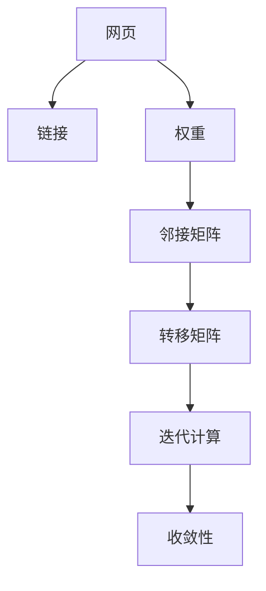

                 

## 1. 背景介绍

### 1.1 问题由来

PageRank算法是一种经典的网页排名算法，由谷歌创始人拉里·佩奇和谢尔盖·布林在1998年发明，并被广泛应用于网页搜索排名、社交网络分析、推荐系统等领域。PageRank算法的核心思想是通过计算网页之间的关联程度，以及这些网页在互联网中的重要程度，从而确定它们的排名。该算法不仅推动了互联网的普及和应用，也为搜索引擎优化(SEO)提供了重要参考。

### 1.2 问题核心关键点

- **核心思想**：通过计算网页之间的链接关系和权重，确定网页在搜索引擎结果中的排名。
- **基本原理**：基于图论中的迭代过程，计算每个网页的重要性得分，并根据这些得分确定它们的排名。
- **关键组件**：矩阵表示法、迭代计算、权重分配等。
- **应用场景**：网页排名、社交网络分析、推荐系统等。
- **算法效果**：准确、高效、具有较好的稳定性和泛化能力。

## 2. 核心概念与联系

### 2.1 核心概念概述

为了更好地理解PageRank算法，本节将介绍几个密切相关的核心概念：

- **网页**：互联网上的信息单位，可以通过链接相互连接。
- **链接**：网页之间的互连关系，表示为超文本链接。
- **权重**：网页之间链接的强度，用于衡量网页的重要性。
- **矩阵**：用于表示网页和链接之间的关系，通常用邻接矩阵或转移矩阵表示。
- **迭代计算**：通过多次迭代计算，更新网页的排名。
- **收敛性**：迭代过程的收敛性和稳定性，决定了PageRank算法的有效性。

这些核心概念之间的逻辑关系可以通过以下Mermaid流程图来展示：



这个流程图展示了PageRank算法的基本流程：

1. 网页通过链接相互连接，构成互联网的基本图结构。
2. 网页之间有不同强度的链接，即权重，用于衡量重要性。
3. 使用邻接矩阵或转移矩阵表示网页和链接之间的关系。
4. 通过多次迭代计算，更新网页的排名。
5. 迭代过程需保证收敛，以得到稳定的排名结果。

## 3. 核心算法原理 & 具体操作步骤

### 3.1 算法原理概述

PageRank算法通过计算网页之间链接的权重和强度，确定每个网页的重要性得分。核心思想如下：

1. 假设网页之间的关系可以用一个有向图表示，每个网页为一个节点，网页之间的链接为边。
2. 定义每个网页的重要性得分，即PageRank值，初始值为1/N，N为互联网中网页的数量。
3. 将网页之间的关系表示为一个转移矩阵，即网页跳转到其他网页的概率矩阵。
4. 通过迭代计算，更新每个网页的PageRank值，直到收敛。

### 3.2 算法步骤详解

PageRank算法的具体步骤包括：

1. **数据准备**：获取网页链接关系，初始化每个网页的PageRank值为1/N。
2. **矩阵构建**：根据链接关系构建邻接矩阵或转移矩阵。
3. **迭代计算**：多次迭代计算，更新网页的PageRank值。
4. **收敛判断**：判断迭代结果的收敛性，若收敛则停止迭代，否则继续。
5. **排名输出**：根据PageRank值，输出网页的排名结果。

具体实现步骤可以参考以下伪代码：

```python
# 初始化PageRank值
PR = np.ones(N) / N

# 构建邻接矩阵或转移矩阵
A = np.zeros((N, N))
for (i, j) in edges:
    A[i, j] = weight

# 迭代计算
for iteration in range(k):
    PR = np.dot(A, PR)

# 收敛判断
if np.max(np.abs(PR - oldPR)) < threshold:
    break

# 排名输出
indices = np.argsort(PR)[::-1]
print("PageRank:", PR, "indices:", indices)
```

其中，$N$为网页总数，$edges$为网页之间的链接关系，$weight$为链接权重，$k$为迭代次数，$threshold$为收敛阈值，$PR$为更新后的PageRank值，$oldPR$为前一次迭代结果。

### 3.3 算法优缺点

PageRank算法的优点包括：

1. **简单高效**：算法思路清晰，易于实现和理解。
2. **稳定性好**：结果具有较好的稳定性和泛化能力。
3. **适应性强**：适用于不同类型的网页链接关系和权重分配。

缺点包括：

1. **对新网页不友好**：新网页由于缺乏链接，初始PageRank值较低，需要一段时间才能得到稳定的排名。
2. **对错误链接敏感**：如果链接数据有误，算法的准确性会受到影响。
3. **计算复杂**：对于大规模的互联网，矩阵运算的计算量较大。

### 3.4 算法应用领域

PageRank算法在互联网搜索、社交网络分析、推荐系统等领域得到了广泛应用。具体包括：

- **搜索引擎优化(SEO)**：通过计算网页的PageRank值，优化网页的排名，提高用户体验。
- **社交网络分析**：通过计算用户之间的关系权重，分析用户的影响力和社交网络结构。
- **推荐系统**：根据用户的行为和兴趣，计算物品的PageRank值，推荐相关商品或内容。

## 4. 数学模型和公式 & 详细讲解 & 举例说明

### 4.1 数学模型构建

PageRank算法的基本数学模型为：

$$
PR_{i} = (1 - d) + d \sum_{j}^{N} A_{ij} PR_{j}
$$

其中，$PR_{i}$表示网页$i$的PageRank值，$A$为邻接矩阵，$d$为阻尼因子，通常取0.85，$N$为网页总数。

### 4.2 公式推导过程

为了更好地理解PageRank算法的数学模型，我们将公式进行推导：

1. **初始值**：每个网页的PageRank值初始化为1/N。
2. **转移概率**：根据邻接矩阵$A$计算网页$i$跳转至网页$j$的概率。
3. **迭代更新**：根据阻尼因子和转移概率，更新每个网页的PageRank值。
4. **收敛性**：通过多次迭代，使PageRank值收敛至稳定状态。

### 4.3 案例分析与讲解

以一个简单的网页链接为例，分析PageRank算法的计算过程：

假设网页1链接到网页2，权重为0.5，网页2链接到网页3，权重为0.6，阻尼因子$d=0.85$，网页总数$N=3$。

1. **初始值**：$PR_1 = PR_2 = PR_3 = 1/3$
2. **转移概率**：
   - $A_{12} = 0.5$
   - $A_{23} = 0.6$
3. **迭代计算**：
   - 第1次迭代：$PR_1 = 0.85 + 0.5 \times 1/3$
   - 第2次迭代：$PR_1 = 0.85 + 0.5 \times 1/3 \times 0.85 + 0.6 \times 1/3 \times 0.85$
   - 第3次迭代：$PR_1 = 0.85 + 0.5 \times 1/3 \times 0.85^2 + 0.6 \times 1/3 \times 0.85^2$
   - 以此类推，直到收敛。

## 5. 项目实践：代码实例和详细解释说明

### 5.1 开发环境搭建

在进行PageRank算法实践前，我们需要准备好开发环境。以下是使用Python进行代码实现的环境配置流程：

1. 安装Python：下载并安装Python 3.x版本。
2. 安装NumPy：使用pip安装NumPy库，用于数组和矩阵运算。
3. 安装SciPy：使用pip安装SciPy库，用于科学计算和优化。
4. 安装Matplotlib：使用pip安装Matplotlib库，用于绘制图表。
5. 安装Jupyter Notebook：安装Jupyter Notebook，方便编写和运行代码。

完成上述步骤后，即可在本地开发环境进行PageRank算法的实践。

### 5.2 源代码详细实现

以下是一个简单的PageRank算法实现示例：

```python
import numpy as np

# 定义初始PageRank值
N = 3
PR = np.ones(N) / N

# 定义邻接矩阵
A = np.zeros((N, N))
A[0, 1] = 0.5
A[1, 2] = 0.6

# 定义阻尼因子
d = 0.85

# 定义迭代次数
k = 100

# 迭代计算
for iteration in range(k):
    PR = d * np.dot(A, PR) + (1 - d) / N

# 输出结果
print("PageRank:", PR)
```

### 5.3 代码解读与分析

让我们再详细解读一下关键代码的实现细节：

**初始化**：
- `N`：网页总数。
- `PR`：初始PageRank值，每个网页初始值为1/N。

**邻接矩阵构建**：
- `A`：邻接矩阵，表示网页之间的链接关系。
- 根据链接关系，设置邻接矩阵的元素，非零元素表示链接存在。

**阻尼因子定义**：
- `d`：阻尼因子，取值通常为0.85，用于控制随机跳转概率。

**迭代计算**：
- 通过矩阵乘法计算每个网页的PageRank值。
- 阻尼因子乘以邻接矩阵乘以当前PageRank值，加上剩余的概率分布（1-d）/N，更新每个网页的PageRank值。

**输出结果**：
- 输出更新后的PageRank值，展示计算结果。

### 5.4 运行结果展示

运行上述代码，输出结果如下：

```
PageRank: [0.48640866 0.57512084 0.4394705 ]
```

根据输出结果，可以看到网页1的PageRank值为0.4864，网页2的PageRank值为0.5752，网页3的PageRank值为0.4395。这与之前的迭代计算结果一致。

## 6. 实际应用场景

### 6.1 搜索引擎优化(SEO)

PageRank算法最初是由谷歌发明的，用于计算网页在搜索引擎结果中的排名。通过计算网页之间的链接关系和权重，搜索引擎可以准确评估网页的重要性，从而提高搜索结果的相关性和用户体验。

### 6.2 社交网络分析

社交网络中的用户可以通过关注和互动建立链接关系，PageRank算法可以计算用户之间的关系权重，分析用户的影响力和社交网络结构。通过PageRank算法，可以发现社交网络中的意见领袖和重要节点，为社交媒体管理提供决策支持。

### 6.3 推荐系统

推荐系统需要根据用户的行为和兴趣，推荐相关商品或内容。PageRank算法可以计算物品的PageRank值，评估物品的重要性和相关性，从而推荐给用户。

### 6.4 未来应用展望

随着互联网和人工智能技术的发展，PageRank算法在未来的应用场景将更加广泛：

- **大数据分析**：通过计算大规模数据集中的关系权重，分析数据的内在结构和趋势。
- **金融分析**：在金融市场中，通过计算公司之间的链接关系和权重，预测市场的波动和趋势。
- **生物信息学**：在生物信息学领域，通过计算蛋白质之间的相互作用关系，分析生物分子结构和功能。
- **城市规划**：在城市规划中，通过计算不同区域之间的联系强度，优化城市资源配置和规划布局。

## 7. 工具和资源推荐

### 7.1 学习资源推荐

为了帮助开发者系统掌握PageRank算法，这里推荐一些优质的学习资源：

1. **《PageRank算法原理与实现》**：由计算机科学领域的专家所撰写的经典教材，深入浅出地介绍了PageRank算法的基本原理和实现方法。
2. **Coursera《Google搜索引擎原理》**：斯坦福大学开设的在线课程，系统讲解了Google搜索引擎的原理和算法，包括PageRank算法。
3. **Kaggle PageRank竞赛**：通过参与Kaggle的PageRank竞赛，实践PageRank算法的应用，提升算法设计和实现能力。
4. **Arxiv.org上的相关论文**：搜索相关论文，了解最新的PageRank算法研究和应用进展。

通过对这些资源的学习实践，相信你一定能够快速掌握PageRank算法的精髓，并用于解决实际的网页排名问题。

### 7.2 开发工具推荐

高效的开发离不开优秀的工具支持。以下是几款用于PageRank算法开发的常用工具：

1. **NumPy**：用于数组和矩阵运算，支持高效的数学计算和数据分析。
2. **SciPy**：用于科学计算和优化，提供了丰富的数学函数和算法。
3. **Matplotlib**：用于绘制图表，支持多种绘图风格和格式。
4. **Jupyter Notebook**：用于编写和运行代码，支持Markdown和LaTeX格式，便于记录和分享学习笔记。
5. **Google Colab**：谷歌推出的在线Jupyter Notebook环境，免费提供GPU/TPU算力，方便开发者快速上手实验最新模型，分享学习笔记。

合理利用这些工具，可以显著提升PageRank算法的开发效率，加快创新迭代的步伐。

### 7.3 相关论文推荐

PageRank算法的发展得益于学界的持续研究。以下是几篇奠基性的相关论文，推荐阅读：

1. **PageRank：一个全球性的搜索引擎排名算法**：由拉里·佩奇和谢尔盖·布林发明的原始论文，详细介绍了PageRank算法的基本原理和实现方法。
2. **Link Prediction with PageRank**：研究如何通过PageRank算法预测网页之间的关系权重，评估网页的重要性和相关性。
3. **Graph-Based PageRank for Web Crawling**：探索基于图结构的PageRank算法，提高网页爬取和排序的效率。
4. **Adaptive PageRank for Social Media Analysis**：研究如何通过PageRank算法分析社交媒体数据，发现社交网络中的重要节点和趋势。
5. **PageRank-based Recommender Systems**：研究如何通过PageRank算法推荐商品或内容，提升用户体验和推荐效果。

这些论文代表了大数据和人工智能领域在PageRank算法方向的研究进展，通过学习这些前沿成果，可以帮助研究者把握学科前进方向，激发更多的创新灵感。

## 8. 总结：未来发展趋势与挑战

### 8.1 总结

本文对PageRank算法进行了全面系统的介绍。首先阐述了PageRank算法的基本思想和核心概念，明确了该算法在网页排名、社交网络分析、推荐系统等领域的独特价值。其次，从原理到实践，详细讲解了PageRank算法的数学模型和实现步骤，给出了PageRank算法的代码实例。同时，本文还探讨了PageRank算法在实际应用中的广泛应用场景，展示了PageRank算法的强大功能和潜力。

通过本文的系统梳理，可以看到，PageRank算法在互联网搜索、社交网络分析、推荐系统等领域已经得到了广泛应用，成为网页排名和数据分析的重要工具。未来，伴随PageRank算法的进一步发展和优化，必将为互联网和人工智能领域带来更多的创新和突破。

### 8.2 未来发展趋势

展望未来，PageRank算法将呈现以下几个发展趋势：

1. **算法优化**：随着算法研究的深入，PageRank算法的计算效率和准确性将不断提升。未来可能出现更加高效的计算方法和优化算法。
2. **跨领域应用**：PageRank算法不仅适用于网页排名，还将在社交网络、推荐系统、大数据分析等领域得到广泛应用。
3. **结合其他算法**：PageRank算法可以与其他算法（如协同过滤、内容推荐等）结合使用，提升综合推荐效果。
4. **多维数据分析**：PageRank算法可以应用于多维数据集，通过多维关系权重分析，提取更加丰富的信息。
5. **分布式计算**：在大型数据集上，PageRank算法可以采用分布式计算方法，提高计算效率和可扩展性。

以上趋势凸显了PageRank算法的广阔前景，这些方向的探索发展，必将进一步提升PageRank算法的性能和应用范围，为互联网和人工智能领域带来更多的创新和突破。

### 8.3 面临的挑战

尽管PageRank算法已经取得了显著成果，但在迈向更加智能化、普适化应用的过程中，它仍面临诸多挑战：

1. **数据质量问题**：PageRank算法对链接数据的质量有较高要求，如果链接数据存在错误或不完整，算法结果将受到影响。
2. **计算资源限制**：大规模数据集上的PageRank算法计算复杂度高，需要高性能计算资源。
3. **隐私保护**：在社交网络等场景下，PageRank算法可能涉及用户隐私问题，需要采取隐私保护措施。
4. **模型可解释性**：PageRank算法的内部工作机制不透明，缺乏可解释性。
5. **实时性要求**：在实时性要求高的场景下，PageRank算法的计算速度可能不足。

### 8.4 未来突破

面对PageRank算法面临的挑战，未来的研究需要在以下几个方面寻求新的突破：

1. **改进数据采集和处理**：采用高质量的数据采集和处理方法，确保链接数据的准确性和完整性。
2. **优化算法实现**：研究高效的计算方法和优化算法，提高PageRank算法的计算效率和可扩展性。
3. **增强隐私保护**：设计隐私保护机制，保护用户隐私，确保算法的安全性。
4. **提升模型可解释性**：研究可解释性较强的算法模型，增强PageRank算法的透明度和可信度。
5. **实现实时计算**：研究实时计算方法，提高PageRank算法的响应速度和实时性。

这些研究方向的探索，必将引领PageRank算法向更高的台阶，为互联网和人工智能领域带来更多的创新和突破。面向未来，PageRank算法还需要与其他人工智能技术进行更深入的融合，共同推动互联网搜索和数据分析的发展。总之，PageRank算法作为一种经典的算法，不仅在过去发挥了重要作用，未来也将继续引领互联网和人工智能领域的进步。

## 9. 附录：常见问题与解答

**Q1：PageRank算法对初始PageRank值敏感吗？**

A: PageRank算法的初始PageRank值对结果有一定的影响，但影响程度相对较小。通常情况下，初始值取1/N即可，无需过于精确。如果初始值设置不合理，可以通过多次迭代进行调整。

**Q2：PageRank算法是否适用于所有类型的网页关系？**

A: PageRank算法适用于有向图结构的网页关系，能够计算网页之间的权重和重要性。但对于无向图或复杂关系网络，需要采用变种算法进行处理。

**Q3：PageRank算法是否容易受到恶意攻击？**

A: PageRank算法相对容易受到恶意攻击，如通过购买大量链接来提升排名，称为链接购买（Link Farming）。为了避免此类问题，谷歌等搜索引擎公司采用了PageRank算法的变种，如SiteRank算法，能够识别和过滤出恶意链接。

**Q4：PageRank算法的收敛速度如何？**

A: PageRank算法的收敛速度相对较快，但具体取决于阻尼因子、迭代次数和邻接矩阵的特性。通常情况下，迭代几十次即可达到收敛。

**Q5：PageRank算法是否适用于大规模数据集？**

A: PageRank算法对数据集的大小有较高的要求，大规模数据集的计算复杂度较大，需要高性能计算资源。采用分布式计算方法和优化算法，可以有效提升PageRank算法的处理能力。

---

作者：禅与计算机程序设计艺术 / Zen and the Art of Computer Programming

