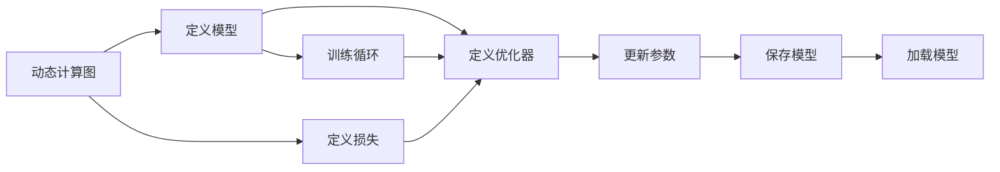

                 

## 1. 背景介绍

### 1.1 问题由来

随着深度学习技术的飞速发展，各种复杂而高效的深度学习框架如PyTorch、TensorFlow等应运而生。这些框架在处理各种深度学习任务时表现出色，已成为深度学习研究与应用的标配工具。其中，PyTorch尤为受到重视，凭借其动态计算图、易用性、模块化设计等优点，在学术界和工业界都占据了重要地位。

然而，尽管PyTorch功能强大，但初学者往往在理解其原理与实现细节时感到困难重重。为了帮助读者更好地掌握PyTorch的核心思想和技术细节，本文将从原理与实践两个层面深入讲解PyTorch的精髓。

### 1.2 问题核心关键点

本文的核心关键点在于深入讲解PyTorch的原理和实现细节，并结合实战案例，详细展示如何在实际项目中高效使用PyTorch进行模型训练与优化。具体包括以下内容：

- PyTorch的动态计算图机制
- PyTorch的张量(Tensor)操作
- PyTorch的模型定义与训练流程
- PyTorch的优化器与损失函数
- PyTorch的模型保存与加载机制
- PyTorch在图像分类、目标检测等实际项目中的应用实例

这些关键点的深入讲解将帮助读者全面理解PyTorch的核心技术与实际应用。

## 2. 核心概念与联系

### 2.1 核心概念概述

要深入理解PyTorch，首先需要明确其核心概念与架构。以下是几个关键概念的简要介绍：

- **动态计算图**：与静态计算图(如TensorFlow)不同，PyTorch使用动态计算图，允许开发者在运行时动态构建计算图，便于调试和优化。
- **张量(Tensor)**：PyTorch中的基本数据结构，等价于NumPy的ndarray，支持向量、矩阵、张量等形式，是进行计算和训练的核心数据类型。
- **模型定义与训练循环**：开发者需要定义模型结构，并设置训练循环，通过反向传播计算梯度，更新模型参数。
- **优化器与损失函数**：优化器用于计算梯度并更新模型参数，损失函数用于衡量模型预测与真实标签之间的差异。
- **模型保存与加载**：通过保存模型状态和参数，开发者可以在不同设备或版本间方便地迁移模型。

这些概念构成了PyTorch的核心框架，开发者需逐一掌握。

### 2.2 核心概念原理和架构的 Mermaid 流程图



这个流程图展示了PyTorch从定义模型、设置损失与优化器，到执行训练循环、更新参数和保存/加载模型的整体流程。

## 3. 核心算法原理 & 具体操作步骤

### 3.1 算法原理概述

PyTorch的动态计算图机制是其核心特色。通过动态构建计算图，PyTorch实现了高效的反向传播和梯度计算，使得模型训练过程变得灵活且易于调试。

#### 3.2 算法步骤详解

##### 3.2.1 环境搭建

首先，我们需要搭建PyTorch的开发环境。具体步骤如下：

1. 安装Anaconda：从官网下载并安装Anaconda，用于创建独立的Python环境。
2. 创建并激活虚拟环境：
```bash
conda create -n pytorch-env python=3.8 
conda activate pytorch-env
```

3. 安装PyTorch：根据CUDA版本，从官网获取对应的安装命令。例如：
```bash
conda install pytorch torchvision torchaudio cudatoolkit=11.1 -c pytorch -c conda-forge
```

4. 安装Tensorboard：用于可视化训练过程和结果。
```bash
conda install tensorboard
```

5. 安装PyTorch Lightning：简化训练流程，方便分布式训练。
```bash
pip install pytorch-lightning
```

##### 3.2.2 数据准备

在进行深度学习任务时，数据准备是第一步。以下是一个简单的数据准备流程示例：

1. 准备数据集：收集训练集和验证集，可以使用PyTorch提供的`torch.utils.data.Dataset`和`torch.utils.data.DataLoader`进行数据加载。

2. 数据增强：通过旋转、平移、裁剪等操作，增加数据集的多样性，防止模型过拟合。

3. 划分数据集：将数据集划分为训练集、验证集和测试集，一般采用80:10:10的比例。

##### 3.2.3 模型定义

在PyTorch中，模型定义通常使用类来实现。具体步骤如下：

1. 定义模型类，继承`nn.Module`。

2. 在`__init__`方法中定义模型参数，如卷积核大小、通道数等。

3. 在`forward`方法中实现模型的前向传播过程，即将输入数据传递到模型中，计算输出结果。

##### 3.2.4 训练循环

训练循环通常包含以下几个步骤：

1. 初始化模型和优化器。

2. 定义损失函数。

3. 迭代训练集，前向传播、计算损失、反向传播、更新参数。

4. 周期性在验证集上评估模型性能。

5. 保存最佳模型。

#### 3.3 算法优缺点

##### 3.3.1 优点

- 动态计算图机制使得模型训练过程更加灵活，便于调试和优化。
- 张量操作高效，支持CPU和GPU并行计算。
- 丰富的模块化设计，方便开发者快速实现各种深度学习模型。
- 易于与Tensorboard集成，可视化训练过程和结果。
- 支持分布式训练，方便大规模模型训练。

##### 3.3.2 缺点

- 动态计算图可能导致运行时性能下降，特别是在大量数据并行处理时。
- 张量操作对内存和显存占用较大，需要合理设计模型结构和批处理大小。
- 模型保存和加载过程较为繁琐，需要额外维护状态字典。

#### 3.4 算法应用领域

PyTorch在图像分类、目标检测、自然语言处理、语音识别等众多领域都得到了广泛应用。

- 图像分类：如ResNet、Inception等经典网络结构在图像分类任务上表现出色。
- 目标检测：如Faster R-CNN、YOLO等目标检测算法，已经在实际应用中取得了优异效果。
- 自然语言处理：如Transformer模型在语言模型、机器翻译、文本生成等任务上表现优异。
- 语音识别：如CTC模型在语音识别任务上取得了显著提升。

## 4. 数学模型和公式 & 详细讲解 & 举例说明

### 4.1 数学模型构建

在PyTorch中，模型的数学模型通常通过定义损失函数和优化器来实现。以下是一个简单的分类模型的数学模型构建过程：

1. 定义输入和输出：
```python
import torch
from torch import nn
from torch import Tensor

# 定义输入和输出
x = Tensor([[0.1, 0.2, 0.3], [0.4, 0.5, 0.6]])
y = Tensor([1, 0])
```

2. 定义模型：
```python
# 定义一个简单的线性模型
class LinearModel(nn.Module):
    def __init__(self):
        super(LinearModel, self).__init__()
        self.linear = nn.Linear(3, 2)

    def forward(self, x):
        x = self.linear(x)
        return x

model = LinearModel()
```

3. 定义损失函数和优化器：
```python
# 定义交叉熵损失函数
criterion = nn.CrossEntropyLoss()

# 定义优化器，如Adam
optimizer = torch.optim.Adam(model.parameters(), lr=0.01)
```

### 4.2 公式推导过程

以交叉熵损失函数为例，其推导过程如下：

假设模型预测输出为 $\hat{y}$，真实标签为 $y$，则交叉熵损失函数定义为：
$$
\mathcal{L}(y, \hat{y}) = -\frac{1}{N} \sum_{i=1}^N y_i \log \hat{y}_i
$$

在PyTorch中，可以这样定义：
```python
# 定义交叉熵损失函数
criterion = nn.CrossEntropyLoss()

# 定义输入和输出
x = Tensor([[0.1, 0.2, 0.3], [0.4, 0.5, 0.6]])
y = Tensor([1, 0])

# 定义模型
class LinearModel(nn.Module):
    def __init__(self):
        super(LinearModel, self).__init__()
        self.linear = nn.Linear(3, 2)

    def forward(self, x):
        x = self.linear(x)
        return x

model = LinearModel()

# 定义损失
loss = criterion(model(x), y)
print(loss)
```

### 4.3 案例分析与讲解

#### 4.3.1 图像分类

以下是一个简单的图像分类任务实现：

1. 准备数据集：
```python
from torchvision import datasets, transforms

# 定义数据预处理
transform = transforms.Compose([
    transforms.Resize(256),
    transforms.CenterCrop(224),
    transforms.ToTensor(),
    transforms.Normalize(mean=[0.485, 0.456, 0.406], std=[0.229, 0.224, 0.225])
])

# 加载数据集
train_set = datasets.ImageFolder('path/to/train', transform=transform)
test_set = datasets.ImageFolder('path/to/test', transform=transform)

# 定义数据加载器
train_loader = torch.utils.data.DataLoader(train_set, batch_size=64, shuffle=True)
test_loader = torch.utils.data.DataLoader(test_set, batch_size=64, shuffle=False)
```

2. 定义模型：
```python
# 定义一个简单的卷积神经网络
class CNNModel(nn.Module):
    def __init__(self):
        super(CNNModel, self).__init__()
        self.conv1 = nn.Conv2d(3, 64, kernel_size=3, stride=1, padding=1)
        self.pool = nn.MaxPool2d(kernel_size=2, stride=2)
        self.fc1 = nn.Linear(64 * 56 * 56, 1024)
        self.fc2 = nn.Linear(1024, 10)

    def forward(self, x):
        x = self.conv1(x)
        x = self.pool(x)
        x = x.view(x.size(0), -1)
        x = self.fc1(x)
        x = self.fc2(x)
        return x

model = CNNModel()
```

3. 训练循环：
```python
# 定义损失函数和优化器
criterion = nn.CrossEntropyLoss()
optimizer = torch.optim.Adam(model.parameters(), lr=0.001)

# 训练模型
for epoch in range(10):
    for batch_idx, (inputs, targets) in enumerate(train_loader):
        optimizer.zero_grad()
        outputs = model(inputs)
        loss = criterion(outputs, targets)
        loss.backward()
        optimizer.step()

        if (batch_idx + 1) % 100 == 0:
            print('Train Epoch: {} [{}/{} ({:.0f}%)]\tLoss: {:.6f}'.format(
                epoch + 1, (batch_idx + 1) * len(inputs), len(train_loader.dataset),
                100. * (batch_idx + 1) / len(train_loader), loss.item()))
```

## 5. 项目实践：代码实例和详细解释说明

### 5.1 开发环境搭建

在进行深度学习任务时，环境搭建是第一步。以下是一个简单的环境搭建流程示例：

1. 安装Anaconda：从官网下载并安装Anaconda，用于创建独立的Python环境。

2. 创建并激活虚拟环境：
```bash
conda create -n pytorch-env python=3.8 
conda activate pytorch-env
```

3. 安装PyTorch：根据CUDA版本，从官网获取对应的安装命令。例如：
```bash
conda install pytorch torchvision torchaudio cudatoolkit=11.1 -c pytorch -c conda-forge
```

4. 安装Tensorboard：用于可视化训练过程和结果。
```bash
conda install tensorboard
```

5. 安装PyTorch Lightning：简化训练流程，方便分布式训练。
```bash
pip install pytorch-lightning
```

### 5.2 源代码详细实现

以下是一个简单的图像分类项目实现：

1. 准备数据集：
```python
from torchvision import datasets, transforms

# 定义数据预处理
transform = transforms.Compose([
    transforms.Resize(256),
    transforms.CenterCrop(224),
    transforms.ToTensor(),
    transforms.Normalize(mean=[0.485, 0.456, 0.406], std=[0.229, 0.224, 0.225])
])

# 加载数据集
train_set = datasets.ImageFolder('path/to/train', transform=transform)
test_set = datasets.ImageFolder('path/to/test', transform=transform)

# 定义数据加载器
train_loader = torch.utils.data.DataLoader(train_set, batch_size=64, shuffle=True)
test_loader = torch.utils.data.DataLoader(test_set, batch_size=64, shuffle=False)
```

2. 定义模型：
```python
# 定义一个简单的卷积神经网络
class CNNModel(nn.Module):
    def __init__(self):
        super(CNNModel, self).__init__()
        self.conv1 = nn.Conv2d(3, 64, kernel_size=3, stride=1, padding=1)
        self.pool = nn.MaxPool2d(kernel_size=2, stride=2)
        self.fc1 = nn.Linear(64 * 56 * 56, 1024)
        self.fc2 = nn.Linear(1024, 10)

    def forward(self, x):
        x = self.conv1(x)
        x = self.pool(x)
        x = x.view(x.size(0), -1)
        x = self.fc1(x)
        x = self.fc2(x)
        return x

model = CNNModel()
```

3. 训练循环：
```python
# 定义损失函数和优化器
criterion = nn.CrossEntropyLoss()
optimizer = torch.optim.Adam(model.parameters(), lr=0.001)

# 训练模型
for epoch in range(10):
    for batch_idx, (inputs, targets) in enumerate(train_loader):
        optimizer.zero_grad()
        outputs = model(inputs)
        loss = criterion(outputs, targets)
        loss.backward()
        optimizer.step()

        if (batch_idx + 1) % 100 == 0:
            print('Train Epoch: {} [{}/{} ({:.0f}%)]\tLoss: {:.6f}'.format(
                epoch + 1, (batch_idx + 1) * len(inputs), len(train_loader.dataset),
                100. * (batch_idx + 1) / len(train_loader), loss.item()))
```

4. 模型评估：
```python
# 模型评估
correct = 0
total = 0
with torch.no_grad():
    for batch_idx, (inputs, targets) in enumerate(test_loader):
        outputs = model(inputs)
        _, predicted = torch.max(outputs.data, 1)
        total += targets.size(0)
        correct += (predicted == targets).sum().item()

print('Accuracy of the network on the 10000 test images: {} %'.format(100 * correct / total))
```

### 5.3 代码解读与分析

#### 5.3.1 环境搭建

环境搭建是深度学习任务的基础。PyTorch提供了丰富的环境搭建工具，开发者只需按照官方文档一步步配置即可。

#### 5.3.2 数据处理

数据处理是深度学习任务的核心步骤。在PyTorch中，使用`torch.utils.data.DataLoader`对数据进行加载，可以方便地处理批量数据和数据增强。

#### 5.3.3 模型定义

模型定义是深度学习任务的灵魂。在PyTorch中，使用类定义模型，可以方便地构建复杂的神经网络结构。

#### 5.3.4 训练循环

训练循环是深度学习任务的关键。在PyTorch中，使用`for`循环和`torch.optim`优化器，可以方便地实现模型训练和优化。

## 6. 实际应用场景

### 6.1 图像分类

图像分类是深度学习任务中最基本、最广泛的应用之一。通过训练模型，可以对图像进行分类、识别等处理，广泛应用于安防监控、医疗影像等领域。

### 6.2 目标检测

目标检测是深度学习任务中的另一大应用领域。通过训练模型，可以检测图像中的特定物体，广泛应用于自动驾驶、安防监控等领域。

### 6.3 自然语言处理

自然语言处理是深度学习任务中的重要应用领域。通过训练模型，可以实现文本分类、情感分析、机器翻译等任务，广泛应用于智能客服、智能助手等领域。

### 6.4 语音识别

语音识别是深度学习任务中的另一大应用领域。通过训练模型，可以将语音转换为文本，广泛应用于智能音箱、智能家居等领域。

## 7. 工具和资源推荐

### 7.1 学习资源推荐

为了帮助开发者系统掌握PyTorch的核心思想和技术细节，这里推荐一些优质的学习资源：

1. PyTorch官方文档：详细介绍了PyTorch的各个模块和功能，是PyTorch学习的必备资料。

2. Deep Learning Specialization by Andrew Ng：斯坦福大学的深度学习课程，涵盖了深度学习的各个方面，包括PyTorch。

3. Hands-On Machine Learning with Scikit-Learn, Keras, and TensorFlow by Aurélien Géron：深度学习实战书籍，介绍了PyTorch在实际项目中的应用。

4. PyTorch Lightning官方文档：简化训练流程，方便分布式训练。

5. PyTorch官方博客：包含大量实用案例和最佳实践。

### 7.2 开发工具推荐

PyTorch提供了丰富的开发工具和框架，以下是几款常用的工具：

1. PyTorch：基于Python的开源深度学习框架，支持动态计算图，适合快速迭代研究。

2. Tensorboard：用于可视化训练过程和结果，方便调试和优化。

3. PyTorch Lightning：简化训练流程，方便分布式训练。

4. Git：版本控制工具，方便代码管理和协作。

5. Docker：容器化技术，方便环境部署和管理。

### 7.3 相关论文推荐

PyTorch的学术研究一直处于深度学习领域的前沿，以下是几篇奠基性的相关论文，推荐阅读：

1. A Few Useful Things to Know About Modern Convolutional Neural Networks：阐述了卷积神经网络的基本原理和实现细节。

2. PyTorch: Tensors and Dynamic neural networks in Python with strong GPU acceleration：介绍PyTorch的核心特性和设计理念。

3. ImageNet Classification with Deep Convolutional Neural Networks：经典图像分类论文，介绍了CNN的基本结构。

4. Attention is All You Need：提出Transformer模型，开启了深度学习的新时代。

5. PyTorch: An Open Source Machine Learning Library：介绍PyTorch的设计理念和核心模块。

## 8. 总结：未来发展趋势与挑战

### 8.1 研究成果总结

PyTorch作为当前最流行的深度学习框架之一，已经广泛应用于各类深度学习任务。其在动态计算图、张量操作、模型定义与训练流程等方面的设计理念和实现细节，使得深度学习模型开发变得更加高效和灵活。

### 8.2 未来发展趋势

未来，PyTorch的发展将集中在以下几个方面：

1. 动态计算图机制的优化：进一步优化动态计算图的性能，支持更多数据并行和加速。

2. 张量操作的扩展：引入更多高效的张量操作，提高计算效率。

3. 模型定义的简化：进一步简化模型定义过程，方便开发者快速实现复杂模型。

4. 训练流程的优化：优化训练循环，支持更多分布式训练策略。

5. 资源优化的改进：优化内存和显存使用，支持更大规模模型的训练和推理。

### 8.3 面临的挑战

尽管PyTorch在深度学习领域表现出色，但在实际应用中仍面临一些挑战：

1. 动态计算图的性能瓶颈：在处理大规模数据和复杂模型时，动态计算图性能下降。

2. 张量操作的内存占用：大量张量操作导致内存和显存占用较大，需要合理设计模型结构和批处理大小。

3. 模型保存和加载的复杂性：模型保存和加载过程较为繁琐，需要额外维护状态字典。

4. 训练流程的复杂性：训练循环的实现复杂，需要深入理解优化器、损失函数等细节。

5. 环境搭建的复杂性：环境搭建和依赖管理较为复杂，需要一定的技术背景。

### 8.4 研究展望

未来，PyTorch的发展需要围绕以下方面进行持续改进：

1. 动态计算图的优化：进一步优化动态计算图性能，支持更多数据并行和加速。

2. 张量操作的扩展：引入更多高效的张量操作，提高计算效率。

3. 模型定义的简化：进一步简化模型定义过程，方便开发者快速实现复杂模型。

4. 训练流程的优化：优化训练循环，支持更多分布式训练策略。

5. 资源优化的改进：优化内存和显存使用，支持更大规模模型的训练和推理。

总之，PyTorch作为当前最流行的深度学习框架之一，在深度学习任务开发中发挥着重要作用。未来，只有不断优化其性能和易用性，才能更好地应对实际应用中的各种挑战，实现更高效的深度学习模型开发。

## 9. 附录：常见问题与解答

**Q1：如何理解PyTorch的动态计算图机制？**

A: PyTorch的动态计算图机制是其核心特色之一。动态计算图允许开发者在运行时动态构建计算图，便于调试和优化。相比于静态计算图，动态计算图更加灵活，能够处理更多动态变化的情况。

**Q2：如何设计高效的深度学习模型？**

A: 设计高效的深度学习模型需要考虑以下几个方面：

1. 选择合适的模型结构，如卷积神经网络、循环神经网络等。

2. 设计合理的层级结构，确保数据传递流畅。

3. 选择合适的激活函数、优化器和损失函数。

4. 进行合理的参数调优，避免过拟合和欠拟合。

5. 使用数据增强、正则化等技术提高模型鲁棒性。

6. 合理使用GPU加速，提高计算效率。

**Q3：如何优化深度学习模型的训练流程？**

A: 优化深度学习模型的训练流程需要考虑以下几个方面：

1. 合理设计模型结构和批处理大小，避免过拟合和欠拟合。

2. 使用GPU加速，提高计算效率。

3. 使用分布式训练，提高训练速度。

4. 使用自动混合精度训练，降低内存和显存占用。

5. 使用数据增强和正则化技术，提高模型鲁棒性。

6. 使用学习率调度和早停策略，提高模型收敛速度。

## 总结

本文详细讲解了PyTorch的动态计算图机制、张量操作、模型定义与训练流程等核心概念，并结合实战案例，展示了PyTorch在图像分类、目标检测等实际项目中的应用。通过深入理解PyTorch的核心原理和实践技巧，相信读者能够在实际项目中高效使用PyTorch进行深度学习模型开发和优化。

**作者：禅与计算机程序设计艺术 / Zen and the Art of Computer Programming**

