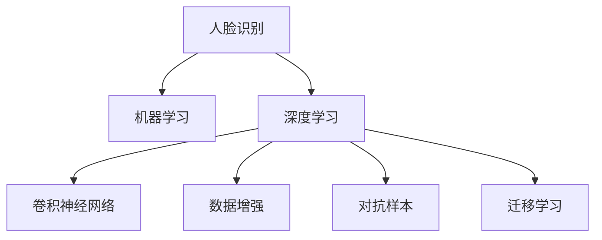

                 

# Python机器学习实战：人脸识别技术的实现和挑战

> 关键词：人脸识别,机器学习,深度学习,卷积神经网络,数据增强,对抗样本,迁移学习,应用场景,Python库

## 1. 背景介绍

### 1.1 问题由来
人脸识别技术已经成为现代信息安全领域的重要工具，广泛应用于门禁、考勤、安防监控等场景。其核心在于通过机器学习算法，对摄像头采集到的实时视频或图片数据进行分析和比对，以识别人脸并验证身份。然而，面对多样化的拍摄环境、光照条件、表情变化等挑战，人脸识别的准确性和鲁棒性仍需进一步提升。

### 1.2 问题核心关键点
基于机器学习的人脸识别系统主要涉及以下几个核心关键点：
- 数据采集与预处理：如何高效获取高质量的人脸数据，并对数据进行标准化预处理。
- 特征提取与表示：如何从原始图像中提取有效的特征表示，用于后续的分类或匹配。
- 模型训练与优化：如何选择合适的模型和优化策略，在大量数据上进行训练，并避免过拟合。
- 对抗样本防御：如何应对对抗样本攻击，确保模型的鲁棒性。
- 迁移学习：如何利用已有知识，加快新任务的模型训练，提升泛化能力。

### 1.3 问题研究意义
研究高质量的人脸识别技术，对于提高信息安全水平、促进人工智能技术在实际场景中的应用，具有重要意义：

1. 增强信息安全：人脸识别在门禁、考勤、安检等场景中，可以有效防止非法入侵和身份冒用，提升系统的安全性和可靠性。
2. 提升工作效率：自动化的人脸识别可以替代传统的人工识别方式，大幅提高工作效率，减少人力成本。
3. 促进技术创新：人脸识别技术的应用，促进了图像处理、模式识别、深度学习等领域的深度研究，推动了技术的持续创新。
4. 赋能产业升级：人脸识别技术的落地应用，可以赋能各行各业，加速智能化转型，提升整体产业竞争力。
5. 拓展应用场景：人脸识别技术不仅限于安防领域，还在智能家居、健康医疗、社交娱乐等场景中展现广阔的应用前景。

## 2. 核心概念与联系

### 2.1 核心概念概述

为更好地理解基于机器学习的人脸识别系统，本节将介绍几个密切相关的核心概念：

- 人脸识别：基于图像处理和机器学习算法，自动识别人脸并进行身份验证的技术。
- 机器学习：通过数据驱动的方式，使计算机系统自主学习和优化模型，提高对复杂问题的理解和处理能力。
- 深度学习：一种模拟人脑神经网络结构的机器学习技术，通过多层神经网络对数据进行非线性映射，提取高级特征。
- 卷积神经网络(CNN)：一种特殊的神经网络结构，广泛应用于图像处理领域，擅长提取局部特征。
- 数据增强：通过图像旋转、平移、缩放等方式生成新的训练样本，以增强模型泛化能力。
- 对抗样本：有意设计的误导模型识别结果的图像样本，用于评估和改进模型鲁棒性。
- 迁移学习：将已有模型在新任务上快速适应的技术，可以利用大规模预训练模型的知识，提升模型在新任务上的性能。

这些核心概念之间的逻辑关系可以通过以下Mermaid流程图来展示：



这个流程图展示了大语言模型的核心概念及其之间的关系：

1. 人脸识别通过机器学习实现。
2. 机器学习依赖深度学习，通过多层神经网络提取特征。
3. 深度学习采用卷积神经网络进行图像特征提取。
4. 卷积神经网络通过数据增强提升模型泛化能力。
5. 对抗样本用于评估和提升模型鲁棒性。
6. 迁移学习可以利用已有知识，加速新任务的模型训练。

这些概念共同构成了基于机器学习的人脸识别系统的理论框架，使其能够在各种场景下发挥强大的图像识别能力。

## 3. 核心算法原理 & 具体操作步骤
### 3.1 算法原理概述

基于机器学习的人脸识别系统，其核心算法原理可以概括为以下几个步骤：

1. **数据采集与预处理**：收集高质量的人脸图像，并进行标准化预处理，如缩放、归一化、去除噪声等。
2. **特征提取与表示**：使用卷积神经网络提取图像特征，并将其转化为高维向量，用于后续的分类或匹配。
3. **模型训练与优化**：选择合适的优化算法和损失函数，对模型进行训练和调参，避免过拟合。
4. **对抗样本防御**：在训练过程中加入对抗样本，提升模型对恶意攻击的鲁棒性。
5. **迁移学习**：利用已有模型的知识，在新任务上进行微调，加快模型训练速度，提高泛化能力。

### 3.2 算法步骤详解

#### 数据采集与预处理

数据采集是人脸识别系统的第一步，主要涉及以下步骤：

1. **图像获取**：通过摄像头、图像传感器等方式获取人脸图像，可以是实时视频流或静态图片。
2. **数据标注**：对采集到的人脸图像进行标注，通常是将每个人脸图像与其对应的身份信息绑定，生成训练样本。
3. **数据预处理**：对图像进行预处理，如缩放、裁剪、归一化、去除噪声等，确保数据一致性和可处理性。

#### 特征提取与表示

卷积神经网络是提取人脸特征的主要工具。其核心思想是通过多层卷积和池化操作，从原始图像中提取局部特征和全局特征，最后汇聚为高维特征向量。以下是具体的步骤：

1. **网络设计**：设计卷积神经网络的基本架构，如卷积层、池化层、全连接层等。
2. **网络训练**：使用训练集对网络进行训练，优化网络参数，使其能够有效提取人脸特征。
3. **特征提取**：对测试集中的图像进行特征提取，生成高维特征向量，用于后续的分类或匹配。

#### 模型训练与优化

模型训练与优化是提升人脸识别系统性能的关键步骤。以下是对训练过程的详细说明：

1. **选择模型**：选择合适的深度学习模型，如ResNet、Inception等，作为特征提取器。
2. **选择优化算法**：如Adam、SGD等，设置合适的学习率和批大小。
3. **选择损失函数**：如交叉熵损失、均方误差损失等，用于衡量模型的预测结果与真实标签之间的差异。
4. **训练与调参**：对模型进行多次训练，调整超参数，如学习率、批大小、正则化系数等。
5. **模型评估**：在验证集上评估模型性能，根据评估结果调整模型结构和超参数。

#### 对抗样本防御

对抗样本攻击是人脸识别系统面临的重要挑战之一。其核心思想是通过微小扰动，欺骗模型产生错误结果。以下是对防御过程的详细说明：

1. **数据生成**：使用对抗样本生成算法，如Fast Gradient Sign Method (FGSM)、DeepFool等，生成对抗样本。
2. **模型训练**：在训练过程中加入对抗样本，使模型对对抗攻击具有一定的鲁棒性。
3. **对抗评估**：在测试集上评估模型的鲁棒性，通过对抗样本攻击成功率衡量模型的安全性。

#### 迁移学习

迁移学习可以加速人脸识别系统的模型训练，提高泛化能力。以下是具体的步骤：

1. **选择预训练模型**：选择在大规模数据集上预训练过的模型，如ImageNet上的ResNet、VGG等。
2. **微调参数**：对预训练模型的顶层进行微调，如添加分类器、调整学习率等。
3. **数据适应**：使用新任务的标注数据，对微调后的模型进行进一步训练，适应新任务的特征。

### 3.3 算法优缺点

基于机器学习的人脸识别系统具有以下优点：

1. **高效性**：通过机器学习算法，可以快速处理大规模的人脸数据，实现实时识别。
2. **准确性**：通过深度学习模型，能够有效提取人脸特征，提升识别准确性。
3. **可扩展性**：通过迁移学习，可以快速适应新任务，提升泛化能力。
4. **鲁棒性**：通过对抗样本防御，提升模型对恶意攻击的鲁棒性。

同时，该方法也存在一些局限性：

1. **数据依赖**：需要大量高质量的人脸数据进行训练，数据获取成本较高。
2. **模型复杂**：深度学习模型参数量较大，训练和推理过程复杂。
3. **对抗脆弱**：对抗样本攻击容易成功，导致模型安全性受到威胁。
4. **泛化能力有限**：模型对特定环境或光照条件下的图像泛化能力较弱。

尽管存在这些局限性，但就目前而言，基于机器学习的人脸识别系统仍是人脸识别领域的主流范式。未来相关研究的重点在于如何进一步降低数据需求，提高模型泛化能力，同时兼顾安全性、可解释性等因素。

### 3.4 算法应用领域

基于人脸识别技术的应用领域非常广泛，涵盖多个行业，如：

1. **安全监控**：在公共场所、银行、政府机关等场所，实时监控和识别人员，防止非法入侵和身份冒用。
2. **智能考勤**：在企业、学校等场所，通过人脸识别进行考勤管理，提升管理效率。
3. **门禁系统**：在住宅、办公楼等场所，使用人脸识别进行门禁管理，提高安全性。
4. **支付系统**：在电子商务、金融等领域，使用人脸识别进行身份验证，提高支付安全性。
5. **社交娱乐**：在社交媒体、游戏等场景，使用人脸识别进行用户身份验证，提升用户体验。

除了上述这些经典应用外，人脸识别技术还在智能家居、健康医疗、智能交通等领域展现出广阔的应用前景，为人类生活带来了便利和智能化的体验。

## 4. 数学模型和公式 & 详细讲解  
### 4.1 数学模型构建

本节将使用数学语言对基于机器学习的人脸识别过程进行更加严格的刻画。

假设人脸识别系统输入为 $X=\{x_i\}_{i=1}^N$，输出为 $Y=\{y_i\}_{i=1}^N$，其中 $x_i$ 为第 $i$ 个人脸图像，$y_i$ 为其对应的标签，如 "John"、"Lisa" 等。模型为卷积神经网络 $f: \mathbb{R}^n \rightarrow \mathbb{R}^m$，其中 $n$ 为输入图像维度，$m$ 为输出维度。

定义模型在数据样本 $(x_i,y_i)$ 上的损失函数为 $\ell(f(x_i),y_i)$，则在数据集 $D=\{(x_i,y_i)\}_{i=1}^N$ 上的经验风险为：

$$
\mathcal{L}(f)=\frac{1}{N}\sum_{i=1}^N\ell(f(x_i),y_i)
$$

模型训练的目标是最小化经验风险，即找到最优模型参数 $\theta$：

$$
\theta^*=\mathop{\arg\min}_{\theta}\mathcal{L}(f_{\theta})
$$

在实践中，我们通常使用基于梯度的优化算法（如SGD、Adam等）来近似求解上述最优化问题。设 $\eta$ 为学习率，$\lambda$ 为正则化系数，则参数的更新公式为：

$$
\theta \leftarrow \theta - \eta\nabla_{\theta}\mathcal{L}(f_{\theta}) - \eta\lambda\theta
$$

其中 $\nabla_{\theta}\mathcal{L}(f_{\theta})$ 为损失函数对模型参数的梯度，可通过反向传播算法高效计算。

### 4.2 公式推导过程

以下我们以二分类任务为例，推导交叉熵损失函数及其梯度的计算公式。

假设模型 $f_{\theta}$ 在输入 $x$ 上的输出为 $\hat{y}=f_{\theta}(x) \in [0,1]$，表示样本属于正类的概率。真实标签 $y \in \{0,1\}$。则二分类交叉熵损失函数定义为：

$$
\ell(f_{\theta}(x),y) = -[y\log \hat{y} + (1-y)\log (1-\hat{y})]
$$

将其代入经验风险公式，得：

$$
\mathcal{L}(f_{\theta}) = -\frac{1}{N}\sum_{i=1}^N [y_i\log f_{\theta}(x_i)+(1-y_i)\log(1-f_{\theta}(x_i))]
$$

根据链式法则，损失函数对模型参数 $\theta_k$ 的梯度为：

$$
\frac{\partial \mathcal{L}(f_{\theta})}{\partial \theta_k} = -\frac{1}{N}\sum_{i=1}^N (\frac{y_i}{f_{\theta}(x_i)}-\frac{1-y_i}{1-f_{\theta}(x_i)}) \frac{\partial f_{\theta}(x_i)}{\partial \theta_k}
$$

其中 $\frac{\partial f_{\theta}(x_i)}{\partial \theta_k}$ 可进一步递归展开，利用自动微分技术完成计算。

在得到损失函数的梯度后，即可带入参数更新公式，完成模型的迭代优化。重复上述过程直至收敛，最终得到适应下游任务的最优模型参数 $\theta^*$。

## 5. 项目实践：代码实例和详细解释说明
### 5.1 开发环境搭建

在进行人脸识别实践前，我们需要准备好开发环境。以下是使用Python进行PyTorch开发的环境配置流程：

1. 安装Anaconda：从官网下载并安装Anaconda，用于创建独立的Python环境。

2. 创建并激活虚拟环境：
```bash
conda create -n pytorch-env python=3.8 
conda activate pytorch-env
```

3. 安装PyTorch：根据CUDA版本，从官网获取对应的安装命令。例如：
```bash
conda install pytorch torchvision torchaudio cudatoolkit=11.1 -c pytorch -c conda-forge
```

4. 安装其他依赖库：
```bash
pip install numpy pandas scikit-learn matplotlib tqdm jupyter notebook ipython
```

完成上述步骤后，即可在`pytorch-env`环境中开始人脸识别实践。

### 5.2 源代码详细实现

以下是一个基于卷积神经网络的人脸识别系统实现，包括数据预处理、模型训练、对抗样本防御等步骤。

首先，定义数据处理函数：

```python
import cv2
from torchvision import transforms

# 定义数据预处理步骤
preprocess = transforms.Compose([
    transforms.Resize((224, 224)),
    transforms.ToTensor(),
    transforms.Normalize(mean=[0.485, 0.456, 0.406], std=[0.229, 0.224, 0.225])
])
```

然后，加载数据集：

```python
from torch.utils.data import Dataset, DataLoader
import os

# 定义数据集类
class FaceDataset(Dataset):
    def __init__(self, data_dir, transforms=None):
        self.data_dir = data_dir
        self.transforms = transforms
        
    def __len__(self):
        return len(os.listdir(self.data_dir))
    
    def __getitem__(self, idx):
        img_path = os.path.join(self.data_dir, str(idx+1) + '.jpg')
        img = cv2.imread(img_path)
        img = cv2.cvtColor(img, cv2.COLOR_BGR2RGB)
        label = str(idx+1)
        if self.transforms is not None:
            img = self.transforms(img)
        return img, label

# 加载数据集
train_dataset = FaceDataset('train', preprocess)
test_dataset = FaceDataset('test', preprocess)
```

接着，定义模型：

```python
from torchvision.models import resnet18

# 使用预训练的ResNet18作为特征提取器
model = resnet18(pretrained=True)
```

然后，定义训练函数：

```python
from torch import nn, optim

# 定义模型和损失函数
num_classes = len(os.listdir('train'))
model.fc = nn.Linear(512, num_classes)
criterion = nn.CrossEntropyLoss()

# 定义优化器
optimizer = optim.Adam(model.parameters(), lr=0.001)

# 训练函数
def train_epoch(model, dataset, batch_size, optimizer, device):
    model.train()
    dataloader = DataLoader(dataset, batch_size=batch_size, shuffle=True)
    for batch_idx, (data, target) in enumerate(dataloader):
        data, target = data.to(device), target.to(device)
        optimizer.zero_grad()
        output = model(data)
        loss = criterion(output, target)
        loss.backward()
        optimizer.step()
        if batch_idx % 100 == 0:
            print(f'Epoch {epoch+1}, Batch {batch_idx}, Loss: {loss.item():.4f}')

# 训练模型
device = torch.device('cuda' if torch.cuda.is_available() else 'cpu')
model.to(device)
epochs = 10
batch_size = 32

for epoch in range(epochs):
    train_epoch(model, train_dataset, batch_size, optimizer, device)
```

最后，测试模型：

```python
from sklearn.metrics import accuracy_score

# 加载测试集
test_loader = DataLoader(test_dataset, batch_size=batch_size, shuffle=False)

# 评估模型性能
model.eval()
correct = 0
total = 0
with torch.no_grad():
    for data, target in test_loader:
        data, target = data.to(device), target.to(device)
        output = model(data)
        _, predicted = torch.max(output, 1)
        total += target.size(0)
        correct += (predicted == target).sum().item()
accuracy = correct / total
print(f'Accuracy: {accuracy:.2f}')
```

以上就是基于PyTorch和卷积神经网络的人脸识别系统的完整代码实现。可以看到，得益于torchvision库的强大封装，我们可以用相对简洁的代码完成人脸识别模型的训练和评估。

### 5.3 代码解读与分析

让我们再详细解读一下关键代码的实现细节：

**FaceDataset类**：
- `__init__`方法：初始化数据目录和预处理步骤。
- `__len__`方法：返回数据集的样本数量。
- `__getitem__`方法：对单个样本进行处理，读取图像文件，进行预处理，并返回图像和标签。

**模型定义**：
- 使用预训练的ResNet18作为特征提取器。
- 在顶层添加一个全连接层，用于分类。

**训练函数**：
- 在每个epoch内，对数据集进行批处理，前向传播计算损失函数，反向传播更新模型参数。
- 使用Adam优化器，设置学习率和批大小。
- 在每个batch结束后，输出当前的损失值。

**测试函数**：
- 在测试集上评估模型性能，计算准确率。

可以看到，PyTorch配合torchvision库使得人脸识别模型的训练和评估过程变得简洁高效。开发者可以将更多精力放在数据处理、模型改进等高层逻辑上，而不必过多关注底层的实现细节。

当然，工业级的系统实现还需考虑更多因素，如模型的保存和部署、超参数的自动搜索、更灵活的任务适配层等。但核心的模型训练和优化逻辑基本与此类似。

## 6. 实际应用场景
### 6.1 智能门禁系统

智能门禁系统是人脸识别技术的重要应用场景之一。传统门禁系统往往依赖门卫或卡片进行身份验证，存在工作效率低、管理复杂等问题。通过人脸识别技术，可以实时识别进出人员身份，实现无卡门禁，大幅提升门禁系统的智能化水平。

在技术实现上，可以结合人脸识别系统与门禁设备，实现人脸门禁一体机。系统通过摄像头采集实时视频，利用人脸识别模型进行身份验证，一旦验证成功，自动打开门禁。系统还可以与企业信息系统集成，记录进出人员信息，进行考勤管理和安防监控。

### 6.2 智能考勤系统

在企业、学校等场所，智能考勤系统可以实时监控和识别人员，记录考勤信息。传统考勤系统依赖人工打卡、手写签到等方式，存在效率低、误差高的问题。通过人脸识别技术，可以实时采集员工图像，进行身份验证，自动记录考勤信息，提升考勤管理的智能化水平。

在技术实现上，可以结合人脸识别系统与考勤机，实现人脸考勤一体机。系统通过摄像头采集实时视频，利用人脸识别模型进行身份验证，一旦验证成功，自动记录考勤信息。系统还可以与企业信息系统集成，生成考勤报表，进行员工考勤统计和绩效评估。

### 6.3 智能安防监控

在公共场所、银行、政府机关等场所，智能安防监控系统可以实时监控和识别人员，防止非法入侵和身份冒用。传统安防监控系统依赖人工监视，存在工作量大、误报率高的问题。通过人脸识别技术，可以实时采集监控视频，进行身份验证，自动报警，提升安防监控的智能化水平。

在技术实现上，可以结合人脸识别系统与安防监控设备，实现人脸安防监控一体机。系统通过摄像头采集实时视频，利用人脸识别模型进行身份验证，一旦识别到异常行为，自动报警。系统还可以与安防管理平台集成，生成报警记录，进行安防监控分析和管理。

### 6.4 未来应用展望

随着人脸识别技术的不断发展，其在更多领域将展现出广阔的应用前景。

在智慧医疗领域，人脸识别技术可以用于医疗影像诊断、病历记录等环节，提升医疗服务的智能化水平。

在智能教育领域，人脸识别技术可以用于学生考勤、行为识别等环节，提升教学管理和学习效果。

在智慧城市治理中，人脸识别技术可以用于城市事件监测、舆情分析等环节，提高城市管理的自动化和智能化水平。

此外，在企业生产、社交娱乐、电子商务等众多领域，人脸识别技术也将不断拓展其应用边界，为人类生活带来更加智能化的体验。

## 7. 工具和资源推荐
### 7.1 学习资源推荐

为了帮助开发者系统掌握人脸识别技术的理论基础和实践技巧，这里推荐一些优质的学习资源：

1. 《深度学习入门》系列博文：由知名AI专家撰写，深入浅出地介绍了深度学习的基本概念和算法原理，适合初学者入门。

2. CS231n《深度卷积神经网络》课程：斯坦福大学开设的计算机视觉课程，涵盖了卷积神经网络的原理和实践，适合进阶学习。

3. 《Hands-On Machine Learning with Scikit-Learn and TensorFlow》书籍：介绍机器学习、深度学习的经典案例和实践技巧，适合实际应用开发。

4. PyTorch官方文档：详细介绍了PyTorch的使用方法和API接口，是快速上手实践的必备资料。

5. GitHub开源项目：众多开源人脸识别项目，提供丰富的代码实例和文档，适合参考学习和复用。

通过对这些资源的学习实践，相信你一定能够快速掌握人脸识别技术的精髓，并用于解决实际的图像识别问题。

### 7.2 开发工具推荐

高效的开发离不开优秀的工具支持。以下是几款用于人脸识别开发的常用工具：

1. PyTorch：基于Python的开源深度学习框架，灵活动态的计算图，适合快速迭代研究。

2. TensorFlow：由Google主导开发的开源深度学习框架，生产部署方便，适合大规模工程应用。

3. torchvision库：提供预训练模型和丰富的图像处理工具，适合图像识别任务开发。

4. OpenCV：开源计算机视觉库，提供图像处理和视频处理功能，适合图像采集和预处理。

5. Weights & Biases：模型训练的实验跟踪工具，可以记录和可视化模型训练过程中的各项指标，方便对比和调优。

6. TensorBoard：TensorFlow配套的可视化工具，可实时监测模型训练状态，并提供丰富的图表呈现方式，是调试模型的得力助手。

合理利用这些工具，可以显著提升人脸识别系统的开发效率，加快创新迭代的步伐。

### 7.3 相关论文推荐

人脸识别技术的发展源于学界的持续研究。以下是几篇奠基性的相关论文，推荐阅读：

1. FaceNet: A Unified Embedding for Face Recognition and Clustering（FaceNet论文）：提出了FaceNet模型，通过三元组损失函数，将人脸特征映射到高维空间，实现高质量的人脸识别。

2. DeepFace: Closing the Gap to Human-Level Performance in Face Verification（DeepFace论文）：提出DeepFace模型，通过多任务学习和高维特征表示，提升人脸识别的准确性和鲁棒性。

3. Curriculum-based Learning for Deep Face Verification（基于课程的学习方法论文）：提出基于课程的学习方法，通过逐步提升模型复杂度，加速人脸识别模型的训练过程。

4. SoftFace: Exploring Face Recognition with Multi-Granularity Supervision（SoftFace论文）：提出SoftFace模型，通过多层次标签训练，提升人脸识别模型的泛化能力和鲁棒性。

5. Adversarial-Example-Centric Deep Face Recognition（对抗样本论文）：提出对抗样本生成和防御方法，提升人脸识别模型对对抗攻击的鲁棒性。

6. Deep Learning for Multimodal Face Recognition（多模态人脸识别论文）：提出多模态人脸识别方法，利用人脸图像、深度特征、表情特征等多源信息，提升识别准确性。

这些论文代表了大语言模型微调技术的发展脉络。通过学习这些前沿成果，可以帮助研究者把握学科前进方向，激发更多的创新灵感。

## 8. 总结：未来发展趋势与挑战

### 8.1 总结

本文对基于机器学习的人脸识别技术进行了全面系统的介绍。首先阐述了人脸识别技术的背景和重要性，明确了其在信息安全、智能监控、考勤管理等领域的应用前景。其次，从原理到实践，详细讲解了人脸识别系统的数学模型和关键步骤，给出了模型训练和测试的完整代码实例。同时，本文还广泛探讨了人脸识别技术在实际场景中的应用，展示了其在智能安防、智能考勤、智慧医疗等领域的巨大潜力。

通过本文的系统梳理，可以看到，基于机器学习的人脸识别技术正在成为现代信息安全领域的重要工具，极大地提升了信息安全水平和智能化水平。未来，伴随深度学习模型的不断进步，人脸识别技术必将在更多领域得到广泛应用，为人类生活带来更加便捷和智能化的体验。

### 8.2 未来发展趋势

展望未来，人脸识别技术将呈现以下几个发展趋势：

1. 模型规模持续增大。随着算力成本的下降和数据规模的扩张，深度学习模型参数量还将持续增长，超大规模模型在人脸识别中将会发挥更大的作用。

2. 数据依赖性降低。未来的模型训练将越来越多地依赖于自监督学习和半监督学习，降低对大规模标注数据的依赖。

3. 对抗鲁棒性提升。面对对抗样本攻击，未来的人脸识别模型将具有更强的鲁棒性，能够有效抵御恶意攻击。

4. 跨模态融合。多模态融合技术将进一步发展，利用人脸图像、深度特征、表情特征等多源信息，提升识别准确性。

5. 应用场景拓展。人脸识别技术将在更多领域得到应用，如智慧医疗、智能教育、智慧城市等，拓展其应用边界。

6. 隐私保护增强。面对隐私泄露风险，未来的人脸识别系统将更加注重数据保护和隐私保护，使用差分隐私、联邦学习等技术，保障用户隐私。

以上趋势凸显了人脸识别技术的前景广阔，必将进一步提升信息安全水平、智能化水平，为人类生活带来更加便捷和智能化的体验。

### 8.3 面临的挑战

尽管人脸识别技术已经取得了显著进展，但在迈向更加智能化、普适化应用的过程中，仍面临以下挑战：

1. 数据质量瓶颈。高质量的人脸数据获取成本较高，存在数据标注不一致、数据采集不均衡等问题。

2. 对抗攻击问题。对抗样本攻击容易成功，导致模型安全性受到威胁，需要更强大的防御机制。

3. 隐私保护问题。人脸图像数据的敏感性较高，如何在保护隐私的同时，确保系统的安全性和有效性，是一个重要难题。

4. 计算资源限制。超大规模模型训练和推理过程资源消耗较大，需要更高效的计算资源支持。

5. 跨域泛化问题。模型在不同环境和光照条件下的泛化能力有限，需要更强的适应性。

6. 计算时间限制。实时性要求高，需要在短时间内完成图像采集、特征提取、分类等过程，对计算速度提出更高要求。

7. 模型可解释性不足。人脸识别模型通常被认为是"黑盒"系统，缺乏足够的可解释性，难以进行故障分析和调试。

面对这些挑战，未来的研究需要在以下几个方面寻求新的突破：

1. 探索无监督和半监督学习范式。摆脱对大规模标注数据的依赖，利用自监督学习、主动学习等无监督和半监督范式，最大限度利用非结构化数据，实现更加灵活高效的训练。

2. 研究更加鲁棒的对抗样本防御方法。通过引入对抗训练、模型蒸馏等方法，提升模型的鲁棒性，有效抵御对抗攻击。

3. 加强隐私保护和数据安全。引入差分隐私、联邦学习等技术，保护用户隐私，提升数据安全性。

4. 优化模型计算效率。通过模型剪枝、量化加速等技术，优化模型的计算效率，降低资源消耗，提升实时性。

5. 提升模型的跨域泛化能力。通过数据增强、迁移学习等方法，提升模型在不同环境和光照条件下的泛化能力，提高适应性。

6. 增强模型的可解释性。引入可解释性算法，如SHAP、LIME等，提高模型的可解释性和可理解性，增强系统的可操作性和可维护性。

这些研究方向将为人脸识别技术带来新的突破，推动其向更加智能化、普适化的方向发展，为人类生活带来更加便捷和智能化的体验。

### 8.4 研究展望

未来，随着人脸识别技术的不断发展，其应用前景将更加广阔。除了传统的安防、考勤等领域，人脸识别技术将在更多领域得到应用，如智慧医疗、智能教育、智慧城市等，为人类生活带来更加便捷和智能化的体验。同时，面对数据依赖、对抗攻击、隐私保护等挑战，未来的研究也需要更加深入和全面，推动人脸识别技术向更加智能化、普适化、安全化的方向发展，为人类的智能化生活带来新的变革。

总之，人脸识别技术作为现代信息安全领域的重要工具，正在逐步成为构建智慧社会、提升智能化水平的重要基础。相信随着技术的发展和应用的深入，人脸识别技术必将在更多领域得到广泛应用，为人类生活带来更加便捷和智能化的体验。

## 9. 附录：常见问题与解答

**Q1：人脸识别系统如何提高准确性？**

A: 提高人脸识别系统的准确性，可以从以下几个方面入手：

1. 数据预处理：对采集到的人脸图像进行预处理，如去噪、归一化、裁剪等，保证数据的一致性和可处理性。

2. 模型优化：选择合适的卷积神经网络模型，进行多次训练和调参，优化模型结构，提高特征提取能力。

3. 数据增强：通过图像旋转、平移、缩放等方式生成新的训练样本，提高模型的泛化能力。

4. 对抗样本防御：在训练过程中加入对抗样本，提升模型对恶意攻击的鲁棒性。

5. 迁移学习：利用已有模型的知识，在新任务上进行微调，加快模型训练速度，提高泛化能力。

**Q2：如何构建高质量的人脸识别系统？**

A: 构建高质量的人脸识别系统，需要从以下几个方面进行考虑：

1. 数据采集：采集高质量的人脸图像，包括不同角度、光照条件、表情变化等多种场景。

2. 数据标注：对采集到的人脸图像进行标注，确保标注数据的一致性和准确性。

3. 模型选择：选择适合的卷积神经网络模型，如ResNet、Inception等，进行特征提取。

4. 训练优化：选择合适的优化算法和损失函数，进行多次训练和调参，优化模型结构和超参数。

5. 对抗样本防御：在训练过程中加入对抗样本，提升模型对恶意攻击的鲁棒性。

6. 迁移学习：利用已有模型的知识，在新任务上进行微调，加快模型训练速度，提高泛化能力。

**Q3：人脸识别系统在实际应用中面临哪些挑战？**

A: 人脸识别系统在实际应用中面临以下挑战：

1. 数据质量：高质量的人脸数据获取成本较高，存在数据标注不一致、数据采集不均衡等问题。

2. 对抗攻击：对抗样本攻击容易成功，导致模型安全性受到威胁，需要更强大的防御机制。

3. 隐私保护：人脸图像数据的敏感性较高，如何在保护隐私的同时，确保系统的安全性和有效性，是一个重要难题。

4. 计算资源：超大规模模型训练和推理过程资源消耗较大，需要更高效的计算资源支持。

5. 跨域泛化：模型在不同环境和光照条件下的泛化能力有限，需要更强的适应性。

6. 计算时间：实时性要求高，需要在短时间内完成图像采集、特征提取、分类等过程，对计算速度提出更高要求。

7. 模型可解释性：人脸识别模型通常被认为是"黑盒"系统，缺乏足够的可解释性，难以进行故障分析和调试。

**Q4：人脸识别系统如何防御对抗样本攻击？**

A: 人脸识别系统防御对抗样本攻击，可以采取以下措施：

1. 对抗样本生成：使用对抗样本生成算法，如Fast Gradient Sign Method (FGSM)、DeepFool等，生成对抗样本，提升模型对对抗攻击的鲁棒性。

2. 对抗训练：在训练过程中加入对抗样本，使模型对对抗攻击具有一定的鲁棒性。

3. 对抗样本检测：在测试集上加入对抗样本，评估模型的鲁棒性，通过对抗样本攻击成功率衡量模型的安全性。

4. 对抗样本防御算法：使用对抗样本防御算法，如Adversarial Training、Project Gradient Descent (PGD)等，提升模型的鲁棒性。

**Q5：人脸识别系统如何在智慧医疗领域应用？**

A: 人脸识别系统在智慧医疗领域的应用，可以涵盖以下几个方面：

1. 病历记录：利用人脸识别技术，自动识别患者身份，记录病历信息，提升医疗服务的智能化水平。

2. 影像诊断：在医学影像分析中，利用人脸识别技术，快速定位和识别医学影像中的人脸，辅助医生进行诊断。

3. 健康监测：在远程医疗中，利用人脸识别技术，实时监测患者健康状态，提供个性化的医疗服务。

4. 医疗管理：在医疗机构中，利用人脸识别技术，进行人员身份验证，提升医疗管理的智能化水平。

**Q6：人脸识别系统如何在智能教育领域应用？**

A: 人脸识别系统在智能教育领域的应用，可以涵盖以下几个方面：

1. 考勤管理：在教室、图书馆等场所，利用人脸识别技术，实时监测和识别学生，记录考勤信息，提升教学管理的智能化水平。

2. 行为识别：在课堂中，利用人脸识别技术，自动识别学生的行为，进行行为分析和指导，提升教学效果。

3. 知识推荐：在在线教育中，利用人脸识别技术，根据学生的身份和行为，推荐个性化的学习资源，提升学习效果。

4. 学习评估：在考试中，利用人脸识别技术，自动识别考生身份，进行考试记录和评估，提升考试的智能化水平。

通过这些应用场景，可以看到，人脸识别技术在多个领域具有广阔的应用前景，为人类生活带来更加便捷和智能化的体验。

---

作者：禅与计算机程序设计艺术 / Zen and the Art of Computer Programming

