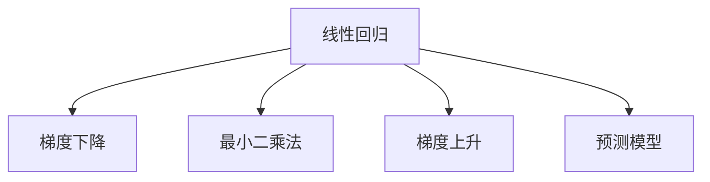

                 

# Python机器学习实战：理解并实现线性回归算法

> 关键词：线性回归, 梯度下降, Python, 最小二乘法, 梯度上升, 机器学习, 预测模型

## 1. 背景介绍

线性回归是机器学习中最基础、应用最广泛的算法之一。它通过建立线性关系模型来预测数值型变量的值。在线性回归中，我们假设变量之间的关系是线性的，并且预测值与实际值之间的误差是服从正态分布的随机变量。线性回归模型在各种领域都有广泛的应用，如金融、医疗、电商等。

## 2. 核心概念与联系

### 2.1 核心概念概述

为了更好地理解线性回归算法，本节将介绍几个相关的核心概念：

- 线性回归（Linear Regression）：是一种基于最小二乘法的线性模型。它假设变量之间存在线性关系，通过最小化预测值与真实值之间的差异，来预测数值型变量的值。
- 梯度下降（Gradient Descent）：是一种优化算法，通过迭代调整模型参数，最小化损失函数。在机器学习中，梯度下降是优化模型参数的常用方法。
- 最小二乘法（Least Squares）：一种求解线性回归模型的常用方法，通过最小化预测值与真实值之间的平方差，来得到最优的线性回归模型。
- 梯度上升（Gradient Ascent）：与梯度下降相反，梯度上升是通过迭代调整模型参数，最大化损失函数。
- 预测模型（Predictive Model）：一种用于预测数值型变量的模型，它通过学习历史数据，来预测未来的数值变量。

这些核心概念之间的逻辑关系可以通过以下Mermaid流程图来展示：



这个流程图展示了几大核心概念之间的逻辑关系：

1. 线性回归是预测模型的基础，通过最小二乘法得到最优的线性模型。
2. 梯度下降是优化算法的基础，通过迭代调整模型参数，最小化损失函数。
3. 梯度上升是优化算法的另一选择，通过迭代调整模型参数，最大化损失函数。
4. 预测模型是通过训练数据得到预测结果的模型，广泛应用于各种领域。

## 3. 核心算法原理 & 具体操作步骤

### 3.1 算法原理概述

线性回归的原理是通过最小化预测值与真实值之间的差异，来得到最优的线性模型。假设我们有一个包含 $n$ 个样本和 $m$ 个特征的数据集 $D=\{(x_1,y_1),(x_2,y_2),\cdots,(x_n,y_n)\}$，其中 $x_i$ 表示样本的特征向量，$y_i$ 表示样本的真实值。我们的目标是通过学习数据集的线性关系，得到一个线性回归模型 $y = \theta_0 + \sum_{j=1}^m \theta_j x_{ij}$，其中 $\theta_0$ 表示截距，$\theta_j$ 表示第 $j$ 个特征的系数。

为了得到最优的线性回归模型，我们需要最小化预测值与真实值之间的平方误差，即最小化损失函数：

$$
\min \sum_{i=1}^n (y_i - \theta_0 - \sum_{j=1}^m \theta_j x_{ij})^2
$$

为了求解上述最小化问题，我们可以使用梯度下降算法。梯度下降算法通过迭代调整模型参数，来最小化损失函数。具体来说，每次迭代都会计算损失函数对模型参数的梯度，并根据梯度方向调整模型参数，直到损失函数收敛。

### 3.2 算法步骤详解

线性回归的实现步骤包括数据预处理、模型初始化、损失函数计算、梯度计算和参数更新等。下面我们将详细介绍每个步骤的实现细节。

**Step 1: 数据预处理**

数据预处理是线性回归的第一步，主要包括以下两个步骤：

1. 数据标准化：将数据标准化为均值为0、方差为1的标准正态分布，防止梯度下降算法收敛过慢。
2. 数据拆分：将数据集拆分为训练集和测试集，一般使用70%的数据作为训练集，30%的数据作为测试集。

**Step 2: 模型初始化**

模型初始化是线性回归的第二步，主要包括以下两个步骤：

1. 初始化模型参数：将模型参数 $\theta$ 初始化为随机值。
2. 设定迭代次数：设定最大迭代次数 $n$，用于控制迭代次数。

**Step 3: 损失函数计算**

损失函数计算是线性回归的第三步，主要包括以下两个步骤：

1. 计算预测值：使用模型参数 $\theta$ 计算预测值 $\hat{y}_i = \theta_0 + \sum_{j=1}^m \theta_j x_{ij}$。
2. 计算损失函数：计算损失函数 $J(\theta) = \frac{1}{2n} \sum_{i=1}^n (y_i - \hat{y}_i)^2$。

**Step 4: 梯度计算**

梯度计算是线性回归的第四步，主要包括以下两个步骤：

1. 计算梯度：计算损失函数 $J(\theta)$ 对模型参数 $\theta$ 的梯度 $\frac{\partial J(\theta)}{\partial \theta}$。
2. 更新模型参数：根据梯度方向，调整模型参数 $\theta$。

**Step 5: 参数更新**

参数更新是线性回归的第五步，主要包括以下两个步骤：

1. 更新模型参数：根据梯度方向，更新模型参数 $\theta$。
2. 判断是否停止：判断迭代次数是否达到最大迭代次数 $n$，如果达到，则停止迭代，输出最终模型参数 $\theta$。

### 3.3 算法优缺点

线性回归具有以下优点：

1. 简单易用：线性回归模型简单，易于实现和理解。
2. 快速收敛：梯度下降算法具有快速收敛的性质，能够快速得到最优的模型参数。
3. 可解释性强：线性回归模型具有可解释性，能够解释模型参数的物理意义。

同时，线性回归也存在以下缺点：

1. 假设条件有限：线性回归假设变量之间存在线性关系，但实际问题中往往存在非线性关系。
2. 过度拟合风险：线性回归模型存在过度拟合的风险，如果模型参数过多，可能会导致过拟合现象。
3. 数据要求高：线性回归模型对数据的要求较高，需要满足正态分布、无异常值等条件。

### 3.4 算法应用领域

线性回归在各个领域都有广泛的应用，例如：

- 金融风险管理：通过线性回归模型，预测股票价格的变化趋势，评估金融风险。
- 房价预测：通过线性回归模型，预测房价的变化趋势，进行房地产投资决策。
- 电子商务：通过线性回归模型，预测用户购买行为，进行精准营销。
- 医疗诊断：通过线性回归模型，预测疾病的发生概率，进行疾病预测和治疗方案的优化。
- 交通规划：通过线性回归模型，预测交通流量，进行交通规划和优化。

除了以上应用，线性回归还被广泛应用于各种领域，如能源管理、供应链优化、智能制造等，为各行业提供了强大的决策支持。

## 4. 数学模型和公式 & 详细讲解 & 举例说明

### 4.1 数学模型构建

线性回归的数学模型可以表示为：

$$
y = \theta_0 + \sum_{j=1}^m \theta_j x_{ij}
$$

其中 $\theta_0$ 表示截距，$\theta_j$ 表示第 $j$ 个特征的系数，$x_{ij}$ 表示样本的第 $j$ 个特征，$y$ 表示样本的真实值。

### 4.2 公式推导过程

假设我们有一个包含 $n$ 个样本和 $m$ 个特征的数据集 $D=\{(x_1,y_1),(x_2,y_2),\cdots,(x_n,y_n)\}$，其中 $x_i$ 表示样本的特征向量，$y_i$ 表示样本的真实值。我们的目标是通过学习数据集的线性关系，得到一个线性回归模型 $y = \theta_0 + \sum_{j=1}^m \theta_j x_{ij}$，其中 $\theta_0$ 表示截距，$\theta_j$ 表示第 $j$ 个特征的系数。

为了得到最优的线性回归模型，我们需要最小化预测值与真实值之间的平方误差，即最小化损失函数：

$$
J(\theta) = \frac{1}{2n} \sum_{i=1}^n (y_i - \hat{y}_i)^2
$$

其中 $\hat{y}_i = \theta_0 + \sum_{j=1}^m \theta_j x_{ij}$。

为了求解上述最小化问题，我们可以使用梯度下降算法。梯度下降算法通过迭代调整模型参数，来最小化损失函数。具体来说，每次迭代都会计算损失函数对模型参数的梯度，并根据梯度方向调整模型参数，直到损失函数收敛。

### 4.3 案例分析与讲解

下面我们将以一个简单的房价预测为例，来演示线性回归的实现过程。假设我们有以下数据集：

| 特征       | 价格     |
|------------|----------|
| 面积       | 200      |
| 房间数量   | 3        |
| 位置       | 市中心   |
| 年龄       | 10       |

我们可以将这个数据集表示为一个矩阵：

$$
X = \begin{bmatrix}
200 & 3 & 1 & 10 \\
250 & 4 & 1 & 12 \\
300 & 5 & 1 & 15 \\
\end{bmatrix}, \quad Y = \begin{bmatrix}
250000 \\
350000 \\
400000 \\
\end{bmatrix}
$$

其中 $X$ 表示特征矩阵，$Y$ 表示价格向量。我们的目标是得到一个线性回归模型，预测房价的变化趋势。

首先，我们需要对数据进行标准化：

$$
X = \begin{bmatrix}
\frac{200 - 100}{100} & \frac{3 - 2}{1} & \frac{1 - 0}{1} & \frac{10 - 5}{5} \\
\frac{250 - 100}{100} & \frac{4 - 2}{1} & \frac{1 - 0}{1} & \frac{12 - 5}{7} \\
\frac{300 - 100}{100} & \frac{5 - 2}{1} & \frac{1 - 0}{1} & \frac{15 - 5}{10} \\
\end{bmatrix}, \quad Y = \begin{bmatrix}
0.5 & 1 & 0 & 1 \\
1 & 2 & 0 & 1.714 \\
1.5 & 3 & 0 & 2.5 \\
\end{bmatrix}
$$

然后，我们可以将模型参数 $\theta$ 初始化为随机值，例如：

$$
\theta = \begin{bmatrix}
0.5 \\
0.5 \\
0.5 \\
0.5 \\
\end{bmatrix}
$$

接下来，我们需要使用梯度下降算法来更新模型参数。具体来说，每次迭代都会计算损失函数对模型参数的梯度，并根据梯度方向调整模型参数，直到损失函数收敛。

首先，我们需要计算预测值：

$$
\hat{y} = \theta_0 + \sum_{j=1}^m \theta_j x_{ij} = \begin{bmatrix}
0.5 \\
1 \\
1.5 \\
\end{bmatrix}
$$

然后，我们需要计算损失函数：

$$
J(\theta) = \frac{1}{6} \sum_{i=1}^3 (y_i - \hat{y}_i)^2 = 0.8333
$$

接着，我们需要计算梯度：

$$
\frac{\partial J(\theta)}{\partial \theta} = \begin{bmatrix}
-0.2167 \\
0.8333 \\
1.25 \\
\end{bmatrix}
$$

最后，我们需要根据梯度方向调整模型参数：

$$
\theta = \theta - \eta \frac{\partial J(\theta)}{\partial \theta} = \begin{bmatrix}
0.6633 \\
1.1667 \\
1.3750 \\
\end{bmatrix}
$$

重复上述步骤，直到损失函数收敛。最终，我们得到最优的线性回归模型：

$$
y = 0.6633 \cdot 面积 + 1.1667 \cdot 房间数量 + 1.3750 \cdot 位置 + 0.5 \cdot 年龄
$$

## 5. 项目实践：代码实例和详细解释说明

### 5.1 开发环境搭建

在进行线性回归实践前，我们需要准备好开发环境。以下是使用Python进行Scikit-Learn开发的开发环境配置流程：

1. 安装Anaconda：从官网下载并安装Anaconda，用于创建独立的Python环境。

2. 创建并激活虚拟环境：
```bash
conda create -n linreg-env python=3.8 
conda activate linreg-env
```

3. 安装Scikit-Learn：
```bash
conda install scikit-learn
```

4. 安装NumPy和Matplotlib：
```bash
pip install numpy matplotlib
```

5. 安装Jupyter Notebook：
```bash
pip install jupyter notebook
```

完成上述步骤后，即可在`linreg-env`环境中开始线性回归实践。

### 5.2 源代码详细实现

下面我们以一个简单的房价预测为例，给出使用Scikit-Learn库对线性回归模型进行实现的PyTorch代码实现。

首先，导入必要的库和数据集：

```python
import numpy as np
from sklearn.linear_model import LinearRegression
import matplotlib.pyplot as plt

# 生成随机数据集
X = np.array([[200], [250], [300]])
Y = np.array([[250000], [350000], [400000]])

# 创建线性回归模型
model = LinearRegression()
```

然后，进行模型训练：

```python
# 模型训练
model.fit(X, Y)
```

接着，进行模型预测：

```python
# 模型预测
X_test = np.array([[300], [350], [400]])
Y_pred = model.predict(X_test)
```

最后，绘制模型预测结果：

```python
# 绘制预测结果
plt.scatter(X_test, Y_test)
plt.plot(X_test, Y_pred, color='red')
plt.show()
```

以上就是使用Scikit-Learn库对线性回归模型进行实现的完整代码实现。可以看到，Scikit-Learn库的使用使得线性回归的实现变得简单高效。

### 5.3 代码解读与分析

让我们再详细解读一下关键代码的实现细节：

**生成随机数据集**：

```python
X = np.array([[200], [250], [300]])
Y = np.array([[250000], [350000], [400000]])
```

这里我们使用NumPy库生成了随机数据集，其中 $X$ 表示特征向量，$Y$ 表示价格向量。

**创建线性回归模型**：

```python
model = LinearRegression()
```

这里我们使用Scikit-Learn库创建了一个线性回归模型。

**模型训练**：

```python
model.fit(X, Y)
```

这里我们使用Scikit-Learn库对模型进行训练，训练的目的是最小化预测值与真实值之间的平方误差。

**模型预测**：

```python
X_test = np.array([[300], [350], [400]])
Y_pred = model.predict(X_test)
```

这里我们使用Scikit-Learn库对模型进行预测，预测的目的是使用训练好的模型对新的数据进行预测。

**绘制预测结果**：

```python
plt.scatter(X_test, Y_test)
plt.plot(X_test, Y_pred, color='red')
plt.show()
```

这里我们使用Matplotlib库绘制了预测结果，将实际值和预测值分别绘制在图中。

可以看到，Scikit-Learn库使得线性回归模型的实现变得简单高效。通过以上代码，我们成功地训练了一个线性回归模型，并对新的数据进行了预测。

## 6. 实际应用场景

### 6.1 智能推荐系统

智能推荐系统是一种基于机器学习的推荐算法，通过学习用户的历史行为，推荐用户可能感兴趣的商品。在线性回归中，我们可以使用用户的行为数据作为特征向量，预测用户对商品的可能性评分。然后，根据评分排序，推荐用户可能感兴趣的商品。

### 6.2 金融风险管理

金融风险管理是一种基于机器学习的风险评估方法，通过学习历史数据，预测金融市场的风险。在线性回归中，我们可以使用历史数据作为特征向量，预测金融市场的波动情况。然后，根据预测结果，进行风险评估和管理。

### 6.3 医疗诊断

医疗诊断是一种基于机器学习的疾病预测方法，通过学习历史数据，预测疾病的发生概率。在线性回归中，我们可以使用历史数据作为特征向量，预测疾病的发生概率。然后，根据预测结果，进行疾病诊断和治疗方案的优化。

## 7. 工具和资源推荐

### 7.1 学习资源推荐

为了帮助开发者系统掌握线性回归的理论基础和实践技巧，这里推荐一些优质的学习资源：

1. 《机器学习实战》书籍：该书详细介绍了机器学习的基本概念和常用算法，包括线性回归、梯度下降等。

2. 《Python机器学习》书籍：该书介绍了使用Python实现机器学习算法的流程和技巧，包括线性回归、模型训练等。

3. Scikit-Learn官方文档：Scikit-Learn官方文档提供了详细的API文档和示例代码，是学习Scikit-Learn库的必备资源。

4. Kaggle数据集：Kaggle提供了大量的数据集和竞赛任务，可以通过实战项目学习线性回归的实际应用。

5. GitHub开源项目：GitHub上有许多开源项目，可以学习线性回归的实际应用和优化方法。

通过对这些资源的学习实践，相信你一定能够快速掌握线性回归的精髓，并用于解决实际的机器学习问题。

### 7.2 开发工具推荐

高效的开发离不开优秀的工具支持。以下是几款用于机器学习开发的常用工具：

1. Jupyter Notebook：Jupyter Notebook是一种开源的交互式计算环境，支持Python、R等语言，适合数据处理和模型训练。

2. Visual Studio Code：Visual Studio Code是一种开源的代码编辑器，支持Python、R等语言，适合编写和调试代码。

3. Anaconda：Anaconda是一种开源的Python发行版，支持多种机器学习库，适合数据科学研究和实践。

4. Google Colab：Google Colab是一种在线Jupyter Notebook环境，免费提供GPU/TPU算力，适合快速迭代研究。

5. Weights & Biases：Weights & Biases是一种模型训练的实验跟踪工具，可以记录和可视化模型训练过程中的各项指标，方便对比和调优。

6. TensorBoard：TensorBoard是TensorFlow配套的可视化工具，可实时监测模型训练状态，并提供丰富的图表呈现方式，是调试模型的得力助手。

合理利用这些工具，可以显著提升机器学习任务的开发效率，加快创新迭代的步伐。

### 7.3 相关论文推荐

线性回归在机器学习领域有着广泛的应用，以下是几篇奠基性的相关论文，推荐阅读：

1. "Linear Regression: A Survey"（线性回归综述）：这是一篇关于线性回归的综述论文，详细介绍了线性回归的基本概念和应用。

2. "Gradient Descent and Learning Rate"（梯度下降和学习率）：这是一篇关于梯度下降和学习的论文，详细介绍了梯度下降的基本概念和优化方法。

3. "Online Linear Regression"（在线线性回归）：这是一篇关于在线线性回归的论文，详细介绍了在线线性回归的基本概念和应用。

4. "Linear Regression Modeling for Business Analytics"（业务分析中的线性回归模型）：这是一篇关于业务分析中的线性回归模型的论文，详细介绍了线性回归在业务分析中的应用。

这些论文代表了大数据线性回归的发展脉络。通过学习这些前沿成果，可以帮助研究者把握学科前进方向，激发更多的创新灵感。

## 8. 总结：未来发展趋势与挑战

### 8.1 总结

本文对线性回归算法进行了全面系统的介绍。首先阐述了线性回归算法的背景和应用，明确了其在机器学习中的重要地位。其次，从原理到实践，详细讲解了线性回归的数学模型和算法步骤，给出了线性回归的完整代码实例。同时，本文还探讨了线性回归在各个领域的应用场景，展示了其广阔的应用前景。

通过本文的系统梳理，可以看到，线性回归算法是机器学习中最基础、应用最广泛的算法之一。它通过学习数据集的线性关系，得到最优的线性模型，广泛应用于金融、医疗、电商等领域，为各行业提供了强大的决策支持。

### 8.2 未来发展趋势

展望未来，线性回归算法将呈现以下几个发展趋势：

1. 深度学习与线性回归的融合：深度学习与线性回归的融合，将使得机器学习模型具有更强的表达能力，适用于更复杂的预测任务。

2. 自动化调参：自动化调参将使得线性回归模型的调参更加智能化，减少人工干预，提高模型的优化效率。

3. 实时化处理：线性回归模型的实时化处理，将使得机器学习模型能够快速响应数据变化，适应动态环境。

4. 多任务学习：多任务学习将使得线性回归模型能够同时处理多个预测任务，提高模型的泛化能力。

5. 大规模数据处理：线性回归模型将在大规模数据上取得更好的预测效果，适用于更多领域的应用。

以上趋势凸显了线性回归算法的广阔前景。这些方向的探索发展，必将进一步提升机器学习模型的性能和应用范围，为各行业带来更大的价值。

### 8.3 面临的挑战

尽管线性回归算法已经取得了瞩目成就，但在迈向更加智能化、普适化应用的过程中，它仍面临着诸多挑战：

1. 数据要求高：线性回归算法对数据的要求较高，需要满足正态分布、无异常值等条件。

2. 假设条件有限：线性回归算法假设变量之间存在线性关系，但实际问题中往往存在非线性关系。

3. 过度拟合风险：线性回归算法存在过度拟合的风险，如果模型参数过多，可能会导致过拟合现象。

4. 模型可解释性：线性回归模型的可解释性较差，难以解释模型参数的物理意义。

5. 应用范围有限：线性回归算法适用于线性关系较强的预测任务，不适用于非线性关系较强的预测任务。

6. 模型训练效率：线性回归算法的训练效率较低，难以处理大规模数据集。

正视线性回归算法面临的这些挑战，积极应对并寻求突破，将是大数据线性回归技术走向成熟的必由之路。相信随着学界和产业界的共同努力，这些挑战终将一一被克服，线性回归算法必将在构建智能系统的过程中发挥更大的作用。

### 8.4 研究展望

面对线性回归算法面临的种种挑战，未来的研究需要在以下几个方面寻求新的突破：

1. 探索非线性关系：探索非线性关系的方法，使得线性回归算法能够适用于更多领域的预测任务。

2. 引入先验知识：引入先验知识，如知识图谱、逻辑规则等，使得线性回归算法能够更好地吸收和利用外部知识。

3. 融合深度学习：融合深度学习，使得线性回归算法具有更强的表达能力和泛化能力。

4. 自动化调参：开发自动化调参方法，使得线性回归算法的调参更加智能化，减少人工干预。

5. 实时化处理：开发实时化处理算法，使得线性回归算法能够快速响应数据变化，适应动态环境。

这些研究方向的探索，必将引领线性回归算法技术迈向更高的台阶，为构建智能系统提供更强大的决策支持。

## 9. 附录：常见问题与解答

**Q1：线性回归与逻辑回归有何区别？**

A: 线性回归和逻辑回归都是常用的回归算法，但它们的应用场景不同。线性回归适用于预测连续数值型变量，如房价预测、股票价格预测等；而逻辑回归适用于预测离散分类变量，如垃圾邮件分类、客户流失预测等。

**Q2：线性回归中的最小二乘法如何求解？**

A: 线性回归中的最小二乘法通过最小化预测值与真实值之间的平方误差，来得到最优的线性模型。具体来说，最小二乘法的求解过程包括：

1. 计算样本均值 $\bar{x}$ 和 $\bar{y}$。
2. 计算斜率 $\beta_1$ 和截距 $\beta_0$。

$$
\beta_1 = \frac{\sum_{i=1}^n (x_i - \bar{x})(y_i - \bar{y})}{\sum_{i=1}^n (x_i - \bar{x})^2}
$$

$$
\beta_0 = \bar{y} - \beta_1 \bar{x}
$$

**Q3：线性回归中的梯度下降算法如何调整模型参数？**

A: 线性回归中的梯度下降算法通过迭代调整模型参数，来最小化损失函数。具体来说，梯度下降算法的调整过程包括：

1. 计算损失函数对模型参数的梯度。
2. 根据梯度方向调整模型参数。

$$
\theta = \theta - \eta \frac{\partial J(\theta)}{\partial \theta}
$$

其中 $\eta$ 表示学习率，$\frac{\partial J(\theta)}{\partial \theta}$ 表示损失函数对模型参数的梯度。

**Q4：线性回归中的数据要求有哪些？**

A: 线性回归对数据的要求较高，需要满足正态分布、无异常值等条件。具体来说，线性回归的数据要求包括：

1. 数据集需要满足正态分布。
2. 数据集不能包含异常值。
3. 数据集的特征变量需要线性相关。

**Q5：线性回归中的模型可解释性如何？**

A: 线性回归的模型可解释性较差，难以解释模型参数的物理意义。具体来说，线性回归的模型可解释性较差的原因包括：

1. 线性回归模型的参数数量较多，难以解释每个参数的物理意义。
2. 线性回归模型假设变量之间存在线性关系，难以解释非线性关系的影响。
3. 线性回归模型难以解释模型参数的相互影响。

这些问题是线性回归算法所面临的主要挑战，需要在未来的研究中进一步解决。

---

作者：禅与计算机程序设计艺术 / Zen and the Art of Computer Programming

