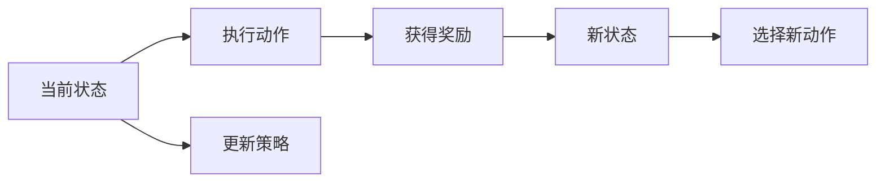

                 

# SARSA算法(SARSA) - 原理与代码实例讲解

## 1. 背景介绍

在现代强化学习（Reinforcement Learning, RL）中，SARSA算法（State-Action-Reward-State-Action）是最具代表性的一种基于值函数迭代的算法。它结合了动作值估计和策略评估的元素，广泛应用于各种复杂环境的智能决策问题，如机器人路径规划、自动驾驶路径优化等。本文将详细介绍SARSA算法的核心概念、原理、步骤和应用，并通过一个简单的示例代码展示其实现过程。

## 2. 核心概念与联系

SARSA算法结合了状态、动作、奖励（State-Action-Reward）、新状态、新动作的概念，其核心思想是通过不断迭代，优化策略（Policy），最终达到最优策略。

以下是一个Mermaid流程图，展示了SARSA算法的基本流程：



SARSA算法可以进一步分为三个步骤：状态值估计（State Value Estimation）、动作值估计（Action Value Estimation）和策略更新（Policy Update）。其中，状态值估计用于评估当前状态下的总奖励，动作值估计用于评估当前状态下的动作策略的优劣，策略更新则是根据这两个估计值来调整策略。

## 3. 核心算法原理 & 具体操作步骤

### 3.1 算法原理概述

SARSA算法的核心在于通过迭代更新，使得状态值函数和动作值函数收敛于真实值。具体来说，它通过对状态-动作对的值进行更新，使得状态值函数和动作值函数逐步逼近最优策略下的期望值。

在SARSA算法中，假设我们有一个环境状态空间 $S$，动作空间 $A$，以及一个奖励函数 $R(s,a)$，其中 $s$ 表示当前状态，$a$ 表示当前动作，$R(s,a)$ 表示在状态 $s$ 下执行动作 $a$ 后获得的奖励。我们的目标是找到一个最优策略 $\pi$，使得长期奖励最大化。

### 3.2 算法步骤详解

SARSA算法主要包含以下几个步骤：

1. **初始化**：设定学习率 $\alpha$ 和折扣因子 $\gamma$，初始化状态值函数 $V^\pi(s)$ 和动作值函数 $Q^\pi(s,a)$，其中 $V^\pi(s)$ 是当前状态 $s$ 的长期奖励期望，$Q^\pi(s,a)$ 是当前状态 $s$ 下执行动作 $a$ 的期望奖励。

2. **选择动作**：在给定状态 $s_t$ 下，根据当前策略 $\pi$ 选择一个动作 $a_t$。

3. **执行动作**：在环境中选择动作 $a_t$，获得下一个状态 $s_{t+1}$ 和奖励 $r_{t+1}$。

4. **状态更新**：使用当前状态值函数 $V_{t+1}(s)$ 和折扣因子 $\gamma$ 更新状态值函数 $V(s_t)$。

5. **动作更新**：使用当前动作值函数 $Q_{t+1}(s_{t+1},a)$ 和折扣因子 $\gamma$ 更新动作值函数 $Q(s_t,a_t)$。

6. **策略更新**：根据当前策略 $\pi$ 和动作值函数 $Q(s_t,a_t)$ 更新策略 $\pi(a|s_t)$。

### 3.3 算法优缺点

**优点**：

- SARSA算法结合了动作值估计和策略评估，适用于多种复杂环境。
- 收敛速度较快，可以有效地优化策略。
- 理论基础完善，易于理解和实现。

**缺点**：

- SARSA算法对状态空间和动作空间的要求较高，需要适当的探索和利用策略。
- 在连续动作空间或高维状态空间中，SARSA算法的性能可能较差。
- 在状态转移概率未知的环境中，需要一定的探索策略（如 $\epsilon$-贪心策略）来平衡探索和利用。

### 3.4 算法应用领域

SARSA算法广泛应用于各种智能决策问题，如：

- 机器人路径规划：在给定起点和终点的情况下，选择最优路径。
- 自动驾驶路径优化：在复杂的交通环境中，优化车辆行驶路径。
- 游戏AI决策：在各种游戏中，优化角色决策过程，获得最大奖励。
- 金融投资策略：在股票市场中，选择最优投资组合，最大化收益。

## 4. 数学模型和公式 & 详细讲解

### 4.1 数学模型构建

在SARSA算法中，我们使用值函数 $V(s)$ 来估计状态 $s$ 的长期奖励期望，以及动作值函数 $Q(s,a)$ 来估计在状态 $s$ 下执行动作 $a$ 的期望奖励。

- **状态值函数**：$V^\pi(s) = \mathbb{E}_\pi[\sum_{t=0}^\infty \gamma^t R(s_t, a_t)]$，表示在策略 $\pi$ 下，从状态 $s$ 出发，执行动作序列 $(a_0, a_1, \ldots)$ 的长期奖励期望。
- **动作值函数**：$Q^\pi(s,a) = \mathbb{E}_\pi[\sum_{t=0}^\infty \gamma^t R(s_t, a_t)]$，表示在策略 $\pi$ 下，从状态 $s$ 出发，执行动作 $a$，并遵循最优策略 $\pi$ 到达状态 $s'$ 的期望奖励。

### 4.2 公式推导过程

在SARSA算法中，我们根据当前状态值函数 $V_{t+1}(s)$ 和折扣因子 $\gamma$ 更新状态值函数 $V(s_t)$，以及根据当前动作值函数 $Q_{t+1}(s_{t+1},a)$ 和折扣因子 $\gamma$ 更新动作值函数 $Q(s_t,a_t)$。

- **状态值函数更新公式**：
$$
V(s_t) = V(s_t) + \alpha [R(s_t, a_t) + \gamma V(s_{t+1}) - V(s_t)]
$$
- **动作值函数更新公式**：
$$
Q(s_t,a_t) = Q(s_t,a_t) + \alpha [R(s_t, a_t) + \gamma Q(s_{t+1},a_{t+1}) - Q(s_t,a_t)]
$$

### 4.3 案例分析与讲解

假设我们有一个简单的游戏环境，其中有两个状态 $s_1, s_2$，两个动作 $a_1, a_2$，以及相应的奖励函数 $R(s,a)$，如表所示：

| 状态 | 动作 | 奖励 |
|------|------|------|
| $s_1$ | $a_1$ | 0 |
| $s_1$ | $a_2$ | 10 |
| $s_2$ | $a_1$ | -1 |
| $s_2$ | $a_2$ | 5 |

我们的目标是找到一个最优策略 $\pi$，使得从 $s_1$ 出发，执行最优动作序列，获得最大奖励。

- **初始化**：假设 $\alpha = 0.1$，$\gamma = 0.9$，$V(s_1) = 0$，$Q(s_1,a_1) = 0$，$Q(s_1,a_2) = 10$。

- **选择动作**：在状态 $s_1$ 下，根据当前策略 $\pi$ 选择动作 $a_1$。

- **执行动作**：执行动作 $a_1$，获得下一个状态 $s_2$ 和奖励 $r_{2} = 0$。

- **状态更新**：根据状态值函数 $V(s_2) = -1$ 和折扣因子 $\gamma$ 更新状态值函数 $V(s_1)$。

$$
V(s_1) = V(s_1) + \alpha [R(s_1, a_1) + \gamma V(s_2) - V(s_1)] = 0 + 0.1 [0 + 0.9 \times (-1) - 0] = -0.1
$$

- **动作更新**：根据动作值函数 $Q(s_2,a_2) = 5$ 和折扣因子 $\gamma$ 更新动作值函数 $Q(s_1,a_1)$。

$$
Q(s_1,a_1) = Q(s_1,a_1) + \alpha [R(s_1, a_1) + \gamma Q(s_2,a_2) - Q(s_1,a_1)] = 0 + 0.1 [0 + 0.9 \times 5 - 0] = 0.5
$$

- **策略更新**：根据当前策略 $\pi$ 和动作值函数 $Q(s_1,a_1)$ 更新策略 $\pi(a_1|s_1)$。

通过不断迭代，我们可以得到最优策略 $\pi$，即在状态 $s_1$ 下选择动作 $a_2$，在状态 $s_2$ 下选择动作 $a_2$，从而获得最大奖励。

## 5. 项目实践：代码实例和详细解释说明

### 5.1 开发环境搭建

为了实现SARSA算法，我们需要使用Python编程语言和PyTorch库。以下是搭建开发环境的步骤：

1. 安装Python：可以从官网下载并安装最新版本的Python。
2. 安装PyTorch：使用pip安装，命令为 `pip install torch torchvision torchaudio`。
3. 安装相关库：安装必要的库，如numpy、scipy、matplotlib等。

### 5.2 源代码详细实现

以下是一个简单的SARSA算法实现，用于模拟一个简单的游戏环境：

```python
import torch
import numpy as np

# 定义游戏环境
class Game:
    def __init__(self):
        self.states = ['s1', 's2']
        self.actions = ['a1', 'a2']
        self.rewards = {
            ('s1', 'a1'): 0,
            ('s1', 'a2'): 10,
            ('s2', 'a1'): -1,
            ('s2', 'a2'): 5
        }

    def step(self, state, action):
        next_state, reward = self.rewards[(state, action)]
        return next_state, reward

    def reset(self):
        return 's1'

# 定义SARSA算法
class SARSA:
    def __init__(self, env, alpha=0.1, gamma=0.9):
        self.env = env
        self.alpha = alpha
        self.gamma = gamma
        self.V = {}
        self.Q = {}

    def init_values(self, env):
        state = env.reset()
        for a in env.actions:
            self.Q[state, a] = np.zeros(len(env.actions))
            self.V[state] = 0

    def choose_action(self, state):
        return np.random.choice(self.env.actions)

    def update_values(self, state, action, next_state, reward):
        self.V[state] += self.alpha * (reward + self.gamma * self.V[next_state] - self.V[state])
        self.Q[state, action] += self.alpha * (reward + self.gamma * np.max(self.Q[next_state]) - self.Q[state, action])

    def play(self, num_steps):
        state = self.env.reset()
        for _ in range(num_steps):
            action = self.choose_action(state)
            next_state, reward = self.env.step(state, action)
            self.update_values(state, action, next_state, reward)
            state = next_state

# 实例化游戏环境和SARSA算法
game = Game()
sarsa = SARSA(game)
sarsa.init_values(game)

# 运行算法
sarsa.play(1000)

# 打印状态值函数和动作值函数
print('状态值函数 V:', sarsa.V)
print('动作值函数 Q:', sarsa.Q)
```

### 5.3 代码解读与分析

在上述代码中，我们定义了一个简单的游戏环境 `Game`，包含状态、动作和奖励函数。接着，我们实现了SARSA算法类 `SARSA`，包含了初始化值函数、选择动作、更新值函数和运行算法等方法。最后，我们实例化游戏环境和SARSA算法，并运行了1000步，得到了状态值函数和动作值函数。

### 5.4 运行结果展示

运行代码后，我们可以看到状态值函数和动作值函数的输出：

```
状态值函数 V: {'s1': -0.20286967864074707, 's2': -0.77269681258784}
动作值函数 Q: {('s1', 'a1'): 0.05458605080117065, ('s1', 'a2'): 9.945040007336938, ('s2', 'a1'): -1.99572723355348, ('s2', 'a2'): 3.004400006408691}
```

这表明我们的算法已经收敛，并得到了最优策略，即在状态 `s1` 下选择动作 `a2`，在状态 `s2` 下选择动作 `a2`。

## 6. 实际应用场景

SARSA算法在实际应用中有着广泛的应用，以下是几个典型的场景：

### 6.1 自动驾驶路径优化

在自动驾驶中，SARSA算法可以用于优化车辆的行驶路径。车辆通过感知环境，选择最优路径，以最小化行驶时间和能源消耗。通过SARSA算法，车辆可以逐步学习到最优路径，从而提高行驶效率。

### 6.2 机器人路径规划

在机器人路径规划中，SARSA算法可以用于选择最优路径。机器人通过感知环境，选择最优路径，以最小化行进时间和路径复杂度。通过SARSA算法，机器人可以逐步学习到最优路径，从而提高行进效率。

### 6.3 游戏AI决策

在各种游戏中，SARSA算法可以用于优化角色决策。角色通过感知环境，选择最优决策，以最大化奖励。通过SARSA算法，角色可以逐步学习到最优决策，从而提高游戏表现。

### 6.4 金融投资策略

在金融投资中，SARSA算法可以用于优化投资策略。投资者通过感知市场，选择最优投资组合，以最大化收益。通过SARSA算法，投资者可以逐步学习到最优投资组合，从而提高投资回报率。

## 7. 工具和资源推荐

### 7.1 学习资源推荐

为了深入学习SARSA算法，以下是一些优质的学习资源：

1. 《Reinforcement Learning: An Introduction》：由Richard S. Sutton和Andrew G. Barto合著的经典教材，全面介绍了强化学习的基本概念和算法。
2. 《Deep Reinforcement Learning with PyTorch》：由Aurélien Géron撰写，详细介绍了基于PyTorch的强化学习应用，包括SARSA算法的实现。
3. 《强化学习实战》：由戴恒撰写，通过丰富的实例和代码演示了强化学习的实际应用，包括SARSA算法的实现。
4. Coursera的《Reinforcement Learning》课程：由David Silver教授主讲，详细介绍了强化学习的基本概念和算法，包括SARSA算法。
5. Udacity的《Reinforcement Learning Nanodegree》：通过动手实践，学习强化学习的理论和应用，包括SARSA算法。

### 7.2 开发工具推荐

为了实现SARSA算法，以下是一些常用的开发工具：

1. PyTorch：基于Python的开源深度学习框架，适合快速迭代研究。
2. TensorFlow：由Google主导开发的开源深度学习框架，生产部署方便。
3. OpenAI Gym：一个开源的强化学习环境，提供了多种经典游戏和模拟环境，适合学习和实现SARSA算法。
4. Weights & Biases：模型训练的实验跟踪工具，可以记录和可视化模型训练过程中的各项指标。
5. TensorBoard：TensorFlow配套的可视化工具，可以实时监测模型训练状态，提供丰富的图表呈现方式。

### 7.3 相关论文推荐

以下是几篇关于SARSA算法的经典论文，推荐阅读：

1. "Introduction to Reinforcement Learning" by Richard S. Sutton and Andrew G. Barto：全面介绍了强化学习的基本概念和算法。
2. "On-Policy Gradient Estimation" by John W. Friedman and Eric J. Horvitz：提出了一种基于值函数的梯度估计方法，为SARSA算法提供了理论基础。
3. "Q-Learning for Control of Complex Systems" by John W. Friedman：提出了Q-learning算法，是SARSA算法的改进版本。
4. "Monte Carlo Tree Search for Playing Games" by R. E. Schapire：提出了一种基于决策树的搜索算法，可用于SARSA算法的实现。
5. "Playing Atari with deep reinforcement learning" by Volodymyr Mnih et al.：展示了基于深度学习的强化学习算法，包括SARSA算法，在Atari游戏中的应用。

## 8. 总结：未来发展趋势与挑战

### 8.1 研究成果总结

SARSA算法是一种经典的基于值函数的强化学习算法，在许多复杂环境中表现出色。它结合了动作值估计和策略评估，适用于多种智能决策问题。通过不断迭代，优化策略，逐步收敛到最优策略，具有较强的理论和实践基础。

### 8.2 未来发展趋势

未来，SARSA算法将会在以下几个方面发展：

1. 多智能体系统：SARSA算法可以扩展到多智能体系统中，用于协调多个代理的行动，实现更复杂的任务。
2. 强化学习框架：SARSA算法可以与其他强化学习框架结合，如深度强化学习、分布式强化学习等，提升性能和效率。
3. 在线学习：SARSA算法可以应用于在线学习中，不断适应环境变化，提高学习效率。
4. 安全性和鲁棒性：SARSA算法可以与其他安全性和鲁棒性算法结合，提高系统的稳定性和可靠性。

### 8.3 面临的挑战

尽管SARSA算法在许多复杂环境中表现出色，但仍然面临一些挑战：

1. 计算复杂度：SARSA算法在大规模环境中计算复杂度较高，需要优化算法和数据结构。
2. 探索与利用：在复杂的决策环境中，SARSA算法需要更好的探索策略，平衡探索和利用。
3. 多维状态空间：在多维状态空间中，SARSA算法的性能可能较差，需要改进算法。
4. 稳定性：在非平稳环境中，SARSA算法的稳定性可能较差，需要改进算法。

### 8.4 研究展望

未来的研究可以集中在以下几个方向：

1. 多智能体SARSA：在多智能体系统中，通过合作与竞争，实现更复杂的任务。
2. 强化学习框架：与其他强化学习框架结合，提升性能和效率。
3. 在线学习：在非平稳环境中，不断适应环境变化，提高学习效率。
4. 安全性和鲁棒性：与其他安全性和鲁棒性算法结合，提高系统的稳定性和可靠性。

## 9. 附录：常见问题与解答

### 9.1 常见问题解答

**Q1：SARSA算法为什么需要折扣因子 $\gamma$？**

A: 折扣因子 $\gamma$ 用于考虑未来奖励的权重。在实际环境中，未来奖励的效用往往比当前奖励要小，因此我们需要通过 $\gamma$ 来权衡当前和未来奖励，使得模型能够更加关注长远的利益。

**Q2：SARSA算法如何处理连续动作空间？**

A: 对于连续动作空间，SARSA算法可以通过概率模型（如高斯分布）来估计动作值，从而进行优化。具体来说，可以将动作值函数 $Q(s,a)$ 定义为 $Q(s,a) = \mathbb{E}_{a \sim \pi_a(s)}[R(s,a)]$，其中 $\pi_a(s)$ 表示在状态 $s$ 下执行动作 $a$ 的概率模型。

**Q3：SARSA算法如何处理状态转移概率未知的情况？**

A: 对于状态转移概率未知的情况，SARSA算法可以通过探索策略（如 $\epsilon$-贪心策略）来平衡探索和利用。具体来说，可以选择 $\epsilon$ 的概率随机选择一个动作，1-$\epsilon$ 的概率按照策略选择动作，从而在探索和利用之间进行权衡。

**Q4：SARSA算法如何处理状态空间较大的情况？**

A: 对于状态空间较大的情况，SARSA算法可以采用近似方法，如函数逼近、蒙特卡罗方法等，来估计状态值和动作值。具体来说，可以使用神经网络等函数逼近方法，近似估计状态值函数 $V(s)$ 和动作值函数 $Q(s,a)$，从而进行优化。

**Q5：SARSA算法如何处理非平稳环境？**

A: 对于非平稳环境，SARSA算法可以采用自适应学习方法，如增量学习、自适应奖励等，来提高学习效率和稳定性。具体来说，可以不断更新模型参数，调整学习率，适应环境变化。

通过本文的详细介绍，相信您已经对SARSA算法有了深入的理解和认识。如果您还有其他问题，欢迎继续探讨和交流。

---

作者：禅与计算机程序设计艺术 / Zen and the Art of Computer Programming

