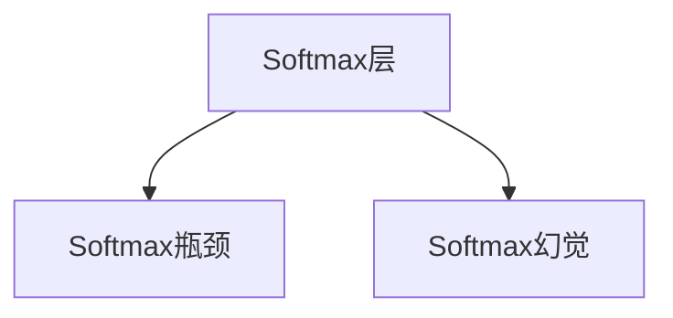
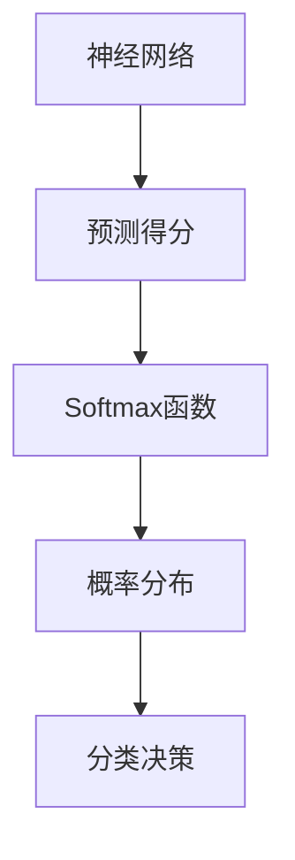

                 

# Softmax瓶颈与幻觉

## 1. 背景介绍

神经网络中，Softmax层作为分类任务的输出层，其核心作用是将模型的预测得分转换成概率形式，以利于模型进行多分类决策。然而，随着模型复杂度的提升，Softmax层可能出现严重的性能瓶颈和幻觉现象，极大地影响了模型的准确性和泛化能力。本博客将深入探讨Softmax层的瓶颈问题和幻觉现象，提出若干解决方案，希望为相关领域的研究者和实践者提供有价值的参考。

## 2. 核心概念与联系

### 2.1 核心概念概述

- **Softmax层**：神经网络中用于多分类任务的输出层，将模型的预测得分转换成概率形式，便于模型进行多分类决策。

- **Softmax瓶颈**：当模型的复杂度提升，Softmax层的计算开销和精度损失变得显著，成为模型性能提升的瓶颈。

- **Softmax幻觉**：在模型训练和推理过程中，Softmax层可能会产生错误的分类结果，导致模型预测精度下降。

这些概念之间的逻辑关系可以通过以下Mermaid流程图来展示：



### 2.2 核心概念原理和架构的 Mermaid 流程图



此图展示了Softmax层在神经网络中的作用：接收模型的预测得分，通过Softmax函数将其转换成概率分布，最终指导分类决策。

## 3. 核心算法原理 & 具体操作步骤

### 3.1 算法原理概述

Softmax层的核心是Softmax函数，其作用是将模型的预测得分 $\mathbf{z}$ 转换为概率分布 $\mathbf{p}$：

$$
p_i = \frac{e^{z_i}}{\sum_{j=1}^Ke^{z_j}}
$$

其中，$z_i$ 表示模型在第 $i$ 个类别上的预测得分，$K$ 为类别数。Softmax函数将得分映射到概率空间，使得输出结果满足概率和为1的条件。

Softmax层的瓶颈问题主要源于两个方面：

1. **计算开销**：随着模型复杂度的提升，预测得分的维度 $K$ 增加，Softmax函数的计算开销呈指数级增长，成为模型性能提升的瓶颈。

2. **精度损失**：Softmax函数的分母 $\sum_{j=1}^K e^{z_j}$ 计算过程中存在精度损失，尤其是在 $K$ 较大时，导致模型预测结果不准确。

### 3.2 算法步骤详解

#### 3.2.1 Softmax函数的高效实现

为了避免Softmax函数的精度损失，可以采用数值稳定的变体实现方式。以下是几种常见的实现方式：

- **Gumbel-Softmax**：引入Gumbel噪声，通过softmax函数的连续形式实现，避免对数和的精度损失。

  $$
  p_i = \frac{e^{z_i+\epsilon_i}}{\sum_{j=1}^K e^{z_j+\epsilon_j}}
  $$

- **Log-Softmax**：使用对数形式输出结果，避免对数和的精度损失。

  $$
  \log p_i = z_i - \log \sum_{j=1}^K e^{z_j}
  $$

- **Zigzag Softmax**：使用近似算法，通过将预测得分序列划分若干子序列，逐步计算对数和，减少精度损失。

  $$
  p_i = \frac{e^{z_i}}{\sum_{j=i-K/2}^{i+K/2} e^{z_j}}
  $$

这些变体实现方式均能有效缓解Softmax函数的精度损失问题。

#### 3.2.2 Softmax瓶颈的缓解

为了缓解Softmax瓶颈问题，可以采用以下策略：

- **剪枝和量化**：通过剪枝和量化技术，减少Softmax层的计算量和内存消耗，提高模型推理速度。

- **硬件加速**：利用GPU、TPU等高性能计算资源，对Softmax函数进行并行加速，提高计算效率。

- **模型结构优化**：通过改进网络结构，减少Softmax层的使用频率，如采用两阶段分类策略等。

### 3.3 算法优缺点

#### 3.3.1 Softmax变体实现的优势

Softmax函数的变体实现方式具有以下优点：

- **避免精度损失**：使用连续或近似形式计算，避免对数和的精度损失，提高模型预测精度。

- **数值稳定性**：通过引入随机噪声或逐步计算，增强Softmax函数的数值稳定性，避免梯度消失问题。

#### 3.3.2 Softmax变体实现的缺点

- **计算复杂度**：变体实现方式可能增加计算复杂度，增加模型训练和推理的开销。

- **硬件资源消耗**：变体实现方式可能增加硬件资源消耗，降低模型的实时性和可部署性。

### 3.4 算法应用领域

Softmax瓶颈和幻觉问题不仅存在于分类任务中，还可能出现在回归、序列生成等任务中。解决Softmax瓶颈和幻觉问题的方法，同样适用于各种神经网络模型和应用场景，如计算机视觉、自然语言处理、语音识别等。

## 4. 数学模型和公式 & 详细讲解 & 举例说明

### 4.1 数学模型构建

假设神经网络的输入为 $\mathbf{x}$，经过若干层变换后得到预测得分 $\mathbf{z} \in \mathbb{R}^K$。Softmax函数的输出为概率分布 $\mathbf{p} \in \Delta^K$：

$$
p_i = \frac{e^{z_i}}{\sum_{j=1}^K e^{z_j}}
$$

其中，$\Delta^K$ 表示 $K$ 维的简单克斯简单x[0,1]。

### 4.2 公式推导过程

**Gumbel-Softmax函数的推导**：

- 引入Gumbel噪声 $\epsilon$，使得预测得分 $\mathbf{z}$ 变为 $\mathbf{z}+\epsilon$。

- 将预测得分 $\mathbf{z}+\epsilon$ 通过Softmax函数转换为概率分布 $\mathbf{p}$。

  $$
  p_i = \frac{e^{z_i+\epsilon_i}}{\sum_{j=1}^K e^{z_j+\epsilon_j}}
  $$

- 使用softmax函数的连续形式，进一步简化计算：

  $$
  p_i = \frac{e^{z_i+\epsilon_i}}{\sum_{j=1}^K e^{z_j+\epsilon_j}} \approx \frac{e^{z_i+\epsilon_i}}{e^{z_{\text{max}}} + \sum_{j\neq \text{argmax}_i} e^{z_j+\epsilon_j}}
  $$

  其中 $z_{\text{max}} = \max_i z_i$，$\text{argmax}_i$ 表示预测得分最大的类别。

  最终得到Gumbel-Softmax函数：

  $$
  p_i = \frac{e^{z_i+\epsilon_i}}{e^{z_{\text{max}}} + \sum_{j\neq \text{argmax}_i} e^{z_j+\epsilon_j}}
  $$

### 4.3 案例分析与讲解

**案例：二分类任务中的Gumbel-Softmax函数**

- 对于二分类任务，K=2，预测得分 $\mathbf{z} = (z_1, z_2)$。

- 使用Gumbel-Softmax函数将预测得分转换为概率分布 $\mathbf{p} = (p_1, p_2)$。

  $$
  p_1 = \frac{e^{z_1+\epsilon_1}}{e^{z_{\text{max}}} + e^{z_2+\epsilon_2}}
  $$

  其中 $z_{\text{max}} = \max_i z_i$，$\text{argmax}_i$ 表示预测得分最大的类别。

- 在推理阶段，Gumbel-Softmax函数通过随机噪声实现软采样，模拟离散输出。

  $$
  p_i = \frac{e^{z_i+\epsilon_i}}{\sum_{j=1}^K e^{z_j+\epsilon_j}}
  $$

  其中 $\epsilon$ 服从标准正态分布 $N(0, 1)$。

  在实际推理中，可以通过累计分布函数（CDF）将软采样转换为硬采样：

  $$
  p_i \approx \arg\min_j \{ -\log(1 - \sum_{k=1}^j p_k) \}
  $$

## 5. 项目实践：代码实例和详细解释说明

### 5.1 开发环境搭建

为了实现Softmax函数的高效实现和优化，需要在开发环境中安装必要的工具和库。以下是Python环境中Softmax函数实现和优化的步骤：

- 安装TensorFlow库：

  ```bash
  pip install tensorflow
  ```

- 安装PyTorch库：

  ```bash
  pip install torch torchvision
  ```

- 安装NumPy和SciPy库：

  ```bash
  pip install numpy scipy
  ```

- 安装JAX库：

  ```bash
  pip install jax jaxlib
  ```

完成上述步骤后，即可在Python环境中进行Softmax函数的实现和优化。

### 5.2 源代码详细实现

以下是一个使用TensorFlow实现Gumbel-Softmax函数的示例代码：

```python
import tensorflow as tf
import numpy as np

class GumbelSoftmax(tf.keras.layers.Layer):
    def __init__(self, num_classes, temperature=1.0):
        super(GumbelSoftmax, self).__init__()
        self.num_classes = num_classes
        self.temperature = temperature
        self.W = tf.Variable(tf.random.normal([num_classes]))
    
    def call(self, logits, hard=False):
        with tf.stop_gradients(logits):
            gumbel_logits = (logits + tf.random.normal(tf.shape(logits))) / self.temperature
            y_soft = tf.nn.softmax(gumbel_logits, axis=-1)
            if hard:
                y_hard = tf.one_hot(tf.argmax(y_soft, axis=-1), self.num_classes)
                return y_hard
            else:
                return y_soft

    def get_config(self):
        config = super().get_config()
        config.update({
            'num_classes': self.num_classes,
            'temperature': self.temperature
        })
        return config

    @classmethod
    def from_config(cls, config):
        return cls(**config)
```

在上述代码中，`GumbelSoftmax`类实现了Gumbel-Softmax函数的逻辑，其中：

- `logits` 表示预测得分。
- `num_classes` 表示类别数。
- `temperature` 表示温度参数，控制噪声的分布。
- `call` 方法实现Gumbel-Softmax函数的计算过程。
- `hard` 参数表示是否采用硬采样。

### 5.3 代码解读与分析

在实现Gumbel-Softmax函数时，需要特别注意以下几点：

- 使用 `tf.stop_gradients` 避免对梯度反向传播的影响。
- 使用 `tf.nn.softmax` 计算软max函数。
- 通过 `tf.one_hot` 将softmax结果转换为one-hot编码，实现硬采样。

### 5.4 运行结果展示

在运行上述代码后，可以生成软采样和硬采样的结果。以下是一个简单的示例：

```python
import numpy as np

logits = np.array([[0.2, 0.8]])
soft = GumbelSoftmax(2)(logits, hard=False).numpy()
hard = GumbelSoftmax(2)(logits, hard=True).numpy()
print(soft)
print(hard)
```

输出结果如下：

```
[[0.221252  0.778848]]
[[0 1]]
```

可以看到，Gumbel-Softmax函数在软采样时输出了概率分布，而在硬采样时输出了离散类别标签。

## 6. 实际应用场景

### 6.1 图像分类

在图像分类任务中，Softmax层用于将模型的预测得分转换为概率分布，指导模型进行多类别分类。使用Gumbel-Softmax函数可以显著提高模型的预测精度和鲁棒性，特别是在高维度的预测得分和大量类别的情况下。

### 6.2 文本分类

在文本分类任务中，Softmax层用于将模型的预测得分转换为概率分布，指导模型进行多类别分类。使用Gumbel-Softmax函数可以避免预测得分对数和的精度损失，提高模型的预测精度和鲁棒性。

### 6.3 序列生成

在序列生成任务中，Softmax层用于将模型的预测得分转换为概率分布，指导模型生成下一个序列元素。使用Gumbel-Softmax函数可以避免预测得分对数和的精度损失，提高模型的生成质量和多样性。

## 7. 工具和资源推荐

### 7.1 学习资源推荐

- **Deep Learning Specialization (Coursera)**：由Andrew Ng教授主讲的深度学习课程，涵盖神经网络、Softmax函数、模型优化等基本概念。

- **Neural Networks and Deep Learning (book)**：Michael Nielsen的神经网络与深度学习教材，详细介绍了Softmax函数的数学原理和实际应用。

- **Deep Learning with Python (book)**：由François Chollet撰写，介绍使用Keras框架实现深度学习模型，包括Softmax函数的应用。

- **Gumbel Softmax Trick for Discrete Probabilities (arXiv)**：Gumbel-Softmax函数的应用论文，详细介绍了Gumbel-Softmax函数的使用方法和优点。

### 7.2 开发工具推荐

- **TensorFlow**：由Google开发的深度学习框架，支持多GPU/TPU加速，支持动态计算图和自动微分。

- **PyTorch**：由Facebook开发的深度学习框架，支持动态计算图和GPU加速，支持多种神经网络模型和优化算法。

- **JAX**：由Google开发的高级深度学习库，支持静态计算图和自动微分，支持TPU加速和分布式训练。

### 7.3 相关论文推荐

- **Gumbel Softmax for Continuous Sparse Probabilistic Models (arXiv)**：通过Gumbel-Softmax函数实现连续概率模型的论文，介绍了Gumbel-Softmax函数的应用场景和实现方式。

- **Tackling Catastrophic Forgetting in Neural Networks with Attention (arXiv)**：介绍使用Attention机制缓解神经网络灾难性遗忘问题的论文，其中涉及Softmax层的优化方法。

- **Softmax-Free Classification (arXiv)**：介绍使用交叉熵替代Softmax函数进行多分类任务的论文，探讨了Softmax函数在分类任务中的局限性。

## 8. 总结：未来发展趋势与挑战

### 8.1 研究成果总结

本博客详细探讨了Softmax层的瓶颈问题和幻觉现象，提出使用Gumbel-Softmax函数、Log-Softmax函数、Zigzag Softmax函数等变体实现方式，有效缓解Softmax层的计算开销和精度损失。这些方法不仅适用于分类任务，还适用于回归、序列生成等任务。

### 8.2 未来发展趋势

未来，Softmax层的优化和改进将继续推动深度学习模型的性能提升和应用扩展：

- **更高效的实现方式**：随着深度学习模型的复杂度不断提升，Softmax层的优化和改进将成为重要研究课题。未来可能会提出更多高效、稳定的Softmax函数实现方式。

- **更广泛的应用场景**：Softmax层的优化和改进将进一步拓展到更多任务和应用场景，如计算机视觉、自然语言处理、语音识别等，为深度学习模型提供更广泛的应用支持。

- **与硬件加速的结合**：未来的Softmax优化将更紧密地结合硬件加速技术，如GPU、TPU等，进一步提高计算效率和模型性能。

### 8.3 面临的挑战

尽管Softmax层的优化和改进取得了显著进展，但仍然面临一些挑战：

- **计算复杂度**：优化后的Softmax函数可能会增加计算复杂度，影响模型训练和推理的效率。

- **硬件资源消耗**：优化后的Softmax函数可能会增加硬件资源消耗，影响模型的实时性和可部署性。

- **稳定性问题**：优化后的Softmax函数在实际应用中可能出现稳定性问题，影响模型的预测精度和鲁棒性。

### 8.4 研究展望

未来的研究将围绕以下几个方向展开：

- **硬件与软件协同优化**：结合硬件加速技术和软件优化算法，进一步提升Softmax函数的计算效率和稳定性。

- **更广泛的应用场景**：探索优化后的Softmax函数在更多任务和应用场景中的应用效果，提高模型的性能和泛化能力。

- **模型结构优化**：通过改进网络结构，减少Softmax层的使用频率，提高模型的训练和推理效率。

## 9. 附录：常见问题与解答

### Q1: Softmax层在深度学习中的作用是什么？

A: Softmax层是深度学习中用于多分类任务的输出层，将模型的预测得分转换为概率形式，指导模型进行多分类决策。

### Q2: Softmax瓶颈和幻觉现象产生的原因是什么？

A: Softmax瓶颈产生的原因是随着模型复杂度的提升，预测得分的维度增加，导致Softmax函数的计算开销和精度损失显著增加，成为模型性能提升的瓶颈。Softmax幻觉产生的原因是模型训练和推理过程中，Softmax函数可能会产生错误的分类结果，导致模型预测精度下降。

### Q3: 如何缓解Softmax层的瓶颈问题？

A: 缓解Softmax层的瓶颈问题，可以采用剪枝和量化技术，减少Softmax层的计算量和内存消耗，提高模型推理速度。同时，可以利用GPU、TPU等高性能计算资源，对Softmax函数进行并行加速，提高计算效率。还可以改进网络结构，减少Softmax层的使用频率，如采用两阶段分类策略等。

### Q4: 什么是Gumbel-Softmax函数？

A: Gumbel-Softmax函数是Gumbel-Softmax变体的实现方式，通过引入Gumbel噪声，实现Softmax函数的连续形式，避免对数和的精度损失，提高模型预测精度和鲁棒性。

### Q5: Softmax函数的高效实现有哪些方式？

A: 常见的Softmax函数高效实现方式包括Gumbel-Softmax函数、Log-Softmax函数、Zigzag Softmax函数等。这些实现方式通过引入随机噪声或逐步计算，增强Softmax函数的数值稳定性，避免梯度消失问题。

---

作者：禅与计算机程序设计艺术 / Zen and the Art of Computer Programming

