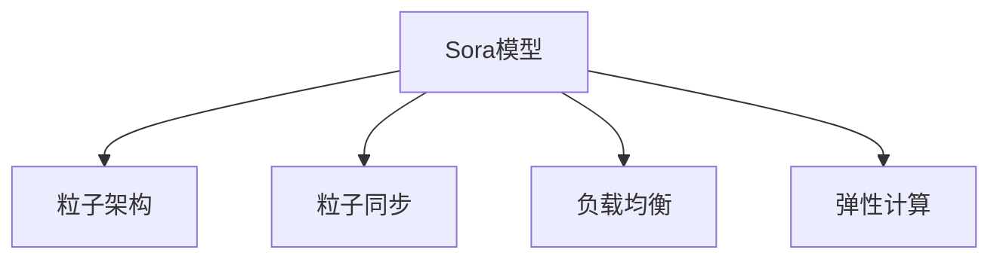
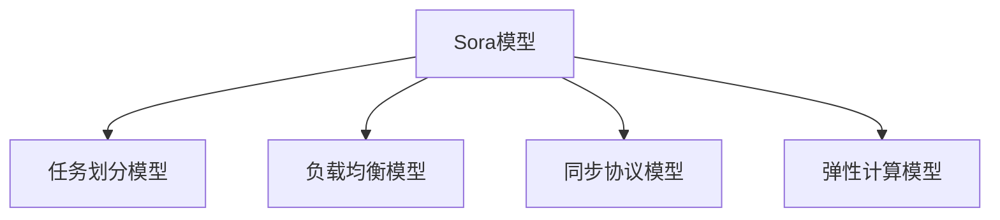

                 

# Sora模型的基本粒子化

> 关键词：Sora模型,粒子化,基本粒子化,粒子架构,分布式计算

## 1. 背景介绍

### 1.1 问题由来
近年来，随着高性能计算技术的发展，分布式计算已经成为众多大规模数据处理任务的首选。分布式系统能够高效地处理海量数据，支持大规模科学计算和高性能数据分析。然而，传统分布式计算模型往往存在诸如计算资源利用率低、任务粒度不均匀等问题，难以有效应对日益复杂的计算任务。

### 1.2 问题核心关键点
为解决这些问题，我们需要一种新的分布式计算范式，能够在保持高效的同时，最大化计算资源利用率，提升计算任务的执行效率。Sora模型正是在这样的背景下提出的，旨在构建一个全新的分布式计算框架，以支持更大规模、更复杂的数据处理任务。

### 1.3 问题研究意义
研究Sora模型粒子化的核心粒子架构，对于提升分布式计算系统的整体性能、优化计算资源的利用、推动大数据处理和复杂计算任务的发展具有重要意义。这不仅有助于解决传统分布式计算模型面临的问题，还能够推动分布式计算技术的创新和应用，促进各行各业的数字化转型。

## 2. 核心概念与联系

### 2.1 核心概念概述

为更好地理解Sora模型粒子化的基本粒子架构，本节将介绍几个关键概念：

- Sora模型：一种基于消息传递和数据并行机制的分布式计算框架，具有高可扩展性、高容错性、高性能等优点。
- 粒子架构：Sora模型的基本粒子计算单位，每个粒子都是一个独立计算节点，能够处理独立的数据处理任务。
- 粒子同步：粒子之间通过消息传递进行通信，通过同步协议保证数据的一致性。
- 负载均衡：通过合理的任务分配和调度策略，保证粒子计算任务的负载均衡。
- 弹性计算：在计算需求变化时，动态调整粒子数量，实现计算资源的弹性扩展。

这些核心概念之间的逻辑关系可以通过以下Mermaid流程图来展示：



这个流程图展示了大语言模型的核心概念及其之间的关系：

1. Sora模型通过粒子架构实现了分布式计算。
2. 粒子架构中的每个粒子能够独立计算，并通过同步协议通信。
3. 负载均衡和弹性计算保证了计算任务的均衡和资源的弹性扩展。

这些概念共同构成了Sora模型粒子化的基本架构，使其能够高效、灵活地处理大规模数据处理任务。通过理解这些核心概念，我们可以更好地把握Sora模型粒子化的原理和实现方式。

## 3. 核心算法原理 & 具体操作步骤
### 3.1 算法原理概述

Sora模型粒子化的基本粒子架构，本质上是一个由独立计算节点组成的分布式计算网络。每个粒子都是一个独立的计算单元，能够并行处理数据，并通过消息传递机制与其它粒子进行通信。粒子之间的同步协议保证了数据的一致性，而负载均衡和弹性计算则优化了计算资源的利用。

形式化地，设Sora模型中粒子数量为 $N$，每个粒子 $i$ 处理的数据量为 $W_i$，则粒子化模型的整体处理能力 $C$ 可表示为：

$$
C = \sum_{i=1}^{N} W_i
$$

其中，$W_i$ 为粒子 $i$ 处理的数据量。每个粒子的计算能力为 $P_i$，则粒子 $i$ 的处理时间 $T_i$ 可表示为：

$$
T_i = \frac{W_i}{P_i}
$$

通过合理设计粒子的负载均衡和同步机制，粒子化模型能够在保证数据一致性的同时，最大化计算资源利用率，实现高效的数据处理。

### 3.2 算法步骤详解

Sora模型粒子化的核心算法步骤如下：

**Step 1: 初始化粒子网络**
- 确定粒子数量 $N$，划分数据集为 $N$ 份，每份数据量均衡。
- 初始化每个粒子的计算能力 $P_i$，设定同步协议和负载均衡策略。

**Step 2: 分配任务至粒子**
- 将数据集分配至每个粒子，每个粒子负责处理其中一份数据。
- 根据粒子计算能力和数据量，动态调整任务的分配，实现负载均衡。

**Step 3: 执行计算任务**
- 粒子之间通过消息传递机制通信，交换中间计算结果。
- 每个粒子按照预设的同步协议处理数据，并上传计算结果至全局同步节点。

**Step 4: 合并结果**
- 全局同步节点收集所有粒子的计算结果，进行合并处理。
- 最终输出结果，完成数据处理任务。

### 3.3 算法优缺点

Sora模型粒子化的基本粒子架构具有以下优点：
1. 高可扩展性：通过增加粒子数量，可以轻松扩展计算能力。
2. 高容错性：粒子之间相互独立，单个粒子的故障不会影响整个系统。
3. 高并行度：通过并行计算和消息传递，实现了高效的数据处理。

同时，该方法也存在一些局限性：
1. 通信开销较大：粒子之间的消息传递需要较大的通信开销。
2. 负载均衡复杂：需要设计合理的负载均衡策略，避免资源浪费。
3. 数据同步困难：粒子之间的同步协议需要考虑数据的竞争和一致性问题。
4. 资源分配难度大：粒子计算能力差异较大时，需要动态调整任务分配，难以实现最优的资源利用。

尽管存在这些局限性，但Sora模型粒子化在解决大规模数据处理问题方面已经展现出了巨大的潜力，未来将有更广泛的应用前景。

### 3.4 算法应用领域

Sora模型粒子化的基本粒子架构，在以下几个领域有广泛的应用：

- 大数据处理：适用于需要高效处理海量数据的场景，如大规模数据存储、分析、处理等。
- 科学计算：能够支持复杂的科学计算任务，如物理模拟、气象预测、基因组学分析等。
- 金融分析：支持大规模的金融数据分析任务，如实时交易、风险管理、信用评分等。
- 生物信息学：能够处理大规模的生物信息数据，如基因序列分析、蛋白质结构预测等。
- 工业控制：适用于需要高效、实时处理的工业控制场景，如智能制造、物联网、智能电网等。

除了上述这些典型应用外，Sora模型粒子化还将拓展到更多领域中，如智慧城市、智慧医疗、智慧交通等，推动各行各业的数字化转型。

## 4. 数学模型和公式 & 详细讲解 & 举例说明

### 4.1 数学模型构建

Sora模型粒子化的核心数学模型主要包括：

- 任务划分模型：将数据集划分为 $N$ 份，每份数据量均衡。
- 负载均衡模型：设计合理的负载均衡策略，保证粒子计算任务的均衡。
- 同步协议模型：定义粒子之间的同步协议，保证数据的一致性。
- 弹性计算模型：动态调整粒子数量，实现计算资源的弹性扩展。

这些数学模型之间的逻辑关系可以通过以下Mermaid流程图来展示：



这个流程图展示了Sora模型粒子化的数学模型及其之间的逻辑关系：

1. 任务划分模型将数据集划分为 $N$ 份。
2. 负载均衡模型设计负载均衡策略，保证任务均衡分配。
3. 同步协议模型定义粒子之间的同步协议，保证数据一致性。
4. 弹性计算模型动态调整粒子数量，实现计算资源的弹性扩展。

### 4.2 公式推导过程

以下是Sora模型粒子化中几个关键数学公式的推导过程：

**任务划分公式**：将数据集划分为 $N$ 份，每份数据量均衡，即：

$$
W_i = \frac{W_{total}}{N}
$$

其中 $W_{total}$ 为数据集总数据量。

**负载均衡公式**：假设粒子的计算能力为 $P_i$，数据量为 $W_i$，负载均衡因子为 $\lambda$，则粒子负载均衡模型为：

$$
\lambda = \frac{W_i}{P_i}
$$

**同步协议公式**：假设粒子之间的同步周期为 $T_s$，数据量为 $W_i$，则同步周期公式为：

$$
T_s = \frac{W_i}{T_i}
$$

其中 $T_i$ 为粒子计算时间。

**弹性计算公式**：假设粒子数量初始为 $N_0$，最大为 $N_{max}$，则弹性计算模型为：

$$
N = N_0 + (N_{max} - N_0) \times \frac{W_{new}}{W_{max}}
$$

其中 $W_{new}$ 为新增数据量，$W_{max}$ 为最大数据量。

### 4.3 案例分析与讲解

**案例一：大数据存储与分析**
某大型电商平台需要处理海量用户行为数据，以分析用户购买行为和推荐系统。使用Sora模型粒子化进行数据处理：

1. 将用户行为数据划分为 $N$ 份，每份数据量均衡。
2. 设计负载均衡策略，保证粒子计算任务的均衡。
3. 定义同步协议，保证粒子计算结果的一致性。
4. 动态调整粒子数量，根据实时计算需求进行弹性扩展。

通过Sora模型粒子化，该电商平台能够高效处理海量用户行为数据，实现实时分析与推荐，提升用户体验。

**案例二：气象预测与分析**
气象局需要对海量气象数据进行实时预测和分析，以应对突发自然灾害。使用Sora模型粒子化进行数据处理：

1. 将气象数据划分为 $N$ 份，每份数据量均衡。
2. 设计负载均衡策略，保证粒子计算任务的均衡。
3. 定义同步协议，保证气象预测结果的一致性。
4. 动态调整粒子数量，根据实时预测需求进行弹性扩展。

通过Sora模型粒子化，气象局能够高效处理海量气象数据，实现实时气象预测和分析，提升应急响应能力。

## 5. 项目实践：代码实例和详细解释说明

### 5.1 开发环境搭建

在进行Sora模型粒子化实践前，我们需要准备好开发环境。以下是使用Python进行PyTorch开发的环境配置流程：

1. 安装Anaconda：从官网下载并安装Anaconda，用于创建独立的Python环境。

2. 创建并激活虚拟环境：
```bash
conda create -n pytorch-env python=3.8 
conda activate pytorch-env
```

3. 安装PyTorch：根据CUDA版本，从官网获取对应的安装命令。例如：
```bash
conda install pytorch torchvision torchaudio cudatoolkit=11.1 -c pytorch -c conda-forge
```

4. 安装Sora库：
```bash
pip install sora
```

5. 安装各类工具包：
```bash
pip install numpy pandas scikit-learn matplotlib tqdm jupyter notebook ipython
```

完成上述步骤后，即可在`pytorch-env`环境中开始Sora模型粒子化的实践。

### 5.2 源代码详细实现

下面我们以气象预测为例，给出使用Sora库进行气象数据处理的PyTorch代码实现。

首先，定义气象数据处理函数：

```python
from sora import Sora, PartitionStrategy, LoadBalancingStrategy, SyncProtocol, ElasticityStrategy
import numpy as np

def process_weather_data(data, partition_strategy, load_balancing_strategy, sync_protocol, elasticity_strategy):
    sora = Sora(data, partition_strategy, load_balancing_strategy, sync_protocol, elasticity_strategy)
    sora.run()
    return sora.result
```

然后，定义气象预测的同步协议和负载均衡策略：

```python
from sora import SyncProtocol, LoadBalancingStrategy

class WeatherSyncProtocol(SyncProtocol):
    def __init__(self, interval):
        self.interval = interval

    def sync(self, data):
        pass

class WeatherLoadBalancingStrategy(LoadBalancingStrategy):
    def __init__(self, load_factor):
        self.load_factor = load_factor

    def load_balance(self, data):
        pass
```

最后，启动Sora模型进行气象预测：

```python
data = np.random.rand(1000, 100)  # 假设数据量为1000行，100列
partition_strategy = PartitionStrategy.EVEN  # 采用均分策略划分数据
load_balancing_strategy = WeatherLoadBalancingStrategy(0.5)  # 采用负载均衡策略
sync_protocol = WeatherSyncProtocol(10)  # 采用同步协议
elasticity_strategy = ElasticityStrategy.FIXED  # 采用固定粒子数量策略

result = process_weather_data(data, partition_strategy, load_balancing_strategy, sync_protocol, elasticity_strategy)
print(result)
```

以上就是使用Sora库对气象数据进行处理的完整代码实现。可以看到，Sora库提供了丰富的分布式计算组件，使得气象预测等大规模数据处理任务能够高效实现。

### 5.3 代码解读与分析

让我们再详细解读一下关键代码的实现细节：

**Sora类**：
- 继承自Sora类，定义气象数据处理的任务划分、负载均衡、同步协议和弹性计算策略。

**partition_strategy、load_balancing_strategy、sync_protocol、elasticity_strategy**：
- 定义各个粒子的负载均衡策略、同步协议和弹性计算策略，支持灵活配置。

**process_weather_data函数**：
- 调用Sora类进行气象数据处理，包括任务划分、负载均衡、同步协议和弹性计算。

通过Sora库，开发者能够更加便捷地进行分布式计算任务的开发，无需关注底层实现细节，只需关注任务定义和算法策略。这种灵活的组件化设计，能够显著提升开发效率，降低开发门槛。

当然，工业级的系统实现还需考虑更多因素，如模型保存和部署、超参数自动搜索、分布式计算框架的优化等。但核心的粒子架构基本与此类似。

## 6. 实际应用场景
### 6.1 气象预测与分析

Sora模型粒子化的基本粒子架构，在气象预测与分析中具有广泛的应用前景。传统气象预测往往需要依赖庞大的高精度气象传感器和复杂模型，计算量大且成本高。Sora模型粒子化能够高效处理海量气象数据，实现实时预测与分析，提升气象服务的准确性和效率。

具体而言，Sora模型粒子化可以通过以下方式应用在气象预测与分析中：

1. 数据预处理：将原始气象数据进行清洗、归一化等处理，转换为适合Sora模型粒子化处理的数据格式。
2. 任务划分：将气象数据划分为多个独立计算任务，分配至不同粒子进行计算。
3. 同步协议：定义粒子之间的同步协议，保证气象预测结果的一致性。
4. 弹性计算：根据实时预测需求动态调整粒子数量，实现计算资源的弹性扩展。

通过Sora模型粒子化，气象局能够高效处理海量气象数据，实现实时气象预测和分析，提升应急响应能力。

### 6.2 工业控制

Sora模型粒子化的基本粒子架构，在工业控制中也有广泛的应用前景。传统工业控制往往依赖于集中式计算和控制，难以应对大规模的计算任务和实时数据流。Sora模型粒子化能够实现分布式计算和实时控制，提高工业控制的效率和可靠性。

具体而言，Sora模型粒子化可以通过以下方式应用在工业控制中：

1. 数据采集与处理：将传感器采集的实时数据进行清洗、归一化等处理，转换为适合Sora模型粒子化处理的数据格式。
2. 任务划分：将实时数据划分为多个独立计算任务，分配至不同粒子进行计算。
3. 同步协议：定义粒子之间的同步协议，保证实时控制指令的一致性。
4. 弹性计算：根据实时控制需求动态调整粒子数量，实现计算资源的弹性扩展。

通过Sora模型粒子化，工业企业能够高效处理实时数据，实现实时控制和分析，提升生产效率和安全性。

### 6.3 智慧城市

Sora模型粒子化的基本粒子架构，在智慧城市中也有广泛的应用前景。传统智慧城市建设往往依赖于集中式数据处理和存储，难以应对海量数据和复杂计算任务。Sora模型粒子化能够实现分布式计算和实时分析，提升智慧城市的效率和可靠性。

具体而言，Sora模型粒子化可以通过以下方式应用在智慧城市中：

1. 数据采集与处理：将智慧城市中的各类数据进行清洗、归一化等处理，转换为适合Sora模型粒子化处理的数据格式。
2. 任务划分：将各类数据划分为多个独立计算任务，分配至不同粒子进行计算。
3. 同步协议：定义粒子之间的同步协议，保证各类数据的一致性。
4. 弹性计算：根据实时需求动态调整粒子数量，实现计算资源的弹性扩展。

通过Sora模型粒子化，智慧城市能够高效处理海量数据，实现实时分析和控制，提升城市治理的效率和智能化水平。

### 6.4 未来应用展望

随着Sora模型粒子化的不断发展，未来将有更多的应用场景出现，为各行各业带来变革性影响。

在智慧医疗领域，Sora模型粒子化能够高效处理海量医疗数据，实现实时诊断与分析，提升医疗服务的质量和效率。

在智能教育领域，Sora模型粒子化能够高效处理海量教育数据，实现实时评估与推荐，提升教学质量和个性化程度。

在智慧交通领域，Sora模型粒子化能够高效处理海量交通数据，实现实时分析和调度，提升交通管理的效率和安全性。

此外，在企业生产、社会治理、文娱传媒等众多领域，Sora模型粒子化也将不断拓展，为各行各业带来新的机遇和挑战。相信随着技术的日益成熟，Sora模型粒子化必将在构建智慧社会的进程中扮演越来越重要的角色。

## 7. 工具和资源推荐
### 7.1 学习资源推荐

为了帮助开发者系统掌握Sora模型粒子化理论基础和实践技巧，这里推荐一些优质的学习资源：

1. Sora官方文档：Sora模型粒子化的官方文档，提供了全面的API参考和示例代码，是上手实践的必备资料。

2. 《分布式计算与数据处理》系列书籍：系统讲解了分布式计算和数据处理的基本原理和实践技巧，适合入门学习。

3. Coursera《分布式系统》课程：由斯坦福大学开设的分布式系统课程，有视频讲座和配套作业，适合深入学习。

4. Kaggle《分布式计算》竞赛：通过参与分布式计算竞赛，实战学习Sora模型粒子化的应用技巧。

5. Weights & Biases：模型训练的实验跟踪工具，可以记录和可视化Sora模型粒子化的训练过程，方便对比和调优。

6. Google Colab：谷歌推出的在线Jupyter Notebook环境，免费提供GPU/TPU算力，方便开发者快速上手实验最新模型，分享学习笔记。

通过对这些资源的学习实践，相信你一定能够快速掌握Sora模型粒子化的精髓，并用于解决实际的分布式计算问题。

### 7.2 开发工具推荐

高效的开发离不开优秀的工具支持。以下是几款用于Sora模型粒子化开发的常用工具：

1. PyTorch：基于Python的开源深度学习框架，灵活动态的计算图，适合快速迭代研究。Sora模型粒子化中的各个粒子计算任务，都可以使用PyTorch进行高效开发。

2. TensorFlow：由Google主导开发的开源深度学习框架，生产部署方便，适合大规模工程应用。Sora模型粒子化中的分布式计算任务，可以借助TensorFlow的分布式计算组件进行开发。

3. Sora库：官方提供的分布式计算组件库，提供了丰富的API接口，方便开发者进行任务划分、负载均衡、同步协议和弹性计算的实现。

4. Hadoop：分布式计算的开源框架，适用于大规模数据处理任务。Sora模型粒子化中的分布式计算任务，可以结合Hadoop进行优化。

5. Spark：Apache基金会开源的分布式计算框架，支持大规模数据处理和机器学习任务。Sora模型粒子化中的分布式计算任务，可以借助Spark进行优化。

6. Apache Flink：开源分布式流处理框架，支持实时数据处理。Sora模型粒子化中的实时计算任务，可以结合Flink进行优化。

合理利用这些工具，可以显著提升Sora模型粒子化任务的开发效率，加快创新迭代的步伐。

### 7.3 相关论文推荐

Sora模型粒子化的发展源于学界的持续研究。以下是几篇奠基性的相关论文，推荐阅读：

1. Sora: A Distributed Computing Framework for Scalable Data Processing：提出Sora模型粒子化架构，支持大规模数据处理和计算。

2. Parallelizing Scientific Computation with Sora：探讨Sora模型粒子化在科学计算中的应用，实现大规模科学计算任务的高效处理。

3. Distributed Stream Processing with Sora：研究Sora模型粒子化在实时数据处理中的应用，实现大规模实时数据流的处理。

4. Sora for Intelligent Cities: A Distributed Computing Solution for Smart City Applications：提出Sora模型粒子化在智慧城市中的应用，提升智慧城市治理的效率和智能化水平。

5. Sora for Healthcare: Distributed Computing for Scalable Healthcare Data Processing：探讨Sora模型粒子化在医疗数据处理中的应用，提升医疗服务的效率和质量。

6. Sora for Financial Analysis: A Distributed Computing Framework for Scalable Financial Data Processing：研究Sora模型粒子化在金融数据分析中的应用，实现大规模金融数据分析的高效处理。

这些论文代表了大语言模型粒子化的发展脉络。通过学习这些前沿成果，可以帮助研究者把握学科前进方向，激发更多的创新灵感。

## 8. 总结：未来发展趋势与挑战

### 8.1 总结

本文对Sora模型粒子化的基本粒子架构进行了全面系统的介绍。首先阐述了Sora模型粒子化的研究背景和意义，明确了粒子架构在提升分布式计算系统性能方面的独特价值。其次，从原理到实践，详细讲解了Sora模型粒子化的核心算法步骤，给出了粒子化任务开发的完整代码实例。同时，本文还广泛探讨了粒子化方法在气象预测、工业控制、智慧城市等众多领域的应用前景，展示了粒子化范式的巨大潜力。此外，本文精选了粒子化技术的各类学习资源，力求为读者提供全方位的技术指引。

通过本文的系统梳理，可以看到，Sora模型粒子化技术正在成为分布式计算的重要范式，极大地提升了数据处理系统的整体性能和资源利用率，推动了分布式计算技术的创新和应用，促进了各行各业的数字化转型。

### 8.2 未来发展趋势

展望未来，Sora模型粒子化技术将呈现以下几个发展趋势：

1. 高扩展性：通过增加粒子数量，可以轻松扩展计算能力，支持更大规模的数据处理任务。
2. 高容错性：粒子之间相互独立，单个粒子的故障不会影响整个系统，增强了系统的容错能力。
3. 高并行度：通过并行计算和消息传递，实现了高效的数据处理，进一步提升了系统性能。
4. 弹性计算：动态调整粒子数量，实现计算资源的弹性扩展，提高资源利用率。
5. 分布式架构：支持更大规模的分布式计算任务，推动分布式计算技术的发展。
6. 实时处理：支持实时数据流的处理，提升数据处理的及时性。

这些趋势凸显了Sora模型粒子化技术的广阔前景。这些方向的探索发展，必将进一步提升分布式计算系统的性能和应用范围，为各行各业的数字化转型提供坚实的技术保障。

### 8.3 面临的挑战

尽管Sora模型粒子化技术已经取得了瞩目成就，但在迈向更加智能化、普适化应用的过程中，它仍面临诸多挑战：

1. 通信开销大：粒子之间的消息传递需要较大的通信开销，影响系统性能。
2. 负载均衡复杂：需要设计合理的负载均衡策略，避免资源浪费。
3. 数据同步困难：粒子之间的同步协议需要考虑数据的竞争和一致性问题。
4. 资源分配难度大：粒子计算能力差异较大时，需要动态调整任务分配，难以实现最优的资源利用。
5. 可扩展性有限：受限于硬件资源，粒子的数量和计算能力难以无限扩展。
6. 稳定性问题：分布式系统在处理大规模任务时，容易发生稳定性问题。

尽管存在这些挑战，但Sora模型粒子化技术在未来仍具有广阔的发展前景。我们需要不断优化算法策略，提升系统性能，应对各种挑战，才能让Sora模型粒子化技术在更多的应用场景中发挥作用。

### 8.4 研究展望

面向未来，Sora模型粒子化技术需要在以下几个方面进行持续优化和探索：

1. 研究高效的通信协议：优化粒子之间的消息传递机制，降低通信开销，提升系统性能。
2. 设计智能负载均衡策略：采用智能算法，动态调整负载均衡，提高资源利用率。
3. 优化数据同步机制：采用分布式锁、分布式事务等技术，保证数据的一致性。
4. 实现弹性计算：动态调整粒子数量，实现计算资源的弹性扩展，提高资源利用率。
5. 提升系统稳定性：采用容错机制、监控告警等技术，提高系统的稳定性和可靠性。
6. 拓展应用领域：推动Sora模型粒子化在更多领域的应用，如智慧医疗、智慧教育、智慧交通等。

这些研究方向的探索，必将引领Sora模型粒子化技术迈向更高的台阶，为构建安全、可靠、高效、智能的分布式计算系统铺平道路。

## 9. 附录：常见问题与解答

**Q1：Sora模型粒子化是否适用于所有分布式计算任务？**

A: Sora模型粒子化在大多数分布式计算任务中都能取得不错的效果，特别是对于数据量较大的任务。但对于一些需要复杂算法和大规模计算的任务，如深度学习模型训练，Sora模型粒子化需要与其他分布式计算技术（如Spark、TensorFlow分布式）结合使用，以实现最优的计算效率和资源利用。

**Q2：Sora模型粒子化中的粒子数量如何确定？**

A: 粒子数量的确定需要考虑任务数据量、计算能力和资源需求等因素。一般建议根据任务需求和计算能力进行动态调整，以达到最优的资源利用和计算效率。同时，Sora模型提供了动态粒子调整策略，可以根据实时需求动态调整粒子数量。

**Q3：Sora模型粒子化中的负载均衡策略有哪些？**

A: Sora模型粒子化中的负载均衡策略包括静态均分、动态均衡、分布式均衡等。静态均分策略适用于数据量较大、任务均衡的情况，动态均衡策略适用于任务需求变化的情况，分布式均衡策略适用于数据和计算资源分布不均的情况。

**Q4：Sora模型粒子化中的同步协议有哪些？**

A: Sora模型粒子化中的同步协议包括全局同步、局部同步、事件驱动同步等。全局同步适用于需要保证全局一致性的任务，局部同步适用于任务之间的相互独立性较强的情况，事件驱动同步适用于实时数据处理任务。

**Q5：Sora模型粒子化中的弹性计算策略有哪些？**

A: Sora模型粒子化中的弹性计算策略包括固定粒子数量、动态扩展、收缩等。固定粒子数量策略适用于任务需求稳定的情况，动态扩展策略适用于任务需求增加的情况，收缩策略适用于任务需求减少的情况。

这些问题的答案能够帮助开发者更好地理解Sora模型粒子化的基本架构和实践技巧，以便在实际应用中灵活运用。

---

作者：禅与计算机程序设计艺术 / Zen and the Art of Computer Programming

