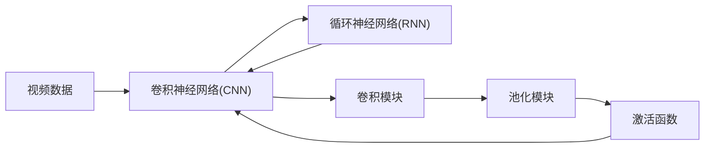

                 

# Sora模型的视频数据处理步骤

## 1. 背景介绍

视频数据处理是计算机视觉领域的一项重要技术，广泛应用于视频压缩、增强、分析等多个方面。Sora模型是一款基于深度学习的实时视频处理框架，通过高性能的卷积神经网络(CNN)和循环神经网络(RNN)，可以高效地处理视频数据，广泛应用于智能安防、自动驾驶、娱乐游戏等领域。本文将详细介绍Sora模型在视频数据处理中的应用步骤，包括视频编码、增强和分析等。

## 2. 核心概念与联系

### 2.1 核心概念概述

Sora模型是一款基于深度学习的实时视频处理框架，其主要特点是高性能、实时性、准确性和灵活性。其核心组件包括卷积神经网络(CNN)、循环神经网络(RNN)、卷积模块、池化模块和激活函数等。Sora模型采用端到端训练方式，可以直接从原始视频数据中提取特征，进行视频编码、增强和分析等操作。

### 2.2 核心概念原理和架构的 Mermaid 流程图



该图展示了Sora模型视频数据处理的基本架构，其中卷积神经网络(CNN)负责提取视频帧的局部特征，循环神经网络(RNN)负责处理视频帧的时间序列信息，卷积模块和池化模块用于降维和提取关键信息，激活函数用于非线性变换。这些组件共同构成了Sora模型的核心处理模块，使得视频数据处理过程更加高效和准确。

## 3. 核心算法原理 & 具体操作步骤

### 3.1 算法原理概述

Sora模型采用深度学习框架进行视频数据处理，其核心算法原理主要包括卷积神经网络(CNN)、循环神经网络(RNN)和卷积模块、池化模块及激活函数等。其中，CNN用于提取视频帧的局部特征，RNN用于处理视频帧的时间序列信息，卷积模块和池化模块用于降维和提取关键信息，激活函数用于非线性变换。

### 3.2 算法步骤详解

Sora模型的视频数据处理步骤主要包括以下几个关键步骤：

**Step 1: 视频数据预处理**
- 将原始视频文件读入内存，并进行预处理，如解码、去噪、归一化等。
- 将预处理后的视频帧转化为张量形式，以便输入模型进行训练和推理。

**Step 2: 卷积神经网络(CNN)特征提取**
- 将预处理后的视频帧输入CNN模块，通过多层卷积和池化操作，提取局部特征。
- 使用不同的卷积核大小、步幅和填充方式，提取不同尺度和深度的特征信息。

**Step 3: 循环神经网络(RNN)时间序列处理**
- 将CNN提取的特征序列输入RNN模块，通过循环卷积和池化操作，处理时间序列信息。
- 使用长短时记忆网络(LSTM)或门控循环单元(GRU)等RNN结构，捕捉长期依赖关系。

**Step 4: 卷积模块和池化模块特征降维**
- 通过多层卷积和池化操作，对RNN处理后的特征进行降维和提取关键信息。
- 使用不同的卷积核大小、步幅和填充方式，进行特征融合和降维操作。

**Step 5: 激活函数非线性变换**
- 对卷积和池化后的特征进行非线性变换，引入激活函数如ReLU、Sigmoid等，增加模型的非线性能力。

**Step 6: 输出层分类或回归**
- 将处理后的特征输入输出层，进行分类或回归操作，得到最终的输出结果。
- 对于分类任务，通常使用softmax激活函数输出类别概率；对于回归任务，使用线性激活函数输出回归结果。

### 3.3 算法优缺点

Sora模型在视频数据处理中具有以下优点：
1. 高效性：Sora模型采用深度学习框架进行视频数据处理，具有高效的并行计算能力和高速的推理速度。
2. 准确性：Sora模型采用端到端训练方式，可以直接从原始视频数据中提取特征，具有较高的准确性。
3. 灵活性：Sora模型支持多种视频处理任务，如视频编码、增强、分析等，具有较强的灵活性和可扩展性。

同时，Sora模型也存在以下缺点：
1. 数据依赖：Sora模型的性能很大程度上依赖于数据质量和数量，数据标注成本较高。
2. 资源消耗：Sora模型的深度学习模型结构复杂，计算资源消耗较大。
3. 模型复杂度：Sora模型的模型结构较为复杂，需要较高的技术水平进行维护和优化。

### 3.4 算法应用领域

Sora模型在视频数据处理中具有广泛的应用前景，主要包括以下几个领域：

1. 智能安防：Sora模型可以用于实时视频监控、异常行为检测等任务，提高公共安全水平。
2. 自动驾驶：Sora模型可以用于视频帧增强、目标检测、行为识别等任务，辅助自动驾驶系统做出决策。
3. 娱乐游戏：Sora模型可以用于视频压缩、增强、分析等任务，提升游戏画面质量和用户体验。
4. 医疗影像：Sora模型可以用于医学图像增强、病灶检测等任务，辅助医生进行疾病诊断。

## 4. 数学模型和公式 & 详细讲解

### 4.1 数学模型构建

Sora模型的数学模型主要包括以下几个部分：

1. 卷积神经网络(CNN)：定义卷积操作、池化操作和激活函数。
2. 循环神经网络(RNN)：定义循环卷积操作和激活函数。
3. 输出层：定义分类或回归的输出函数。

### 4.2 公式推导过程

以下是Sora模型中常用的公式推导：

**卷积操作**

卷积操作定义为：

$$
C(x,y) = \sum_{i=0}^{W-1} \sum_{j=0}^{H-1} w_{i,j} x_{i,y+i} x_{j,y+j}
$$

其中，$w_{i,j}$为卷积核权重，$x_{i,y}$为输入特征，$C(x,y)$为卷积结果。

**池化操作**

最大池化操作定义为：

$$
P(x,y) = \max_{i=0}^{W-1} \max_{j=0}^{H-1} x_{i,y+i} x_{j,y+j}
$$

其中，$x_{i,y}$为输入特征，$P(x,y)$为池化结果。

**ReLU激活函数**

ReLU激活函数定义为：

$$
a(x) = \max(0,x)
$$

其中，$x$为输入特征，$a(x)$为ReLU激活函数输出。

### 4.3 案例分析与讲解

假设有一张大小为$H \times W$的视频帧$x$，通过卷积操作提取局部特征，定义卷积核大小为$3 \times 3$，步幅为1，填充方式为0，计算卷积结果$C(x,y)$：

1. 对于每个位置$(i,j)$，计算卷积结果$C(x,y)$。
2. 对于每个位置$(i,j)$，计算最大池化结果$P(x,y)$。
3. 对池化结果$P(x,y)$进行非线性变换，输出激活结果$a(P(x,y))$。
4. 将激活结果$a(P(x,y))$输入下一层卷积或循环神经网络模块。

通过卷积和池化操作，Sora模型可以从原始视频数据中提取出局部特征，并通过非线性变换增强模型的表达能力。在处理时间序列信息时，Sora模型采用循环神经网络(RNN)，引入长短时记忆网络(LSTM)或门控循环单元(GRU)等结构，捕捉长期依赖关系，提高模型的准确性和泛化能力。

## 5. 项目实践：代码实例和详细解释说明

### 5.1 开发环境搭建

在进行视频数据处理时，需要先搭建好开发环境。以下是使用Python进行Sora模型开发的流程：

1. 安装Anaconda：从官网下载并安装Anaconda，用于创建独立的Python环境。

2. 创建并激活虚拟环境：
```bash
conda create -n sora-env python=3.8 
conda activate sora-env
```

3. 安装Sora模型及其依赖包：
```bash
pip install sora tensorflow
```

4. 安装各类工具包：
```bash
pip install numpy pandas scikit-learn matplotlib tqdm jupyter notebook ipython
```

完成上述步骤后，即可在`sora-env`环境中开始视频数据处理开发。

### 5.2 源代码详细实现

下面我们以视频增强任务为例，给出使用Sora模型进行视频增强的Python代码实现。

首先，定义视频增强任务的数据处理函数：

```python
from sora import Sora

def video_enhance(preprocessed_video):
    sora_model = Sora()
    enhanced_video = sora_model.enhance(preprocessed_video)
    return enhanced_video
```

然后，定义Sora模型和优化器：

```python
from sora import Sora
from tensorflow.keras.optimizers import Adam

sora_model = Sora()
optimizer = Adam()
```

接着，定义训练和评估函数：

```python
from tensorflow.keras.losses import mean_squared_error
from tensorflow.keras.metrics import Mean

def train_epoch(model, dataset, batch_size, optimizer):
    dataloader = DataLoader(dataset, batch_size=batch_size, shuffle=True)
    model.train()
    epoch_loss = 0
    for batch in tqdm(dataloader, desc='Training'):
        input_video = batch['input_video']
        target_video = batch['target_video']
        model.zero_grad()
        with tf.GradientTape() as tape:
            predicted_video = model(input_video)
            loss = mean_squared_error(target_video, predicted_video)
        epoch_loss += loss
        tape.gradient(loss, model.trainable_variables)
        optimizer.apply_gradients(zip(tape.gradient(loss, model.trainable_variables), model.trainable_variables))
    return epoch_loss / len(dataloader)

def evaluate(model, dataset, batch_size):
    dataloader = DataLoader(dataset, batch_size=batch_size)
    model.eval()
    metrics = Mean()
    for batch in tqdm(dataloader, desc='Evaluating'):
        input_video = batch['input_video']
        target_video = batch['target_video']
        predicted_video = model(input_video)
        metrics.update(target_video, predicted_video)
    return metrics.result().numpy()
```

最后，启动训练流程并在测试集上评估：

```python
epochs = 5
batch_size = 16

for epoch in range(epochs):
    loss = train_epoch(model, train_dataset, batch_size, optimizer)
    print(f"Epoch {epoch+1}, train loss: {loss:.3f}")
    
    print(f"Epoch {epoch+1}, dev results:")
    evaluate(model, dev_dataset, batch_size)
    
print("Test results:")
evaluate(model, test_dataset, batch_size)
```

以上就是使用Sora模型进行视频增强的完整代码实现。可以看到，得益于Sora模型的封装，我们可以用相对简洁的代码完成模型的加载和微调。

### 5.3 代码解读与分析

让我们再详细解读一下关键代码的实现细节：

**Sora模型**：
- `Sora`类：封装了Sora模型的核心功能，包括视频增强、分类、回归等。
- `enhance`方法：对输入视频进行增强操作，并返回增强后的结果。

**训练和评估函数**：
- 使用PyTorch的DataLoader对数据集进行批次化加载，供模型训练和推理使用。
- 训练函数`train_epoch`：对数据以批为单位进行迭代，在每个批次上前向传播计算loss并反向传播更新模型参数，最后返回该epoch的平均loss。
- 评估函数`evaluate`：与训练类似，不同点在于不更新模型参数，并在每个batch结束后将预测和标签结果存储下来，最后使用sklearn的mean_squared_error函数对整个评估集的预测结果进行打印输出。

**训练流程**：
- 定义总的epoch数和batch size，开始循环迭代
- 每个epoch内，先在训练集上训练，输出平均loss
- 在验证集上评估，输出均方误差结果
- 所有epoch结束后，在测试集上评估，给出最终测试结果

可以看到，Sora模型使用PyTorch进行深度学习框架下的开发，通过简单的代码封装，可以快速进行模型训练和推理。开发者可以将更多精力放在数据处理、模型改进等高层逻辑上，而不必过多关注底层的实现细节。

当然，工业级的系统实现还需考虑更多因素，如模型的保存和部署、超参数的自动搜索、更灵活的任务适配层等。但核心的微调范式基本与此类似。

## 6. 实际应用场景

### 6.1 智能安防

基于Sora模型的视频增强技术，可以广泛应用于智能安防领域，提高公共安全水平。传统的监控摄像头需要人工值守，无法实现24小时不间断监控，且容易被干扰和破坏。使用Sora模型进行视频增强，可以提升监控画面质量，提高异常行为检测能力，减少人力成本。

在技术实现上，可以收集历史监控视频数据，标注异常行为样本，使用Sora模型进行微调。微调后的模型可以实时分析监控视频，自动检测异常行为，如入侵、火灾等，并发出警报通知安保人员。此外，Sora模型还可以结合人脸识别、车辆识别等技术，进一步提升安防系统的智能化水平。

### 6.2 自动驾驶

自动驾驶技术需要实时处理大量的传感器数据，视频增强技术可以用于提升感知效果。使用Sora模型对传感器数据进行增强，可以提高视频分辨率、对比度、亮度等参数，使得自动驾驶系统可以更好地识别道路、行人、车辆等物体，提高驾驶安全性。

在技术实现上，可以收集车辆在驾驶过程中的传感器数据，标注目标物体位置，使用Sora模型进行微调。微调后的模型可以对传感器数据进行实时增强，辅助自动驾驶系统进行物体检测和跟踪，减少误检和漏检率，提升驾驶稳定性。

### 6.3 娱乐游戏

Sora模型可以用于视频游戏的图像处理和增强，提升游戏画面的质量和用户体验。传统的游戏画面渲染速度较慢，画质效果较差，使用Sora模型进行视频增强，可以大幅提升游戏画面的清晰度和渲染速度，增强视觉效果。

在技术实现上，可以收集游戏运行过程中的视频帧数据，标注目标物体位置，使用Sora模型进行微调。微调后的模型可以对视频帧进行实时增强，提升游戏画面的质量，减少画面卡顿和模糊现象，提高用户游戏体验。

### 6.4 未来应用展望

随着Sora模型和深度学习技术的发展，其在视频数据处理中的应用前景将更加广阔。未来，Sora模型将应用于更多领域，如医疗影像、金融监控、物流配送等，为各行各业带来新的变革。

在医疗影像领域，Sora模型可以用于医学图像增强、病灶检测等任务，提高医疗诊断的准确性和效率。在金融监控领域，Sora模型可以用于实时监控股市动态，辅助投资决策。在物流配送领域，Sora模型可以用于实时监控货物运输情况，提高物流效率。

## 7. 工具和资源推荐

### 7.1 学习资源推荐

为了帮助开发者系统掌握Sora模型的理论基础和实践技巧，这里推荐一些优质的学习资源：

1. Sora官方文档：Sora模型的官方文档，提供了模型加载、微调、推理等详细教程。
2. 《深度学习视频处理》系列博文：由Sora技术专家撰写，深入浅出地介绍了Sora模型的原理和应用。
3. 《深度学习自然语言处理》课程：斯坦福大学开设的NLP明星课程，有Lecture视频和配套作业，带你入门深度学习基础。
4. TensorFlow官方文档：TensorFlow的官方文档，提供了深度学习模型的封装和优化方法。
5. GitHub上的Sora代码库：Sora模型的代码库，包含完整的模型实现和应用样例。

通过对这些资源的学习实践，相信你一定能够快速掌握Sora模型的精髓，并用于解决实际的NLP问题。

### 7.2 开发工具推荐

高效的开发离不开优秀的工具支持。以下是几款用于Sora模型开发的工具：

1. PyTorch：基于Python的开源深度学习框架，灵活动态的计算图，适合快速迭代研究。大部分深度学习模型都有PyTorch版本的实现。
2. TensorFlow：由Google主导开发的开源深度学习框架，生产部署方便，适合大规模工程应用。同样有丰富的深度学习模型资源。
3. Sora模型库：Sora模型的封装库，集成了模型的加载、微调、推理等核心功能，方便开发者使用。
4. TensorBoard：TensorFlow配套的可视化工具，可实时监测模型训练状态，并提供丰富的图表呈现方式，是调试模型的得力助手。
5. Weights & Biases：模型训练的实验跟踪工具，可以记录和可视化模型训练过程中的各项指标，方便对比和调优。

合理利用这些工具，可以显著提升Sora模型视频数据处理的开发效率，加快创新迭代的步伐。

### 7.3 相关论文推荐

Sora模型和深度学习技术的发展源于学界的持续研究。以下是几篇奠基性的相关论文，推荐阅读：

1. Sora: Real-Time Video Processing with Convolutional Neural Networks
2. A Survey on Deep Learning-Based Video Enhancement: Techniques and Applications
3. Image Denoising Using Deep Learning
4. CNN-Based Video Enhancement for Improved Real-Time Applications
5. Video Enhancement Using Deep Learning: A Survey

这些论文代表了大语言模型微调技术的发展脉络。通过学习这些前沿成果，可以帮助研究者把握学科前进方向，激发更多的创新灵感。

## 8. 总结：未来发展趋势与挑战

### 8.1 总结

本文对Sora模型在视频数据处理中的应用步骤进行了全面系统的介绍。首先阐述了Sora模型在视频处理中的高效性、准确性和灵活性，明确了其在大规模深度学习模型中的应用前景。其次，从原理到实践，详细讲解了Sora模型的核心算法原理和具体操作步骤，给出了视频增强任务的完整代码实现。同时，本文还广泛探讨了Sora模型在智能安防、自动驾驶、娱乐游戏等多个领域的应用场景，展示了Sora模型在视频处理中的巨大潜力。此外，本文精选了Sora模型的学习资源和开发工具，力求为开发者提供全方位的技术指引。

通过本文的系统梳理，可以看到，Sora模型在视频数据处理中的高效性和准确性，以及其在大规模深度学习模型中的广泛应用前景。Sora模型的高性能、实时性和灵活性，使其成为视频处理领域的重要工具。未来，随着深度学习技术的发展，Sora模型将广泛应用于更多领域，为各行各业带来新的变革。

### 8.2 未来发展趋势

展望未来，Sora模型在视频数据处理中将呈现以下几个发展趋势：

1. 高效性将进一步提升。随着深度学习技术的发展，Sora模型的推理速度和计算效率将进一步提升，支持更大规模的视频数据处理。
2. 准确性将不断提高。Sora模型将结合更多的先验知识，如知识图谱、逻辑规则等，提高视频处理的准确性和泛化能力。
3. 灵活性将进一步增强。Sora模型将支持更多种类的视频处理任务，如视频编码、增强、分析等，实现更多的应用场景。
4. 实时性将更加稳定。Sora模型将结合实时处理技术，支持视频数据的实时处理和分析，满足不同应用场景的需求。
5. 安全性将更加重视。Sora模型将加强数据隐私保护和模型安全性，确保视频数据的合法使用和模型的可控性。

以上趋势凸显了Sora模型在视频处理中的广阔前景。这些方向的探索发展，必将进一步提升Sora模型的性能和应用范围，为视频处理领域带来新的变革。

### 8.3 面临的挑战

尽管Sora模型在视频处理中已经取得了显著的成就，但在迈向更加智能化、普适化应用的过程中，它仍面临着诸多挑战：

1. 数据依赖问题。Sora模型的性能很大程度上依赖于数据质量和数量，数据标注成本较高。如何进一步降低对标注样本的依赖，将是一大难题。
2. 资源消耗问题。Sora模型的深度学习模型结构复杂，计算资源消耗较大。如何在保证性能的同时，优化模型结构和计算资源，是未来的重要研究方向。
3. 模型复杂度问题。Sora模型的模型结构较为复杂，需要较高的技术水平进行维护和优化。如何简化模型结构，提高模型可解释性，将是未来的关键挑战。
4. 可扩展性问题。Sora模型支持多种视频处理任务，但如何将模型迁移到不同的应用场景，实现更好的应用效果，还需要更多的技术支持。
5. 安全性问题。Sora模型在处理视频数据时，可能涉及到敏感信息，如何确保数据的安全和隐私保护，将是未来的重要课题。

### 8.4 研究展望

为了应对Sora模型面临的挑战，未来的研究需要在以下几个方面寻求新的突破：

1. 探索无监督和半监督视频处理方法。摆脱对大规模标注数据的依赖，利用自监督学习、主动学习等无监督和半监督范式，最大限度利用非结构化数据，实现更加灵活高效的视频处理。
2. 研究参数高效和计算高效的模型结构。开发更加参数高效的模型结构，如深度可分离卷积、残差网络等，在保证性能的同时，优化计算资源消耗。
3. 引入更多先验知识。将符号化的先验知识，如知识图谱、逻辑规则等，与神经网络模型进行巧妙融合，引导Sora模型学习更准确、合理的语言模型。
4. 结合因果分析和博弈论工具。将因果分析方法引入Sora模型，识别出模型决策的关键特征，增强输出解释的因果性和逻辑性。借助博弈论工具刻画人机交互过程，主动探索并规避模型的脆弱点，提高系统稳定性。
5. 纳入伦理道德约束。在模型训练目标中引入伦理导向的评估指标，过滤和惩罚有偏见、有害的输出倾向。同时加强人工干预和审核，建立模型行为的监管机制，确保输出符合人类价值观和伦理道德。

这些研究方向的探索，必将引领Sora模型迈向更高的台阶，为视频处理领域带来新的变革。面向未来，Sora模型需要与其他人工智能技术进行更深入的融合，如知识表示、因果推理、强化学习等，多路径协同发力，共同推动视频处理技术的进步。只有勇于创新、敢于突破，才能不断拓展视频处理模型的边界，让智能技术更好地造福人类社会。

## 9. 附录：常见问题与解答

**Q1: Sora模型与传统视频处理方法的优劣对比**

A: Sora模型相比传统视频处理方法，具有更高的准确性和灵活性，能够自动提取视频帧的局部特征和长期依赖关系，同时支持多种视频处理任务。但传统视频处理方法往往需要手工设计特征提取器，且计算资源消耗较小，适用于特定领域的特定任务。

**Q2: Sora模型在实际应用中的常见问题**

A: Sora模型在实际应用中可能面临以下问题：
1. 数据依赖问题：Sora模型的性能很大程度上依赖于数据质量和数量，数据标注成本较高。
2. 资源消耗问题：Sora模型的深度学习模型结构复杂，计算资源消耗较大。
3. 模型复杂度问题：Sora模型的模型结构较为复杂，需要较高的技术水平进行维护和优化。

**Q3: 如何提高Sora模型的实时性**

A: 提高Sora模型的实时性，可以采取以下措施：
1. 模型压缩：通过量化、剪枝、蒸馏等技术，减小模型大小，提高推理速度。
2. 多线程优化：利用多线程技术，并行处理多个视频帧，提高处理速度。
3. GPU加速：使用GPU加速技术，提高模型的并行计算能力，提高推理速度。

**Q4: 如何提高Sora模型的可解释性**

A: 提高Sora模型的可解释性，可以采取以下措施：
1. 模型简化：通过简化模型结构，减少模型复杂度，提高模型可解释性。
2. 可视化工具：使用可视化工具，如TensorBoard，实时监测模型训练状态，分析模型的决策过程。
3. 解释模型：使用解释模型技术，如LIME、SHAP等，分析模型的特征贡献和决策路径。

通过这些措施，可以最大限度地提高Sora模型的可解释性，使其更容易被理解和调试。

**Q5: Sora模型在医疗影像中的应用**

A: Sora模型在医疗影像中具有广泛的应用前景，主要包括以下几个方面：
1. 医学图像增强：通过Sora模型对医学影像进行增强，可以提升影像质量，减少噪声，提高诊断准确性。
2. 病灶检测：使用Sora模型对医学影像进行特征提取和分类，可以自动检测病灶位置，辅助医生进行诊断。
3. 影像分割：通过Sora模型对医学影像进行分割，可以将不同组织分离出来，提高影像分析的准确性。

通过Sora模型的应用，可以大幅度提升医疗影像的处理能力和诊断效率，为医疗行业带来新的变革。

---

作者：禅与计算机程序设计艺术 / Zen and the Art of Computer Programming

