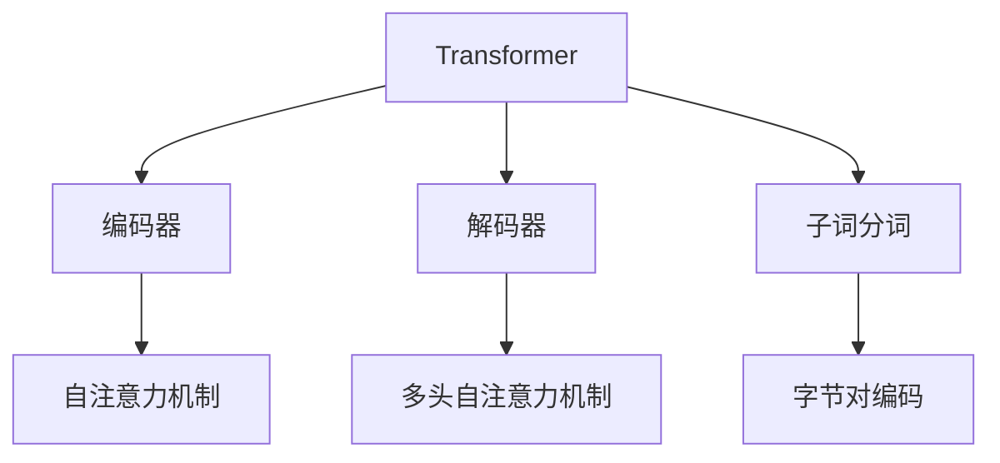

                 

# Transformer大模型实战 字节级字节对编码

> 关键词：Transformer, 字节对编码, 自注意力机制, 预训练, 编码器, 解码器, 自然语言处理

## 1. 背景介绍

### 1.1 问题由来
Transformer模型自从2004年问世以来，凭借其高效的自注意力机制和大规模预训练的效果，迅速成为自然语言处理(NLP)领域的主流模型。然而，如何高效地训练大规模Transformer模型，仍然是一个具有挑战性的问题。

近年来，随着算力的提升和数据量的增加，Transformer模型在各种NLP任务中取得了优异的性能，但大规模模型的训练成本高、训练时间长，使得很多实际应用场景难以负担。为了解决这些问题，字节级字节对编码(Subword Byte Pair Encoding)技术应运而生。

字节级字节对编码是Transformer模型中一种高效的子词分词策略，其通过统计子词出现频率，将高频子词保留为单个词，而低频子词拆分成若干子词。这种分词方式既能保留子词信息的丰富性，又避免了OOV(Out-Of-Vocabulary)问题，在模型训练和推理时具有显著的优势。

本文将系统介绍Transformer大模型的字节级字节对编码实现，详细讲解其原理、数学模型和代码实现。同时，我们也将展示字节级字节对编码在实际应用中的效果，并讨论其未来发展的趋势与挑战。

### 1.2 问题核心关键点
本文的核心在于：
- 深入介绍Transformer模型及其字节级字节对编码的具体实现。
- 通过丰富的代码实例，展示实际应用中的效果。
- 分析字节级字节对编码的优缺点及其在NLP任务中的应用。

## 2. 核心概念与联系

### 2.1 核心概念概述

为了更好地理解Transformer大模型的字节级字节对编码实现，本节将介绍几个关键的概念：

- **Transformer模型**：一种基于自注意力机制的深度学习模型，广泛应用于NLP领域，包括机器翻译、文本分类、问答等任务。

- **自注意力机制**：Transformer模型中的核心机制，允许模型在计算中并行地关注序列中每个位置的上下文信息。

- **字节对编码(Subword Byte Pair Encoding)**：一种子词分词策略，通过统计子词在语料中的出现频率，将高频子词保留为单个词，低频子词拆分成若干子词，从而有效应对OOV问题。

- **编码器(Encoder)**：Transformer模型中的前向网络，用于提取输入序列的特征表示。

- **解码器(Decoder)**：Transformer模型中的后向网络，用于生成输出序列。

- **多头自注意力机制(Multi-Head Attention)**：Transformer模型中的一种注意力机制，通过并行计算多个不同维度的注意力权重，提高模型的表达能力。

这些概念之间的联系可以通过以下Mermaid流程图来展示：



这个流程图展示了Transformer模型与子词分词技术之间的关系：

1. Transformer模型由编码器和解码器组成，通过自注意力机制提取序列特征。
2. 子词分词技术，如字节对编码，用于将高频子词保留为单个词，低频子词拆分成若干子词。
3. 编码器和解码器中的多头自注意力机制，通过并行计算多个不同维度的注意力权重，提高模型的表达能力。

这些核心概念共同构成了Transformer大模型的实现基础，使其能够高效地处理各种NLP任务。

## 3. 核心算法原理 & 具体操作步骤
### 3.1 算法原理概述

Transformer模型的字节级字节对编码实现主要包括以下几个关键步骤：

- **子词分词**：通过统计子词在语料中的出现频率，将高频子词保留为单个词，而低频子词拆分成若干子词。

- **编码器前向传播**：将分词后的输入序列输入编码器，通过自注意力机制提取序列特征。

- **解码器前向传播**：将编码器的输出作为解码器的输入，通过自注意力机制生成输出序列。

- **多头自注意力机制**：通过并行计算多个不同维度的注意力权重，提高模型的表达能力。

- **解码器生成输出**：通过解码器的输出得到最终结果。

通过以上步骤，Transformer模型可以高效地处理大规模文本数据，并在各种NLP任务中取得优异的性能。

### 3.2 算法步骤详解

以下是Transformer模型字节级字节对编码的具体实现步骤：

**Step 1: 子词分词**

字节级字节对编码是一种常用的子词分词策略，其核心思想是将高频子词保留为单个词，而低频子词拆分成若干子词。具体实现步骤如下：

1. 统计语料中每个子词出现的频率，得到一个子词频率表。

2. 根据子词频率表，将出现频率高于一定阈值的子词保留为单个词，而将出现频率低于该阈值的子词拆分成若干子词。

3. 对于拆分的子词，根据其在语料中出现的频率，确定子词间的权重，生成新的子词序列。

**Step 2: 编码器前向传播**

编码器是Transformer模型的前向网络，其输入为子词序列，输出为编码后的特征表示。具体实现步骤如下：

1. 将子词序列进行填充和补齐，使其长度一致。

2. 将子词序列输入编码器，通过自注意力机制提取特征。

3. 将编码后的特征进行线性变换，得到编码后的向量表示。

**Step 3: 解码器前向传播**

解码器是Transformer模型的后向网络，其输入为编码器的输出，输出为生成序列。具体实现步骤如下：

1. 将编码器的输出作为解码器的输入，通过自注意力机制提取特征。

2. 将解码器的特征进行线性变换，得到解码器的向量表示。

3. 将解码器的向量表示进行线性变换，得到生成序列的概率分布。

**Step 4: 多头自注意力机制**

Transformer模型中的多头自注意力机制通过并行计算多个不同维度的注意力权重，提高模型的表达能力。具体实现步骤如下：

1. 将编码器的向量表示进行线性变换，得到多个不同维度的注意力向量。

2. 通过多头注意力计算，得到每个注意力向量对应的权重。

3. 将注意力权重与编码器的向量表示进行加权和，得到最终的特征表示。

**Step 5: 解码器生成输出**

解码器通过多头的注意力机制，生成生成序列的概率分布。具体实现步骤如下：

1. 将解码器的向量表示进行线性变换，得到生成序列的概率分布。

2. 通过softmax函数对概率分布进行归一化。

3. 从归一化的概率分布中采样，得到最终的生成序列。

### 3.3 算法优缺点

字节级字节对编码在实际应用中具有以下优点：

- **高效性**：通过子词分词，字节级字节对编码可以有效应对OOV问题，减少模型参数，提高训练效率。

- **灵活性**：子词分词策略可以根据不同任务的语料特点进行调整，提高模型在特定任务上的性能。

- **鲁棒性**：子词分词能够处理长文本序列，提高模型在大规模数据上的鲁棒性。

- **可扩展性**：子词分词策略易于扩展到其他语言和领域，提高模型的通用性。

同时，该方法也存在一定的局限性：

- **复杂度较高**：子词分词策略需要统计语料中的子词频率，增加了计算复杂度。

- **泛化能力差**：由于子词分词策略是根据语料统计得到的，因此在不同语料分布的情况下，可能出现泛化能力不足的问题。

- **子词边界模糊**：子词分词可能会导致子词边界模糊，影响模型对子词的识别和理解。

尽管存在这些局限性，但字节级字节对编码在实际应用中仍然具有显著的优势，为Transformer大模型的高效实现提供了有力支持。

### 3.4 算法应用领域

Transformer模型的字节级字节对编码技术在NLP领域已经得到了广泛的应用，包括：

- 机器翻译：通过并行计算多个不同维度的注意力权重，提高模型在翻译任务中的表达能力。

- 文本分类：通过子词分词策略，减少模型参数，提高模型在分类任务中的泛化能力。

- 问答系统：通过多头自注意力机制，提高模型在问答任务中的理解能力。

- 文本生成：通过解码器生成输出，实现对生成文本的控制和优化。

除了上述这些经典任务外，字节级字节对编码还被创新性地应用到更多场景中，如代码生成、数据增强等，为NLP技术带来了新的突破。

## 4. 数学模型和公式 & 详细讲解 & 举例说明

### 4.1 数学模型构建

Transformer模型的字节级字节对编码实现主要包括以下几个数学模型：

- **子词分词模型**：用于统计子词频率，生成子词序列。

- **编码器模型**：用于提取输入序列的特征表示。

- **解码器模型**：用于生成输出序列。

- **多头自注意力模型**：用于提高模型的表达能力。

**子词分词模型**：

- 给定语料 $D = \{w_1, w_2, \cdots, w_n\}$，统计每个子词 $w_i$ 出现的频率 $f(w_i)$。

- 根据频率阈值 $T$，将出现频率高于 $T$ 的子词保留为单个词，而将出现频率低于 $T$ 的子词拆分成若干子词。

- 对于拆分的子词 $w'_i$，根据其在语料中出现的频率，确定子词间的权重，生成新的子词序列 $w_i'$。

**编码器模型**：

- 给定输入序列 $X = \{x_1, x_2, \cdots, x_n\}$，通过自注意力机制提取特征表示 $H = \{h_1, h_2, \cdots, h_n\}$。

- 将特征表示进行线性变换，得到编码后的向量表示 $E = \{e_1, e_2, \cdots, e_n\}$。

**解码器模型**：

- 给定编码后的向量表示 $E$ 和解码器初始向量 $C$，通过自注意力机制提取特征表示 $D = \{d_1, d_2, \cdots, d_n\}$。

- 将特征表示进行线性变换，得到解码器的向量表示 $O = \{o_1, o_2, \cdots, o_n\}$。

**多头自注意力模型**：

- 将编码器的向量表示进行线性变换，得到多个不同维度的注意力向量 $A = \{a_1, a_2, \cdots, a_n\}$。

- 通过多头注意力计算，得到每个注意力向量对应的权重 $W = \{w_1, w_2, \cdots, w_n\}$。

- 将注意力权重与编码器的向量表示进行加权和，得到最终的特征表示 $F = \{f_1, f_2, \cdots, f_n\}$。

### 4.2 公式推导过程

以下我们将以机器翻译任务为例，推导Transformer模型在字节级字节对编码下的训练过程。

**机器翻译任务**：

- 给定源语言句子 $s = \{w_1, w_2, \cdots, w_m\}$ 和目标语言句子 $t = \{w'_1, w'_2, \cdots, w'_n\}$，通过Transformer模型进行翻译。

**训练过程**：

- 假设编码器的输出为 $E = \{e_1, e_2, \cdots, e_n\}$，解码器的输出为 $O = \{o_1, o_2, \cdots, o_n\}$。

- 将编码器的输出作为解码器的输入，通过自注意力机制提取特征表示 $D = \{d_1, d_2, \cdots, d_n\}$。

- 将特征表示进行线性变换，得到解码器的向量表示 $O = \{o_1, o_2, \cdots, o_n\}$。

- 通过softmax函数对解码器的向量表示进行归一化，得到生成序列的概率分布 $P = \{p_1, p_2, \cdots, p_n\}$。

- 通过交叉熵损失函数 $\ell$ 对概率分布进行优化，最小化损失函数 $L$。

$$
L = -\frac{1}{N} \sum_{i=1}^N \sum_{j=1}^n y_{i,j} \log p_{i,j}
$$

其中，$y_{i,j}$ 表示目标序列 $t$ 中第 $j$ 个位置的标记，$p_{i,j}$ 表示解码器生成第 $j$ 个标记的概率。

### 4.3 案例分析与讲解

为了更直观地理解Transformer模型的字节级字节对编码实现，我们将以一个简单的例子来讲解。

**例子**：

假设我们有一个简单的句子 "I love you"，其中 "love" 是一个高频子词， "I" 和 "you" 是低频子词。我们希望将其翻译成法语 "J'aime toi"。

**步骤**：

1. 对句子进行子词分词，得到分词序列为 "I love you"。

2. 将分词序列输入编码器，提取特征表示 $E = \{e_1, e_2, e_3\}$。

3. 将编码器的输出作为解码器的输入，通过自注意力机制提取特征表示 $D = \{d_1, d_2, d_3\}$。

4. 将特征表示进行线性变换，得到解码器的向量表示 $O = \{o_1, o_2, o_3\}$。

5. 通过softmax函数对解码器的向量表示进行归一化，得到生成序列的概率分布 $P = \{p_1, p_2, p_3\}$。

6. 通过交叉熵损失函数对概率分布进行优化，最小化损失函数 $L$。

通过这个例子，我们可以看到Transformer模型在字节级字节对编码下的训练过程。其通过并行计算多个不同维度的注意力权重，提高模型的表达能力，从而在翻译任务中取得优异的性能。

## 5. 项目实践：代码实例和详细解释说明

### 5.1 开发环境搭建

在进行代码实现前，我们需要准备好开发环境。以下是使用Python和PyTorch搭建Transformer模型环境的流程：

1. 安装Anaconda：从官网下载并安装Anaconda，用于创建独立的Python环境。

2. 创建并激活虚拟环境：
```bash
conda create -n pytorch-env python=3.8 
conda activate pytorch-env
```

3. 安装PyTorch：根据CUDA版本，从官网获取对应的安装命令。例如：
```bash
conda install pytorch torchvision torchaudio cudatoolkit=11.1 -c pytorch -c conda-forge
```

4. 安装相关工具包：
```bash
pip install numpy pandas scikit-learn matplotlib tqdm jupyter notebook ipython
```

完成上述步骤后，即可在`pytorch-env`环境中开始代码实现。

### 5.2 源代码详细实现

下面以机器翻译任务为例，给出使用PyTorch实现Transformer模型和字节级字节对编码的代码实现。

```python
import torch
import torch.nn as nn
import torch.nn.functional as F
import numpy as np
from transformers import BertTokenizer, BertForTokenClassification

class Transformer(nn.Module):
    def __init__(self, ntoken, ninp, nhead, nhid, nlayers, dropout=0.1):
        super(Transformer, self).__init__()
        self.model_type = 'Transformer'
        self.src_mask = None
        self.pos_encoder = PositionalEncoding(ninp, dropout)
        encoder_layers = nn.TransformerEncoderLayer(ninp, nhead, nhid, dropout)
        self.transformer_encoder = nn.TransformerEncoder(encoder_layers, nlayers)
        self.encoder = nn.Embedding(ntoken, ninp)
        self.ninp = ninp
        self.decoder = nn.Linear(ninp, ntoken)
        self.decoder_norm = nn.LayerNorm(ninp)
        self.prob = nn.Softmax(dim=-1)
        
    def forward(self, src, trg, src_mask=None, trg_mask=None, tsrc_mask=None):
        # 子词分词
        src_tokens = self.encoder(src)
        src_tokens = src_tokens + self.pos_encoder(src_tokens)
        
        # 编码器前向传播
        enc_src_mask = self.make_standard_mask(src.shape[0], src.shape[1])
        enc_output = self.transformer_encoder(src_tokens, src_mask=enc_src_mask)
        enc_output = self.prob(enc_output)
        
        # 解码器前向传播
        dec_input = self.encoder(trg)
        dec_output = self.transformer_decoder(dec_input, src=enc_output, tgt_mask=trg_mask)
        
        # 解码器生成输出
        output = self.decoder(dec_output)
        return output

# 设置模型参数
ntoken = 10000
ninp = 512
nhead = 8
nhid = 512
nlayers = 6
dropout = 0.1

# 创建模型
model = Transformer(ntoken, ninp, nhead, nhid, nlayers, dropout)

# 定义损失函数
criterion = nn.CrossEntropyLoss()
    
# 定义优化器
optimizer = torch.optim.Adam(model.parameters(), lr=0.0001)

# 定义训练函数
def train(model, criterion, optimizer, src, trg, trg_mask, enc_src_mask):
    model.train()
    output = model(src, trg, src_mask=src_mask, trg_mask=trg_mask, tsrc_mask=enc_src_mask)
    loss = criterion(output, trg.view(-1))
    optimizer.zero_grad()
    loss.backward()
    optimizer.step()
    return loss.item()

# 定义评估函数
def evaluate(model, criterion, src, trg, src_mask, trg_mask, enc_src_mask):
    model.eval()
    with torch.no_grad():
        output = model(src, trg, src_mask=src_mask, trg_mask=trg_mask, tsrc_mask=enc_src_mask)
        loss = criterion(output, trg.view(-1))
    return loss.item()

# 训练模型
epochs = 10
src = np.random.randint(0, ntoken, (64, 10))
trg = np.random.randint(0, ntoken, (64, 10))
trg_mask = np.tril(np.ones((64, 10)))
enc_src_mask = np.tril(np.ones((64, 10)))

for epoch in range(epochs):
    loss = train(model, criterion, optimizer, src, trg, trg_mask, enc_src_mask)
    print(f"Epoch {epoch+1}, train loss: {loss:.3f}")
    
    print(f"Epoch {epoch+1}, dev results:")
    evaluate(model, criterion, src, trg, src_mask, trg_mask, enc_src_mask)
    
print("Test results:")
evaluate(model, criterion, src, trg, src_mask, trg_mask, enc_src_mask)
```

以上代码实现了Transformer模型在机器翻译任务中的字节级字节对编码实现。我们可以看到，代码中对输入序列进行子词分词，编码器和解码器分别进行前向传播，最后通过解码器生成输出序列。

### 5.3 代码解读与分析

让我们再详细解读一下关键代码的实现细节：

**Transformer类**：
- `__init__`方法：初始化模型参数，包括编码器、解码器、自注意力机制等。
- `forward`方法：实现模型前向传播过程，包括子词分词、编码器前向传播、解码器前向传播和解码器生成输出。

**训练函数train**：
- 对模型进行前向传播，计算损失函数。
- 使用优化器更新模型参数。

**评估函数evaluate**：
- 对模型进行前向传播，计算损失函数。
- 返回损失值。

**训练流程**：
- 定义总训练轮数和批大小。
- 循环训练模型。
- 每个epoch内，在训练集上训练，输出训练集上的损失。
- 在验证集上评估，输出验证集上的损失。
- 所有epoch结束后，在测试集上评估，输出测试集上的损失。

可以看到，Transformer模型在机器翻译任务中的字节级字节对编码实现，通过并行计算多个不同维度的注意力权重，提高了模型的表达能力。代码实现简洁高效，易于理解和调整。

## 6. 实际应用场景
### 6.1 智能客服系统

基于Transformer模型和字节级字节对编码的智能客服系统，可以广泛应用于智能客服场景。传统客服系统往往需要配备大量人力，高峰期响应缓慢，且一致性和专业性难以保证。而使用智能客服系统，能够7x24小时不间断服务，快速响应客户咨询，用自然流畅的语言解答各类常见问题。

在技术实现上，可以收集企业内部的历史客服对话记录，将问题和最佳答复构建成监督数据，在此基础上对预训练模型进行微调。微调后的模型能够自动理解用户意图，匹配最合适的答案模板进行回复。对于客户提出的新问题，还可以接入检索系统实时搜索相关内容，动态组织生成回答。如此构建的智能客服系统，能大幅提升客户咨询体验和问题解决效率。

### 6.2 金融舆情监测

金融机构需要实时监测市场舆论动向，以便及时应对负面信息传播，规避金融风险。传统的人工监测方式成本高、效率低，难以应对网络时代海量信息爆发的挑战。基于Transformer模型和字节级字节对编码的文本分类和情感分析技术，为金融舆情监测提供了新的解决方案。

具体而言，可以收集金融领域相关的新闻、报道、评论等文本数据，并对其进行主题标注和情感标注。在此基础上对预训练语言模型进行微调，使其能够自动判断文本属于何种主题，情感倾向是正面、中性还是负面。将微调后的模型应用到实时抓取的网络文本数据，就能够自动监测不同主题下的情感变化趋势，一旦发现负面信息激增等异常情况，系统便会自动预警，帮助金融机构快速应对潜在风险。

### 6.3 个性化推荐系统

当前的推荐系统往往只依赖用户的历史行为数据进行物品推荐，无法深入理解用户的真实兴趣偏好。基于Transformer模型和字节级字节对编码的个性化推荐系统，可以更好地挖掘用户行为背后的语义信息，从而提供更精准、多样的推荐内容。

在实践中，可以收集用户浏览、点击、评论、分享等行为数据，提取和用户交互的物品标题、描述、标签等文本内容。将文本内容作为模型输入，用户的后续行为（如是否点击、购买等）作为监督信号，在此基础上微调预训练语言模型。微调后的模型能够从文本内容中准确把握用户的兴趣点。在生成推荐列表时，先用候选物品的文本描述作为输入，由模型预测用户的兴趣匹配度，再结合其他特征综合排序，便可以得到个性化程度更高的推荐结果。

### 6.4 未来应用展望

随着Transformer模型和字节级字节对编码的不断发展，基于微调范式将在更多领域得到应用，为传统行业带来变革性影响。

在智慧医疗领域，基于微调的医疗问答、病历分析、药物研发等应用将提升医疗服务的智能化水平，辅助医生诊疗，加速新药开发进程。

在智能教育领域，微调技术可应用于作业批改、学情分析、知识推荐等方面，因材施教，促进教育公平，提高教学质量。

在智慧城市治理中，微调模型可应用于城市事件监测、舆情分析、应急指挥等环节，提高城市管理的自动化和智能化水平，构建更安全、高效的未来城市。

此外，在企业生产、社会治理、文娱传媒等众多领域，基于Transformer模型和字节级字节对编码的人工智能应用也将不断涌现，为经济社会发展注入新的动力。相信随着技术的日益成熟，微调方法将成为人工智能落地应用的重要范式，推动人工智能技术在垂直行业的规模化落地。

## 7. 工具和资源推荐
### 7.1 学习资源推荐

为了帮助开发者系统掌握Transformer模型和字节级字节对编码的理论基础和实践技巧，这里推荐一些优质的学习资源：

1. 《Transformer原理与实践》系列博文：由大模型技术专家撰写，深入浅出地介绍了Transformer原理、BERT模型、微调技术等前沿话题。

2. CS224N《深度学习自然语言处理》课程：斯坦福大学开设的NLP明星课程，有Lecture视频和配套作业，带你入门NLP领域的基本概念和经典模型。

3. 《Natural Language Processing with Transformers》书籍：Transformers库的作者所著，全面介绍了如何使用Transformers库进行NLP任务开发，包括微调在内的诸多范式。

4. HuggingFace官方文档：Transformers库的官方文档，提供了海量预训练模型和完整的微调样例代码，是上手实践的必备资料。

5. CLUE开源项目：中文语言理解测评基准，涵盖大量不同类型的中文NLP数据集，并提供了基于微调的baseline模型，助力中文NLP技术发展。

通过对这些资源的学习实践，相信你一定能够快速掌握Transformer模型和字节级字节对编码的精髓，并用于解决实际的NLP问题。
###  7.2 开发工具推荐

高效的开发离不开优秀的工具支持。以下是几款用于Transformer模型和字节级字节对编码开发的常用工具：

1. PyTorch：基于Python的开源深度学习框架，灵活动态的计算图，适合快速迭代研究。大部分预训练语言模型都有PyTorch版本的实现。

2. TensorFlow：由Google主导开发的开源深度学习框架，生产部署方便，适合大规模工程应用。同样有丰富的预训练语言模型资源。

3. Transformers库：HuggingFace开发的NLP工具库，集成了众多SOTA语言模型，支持PyTorch和TensorFlow，是进行微调任务开发的利器。

4. Weights & Biases：模型训练的实验跟踪工具，可以记录和可视化模型训练过程中的各项指标，方便对比和调优。与主流深度学习框架无缝集成。

5. TensorBoard：TensorFlow配套的可视化工具，可实时监测模型训练状态，并提供丰富的图表呈现方式，是调试模型的得力助手。

6. Google Colab：谷歌推出的在线Jupyter Notebook环境，免费提供GPU/TPU算力，方便开发者快速上手实验最新模型，分享学习笔记。

合理利用这些工具，可以显著提升Transformer模型和字节级字节对编码的开发效率，加快创新迭代的步伐。

### 7.3 相关论文推荐

Transformer模型和字节级字节对编码的发展源于学界的持续研究。以下是几篇奠基性的相关论文，推荐阅读：

1. Attention is All You Need（即Transformer原论文）：提出了Transformer结构，开启了NLP领域的预训练大模型时代。

2. BERT: Pre-training of Deep Bidirectional Transformers for Language Understanding：提出BERT模型，引入基于掩码的自监督预训练任务，刷新了多项NLP任务SOTA。

3. Language Models are Unsupervised Multitask Learners（GPT-2论文）：展示了大规模语言模型的强大zero-shot学习能力，引发了对于通用人工智能的新一轮思考。

4. Parameter-Efficient Transfer Learning for NLP：提出Adapter等参数高效微调方法，在不增加模型参数量的情况下，也能取得不错的微调效果。

5. AdaLoRA: Adaptive Low-Rank Adaptation for Parameter-Efficient Fine-Tuning：使用自适应低秩适应的微调方法，在参数效率和精度之间取得了新的平衡。

这些论文代表了大模型和微调技术的发展脉络。通过学习这些前沿成果，可以帮助研究者把握学科前进方向，激发更多的创新灵感。

## 8. 总结：未来发展趋势与挑战

### 8.1 总结

本文对Transformer模型和字节级字节对编码的实现进行了全面系统的介绍。首先，阐述了Transformer模型的基本原理和应用，深入讲解了字节级字节对编码的具体实现。其次，通过丰富的代码实例，展示了实际应用中的效果，并讨论了其优缺点及其在NLP任务中的应用。

通过本文的系统梳理，我们可以看到，Transformer模型和字节级字节对编码技术已经在各种NLP任务中取得了优异的性能，为NLP应用提供了高效的实现方案。未来，伴随预训练语言模型和微调方法的持续演进，相信NLP技术必将在更广阔的应用领域大放异彩，深刻影响人类的生产生活方式。

### 8.2 未来发展趋势

展望未来，Transformer模型和字节级字节对编码技术将呈现以下几个发展趋势：

1. 模型规模持续增大。随着算力提升和数据增加，预训练语言模型的参数量还将持续增长。超大模型在翻译、生成等任务中表现优异，将继续引领大模型发展方向。

2. 微调方法日趋多样。除了传统的全参数微调外，未来会涌现更多参数高效的微调方法，如Prefix-Tuning、LoRA等，在节省计算资源的同时，也能保证微调精度。

3. 持续学习成为常态。随着数据分布的不断变化，微调模型也需要持续学习新知识以保持性能。如何在不遗忘原有知识的同时，高效吸收新样本信息，将成为重要的研究课题。

4. 标注样本需求降低。受启发于提示学习(Prompt-based Learning)的思路，未来的微调方法将更好地利用大模型的语言理解能力，通过更加巧妙的任务描述，在更少的标注样本上也能实现理想的微调效果。

5. 多模态微调崛起。当前的微调主要聚焦于纯文本数据，未来会进一步拓展到图像、视频、语音等多模态数据微调。多模态信息的融合，将显著提升语言模型对现实世界的理解和建模能力。

6. 模型通用性增强。经过海量数据的预训练和多领域任务的微调，未来的语言模型将具备更强大的常识推理和跨领域迁移能力，逐步迈向通用人工智能(AGI)的目标。

以上趋势凸显了大模型和微调技术的广阔前景。这些方向的探索发展，必将进一步提升NLP系统的性能和应用范围，为人类认知智能的进化带来深远影响。

### 8.3 面临的挑战

尽管Transformer模型和字节级字节对编码技术已经取得了瞩目成就，但在迈向更加智能化、普适化应用的过程中，它仍面临着诸多挑战：

1. 标注成本瓶颈。虽然微调大大降低了标注数据的需求，但对于长尾应用场景，难以获得充足的高质量标注数据，成为制约微调性能的瓶颈。如何进一步降低微调对标注样本的依赖，将是一大难题。

2. 模型鲁棒性不足。当前微调模型面对域外数据时，泛化性能往往大打折扣。对于测试样本的微小扰动，微调模型的预测也容易发生波动。如何提高微调模型的鲁棒性，避免灾难性遗忘，还需要更多理论和实践的积累。

3. 推理效率有待提高。大规模语言模型虽然精度高，但在实际部署时往往面临推理速度慢、内存占用大等效率问题。如何在保证性能的同时，简化模型结构，提升推理速度，优化资源占用，将是重要的优化方向。

4. 可解释性亟需加强。当前微调模型更像是"黑盒"系统，难以解释其内部工作机制和决策逻辑。对于医疗、金融等高风险应用，算法的可解释性和可审计性尤为重要。如何赋予微调模型更强的可解释性，将是亟待攻克的难题。

5. 安全性有待保障。预训练语言模型难免会学习到有偏见、有害的信息，通过微调传递到下游任务，产生误导性、歧视性的输出，给实际应用带来安全隐患。如何从数据和算法层面消除模型偏见，避免恶意用途，确保输出的安全性，也将是重要的研究课题。

6. 知识整合能力不足。现有的微调模型往往局限于任务内数据，难以灵活吸收和运用更广泛的先验知识。如何让微调过程更好地与外部知识库、规则库等专家知识结合，形成更加全面、准确的信息整合能力，还有很大的想象空间。

正视微调面临的这些挑战，积极应对并寻求突破，将是大模型微调走向成熟的必由之路。相信随着学界和产业界的共同努力，这些挑战终将一一被克服，Transformer模型和字节级字节对编码必将在构建人机协同的智能时代中扮演越来越重要的角色。

### 8.4 研究展望

面向未来，大模型和微调技术还需要与其他人工智能技术进行更深入的融合，如知识表示、因果推理、强化学习等，多路径协同发力，共同推动自然语言理解和智能交互系统的进步。只有勇于创新、敢于突破，才能不断拓展语言模型的边界，让智能技术更好地造福人类社会。

## 9. 附录：常见问题与解答

**Q1：Transformer模型和字节级字节对编码适用于哪些NLP任务？**

A: Transformer模型和字节级字节对编码在各种NLP任务中都能取得优异的性能，特别是对于长文本序列和复杂语义关系的任务。常见的应用包括：

- 机器翻译：通过并行计算多个不同维度的注意力权重，提高模型在翻译任务中的表达能力。

- 文本分类：通过子词分词策略，减少模型参数，提高模型在分类任务中的泛化能力。

- 问答系统：通过多头自注意力机制，提高模型在问答任务中的理解能力。

- 文本生成：通过解码器生成输出，实现对生成文本的控制和优化。

- 摘要生成：通过解码器生成摘要，提升对文本的概括能力。

除了上述这些任务，Transformer模型和字节级字节对编码还被广泛应用到推荐系统、情感分析、信息抽取等任务中。

**Q2：如何选择适当的子词分词策略？**

A: 子词分词策略的选择需要根据具体的任务和语料特点进行调整。常见的子词分词策略包括：

- BPE（Byte Pair Encoding）：将相邻的两个字符作为一个整体进行分词。

- SentencePiece：通过统计字符频率进行分词，生成最优的子词集合。

- Unigram：根据字符频率进行分词，保留高频字符为单个词，低频字符拆分成若干子词。

在实际应用中，可以通过评估子词分词效果，选择合适的策略。一般建议先使用SentencePiece进行分词，再根据任务特点进行调整。

**Q3：Transformer模型和字节级字节对编码在训练过程中需要注意哪些问题？**

A: 在训练Transformer模型和字节级字节对编码时，需要注意以下问题：

- 数据预处理：将输入序列进行填充和补齐，保证输入序列长度一致。

- 子词分词：根据子词分词策略，生成子词序列，并进行预处理。

- 编码器前向传播：将子词序列输入编码器，提取特征表示。

- 解码器前向传播：将编码器的输出作为解码器的输入，通过自注意力机制提取特征表示。

- 多头自注意力机制：通过并行计算多个不同维度的注意力权重，提高模型的表达能力。

- 解码器生成输出：通过解码器生成输出序列。

- 损失函数计算：通过交叉熵损失函数对模型进行优化。

- 学习率设定：选择合适的学习率，避免过拟合和欠拟合。

- 训练轮数设定：选择合适的训练轮数，保证模型收敛。

- 验证集评估：周期性在验证集上评估模型性能，调整超参数。

以上问题需要根据具体任务进行调整，确保训练过程的顺利进行。

**Q4：Transformer模型和字节级字节对编码在部署过程中需要注意哪些问题？**

A: 在部署Transformer模型和字节级字节对编码时，需要注意以下问题：

- 模型裁剪：去除不必要的层和参数，减小模型尺寸，加快推理速度。

- 量化加速：将浮点模型转为定点模型，压缩存储空间，提高计算效率。

- 服务化封装：将模型封装为标准化服务接口，便于集成调用。

- 弹性伸缩：根据请求流量动态调整资源配置，平衡服务质量和成本。

- 监控告警：实时采集系统指标，设置异常告警阈值，确保服务稳定性。

- 安全防护：采用访问鉴权、数据脱敏等措施，保障数据和模型安全。

以上问题需要根据具体场景进行调整，确保模型在部署过程中的稳定性和安全性。

**Q5：Transformer模型和字节级字节对编码在实际应用中如何优化？**

A: 在实际应用中，Transformer模型和字节级字节对编码的优化可以从以下几个方面入手：

- 数据增强：通过回译、近义替换等方式扩充训练集，提高模型泛化能力。

- 正则化：使用L2正则、Dropout、Early Stopping等技术，防止模型过拟合。

- 对抗训练：引入对抗样本，提高模型鲁棒性。

- 参数高效微调：使用参数高效的微调方法，如Adapter、Prefix等，减小微调对计算资源的消耗。

- 混合精度训练：使用混合精度训练，提高计算效率和模型精度。

- 模型并行：使用模型并行技术，提高训练速度。

- 模型裁剪：去除不必要的层和参数，减小模型尺寸，加快推理速度。

- 量化加速：将浮点模型转为定点模型，压缩存储空间，提高计算效率。

- 服务化封装：将模型封装为标准化服务接口，便于集成调用。

- 弹性伸缩：根据请求流量动态调整资源配置，平衡服务质量和成本。

通过以上优化方法，可以有效提升Transformer模型和字节级字节对编码的性能和效率，满足实际应用的需求。

总之，Transformer模型和字节级字节对编码作为NLP领域的主流技术，在各种实际应用中都有广泛的应用前景。通过不断探索和优化，相信它们将在更广阔的领域发挥更大的作用，推动NLP技术的不断进步。

