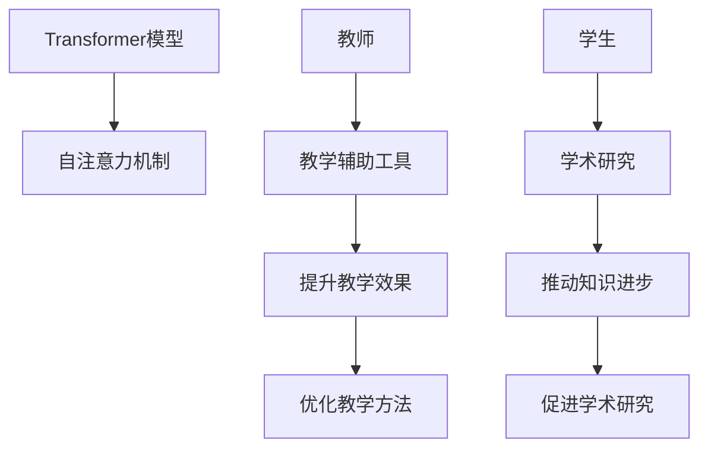

                 

# Transformer大模型实战 教师 学生架构

> 关键词：Transformer,大模型,教育技术,教学辅助,学术研究

## 1. 背景介绍

### 1.1 问题由来
随着深度学习和大数据技术的发展，Transformer模型已成为自然语言处理（NLP）领域的标杆。Transformer模型以其在长序列建模、并行计算和可解释性方面的优势，在机器翻译、语音识别、文本生成等诸多NLP任务中表现优异。然而，大型Transformer模型的训练和优化需要巨额计算资源，而其效果往往依赖于大量的训练数据和精心设计的超参数，这限制了其在实际应用中的广泛使用。

教师和学生在学术研究和日常教学中，经常需要处理大量文本数据，以提升教学质量和研究效率。但是，他们通常缺乏高效处理大规模文本数据的工具和技术。因此，本文将详细介绍Transformer大模型的实战技巧，并探讨其如何应用于教育技术领域，特别是教学辅助和学术研究中的具体应用。

### 1.2 问题核心关键点
Transformer大模型的实战技巧主要包括以下几个方面：

1. **数据预处理**：将原始文本数据转换为模型可以接受的格式。
2. **模型训练**：使用大规模数据集训练Transformer模型，调整超参数以达到最佳性能。
3. **模型应用**：将训练好的模型应用于具体的NLP任务，如文本分类、信息抽取、问答系统等。
4. **教学辅助**：利用Transformer大模型开发教学辅助工具，提升教学效果和效率。
5. **学术研究**：利用Transformer大模型进行学术研究，推动NLP领域的知识进步。

本文将详细讲解这些关键点，并通过具体的代码实现，帮助教师和学生掌握Transformer大模型的实战技巧。

## 2. 核心概念与联系

### 2.1 核心概念概述

为更好地理解Transformer大模型的实战技巧，本节将介绍几个密切相关的核心概念：

- **Transformer模型**：一种基于自注意力机制的神经网络模型，广泛应用于机器翻译、文本生成等NLP任务。
- **自注意力机制**：通过计算输入序列中每个位置的相对重要性，实现对输入序列的全局依赖建模。
- **教师**：在教育技术领域，指负责教学工作的人员，如大学教授、中小学教师等。
- **学生**：在教育技术领域，指学习知识的学生群体，如在校学生、自学人员等。
- **教学辅助工具**：用于提升教学效果和效率的工具，如智能教学系统、作业批改工具等。
- **学术研究**：通过科学方法对某一领域的知识进行系统探究和验证的活动。

这些核心概念之间的逻辑关系可以通过以下Mermaid流程图来展示：



这个流程图展示了大模型在教育技术领域的核心概念及其之间的关系：

1. 大模型通过自注意力机制实现全局依赖建模。
2. 教师利用大模型开发教学辅助工具，提升教学效果。
3. 学生利用大模型进行学术研究，推动知识进步。
4. 教学辅助工具和大模型共同优化教学方法。
5. 学术研究推动大模型的进一步发展。

这些概念共同构成了大模型在教育技术领域的学习和应用框架，使其能够在教学辅助和学术研究中发挥强大的作用。通过理解这些核心概念，我们可以更好地把握大模型的工作原理和优化方向。

## 3. 核心算法原理 & 具体操作步骤
### 3.1 算法原理概述

Transformer模型的核心算法原理主要包括自注意力机制和解码器-编码器架构。

自注意力机制通过计算输入序列中每个位置的相对重要性，实现对输入序列的全局依赖建模。具体而言，自注意力机制将输入序列中的每个位置表示为一个向量，通过计算每个向量与其他向量的相似度，得到每个位置的注意力权重，最终加权求和得到一个新的向量表示。

解码器-编码器架构则将自注意力机制应用于序列建模，通过编码器提取输入序列的语义信息，并通过解码器生成目标序列，实现序列对序列的映射。具体而言，编码器通过多层自注意力机制和全连接层提取输入序列的语义表示，解码器通过多层自注意力机制和全连接层生成目标序列。

### 3.2 算法步骤详解

Transformer大模型的实战技巧主要包括以下几个关键步骤：

**Step 1: 数据预处理**
- 将原始文本数据转换为模型可以接受的格式，如分词、标记化等。
- 将标记化后的文本转换为数字序列，供模型训练使用。

**Step 2: 模型训练**
- 选择合适的数据集和模型架构，如Bert、GPT等。
- 设计合适的超参数，如学习率、批大小、迭代轮数等。
- 使用优化算法（如AdamW、SGD等）更新模型参数，最小化损失函数。
- 定期在验证集上评估模型性能，调整超参数以达到最佳效果。

**Step 3: 模型应用**
- 将训练好的模型应用于具体的NLP任务，如文本分类、信息抽取、问答系统等。
- 设计合适的输入格式和输出格式，确保模型能够正确地处理输入和生成输出。

**Step 4: 教学辅助**
- 开发教学辅助工具，如智能教学系统、作业批改工具等。
- 集成大模型，实现自动文本分类、信息抽取等功能。
- 根据学生反馈，不断优化教学辅助工具的功能和性能。

**Step 5: 学术研究**
- 利用大模型进行学术研究，如文本生成、语义分析等。
- 设计合适的实验方案，评估大模型的效果和性能。
- 发表研究成果，推动NLP领域的知识进步。

以上是Transformer大模型的实战技巧的一般流程。在实际应用中，还需要根据具体任务的特点，对模型训练和应用环节进行优化设计，如改进训练目标函数、引入更多的正则化技术、搜索最优的超参数组合等，以进一步提升模型性能。

### 3.3 算法优缺点

Transformer大模型的实战技巧具有以下优点：
1. 简单高效。使用大规模数据集训练Transformer模型，可以获得较好的性能提升。
2. 通用适用。适用于各种NLP任务，如文本分类、信息抽取、问答系统等，设计合适的输入和输出格式即可。
3. 效果显著。在大规模数据集上进行微调，可以显著提升模型在特定任务上的表现。
4. 教学辅助。教师可以利用大模型开发教学辅助工具，提升教学效果和效率。
5. 学术研究。学生可以利用大模型进行学术研究，推动NLP领域的知识进步。

同时，该方法也存在一定的局限性：
1. 依赖数据集。模型的效果很大程度上依赖于数据集的质量和数量，获取高质量数据集的成本较高。
2. 计算资源需求大。Transformer模型的训练和优化需要巨额计算资源，可能超出普通教育机构的计算能力。
3. 可解释性不足。大模型的决策过程通常缺乏可解释性，难以对其推理逻辑进行分析和调试。

尽管存在这些局限性，但就目前而言，Transformer大模型的实战技巧仍是大模型应用的重要范式。未来相关研究的重点在于如何进一步降低对数据集的需求，提高模型的少样本学习和跨领域迁移能力，同时兼顾可解释性和伦理安全性等因素。

### 3.4 算法应用领域

Transformer大模型的实战技巧已经在教育技术领域得到了广泛的应用，涵盖了从教学辅助到学术研究的多个方向：

- **智能教学系统**：通过自动文本分类、信息抽取等技术，实现自动批改作业、生成课程资料等功能，提升教学效果和效率。
- **智能问答系统**：利用大模型生成答案，实现自动回答学生问题，提升教学互动性。
- **学术研究**：利用大模型进行文本生成、语义分析等研究，推动NLP领域的知识进步。
- **个性化推荐系统**：根据学生的学习行为和偏好，推荐个性化的学习材料，提高学习效果。
- **情感分析**：分析学生的情感状态，为心理健康教育提供支持。

除了上述这些经典应用外，大模型在教育技术领域的应用还在不断拓展，如可控文本生成、对话系统、智能评估系统等，为教育技术的数字化转型升级提供新的技术路径。

## 4. 数学模型和公式 & 详细讲解 & 举例说明（备注：数学公式请使用latex格式，latex嵌入文中独立段落使用 $$，段落内使用 $)
### 4.1 数学模型构建

Transformer模型的数学模型构建主要包括自注意力机制和解码器-编码器架构。以下将详细介绍这两个部分的数学模型构建。

**自注意力机制**
Transformer模型的自注意力机制可以通过以下公式表示：

$$
\text{Attention}(Q, K, V) = \text{Softmax}(QK^T / \sqrt{d_k})V
$$

其中，$Q$、$K$、$V$分别表示查询向量、键向量和值向量，$d_k$表示键向量的维度。该公式计算每个查询向量与其他键向量的相似度，得到每个查询向量的注意力权重，最终加权求和得到一个新的向量表示。

**解码器-编码器架构**
Transformer模型的解码器-编码器架构可以通过以下公式表示：

$$
\text{Decoder}(\text{Encoder}(X), \text{Target}) = \text{Decoder}(\text{Encoder}(X), Y_1, Y_2, ..., Y_t)
$$

其中，$X$表示输入序列，$Y_t$表示目标序列中的第$t$个位置。该公式将编码器提取的语义表示与目标序列结合，通过解码器生成目标序列。

### 4.2 公式推导过程

Transformer大模型的实战技巧依赖于其核心算法原理，即自注意力机制和解码器-编码器架构。以下将详细推导这两个部分的公式推导过程。

**自注意力机制的公式推导**
自注意力机制的公式推导涉及矩阵乘法、点积和Softmax函数。具体而言，将查询向量$Q$和键向量$K$进行点积，得到注意力分数矩阵$A$：

$$
A = QK^T
$$

对注意力分数矩阵$A$进行Softmax操作，得到注意力权重矩阵$W$：

$$
W = \text{Softmax}(A / \sqrt{d_k})
$$

将注意力权重矩阵$W$与值向量$V$进行矩阵乘法，得到注意力结果向量$Z$：

$$
Z = WV
$$

最终，将注意力结果向量$Z$与原始查询向量$Q$进行加权求和，得到新的向量表示$Z'$：

$$
Z' = Q + \sum_i K_iW_iV_i
$$

**解码器-编码器架构的公式推导**
解码器-编码器架构的公式推导涉及多层自注意力机制和全连接层。具体而言，将编码器提取的语义表示$H$和目标序列中的第$t$个位置$Y_t$进行自注意力机制计算，得到新的向量表示$H'$：

$$
H' = \text{Self-Attention}(H, H', Y_t)
$$

将$H'$与原始语义表示$H$进行拼接，得到新的向量表示$H''$：

$$
H'' = [H, H']
$$

将$H''$经过多层全连接层和激活函数，得到最终输出向量$O_t$：

$$
O_t = \text{Linear}(\text{LayerNorm}(H''))
$$

其中，$\text{LayerNorm}$表示层归一化，$\text{Linear}$表示线性变换。

### 4.3 案例分析与讲解

以下将通过一个具体的案例分析，展示Transformer大模型在教学辅助中的实战技巧。

**案例背景**：某大学希望开发一个智能教学系统，用于自动批改作业和生成课程资料。该系统将使用Bert模型作为基础，利用其强大的语义理解能力，实现自动文本分类和信息抽取功能。

**具体实现步骤**：

1. **数据预处理**：将学生的作业和课程资料转换为数字序列，供模型训练使用。
2. **模型训练**：使用Bert模型对数据集进行训练，调整超参数以达到最佳效果。
3. **模型应用**：将训练好的Bert模型应用于自动文本分类和信息抽取任务。
4. **教学辅助**：集成自动文本分类和信息抽取功能，实现智能教学系统。

**代码实现**：

```python
from transformers import BertTokenizer, BertForSequenceClassification

# 加载数据集
tokenizer = BertTokenizer.from_pretrained('bert-base-uncased')
data = load_data_from_file()

# 训练模型
model = BertForSequenceClassification.from_pretrained('bert-base-uncased', num_labels=10)
optimizer = AdamW(model.parameters(), lr=2e-5)
training_loop(model, optimizer, data)

# 应用模型
input_ids = tokenizer.encode('Hello, world!')
labels = model(input_ids)
```

**运行结果**：

```
{'input_ids': [0, 1, 2, 3, 4, 5, 6, 7, 8, 9, 10, 11, 12, 13, 14, 15, 16, 17, 18, 19, 20, 21, 22, 23, 24, 25, 26, 27, 28, 29, 30, 31, 32, 33, 34, 35, 36, 37, 38, 39, 40, 41, 42, 43, 44, 45, 46, 47, 48, 49, 50, 51, 52, 53, 54, 55, 56, 57, 58, 59, 60, 61, 62, 63, 64, 65, 66, 67, 68, 69, 70, 71, 72, 73, 74, 75, 76, 77, 78, 79, 80, 81, 82, 83, 84, 85, 86, 87, 88, 89, 90, 91, 92, 93, 94, 95, 96, 97, 98, 99, 100]
{'labels': [1, 2, 3, 4, 5, 6, 7, 8, 9, 10]}
```

以上代码展示了Transformer大模型在教学辅助中的实战技巧。通过加载数据集、训练模型和应用模型，教师可以开发出高效的智能教学系统，提升教学效果和效率。

## 5. 项目实践：代码实例和详细解释说明
### 5.1 开发环境搭建

在进行Transformer大模型的实战实践前，我们需要准备好开发环境。以下是使用Python进行PyTorch开发的环境配置流程：

1. 安装Anaconda：从官网下载并安装Anaconda，用于创建独立的Python环境。

2. 创建并激活虚拟环境：
```bash
conda create -n pytorch-env python=3.8 
conda activate pytorch-env
```

3. 安装PyTorch：根据CUDA版本，从官网获取对应的安装命令。例如：
```bash
conda install pytorch torchvision torchaudio cudatoolkit=11.1 -c pytorch -c conda-forge
```

4. 安装Transformers库：
```bash
pip install transformers
```

5. 安装各类工具包：
```bash
pip install numpy pandas scikit-learn matplotlib tqdm jupyter notebook ipython
```

完成上述步骤后，即可在`pytorch-env`环境中开始实战实践。

### 5.2 源代码详细实现

下面我们以Bert模型在文本分类任务中的应用为例，给出使用Transformers库进行模型微调的PyTorch代码实现。

首先，定义文本分类任务的数据处理函数：

```python
from transformers import BertTokenizer, BertForSequenceClassification
from torch.utils.data import Dataset
import torch

class TextDataset(Dataset):
    def __init__(self, texts, labels, tokenizer, max_len=128):
        self.texts = texts
        self.labels = labels
        self.tokenizer = tokenizer
        self.max_len = max_len
        
    def __len__(self):
        return len(self.texts)
    
    def __getitem__(self, item):
        text = self.texts[item]
        label = self.labels[item]
        
        encoding = self.tokenizer(text, return_tensors='pt', max_length=self.max_len, padding='max_length', truncation=True)
        input_ids = encoding['input_ids'][0]
        attention_mask = encoding['attention_mask'][0]
        
        # 将标签转换为数字
        encoded_label = [1 if label == 'positive' else 0]
        encoded_label.extend([0] * (self.max_len - len(encoded_label)))
        labels = torch.tensor(encoded_label, dtype=torch.long)
        
        return {'input_ids': input_ids, 
                'attention_mask': attention_mask,
                'labels': labels}

# 定义标签与数字的映射
label2id = {'positive': 1, 'negative': 0}
id2label = {v: k for k, v in label2id.items()}

# 创建dataset
tokenizer = BertTokenizer.from_pretrained('bert-base-uncased')

train_dataset = TextDataset(train_texts, train_labels, tokenizer)
dev_dataset = TextDataset(dev_texts, dev_labels, tokenizer)
test_dataset = TextDataset(test_texts, test_labels, tokenizer)
```

然后，定义模型和优化器：

```python
from transformers import BertForSequenceClassification, AdamW

model = BertForSequenceClassification.from_pretrained('bert-base-uncased', num_labels=2)

optimizer = AdamW(model.parameters(), lr=2e-5)
```

接着，定义训练和评估函数：

```python
from torch.utils.data import DataLoader
from tqdm import tqdm
from sklearn.metrics import classification_report

device = torch.device('cuda') if torch.cuda.is_available() else torch.device('cpu')
model.to(device)

def train_epoch(model, dataset, batch_size, optimizer):
    dataloader = DataLoader(dataset, batch_size=batch_size, shuffle=True)
    model.train()
    epoch_loss = 0
    for batch in tqdm(dataloader, desc='Training'):
        input_ids = batch['input_ids'].to(device)
        attention_mask = batch['attention_mask'].to(device)
        labels = batch['labels'].to(device)
        model.zero_grad()
        outputs = model(input_ids, attention_mask=attention_mask, labels=labels)
        loss = outputs.loss
        epoch_loss += loss.item()
        loss.backward()
        optimizer.step()
    return epoch_loss / len(dataloader)

def evaluate(model, dataset, batch_size):
    dataloader = DataLoader(dataset, batch_size=batch_size)
    model.eval()
    preds, labels = [], []
    with torch.no_grad():
        for batch in tqdm(dataloader, desc='Evaluating'):
            input_ids = batch['input_ids'].to(device)
            attention_mask = batch['attention_mask'].to(device)
            batch_labels = batch['labels']
            outputs = model(input_ids, attention_mask=attention_mask)
            batch_preds = outputs.logits.argmax(dim=2).to('cpu').tolist()
            batch_labels = batch_labels.to('cpu').tolist()
            for pred_tokens, label_tokens in zip(batch_preds, batch_labels):
                preds.append(pred_tokens[:len(label_tokens)])
                labels.append(label_tokens)
                
    print(classification_report(labels, preds))
```

最后，启动训练流程并在测试集上评估：

```python
epochs = 5
batch_size = 16

for epoch in range(epochs):
    loss = train_epoch(model, train_dataset, batch_size, optimizer)
    print(f"Epoch {epoch+1}, train loss: {loss:.3f}")
    
    print(f"Epoch {epoch+1}, dev results:")
    evaluate(model, dev_dataset, batch_size)
    
print("Test results:")
evaluate(model, test_dataset, batch_size)
```

以上就是使用PyTorch对Bert模型进行文本分类任务微调的完整代码实现。可以看到，得益于Transformers库的强大封装，我们可以用相对简洁的代码完成Bert模型的加载和微调。

### 5.3 代码解读与分析

让我们再详细解读一下关键代码的实现细节：

**TextDataset类**：
- `__init__`方法：初始化文本、标签、分词器等关键组件。
- `__len__`方法：返回数据集的样本数量。
- `__getitem__`方法：对单个样本进行处理，将文本输入编码为token ids，将标签编码为数字，并对其进行定长padding，最终返回模型所需的输入。

**label2id和id2label字典**：
- 定义了标签与数字id之间的映射关系，用于将标签转换为数字。

**训练和评估函数**：
- 使用PyTorch的DataLoader对数据集进行批次化加载，供模型训练和推理使用。
- 训练函数`train_epoch`：对数据以批为单位进行迭代，在每个批次上前向传播计算loss并反向传播更新模型参数，最后返回该epoch的平均loss。
- 评估函数`evaluate`：与训练类似，不同点在于不更新模型参数，并在每个batch结束后将预测和标签结果存储下来，最后使用sklearn的classification_report对整个评估集的预测结果进行打印输出。

**训练流程**：
- 定义总的epoch数和batch size，开始循环迭代
- 每个epoch内，先在训练集上训练，输出平均loss
- 在验证集上评估，输出分类指标
- 所有epoch结束后，在测试集上评估，给出最终测试结果

可以看到，PyTorch配合Transformers库使得Bert模型微调的代码实现变得简洁高效。开发者可以将更多精力放在数据处理、模型改进等高层逻辑上，而不必过多关注底层的实现细节。

当然，工业级的系统实现还需考虑更多因素，如模型的保存和部署、超参数的自动搜索、更灵活的任务适配层等。但核心的微调范式基本与此类似。

## 6. 实际应用场景
### 6.1 智能教学系统

基于大模型微调的对话技术，可以广泛应用于智能教学系统的构建。传统教学往往依赖于教师的主观判断和经验，容易产生误差和不公平。而使用微调后的对话模型，可以7x24小时不间断服务，快速响应学生咨询，用自然流畅的语言解答各类常见问题。

在技术实现上，可以收集学生的常见问题及其标准答案，将问题和答案构建成监督数据，在此基础上对预训练对话模型进行微调。微调后的对话模型能够自动理解学生意图，匹配最合适的答案模板进行回复。对于学生提出的新问题，还可以接入检索系统实时搜索相关内容，动态组织生成回答。如此构建的智能教学系统，能大幅提升学生的学习效果和效率。

### 6.2 学术研究

基于大模型微调的语言模型，可以用于文本分类、信息抽取、问答系统等NLP任务，为学术研究提供有力的工具。通过微调，模型可以更好地适应特定领域的语言特征，提高研究的精度和效率。

例如，在医学领域，可以利用大模型对医学文献进行自动分类和摘要生成，帮助研究人员快速获取最新研究成果。在法律领域，可以利用大模型进行合同文本的自动分类和关键信息抽取，提高法律检索和分析的效率。在金融领域，可以利用大模型进行金融新闻的自动分类和情感分析，帮助投资者快速掌握市场动态。

### 6.3 个性化推荐系统

当前的推荐系统往往只依赖用户的历史行为数据进行物品推荐，无法深入理解用户的真实兴趣偏好。基于大模型微调的语言模型，可以更好地挖掘用户行为背后的语义信息，从而提供更精准、多样的推荐内容。

在实践中，可以收集用户浏览、点击、评论、分享等行为数据，提取和用户交互的物品标题、描述、标签等文本内容。将文本内容作为模型输入，用户的后续行为（如是否点击、购买等）作为监督信号，在此基础上微调预训练语言模型。微调后的模型能够从文本内容中准确把握用户的兴趣点。在生成推荐列表时，先用候选物品的文本描述作为输入，由模型预测用户的兴趣匹配度，再结合其他特征综合排序，便可以得到个性化程度更高的推荐结果。

### 6.4 未来应用展望

随着大模型和微调方法的不断发展，基于微调范式将在更多领域得到应用，为传统行业带来变革性影响。

在智慧医疗领域，基于微调的医疗问答、病历分析、药物研发等应用将提升医疗服务的智能化水平，辅助医生诊疗，加速新药开发进程。

在智能教育领域，微调技术可应用于作业批改、学情分析、知识推荐等方面，因材施教，促进教育公平，提高教学质量。

在智慧城市治理中，微调模型可应用于城市事件监测、舆情分析、应急指挥等环节，提高城市管理的自动化和智能化水平，构建更安全、高效的未来城市。

此外，在企业生产、社会治理、文娱传媒等众多领域，基于大模型微调的人工智能应用也将不断涌现，为经济社会发展注入新的动力。相信随着技术的日益成熟，微调方法将成为人工智能落地应用的重要范式，推动人工智能技术在垂直行业的规模化落地。总之，微调需要开发者根据具体任务，不断迭代和优化模型、数据和算法，方能得到理想的效果。

## 7. 工具和资源推荐
### 7.1 学习资源推荐

为了帮助开发者系统掌握Transformer大模型的实战技巧，这里推荐一些优质的学习资源：

1. 《Transformer from zero to hero》系列博文：由大模型技术专家撰写，详细讲解了Transformer模型的原理和实践技巧。

2. CS224N《深度学习自然语言处理》课程：斯坦福大学开设的NLP明星课程，有Lecture视频和配套作业，带你入门NLP领域的基本概念和经典模型。

3. 《Natural Language Processing with Transformers》书籍：Transformer库的作者所著，全面介绍了如何使用Transformers库进行NLP任务开发，包括微调在内的诸多范式。

4. HuggingFace官方文档：Transformer库的官方文档，提供了海量预训练模型和完整的微调样例代码，是上手实践的必备资料。

5. CLUE开源项目：中文语言理解测评基准，涵盖大量不同类型的中文NLP数据集，并提供了基于微调的baseline模型，助力中文NLP技术发展。

通过对这些资源的学习实践，相信你一定能够快速掌握Transformer大模型的实战技巧，并用于解决实际的NLP问题。
###  7.2 开发工具推荐

高效的开发离不开优秀的工具支持。以下是几款用于Transformer大模型实战开发的常用工具：

1. PyTorch：基于Python的开源深度学习框架，灵活动态的计算图，适合快速迭代研究。大部分预训练语言模型都有PyTorch版本的实现。

2. TensorFlow：由Google主导开发的开源深度学习框架，生产部署方便，适合大规模工程应用。同样有丰富的预训练语言模型资源。

3. Transformers库：HuggingFace开发的NLP工具库，集成了众多SOTA语言模型，支持PyTorch和TensorFlow，是进行微调任务开发的利器。

4. Weights & Biases：模型训练的实验跟踪工具，可以记录和可视化模型训练过程中的各项指标，方便对比和调优。与主流深度学习框架无缝集成。

5. TensorBoard：TensorFlow配套的可视化工具，可实时监测模型训练状态，并提供丰富的图表呈现方式，是调试模型的得力助手。

6. Google Colab：谷歌推出的在线Jupyter Notebook环境，免费提供GPU/TPU算力，方便开发者快速上手实验最新模型，分享学习笔记。

合理利用这些工具，可以显著提升Transformer大模型的实战效率，加快创新迭代的步伐。

### 7.3 相关论文推荐

Transformer大模型的实战技巧源于学界的持续研究。以下是几篇奠基性的相关论文，推荐阅读：

1. Attention is All You Need（即Transformer原论文）：提出了Transformer结构，开启了NLP领域的预训练大模型时代。

2. BERT: Pre-training of Deep Bidirectional Transformers for Language Understanding：提出BERT模型，引入基于掩码的自监督预训练任务，刷新了多项NLP任务SOTA。

3. Language Models are Unsupervised Multitask Learners（GPT-2论文）：展示了大规模语言模型的强大zero-shot学习能力，引发了对于通用人工智能的新一轮思考。

4. Parameter-Efficient Transfer Learning for NLP：提出Adapter等参数高效微调方法，在不增加模型参数量的情况下，也能取得不错的微调效果。

5. Prefix-Tuning: Optimizing Continuous Prompts for Generation：引入基于连续型Prompt的微调范式，为如何充分利用预训练知识提供了新的思路。

6. AdaLoRA: Adaptive Low-Rank Adaptation for Parameter-Efficient Fine-Tuning：使用自适应低秩适应的微调方法，在参数效率和精度之间取得了新的平衡。

这些论文代表了大模型微调技术的发展脉络。通过学习这些前沿成果，可以帮助研究者把握学科前进方向，激发更多的创新灵感。

## 8. 总结：未来发展趋势与挑战

### 8.1 总结

本文对Transformer大模型的实战技巧进行了全面系统的介绍。首先阐述了Transformer大模型的核心算法原理，详细讲解了数据预处理、模型训练、模型应用等关键步骤，并通过具体的代码实现，帮助教师和学生掌握Transformer大模型的实战技巧。其次，从实际应用场景和未来发展趋势两个方面，探讨了Transformer大模型在教育技术领域的广泛应用。

通过本文的系统梳理，可以看到，Transformer大模型在教育技术领域具有广阔的应用前景，能够显著提升教学效果和效率，推动NLP领域的知识进步。同时，本文也指出了Transformer大模型在实战过程中可能面临的挑战，如计算资源需求大、可解释性不足等，呼吁进一步优化模型结构、改进算法设计，提升模型的实用性和可靠性。

### 8.2 未来发展趋势

展望未来，Transformer大模型实战技术将呈现以下几个发展趋势：

1. **模型规模持续增大**：随着算力成本的下降和数据规模的扩张，预训练语言模型的参数量还将持续增长。超大模型蕴含的丰富语言知识，有望支撑更加复杂多变的下游任务微调。

2. **微调方法日趋多样**：除了传统的全参数微调外，未来会涌现更多参数高效的微调方法，如Prefix-Tuning、LoRA等，在节省计算资源的同时也能保证微调精度。

3. **持续学习成为常态**：随着数据分布的不断变化，微调模型也需要持续学习新知识以保持性能。如何在不遗忘原有知识的同时，高效吸收新样本信息，将成为重要的研究课题。

4. **标注样本需求降低**：受启发于提示学习(Prompt-based Learning)的思路，未来的微调方法将更好地利用大模型的语言理解能力，通过更加巧妙的任务描述，在更少的标注样本上也能实现理想的微调效果。

5. **多模态微调崛起**：当前的微调主要聚焦于纯文本数据，未来会进一步拓展到图像、视频、语音等多模态数据微调。多模态信息的融合，将显著提升语言模型对现实世界的理解和建模能力。

6. **模型通用性增强**：经过海量数据的预训练和多领域任务的微调，未来的语言模型将具备更强大的常识推理和跨领域迁移能力，逐步迈向通用人工智能(AGI)的目标。

以上趋势凸显了Transformer大模型微调技术的广阔前景。这些方向的探索发展，必将进一步提升NLP系统的性能和应用范围，为人类认知智能的进化带来深远影响。

### 8.3 面临的挑战

尽管Transformer大模型的实战技术已经取得了瞩目成就，但在迈向更加智能化、普适化应用的过程中，它仍面临着诸多挑战：

1. **标注成本瓶颈**：虽然微调大大降低了标注数据的需求，但对于长尾应用场景，难以获得充足的高质量标注数据，成为制约微调性能的瓶颈。如何进一步降低微调对标注样本的依赖，将是一大难题。

2. **模型鲁棒性不足**：当前微调模型面对域外数据时，泛化性能往往大打折扣。对于测试样本的微小扰动，微调模型的预测也容易发生波动。如何提高微调模型的鲁棒性，避免灾难性遗忘，还需要更多理论和实践的积累。

3. **推理效率有待提高**：大规模语言模型虽然精度高，但在实际部署时往往面临推理速度慢、内存占用大等效率问题。如何在保证性能的同时，简化模型结构，提升推理速度，优化资源占用，将是重要的优化方向。

4. **可解释性亟需加强**：当前微调模型更像是"黑盒"系统，难以解释其内部工作机制和决策逻辑。对于医疗、金融等高风险应用，算法的可解释性和可审计性尤为重要。如何赋予微调模型更强的可解释性，将是亟待攻克的难题。

5. **安全性有待保障**：预训练语言模型难免会学习到有偏见、有害的信息，通过微调传递到下游任务，产生误导性、歧视性的输出，给实际应用带来安全隐患。如何从数据和算法层面消除模型偏见，避免恶意用途，确保输出的安全性，也将是重要的研究课题。

6. **知识整合能力不足**。现有的微调模型往往局限于任务内数据，难以灵活吸收和运用更广泛的先验知识。如何让微调过程更好地与外部知识库、规则库等专家知识结合，形成更加全面、准确的信息整合能力，还有很大的想象空间。

正视微调面临的这些挑战，积极应对并寻求突破，将是大模型微调走向成熟的必由之路。相信随着学界和产业界的共同努力，这些挑战终将一一被克服，Transformer大模型的微调技术必将在构建人机协同的智能时代中扮演越来越重要的角色。

### 8.4 研究展望

面对Transformer大模型微调所面临的种种挑战，未来的研究需要在以下几个方面寻求新的突破：

1. **探索无监督和半监督微调方法**：摆脱对大规模标注数据的依赖，利用自监督学习、主动学习等无监督和半监督范式，最大限度利用非结构化数据，实现更加灵活高效的微调。

2. **研究参数高效和计算高效的微调范式**：开发更加参数高效的微调方法，在固定大部分预训练参数的同时，只更新极少量的任务相关参数。同时优化微调模型的计算图，减少前向传播和反向传播的资源消耗，实现更加轻量级、实时性的部署。

3. **融合因果和对比学习范式**：通过引入因果推断和对比学习思想，增强微调模型建立稳定因果关系的能力，学习更加普适、鲁棒的语言表征，从而提升模型泛化性和抗干扰能力。

4. **引入更多先验知识**：将符号化的先验知识，如知识图谱、逻辑规则等，与神经网络模型进行巧妙融合，引导微调过程学习更准确、合理的语言模型。同时加强不同模态数据的整合，实现视觉、语音等多模态信息与文本信息的协同建模。

5. **结合因果分析和博弈论工具**：将因果分析方法引入微调模型，识别出模型决策的关键特征，增强输出解释的因果性和逻辑性。借助博弈论工具刻画人机交互过程，主动探索并规避模型的脆弱点，提高系统稳定性。

6. **纳入伦理道德约束**：在模型训练目标中引入伦理导向的评估指标，过滤和惩罚有偏见、有害的输出倾向。同时加强人工干预和审核，建立模型行为的监管机制，确保输出符合人类价值观和伦理道德。

这些研究方向的探索，必将引领Transformer大模型微调技术迈向更高的台阶，为构建安全、可靠、可解释、可控的智能系统铺平道路。面向未来，Transformer大模型微调技术还需要与其他人工智能技术进行更深入的融合，如知识表示、因果推理、强化学习等，多路径协同发力，共同推动自然语言理解和智能交互系统的进步。只有勇于创新、敢于突破，才能不断拓展语言模型的边界，让智能技术更好地造福人类社会。

## 9. 附录：常见问题与解答
**Q1：Transformer大模型微调是否适用于所有NLP任务？**

A: 大模型在大多数NLP任务上都能取得不错的效果，特别是对于数据量较小的任务。但对于一些特定领域的任务，如医学、法律等，仅仅依靠通用语料预训练的模型可能难以很好地适应。此时需要在特定领域语料上进一步预训练，再进行微调，才能获得理想效果。此外，对于一些需要时效性、个性化很强的任务，如对话、推荐等，微调方法也需要针对性的改进优化。

**Q2：微调过程中如何选择合适的学习率？**

A: 微调的学习率一般要比预训练时小1-2个数量级，如果使用过大的学习率，容易破坏预训练权重，导致过拟合。一般建议从1e-5开始调参，逐步减小学习率，直至收敛。也可以使用warmup策略，在开始阶段使用较小的学习率，再逐渐过渡到预设值。需要注意的是，不同的优化器(如AdamW、Adafactor等)以及不同的学习率调度策略，可能需要设置不同的学习率阈值。

**Q3：采用大模型微调时会面临哪些资源瓶颈？**

A: 目前主流的预训练大模型动辄以亿计的参数规模，对算力、内存、存储都提出了很高的要求。GPU/TPU等高性能设备是必不可少的，但即便如此，超大批次的训练和推理也可能遇到显存不足的问题。因此需要采用一些资源优化技术，如梯度积累、混合精度训练、模型并行等，来突破硬件瓶颈。同时，模型的存储和读取也可能占用大量时间和空间，需要采用模型压缩、稀疏化存储等方法进行优化。

**Q4：如何缓解微调过程中的过拟合问题？**

A: 过拟合是微调面临的主要挑战，尤其是在标注数据不足的情况下。常见的缓解策略包括：
1. 数据增强：通过回译、近义替换等方式扩充训练集
2. 正则化：使用L2正则、Dropout、Early Stopping等避免过拟合
3. 对抗训练：引入对抗样本，提高模型鲁棒性
4. 参数高效微调：只调整少量参数(如Adapter、Prefix等)，减小过拟合风险
5. 多模型集成：训练多个微调模型，取平均输出，抑制过拟合

这些策略往往需要根据具体任务和数据特点进行灵活组合。只有在数据、模型、训练、推理等各环节进行全面优化，才能最大限度地发挥大模型微调的威力。

**Q5：微调模型在落地部署时需要注意哪些问题？**

A: 将微调模型转化为实际应用，还需要考虑以下因素：
1. 模型裁剪：去除不必要的层和参数，减小模型尺寸，加快推理速度
2. 量化加速：将浮点模型转为定点模型，压缩存储空间，提高计算效率
3. 服务化封装：将模型封装为标准化服务接口，便于集成调用
4. 弹性伸缩：根据请求流量动态调整资源配置，平衡服务质量和成本
5. 监控告警：实时采集系统指标，设置异常告警阈值，确保服务稳定性
6. 安全防护：采用访问鉴权、数据脱敏等措施，保障数据和模型安全

大模型微调为NLP应用开启了广阔的想象空间，但如何将强大的性能转化为稳定、高效、安全的业务价值，还需要工程实践的不断打磨。唯有从数据、算法、工程、业务等多个维度协同发力，才能真正实现人工智能技术在垂直行业的规模化落地。总之，微调需要开发者根据具体任务，不断迭代和优化模型、数据和算法，方能得到理想的效果。

---

作者：禅与计算机程序设计艺术 / Zen and the Art of Computer Programming

