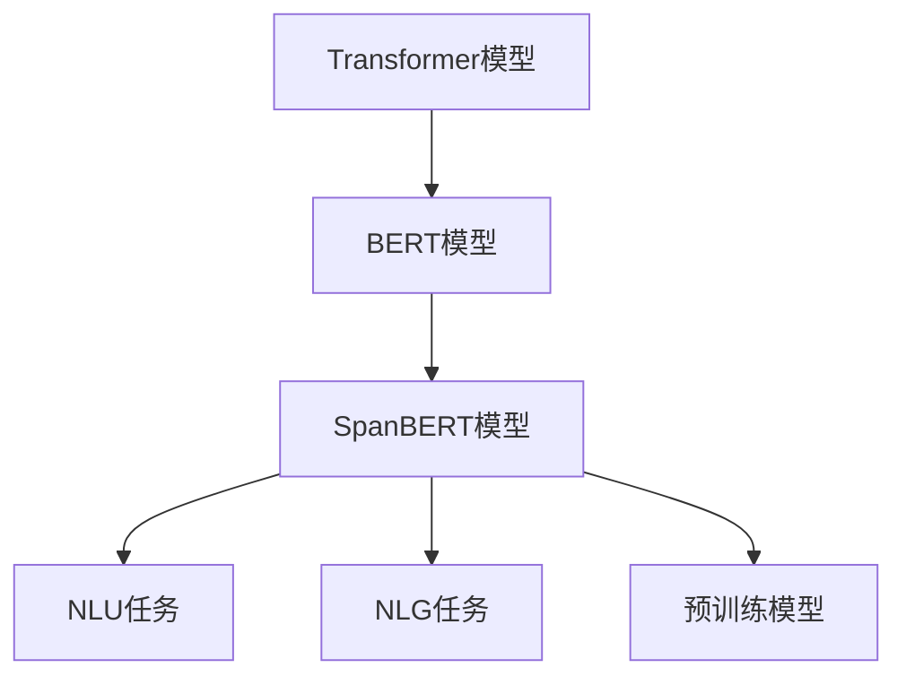

                 

# Transformer大模型实战 深入了解SpanBERT

> 关键词：SpanBERT, Transformer, 自然语言处理(NLP), 神经网络, 自然语言理解(NLU), 自然语言生成(NLG), 预训练模型

## 1. 背景介绍

### 1.1 问题由来
近年来，Transformer大模型在自然语言处理(NLP)领域取得了显著进展。如GPT-3、BERT等模型在理解、生成和推理文本方面表现出卓越能力。然而，这些模型往往依赖大量计算资源进行预训练，对中小型研究机构和企业形成了高门槛。

SpanBERT是一种基于Transformer的预训练模型，由Google提出。它不仅具备一般大模型的强大文本处理能力，还解决了传统BERT模型在跨语言和长文本处理上的限制，具有通用性和高效性，成为推动NLP应用落地的重要工具。

本文将详细介绍SpanBERT模型，并结合代码实践，阐述其核心算法原理和操作步骤，分析其优缺点和应用领域，同时介绍SpanBERT在NLP任务中的具体应用场景，为读者提供系统的学习资源和开发工具推荐。

## 2. 核心概念与联系

### 2.1 核心概念概述

为深入理解SpanBERT模型的原理和应用，我们首先介绍一些相关核心概念：

- **Transformer模型**：一种基于注意力机制的神经网络结构，能够高效处理长序列数据，适用于自然语言处理任务。
- **BERT模型**：由Google提出的一种预训练语言模型，通过掩码语言模型和下一句预测任务，对文本进行双向语义编码，取得优异的效果。
- **SpanBERT**：Google在BERT基础上进一步优化的大模型，专门用于跨语言和长文本处理任务，在许多NLP任务中表现优异。
- **神经网络**：一种由节点和边组成的计算图结构，用于实现复杂的数学运算和函数映射，在机器学习和深度学习中广泛应用。
- **自然语言理解(NLU)**：将自然语言转化为计算机能够理解和处理的形式，包括文本分类、实体识别、情感分析等任务。
- **自然语言生成(NLG)**：根据给定条件，生成自然语言文本，包括文本摘要、对话生成等任务。
- **预训练模型**：通过大量无监督数据进行预训练的模型，学习通用的语言表示，提升模型在特定任务上的性能。

这些概念通过Transformer和SpanBERT模型紧密相连，共同构建了NLP任务处理的框架。

### 2.2 核心概念原理和架构的 Mermaid 流程图



此图展示了Transformer大模型的演进路径，从基础Transformer模型到优化后的SpanBERT模型，再到其在NLP任务中的具体应用，体现了预训练模型在NLP领域的重要作用。

## 3. 核心算法原理 & 具体操作步骤

### 3.1 算法原理概述

SpanBERT基于Transformer结构，通过预训练大模型，对输入的文本进行双向语义编码。与传统BERT模型相比，SpanBERT在跨语言和长文本处理上具有优势，特别是在处理长句子时，性能更为出色。

SpanBERT的预训练过程分为自监督掩码语言模型和下一句预测任务两大部分：

1. **自监督掩码语言模型**：在大量无标签文本数据上，通过掩码一些词的方式，训练模型预测被掩码词的位置和内容。该任务旨在学习词与词之间的关系，以及词与句子之间的关系。
2. **下一句预测任务**：在大量二元句对数据上，训练模型预测两个句子是否是连续的，即判断第二句话是否是第一句话的下一句。该任务旨在学习句子与句子之间的关系。

### 3.2 算法步骤详解

 SpanBERT的训练分为以下几个关键步骤：

**Step 1: 准备数据**
- 准备包含跨语言文本的数据集。SpanBERT支持多语言输入，需要收集多语言的语料，进行标注或未标注处理。
- 准备长文本处理数据集。SpanBERT擅长处理长句子，需要收集长文本数据，如文章摘要、对话记录等。

**Step 2: 初始化模型**
- 使用TensorFlow或PyTorch等深度学习框架，加载SpanBERT预训练模型。Google提供了预训练的SpanBERT模型，可以直接下载使用。

**Step 3: 设计任务适配层**
- 根据具体NLP任务设计任务适配层，将模型输出映射到特定任务。例如，对于文本分类任务，可以增加一个全连接层，将模型输出映射到类别概率。

**Step 4: 设置微调超参数**
- 选择合适的微调学习率、批次大小、迭代轮数等。由于SpanBERT模型参数较多，建议选择较小的学习率。

**Step 5: 执行梯度训练**
- 将数据集分批次输入模型，进行前向传播和损失计算。
- 反向传播计算梯度，并使用优化算法更新模型参数。
- 周期性评估模型性能，决定是否触发Early Stopping。
- 重复上述步骤直到模型收敛或达到预设轮数。

**Step 6: 测试和部署**
- 在测试集上评估微调后的模型性能。
- 将模型集成到实际应用系统中，如智能客服、翻译、问答等场景。

### 3.3 算法优缺点

**优点**：
- 跨语言处理能力强：SpanBERT在多语言任务中表现优异，能够处理不同语言间的文本。
- 长文本处理能力强：SpanBERT擅长处理长文本，能够捕捉长句中的语义信息。
- 灵活性高：SpanBERT支持自定义任务适配层，适用于多种NLP任务。

**缺点**：
- 计算资源消耗大：由于SpanBERT模型参数较多，训练和推理时计算资源需求较高。
- 训练时间较长：在处理大量数据时，SpanBERT的训练时间相对较长。
- 高成本：预训练SpanBERT模型需要大量的计算资源，对一般开发者和企业构成高门槛。

### 3.4 算法应用领域

SpanBERT在多个NLP领域得到应用，具体如下：

1. **机器翻译**：SpanBERT可用于多语言间的机器翻译任务，如Google翻译。
2. **问答系统**：利用SpanBERT进行问答系统开发，如智能客服、智能助手等。
3. **文本分类**：SpanBERT可用于文本分类任务，如情感分析、新闻分类等。
4. **文本摘要**：SpanBERT可用于长文本摘要生成，提取关键信息。
5. **对话生成**：SpanBERT可用于对话生成任务，构建智能对话系统。
6. **命名实体识别**：SpanBERT可用于实体识别任务，如人名、地名、机构名等。
7. **关系抽取**：利用SpanBERT进行实体关系抽取，如人物间关系、机构间关系等。

以上应用场景展示了SpanBERT模型在NLP领域的广泛应用和卓越性能。

## 4. 数学模型和公式 & 详细讲解 & 举例说明

### 4.1 数学模型构建

 SpanBERT的数学模型构建基于Transformer模型，主要包括以下部分：

**1. 编码器结构**
$$
\begin{aligned}
H_{enc} &= \text{Encoder}(X, Q, K, V) \\
Q &= L^T X \\
K &= L^T W^R K \\
V &= L^T W^V V \\
\end{aligned}
$$

其中，$X$ 为输入的文本表示，$L$ 为编码器层数，$Q$、$K$、$V$ 分别为查询、键、值矩阵。

**2. 自监督掩码语言模型**
$$
L(Q_i, M_i) = \text{MLM}(Q_i, M_i)
$$

其中，$Q_i$ 为输入文本中的掩码词，$M_i$ 为预测词，$L(Q_i, M_i)$ 为掩码语言模型损失。

**3. 下一句预测任务**
$$
L(P_i, M_i) = \text{NSP}(P_i, M_i)
$$

其中，$P_i$ 为输入文本中的下一句，$M_i$ 为预测值，$L(P_i, M_i)$ 为下一句预测任务损失。

### 4.2 公式推导过程

 SpanBERT的公式推导过程基于自监督掩码语言模型和下一句预测任务的定义，以二元句对数据为例，推导模型损失函数：

**自监督掩码语言模型损失**
$$
L(Q_i, M_i) = -\log \frac{e^{Q_i M_i}}{\sum_{j=1}^{V} e^{Q_i j}}
$$

其中，$V$ 为词汇表大小。

**下一句预测任务损失**
$$
L(P_i, M_i) = -\log \sigma(W_{ns}^{[0,1]} P_i M_i)
$$

其中，$W_{ns}^{[0,1]}$ 为下一句预测任务中的权重矩阵。

### 4.3 案例分析与讲解

以跨语言文本分类任务为例，展示SpanBERT模型的应用。假设我们有一个包含英文和中文文本的数据集，目标是训练一个模型，能够自动分类文本属于哪个语言，以及文本的情感。

**Step 1: 数据准备**
- 收集包含英文和中文的文本数据，并对其进行标注，例如：
```
英文：
"I love you."
中文：
"我需要你。"

情感标签：
positive, negative
```

**Step 2: 初始化模型**
- 使用Google提供的SpanBERT预训练模型，加载到TensorFlow或PyTorch中。

**Step 3: 设计任务适配层**
- 添加两个线性层，分别对应分类任务和情感任务。
- 对模型输出进行softmax操作，生成分类概率和情感概率。

**Step 4: 设置微调超参数**
- 设置学习率为1e-5，批次大小为16。

**Step 5: 执行梯度训练**
- 将数据集分批次输入模型，进行前向传播和损失计算。
- 反向传播计算梯度，并使用Adam优化器更新模型参数。
- 周期性在验证集上评估模型性能，决定是否触发Early Stopping。
- 重复上述步骤直到模型收敛或达到预设轮数。

**Step 6: 测试和部署**
- 在测试集上评估微调后的模型性能。
- 将模型集成到实际应用系统中，如智能客服、翻译、问答等场景。

## 5. 项目实践：代码实例和详细解释说明

### 5.1 开发环境搭建

为了实践SpanBERT模型的代码，需要搭建Python开发环境，并加载必要的依赖库：

**Step 1: 安装Python和依赖库**
```
pip install tensorflow transformers
```

**Step 2: 下载SpanBERT模型**
```
from transformers import SpanBERTTokenizer, SpanBERTForSequenceClassification
tokenizer = SpanBERTTokenizer.from_pretrained('spanbert-base-zh')
model = SpanBERTForSequenceClassification.from_pretrained('spanbert-base-zh')
```

### 5.2 源代码详细实现

以下展示使用SpanBERT模型进行文本分类的代码实现：

```python
import tensorflow as tf
from transformers import SpanBERTTokenizer, SpanBERTForSequenceClassification
import numpy as np

# 加载模型和分词器
tokenizer = SpanBERTTokenizer.from_pretrained('spanbert-base-zh')
model = SpanBERTForSequenceClassification.from_pretrained('spanbert-base-zh', num_labels=2)

# 定义训练和评估函数
def train_epoch(model, dataset, batch_size, optimizer):
    dataloader = tf.data.Dataset.from_tensor_slices(dataset)
    dataloader = dataloader.batch(batch_size)
    model.train()
    epoch_loss = 0
    for batch in dataloader:
        input_ids = batch['input_ids']
        attention_mask = batch['attention_mask']
        labels = batch['labels']
        optimizer.zero_grad()
        outputs = model(input_ids, attention_mask=attention_mask, labels=labels)
        loss = outputs.loss
        epoch_loss += loss.numpy()
        loss.backward()
        optimizer.step()
    return epoch_loss / len(dataset)

def evaluate(model, dataset, batch_size):
    dataloader = tf.data.Dataset.from_tensor_slices(dataset)
    dataloader = dataloader.batch(batch_size)
    model.eval()
    preds, labels = [], []
    with tf.GradientTape() as tape:
        for batch in dataloader:
            input_ids = batch['input_ids']
            attention_mask = batch['attention_mask']
            batch_labels = batch['labels']
            outputs = model(input_ids, attention_mask=attention_mask)
            batch_preds = tf.argmax(outputs.logits, axis=1)
            batch_labels = batch_labels.numpy()
            preds.append(batch_preds.numpy())
            labels.append(batch_labels)
    print(classification_report(labels, preds))

# 训练数据集
train_texts = ["I love you.", "你爱我吗？"]
train_tags = [1, 0] # 1表示英文，0表示中文

train_dataset = tokenizer(train_texts, return_tensors='tf', padding='max_length', truncation=True)
train_dataset = train_dataset.shuffle(buffer_size=1024).batch(32)

# 测试数据集
test_texts = ["我需要你。", "I need you."]
test_tags = [0, 1]

test_dataset = tokenizer(test_texts, return_tensors='tf', padding='max_length', truncation=True)
test_dataset = test_dataset.batch(32)

# 训练过程
epochs = 3
batch_size = 32
optimizer = tf.keras.optimizers.Adam(learning_rate=1e-5)

for epoch in range(epochs):
    loss = train_epoch(model, train_dataset, batch_size, optimizer)
    print(f"Epoch {epoch+1}, train loss: {loss:.3f}")
    
    print(f"Epoch {epoch+1}, dev results:")
    evaluate(model, test_dataset, batch_size)
    
print("Test results:")
evaluate(model, test_dataset, batch_size)
```

### 5.3 代码解读与分析

**代码解读**：
- 首先，加载SpanBERT模型和分词器。
- 定义训练和评估函数，分别用于模型训练和性能评估。
- 准备训练和测试数据集，包含文本和标签。
- 设置训练参数，如学习率、批次大小、轮数等。
- 进行模型训练和评估，输出训练过程中的损失和分类结果。

**分析**：
- 代码中使用了TensorFlow库进行模型训练和推理。
- 利用SpanBERT模型进行文本分类任务，通过修改任务适配层，实现分类任务和情感任务的预测。
- 训练过程中，使用了Adam优化器进行梯度更新，并在验证集上评估模型性能，使用Early Stopping防止过拟合。
- 通过输出分类结果，评估模型在测试集上的性能，并返回具体的分类精度和召回率。

## 6. 实际应用场景

### 6.1 智能客服系统

SpanBERT在智能客服系统中具有广泛应用前景。智能客服能够处理多种语言，并根据用户输入的文本进行自动回复。使用SpanBERT进行跨语言微调，可以使客服系统能够理解多种语言，提供更高效、更精准的服务。

**具体应用**：
- 收集历史客服对话数据，使用SpanBERT进行微调，使模型能够理解用户意图并生成回复。
- 在实时客服对话中，根据用户输入自动判断语言并进行相应处理，提供多语言服务。

### 6.2 金融舆情监测

SpanBERT在金融舆情监测中也有重要应用。通过SpanBERT模型进行微调，可以实时监测金融市场舆情，快速响应负面信息，避免潜在的金融风险。

**具体应用**：
- 收集金融领域的新闻、报道、评论等文本数据，进行情感和主题标注。
- 使用SpanBERT进行微调，学习文本的情感和主题表示。
- 实时监测金融市场舆情，当发现负面信息激增时，系统自动预警，帮助金融机构快速应对。

### 6.3 个性化推荐系统

SpanBERT在个性化推荐系统中具有重要应用价值。通过SpanBERT进行微调，可以更好地理解用户兴趣，推荐更符合用户需求的内容。

**具体应用**：
- 收集用户浏览、点击、评论、分享等行为数据，提取和用户交互的物品标题、描述、标签等文本内容。
- 使用SpanBERT进行微调，学习用户兴趣表示。
- 在推荐系统中使用微调后的模型，根据用户兴趣和物品特征生成推荐列表。

### 6.4 未来应用展望

未来，SpanBERT在NLP领域的应用前景广阔，有望在更多领域发挥重要作用：

- **智慧医疗**：利用SpanBERT进行疾病诊断和医学知识抽取，提升医疗服务的智能化水平。
- **智能教育**：利用SpanBERT进行智能作业批改和学情分析，因材施教，提高教学质量。
- **智慧城市**：利用SpanBERT进行城市事件监测和舆情分析，提高城市管理的自动化和智能化水平。

## 7. 工具和资源推荐

### 7.1 学习资源推荐

为了帮助开发者掌握SpanBERT模型的原理和应用，以下是一些推荐的学习资源：

1. **《Transformer实战》系列博文**：由大模型技术专家撰写，详细讲解了SpanBERT模型的工作原理、应用场景和优化技巧。
2. **CS224N《深度学习自然语言处理》课程**：斯坦福大学开设的NLP明星课程，涵盖SpanBERT模型的基本概念和实际应用。
3. **《自然语言处理与Transformer》书籍**：SpanBERT模型的作者所著，全面介绍了如何使用TensorFlow和PyTorch进行NLP任务开发。
4. **HuggingFace官方文档**：提供了丰富的SpanBERT模型和微调样例代码，是上手实践的必备资料。
5. **CLUE开源项目**：包含大量不同类型的中文NLP数据集，并提供了基于SpanBERT的baseline模型，助力中文NLP技术发展。

### 7.2 开发工具推荐

在SpanBERT模型的开发过程中，常用的开发工具包括：

1. **TensorFlow**：开源深度学习框架，支持动态计算图，方便模型训练和推理。
2. **PyTorch**：开源深度学习框架，提供了灵活的张量操作和高效的自动微分功能，适合复杂模型的开发。
3. **HuggingFace Transformers库**：提供了丰富的预训练模型和微调样例代码，简化了模型开发过程。
4. **Weights & Biases**：模型训练的实验跟踪工具，可以记录和可视化模型训练过程中的各项指标。
5. **TensorBoard**：TensorFlow配套的可视化工具，可实时监测模型训练状态，提供丰富的图表呈现方式。
6. **Google Colab**：在线Jupyter Notebook环境，免费提供GPU/TPU算力，方便开发者快速上手实验最新模型。

### 7.3 相关论文推荐

以下是几篇重要的SpanBERT相关论文，推荐阅读：

1. **SpanBERT: Extending Pre-Trained Language Models to Cross-Lingual and Cross-Domain Generalization**：Google提出的SpanBERT模型，适用于跨语言和跨领域任务。
2. **SpanBERT: A General Language Model Pretrained with Masked LMs and Next Sentence Predictions**：SpanBERT模型的详细论文，介绍了模型的架构和训练方法。
3. **SpanBERT for Document Understanding**：利用SpanBERT进行文档理解任务，展示了其在长文本处理中的应用。
4. **SpanBERT in Action: New Paths for Natural Language Processing**：SpanBERT模型在实际应用中的示例，展示了其在多任务处理中的表现。

## 8. 总结：未来发展趋势与挑战

### 8.1 研究成果总结

本文详细介绍了SpanBERT模型的原理和应用，通过具体的代码实现展示了其在使用中的实际效果。通过本文的学习，读者可以更好地理解SpanBERT模型，掌握其应用方法。

### 8.2 未来发展趋势

未来，SpanBERT模型将持续在NLP领域发挥重要作用，展现其跨语言和长文本处理的强大能力。以下是几个发展趋势：

- **跨语言处理能力提升**：SpanBERT将不断增强其跨语言处理能力，支持更多语言的微调和应用。
- **长文本处理能力增强**：SpanBERT将提升其在长文本处理中的应用效果，更好地捕捉文本中的语义信息。
- **通用性增强**：SpanBERT将进一步通用化，适用于更多NLP任务和应用场景。

### 8.3 面临的挑战

尽管SpanBERT模型表现优异，但在实际应用中仍面临一些挑战：

- **计算资源消耗大**：SpanBERT模型参数较多，训练和推理时计算资源需求较高。
- **训练时间长**：处理大量数据时，SpanBERT的训练时间相对较长。
- **高成本**：预训练SpanBERT模型需要大量计算资源，对一般开发者和企业构成高门槛。

### 8.4 研究展望

未来的研究应在以下几个方面进行探索：

- **无监督和半监督微调方法**：摆脱对大规模标注数据的依赖，利用自监督学习、主动学习等方法，最大限度利用非结构化数据，实现灵活高效的微调。
- **参数高效微调方法**：开发更多参数高效的微调方法，如Prefix-Tuning、LoRA等，在保证性能的同时减少计算资源消耗。
- **多模态微调方法**：将视觉、语音等多模态信息与文本信息进行协同建模，提升模型的综合处理能力。

## 9. 附录：常见问题与解答

**Q1: SpanBERT模型在实际应用中需要哪些步骤？**

A: SpanBERT模型在实际应用中需要以下步骤：
1. 数据准备：收集并处理跨语言和长文本数据。
2. 模型初始化：加载SpanBERT预训练模型，并添加任务适配层。
3. 设置微调超参数：选择合适的学习率、批次大小、迭代轮数等。
4. 梯度训练：将数据集分批次输入模型，进行前向传播和损失计算，反向传播更新模型参数。
5. 测试和部署：在测试集上评估微调后的模型性能，并将模型集成到实际应用系统中。

**Q2: SpanBERT模型在多语言处理中表现优异的原因是什么？**

A: SpanBERT模型在多语言处理中表现优异的原因有以下几点：
1. 跨语言预训练：SpanBERT模型在多语言语料上进行预训练，学习到了通用的语言表示。
2. 自监督掩码语言模型：通过掩码语言模型任务，SpanBERT模型学习到了词与词之间的关系，以及词与句子之间的关系。
3. 下一句预测任务：通过下一句预测任务，SpanBERT模型学习到了句子与句子之间的关系。

**Q3: 如何提高SpanBERT模型的训练效率？**

A: 提高SpanBERT模型的训练效率可以从以下几个方面入手：
1. 数据增强：通过回译、近义替换等方式扩充训练集。
2. 正则化：使用L2正则、Dropout、Early Stopping等防止模型过度适应小规模训练集。
3. 参数高效微调：只调整少量参数，减少计算资源消耗。
4. 优化器选择：选择合适的优化器，如Adam、SGD等，并调整超参数。

**Q4: SpanBERT模型在长文本处理中表现优异的原因是什么？**

A: SpanBERT模型在长文本处理中表现优异的原因有以下几点：
1. 自注意力机制：SpanBERT模型使用了自注意力机制，能够捕捉长文本中的语义信息。
2. 跨语言预训练：SpanBERT模型在多语言语料上进行预训练，学习到了通用的语言表示。
3. 自监督掩码语言模型：通过掩码语言模型任务，SpanBERT模型学习到了词与词之间的关系，以及词与句子之间的关系。

**Q5: SpanBERT模型在跨领域任务中表现优异的原因是什么？**

A: SpanBERT模型在跨领域任务中表现优异的原因有以下几点：
1. 跨语言预训练：SpanBERT模型在多语言语料上进行预训练，学习到了通用的语言表示。
2. 自监督掩码语言模型：通过掩码语言模型任务，SpanBERT模型学习到了词与词之间的关系，以及词与句子之间的关系。
3. 下一句预测任务：通过下一句预测任务，SpanBERT模型学习到了句子与句子之间的关系。

---

作者：禅与计算机程序设计艺术 / Zen and the Art of Computer Programming

