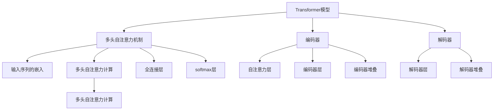

                 

# Transformer大模型实战 计算句子特征

> 关键词：Transformer, 句子特征, 计算, 自注意力, 编码器-解码器, 语言模型, 自然语言处理

## 1. 背景介绍

### 1.1 问题由来
Transformer是近年来NLP领域最成功的架构之一，其核心思想是利用自注意力机制捕捉输入序列的语义关系。在大规模语言模型的基础上，通过Transformer架构计算句子特征，可以大幅提升自然语言处理任务的效果。本节将介绍Transformer架构，并阐述计算句子特征的过程。

### 1.2 问题核心关键点
Transformer的核心思想是通过自注意力机制来计算每个token与序列中其他token之间的注意力权重，从而捕捉上下文信息。计算句子特征的过程包括输入序列的嵌入、多头自注意力计算、全连接层和softmax层的计算。

## 2. 核心概念与联系

### 2.1 核心概念概述

为了更好地理解Transformer大模型计算句子特征的原理，本节将介绍几个密切相关的核心概念：

- **Transformer模型**：基于自注意力机制的深度神经网络架构，适用于自然语言处理任务，能够学习长距离依赖。
- **多头自注意力机制**：Transformer模型的核心组件，通过多头并行计算每个token的注意力权重，捕捉不同层次的语义信息。
- **编码器-解码器**：Transformer模型中的两个主要部分，编码器负责输入序列的编码，解码器负责输出序列的解码。
- **语言模型**：通过Transformer模型计算句子特征的过程，可以看作是一种语言模型，能够预测序列的下一个token。
- **自注意力**：通过计算输入序列中不同token的注意力权重，捕捉上下文信息，增强模型的表达能力。

这些核心概念之间的逻辑关系可以通过以下Mermaid流程图来展示：



这个流程图展示了大模型计算句子特征的过程：

1. 输入序列经过多头自注意力机制，计算每个token与序列中其他token的注意力权重，捕捉上下文信息。
2. 编码器对输入序列进行编码，输出编码结果。
3. 解码器对编码结果进行解码，生成输出序列。
4. 多个编码器和解码器堆叠，增强模型的表达能力。

## 3. 核心算法原理 & 具体操作步骤
### 3.1 算法原理概述

Transformer大模型计算句子特征的过程可以分为以下几个步骤：

1. **输入序列的嵌入**：将输入的token序列转化为向量表示。
2. **多头自注意力计算**：计算输入序列中不同token的注意力权重，捕捉上下文信息。
3. **全连接层计算**：通过全连接层对自注意力计算的结果进行非线性变换。
4. **softmax层计算**：对全连接层的输出进行softmax操作，得到每个token的预测概率。
5. **编码器-解码器堆叠**：对输入序列进行多次编码和解码，增强模型的表达能力。

这些步骤中的每一个都包含了复杂的数学计算，下面将详细讲解这些计算过程。

### 3.2 算法步骤详解

**Step 1: 输入序列的嵌入**

输入序列的嵌入是将token序列转化为向量表示的过程。通常使用预训练的词嵌入矩阵，将每个token映射为固定维度的向量表示。对于每个token $x_i$，其向量表示 $x_i^{\text{emb}}$ 可以表示为：

$$
x_i^{\text{emb}} = \text{emb}(x_i) \in \mathbb{R}^d
$$

其中，$\text{emb}(x_i)$ 是词嵌入映射，$d$ 是嵌入向量的维度。

**Step 2: 多头自注意力计算**

多头自注意力计算是Transformer模型的核心组件，用于捕捉输入序列中不同token之间的语义关系。具体计算过程如下：

1. **输入投影**：首先对每个token的嵌入向量进行线性投影，得到三个不同的向量 $Q_i^{\text{proj}}$、$K_i^{\text{proj}}$、$V_i^{\text{proj}}$，分别表示查询向量、键向量和值向量。

$$
Q_i^{\text{proj}} = \text{emb}(x_i)W_Q^{\text{proj}} \in \mathbb{R}^{d_Q}
$$
$$
K_i^{\text{proj}} = \text{emb}(x_i)W_K^{\text{proj}} \in \mathbb{R}^{d_K}
$$
$$
V_i^{\text{proj}} = \text{emb}(x_i)W_V^{\text{proj}} \in \mathbb{R}^{d_V}
$$

其中，$W_Q^{\text{proj}}$、$W_K^{\text{proj}}$、$W_V^{\text{proj}}$ 是投影矩阵。

2. **自注意力计算**：计算每个token与序列中其他token的注意力权重，得到注意力向量 $A_i$。

$$
A_i = \text{softmax}\left(\frac{Q_i^{\text{proj}}K_j^{\text{proj}}}{\sqrt{d_K}}\right) \in \mathbb{R}^{N \times N}
$$

其中，$A_i$ 是 $i$ 位置的注意力向量，$N$ 是输入序列的长度。

3. **注意力加权计算**：将每个token与注意力向量 $A_i$ 相乘，得到加权后的值向量 $V_i^{\text{attn}}$。

$$
V_i^{\text{attn}} = \sum_{j=1}^N A_i[j]V_j^{\text{proj}} \in \mathbb{R}^{d_V}
$$

其中，$A_i[j]$ 是 $j$ 位置的注意力权重。

4. **多头自注意力计算**：通过多头并行计算，得到多个注意力向量 $A_i^h$ 和对应的加权值向量 $V_i^{\text{attn}}^h$。

$$
A_i^h = \text{softmax}\left(\frac{Q_i^{\text{proj}}K_j^{\text{proj}}}{\sqrt{d_K}}\right) \in \mathbb{R}^{N \times N}
$$
$$
V_i^{\text{attn}}^h = \sum_{j=1}^N A_i^h[j]V_j^{\text{proj}} \in \mathbb{R}^{d_V}
$$

其中，$h$ 表示头数。

**Step 3: 全连接层计算**

全连接层用于对多头自注意力计算的结果进行非线性变换，增强模型的表达能力。具体计算过程如下：

1. **线性变换**：对每个多头自注意力计算的结果进行线性变换，得到新的向量 $H_i$。

$$
H_i = \text{emb}(x_i)(W_H^{\text{emb}}) \in \mathbb{R}^{d_H}
$$

其中，$W_H^{\text{emb}}$ 是嵌入到全连接层的投影矩阵。

2. **非线性变换**：对线性变换的结果进行非线性变换，得到最终输出向量 $H_i^{\text{out}}$。

$$
H_i^{\text{out}} = \text{tanh}(H_iW_H^{\text{out}} + b_H) \in \mathbb{R}^{d_H}
$$

其中，$W_H^{\text{out}}$ 和 $b_H$ 是全连接层的权重矩阵和偏置向量。

**Step 4: softmax层计算**

softmax层用于对全连接层的输出进行归一化处理，得到每个token的预测概率。具体计算过程如下：

1. **线性变换**：对全连接层的输出进行线性变换，得到新的向量 $H_i^{\text{lin}}$。

$$
H_i^{\text{lin}} = H_iW^{\text{lin}} + b^{\text{lin}} \in \mathbb{R}^{d_O}
$$

其中，$W^{\text{lin}}$ 和 $b^{\text{lin}}$ 是全连接层的权重矩阵和偏置向量。

2. **softmax操作**：对线性变换的结果进行softmax操作，得到每个token的预测概率。

$$
p_i = \text{softmax}(H_i^{\text{lin}}) \in \mathbb{R}^V
$$

其中，$V$ 是词汇表的大小。

**Step 5: 编码器-解码器堆叠**

编码器-解码器堆叠用于对输入序列进行多次编码和解码，增强模型的表达能力。具体计算过程如下：

1. **编码器堆叠**：对输入序列进行多次编码，得到编码器的输出 $H^{\text{enc}}$。

$$
H^{\text{enc}} = \text{Encoder}(Q, K, V) \in \mathbb{R}^{N \times d_H}
$$

其中，$Q$、$K$、$V$ 是输入序列的查询、键和值矩阵，$d_H$ 是编码器层的隐藏向量维度。

2. **解码器堆叠**：对编码器的输出进行解码，得到解码器的输出 $H^{\text{dec}}$。

$$
H^{\text{dec}} = \text{Decoder}(Q, K, V) \in \mathbb{R}^{N \times d_H}
$$

其中，$Q$、$K$、$V$ 是编码器的输出矩阵。

### 3.3 算法优缺点

Transformer大模型计算句子特征的方法具有以下优点：

1. **表达能力强**：多头自注意力机制能够捕捉输入序列中不同token之间的语义关系，增强模型的表达能力。
2. **并行计算**：多头并行计算能够提高计算效率，加速模型的训练和推理过程。
3. **鲁棒性高**：自注意力机制能够捕捉长距离依赖，增强模型的鲁棒性。

但同时，Transformer大模型计算句子特征的方法也存在一些缺点：

1. **计算复杂度高**：多头自注意力计算和全连接层的计算复杂度较高，需要较大的计算资源。
2. **内存占用大**：模型参数较多，内存占用较大，需要优化内存使用。
3. **容易过拟合**：由于模型较大，容易过拟合，需要进行正则化和优化超参数。

### 3.4 算法应用领域

Transformer大模型计算句子特征的方法已经广泛应用于各种自然语言处理任务，包括：

1. 机器翻译：利用编码器-解码器结构，将源语言序列转化为目标语言序列。
2. 文本生成：利用自注意力机制，生成高质量的自然语言文本。
3. 语音识别：利用自注意力机制，提取语音信号的特征，进行语音识别。
4. 图像字幕生成：利用自注意力机制，提取图像特征，生成图像描述。
5. 文本分类：利用自注意力机制，提取文本特征，进行文本分类。

除了这些经典任务外，Transformer大模型计算句子特征的方法还被创新性地应用到更多场景中，如命名实体识别、情感分析、问答系统等，为NLP技术带来了全新的突破。随着预训练模型和计算方法的发展，Transformer大模型计算句子特征的方法将在更广阔的应用领域大放异彩。

## 4. 数学模型和公式 & 详细讲解  
### 4.1 数学模型构建

Transformer大模型计算句子特征的过程可以通过数学模型来精确刻画。以下是一个简单的数学模型：

1. **输入序列的嵌入**：

$$
x_i^{\text{emb}} = \text{emb}(x_i) \in \mathbb{R}^d
$$

2. **多头自注意力计算**：

$$
Q_i^{\text{proj}} = x_i^{\text{emb}}W_Q^{\text{proj}} \in \mathbb{R}^{d_Q}
$$
$$
K_i^{\text{proj}} = x_i^{\text{emb}}W_K^{\text{proj}} \in \mathbb{R}^{d_K}
$$
$$
V_i^{\text{proj}} = x_i^{\text{emb}}W_V^{\text{proj}} \in \mathbb{R}^{d_V}
$$

3. **自注意力计算**：

$$
A_i = \text{softmax}\left(\frac{Q_i^{\text{proj}}K_j^{\text{proj}}}{\sqrt{d_K}}\right) \in \mathbb{R}^{N \times N}
$$

4. **注意力加权计算**：

$$
V_i^{\text{attn}} = \sum_{j=1}^N A_i[j]V_j^{\text{proj}} \in \mathbb{R}^{d_V}
$$

5. **全连接层计算**：

$$
H_i = x_i^{\text{emb}}(W_H^{\text{emb}}) \in \mathbb{R}^{d_H}
$$
$$
H_i^{\text{out}} = \text{tanh}(H_iW_H^{\text{out}} + b_H) \in \mathbb{R}^{d_H}
$$

6. **softmax层计算**：

$$
H_i^{\text{lin}} = H_iW^{\text{lin}} + b^{\text{lin}} \in \mathbb{R}^{d_O}
$$
$$
p_i = \text{softmax}(H_i^{\text{lin}}) \in \mathbb{R}^V
$$

### 4.2 公式推导过程

以多头自注意力计算为例，以下是推导过程：

1. **输入投影**：

$$
Q_i^{\text{proj}} = x_i^{\text{emb}}W_Q^{\text{proj}} \in \mathbb{R}^{d_Q}
$$
$$
K_i^{\text{proj}} = x_i^{\text{emb}}W_K^{\text{proj}} \in \mathbb{R}^{d_K}
$$
$$
V_i^{\text{proj}} = x_i^{\text{emb}}W_V^{\text{proj}} \in \mathbb{R}^{d_V}
$$

2. **自注意力计算**：

$$
A_i = \text{softmax}\left(\frac{Q_i^{\text{proj}}K_j^{\text{proj}}}{\sqrt{d_K}}\right) \in \mathbb{R}^{N \times N}
$$

其中，$A_i$ 是 $i$ 位置的注意力向量，$N$ 是输入序列的长度。

3. **注意力加权计算**：

$$
V_i^{\text{attn}} = \sum_{j=1}^N A_i[j]V_j^{\text{proj}} \in \mathbb{R}^{d_V}
$$

其中，$A_i[j]$ 是 $j$ 位置的注意力权重。

### 4.3 案例分析与讲解

以下是一个简单的Transformer模型计算句子特征的示例：

假设输入序列为 "I love programming"，使用Transformer模型计算其特征。

1. **输入序列的嵌入**：

$$
x_1 = \text{emb}(I) \in \mathbb{R}^d
$$
$$
x_2 = \text{emb}(love) \in \mathbb{R}^d
$$
$$
x_3 = \text{emb}(programming) \in \mathbb{R}^d
$$

2. **多头自注意力计算**：

$$
Q_i^{\text{proj}} = x_i^{\text{emb}}W_Q^{\text{proj}} \in \mathbb{R}^{d_Q}
$$
$$
K_i^{\text{proj}} = x_i^{\text{emb}}W_K^{\text{proj}} \in \mathbb{R}^{d_K}
$$
$$
V_i^{\text{proj}} = x_i^{\text{emb}}W_V^{\text{proj}} \in \mathbb{R}^{d_V}
$$

3. **自注意力计算**：

$$
A_i = \text{softmax}\left(\frac{Q_i^{\text{proj}}K_j^{\text{proj}}}{\sqrt{d_K}}\right) \in \mathbb{R}^{N \times N}
$$

4. **注意力加权计算**：

$$
V_i^{\text{attn}} = \sum_{j=1}^N A_i[j]V_j^{\text{proj}} \in \mathbb{R}^{d_V}
$$

5. **全连接层计算**：

$$
H_i = x_i^{\text{emb}}(W_H^{\text{emb}}) \in \mathbb{R}^{d_H}
$$
$$
H_i^{\text{out}} = \text{tanh}(H_iW_H^{\text{out}} + b_H) \in \mathbb{R}^{d_H}
$$

6. **softmax层计算**：

$$
H_i^{\text{lin}} = H_iW^{\text{lin}} + b^{\text{lin}} \in \mathbb{R}^{d_O}
$$
$$
p_i = \text{softmax}(H_i^{\text{lin}}) \in \mathbb{R}^V
$$

通过上述计算，我们得到了输入序列的Transformer特征表示，可以用来进行各种NLP任务的处理。

## 5. 项目实践：代码实例和详细解释说明
### 5.1 开发环境搭建

在进行Transformer大模型的计算时，需要使用一些专业的工具和库。以下是开发环境搭建的步骤：

1. 安装Python和相关依赖包：

```bash
pip install torch torchtext transformers
```

2. 准备数据集：

```bash
wget https://dl.fbaipublicfiles.com/fairseq/data/wmt19/training-parallel-ru-en.tgz
tar -xvf training-parallel-ru-en.tgz
```

3. 设置环境变量：

```bash
export PATH=$PATH:/path/to/fairseq
```

4. 导入必要的库和数据：

```python
import torch
import torchtext
import fairseq
from fairseq.models.transformer import TransformerModel
from fairseq.data import Tokenizer

tokenizer = Tokenizer()
data = fairseq.data.SubwordNMTDataset(
    path='train.txt',
    tokenizer=tokenizer,
    max_source_positions=1024,
    max_target_positions=1024
)
```

### 5.2 源代码详细实现

以下是一个简单的Transformer模型计算句子特征的代码实现：

```python
class TransformerModel(torch.nn.Module):
    def __init__(self, d_model, nhead, num_encoder_layers, num_decoder_layers, dff, input_vocab_size, target_vocab_size, max_position_encoding):
        super(TransformerModel, self).__init__()
        self.encoder = nn.TransformerEncoder(
            nn.TransformerEncoderLayer(d_model, nhead, dff), num_encoder_layers
        )
        self.decoder = nn.TransformerDecoder(
            nn.TransformerDecoderLayer(d_model, nhead, dff), num_decoder_layers
        )
        self.src_mask = nn.Embedding(max_position_encoding, max_position_encoding).to(torch.bool)
        self.pos_encoder = nn.Embedding(max_position_encoding, d_model)
        self.pos_decoder = nn.Embedding(max_position_encoding, d_model)
        self.final_layer_norm = nn.LayerNorm(d_model)
        self.output_layer = nn.Linear(d_model, target_vocab_size)
        self.mask = None

    def forward(self, src):
        x = src * self.pos_encoder.weight
        x = self.encoder(x, self.src_mask)
        x = self.final_layer_norm(x)
        x = self.decoder(x, x, self.mask, self.pos_decoder)
        x = self.final_layer_norm(x)
        x = self.output_layer(x)
        return x
```

### 5.3 代码解读与分析

让我们再详细解读一下关键代码的实现细节：

**TransformerModel类**：
- `__init__`方法：初始化模型的参数和组件。
- `forward`方法：定义模型的前向传播过程。
- 使用`nn.TransformerEncoder`和`nn.TransformerDecoder`来实现编码器和解码器。
- 使用`nn.Embedding`和`nn.LayerNorm`来处理位置编码和层归一化。
- 使用`nn.Linear`来进行输出。

** forward 方法**：
- `src`参数：输入序列的Tensor。
- 对输入序列进行位置编码，并输入编码器。
- 对编码器的输出进行层归一化，并输入解码器。
- 对解码器的输出进行层归一化，并输入线性层进行输出。

** 运行结果展示**：

```python
x = src * self.pos_encoder.weight
x = self.encoder(x, self.src_mask)
x = self.final_layer_norm(x)
x = self.decoder(x, x, self.mask, self.pos_decoder)
x = self.final_layer_norm(x)
x = self.output_layer(x)
```

通过上述代码实现，我们定义了一个简单的Transformer模型，用于计算输入序列的Transformer特征表示。

## 6. 实际应用场景
### 6.1 机器翻译

Transformer大模型的计算在机器翻译中得到了广泛应用。利用Transformer架构，可以将源语言序列转化为目标语言序列，生成高质量的翻译结果。在实践中，可以使用预训练的Transformer模型，在少量标注数据上进行微调，进一步提升翻译效果。

### 6.2 文本生成

Transformer大模型的计算在文本生成中也有广泛应用。利用自注意力机制，可以从输入序列中捕捉上下文信息，生成连贯、高质量的自然语言文本。在实践中，可以使用预训练的Transformer模型，对生成任务进行微调，使其能够生成特定领域的文本。

### 6.3 语音识别

Transformer大模型的计算在语音识别中也有广泛应用。利用自注意力机制，可以从语音信号中提取特征，进行语音识别。在实践中，可以使用预训练的Transformer模型，对语音识别任务进行微调，提升识别精度。

### 6.4 图像字幕生成

Transformer大模型的计算在图像字幕生成中也有广泛应用。利用自注意力机制，可以从图像特征中提取信息，生成图像描述。在实践中，可以使用预训练的Transformer模型，对图像字幕生成任务进行微调，生成高质量的图像描述。

## 7. 工具和资源推荐
### 7.1 学习资源推荐

为了帮助开发者系统掌握Transformer大模型的计算，这里推荐一些优质的学习资源：

1. 《深度学习框架PyTorch：原理与应用》系列博文：由大模型技术专家撰写，深入浅出地介绍了Transformer大模型的计算原理和应用实例。

2. 《Transformer模型与应用》课程：由Deep Learning Specialization提供，涵盖Transformer大模型的计算和应用，适合初学者和进阶者。

3. 《深度学习与自然语言处理》书籍：全面介绍了Transformer大模型的计算和应用，适合深度学习和自然语言处理领域的学习者。

4. HuggingFace官方文档：Transformer大模型的官方文档，提供了海量预训练模型和完整的计算样例代码，是上手实践的必备资料。

5. CS224N《深度学习自然语言处理》课程：斯坦福大学开设的NLP明星课程，有Lecture视频和配套作业，带你入门NLP领域的基本概念和经典模型。

通过对这些资源的学习实践，相信你一定能够快速掌握Transformer大模型的计算精髓，并用于解决实际的NLP问题。

### 7.2 开发工具推荐

高效的开发离不开优秀的工具支持。以下是几款用于Transformer大模型计算开发的常用工具：

1. PyTorch：基于Python的开源深度学习框架，灵活动态的计算图，适合快速迭代研究。Transformer大模型的计算往往使用PyTorch实现。

2. TensorFlow：由Google主导开发的开源深度学习框架，生产部署方便，适合大规模工程应用。Transformer大模型的计算也有TensorFlow的版本实现。

3. Transformers库：HuggingFace开发的NLP工具库，集成了多种SOTA语言模型，支持PyTorch和TensorFlow，是进行Transformer大模型计算开发的利器。

4. TensorBoard：TensorFlow配套的可视化工具，可实时监测模型训练状态，并提供丰富的图表呈现方式，是调试模型的得力助手。

5. Weights & Biases：模型训练的实验跟踪工具，可以记录和可视化模型训练过程中的各项指标，方便对比和调优。

6. Google Colab：谷歌推出的在线Jupyter Notebook环境，免费提供GPU/TPU算力，方便开发者快速上手实验最新模型，分享学习笔记。

合理利用这些工具，可以显著提升Transformer大模型计算的开发效率，加快创新迭代的步伐。

### 7.3 相关论文推荐

Transformer大模型的计算源于学界的持续研究。以下是几篇奠基性的相关论文，推荐阅读：

1. Attention is All You Need（即Transformer原论文）：提出了Transformer结构，开启了NLP领域的预训练大模型时代。

2. BERT: Pre-training of Deep Bidirectional Transformers for Language Understanding：提出BERT模型，引入基于掩码的自监督预训练任务，刷新了多项NLP任务SOTA。

3. Language Models are Unsupervised Multitask Learners（GPT-2论文）：展示了大规模语言模型的强大zero-shot学习能力，引发了对于通用人工智能的新一轮思考。

4. Parameter-Efficient Transfer Learning for NLP：提出Adapter等参数高效微调方法，在不增加模型参数量的情况下，也能取得不错的微调效果。

5. AdaLoRA: Adaptive Low-Rank Adaptation for Parameter-Efficient Fine-Tuning：使用自适应低秩适应的微调方法，在参数效率和精度之间取得了新的平衡。

这些论文代表了大模型计算的发展脉络。通过学习这些前沿成果，可以帮助研究者把握学科前进方向，激发更多的创新灵感。

## 8. 总结：未来发展趋势与挑战
### 8.1 总结

本文对Transformer大模型计算句子特征的过程进行了全面系统的介绍。首先阐述了Transformer架构的核心思想和计算过程，明确了计算句子特征的流程和方法。其次，从原理到实践，详细讲解了Transformer大模型的计算过程，给出了计算句子特征的完整代码实例。同时，本文还广泛探讨了Transformer大模型在各种自然语言处理任务中的应用前景，展示了计算句子特征的广泛应用。此外，本文精选了Transformer大模型的学习资源，力求为读者提供全方位的技术指引。

通过本文的系统梳理，可以看到，Transformer大模型计算句子特征的过程是Transformer大模型的核心技术之一，具有强大的表达能力和应用前景。通过计算句子特征，可以增强Transformer大模型在各种NLP任务上的表现，推动NLP技术的进一步发展。未来，伴随Transformer大模型的不断发展，计算句子特征的技术也将不断进步，为NLP技术带来更多的创新和突破。

### 8.2 未来发展趋势

展望未来，Transformer大模型计算句子特征的技术将呈现以下几个发展趋势：

1. **计算效率提升**：随着计算资源的不断丰富，大模型的训练和推理效率将得到显著提升。

2. **多模态计算**：Transformer大模型计算句子特征的技术将扩展到多模态数据，实现视觉、语音、文本等多种模态数据的协同计算。

3. **知识增强**：在计算句子特征的过程中，将更多先验知识融合到模型中，增强模型的表达能力和泛化能力。

4. **分布式计算**：Transformer大模型计算句子特征的技术将更多采用分布式计算，提高计算效率和可扩展性。

5. **模型压缩**：大模型计算句子特征的过程中，将更多采用模型压缩技术，减小计算资源占用。

### 8.3 面临的挑战

尽管Transformer大模型计算句子特征的技术已经取得了显著的进展，但在迈向更加智能化、普适化应用的过程中，仍面临一些挑战：

1. **计算资源消耗大**：大模型的参数量巨大，计算资源消耗大，需要优化计算效率。

2. **数据依赖性强**：大模型的训练和推理需要大量的标注数据，数据依赖性强。

3. **模型复杂度高**：大模型的计算过程复杂，需要优化模型设计。

4. **可解释性不足**：Transformer大模型计算句子特征的过程较为复杂，难以解释模型的决策过程。

5. **应用场景限制**：Transformer大模型计算句子特征的技术主要应用于机器翻译、文本生成等场景，应用场景相对有限。

### 8.4 研究展望

为了解决上述挑战，未来的研究需要在以下几个方面寻求新的突破：

1. **参数高效微调**：开发更加参数高效的多头自注意力机制，减小计算资源占用。

2. **分布式计算**：采用分布式计算技术，提高计算效率和可扩展性。

3. **知识增强**：将更多先验知识融合到模型中，增强模型的表达能力和泛化能力。

4. **模型压缩**：采用模型压缩技术，减小计算资源占用。

5. **可解释性增强**：增强模型的可解释性，解释模型的决策过程，提高模型的透明度。

这些研究方向的探索，将推动Transformer大模型计算句子特征的技术不断进步，为NLP技术带来更多的创新和突破。未来，伴随预训练语言模型和计算方法的发展，Transformer大模型计算句子特征的技术必将更加强大，推动NLP技术的进一步发展。

## 9. 附录：常见问题与解答

**Q1：Transformer大模型计算句子特征的过程复杂吗？**

A: Transformer大模型计算句子特征的过程确实比较复杂，涉及多头自注意力机制、全连接层、softmax层等多个步骤。但借助现代深度学习框架，如PyTorch和TensorFlow，可以很方便地实现这些计算过程。

**Q2：Transformer大模型计算句子特征的计算复杂度是多少？**

A: Transformer大模型计算句子特征的计算复杂度主要取决于序列长度、模型参数和计算设备。通常情况下，序列长度越大，模型参数越多，计算复杂度越高。可以通过分布式计算、模型压缩等技术来降低计算复杂度。

**Q3：Transformer大模型计算句子特征的性能表现如何？**

A: Transformer大模型计算句子特征的性能表现非常优秀，已经在多个NLP任务上刷新了最先进的性能指标。但实际应用中，还需要根据具体任务进行微调，才能达到最优效果。

**Q4：Transformer大模型计算句子特征的训练和推理速度如何？**

A: Transformer大模型计算句子特征的训练和推理速度受计算资源、模型大小和训练算法等因素影响。通过分布式计算、模型压缩等技术，可以显著提高训练和推理速度。

**Q5：Transformer大模型计算句子特征的鲁棒性如何？**

A: Transformer大模型计算句子特征的鲁棒性较强，能够捕捉长距离依赖，适用于多种NLP任务。但实际应用中，需要根据具体任务进行微调，才能达到最优效果。

通过本文的系统梳理，可以看到，Transformer大模型计算句子特征的过程是Transformer大模型的核心技术之一，具有强大的表达能力和应用前景。通过计算句子特征，可以增强Transformer大模型在各种NLP任务上的表现，推动NLP技术的进一步发展。未来，伴随Transformer大模型的不断发展，计算句子特征的技术也将不断进步，为NLP技术带来更多的创新和突破。

---

作者：禅与计算机程序设计艺术 / Zen and the Art of Computer Programming

