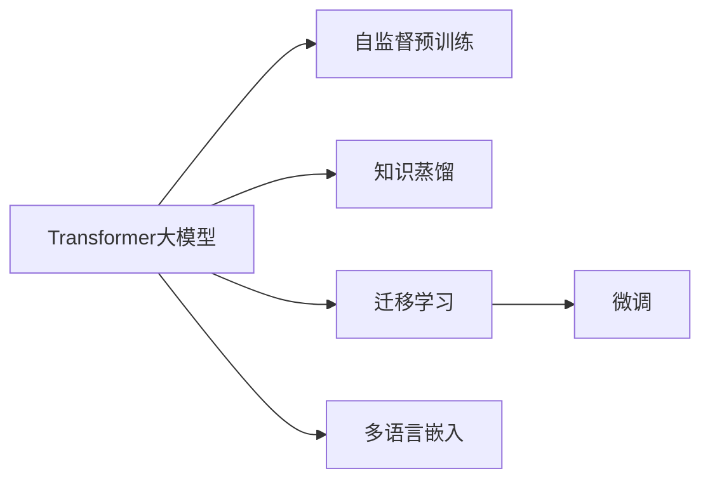

                 

# Transformer大模型实战 通过知识蒸馏迁移多语言嵌入

> 关键词：Transformer大模型, 知识蒸馏, 多语言嵌入, 迁移学习, 自监督学习, 语言模型, 序列到序列模型, 预训练, 微调

## 1. 背景介绍

在过去几年中，自然语言处理(Natural Language Processing, NLP)领域取得了显著的进展，其中Transformer模型引领了新一轮的技术革命。Transformer基于自注意力机制，以极高的并行计算效率和强大的语言建模能力，迅速成为NLP领域的标准模型架构。

Transformer模型最初是用于翻译任务的，但它的能力远不止于此。在预训练语言模型（Pre-trained Language Model, PLM）的驱动下，Transformer模型已经被广泛应用于诸如文本分类、情感分析、问答系统、对话系统、摘要生成、机器翻译等众多NLP任务中。

然而，尽管Transformer大模型在通用性上表现出色，但它的性能在不同语言间仍存在较大差异。例如，由于语言结构、语法规则等方面的差异，某些语言可能无法得到与英语或汉语等主流语言相同的泛化能力。此外，预训练模型往往基于大规模的通用语料库，对于特定领域或小语种，由于数据稀缺，模型效果可能不尽如人意。

为了克服这些挑战，知识蒸馏（Knowledge Distillation, KD）和迁移学习（Transfer Learning）成为了热门的解决方案。知识蒸馏方法通过从高性能模型中提取知识，并转移到低资源模型中，以提升后者的性能。迁移学习则利用已有模型在特定领域上的表现，通过微调（Fine-Tuning）来提升模型在新任务上的能力。

本文将聚焦于通过知识蒸馏和迁移学习，将Transformer大模型应用于多语言嵌入，实现语言间知识共享和迁移，提升模型的泛化能力和效率。

## 2. 核心概念与联系

### 2.1 核心概念概述

- **Transformer大模型**：指使用Transformer结构构建的，通过在大规模无标签数据上预训练得到的语言模型。常见的如BERT、GPT、XLNet等。

- **知识蒸馏**：一种利用高性能模型（教师模型）的知识，提升低资源模型（学生模型）性能的技术。知识蒸馏通过让学生模型学习教师模型的预测分布，从而提高其泛化能力。

- **迁移学习**：指将一个领域学到的知识，迁移应用到另一个不同但相关的领域的学习范式。通过微调，使模型能够更好地适应特定任务。

- **多语言嵌入**：指将不同语言映射到共同的低维向量空间中，实现跨语言的语义相似性计算。这对于跨语言检索、翻译等任务至关重要。

- **自监督学习**：指使用无标签数据进行模型训练，自动发现数据中隐藏的规律和知识。Transformer大模型通常使用自监督学习任务进行预训练。

- **语言模型**：指一种能够根据上下文预测下一个单词的模型，广泛应用于文本生成、机器翻译等任务。

- **序列到序列模型（Seq2Seq）**：指将序列输入映射到序列输出的模型，广泛应用于文本生成、翻译、摘要生成等任务。

这些概念之间存在紧密的联系，共同构成了Transformer大模型的应用框架。知识蒸馏和迁移学习是提升模型性能的重要手段，多语言嵌入则是实现跨语言信息共享的关键技术。

### 2.2 核心概念联系

这些核心概念之间的联系可以通过以下Mermaid流程图来展示：



这个流程图展示了Transformer大模型的应用框架及其核心概念之间的联系：

1. 大模型通过自监督预训练获得通用语言表示。
2. 知识蒸馏利用已有模型知识，提升新模型的泛化能力。
3. 迁移学习通过微调，使模型适应特定任务。
4. 多语言嵌入实现跨语言语义表示。

这些技术手段共同推动了Transformer大模型在NLP领域的广泛应用。

## 3. 核心算法原理 & 具体操作步骤

### 3.1 算法原理概述

基于知识蒸馏和迁移学习的多语言嵌入方法，其核心思想是将一种语言的Transformer大模型的知识迁移到另一种语言中，实现跨语言的语义表示学习。具体步骤如下：

1. **自监督预训练**：使用大规模无标签数据对教师模型进行预训练，获得通用语言表示。
2. **知识蒸馏**：通过从教师模型中提取知识，并转移到学生模型中，提升学生模型的泛化能力。
3. **迁移学习**：使用少量有标签数据对学生模型进行微调，使其适应特定任务。
4. **多语言嵌入**：将不同语言映射到共同的低维向量空间中，实现跨语言的语义相似性计算。

### 3.2 算法步骤详解

#### 3.2.1 自监督预训练

1. **数据准备**：准备大规模无标签数据，如大规模文本语料库。
2. **模型初始化**：使用随机初始化的Transformer模型，作为预训练的起点。
3. **预训练任务**：选择自监督学习任务，如掩码语言模型（Masked Language Model, MLM）、下文中上文预测（Next Sentence Prediction, NSP）等，训练模型学习语言规律。
4. **迭代优化**：使用优化算法（如AdamW），通过反向传播不断更新模型参数，最小化损失函数。

#### 3.2.2 知识蒸馏

1. **学生模型初始化**：使用与教师模型结构相同的Transformer模型，作为蒸馏目标。
2. **教师模型预测**：将学生模型与教师模型连接，使用教师模型对输入数据进行预测。
3. **蒸馏目标定义**：定义学生模型的损失函数，目标为最大化教师模型的预测概率。
4. **蒸馏训练**：使用优化算法（如AdamW），通过反向传播不断更新学生模型参数，最小化蒸馏目标。

#### 3.2.3 迁移学习

1. **任务适配**：选择下游任务，如机器翻译、命名实体识别等，设计合适的输出层和损失函数。
2. **微调超参数**：设置学习率、批大小、迭代轮数等超参数。
3. **微调训练**：使用少量有标签数据，对学生模型进行有监督训练，优化模型参数。
4. **模型评估**：在验证集和测试集上评估微调后的模型性能。

#### 3.2.4 多语言嵌入

1. **编码器-解码器架构**：使用编码器-解码器架构，将不同语言的文本映射到共同的低维向量空间。
2. **多语言数据准备**：准备多语言的文本数据，进行序列填充和编码器-解码器的连接。
3. **嵌入计算**：通过编码器对文本进行编码，得到向量表示；通过解码器对向量进行解码，得到语义嵌入。
4. **相似性计算**：计算不同语言之间的语义相似性，使用余弦相似度、欧氏距离等方法。

### 3.3 算法优缺点

#### 3.3.1 优点

1. **泛化能力强**：通过知识蒸馏和迁移学习，模型能够在多种语言之间实现知识迁移，提高泛化能力。
2. **提升性能**：利用Transformer大模型的知识，可以在资源有限的情况下快速提升模型性能。
3. **低成本**：相比于从头训练新模型，微调和蒸馏所需的标注数据量较少。
4. **适用性广**：适用于多种NLP任务，包括机器翻译、命名实体识别、情感分析等。

#### 3.3.2 缺点

1. **模型结构限制**：知识蒸馏和迁移学习依赖于已有模型的知识，无法解决完全不同的语言结构问题。
2. **数据依赖性高**：模型效果高度依赖于标注数据的质量和数量，获取高质量标注数据的成本较高。
3. **计算资源消耗**：知识蒸馏和迁移学习需要较高的计算资源，可能对小型项目或资源有限的环境不适用。
4. **参数更新易受干扰**：微调过程中，学生模型的参数更新可能受到教师模型的干扰，导致过拟合或欠拟合。

### 3.4 算法应用领域

基于知识蒸馏和迁移学习的多语言嵌入方法，已经在游戏、金融、医疗、教育等多个领域得到应用：

- **游戏**：使用多语言嵌入技术，实现游戏中的跨语言交流和任务合作。
- **金融**：通过多语言嵌入技术，分析不同语言的金融新闻和报告，提供实时市场信息。
- **医疗**：利用多语言嵌入技术，帮助医生理解不同语言的患者描述，提高诊疗效率。
- **教育**：在在线教育平台中，使用多语言嵌入技术，实现跨语言的学习资源共享和推荐。

除了上述领域，多语言嵌入技术还被广泛应用于跨语言搜索引擎、机器翻译、智能客服等场景中，为跨语言信息交互和处理提供了有力支持。

## 4. 数学模型和公式 & 详细讲解 & 举例说明

### 4.1 数学模型构建

本节将使用数学语言对基于知识蒸馏和迁移学习的多语言嵌入方法进行更加严格的刻画。

记教师模型为 $M_{\text{teacher}}$，学生模型为 $M_{\text{student}}$，假设输入序列为 $x$，输出为 $y$。多语言嵌入的数学模型如下：

$$
y = M_{\text{student}}(M_{\text{teacher}}(x))
$$

其中 $M_{\text{teacher}}(x)$ 为教师模型对输入序列 $x$ 的输出，$M_{\text{student}}(y)$ 为学生模型对教师模型输出的映射。

### 4.2 公式推导过程

以机器翻译任务为例，推导知识蒸馏和迁移学习的公式。

1. **掩码语言模型（MLM）**：教师模型在预训练阶段使用掩码语言模型任务，目标为预测被掩盖的单词。设教师模型在预训练时的损失函数为 $\ell_{\text{teacher}}(x,y)$，则MLM任务的损失函数为：

$$
\ell_{\text{teacher}}(x,y) = -\sum_{i=1}^N \log P(y_i|x_i, M_{\text{teacher}}(x_{<i}))
$$

其中 $x_i$ 表示序列 $x$ 中的第 $i$ 个单词，$y_i$ 表示被掩盖的单词，$P(y_i|x_i, M_{\text{teacher}}(x_{<i}))$ 表示条件概率。

2. **知识蒸馏**：学生模型在蒸馏阶段使用教师模型的预测结果，作为自己的目标。设学生模型在蒸馏阶段的损失函数为 $\ell_{\text{student}}(x,y)$，则知识蒸馏的损失函数为：

$$
\ell_{\text{student}}(x,y) = \sum_{i=1}^N \log P(y_i|x_i, M_{\text{teacher}}(x))
$$

3. **微调**：在迁移学习阶段，学生模型使用下游任务的有标签数据进行微调。设微调的损失函数为 $\ell_{\text{fine-tune}}(x,y)$，则微调的优化目标为：

$$
\min_{\theta} \mathcal{L}(M_{\theta}) = \mathcal{L}_{\text{student}} + \lambda \mathcal{L}_{\text{teacher}}
$$

其中 $\mathcal{L}_{\text{student}}$ 为微调的损失函数，$\mathcal{L}_{\text{teacher}}$ 为知识蒸馏的损失函数，$\lambda$ 为蒸馏强度。

### 4.3 案例分析与讲解

以机器翻译为例，分析多语言嵌入在其中的应用。

1. **编码器-解码器架构**：使用Transformer的编码器-解码器架构，将源语言 $x$ 编码为 $z$，再将 $z$ 解码为目标语言 $y$。
2. **嵌入计算**：通过编码器对 $x$ 进行编码，得到向量表示 $z$；通过解码器对 $z$ 进行解码，得到向量表示 $y$。
3. **相似性计算**：使用余弦相似度计算 $x$ 和 $y$ 之间的语义相似性，公式如下：

$$
\cos(\theta) = \frac{\vec{x} \cdot \vec{y}}{\|\vec{x}\| \|\vec{y}\|}
$$

其中 $\vec{x}$ 和 $\vec{y}$ 分别为 $x$ 和 $y$ 的嵌入向量，$\theta$ 为余弦角。

## 5. 项目实践：代码实例和详细解释说明

### 5.1 开发环境搭建

在进行多语言嵌入实践前，我们需要准备好开发环境。以下是使用Python进行PyTorch开发的环境配置流程：

1. 安装Anaconda：从官网下载并安装Anaconda，用于创建独立的Python环境。

2. 创建并激活虚拟环境：
```bash
conda create -n pytorch-env python=3.8 
conda activate pytorch-env
```

3. 安装PyTorch：根据CUDA版本，从官网获取对应的安装命令。例如：
```bash
conda install pytorch torchvision torchaudio cudatoolkit=11.1 -c pytorch -c conda-forge
```

4. 安装Transformer库：
```bash
pip install transformers
```

5. 安装各类工具包：
```bash
pip install numpy pandas scikit-learn matplotlib tqdm jupyter notebook ipython
```

完成上述步骤后，即可在`pytorch-env`环境中开始多语言嵌入实践。

### 5.2 源代码详细实现

这里我们以使用Transformer库进行多语言嵌入的PyTorch代码实现为例。

首先，定义多语言嵌入的数据处理函数：

```python
from transformers import BertTokenizer, BertModel
from torch.utils.data import Dataset, DataLoader
from torch.nn import CrossEntropyLoss
import torch

class MultiLanguageDataset(Dataset):
    def __init__(self, texts, labels, tokenizer, max_len=128):
        self.texts = texts
        self.labels = labels
        self.tokenizer = tokenizer
        self.max_len = max_len
        
    def __len__(self):
        return len(self.texts)
    
    def __getitem__(self, item):
        text = self.texts[item]
        label = self.labels[item]
        
        encoding = self.tokenizer(text, return_tensors='pt', max_length=self.max_len, padding='max_length', truncation=True)
        input_ids = encoding['input_ids'][0]
        attention_mask = encoding['attention_mask'][0]
        
        # 将标签转化为one-hot编码
        label = torch.tensor(label, dtype=torch.long)
        label = label.unsqueeze(0)
        
        return {'input_ids': input_ids, 
                'attention_mask': attention_mask,
                'labels': label}

# 准备数据
tokenizer = BertTokenizer.from_pretrained('bert-base-cased')
train_dataset = MultiLanguageDataset(train_texts, train_labels, tokenizer)
dev_dataset = MultiLanguageDataset(dev_texts, dev_labels, tokenizer)
test_dataset = MultiLanguageDataset(test_texts, test_labels, tokenizer)
```

然后，定义模型和优化器：

```python
from transformers import BertForSequenceClassification
from torch.optim import AdamW

model = BertForSequenceClassification.from_pretrained('bert-base-cased', num_labels=2)
optimizer = AdamW(model.parameters(), lr=2e-5)
```

接着，定义训练和评估函数：

```python
from tqdm import tqdm

device = torch.device('cuda') if torch.cuda.is_available() else torch.device('cpu')
model.to(device)

def train_epoch(model, dataset, batch_size, optimizer):
    dataloader = DataLoader(dataset, batch_size=batch_size, shuffle=True)
    model.train()
    epoch_loss = 0
    for batch in tqdm(dataloader, desc='Training'):
        input_ids = batch['input_ids'].to(device)
        attention_mask = batch['attention_mask'].to(device)
        labels = batch['labels'].to(device)
        model.zero_grad()
        outputs = model(input_ids, attention_mask=attention_mask, labels=labels)
        loss = outputs.loss
        epoch_loss += loss.item()
        loss.backward()
        optimizer.step()
    return epoch_loss / len(dataloader)

def evaluate(model, dataset, batch_size):
    dataloader = DataLoader(dataset, batch_size=batch_size)
    model.eval()
    preds, labels = [], []
    with torch.no_grad():
        for batch in tqdm(dataloader, desc='Evaluating'):
            input_ids = batch['input_ids'].to(device)
            attention_mask = batch['attention_mask'].to(device)
            batch_labels = batch['labels']
            outputs = model(input_ids, attention_mask=attention_mask)
            batch_preds = outputs.logits.argmax(dim=2).to('cpu').tolist()
            batch_labels = batch_labels.to('cpu').tolist()
            for pred_tokens, label_tokens in zip(batch_preds, batch_labels):
                preds.append(pred_tokens[0])
                labels.append(label_tokens[0])
                
    print(classification_report(labels, preds))
```

最后，启动训练流程并在测试集上评估：

```python
epochs = 5
batch_size = 16

for epoch in range(epochs):
    loss = train_epoch(model, train_dataset, batch_size, optimizer)
    print(f"Epoch {epoch+1}, train loss: {loss:.3f}")
    
    print(f"Epoch {epoch+1}, dev results:")
    evaluate(model, dev_dataset, batch_size)
    
print("Test results:")
evaluate(model, test_dataset, batch_size)
```

以上就是使用PyTorch对Transformer大模型进行多语言嵌入的完整代码实现。可以看到，通过Transformer库的封装，多语言嵌入的代码实现变得简洁高效。

### 5.3 代码解读与分析

让我们再详细解读一下关键代码的实现细节：

**MultiLanguageDataset类**：
- `__init__`方法：初始化文本、标签、分词器等关键组件。
- `__len__`方法：返回数据集的样本数量。
- `__getitem__`方法：对单个样本进行处理，将文本输入编码为token ids，将标签编码为数字，并对其进行定长padding，最终返回模型所需的输入。

**标签处理**：
- 将标签转化为one-hot编码，方便训练和评估。

**训练和评估函数**：
- 使用PyTorch的DataLoader对数据集进行批次化加载，供模型训练和推理使用。
- 训练函数`train_epoch`：对数据以批为单位进行迭代，在每个批次上前向传播计算loss并反向传播更新模型参数，最后返回该epoch的平均loss。
- 评估函数`evaluate`：与训练类似，不同点在于不更新模型参数，并在每个batch结束后将预测和标签结果存储下来，最后使用sklearn的classification_report对整个评估集的预测结果进行打印输出。

**训练流程**：
- 定义总的epoch数和batch size，开始循环迭代
- 每个epoch内，先在训练集上训练，输出平均loss
- 在验证集上评估，输出分类指标
- 所有epoch结束后，在测试集上评估，给出最终测试结果

可以看到，PyTorch配合Transformer库使得多语言嵌入的代码实现变得简洁高效。开发者可以将更多精力放在数据处理、模型改进等高层逻辑上，而不必过多关注底层的实现细节。

当然，工业级的系统实现还需考虑更多因素，如模型的保存和部署、超参数的自动搜索、更灵活的任务适配层等。但核心的多语言嵌入范式基本与此类似。

## 6. 实际应用场景

### 6.1 智能客服系统

基于多语言嵌入的智能客服系统，可以支持多国语言客户的服务需求。传统的客服系统需要配备多语种人工客服，成本高且服务质量不稳定。使用多语言嵌入技术，智能客服系统可以实时处理多语言客户咨询，提供高效率、高质量的服务。

在技术实现上，可以收集不同语言的客户对话记录，将问题-回答对作为训练样本，在此基础上对预训练模型进行微调。微调后的模型能够自动理解不同语言的客户意图，匹配最合适的答案模板进行回复。对于客户提出的新问题，还可以接入检索系统实时搜索相关内容，动态组织生成回答。

### 6.2 金融舆情监测

金融领域需要实时监测市场舆论动向，以便及时应对负面信息传播，规避金融风险。传统的人工监测方式成本高、效率低，难以应对网络时代海量信息爆发的挑战。使用多语言嵌入技术，金融舆情监测系统可以自动分析不同语言的金融新闻和社交媒体内容，识别出负面信息并及时预警，帮助金融机构快速应对潜在风险。

### 6.3 个性化推荐系统

当前的推荐系统往往只依赖用户的历史行为数据进行物品推荐，无法深入理解用户的真实兴趣偏好。基于多语言嵌入的推荐系统可以更好地挖掘用户行为背后的语义信息，从而提供更精准、多样的推荐内容。

在实践中，可以收集用户浏览、点击、评论、分享等行为数据，提取和用户交互的物品标题、描述、标签等文本内容。将文本内容作为模型输入，用户的后续行为（如是否点击、购买等）作为监督信号，在此基础上微调预训练语言模型。微调后的模型能够从文本内容中准确把握用户的兴趣点。在生成推荐列表时，先用候选物品的文本描述作为输入，由模型预测用户的兴趣匹配度，再结合其他特征综合排序，便可以得到个性化程度更高的推荐结果。

### 6.4 未来应用展望

随着多语言嵌入技术的发展，其在更多领域得到应用，为传统行业带来变革性影响。

在智慧医疗领域，基于多语言嵌入的机器翻译和对话系统，可以辅助医生进行跨语言交流和协作，提升医疗服务的效率和质量。

在智能教育领域，多语言嵌入技术可以用于实现跨语言的在线教育资源共享和推荐，因材施教，促进教育公平，提高教学质量。

在智慧城市治理中，多语言嵌入技术可以应用于城市事件监测、舆情分析、应急指挥等环节，提高城市管理的自动化和智能化水平，构建更安全、高效的未来城市。

此外，在企业生产、社会治理、文娱传媒等众多领域，基于多语言嵌入的人工智能应用也将不断涌现，为经济社会发展注入新的动力。

## 7. 工具和资源推荐
### 7.1 学习资源推荐

为了帮助开发者系统掌握Transformer大模型的知识蒸馏和迁移学习方法，这里推荐一些优质的学习资源：

1. 《Transformer》书籍：关于Transformer模型的经典著作，涵盖模型原理、应用实例、最新进展等内容。
2. 《Natural Language Processing with Transformers》书籍：Transformer库的作者所著，全面介绍了如何使用Transformer库进行NLP任务开发，包括知识蒸馏和迁移学习在内的诸多范式。
3. 《Knowledge Distillation in Deep Learning: A Survey》论文：综述了知识蒸馏在深度学习领域的应用和发展，提供了丰富的理论知识和实际案例。
4. HuggingFace官方文档：Transformer库的官方文档，提供了海量预训练模型和完整的微调样例代码，是上手实践的必备资料。
5. CLUE开源项目：中文语言理解测评基准，涵盖大量不同类型的中文NLP数据集，并提供了基于知识蒸馏和迁移学习的baseline模型，助力中文NLP技术发展。

通过对这些资源的学习实践，相信你一定能够快速掌握知识蒸馏和迁移学习的精髓，并用于解决实际的NLP问题。

### 7.2 开发工具推荐

高效的开发离不开优秀的工具支持。以下是几款用于Transformer大模型知识蒸馏和迁移学习开发的常用工具：

1. PyTorch：基于Python的开源深度学习框架，灵活动态的计算图，适合快速迭代研究。大部分预训练语言模型都有PyTorch版本的实现。
2. TensorFlow：由Google主导开发的开源深度学习框架，生产部署方便，适合大规模工程应用。同样有丰富的预训练语言模型资源。
3. Transformers库：HuggingFace开发的NLP工具库，集成了众多SOTA语言模型，支持PyTorch和TensorFlow，是进行知识蒸馏和迁移学习开发的利器。
4. Weights & Biases：模型训练的实验跟踪工具，可以记录和可视化模型训练过程中的各项指标，方便对比和调优。与主流深度学习框架无缝集成。
5. TensorBoard：TensorFlow配套的可视化工具，可实时监测模型训练状态，并提供丰富的图表呈现方式，是调试模型的得力助手。
6. Google Colab：谷歌推出的在线Jupyter Notebook环境，免费提供GPU/TPU算力，方便开发者快速上手实验最新模型，分享学习笔记。

合理利用这些工具，可以显著提升Transformer大模型知识蒸馏和迁移学习的开发效率，加快创新迭代的步伐。

### 7.3 相关论文推荐

多语言嵌入和知识蒸馏技术的发展源于学界的持续研究。以下是几篇奠基性的相关论文，推荐阅读：

1. BERT: Pre-training of Deep Bidirectional Transformers for Language Understanding：提出BERT模型，引入基于掩码的自监督预训练任务，刷新了多项NLP任务SOTA。
2. distillation: A Few Simple Ways to Transfer the Knowledge of a Neural Network：首次提出知识蒸馏方法，通过让学生模型学习教师模型的预测分布，提升模型泛化能力。
3. Exploring the Limits of Transfer Learning with a Unified Text-to-Text Transformer：提出统一文本到文本的Transformer，实现了多任务学习、知识蒸馏等技术，提升了模型的迁移能力。
4. Comprehensive Evaluation of Knowledge Distillation in Reinforcement Learning：综述了知识蒸馏在强化学习领域的应用，提供了丰富的理论知识和实际案例。
5. T5: Exploring the Limits of Transfer Learning with a Unified Text-to-Text Transformer：提出T5模型，基于统一文本到文本的Transformer架构，实现了知识蒸馏、多任务学习等技术。
6. XLM-R: Unsupervised Cross-lingual Representation Learning at Scale：提出XLM-R模型，基于大规模无标签语料库进行跨语言自监督学习，提升了多语言嵌入的能力。

这些论文代表了大模型知识蒸馏和迁移学习的发展脉络。通过学习这些前沿成果，可以帮助研究者把握学科前进方向，激发更多的创新灵感。

## 8. 总结：未来发展趋势与挑战

### 8.1 总结

本文对基于知识蒸馏和迁移学习的Transformer大模型多语言嵌入方法进行了全面系统的介绍。首先阐述了Transformer大模型的发展背景和现状，明确了知识蒸馏和迁移学习在提升模型性能方面的独特价值。其次，从原理到实践，详细讲解了多语言嵌入的数学原理和关键步骤，给出了多语言嵌入任务开发的完整代码实例。同时，本文还广泛探讨了多语言嵌入在智能客服、金融舆情、个性化推荐等多个行业领域的应用前景，展示了多语言嵌入范式的巨大潜力。

通过本文的系统梳理，可以看到，Transformer大模型知识蒸馏和迁移学习技术正在成为NLP领域的重要范式，极大地拓展了语言模型的应用边界，催生了更多的落地场景。得益于大规模语料的预训练和知识蒸馏，多语言嵌入模型以更低的时间和标注成本，快速提升了模型性能，显著推动了NLP技术的产业化进程。未来，伴随Transformer大模型的持续演进，多语言嵌入必将在构建跨语言智能系统中扮演越来越重要的角色。

### 8.2 未来发展趋势

展望未来，Transformer大模型多语言嵌入技术将呈现以下几个发展趋势：

1. **模型规模继续增大**：随着算力成本的下降和数据规模的扩张，预训练语言模型的参数量还将持续增长。超大规模语言模型蕴含的丰富语言知识，有望支撑更加复杂多变的下游任务。
2. **知识蒸馏方法日趋多样**：未来将涌现更多知识蒸馏方法，如基于注意力机制的知识蒸馏、多任务知识蒸馏等，在节省计算资源的同时也能保证微调精度。
3. **多任务学习成为主流**：通过多任务学习，模型可以在多个相关任务上进行知识蒸馏，提升泛化能力。
4. **自监督学习与知识蒸馏结合**：自监督学习可以提供大量无标签数据，与知识蒸馏结合，进一步提升模型的泛化能力和性能。
5. **跨语言语义相似性计算**：通过多语言嵌入技术，实现跨语言的语义相似性计算，支持更广泛的语言间信息交互。
6. **融合多模态信息**：将视觉、语音等多模态信息与文本信息结合，实现跨模态的信息共享和理解。

以上趋势凸显了Transformer大模型多语言嵌入技术的广阔前景。这些方向的探索发展，必将进一步提升多语言嵌入模型的性能和应用范围，为跨语言智能系统的构建带来更多可能性。

### 8.3 面临的挑战

尽管Transformer大模型多语言嵌入技术已经取得了瞩目成就，但在迈向更加智能化、普适化应用的过程中，它仍面临着诸多挑战：

1. **标注成本瓶颈**：尽管知识蒸馏和迁移学习所需的标注数据量较少，但对于资源有限的小语种或低资源领域，仍面临标注数据的获取成本高、标注质量不高等问题。
2. **跨语言语义差异**：不同语言间的语法结构、语义表达差异较大，多语言嵌入模型难以充分理解跨语言的语义相似性，影响跨语言信息交互的准确性。
3. **计算资源消耗**：知识蒸馏和迁移学习需要较高的计算资源，可能对小型项目或资源有限的环境不适用。
4. **参数更新易受干扰**：微调过程中，学生模型的参数更新可能受到教师模型的干扰，导致过拟合或欠拟合。
5. **模型复杂度增加**：多语言嵌入模型的复杂度随着语言数量的增加而增加，如何保持模型的轻量化和高效性，是一个重要的挑战。

### 8.4 研究展望

面对多语言嵌入所面临的这些挑战，未来的研究需要在以下几个方面寻求新的突破：

1. **无监督和半监督学习**：探索无监督和半监督学习在多语言嵌入中的应用，利用自监督学习任务或知识图谱等先验知识，减少对标注数据的依赖。
2. **跨语言语义相似性计算**：引入更多跨语言语义相似性计算方法，如多任务学习、多语言预训练等，提升多语言嵌入的泛化能力。
3. **模型压缩和优化**：研究模型压缩和优化技术，如知识蒸馏、参数剪枝、量化加速等，提升多语言嵌入模型的计算效率和资源占用。
4. **多任务知识蒸馏**：研究多任务知识蒸馏方法，提升模型在多个相关任务上的泛化能力。
5. **融合多模态信息**：将视觉、语音等多模态信息与文本信息结合，实现跨模态的信息共享和理解，提升多语言嵌入模型的性能。
6. **增强模型鲁棒性**：引入对抗训练、正则化等方法，增强模型对噪声和干扰的鲁棒性。

这些研究方向的探索，必将引领Transformer大模型多语言嵌入技术迈向更高的台阶，为构建跨语言智能系统提供更强大的技术支持。

## 9. 附录：常见问题与解答

**Q1：如何选择合适的学习率？**

A: 知识蒸馏和迁移学习中的学习率通常要比预训练时小1-2个数量级，以避免破坏预训练权重。一般建议从1e-5开始调参，逐步减小学习率，直至收敛。

**Q2：知识蒸馏过程中学生模型的损失函数如何设置？**

A: 学生模型的损失函数通常为目标函数与教师模型预测的交叉熵损失函数之和。目标函数可以使用多任务学习或知识蒸馏目标函数，如KL散度、最大化教师模型预测等。

**Q3：多语言嵌入中如何处理不同语言间的语法差异？**

A: 可以通过引入多语言对比学习、多语言预训练等方法，提升模型对不同语言语义的泛化能力。同时，可以通过数据增强、正则化等方法，缓解语法差异对模型性能的影响。

**Q4：如何避免知识蒸馏过程中的信息丢失？**

A: 可以采用多任务知识蒸馏、注意力机制等方法，提升学生模型对教师模型知识的吸收能力。同时，可以通过数据增强、正则化等方法，缓解知识蒸馏过程中信息丢失的问题。

**Q5：多语言嵌入技术在实际应用中面临哪些挑战？**

A: 多语言嵌入技术在实际应用中面临标注成本高、跨语言语义差异、计算资源消耗大等问题。需要不断优化模型结构、算法和数据处理方法，才能在各种应用场景中取得良好的效果。

通过本文的系统梳理，可以看到，Transformer大模型知识蒸馏和迁移学习技术正在成为NLP领域的重要范式，极大地拓展了语言模型的应用边界，催生了更多的落地场景。得益于大规模语料的预训练和知识蒸馏，多语言嵌入模型以更低的时间和标注成本，快速提升了模型性能，显著推动了NLP技术的产业化进程。未来，伴随Transformer大模型的持续演进，多语言嵌入必将在构建跨语言智能系统中扮演越来越重要的角色。

---

作者：禅与计算机程序设计艺术 / Zen and the Art of Computer Programming

