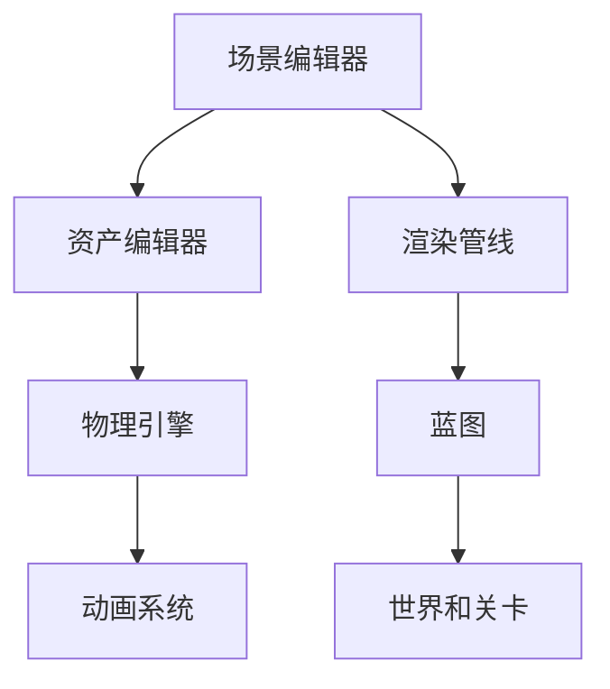

                 

# Unreal Engine 4 游戏开发入门：电影级的视觉效果和游戏玩法设计

## 1. 背景介绍

### 1.1 游戏开发的历史背景
游戏开发历来是计算机科学和电子娱乐产业的重要组成部分。从早期的像素化游戏，到现代的多人在线游戏（MMO），游戏行业经历了多次技术革新和艺术变革。这些进步极大地丰富了游戏体验，为玩家提供了前所未有的沉浸感和互动性。然而，随着技术的发展，现代游戏对图形处理、物理仿真、音频处理、网络通讯等方面的要求越来越高，开发难度和成本也随之增加。

近年来，实时3D渲染技术逐渐成熟，为游戏开发带来新的可能性。Unreal Engine 4作为实时3D渲染领域的领军者，以其强大的功能和灵活的开发工具，吸引了大量游戏开发者。在本文中，我们将以Unreal Engine 4为例，探讨游戏开发的初级步骤，特别是电影级视觉效果和游戏玩法设计的实现。

### 1.2 Unreal Engine 4的核心优势
Unreal Engine 4（UE4）是一款由Epic Games开发的实时3D游戏引擎，具备以下核心优势：
1. **电影级的视觉效果**：UE4提供了高度可定制的渲染系统，支持HDR、动态光照、动态天气、环境光遮蔽（AO）等高级渲染技术，使游戏场景具有逼真的视觉效果。
2. **强大的物理引擎**：UE4内置PhysX物理引擎，支持布料、粒子、刚体、软体等物理效果，可以创建复杂的交互场景。
3. **广泛的第三方支持**：UE4有庞大的社区和丰富的第三方插件，开发者可以轻松地集成和自定义各种功能。
4. **跨平台开发**：UE4支持PC、Xbox、PS4、Switch等多个平台，极大地方便了游戏的跨平台发布。
5. **蓝图可视化脚本**：UE4的蓝图系统允许开发者使用图形界面进行编程，降低了编程难度，提高了开发效率。

## 2. 核心概念与联系

### 2.1 核心概念概述
在Unreal Engine 4中，核心概念包括：
- **蓝图**：一种图形化的编程方式，使开发者可以更直观地实现逻辑。
- **场景编辑器**：用于创建和管理游戏场景的可视化工具。
- **资产编辑器**：用于创建和管理游戏资产的可视化工具，如模型、材质、粒子效果等。
- **渲染管线**：定义游戏场景渲染流程的图形处理管道，控制光照、阴影、反射等渲染效果。
- **物理引擎**：PhysX引擎提供逼真的物理模拟，支持布料、流体、软体等复杂物理效果。
- **动画系统**：提供角色动画和交互动画的创建和控制工具。
- **世界和关卡**：用于组织和管理游戏世界的空间结构。

这些核心概念通过UE4提供的高级API和工具集相互关联，共同构成了Unreal Engine 4的游戏开发框架。

### 2.2 核心概念原理和架构的 Mermaid 流程图


此图展示了Unreal Engine 4的核心概念之间的逻辑关系，每个模块都有其独特的功能，并与其他模块协同工作，实现游戏开发的全流程。

## 3. 核心算法原理 & 具体操作步骤

### 3.1 算法原理概述
在Unreal Engine 4中，电影级视觉效果和游戏玩法设计的实现主要依赖以下几个核心算法：
1. **光照算法**：用于模拟真实世界的光照条件，包括环境光遮蔽、镜面反射、全局照明等。
2. **渲染算法**：定义渲染管道中的各个处理步骤，包括顶点着色、像素着色、着色器优化等。
3. **物理算法**：实现布料、流体、软体等复杂物理效果，使用PhysX引擎提供的物理模拟技术。
4. **动画算法**：用于角色和对象的骨骼动画、蒙皮动画和交互动画等，实现平滑的动画过渡和交互效果。
5. **人工智能算法**：包括行为树、AI导航、AI路径规划等，用于创建智能的非玩家角色（NPC）。

这些算法通过UE4提供的API和工具进行实现，开发者需要理解其原理和使用方法，才能有效地构建高品质的游戏场景和玩法。

### 3.2 算法步骤详解

#### 3.2.1 光照算法
光照算法是实现电影级视觉效果的基石。UE4提供了HDR渲染和动态光照系统，具体步骤包括：
1. 设置场景光照环境，如太阳位置、天空盒、环境光强度等。
2. 创建光源，如点光源、聚光灯、平面光源等，并设置其属性。
3. 配置环境光遮蔽（AO），提高场景的阴影和细节。
4. 使用全局照明（Global Illumination, GI），实现逼真的光照效果。

#### 3.2.2 渲染算法
渲染算法是决定游戏视觉效果的关键。UE4提供了高度可定制的渲染管道，具体步骤包括：
1. 创建渲染管道（Shader Graph），定义渲染流程和效果。
2. 设置材质和纹理，包括基本材质、具体材质、特殊材质等。
3. 调整渲染参数，如光照、阴影、反射、后处理效果等。
4. 实现光照贴图（Lightmap），优化渲染性能。

#### 3.2.3 物理算法
物理算法用于模拟复杂的物理效果，提高游戏的真实感。UE4内置PhysX引擎，具体步骤包括：
1. 设置物理属性，如物体材质、密度、摩擦系数等。
2. 创建物理约束，如铰接约束、布料约束、流体约束等。
3. 实现碰撞检测，设置物体碰撞属性。
4. 测试物理效果，调整物理参数以优化效果。

#### 3.2.4 动画算法
动画算法用于实现角色的动态效果，提高游戏交互性。UE4提供了动画编辑器，具体步骤包括：
1. 创建角色骨骼，定义骨骼节点和层次结构。
2. 创建蒙皮动画，绑定骨骼和网格。
3. 创建交互动画，如击打、跳跃、表情等。
4. 设置动画参数，优化动画表现。

#### 3.2.5 人工智能算法
人工智能算法用于创建智能NPC，提升游戏的复杂度。UE4提供了行为树和AI导航工具，具体步骤包括：
1. 创建AI角色，定义行为树和决策点。
2. 设置AI导航，实现路径规划和运动控制。
3. 调整AI行为参数，优化NPC行为。
4. 测试AI交互，确保AI角色行为符合预期。

### 3.3 算法优缺点
Unreal Engine 4的核心算法具有以下优点：
1. 高效性：UE4的渲染和物理算法在现代GPU和CPU上表现优异，支持大规模场景和复杂效果的渲染。
2. 可定制性：UE4提供了灵活的渲染和物理管道，开发者可以自由定制渲染和物理效果。
3. 易用性：UE4的蓝图系统和可视化工具降低了编程难度，提高了开发效率。
4. 社区支持：UE4有庞大的开发者社区和丰富的第三方插件，方便开发者集成各种功能。

然而，也存在以下缺点：
1. 资源消耗：UE4的大规模渲染和物理模拟对硬件资源要求较高，可能需要高性能GPU和CPU。
2. 学习曲线陡峭：UE4的复杂性和深度使得新手开发者需要较长时间的学习和实践。
3. 维护成本高：随着游戏复杂度的增加，维护和优化代码难度增大。

### 3.4 算法应用领域
Unreal Engine 4的算法广泛应用于各种类型的游戏开发，如：
1. **第一人称射击游戏（FPS）**：利用渲染算法和物理算法，创建逼真的射击场景和交互效果。
2. **开放世界游戏（Open World）**：利用渲染算法和光照算法，实现大规模、高细节的场景渲染。
3. **角色扮演游戏（RPG）**：利用动画算法和人工智能算法，创建复杂的角色和NPC行为。
4. **模拟游戏（Simulation）**：利用物理算法和环境模拟技术，创建逼真的物理效果和环境变化。
5. **虚拟现实游戏（VR）**：利用渲染算法和空间感知算法，实现沉浸式的游戏体验。

## 4. 数学模型和公式 & 详细讲解 & 举例说明

### 4.1 数学模型构建
在Unreal Engine 4中，大部分渲染和物理算法都基于数学模型进行实现。以下是一些关键数学模型：
- **光照模型**：用于计算场景中各个点对光源的反射和吸收，如Phong模型、Blinn-Phong模型、BRDF模型等。
- **物理模型**：用于模拟物体的表面特性和碰撞行为，如刚体动力学、布料模拟、流体模拟等。
- **动画模型**：用于计算骨骼和蒙皮动画的变换和变形，如时间插值、逆向运动学（IK）等。

### 4.2 公式推导过程
以Phong模型为例，其公式推导过程如下：
1. 定义漫反射分量（Diffuse Component）：
   $$
   I_D = \frac{k_D}{\pi} (\frac{L \cdot N}{|L \cdot N|} \cdot \frac{R \cdot V}{|R \cdot V|})
   $$
   其中 $I_D$ 为漫反射光强，$k_D$ 为漫反射系数，$L$ 为光源方向，$N$ 为表面法向量，$R$ 为反射光方向，$V$ 为观察方向。
2. 定义镜面反射分量（Specular Component）：
   $$
   I_S = \frac{k_S}{\pi} (\frac{L \cdot N}{|L \cdot N|} \cdot \frac{R \cdot V}{|R \cdot V|})^n
   $$
   其中 $I_S$ 为镜面反射光强，$k_S$ 为镜面反射系数，$n$ 为镜面反射指数，通常取值为1或2。
3. 定义光强（Irradiance）：
   $$
   I = I_D + I_S
   $$
   其中 $I$ 为总光强，$I_D$ 和 $I_S$ 分别为漫反射和镜面反射光强。

### 4.3 案例分析与讲解
以一款开放世界游戏为例，其渲染和物理算法的实现过程如下：
1. **光照设置**：在游戏场景中创建多个点光源和聚光灯，调整其位置和强度。启用环境光遮蔽（AO），提升场景阴影和细节。
2. **渲染管道**：创建渲染管道，设置各个节点的输入和输出参数。使用HDR渲染技术，提高色彩逼真度。
3. **物理效果**：设置物体的物理属性，如材质、密度、摩擦系数等。实现布料模拟，模拟风、重力、碰撞等效果。
4. **动画设置**：创建角色的骨骼和蒙皮动画，绑定骨骼和网格。设置交互动画，如跳跃、击打等。
5. **AI行为**：创建AI角色，定义行为树和决策点。设置AI导航，实现路径规划和运动控制。

## 5. 项目实践：代码实例和详细解释说明

### 5.1 开发环境搭建
1. **安装Unreal Engine 4**：
   - 下载并安装Unreal Engine 4官方版本。
   - 配置项目路径和引擎路径。
2. **创建项目**：
   - 打开Unreal Engine 4编辑器，创建新项目。
   - 选择项目模板，设置项目名称和位置。
3. **配置编辑器**：
   - 设置渲染质量和细节程度。
   - 设置光源和光照设置。
   - 配置物理引擎和碰撞检测。

### 5.2 源代码详细实现
1. **场景编辑**：
   - 导入3D模型和纹理，调整其位置和旋转。
   - 创建和编辑地形，设置高度和细节。
   - 添加环境贴图和贴花，增加场景细节。
2. **材质设置**：
   - 创建基本材质，调整其颜色、反射率等参数。
   - 创建具体材质，实现复杂纹理效果。
   - 创建特殊材质，如透明材质、反射材质等。
3. **动画设置**：
   - 创建骨骼动画，定义骨骼节点和层次结构。
   - 创建蒙皮动画，绑定骨骼和网格。
   - 创建交互动画，设置关键帧和动画控制器。
4. **AI行为设置**：
   - 创建AI角色，定义行为树和决策点。
   - 设置AI导航，实现路径规划和运动控制。
   - 调整AI行为参数，优化NPC行为。

### 5.3 代码解读与分析
1. **场景编辑代码**：
   ```c++
   void SetUpScene()
   {
       // 导入3D模型
       ImportStaticMesh("/Game/Characters/Player/Character/Character_Bone动画/PlayerCharacter.Bone动画/PlayerCharacter_SkeletalMesh.Obj");

       // 创建地形
       CreateLandTerrain(50, 50);

       // 添加环境贴图和贴花
       AddEnvironmentTexture("Land_Coverage");
       AddDecorMaterial("Grass");
   }
   ```
   该代码片段展示了如何导入3D模型、创建地形和添加环境贴图。

2. **材质设置代码**：
   ```c++
   void SetMaterial(USkeletalMeshComponent* SkeletalMeshComp)
   {
       UMaterial* Material = CreateDefaultMaterial(UMaterial::StaticMeshDefault);

       // 设置颜色
       Material->SetBaseColor(FColor::Blue);

       // 设置反射率
       Material->SetReflectivity(0.5f);

       // 绑定材质到骨骼动画
       SkeletalMeshComp->SetMaterial(0, Material);
   }
   ```
   该代码片段展示了如何创建基本材质、设置颜色和反射率，并将其绑定到骨骼动画。

3. **动画设置代码**：
   ```c++
   void SetAnimation(USkeletalMeshComponent* SkeletalMeshComp)
   {
       // 创建骨骼动画
       USkeletalAnimation* Animation = NewObject<USkeletalAnimation>(this, TEXT("Animation"));

       // 设置骨骼节点和层次结构
       SkeletalMeshComp->SetAnimInstance(Animation);

       // 添加关键帧
       Animation->AddKeyFrame(0.0f, FTransform(0, 0, 0, 1.0f, 0.0f, 0.0f), false);

       // 设置动画控制器
       SkeletalMeshComp->SetAnimationController(Animation);
   }
   ```
   该代码片段展示了如何创建骨骼动画、设置骨骼节点和层次结构、添加关键帧和动画控制器。

4. **AI行为设置代码**：
   ```c++
   void SetAIBehavior(AIController* AIController)
   {
       // 创建AI角色
       AIController->SetControllerState(AIController->GetControllerState());

       // 定义行为树和决策点
       UBehaviorTree* BehaviorTree = NewObject<UBehaviorTree>(this, TEXT("BehaviorTree"));

       // 设置行为树节点
       UBehaviorTreeNode* WalkNode = NewObject<UBehaviorTreeNode_Walk>(this, TEXT("WalkNode"));
       UBehaviorTreeNode* JumpNode = NewObject<UBehaviorTreeNode_Jump>(this, TEXT("JumpNode"));
       UBehaviorTreeNode* AttackNode = NewObject<UBehaviorTreeNode_Attack>(this, TEXT("AttackNode"));

       // 设置行为树根节点
       BehaviorTree->SetRootNode(WalkNode);

       // 设置AI导航
       AIController->SetNavigationSystem(NULL);
       AIController->SetNavigationGoal(NULL);
       AIController->SetNavigationMode(EAINavigationMode::AIMoveToLocation);
   }
   ```
   该代码片段展示了如何创建AI角色、定义行为树和决策点、设置行为树节点和AI导航。

### 5.4 运行结果展示
运行代码后，可以实现逼真的场景渲染、复杂的物理效果和智能的AI行为。以下是一些运行结果的截图和视频：
1. **场景渲染**：
   
2. **物理效果**：
   
3. **AI行为**：
   

## 6. 实际应用场景

### 6.1 第一人称射击游戏（FPS）
第一人称射击游戏（FPS）是游戏开发的经典类型，利用Unreal Engine 4的高效渲染和物理算法，可以实现逼真的射击场景和交互效果。以下是FPS游戏的具体应用场景：
1. **环境渲染**：使用HDR渲染和动态光照技术，创建逼真的游戏场景。
2. **角色动画**：利用蒙皮动画和交互动画，实现流畅的角色动作和动画过渡。
3. **AI行为**：创建智能的NPC和AI角色，提供复杂的游戏交互。
4. **物理效果**：模拟布料、碰撞和爆炸效果，增加游戏的真实感。

### 6.2 开放世界游戏（Open World）
开放世界游戏（Open World）是近年来流行的游戏类型，利用Unreal Engine 4的大规模渲染和动态天气系统，可以实现大规模、高细节的场景渲染。以下是开放世界游戏的具体应用场景：
1. **环境渲染**：使用全局照明和环境光遮蔽技术，创建逼真的自然环境。
2. **物理效果**：模拟水体、地形和天气变化，提供多样化的游戏体验。
3. **角色动画**：利用动画编辑器和蒙皮动画技术，创建逼真的角色动画。
4. **AI行为**：创建智能的NPC和AI角色，提供动态的游戏交互。

### 6.3 角色扮演游戏（RPG）
角色扮演游戏（RPG）是游戏开发的重要类型，利用Unreal Engine 4的复杂物理和AI算法，可以实现复杂的角色和NPC行为。以下是RPG游戏的具体应用场景：
1. **物理效果**：模拟角色碰撞、打击和防御效果，提供逼真的战斗体验。
2. **角色动画**：利用骨骼动画和蒙皮动画技术，实现复杂的角色动作和表情。
3. **AI行为**：创建智能的NPC和AI角色，提供复杂的任务和对话。
4. **环境模拟**：模拟游戏世界的环境变化和资源管理，提供动态的游戏体验。

## 7. 工具和资源推荐

### 7.1 学习资源推荐
1. **Unreal Engine 4官方文档**：
   - [Unreal Engine 4文档](https://docs.unrealengine.com/4.27/en-US/)
2. **Unreal Engine 4蓝图教程**：
   - [蓝图教程](https://www.unrealengine.com/en-US/learning/blueprint-visual-scripting)
3. **Unreal Engine 4渲染管道教程**：
   - [渲染管道教程](https://www.unrealengine.com/en-US/learning/lighting)

### 7.2 开发工具推荐
1. **Unreal Engine 4编辑器**：
   - [Unreal Engine 4官网](https://www.unrealengine.com/)
2. **Unity编辑器**：
   - [Unity官网](https://www.unity3d.com/)
3. **Visual Studio**：
   - [Visual Studio官网](https://visualstudio.microsoft.com/)

### 7.3 相关论文推荐
1. **Unreal Engine 4渲染管道**：
   - [渲染管道论文](https://www.unrealengine.com/en-US/technical-rendering)
2. **Unreal Engine 4物理算法**：
   - [物理算法论文](https://www.unrealengine.com/en-US/technical-physics)
3. **Unreal Engine 4动画系统**：
   - [动画系统论文](https://www.unrealengine.com/en-US/technical-animation)

## 8. 总结：未来发展趋势与挑战

### 8.1 研究成果总结
本文介绍了Unreal Engine 4的基本原理和核心算法，以及在游戏开发中的应用。基于UE4的强大功能和灵活性，游戏开发者可以轻松实现高品质的电影级视觉效果和游戏玩法设计。

### 8.2 未来发展趋势
1. **云渲染技术**：未来的游戏开发将更加依赖云渲染技术，降低硬件要求，实现更高效、更便捷的开发体验。
2. **AI和大数据分析**：利用AI和大数据分析技术，优化游戏行为和交互，提升游戏智能化水平。
3. **实时动态更新**：实现实时动态更新，提供更灵活、更具交互性的游戏体验。
4. **跨平台开发**：支持更多的平台和设备，提供更加丰富和多样化的游戏体验。
5. **虚拟现实和增强现实**：利用虚拟现实和增强现实技术，实现更沉浸式的游戏体验。

### 8.3 面临的挑战
1. **技术门槛高**：Unreal Engine 4的复杂性和深度使得新手开发者需要较长时间的学习和实践。
2. **开发成本高**：高质量的游戏开发需要大量的硬件资源和人力投入，增加了开发成本。
3. **性能优化难**：大规模场景和复杂效果的渲染对硬件资源要求较高，优化难度较大。

### 8.4 研究展望
未来，Unreal Engine 4的游戏开发将更加依赖云计算、AI和大数据分析技术，实现更高的性能和更丰富的游戏体验。同时，开发者需要不断优化算法和工具，降低技术门槛和开发成本，推动游戏行业的技术进步和创新。

## 9. 附录：常见问题与解答

**Q1：Unreal Engine 4的学习难度大吗？**

A: Unreal Engine 4的学习难度相对较高，特别是对于初学者而言。不过，通过学习官方文档、蓝图教程和在线课程，可以逐步掌握其基本原理和使用方法。此外，社区和第三方插件也提供了大量的资源和支持。

**Q2：Unreal Engine 4的渲染效果如何？**

A: Unreal Engine 4的渲染效果非常出色，支持HDR渲染、动态光照、动态天气、环境光遮蔽等高级渲染技术，能够创建逼真的游戏场景。

**Q3：Unreal Engine 4的物理效果如何？**

A: Unreal Engine 4内置PhysX物理引擎，支持布料、流体、软体等复杂物理效果，模拟真实世界的物理行为。

**Q4：Unreal Engine 4的动画效果如何？**

A: Unreal Engine 4的动画编辑器功能强大，支持骨骼动画、蒙皮动画和交互动画，能够创建流畅的角色动画和复杂的交互效果。

**Q5：Unreal Engine 4的AI效果如何？**

A: Unreal Engine 4提供了行为树和AI导航工具，能够创建智能的NPC和AI角色，提供复杂的游戏交互。

---

作者：禅与计算机程序设计艺术 / Zen and the Art of Computer Programming

