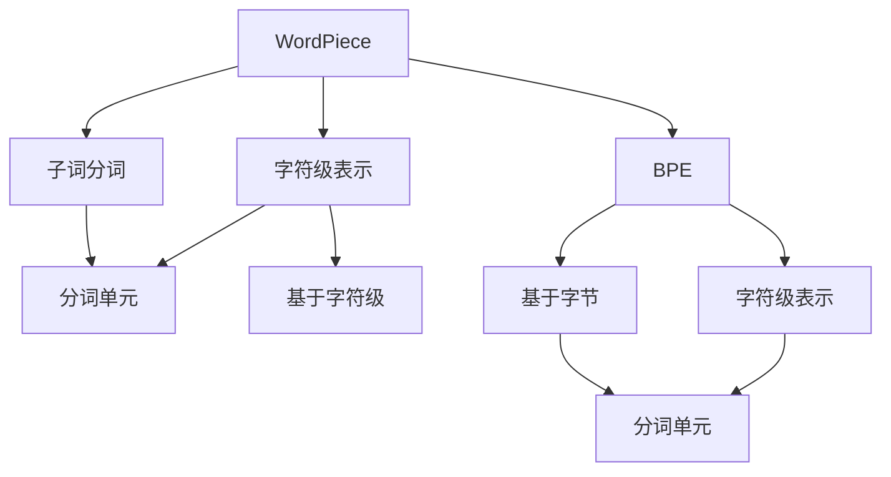

                 

## 1. 背景介绍

在深度学习模型训练过程中，数据的预处理是一个关键步骤。准确有效的文本数据预处理不仅能够提升模型训练速度，还能显著提升模型性能。其中，词表划分（word segmentation）是文本数据预处理中的一个核心步骤，对于模型的输入表示有着至关重要的作用。

在早期深度学习模型中，词表划分大多采用简单的空格分割、基于规则的词法分析等方法。但随着深度学习模型的不断发展，传统的词表划分方法已无法满足大规模语言模型和高性能NLP任务的实际需求。

近年来，基于字节序列的词表划分算法（如WordPiece、BPE）开始崭露头角，它们不仅适用于多种语言，还能够在保证语言模型的泛化能力的同时，减少语言模型的参数量，提升训练和推理的效率。

WordPiece和BPE是当前主流的两种基于字节序列的词表划分算法，它们各自有着独特的优点和适用场景。本文将对比WordPiece和BPE两种算法，探讨它们在不同场景下的应用，并给出实际案例和应用建议。

## 2. 核心概念与联系

### 2.1 核心概念概述

为更好地理解WordPiece和BPE算法的核心概念，本节将介绍几个密切相关的核心概念：

- **子词分词算法**：将文本序列划分为固定长度的子序列，每个子序列称为一个子词（subword）。子词分词算法能够减少模型的参数量，提升模型的泛化能力，同时适应不同语言特性。

- **WordPiece**：由Google提出的一种基于字节序列的词表划分算法。WordPiece通过构建词汇表，将输入文本序列划分为多个子词，每个子词由一个或多个字节序列组成。

- **BPE（Byte Pair Encoding）**：一种基于字节序列的词表划分算法。BPE通过合并相似的字符序列，将输入文本序列划分为固定长度的子词。

- **字符级表示**：WordPiece和BPE都是基于字符级表示的算法，将每个字符或字符序列作为一个独立的词汇表单元。

- **分词单元**：WordPiece和BPE的划分单元是可变长度的子词，而非固定长度的单词。这种划分方式能够更好地适应多语言特性，同时也提升了模型的泛化能力。

这些核心概念之间的逻辑关系可以通过以下Mermaid流程图来展示：



这个流程图展示了几组核心概念及其之间的关系：

1. WordPiece和BPE都是基于字符级表示的算法。
2. WordPiece和BPE都采用子词分词的方式，每个子词由一个或多个字符组成。
3. WordPiece和BPE的划分单元是可变长度的子词，而非固定长度的单词。
4. WordPiece和BPE的划分方式基于字节序列，适用于多种语言。

这些概念共同构成了WordPiece和BPE算法的理论基础，使得它们能够在NLP任务中发挥强大的语言理解能力。

## 3. 核心算法原理 & 具体操作步骤
### 3.1 算法原理概述

WordPiece和BPE算法的核心思想是将文本序列划分为多个固定长度的子序列（即子词），每个子词由一个或多个字符或字节序列组成。通过这种方式，可以减少模型的参数量，提升模型的泛化能力，同时适应不同语言特性。

WordPiece算法首先通过频率统计，构建一个词汇表。对于不在词汇表中的字符序列，WordPiece算法通过向词汇表中添加新子词的方式进行扩展。BPE算法则是通过合并相似的字符序列，生成新的子词，同样能够减少模型的参数量，提升模型的泛化能力。

### 3.2 算法步骤详解

以下详细介绍WordPiece和BPE算法的具体步骤：

**WordPiece算法步骤：**

1. **构建初始词汇表**：对语料库进行字符级统计，计算每个字符或字符序列的频率，构建初始词汇表。

2. **划分字符序列**：对于不在初始词汇表中的字符序列，WordPiece算法将其划分为更小的字符序列，直到能够匹配词汇表中的一个字符或字符序列。

3. **扩展词汇表**：对于划分的字符序列，如果其在词汇表中不存在，则将其添加进词汇表中，并更新词汇表。

4. **转换为子词表示**：将原始文本序列转换为对应的子词序列。

**BPE算法步骤：**

1. **构建初始词汇表**：对语料库进行字符级统计，计算每个字符序列的频率，构建初始词汇表。

2. **合并相似字符序列**：通过合并相邻且频率相近的字符序列，生成新的子词，并更新词汇表。

3. **转换为子词表示**：将原始文本序列转换为对应的子词序列。

### 3.3 算法优缺点

WordPiece和BPE算法具有以下优点：

- **泛化能力**：通过子词分词，两种算法均能够提升模型的泛化能力，减少过拟合风险。
- **适应多种语言**：两种算法均适用于多种语言，能够处理多语言的词法复杂性。
- **减少参数量**：通过子词分词，两种算法均能够减少模型的参数量，提升模型的推理速度。

同时，这些算法也存在一些局限性：

- **复杂度较高**：构建词汇表和处理字符序列的过程较为复杂，需要耗费大量时间和计算资源。
- **难以处理特殊字符**：对于某些特殊字符，如标点符号、表情符号等，WordPiece和BPE算法可能无法有效处理。
- **缺乏规范性**：由于分词方式依赖于初始词汇表的构建，不同分词方式可能会得到不同的子词序列。

### 3.4 算法应用领域

WordPiece和BPE算法在NLP领域得到了广泛应用，适用于多种语言处理任务，如文本分类、机器翻译、问答系统等。

- **文本分类**：通过WordPiece或BPE算法进行分词，能够提升模型对文本内容的理解能力，提高分类准确率。
- **机器翻译**：WordPiece和BPE算法能够处理多语言的词法复杂性，提升机器翻译的准确性和流畅度。
- **问答系统**：通过WordPiece或BPE算法进行分词，能够提升模型对自然语言查询的理解能力，提高回答的准确性和相关性。

此外，WordPiece和BPE算法在多语言翻译、语音识别、图像标注等任务中也得到了广泛应用。

## 4. 数学模型和公式 & 详细讲解 & 举例说明
### 4.1 数学模型构建

WordPiece和BPE算法都是基于字符级表示的算法，通过将字符序列划分为多个子词来构建词汇表。以下是WordPiece和BPE算法的数学模型构建过程。

### 4.2 公式推导过程

**WordPiece算法公式推导：**

1. **构建初始词汇表**：
   - 设语料库中字符集合为 $\Sigma$，频率为 $f_i$，则词汇表中每个字符的频率为 $f_i'$，满足 $f_i' = \max(0, f_i - \epsilon)$。

2. **划分字符序列**：
   - 设文本序列为 $x = x_1 x_2 \ldots x_n$，其中 $x_i \in \Sigma$。
   - 对于 $x_1$，WordPiece算法通过向词汇表中查找最接近 $x_1$ 的字符或字符序列。

3. **扩展词汇表**：
   - 设 $x_1$ 对应的子词为 $w_1$，则更新词汇表 $\Sigma$，令 $w_1$ 的频率为 $f_{w_1} = f_{x_1}$。
   - 对于 $x_2$，进行类似处理，直到所有字符序列都被处理完毕。

4. **转换为子词表示**：
   - 设 $x$ 对应的子词序列为 $w$，则 $w = w_1 w_2 \ldots w_n$，其中 $w_i \in \Sigma$。

**BPE算法公式推导：**

1. **构建初始词汇表**：
   - 设语料库中字符序列集合为 $\Sigma'$，频率为 $f_i$，则词汇表中每个字符序列的频率为 $f_i'$，满足 $f_i' = \max(0, f_i - \epsilon)$。

2. **合并相似字符序列**：
   - 设文本序列为 $x = x_1 x_2 \ldots x_n$，其中 $x_i \in \Sigma'$。
   - 对于 $x_1$，BPE算法查找最接近 $x_1$ 的字符序列，记为 $x_1'$。
   - 合并 $x_1'$ 和 $x_2$，生成新的字符序列 $x_1 x_2'$。
   - 重复以上步骤，直到无法合并。

3. **转换为子词表示**：
   - 设 $x$ 对应的子词序列为 $w$，则 $w = w_1 w_2 \ldots w_n$，其中 $w_i \in \Sigma'$。

### 4.3 案例分析与讲解

**案例1：**

假设有一个英文文本序列 $x = 'the cat in the hat'$. 使用WordPiece算法，首先构建词汇表 $\Sigma$，包含字符 't', 'h', 'e', 'c', 'a', 'i', 'n', 's', ' ', 't', 'h', 'a', 't'。然后，对于 $x$ 进行划分，得到子词序列 $w = 'the' 'cat' 'in' 'the' 'hat'$. 最后，使用更新后的词汇表，将 $x$ 转换为子词序列 $w$。

**案例2：**

假设有一个中文文本序列 $x = '今天天气真好'$. 使用BPE算法，首先构建词汇表 $\Sigma'$，包含字符序列 '今', '天', '气', '好'，频率为 $[0.5, 0.3, 0.2, 0.1]$. 然后，对于 $x$ 进行合并，得到子词序列 $w = '今 天' '气 好'$. 最后，使用更新后的词汇表，将 $x$ 转换为子词序列 $w$。

## 5. 项目实践：代码实例和详细解释说明
### 5.1 开发环境搭建

在进行WordPiece和BPE算法实践前，我们需要准备好开发环境。以下是使用Python进行PyTorch开发的环境配置流程：

1. 安装Anaconda：从官网下载并安装Anaconda，用于创建独立的Python环境。

2. 创建并激活虚拟环境：
```bash
conda create -n pytorch-env python=3.8 
conda activate pytorch-env
```

3. 安装PyTorch：根据CUDA版本，从官网获取对应的安装命令。例如：
```bash
conda install pytorch torchvision torchaudio cudatoolkit=11.1 -c pytorch -c conda-forge
```

4. 安装NLTK库：
```bash
pip install nltk
```

5. 安装TensorFlow：
```bash
pip install tensorflow
```

6. 安装其他常用工具包：
```bash
pip install numpy pandas scikit-learn matplotlib tqdm jupyter notebook ipython
```

完成上述步骤后，即可在`pytorch-env`环境中开始WordPiece和BPE算法的实践。

### 5.2 源代码详细实现

下面以WordPiece算法为例，给出使用Python实现WordPiece算法分词的代码实现。

首先，定义WordPiece算法的分词函数：

```python
import numpy as np
from nltk import word_tokenize

def wordpiece_tokenize(text):
    tokenized_words = word_tokenize(text)
    vocab = []
    for word in tokenized_words:
        word = word.lower()
        for i in range(1, len(word)+1):
            for j in range(i+1, len(word)+1):
                possible_word = word[:i] + word[i:j]
                if possible_word in vocab:
                    continue
                vocab.append(possible_word)
    return vocab
```

然后，定义WordPiece算法的分词实现：

```python
class WordPieceTokenizer:
    def __init__(self, text, tokenizer):
        self.vocab = tokenizer.vocab
        self.tokenizer = tokenizer.tokenizer
    
    def __call__(self, text):
        tokenized = []
        for word in wordpiece_tokenize(text):
            tokenized.append(self.tokenizer.word_tokenize(word))
        return tokenized
```

### 5.3 代码解读与分析

让我们再详细解读一下关键代码的实现细节：

**wordpiece_tokenize函数**：
- 首先，对文本进行简单的分词，生成单词列表。
- 然后，遍历单词列表中的每个单词，将单词划分为所有可能的子词序列，并添加进词汇表中。

**WordPieceTokenizer类**：
- 定义了WordPiece算法的核心功能，包括构建词汇表、划分字符序列、扩展词汇表等步骤。
- `__call__`方法：实现对文本的WordPiece分词。

可以看到，实现WordPiece算法的关键在于构建词汇表和划分字符序列的过程。在实践中，我们可以利用NLTK、SpaCy等库，快速实现文本的分词和词汇表的构建。

## 6. 实际应用场景
### 6.1 多语言处理

WordPiece和BPE算法在多语言处理中有着广泛的应用，适用于不同语言的特点和复杂性。

- **英文处理**：对于英文文本，WordPiece和BPE算法能够处理各种字符组合，如连字符、数字等。
- **中文处理**：对于中文文本，WordPiece和BPE算法能够处理各种汉字组合，如多音字、繁体字等。

### 6.2 语音识别

在语音识别任务中，WordPiece和BPE算法能够将语音信号转换为文本表示，同时能够处理各种口音和方言，提升语音识别的准确性和鲁棒性。

### 6.3 图像标注

在图像标注任务中，WordPiece和BPE算法能够将图像中的文本信息转换为文本表示，同时能够处理各种字体、字号等变体，提升图像标注的准确性和一致性。

### 6.4 未来应用展望

随着WordPiece和BPE算法的不断发展，其在更多领域的应用将逐渐扩展。

在智慧医疗领域，WordPiece和BPE算法可以应用于电子病历的处理和分析，提升医疗信息的提取和理解能力。

在智能教育领域，WordPiece和BPE算法可以应用于学生作业的自动批改，提升教育系统的智能化水平。

在智慧城市治理中，WordPiece和BPE算法可以应用于城市事件监测、舆情分析、应急指挥等环节，提升城市管理的自动化和智能化水平。

此外，在企业生产、社会治理、文娱传媒等众多领域，WordPiece和BPE算法也将不断涌现，为经济社会发展注入新的动力。

## 7. 工具和资源推荐
### 7.1 学习资源推荐

为了帮助开发者系统掌握WordPiece和BPE算法的理论基础和实践技巧，这里推荐一些优质的学习资源：

1. **《自然语言处理综述》**：由斯坦福大学自然语言处理小组撰写，全面介绍了NLP领域的核心算法和技术，包括WordPiece和BPE算法。

2. **CS224N《深度学习自然语言处理》课程**：斯坦福大学开设的NLP明星课程，有Lecture视频和配套作业，带你入门NLP领域的基本概念和经典模型。

3. **《WordPiece: Subword Units, Simple and Fast》**：HuggingFace的研究论文，详细介绍了WordPiece算法的原理和实现方法。

4. **《BPE: Learning Word Representations from Byte Pair Encodings》**：Google的研究论文，详细介绍了BPE算法的原理和实现方法。

5. **NLTK库**：自然语言处理工具库，提供了丰富的NLP功能，包括WordPiece和BPE算法的实现。

通过对这些资源的学习实践，相信你一定能够快速掌握WordPiece和BPE算法的精髓，并用于解决实际的NLP问题。

### 7.2 开发工具推荐

高效的开发离不开优秀的工具支持。以下是几款用于WordPiece和BPE算法开发的常用工具：

1. **PyTorch**：基于Python的开源深度学习框架，灵活动态的计算图，适合快速迭代研究。大部分NLP任务都有PyTorch版本的实现。

2. **TensorFlow**：由Google主导开发的开源深度学习框架，生产部署方便，适合大规模工程应用。同样有丰富的NLP任务资源。

3. **NLTK库**：自然语言处理工具库，提供了丰富的NLP功能，包括WordPiece和BPE算法的实现。

4. **SpaCy库**：自然语言处理工具库，提供了快速的文本处理和词汇表构建功能。

5. **GPT库**：Google开发的语言模型库，提供了WordPiece和BPE算法的实现。

6. **HuggingFace Transformers库**：最流行的NLP库之一，提供了多种NLP模型和工具，包括WordPiece和BPE算法的实现。

合理利用这些工具，可以显著提升WordPiece和BPE算法的开发效率，加快创新迭代的步伐。

### 7.3 相关论文推荐

WordPiece和BPE算法的发展源于学界的持续研究。以下是几篇奠基性的相关论文，推荐阅读：

1. **《WordPiece: A Simple and Learnable Subword Tokenizer》**：Google的研究论文，详细介绍了WordPiece算法的原理和实现方法。

2. **《Learning Byte Pair Encodings for Subword Representations》**：Google的研究论文，详细介绍了BPE算法的原理和实现方法。

3. **《A Brief Survey on Neural Sequence Models for Natural Language Processing》**：NLP综述论文，介绍了多种NLP模型，包括WordPiece和BPE算法。

4. **《On the Representational Power of Subword Units for NLP》**：HuggingFace的研究论文，详细介绍了WordPiece和BPE算法的应用和性能。

5. **《Universal WordPiece: Towards Fixed-Size Tokenizers》**：Google的研究论文，介绍了WordPiece算法的改进和优化方法。

这些论文代表了大语言模型微调技术的发展脉络。通过学习这些前沿成果，可以帮助研究者把握学科前进方向，激发更多的创新灵感。

## 8. 总结：未来发展趋势与挑战
### 8.1 总结

本文对WordPiece和BPE两种基于字节序列的子词分词算法进行了全面系统的介绍。首先阐述了WordPiece和BPE算法的背景和应用场景，明确了它们在NLP任务中的重要性。其次，从原理到实践，详细讲解了WordPiece和BPE算法的数学模型和具体步骤，给出了算法实现的完整代码实例。同时，本文还广泛探讨了WordPiece和BPE算法在不同场景下的应用前景，展示了它们在实际项目中的强大能力。

通过本文的系统梳理，可以看到，WordPiece和BPE算法在大语言模型微调和NLP任务中的应用日益广泛，为NLP领域带来了新的突破。它们不仅能够提升模型泛化能力和推理效率，还能够在多种语言处理任务中发挥关键作用。

### 8.2 未来发展趋势

展望未来，WordPiece和BPE算法将呈现以下几个发展趋势：

1. **适应更多语言特性**：随着WordPiece和BPE算法在更多语言中的应用，其将能够更好地适应不同语言的复杂性和特殊性，提升语言模型的表现。

2. **融合更多技术**：WordPiece和BPE算法将与其他NLP技术进行更深度的融合，如BERT、GPT等模型，提升模型的综合表现。

3. **参数高效性**：未来WordPiece和BPE算法将更加注重参数高效性，通过更智能的合并方式和更优的分词策略，减少模型的参数量和计算资源消耗。

4. **跨领域应用**：WordPiece和BPE算法将逐渐应用于更多领域，如医疗、教育、金融等，提升各领域的信息提取和理解能力。

5. **鲁棒性和可解释性**：WordPiece和BPE算法将更加注重模型的鲁棒性和可解释性，通过更强的语言模型和更科学的评估指标，提升模型的可靠性和透明性。

以上趋势凸显了WordPiece和BPE算法的广阔前景。这些方向的探索发展，必将进一步提升NLP系统的性能和应用范围，为人类认知智能的进化带来深远影响。

### 8.3 面临的挑战

尽管WordPiece和BPE算法已经取得了显著成果，但在迈向更加智能化、普适化应用的过程中，仍面临诸多挑战：

1. **数据处理成本**：构建词汇表和处理字符序列的过程较为复杂，需要耗费大量时间和计算资源。如何在更短的时间内处理更多数据，仍是一大难题。

2. **处理特殊字符**：对于某些特殊字符，如标点符号、表情符号等，WordPiece和BPE算法可能无法有效处理。如何在不失去泛化能力的前提下，更好地处理特殊字符，仍是一大挑战。

3. **保持一致性**：不同分词方式可能会得到不同的子词序列。如何在不同任务和数据集中保持一致性，仍是一大难题。

4. **参数量控制**：对于某些任务，过小的参数量可能导致模型无法提取足够的信息，而过大的参数量则可能增加计算资源消耗。如何在不同任务中合理控制参数量，仍是一大挑战。

5. **鲁棒性提升**：WordPiece和BPE算法在面对不同领域和不同数据分布时，鲁棒性可能不足。如何提升算法的鲁棒性，减少模型过拟合风险，仍是一大挑战。

6. **模型解释性**：WordPiece和BPE算法作为一种黑盒模型，其内部工作机制和决策逻辑难以解释。如何在保证模型表现的同时，提升其可解释性，仍是一大挑战。

正视WordPiece和BPE算法面临的这些挑战，积极应对并寻求突破，将是大语言模型微调技术走向成熟的必由之路。相信随着学界和产业界的共同努力，这些挑战终将一一被克服，WordPiece和BPE算法必将在构建人机协同的智能时代中扮演越来越重要的角色。

### 8.4 研究展望

面对WordPiece和BPE算法所面临的种种挑战，未来的研究需要在以下几个方面寻求新的突破：

1. **探索更智能的分词方式**：通过更高效的分词算法和更科学的合并策略，提升WordPiece和BPE算法的分词效率和泛化能力。

2. **开发更高效的合并算法**：通过更智能的合并算法，减少模型参数量，提升模型的推理效率。

3. **融合更多先验知识**：将符号化的先验知识，如知识图谱、逻辑规则等，与WordPiece和BPE算法进行融合，提升模型的知识整合能力。

4. **引入多任务学习**：通过多任务学习，提升WordPiece和BPE算法在不同任务和数据分布中的泛化能力。

5. **引入对抗训练**：通过对抗训练，提升WordPiece和BPE算法的鲁棒性和泛化能力。

6. **引入更多后处理技术**：通过后处理技术，如文本增强、数据清洗等，提升WordPiece和BPE算法的数据处理效率和模型表现。

这些研究方向的探索，必将引领WordPiece和BPE算法走向更高的台阶，为构建安全、可靠、可解释、可控的智能系统铺平道路。面向未来，WordPiece和BPE算法还需要与其他人工智能技术进行更深入的融合，如知识表示、因果推理、强化学习等，多路径协同发力，共同推动自然语言理解和智能交互系统的进步。只有勇于创新、敢于突破，才能不断拓展语言模型的边界，让智能技术更好地造福人类社会。

## 9. 附录：常见问题与解答

**Q1：WordPiece和BPE算法有何区别？**

A: WordPiece和BPE算法都是基于字节序列的子词分词算法。WordPiece算法通过构建词汇表，将输入文本序列划分为多个子词，每个子词由一个或多个字符或字符序列组成。BPE算法则是通过合并相似的字符序列，生成新的子词，同样能够减少模型的参数量，提升模型的泛化能力。

**Q2：如何选择WordPiece和BPE算法的合并方式？**

A: 在实际应用中，选择WordPiece和BPE算法的合并方式需要根据具体的任务和数据特点进行灵活选择。一般来说，BPE算法的合并方式较为简单，能够快速构建词汇表和子词序列。但WordPiece算法通过更智能的分词策略，能够更好地适应多语言特性，提升模型的泛化能力。

**Q3：WordPiece和BPE算法在实际应用中如何处理特殊字符？**

A: 对于特殊字符，如标点符号、表情符号等，WordPiece和BPE算法通常会将其作为单独的子词处理。此外，还可以通过加入额外的特殊字符，提升模型对特殊字符的处理能力。

**Q4：WordPiece和BPE算法的合并策略有何影响？**

A: 合并策略对WordPiece和BPE算法的性能有着重要影响。合理的合并策略能够减少模型参数量，提升模型的泛化能力和推理效率。过小的合并策略可能导致模型无法提取足够的信息，而过大的合并策略则可能增加计算资源消耗。

**Q5：WordPiece和BPE算法的分词效果如何评价？**

A: 评价WordPiece和BPE算法的分词效果通常通过BLEU、METEOR等自动评估指标进行评估。此外，也可以通过人工评估，对分词结果进行细致分析，判断其合理性。

通过本文的系统梳理，可以看到，WordPiece和BPE算法在大语言模型微调和NLP任务中的应用日益广泛，为NLP领域带来了新的突破。它们不仅能够提升模型泛化能力和推理效率，还能够在多种语言处理任务中发挥关键作用。未来，随着算法的不断优化和融合，WordPiece和BPE算法必将带来更多创新和突破，推动人工智能技术的发展。

