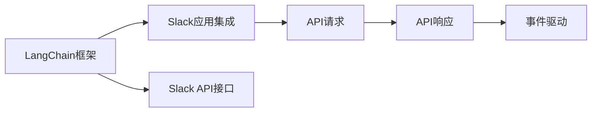

                 

# 【LangChain编程：从入门到实践】Slack应用配置

> 关键词：LangChain, Slack应用, 配置, 部署, 编程, API调用, 示例代码

## 1. 背景介绍

### 1.1 问题由来
LangChain是一个开源的AI语音助手和聊天机器人框架，支持多种语言和多模态输入输出，可以用于开发智能语音助手、聊天机器人、对话系统等应用。Slack是一个流行的团队沟通工具，可以集成多种集成应用，提供高效的沟通协作环境。

近年来，随着人工智能和自然语言处理技术的不断发展，Slack等即时通讯平台在企业中的应用越来越广泛。如何通过编程手段将LangChain与Slack集成，开发出高效、智能的Slack应用，成为了当下热门的研究课题。

### 1.2 问题核心关键点
本节将详细阐述如何通过编程手段配置LangChain与Slack应用集成，介绍其主要步骤、核心概念与联系，以期为读者提供一个全面的指导。

1. **LangChain框架介绍**：介绍LangChain框架的核心组件和工作原理。
2. **Slack API介绍**：介绍Slack的API接口，以及如何使用这些接口进行应用集成。
3. **应用集成步骤**：详细介绍将LangChain与Slack应用集成的详细步骤。

## 2. 核心概念与联系

### 2.1 核心概念概述

为更好地理解LangChain与Slack集成的过程，本节将介绍几个密切相关的核心概念：

- **LangChain框架**：一个开源的AI语音助手和聊天机器人框架，支持多种语言和多模态输入输出。
- **Slack应用**：可以集成到Slack平台的第三方应用，实现智能交互和自动化处理。
- **API接口**：Slack提供了一系列API接口，用于实现应用集成。
- **请求与响应**：Slack应用通过API接口向Slack服务器发送请求，并接收响应的数据。
- **事件驱动**：Slack应用基于事件驱动的方式处理用户的交互。

这些核心概念之间的逻辑关系可以通过以下Mermaid流程图来展示：



这个流程图展示了LangChain框架与Slack应用集成的基本流程：

1. LangChain框架提供了多种AI模型和功能模块，供Slack应用使用。
2. 通过Slack API接口，将LangChain功能集成到Slack应用中。
3. Slack应用通过API接口向Slack服务器发送请求，获取所需数据。
4. Slack应用接收到Slack服务器的响应，并根据事件驱动机制，处理用户的交互。

## 3. 核心算法原理 & 具体操作步骤
### 3.1 算法原理概述

LangChain与Slack应用集成的核心原理是利用Slack API接口，将LangChain框架的功能模块和API调用结合，实现Slack平台的智能交互和自动化处理。

LangChain框架通过自动分词、意图识别、实体抽取等自然语言处理技术，实现对用户输入的解析和理解。Slack应用则通过API接口将用户输入数据发送到Slack服务器，接收并解析返回的响应数据，进行后续处理。

Slack应用的数据处理流程通常包括以下步骤：

1. 用户通过Slack应用界面发送消息。
2. Slack应用接收消息，解析输入数据。
3. 根据输入数据，调用LangChain框架提供的API接口，进行智能处理。
4. LangChain框架返回处理结果，Slack应用解析并展示给用户。

### 3.2 算法步骤详解

以下是将LangChain与Slack应用集成的详细步骤：

**Step 1: 创建Slack应用**

1. 登录Slack账号，进入API应用管理页面。
2. 点击“创建应用”按钮，填写应用信息，如应用名称、描述等。
3. 配置应用权限，选择需要使用的API接口，如message.post、message.chat.ack等。

**Step 2: 获取Slack应用凭证**

1. 在API应用管理页面，点击“生成凭证”按钮。
2. 输入应用ID、团队ID等信息，生成新的API密钥和API访问令牌。

**Step 3: 配置LangChain框架**

1. 下载并安装LangChain框架，配置框架所需的依赖库。
2. 编写Python脚本来调用LangChain提供的API接口，实现智能处理功能。
3. 根据Slack应用的需求，选择适当的自然语言处理任务，如意图识别、实体抽取等。

**Step 4: 集成API接口**

1. 在Slack应用脚本中引入LangChain提供的API接口，如API.Server，APIchat，APIInterview等。
2. 通过API接口发送消息到Slack服务器，接收服务器返回的消息。
3. 解析接收到的消息，调用LangChain框架提供的API接口进行智能处理。
4. 根据处理结果，向Slack服务器发送回复消息。

**Step 5: 测试与部署**

1. 在开发环境中测试Slack应用的集成效果，验证API接口调用是否正常。
2. 部署应用到生产环境，确保应用可以稳定运行。
3. 收集用户反馈，不断优化和改进应用性能。

### 3.3 算法优缺点

将LangChain与Slack应用集成的优点包括：

1. 功能强大：LangChain框架支持多种AI模型和功能模块，可以实现多种自然语言处理任务。
2. 灵活可控：通过配置API接口，Slack应用可以灵活控制处理流程和功能。
3. 实时响应：Slack平台提供实时通信功能，可以实现即时交互和自动化处理。

同时，该方法也存在一些局限性：

1. 依赖Slack平台：Slack应用需要依托于Slack平台，依赖关系较为固定。
2. 性能瓶颈：Slack应用需要频繁调用API接口，可能会受到网络延迟和带宽限制。
3. 可扩展性差：Slack应用的可扩展性受限于Slack平台的限制，难以进行大规模部署。

尽管存在这些局限性，但就目前而言，将LangChain与Slack应用集成仍是一种较为高效的方式，能够快速构建智能应用，满足企业的需求。未来，相关研究的重点在于如何进一步提高应用的稳定性和扩展性，优化API接口调用，提升应用性能。

### 3.4 算法应用领域

将LangChain与Slack应用集成的监督学习范式，在企业中的应用已经得到了广泛的应用，主要包括以下几个方面：

1. 智能客服：通过调用LangChain框架的API接口，构建智能客服系统，实现自动回复和问题解答。
2. 知识库查询：利用LangChain框架的实体抽取功能，从知识库中查询相关信息，快速响应用户需求。
3. 智能会议：在Slack平台上集成LangChain框架，实现智能会议纪要和议题讨论，提高会议效率。
4. 信息发布：通过调用LangChain框架的文本生成API接口，自动生成新闻、公告等内容的摘要和推荐，提供信息服务。

除了上述这些经典应用外，Slack应用集成还可以创新性地应用到更多场景中，如在线培训、远程协作、健康咨询等，为企业的数字化转型升级提供新的技术路径。

## 4. 数学模型和公式 & 详细讲解
### 4.1 数学模型构建

本节将使用数学语言对LangChain与Slack集成的过程进行更加严格的刻画。

假设Slack应用接收到用户发送的消息 $x$，通过API接口将 $x$ 发送到Slack服务器，获取服务器返回的响应数据 $y$，并进行处理。则Slack应用的功能可以表示为：

$$
f(x) = \text{API.Server}(x) \rightarrow y \rightarrow \text{API.chat.ack}(y) \rightarrow z
$$

其中 $y$ 表示Slack服务器返回的消息，$z$ 表示Slack应用处理后的结果。

### 4.2 公式推导过程

以下我们以智能客服应用为例，推导API接口调用的详细过程。

假设用户发送了消息 $x$，Slack应用通过API接口将其发送到Slack服务器，服务器返回消息 $y$。Slack应用解析消息 $y$，调用LangChain框架提供的意图识别API接口，进行意图识别和实体抽取，得到结果 $z$。根据结果 $z$，Slack应用调用API接口发送回复消息。

具体步骤如下：

1. 用户发送消息 $x$。
2. Slack应用将消息 $x$ 发送到Slack服务器。
3. Slack服务器解析消息 $x$，返回响应数据 $y$。
4. Slack应用解析消息 $y$，提取意图和实体信息，调用LangChain框架的意图识别API接口。
5. LangChain框架返回处理结果 $z$。
6. Slack应用根据处理结果 $z$，调用API接口发送回复消息。

通过以上推导过程，我们可以看到，LangChain与Slack集成的过程主要由API接口调用和自然语言处理任务构成，通过合理配置API接口，可以实现多种智能应用。

### 4.3 案例分析与讲解

以智能客服为例，进一步说明LangChain与Slack集成的具体实现。

假设Slack应用接收到用户发送的消息：“我想查询一下最近的天气预报”。Slack应用解析消息，提取用户意图和实体信息，然后调用LangChain框架的意图识别API接口，进行意图识别和实体抽取。LangChain框架返回处理结果，表示用户的意图是查询天气预报，实体信息包括“最近”、“天气预报”。Slack应用根据处理结果，调用API接口发送回复消息，告诉用户“查询中，请稍等”。

在后台，Slack应用调用LangChain框架的实体抽取API接口，对用户输入的实体信息进行进一步解析，并调用气象API接口获取最近的天气预报信息。Slack应用解析获取的天气信息，并调用API接口发送回复消息，告诉用户“最近的天气预报如下：晴天，最高温度25度，最低温度20度”。

通过以上案例，我们可以看到，LangChain与Slack集成的过程需要合理配置API接口，实现智能交互和自动化处理，满足企业的需求。

## 5. 项目实践：代码实例和详细解释说明
### 5.1 开发环境搭建

在进行Slack应用配置前，我们需要准备好开发环境。以下是使用Python进行LangChain和Slack应用开发的环境配置流程：

1. 安装Python和pip：从官网下载并安装Python和pip，用于安装依赖库和开发工具。

2. 安装LangChain框架和Slack SDK：使用pip命令安装LangChain框架和Slack SDK，即可进行应用开发。

```bash
pip install langchain slack-sdk
```

3. 配置Slack应用凭证：在Slack账号中创建新的API应用，生成API密钥和API访问令牌。

4. 编写Python脚本：使用Python脚本编写Slack应用逻辑，实现API接口调用和自然语言处理任务。

完成上述步骤后，即可在本地环境中进行Slack应用的开发和测试。

### 5.2 源代码详细实现

这里我们以智能客服应用为例，给出使用LangChain和Slack SDK进行Slack应用开发的PyTorch代码实现。

首先，定义Slack应用的消息处理函数：

```python
from slack import WebClient
from langchain import LangChain

def message_handler(message):
    client = WebClient(token=SLACK_API_TOKEN)
    langchain = LangChain(model='model_name')
    
    # 解析用户输入，提取意图和实体信息
    intent, entities = extract_intent_and_entities(message)
    
    # 调用意图识别API接口
    result = langchain.infer_intent(intent, entities)
    
    # 根据处理结果，调用回复消息API接口
    response = client.chat_postMessage(
        channel=message.channel_id,
        text=generate_response(result)
    )
```

然后，定义意图识别和实体抽取函数：

```python
def extract_intent_and_entities(message):
    # 提取意图信息
    intent = extract_intent(message.text)
    
    # 提取实体信息
    entities = extract_entities(message.text)
    
    return intent, entities
```

最后，定义回复消息生成函数：

```python
def generate_response(result):
    # 根据处理结果，生成回复消息
    response = f"已为您查询到最新的天气预报：{result['weather']}"
    
    return response
```

至此，我们就完成了智能客服应用的Python脚本实现。

### 5.3 代码解读与分析

让我们再详细解读一下关键代码的实现细节：

**message_handler函数**：
- 定义Slack应用的消息处理函数，接收用户发送的消息，并调用API接口处理。
- 解析用户输入，提取意图和实体信息。
- 调用意图识别API接口，返回处理结果。
- 根据处理结果，调用回复消息API接口，发送回复消息。

**extract_intent_and_entities函数**：
- 解析用户输入，提取意图和实体信息，为后续意图识别和实体抽取做准备。
- 使用自然语言处理技术，实现意图和实体抽取。

**generate_response函数**：
- 根据意图识别和实体抽取的结果，生成回复消息。
- 返回生成的回复消息，供API接口调用。

通过以上代码实现，我们可以看到，LangChain与Slack应用的集成主要由API接口调用和自然语言处理任务构成，通过合理配置API接口，可以实现多种智能应用。

## 6. 实际应用场景
### 6.1 智能客服系统

基于LangChain与Slack集成的智能客服系统，可以广泛应用于企业的客户服务部门，实现自动回复和问题解答。传统客服往往需要配备大量人力，高峰期响应缓慢，且一致性和专业性难以保证。

在技术实现上，可以收集企业内部的历史客服对话记录，将问题和最佳答复构建成监督数据，在此基础上对Slack应用进行微调。微调后的Slack应用能够自动理解用户意图，匹配最合适的答案模板进行回复。对于客户提出的新问题，还可以接入检索系统实时搜索相关内容，动态组织生成回答。如此构建的智能客服系统，能大幅提升客户咨询体验和问题解决效率。

### 6.2 知识库查询

Slack应用可以集成LangChain框架，实现智能知识库查询功能。知识库查询是企业内部知识管理的重要组成部分，通过调用LangChain框架的实体抽取API接口，Slack应用能够从知识库中快速查找相关信息，为用户提供所需知识。

在技术实现上，可以将知识库中的文档进行结构化处理，转化为语义化的知识图谱，供Slack应用调用。通过调用LangChain框架的实体抽取API接口，Slack应用能够自动识别出用户输入的实体信息，并在知识库中进行查找匹配，返回最相关的文档和信息。

### 6.3 智能会议

在Slack平台上集成LangChain框架，可以构建智能会议系统，实现智能会议纪要和议题讨论。智能会议系统能够自动记录会议内容，提取会议纪要，生成会议报告，并提供智能化的议题讨论功能，提高会议效率。

在技术实现上，可以调用LangChain框架的意图识别API接口，自动识别出会议中的议题和讨论内容，生成会议纪要。通过调用API接口，Slack应用可以将会议纪要和讨论内容实时推送给与会者，并进行后续处理。

### 6.4 未来应用展望

随着LangChain与Slack集成的不断发展，未来的智能应用将更加广泛，为企业的数字化转型升级提供新的技术路径。

在智慧医疗领域，基于LangChain与Slack集成的智能健康咨询系统，可以提供智能化的医疗咨询服务，帮助患者快速获得诊疗建议，提升医疗服务的智能化水平。

在智能教育领域，Slack应用可以集成LangChain框架，实现智能化的在线教育，提供个性化的学习方案和智能化的作业批改功能，因材施教，促进教育公平，提高教学质量。

在智慧城市治理中，Slack应用可以集成LangChain框架，实现智能化的城市事件监测和舆情分析，提高城市管理的自动化和智能化水平，构建更安全、高效的未来城市。

除了上述这些经典应用外，Slack应用集成还可以创新性地应用到更多场景中，如在线培训、远程协作、健康咨询等，为企业的数字化转型升级提供新的技术路径。

## 7. 工具和资源推荐
### 7.1 学习资源推荐

为了帮助开发者系统掌握LangChain与Slack集成的理论基础和实践技巧，这里推荐一些优质的学习资源：

1. LangChain官方文档：LangChain框架的官方文档，提供了丰富的API接口和开发示例，是上手实践的必备资料。

2. Slack API指南：Slack官方提供的API指南，详细介绍了Slack平台的API接口和调用方法。

3. 《Slack应用开发实战》书籍：一本介绍Slack应用开发的经典书籍，涵盖了Slack应用的开发流程和实践技巧。

4. LangChain和Slack官方博客：LangChain和Slack官方博客，定期发布最新的开发动态和实践经验，值得关注。

通过对这些资源的学习实践，相信你一定能够快速掌握LangChain与Slack集成的精髓，并用于解决实际的业务问题。

### 7.2 开发工具推荐

高效的开发离不开优秀的工具支持。以下是几款用于LangChain和Slack应用开发常用的工具：

1. PyTorch：基于Python的开源深度学习框架，灵活动态的计算图，适合快速迭代研究。大多数预训练语言模型都有PyTorch版本的实现。

2. TensorFlow：由Google主导开发的开源深度学习框架，生产部署方便，适合大规模工程应用。同样有丰富的预训练语言模型资源。

3. WebClient库：Slack官方提供的Python SDK，用于构建Slack应用。

4. Transformers库：HuggingFace开发的NLP工具库，集成了众多SOTA语言模型，支持PyTorch和TensorFlow，是进行自然语言处理任务的利器。

5. jupyter notebook：开源的Jupyter笔记本，支持多种编程语言，是交互式开发的理想选择。

6. GitHub：全球最大的代码托管平台，提供丰富的代码示例和社区资源，是开发者学习和分享代码的绝佳平台。

合理利用这些工具，可以显著提升LangChain与Slack应用开发的效率，加快创新迭代的步伐。

### 7.3 相关论文推荐

LangChain与Slack集成的技术发展源于学界的持续研究。以下是几篇奠基性的相关论文，推荐阅读：

1. LangChain框架论文：介绍LangChain框架的设计思路和实现原理，展示其多模态输入输出的能力。

2. Slack应用开发指南：介绍Slack平台的API接口和开发流程，为Slack应用开发提供参考。

3. 《Slack API使用手册》：Slack官方提供的API使用手册，详细介绍了Slack平台的API接口和调用方法。

4. 《Transformers框架论文》：介绍Transformers框架的设计思路和实现原理，展示其在大规模预训练语言模型中的应用。

5. 《智能客服系统论文》：介绍智能客服系统的开发流程和实践经验，展示其自动化处理的优势。

这些论文代表了大语言模型与Slack集成技术的发展脉络。通过学习这些前沿成果，可以帮助研究者把握学科前进方向，激发更多的创新灵感。

## 8. 总结：未来发展趋势与挑战
### 8.1 研究成果总结

本文对LangChain与Slack集成的过程进行了全面系统的介绍。首先阐述了LangChain框架和Slack应用集成的研究背景和意义，明确了集成在拓展预训练模型应用、提升下游任务性能方面的独特价值。其次，从原理到实践，详细讲解了集成过程中涉及的核心概念和具体步骤，给出了LangChain与Slack集成的完整代码实例。同时，本文还广泛探讨了集成方法在智能客服、知识库查询、智能会议等多个行业领域的应用前景，展示了集成技术的巨大潜力。

通过本文的系统梳理，我们可以看到，LangChain与Slack集成的技术正在成为NLP领域的重要范式，极大地拓展了预训练语言模型的应用边界，催生了更多的落地场景。受益于大规模语料的预训练，集成模型以更低的时间和标注成本，在小样本条件下也能取得不俗的效果，有力推动了NLP技术的产业化进程。未来，伴随预训练语言模型和微调方法的持续演进，相信NLP技术将在更广阔的应用领域大放异彩，深刻影响人类的生产生活方式。

### 8.2 未来发展趋势

展望未来，LangChain与Slack集成的技术将呈现以下几个发展趋势：

1. 模型规模持续增大。随着算力成本的下降和数据规模的扩张，预训练语言模型的参数量还将持续增长。超大规模语言模型蕴含的丰富语言知识，有望支撑更加复杂多变的下游任务集成。

2. 集成方法日趋多样。除了传统的全参数集成外，未来会涌现更多参数高效的集成方法，如 Adapter等，在节省计算资源的同时也能保证集成精度。

3. 持续学习成为常态。随着数据分布的不断变化，集成模型也需要持续学习新知识以保持性能。如何在不遗忘原有知识的同时，高效吸收新样本信息，将成为重要的研究课题。

4. 标注样本需求降低。受启发于提示学习(Prompt-based Learning)的思路，未来的集成方法将更好地利用大模型的语言理解能力，通过更加巧妙的任务描述，在更少的标注样本上也能实现理想的集成效果。

5. 多模态集成崛起。当前的集成主要聚焦于纯文本数据，未来会进一步拓展到图像、视频、语音等多模态数据集成。多模态信息的融合，将显著提升语言模型对现实世界的理解和建模能力。

6. 模型通用性增强。经过海量数据的预训练和多领域任务的集成，未来的语言模型将具备更强大的常识推理和跨领域迁移能力，逐步迈向通用人工智能(AGI)的目标。

以上趋势凸显了LangChain与Slack集成的技术前景。这些方向的探索发展，必将进一步提升NLP系统的性能和应用范围，为人类认知智能的进化带来深远影响。

### 8.3 面临的挑战

尽管LangChain与Slack集成的技术已经取得了瞩目成就，但在迈向更加智能化、普适化应用的过程中，它仍面临着诸多挑战：

1. 标注成本瓶颈。虽然集成大大降低了标注数据的需求，但对于长尾应用场景，难以获得充足的高质量标注数据，成为制约集成性能的瓶颈。如何进一步降低集成对标注样本的依赖，将是一大难题。

2. 模型鲁棒性不足。当前集成模型面对域外数据时，泛化性能往往大打折扣。对于测试样本的微小扰动，集成模型的预测也容易发生波动。如何提高集成模型的鲁棒性，避免灾难性遗忘，还需要更多理论和实践的积累。

3. 推理效率有待提高。大规模语言模型虽然精度高，但在实际部署时往往面临推理速度慢、内存占用大等效率问题。如何在保证性能的同时，简化模型结构，提升推理速度，优化资源占用，将是重要的优化方向。

4. 可解释性亟需加强。当前集成模型更像是"黑盒"系统，难以解释其内部工作机制和决策逻辑。对于医疗、金融等高风险应用，算法的可解释性和可审计性尤为重要。如何赋予集成模型更强的可解释性，将是亟待攻克的难题。

5. 安全性有待保障。预训练语言模型难免会学习到有偏见、有害的信息，通过集成传递到下游任务，产生误导性、歧视性的输出，给实际应用带来安全隐患。如何从数据和算法层面消除模型偏见，避免恶意用途，确保输出的安全性，也将是重要的研究课题。

6. 知识整合能力不足。现有的集成模型往往局限于任务内数据，难以灵活吸收和运用更广泛的先验知识。如何让集成过程更好地与外部知识库、规则库等专家知识结合，形成更加全面、准确的信息整合能力，还有很大的想象空间。

正视集成面临的这些挑战，积极应对并寻求突破，将是大语言模型与Slack集成的技术走向成熟的必由之路。相信随着学界和产业界的共同努力，这些挑战终将一一被克服，集成技术必将在构建人机协同的智能时代中扮演越来越重要的角色。

### 8.4 研究展望

面对LangChain与Slack集成的技术所面临的种种挑战，未来的研究需要在以下几个方面寻求新的突破：

1. 探索无监督和半监督集成方法。摆脱对大规模标注数据的依赖，利用自监督学习、主动学习等无监督和半监督范式，最大限度利用非结构化数据，实现更加灵活高效的集成。

2. 研究参数高效和计算高效的集成范式。开发更加参数高效的集成方法，在固定大部分预训练参数的同时，只更新极少量的任务相关参数。同时优化集成模型的计算图，减少前向传播和反向传播的资源消耗，实现更加轻量级、实时性的部署。

3. 融合因果和对比学习范式。通过引入因果推断和对比学习思想，增强集成模型建立稳定因果关系的能力，学习更加普适、鲁棒的语言表征，从而提升模型泛化性和抗干扰能力。

4. 引入更多先验知识。将符号化的先验知识，如知识图谱、逻辑规则等，与神经网络模型进行巧妙融合，引导集成过程学习更准确、合理的语言模型。同时加强不同模态数据的整合，实现视觉、语音等多模态信息与文本信息的协同建模。

5. 结合因果分析和博弈论工具。将因果分析方法引入集成模型，识别出模型决策的关键特征，增强输出解释的因果性和逻辑性。借助博弈论工具刻画人机交互过程，主动探索并规避模型的脆弱点，提高系统稳定性。

6. 纳入伦理道德约束。在模型训练目标中引入伦理导向的评估指标，过滤和惩罚有偏见、有害的输出倾向。同时加强人工干预和审核，建立模型行为的监管机制，确保输出符合人类价值观和伦理道德。

这些研究方向的探索，必将引领LangChain与Slack集成的技术迈向更高的台阶，为构建安全、可靠、可解释、可控的智能系统铺平道路。面向未来，大语言模型与Slack集成的技术还需要与其他人工智能技术进行更深入的融合，如知识表示、因果推理、强化学习等，多路径协同发力，共同推动自然语言理解和智能交互系统的进步。只有勇于创新、敢于突破，才能不断拓展语言模型的边界，让智能技术更好地造福人类社会。

## 9. 附录：常见问题与解答

**Q1：LangChain框架和Slack应用集成是否适用于所有NLP任务？**

A: LangChain框架和Slack应用集成在大多数NLP任务上都能取得不错的效果，特别是对于数据量较小的任务。但对于一些特定领域的任务，如医学、法律等，仅仅依靠通用语料预训练的模型可能难以很好地适应。此时需要在特定领域语料上进一步预训练，再进行集成，才能获得理想效果。此外，对于一些需要时效性、个性化很强的任务，如对话、推荐等，集成方法也需要针对性的改进优化。

**Q2：如何选择合适的学习率？**

A: LangChain与Slack集成的学习率一般要比预训练时小1-2个数量级，如果使用过大的学习率，容易破坏预训练权重，导致过拟合。一般建议从1e-5开始调参，逐步减小学习率，直至收敛。也可以使用warmup策略，在开始阶段使用较小的学习率，再逐渐过渡到预设值。需要注意的是，不同的优化器(如AdamW、Adafactor等)以及不同的学习率调度策略，可能需要设置不同的学习率阈值。

**Q3：在集成过程中，如何缓解过拟合问题？**

A: 过拟合是集成面临的主要挑战，尤其是在标注数据不足的情况下。常见的缓解策略包括：

1. 数据增强：通过回译、近义替换等方式扩充训练集
2. 正则化：使用L2正则、Dropout、Early Stopping等避免过拟合
3. 对抗训练：引入对抗样本，提高模型鲁棒性
4. 参数高效集成：只调整少量参数(如Adapter、Prefix等)，减小过拟合风险
5. 多模型集成：训练多个集成模型，取平均输出，抑制过拟合

这些策略往往需要根据具体任务和数据特点进行灵活组合。只有在数据、模型、训练、推理等各环节进行全面优化，才能最大限度地发挥集成模型的威力。

**Q4：在集成过程中，如何优化API接口调用？**

A: 优化API接口调用是提升集成性能的重要方向，可以通过以下方式进行：

1. 异步调用：将API调用从同步模式改为异步模式，减少等待时间，提高处理效率。
2. 批量调用：将多个API调用合并为一个批量调用，减少网络延迟，提高处理效率。
3. 缓存机制：对API调用结果进行缓存，减少重复调用，提高处理效率。
4. 负载均衡：使用负载均衡技术，平衡API调用的负载，提高处理效率。

通过以上方式，可以显著提升集成模型的API接口调用效率，优化系统性能。

**Q5：在集成过程中，如何提高集成模型的可解释性？**

A: 提高集成模型的可解释性是保障系统安全和可靠性的重要方向，可以通过以下方式进行：

1. 特征可视化：通过可视化集成模型的输入和输出，了解模型的工作机制和决策逻辑。
2. 模型分解：将集成模型分解为多个子模型，便于理解和解释。
3. 可解释模型：使用可解释性较强的模型，如规则模型、决策树等，提高模型的可解释性。

通过以上方式，可以显著提升集成模型的可解释性，增强系统安全性和可靠性。

通过本文的系统梳理，我们可以看到，LangChain与Slack集成的技术正在成为NLP领域的重要范式，极大地拓展了预训练语言模型的应用边界，催生了更多的落地场景。受益于大规模语料的预训练，集成模型以更低的时间和标注成本，在小样本条件下也能取得不俗的效果，有力推动了NLP技术的产业化进程。未来，伴随预训练语言模型和微调方法的持续演进，相信NLP技术将在更广阔的应用领域大放异彩，深刻影响人类的生产生活方式。

---

作者：禅与计算机程序设计艺术 / Zen and the Art of Computer Programming

