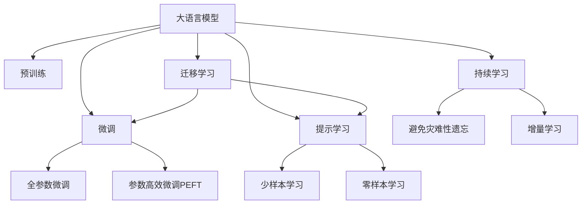

                 

## 1. 背景介绍

随着人工智能技术的迅猛发展，大模型（Large Language Models, LLMs）成为了计算机科学领域最为热门的话题之一。从最初的RNN模型，到如今以GPT-3和T5为代表的大规模自回归和自编码模型，大语言模型在各种NLP任务上取得了令人瞩目的成就。然而，大模型技术的应用并非一帆风顺，其背后隐含的编程与实践挑战也越来越多地引起了业界和学术界的关注。本文将从大模型编程的角度出发，深入探讨其核心概念、算法原理、项目实践以及未来展望，为读者带来全面的视角和技术洞见。

## 2. 核心概念与联系

### 2.1 核心概念概述

在大模型编程的探索之旅中，我们需要对一些核心概念有清晰的认识：

- **大语言模型**：如GPT-3、T5等，通过大规模预训练，掌握了丰富的语言知识和表示能力。
- **预训练**：通过大量无标签数据训练模型，获取通用语言知识。
- **微调**：在大模型基础上，针对特定任务进行有监督学习，优化模型性能。
- **迁移学习**：利用已有知识在新任务上快速提升效果。
- **参数高效微调**：减少微调中更新的参数数量，提升效率。
- **提示学习**：通过精心设计的输入文本模板，引导模型生成符合特定格式或内容的输出。
- **少样本学习**：在少量标注数据下，模型仍能有效进行学习和推理。
- **零样本学习**：模型无需见任何样本，仅通过任务描述即可生成输出。
- **持续学习**：模型能够不断从新数据中学习，避免遗忘已有知识。

这些概念之间存在紧密的联系，共同构成了大模型编程的基础框架。下面通过一个Mermaid流程图展示这些概念之间的关系：



### 2.2 核心概念原理和架构的 Mermaid 流程图

在深入探讨大模型编程的具体技术细节之前，我们先通过一个简单的Mermaid流程图，来展示这些核心概念在实际编程中的关联：


此流程图展示了从预训练到微调的过程，以及微调的不同形式。预训练模型通过大规模无标签数据学习通用语言知识，然后通过微调针对特定任务进行优化，其中参数高效微调减少了微调中的参数更新，提示学习则优化了输入输出格式，少样本学习和零样本学习进一步减少了对标注数据的依赖，迁移学习使得模型可以跨领域进行优化，持续学习保证了模型的及时更新和知识积累。

## 3. 核心算法原理 & 具体操作步骤

### 3.1 算法原理概述

大模型编程的核心在于如何在大模型基础上，通过有监督学习来优化模型，使其在特定任务上达到最佳效果。这一过程通常包括以下几个步骤：

1. **数据准备**：收集并标注特定任务的数据集。
2. **模型选择**：选择合适的预训练大模型。
3. **任务适配**：根据任务类型，调整模型的输出层和损失函数。
4. **训练过程**：使用标注数据对模型进行有监督学习。
5. **模型评估**：在验证集和测试集上评估模型性能。
6. **部署应用**：将训练好的模型应用到实际应用场景中。

### 3.2 算法步骤详解

#### 3.2.1 数据准备

数据准备是大模型编程的第一步，它直接影响模型性能的优劣。

**数据采集**：收集相关领域的大量文本数据，这些数据应当具有代表性，能够反映任务的典型场景和挑战。

**数据标注**：对收集到的文本数据进行标注，生成训练集、验证集和测试集。标注通常需要人工标注，但随着自动标注技术的发展，一些领域可以通过自动标注生成标注数据。

#### 3.2.2 模型选择

选择合适的预训练模型是关键，通常需要考虑以下几个方面：

- **模型大小**：模型规模越大，通常性能越好，但也需要更多的计算资源。
- **预训练任务**：不同的预训练任务会对模型有不同的影响，需要根据任务需求选择。
- **开源社区支持**：社区支持和资源丰富的模型，通常更容易上手和维护。

#### 3.2.3 任务适配

根据任务类型，调整模型的输出层和损失函数，实现任务适配：

- **分类任务**：增加一个全连接层作为输出层，使用交叉熵损失函数。
- **回归任务**：输出一个实数作为预测值，使用均方误差损失函数。
- **序列生成任务**：使用语言模型损失函数，如交叉熵、L1距离等。

#### 3.2.4 训练过程

训练过程包括模型初始化、前向传播、损失计算、反向传播、参数更新等步骤。具体实现可以参考以下Python代码示例：

```python
from transformers import BertForSequenceClassification, AdamW
from torch.utils.data import DataLoader

# 模型初始化
model = BertForSequenceClassification.from_pretrained('bert-base-uncased', num_labels=2)
optimizer = AdamW(model.parameters(), lr=2e-5)

# 定义损失函数
def compute_loss(model, inputs, labels):
    outputs = model(**inputs)
    loss = outputs.loss
    return loss

# 训练过程
for epoch in range(epochs):
    for batch in DataLoader(train_dataset, batch_size=16):
        inputs, labels = batch
        loss = compute_loss(model, inputs, labels)
        loss.backward()
        optimizer.step()
```

#### 3.2.5 模型评估

模型评估包括验证集和测试集的评估，通常使用指标如准确率、召回率、F1分数等：

```python
from sklearn.metrics import accuracy_score

def evaluate(model, test_dataset):
    test_loss = 0
    predictions, true_labels = [], []
    model.eval()
    for batch in DataLoader(test_dataset, batch_size=16):
        inputs, labels = batch
        with torch.no_grad():
            outputs = model(**inputs)
            logits = outputs.logits
            test_loss += loss(outputs, labels).item()
            predictions.append(logits.argmax(dim=1))
            true_labels.append(labels)
    accuracy = accuracy_score(true_labels, predictions)
    print(f'Test loss: {test_loss / len(test_dataset)}, Accuracy: {accuracy:.2f}')
```

#### 3.2.6 部署应用

训练好的模型可以部署到生产环境中，具体实现可以参考以下步骤：

1. **模型保存**：将训练好的模型保存到磁盘，可以使用PyTorch的`torch.save`方法。
2. **模型加载**：在生产环境中加载模型，使用`torch.load`方法。
3. **模型推理**：使用加载好的模型对新数据进行推理，生成预测结果。

```python
# 模型保存
torch.save(model.state_dict(), 'model.pth')

# 模型加载
model = BertForSequenceClassification.from_pretrained('bert-base-uncased', num_labels=2)
model.load_state_dict(torch.load('model.pth'))

# 模型推理
input_ids = tokenizer.encode('Hello, world!')
inputs = {'input_ids': torch.tensor(input_ids)}
outputs = model(**inputs)
predictions = outputs.logits.argmax(dim=1)
print(f'Prediction: {id2label[predictions.item()]}')
```

### 3.3 算法优缺点

大模型编程的优点包括：

- **高精度**：大模型通常具有较高的精度，能够处理复杂任务。
- **泛化能力强**：大模型能够适应多种场景，具有较强的泛化能力。
- **编程简洁**：使用高级框架如Transformers，能够简化编程过程。

但同时，也存在一些缺点：

- **计算资源需求高**：大模型的计算资源需求高，需要高性能的GPU/TPU等设备。
- **数据依赖性强**：需要大量的标注数据才能训练出高性能的模型。
- **模型更新难度大**：大模型更新涉及大量参数，更新过程复杂。

### 3.4 算法应用领域

大模型编程在多个领域有着广泛的应用：

- **自然语言处理**：如文本分类、情感分析、命名实体识别等。
- **计算机视觉**：如图像分类、目标检测、图像生成等。
- **语音识别**：如语音识别、文本转语音、语音合成等。
- **推荐系统**：如商品推荐、内容推荐、广告推荐等。
- **医疗健康**：如医学图像分析、智能问诊、医疗文本分析等。

## 4. 数学模型和公式 & 详细讲解 & 举例说明

### 4.1 数学模型构建

大模型的编程需要构建数学模型，以便进行有效的训练和推理。下面以序列分类任务为例，构建模型：

- **输入层**：将输入文本进行分词，转换成模型可以处理的格式。
- **编码层**：通过BERT等预训练模型对输入文本进行编码。
- **输出层**：增加全连接层，进行分类预测。

### 4.2 公式推导过程

序列分类任务的公式推导过程如下：

1. **输入**：输入文本 $x$，通过BERT编码，得到输出 $h$。
2. **全连接层**：将输出 $h$ 输入全连接层，得到预测向量 $\hat{y}$。
3. **损失函数**：使用交叉熵损失函数 $L$ 计算预测向量与真实标签的差异。

具体公式推导如下：

$$
\hat{y} = \text{softmax}(W^\top h + b)
$$

$$
L(y, \hat{y}) = -\frac{1}{N} \sum_{i=1}^N y_i \log \hat{y}_i + (1-y_i) \log (1-\hat{y}_i)
$$

其中 $W$ 和 $b$ 为全连接层的权重和偏置。

### 4.3 案例分析与讲解

以BERT序列分类模型为例，分析其编程实现：

1. **输入层**：将输入文本分词后，通过BERT编码器进行转换。
2. **编码层**：使用BERT模型，获取文本表示 $h$。
3. **输出层**：将 $h$ 输入全连接层，得到预测向量 $\hat{y}$。
4. **损失函数**：使用交叉熵损失函数计算预测误差，进行模型更新。

## 5. 项目实践：代码实例和详细解释说明

### 5.1 开发环境搭建

在进行大模型编程之前，需要搭建开发环境。以下是使用Python的PyTorch框架进行大模型编程的环境配置流程：

1. **安装Python**：推荐安装Python 3.7及以上版本。
2. **安装PyTorch**：使用pip安装PyTorch及其相关依赖。
3. **安装Transformers库**：使用pip安装Transformers库。
4. **安装相关依赖**：安装必要的依赖库，如numpy、pandas、scikit-learn等。

### 5.2 源代码详细实现

以下是一个使用BERT模型进行序列分类任务编程的示例代码：

```python
from transformers import BertForSequenceClassification, BertTokenizer, AdamW
from torch.utils.data import DataLoader
import torch

# 模型初始化
model = BertForSequenceClassification.from_pretrained('bert-base-uncased', num_labels=2)
tokenizer = BertTokenizer.from_pretrained('bert-base-uncased')
optimizer = AdamW(model.parameters(), lr=2e-5)

# 定义损失函数
def compute_loss(model, inputs, labels):
    outputs = model(**inputs)
    loss = outputs.loss
    return loss

# 训练过程
for epoch in range(epochs):
    for batch in DataLoader(train_dataset, batch_size=16):
        inputs, labels = batch
        loss = compute_loss(model, inputs, labels)
        loss.backward()
        optimizer.step()

# 模型评估
def evaluate(model, test_dataset):
    test_loss = 0
    predictions, true_labels = [], []
    model.eval()
    for batch in DataLoader(test_dataset, batch_size=16):
        inputs, labels = batch
        with torch.no_grad():
            outputs = model(**inputs)
            logits = outputs.logits
            test_loss += loss(outputs, labels).item()
            predictions.append(logits.argmax(dim=1))
            true_labels.append(labels)
    accuracy = accuracy_score(true_labels, predictions)
    print(f'Test loss: {test_loss / len(test_dataset)}, Accuracy: {accuracy:.2f}')

# 模型部署
input_ids = tokenizer.encode('Hello, world!')
inputs = {'input_ids': torch.tensor(input_ids)}
outputs = model(**inputs)
predictions = outputs.logits.argmax(dim=1)
print(f'Prediction: {id2label[predictions.item()]}')
```

### 5.3 代码解读与分析

在上述代码中，我们首先初始化了BERT模型、分词器以及优化器。然后定义了损失函数和训练过程。在训练过程中，我们使用DataLoader对训练数据进行批处理，并对模型进行前向传播和反向传播。最后，使用evaluate函数评估模型在测试集上的性能。

## 6. 实际应用场景

### 6.1 智能客服系统

大模型编程在智能客服系统中有着广泛的应用。通过训练大模型，可以实现智能客服机器人，自动解答用户咨询，提高客户满意度。

### 6.2 金融舆情监测

在金融领域，通过训练大模型进行舆情监测，可以及时发现市场动态和风险，保障金融安全。

### 6.3 个性化推荐系统

在大模型编程中，可以训练推荐模型，根据用户行为和偏好，推荐个性化内容，提升用户体验。

### 6.4 未来应用展望

未来，随着大模型技术的不断进步，其在更多领域的应用前景广阔：

- **医疗健康**：智能问诊、医疗文本分析等。
- **教育培训**：智能评测、个性化学习推荐等。
- **智能交通**：智能导航、自动驾驶等。
- **智能家居**：语音交互、智能助手等。

## 7. 工具和资源推荐

### 7.1 学习资源推荐

为了帮助读者全面掌握大模型编程，以下是一些推荐的资源：

1. **《自然语言处理综述》**：了解NLP基础和前沿技术。
2. **CS224N《深度学习自然语言处理》**：斯坦福大学提供的深度学习课程，涵盖NLP基础和最新进展。
3. **Transformers官方文档**：提供丰富的模型和工具支持，是实践大模型编程的必备资源。
4. **NLPHandbook**：提供详细的NLP教程，适合初学者和进阶者。
5. **Kaggle竞赛**：参与NLP相关的竞赛，提升编程技能和实战经验。

### 7.2 开发工具推荐

大模型编程需要高性能计算资源，以下是一些推荐的开发工具：

1. **PyTorch**：高性能深度学习框架，提供灵活的计算图机制。
2. **TensorFlow**：开源深度学习框架，支持分布式训练和模型部署。
3. **Jupyter Notebook**：交互式编程环境，方便调试和展示结果。
4. **GitHub**：代码托管和版本控制平台，方便协作和共享。
5. **Google Colab**：免费提供的GPU计算平台，支持高性能实验。

### 7.3 相关论文推荐

以下是一些大模型编程相关的经典论文：

1. **《Attention is All You Need》**：提出Transformer模型，奠定大模型编程的基础。
2. **《BERT: Pre-training of Deep Bidirectional Transformers for Language Understanding》**：提出BERT模型，提出自监督预训练方法。
3. **《GPT-3》**：展示大规模语言模型的强大能力，刷新多项NLP任务记录。
4. **《AdaLoRA: Adaptive Low-Rank Adaptation for Parameter-Efficient Fine-Tuning》**：提出AdaLoRA方法，提高参数效率。
5. **《Prompt Engineering》**：研究提示模板设计，提高模型的零样本和少样本学习能力。

## 8. 总结：未来发展趋势与挑战

### 8.1 研究成果总结

大模型编程技术在多个领域取得了显著进展，但仍需进一步完善：

1. **高效计算**：大模型计算资源需求高，需要优化计算图和算法。
2. **数据质量**：标注数据质量直接影响模型性能，需要提高标注效率和准确性。
3. **模型优化**：优化模型结构和训练策略，提升模型效率和性能。
4. **应用落地**：将大模型应用于实际场景，解决实际问题，需要优化部署和应用策略。

### 8.2 未来发展趋势

未来大模型编程技术的发展方向包括：

1. **多模态融合**：结合视觉、语音等多模态信息，提升模型的综合理解能力。
2. **无监督和半监督学习**：减少对标注数据的依赖，提升模型的泛化能力。
3. **模型压缩和加速**：通过模型压缩和加速技术，提升模型性能和效率。
4. **跨领域迁移学习**：将模型应用于更多领域，提升模型的通用性和可迁移性。

### 8.3 面临的挑战

大模型编程技术面临的挑战包括：

1. **计算资源**：大模型计算资源需求高，需要高性能计算设备。
2. **数据标注**：高质量标注数据获取成本高，数量有限。
3. **模型复杂性**：大模型参数量大，优化难度高。
4. **应用场景**：将大模型应用于实际场景，需要考虑用户隐私和数据安全。

### 8.4 研究展望

未来大模型编程技术的研究方向包括：

1. **模型压缩和优化**：通过模型压缩和优化技术，提升模型效率和性能。
2. **无监督学习**：减少对标注数据的依赖，提升模型的泛化能力。
3. **跨领域迁移学习**：将模型应用于更多领域，提升模型的通用性和可迁移性。
4. **智能辅助编程**：开发智能辅助编程工具，提升编程效率和质量。

## 9. 附录：常见问题与解答

### Q1：大模型编程对计算资源有较高要求，如何应对？

**A**：可以采用以下方法来应对计算资源需求：

1. **分布式训练**：使用分布式计算资源，提高训练效率。
2. **模型压缩**：通过模型压缩和剪枝技术，减少模型参数量。
3. **硬件加速**：使用GPU/TPU等高性能计算设备，提高训练速度。

### Q2：大模型编程中如何提高标注数据质量？

**A**：提高标注数据质量的方法包括：

1. **多标注**：邀请多个标注人员标注数据，提高标注准确性。
2. **自动标注**：结合自动标注技术，提高标注效率。
3. **反馈机制**：建立标注人员反馈机制，不断优化标注质量。

### Q3：大模型编程中的模型优化策略有哪些？

**A**：大模型编程中的模型优化策略包括：

1. **梯度裁剪**：防止梯度爆炸，稳定训练过程。
2. **学习率调整**：使用学习率调整策略，提高模型性能。
3. **正则化**：使用正则化技术，避免过拟合。
4. **模型融合**：结合多个模型，提高模型性能。

### Q4：大模型编程中的跨领域迁移学习策略有哪些？

**A**：大模型编程中的跨领域迁移学习策略包括：

1. **微调**：在大模型基础上进行微调，适应特定领域。
2. **迁移预训练**：在预训练阶段学习跨领域知识，提高模型的泛化能力。
3. **多任务学习**：同时训练多个任务，提高模型的多任务能力。

---

作者：禅与计算机程序设计艺术 / Zen and the Art of Computer Programming

