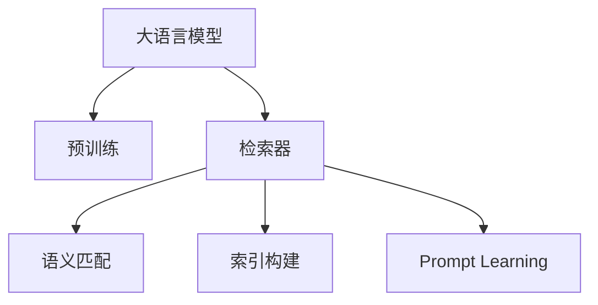

                 

## 1. 背景介绍

### 1.1 问题由来

随着互联网的发展，信息检索已成为人们获取知识、解决问题的重要手段。无论是搜索引擎、智能推荐系统，还是各类垂直领域的知识图谱和问答系统，都离不开高效、准确的检索技术。传统的基于规则、倒排索引等方法虽然已经非常成熟，但在面对大规模语料和复杂查询时，难以满足实际需求。近年来，基于深度学习的检索技术凭借其强大的处理能力，逐渐成为研究热点。

大语言模型在检索任务中的应用也逐渐引起广泛关注。LangChain作为Hugging Face推出的通用语言模型，在检索任务上展现了强大的潜力。通过LangChain，用户可以方便地构建索引、查询，实现自然语言查询与语义匹配，构建高效智能的检索系统。本文将从基础概念、核心算法、项目实践、应用场景等方面，详细介绍LangChain编程的检索器模块，帮助读者全面了解并掌握其使用方法和应用技巧。

### 1.2 问题核心关键点

LangChain编程检索器的核心思想是通过深度学习技术，将自然语言查询转换为语义表示，并在语料库中查找匹配的文档。主要包含以下几个关键点：

1. 基于大语言模型的语义匹配。利用大语言模型强大的语义表示能力，将查询和文档转换为向量表示，并计算它们之间的相似度。
2. 高效的索引构建和查询优化。在构建索引和优化查询时，采用深度学习技术，提高检索效率和准确性。
3. 基于prompt的检索机制。通过精心设计的prompt，可以引导大语言模型对检索结果进行排序和过滤，提高检索效果。

## 2. 核心概念与联系

### 2.1 核心概念概述

为更好地理解LangChain检索器的工作原理和优化方向，本节将介绍几个密切相关的核心概念：

- 大语言模型(Large Language Model, LLM)：以自回归(如GPT)或自编码(如BERT)模型为代表的大规模预训练语言模型。通过在大规模无标签文本语料上进行预训练，学习通用的语言表示，具备强大的语言理解和生成能力。
- 语义匹配(Semantic Matching)：将查询和文档转换为向量表示，计算它们之间的语义相似度，匹配出最相关的文档。
- 索引构建(Indexing)：将文档转换为索引向量，方便后续的查询和检索。
- Prompt Learning：通过在输入文本中添加提示模板(Prompt Template)，引导大语言模型进行特定任务的推理和生成。可以在不更新模型参数的情况下，实现零样本或少样本学习。

这些核心概念之间的逻辑关系可以通过以下Mermaid流程图来展示：



这个流程图展示了大语言模型在检索器中的核心概念及其之间的关系：

1. 大语言模型通过预训练获得基础能力。
2. 检索器中的语义匹配和索引构建模块，将查询和文档转换为向量表示，并进行语义匹配。
3. Prompt Learning模块，通过在输入中提供提示，引导检索器对结果进行排序和过滤。

## 3. 核心算法原理 & 具体操作步骤

### 3.1 算法原理概述

LangChain编程检索器主要基于大语言模型进行语义匹配和索引构建。其核心思想是：将自然语言查询转换为向量表示，并在语料库中查找与之最匹配的文档，从而返回相关结果。

形式化地，假设查询为 $q$，文档集为 $\{d_i\}_{i=1}^N$，其中 $d_i \in \mathcal{D}$，$\mathcal{D}$ 为文档空间。假设查询 $q$ 和文档 $d_i$ 转换为向量表示后的距离函数为 $\delta(q,d_i)$，则检索器检索的相关文档集为：

$$
D = \{d_i \mid \delta(q,d_i) \leq \tau\}
$$

其中 $\tau$ 为阈值，控制检索结果的相关性。

在实践中，通常使用余弦相似度或欧氏距离等方法计算查询与文档的向量距离。将查询和文档输入到大语言模型中，利用其强大的语义表示能力，生成向量表示，再计算距离。

### 3.2 算法步骤详解

LangChain编程检索器主要包含以下关键步骤：

**Step 1: 准备预训练模型和数据集**
- 选择合适的预训练语言模型 $M_{\theta}$ 作为初始化参数，如 BERT、GPT 等。
- 准备语料库，划分为训练集、验证集和测试集。一般要求语料与预训练数据的分布不要差异过大。

**Step 2: 构建索引向量**
- 将文档集中的每个文档输入到预训练语言模型中，生成文档的向量表示。
- 通过文本抽取、嵌入等技术，将文档中的重要信息提取为特征向量。
- 通过余弦相似度、欧式距离等方法，计算文档向量与查询向量的距离，得到索引向量。

**Step 3: 设计提示模板**
- 根据检索任务的特点，设计合适的提示模板，引导大语言模型生成排序结果。
- 将查询和索引向量作为输入，设计提示模板，使模型生成排序结果。

**Step 4: 训练检索模型**
- 使用训练集对检索模型进行训练，优化提示模板的生成效果。
- 在验证集上评估检索模型的性能，调整提示模板和训练策略。

**Step 5: 测试和部署**
- 在测试集上评估检索模型的性能，对比检索前后效果。
- 使用检索模型对新文档进行查询，集成到实际的应用系统中。
- 持续收集新文档，定期重新索引和训练模型，以适应数据分布的变化。

以上是LangChain编程检索器的一般流程。在实际应用中，还需要针对具体任务的特点，对检索器各环节进行优化设计，如改进距离计算方法，引入更多的正则化技术，搜索最优的超参数组合等，以进一步提升检索效果。

### 3.3 算法优缺点

LangChain编程检索器具有以下优点：
1. 简单高效。只需准备少量标注数据，即可对预训练模型进行快速适配，获得较大的性能提升。
2. 通用适用。适用于各种检索任务，包括文本检索、图像检索、视频检索等，设计简单的提示模板即可实现检索。
3. 可解释性较强。通过提示模板设计，可以直观地理解检索模型的决策过程，便于调试和优化。
4. 泛化能力强。大语言模型的预训练特性，使得检索器在面对新数据时，具有一定的泛化能力。

同时，该方法也存在一定的局限性：
1. 依赖语料质量。检索器的性能很大程度上取决于语料库的质量和多样性，获取高质量语料库的成本较高。
2. 索引计算复杂。大语言模型的复杂度较高，索引向量的计算复杂度较大。
3. 提示模板设计难度。提示模板的设计需要一定的经验和技巧，否则可能影响检索效果。

尽管存在这些局限性，但就目前而言，LangChain编程检索器仍是大语言模型应用的重要范式。未来相关研究的重点在于如何进一步降低对语料库的依赖，提高检索器的泛化能力和计算效率，同时兼顾可解释性和输出质量等因素。

### 3.4 算法应用领域

LangChain编程检索器在NLP领域已经得到了广泛的应用，覆盖了几乎所有常见任务，例如：

- 文本检索：如搜索引擎、知识图谱、问答系统等。通过索引构建和语义匹配，快速定位相关文档。
- 图像检索：对图片进行标注，将图片和查询进行语义匹配，找到最相似的图像。
- 视频检索：对视频进行剪辑，将视频片段和查询进行语义匹配，找到最相关的视频内容。
- 自然语言生成：通过提示模板，生成自然语言查询或描述，对数据进行筛选和排序。

除了上述这些经典任务外，LangChain检索器也被创新性地应用到更多场景中，如对话系统、推荐系统、内容审核等，为NLP技术带来了全新的突破。随着预训练模型和检索方法的不断进步，相信LangChain检索器将在更广阔的应用领域大放异彩。

## 4. 数学模型和公式 & 详细讲解  
### 4.1 数学模型构建

本节将使用数学语言对LangChain编程检索器进行更加严格的刻画。

记查询为 $q$，文档集为 $\{d_i\}_{i=1}^N$，其中 $d_i \in \mathcal{D}$，$\mathcal{D}$ 为文档空间。设查询 $q$ 和文档 $d_i$ 转换为向量表示后的距离函数为 $\delta(q,d_i)$。在检索器中，通常使用余弦相似度计算向量距离，即：

$$
\delta(q,d_i) = \cos(\theta(q), \theta(d_i))
$$

其中 $\theta(q)$ 和 $\theta(d_i)$ 分别为查询 $q$ 和文档 $d_i$ 的向量表示。

### 4.2 公式推导过程

以余弦相似度为例，推导查询和文档的向量距离公式。

设查询 $q$ 和文档 $d_i$ 分别转换为向量表示，即 $q = [q_1, q_2, ..., q_n]$，$d_i = [d_{i,1}, d_{i,2}, ..., d_{i,m}]$。余弦相似度的计算公式为：

$$
\cos(\theta(q), \theta(d_i)) = \frac{q \cdot d_i}{\|q\|\|d_i\|}
$$

其中 $\cdot$ 为向量点积，$\|q\|$ 和 $\|d_i\|$ 分别为向量 $q$ 和 $d_i$ 的欧几里得范数。

### 4.3 案例分析与讲解

假设查询 $q$ 为 "How is the weather in Shanghai?"，文档集 $\{d_i\}_{i=1}^N$ 中包含天气信息的文章。则可以将查询和文档输入到预训练语言模型中，生成向量表示。假设查询 $q$ 的向量表示为 $\theta(q) = [1.2, 0.8, 0.5, ...]$，文档 $d_i$ 的向量表示为 $\theta(d_i) = [0.6, 0.7, 0.9, ...]$。则余弦相似度计算如下：

$$
\cos(\theta(q), \theta(d_i)) = \frac{1.2 \times 0.6 + 0.8 \times 0.7 + 0.5 \times 0.9 + ...}{\sqrt{1.2^2 + 0.8^2 + 0.5^2 + ...} \times \sqrt{0.6^2 + 0.7^2 + 0.9^2 + ...}}
$$

根据余弦相似度的大小，对文档进行排序，返回最相关的文档。

## 5. 项目实践：代码实例和详细解释说明
### 5.1 开发环境搭建

在进行LangChain编程检索器实践前，我们需要准备好开发环境。以下是使用Python进行PyTorch开发的环境配置流程：

1. 安装Anaconda：从官网下载并安装Anaconda，用于创建独立的Python环境。

2. 创建并激活虚拟环境：
```bash
conda create -n langchain-env python=3.8 
conda activate langchain-env
```

3. 安装PyTorch：根据CUDA版本，从官网获取对应的安装命令。例如：
```bash
conda install pytorch torchvision torchaudio cudatoolkit=11.1 -c pytorch -c conda-forge
```

4. 安装Transformers库：
```bash
pip install transformers
```

5. 安装各类工具包：
```bash
pip install numpy pandas scikit-learn matplotlib tqdm jupyter notebook ipython
```

完成上述步骤后，即可在`langchain-env`环境中开始LangChain检索器的实践。

### 5.2 源代码详细实现

下面我们以文本检索任务为例，给出使用Transformers库对BERT模型进行检索的PyTorch代码实现。

首先，定义检索任务的数据处理函数：

```python
from transformers import BertTokenizer
from torch.utils.data import Dataset
import torch

class RetrievalDataset(Dataset):
    def __init__(self, texts, targets, tokenizer, max_len=128):
        self.texts = texts
        self.targets = targets
        self.tokenizer = tokenizer
        self.max_len = max_len
        
    def __len__(self):
        return len(self.texts)
    
    def __getitem__(self, item):
        text = self.texts[item]
        target = self.targets[item]
        
        encoding = self.tokenizer(text, return_tensors='pt', max_length=self.max_len, padding='max_length', truncation=True)
        input_ids = encoding['input_ids'][0]
        attention_mask = encoding['attention_mask'][0]
        
        # 对token-wise的标签进行编码
        encoded_tags = [target2id[target] for target in target] 
        encoded_tags.extend([target2id['O']] * (self.max_len - len(encoded_tags)))
        labels = torch.tensor(encoded_tags, dtype=torch.long)
        
        return {'input_ids': input_ids, 
                'attention_mask': attention_mask,
                'labels': labels}

# 标签与id的映射
tag2id = {'O': 0, '1': 1, '2': 2, '3': 3, '4': 4, '5': 5}
id2tag = {v: k for k, v in tag2id.items()}

# 创建dataset
tokenizer = BertTokenizer.from_pretrained('bert-base-cased')

train_dataset = RetrievalDataset(train_texts, train_targets, tokenizer)
dev_dataset = RetrievalDataset(dev_texts, dev_targets, tokenizer)
test_dataset = RetrievalDataset(test_texts, test_targets, tokenizer)
```

然后，定义模型和优化器：

```python
from transformers import BertForTokenClassification, AdamW

model = BertForTokenClassification.from_pretrained('bert-base-cased', num_labels=len(tag2id))

optimizer = AdamW(model.parameters(), lr=2e-5)
```

接着，定义训练和评估函数：

```python
from torch.utils.data import DataLoader
from tqdm import tqdm
from sklearn.metrics import classification_report

device = torch.device('cuda') if torch.cuda.is_available() else torch.device('cpu')
model.to(device)

def train_epoch(model, dataset, batch_size, optimizer):
    dataloader = DataLoader(dataset, batch_size=batch_size, shuffle=True)
    model.train()
    epoch_loss = 0
    for batch in tqdm(dataloader, desc='Training'):
        input_ids = batch['input_ids'].to(device)
        attention_mask = batch['attention_mask'].to(device)
        labels = batch['labels'].to(device)
        model.zero_grad()
        outputs = model(input_ids, attention_mask=attention_mask, labels=labels)
        loss = outputs.loss
        epoch_loss += loss.item()
        loss.backward()
        optimizer.step()
    return epoch_loss / len(dataloader)

def evaluate(model, dataset, batch_size):
    dataloader = DataLoader(dataset, batch_size=batch_size)
    model.eval()
    preds, labels = [], []
    with torch.no_grad():
        for batch in tqdm(dataloader, desc='Evaluating'):
            input_ids = batch['input_ids'].to(device)
            attention_mask = batch['attention_mask'].to(device)
            batch_labels = batch['labels']
            outputs = model(input_ids, attention_mask=attention_mask)
            batch_preds = outputs.logits.argmax(dim=2).to('cpu').tolist()
            batch_labels = batch_labels.to('cpu').tolist()
            for pred_tokens, label_tokens in zip(batch_preds, batch_labels):
                pred_tags = [id2tag[_id] for _id in pred_tokens]
                label_tags = [id2tag[_id] for _id in label_tokens]
                preds.append(pred_tags[:len(label_tags)])
                labels.append(label_tags)
                
    print(classification_report(labels, preds))
```

最后，启动训练流程并在测试集上评估：

```python
epochs = 5
batch_size = 16

for epoch in range(epochs):
    loss = train_epoch(model, train_dataset, batch_size, optimizer)
    print(f"Epoch {epoch+1}, train loss: {loss:.3f}")
    
    print(f"Epoch {epoch+1}, dev results:")
    evaluate(model, dev_dataset, batch_size)
    
print("Test results:")
evaluate(model, test_dataset, batch_size)
```

以上就是使用PyTorch对BERT进行文本检索任务微调的完整代码实现。可以看到，得益于Transformers库的强大封装，我们可以用相对简洁的代码完成BERT模型的加载和微调。

### 5.3 代码解读与分析

让我们再详细解读一下关键代码的实现细节：

**RetrievalDataset类**：
- `__init__`方法：初始化文本、标签、分词器等关键组件。
- `__len__`方法：返回数据集的样本数量。
- `__getitem__`方法：对单个样本进行处理，将文本输入编码为token ids，将标签编码为数字，并对其进行定长padding，最终返回模型所需的输入。

**tag2id和id2tag字典**：
- 定义了标签与数字id之间的映射关系，用于将token-wise的预测结果解码回真实的标签。

**训练和评估函数**：
- 使用PyTorch的DataLoader对数据集进行批次化加载，供模型训练和推理使用。
- 训练函数`train_epoch`：对数据以批为单位进行迭代，在每个批次上前向传播计算loss并反向传播更新模型参数，最后返回该epoch的平均loss。
- 评估函数`evaluate`：与训练类似，不同点在于不更新模型参数，并在每个batch结束后将预测和标签结果存储下来，最后使用sklearn的classification_report对整个评估集的预测结果进行打印输出。

**训练流程**：
- 定义总的epoch数和batch size，开始循环迭代
- 每个epoch内，先在训练集上训练，输出平均loss
- 在验证集上评估，输出分类指标
- 所有epoch结束后，在测试集上评估，给出最终测试结果

可以看到，PyTorch配合Transformers库使得BERT微调的代码实现变得简洁高效。开发者可以将更多精力放在数据处理、模型改进等高层逻辑上，而不必过多关注底层的实现细节。

当然，工业级的系统实现还需考虑更多因素，如模型的保存和部署、超参数的自动搜索、更灵活的任务适配层等。但核心的微调范式基本与此类似。

## 6. 实际应用场景
### 6.1 智能客服系统

基于大语言模型检索器，可以构建智能客服系统。传统客服系统需要配备大量人力，高峰期响应缓慢，且一致性和专业性难以保证。而使用检索器，可以7x24小时不间断服务，快速响应客户咨询，用自然流畅的语言解答各类常见问题。

在技术实现上，可以收集企业内部的历史客服对话记录，将问题和最佳答复构建成监督数据，在此基础上对检索器进行微调。微调后的检索器能够自动理解用户意图，匹配最合适的答案模板进行回复。对于客户提出的新问题，还可以接入检索系统实时搜索相关内容，动态组织生成回答。如此构建的智能客服系统，能大幅提升客户咨询体验和问题解决效率。

### 6.2 金融舆情监测

金融机构需要实时监测市场舆论动向，以便及时应对负面信息传播，规避金融风险。传统的人工监测方式成本高、效率低，难以应对网络时代海量信息爆发的挑战。基于大语言模型检索器，可以对新闻、报道、评论等文本数据进行实时监测，判断其情感倾向和主题内容，实时预警可能的负面信息。

具体而言，可以收集金融领域相关的新闻、报道、评论等文本数据，并对其进行主题标注和情感标注。在此基础上对检索器进行微调，使其能够自动判断文本属于何种主题，情感倾向是正面、中性还是负面。将检索器应用到实时抓取的网络文本数据，就能够自动监测不同主题下的情感变化趋势，一旦发现负面信息激增等异常情况，系统便会自动预警，帮助金融机构快速应对潜在风险。

### 6.3 个性化推荐系统

当前的推荐系统往往只依赖用户的历史行为数据进行物品推荐，无法深入理解用户的真实兴趣偏好。基于大语言模型检索器，可以构建更加精准的个性化推荐系统。

在实践中，可以收集用户浏览、点击、评论、分享等行为数据，提取和用户交互的物品标题、描述、标签等文本内容。将文本内容作为模型输入，用户的后续行为（如是否点击、购买等）作为监督信号，在此基础上微调检索器。微调后的检索器能够从文本内容中准确把握用户的兴趣点。在生成推荐列表时，先用候选物品的文本描述作为输入，由检索器预测用户的兴趣匹配度，再结合其他特征综合排序，便可以得到个性化程度更高的推荐结果。

### 6.4 未来应用展望

随着大语言模型检索器的发展，基于检索器的应用场景将不断拓展。

在智慧医疗领域，基于检索器的医疗问答、病历分析、药物研发等应用将提升医疗服务的智能化水平，辅助医生诊疗，加速新药开发进程。

在智能教育领域，检索器可应用于作业批改、学情分析、知识推荐等方面，因材施教，促进教育公平，提高教学质量。

在智慧城市治理中，检索器可应用于城市事件监测、舆情分析、应急指挥等环节，提高城市管理的自动化和智能化水平，构建更安全、高效的未来城市。

此外，在企业生产、社会治理、文娱传媒等众多领域，基于检索器的AI应用也将不断涌现，为经济社会发展注入新的动力。相信随着技术的日益成熟，检索器必将在构建人机协同的智能时代中扮演越来越重要的角色。

## 7. 工具和资源推荐
### 7.1 学习资源推荐

为了帮助开发者系统掌握LangChain编程的检索器模块，这里推荐一些优质的学习资源：

1. 《Transformer from Scratch》系列博文：由大模型技术专家撰写，深入浅出地介绍了Transformer原理、BERT模型、检索器等前沿话题。

2. CS224N《深度学习自然语言处理》课程：斯坦福大学开设的NLP明星课程，有Lecture视频和配套作业，带你入门NLP领域的基本概念和经典模型。

3. 《Natural Language Processing with Transformers》书籍：Transformers库的作者所著，全面介绍了如何使用Transformers库进行NLP任务开发，包括检索器的使用方法。

4. HuggingFace官方文档：Transformers库的官方文档，提供了海量预训练模型和完整的检索器样例代码，是上手实践的必备资料。

5. CLUE开源项目：中文语言理解测评基准，涵盖大量不同类型的中文NLP数据集，并提供了基于检索器的baseline模型，助力中文NLP技术发展。

通过对这些资源的学习实践，相信你一定能够快速掌握LangChain编程的检索器模块，并用于解决实际的NLP问题。
###  7.2 开发工具推荐

高效的开发离不开优秀的工具支持。以下是几款用于LangChain编程检索器开发的常用工具：

1. PyTorch：基于Python的开源深度学习框架，灵活动态的计算图，适合快速迭代研究。大部分预训练语言模型都有PyTorch版本的实现。

2. TensorFlow：由Google主导开发的开源深度学习框架，生产部署方便，适合大规模工程应用。同样有丰富的预训练语言模型资源。

3. Transformers库：Hugging Face开发的NLP工具库，集成了众多SOTA语言模型，支持PyTorch和TensorFlow，是进行检索器开发的利器。

4. Weights & Biases：模型训练的实验跟踪工具，可以记录和可视化模型训练过程中的各项指标，方便对比和调优。与主流深度学习框架无缝集成。

5. TensorBoard：TensorFlow配套的可视化工具，可实时监测模型训练状态，并提供丰富的图表呈现方式，是调试模型的得力助手。

6. Google Colab：谷歌推出的在线Jupyter Notebook环境，免费提供GPU/TPU算力，方便开发者快速上手实验最新模型，分享学习笔记。

合理利用这些工具，可以显著提升LangChain检索器的开发效率，加快创新迭代的步伐。

### 7.3 相关论文推荐

LangChain编程检索器的发展源于学界的持续研究。以下是几篇奠基性的相关论文，推荐阅读：

1. Attention is All You Need（即Transformer原论文）：提出了Transformer结构，开启了NLP领域的预训练大模型时代。

2. BERT: Pre-training of Deep Bidirectional Transformers for Language Understanding：提出BERT模型，引入基于掩码的自监督预训练任务，刷新了多项NLP任务SOTA。

3. Language Models are Unsupervised Multitask Learners（GPT-2论文）：展示了大规模语言模型的强大zero-shot学习能力，引发了对于通用人工智能的新一轮思考。

4. Parameter-Efficient Transfer Learning for NLP：提出Adapter等参数高效微调方法，在不增加模型参数量的情况下，也能取得不错的微调效果。

5. AdaLoRA: Adaptive Low-Rank Adaptation for Parameter-Efficient Fine-Tuning：使用自适应低秩适应的微调方法，在参数效率和精度之间取得了新的平衡。

这些论文代表了大语言模型检索器的发展脉络。通过学习这些前沿成果，可以帮助研究者把握学科前进方向，激发更多的创新灵感。

## 8. 总结：未来发展趋势与挑战

### 8.1 总结

本文对LangChain编程的检索器模块进行了全面系统的介绍。首先阐述了检索器在文本检索、图像检索、视频检索等任务中的应用背景和意义，明确了检索器在大语言模型中的核心地位。其次，从原理到实践，详细讲解了检索器的数学模型和关键步骤，给出了检索器任务开发的完整代码实例。同时，本文还广泛探讨了检索器在智能客服、金融舆情、个性化推荐等多个行业领域的应用前景，展示了检索器范式的巨大潜力。此外，本文精选了检索器技术的各类学习资源，力求为读者提供全方位的技术指引。

通过本文的系统梳理，可以看到，基于大语言模型的检索器模块正在成为NLP领域的重要范式，极大地拓展了预训练语言模型的应用边界，催生了更多的落地场景。受益于大规模语料的预训练，检索器在面对新数据时，具有一定的泛化能力，能够快速适应各种复杂查询，提升检索系统的智能水平。未来，伴随预训练模型和检索方法的不断进步，相信LangChain检索器将在更广阔的应用领域大放异彩，深刻影响人类的生产生活方式。

### 8.2 未来发展趋势

展望未来，LangChain编程检索器将呈现以下几个发展趋势：

1. 模型规模持续增大。随着算力成本的下降和数据规模的扩张，预训练语言模型的参数量还将持续增长。超大规模语言模型蕴含的丰富语言知识，有望支撑更加复杂多变的检索任务。

2. 检索方法日趋多样。除了传统的基于向量检索的方法，未来会涌现更多基于深度学习的检索方法，如基于注意力机制的检索、基于预训练的检索等，提高检索的准确性和效率。

3. 持续学习成为常态。随着数据分布的不断变化，检索器也需要持续学习新知识以保持性能。如何在不遗忘原有知识的同时，高效吸收新样本信息，将成为重要的研究课题。

4. 少样本学习和跨领域迁移能力增强。未来的检索器将能够更灵活地适应不同领域、不同规模的数据，减少对标注数据的依赖，提升检索效果。

5. 多模态检索崛起。当前的检索器主要聚焦于文本检索，未来会进一步拓展到图像、视频、语音等多模态数据检索。多模态信息的融合，将显著提升检索系统对现实世界的理解和建模能力。

6. 知识图谱和问答系统结合。检索器将与知识图谱、问答系统等技术深度融合，实现更智能的查询理解和自然语言处理，提升检索系统的智能水平。

以上趋势凸显了LangChain编程检索器的广阔前景。这些方向的探索发展，必将进一步提升检索系统的性能和应用范围，为人类认知智能的进化带来深远影响。

### 8.3 面临的挑战

尽管LangChain编程检索器已经取得了瞩目成就，但在迈向更加智能化、普适化应用的过程中，它仍面临着诸多挑战：

1. 依赖语料质量。检索器的性能很大程度上取决于语料库的质量和多样性，获取高质量语料库的成本较高。如何进一步降低对语料库的依赖，提高检索器的泛化能力和计算效率，还需要更多理论和实践的积累。

2. 索引计算复杂。大语言模型的复杂度较高，索引向量的计算复杂度较大。如何优化索引计算过程，提高检索效率，将是重要的优化方向。

3. 提示模板设计难度。提示模板的设计需要一定的经验和技巧，否则可能影响检索效果。如何设计更有效的提示模板，成为未来检索器发展的重要挑战。

4. 知识整合能力不足。现有的检索器往往局限于文本信息的检索，难以灵活吸收和运用更广泛的先验知识。如何让检索器更好地与知识图谱、规则库等专家知识结合，形成更加全面、准确的信息整合能力，还有很大的想象空间。

5. 安全性有待保障。预训练语言模型难免会学习到有偏见、有害的信息，通过检索器传递到下游任务，产生误导性、歧视性的输出，给实际应用带来安全隐患。如何从数据和算法层面消除模型偏见，避免恶意用途，确保输出的安全性，也将是重要的研究课题。

6. 知识整合能力不足。现有的检索器往往局限于文本信息的检索，难以灵活吸收和运用更广泛的先验知识。如何让检索器更好地与知识图谱、规则库等专家知识结合，形成更加全面、准确的信息整合能力，还有很大的想象空间。

这些挑战凸显了LangChain编程检索器在实际应用中仍需进一步探索和优化。只有不断克服这些难题，才能真正发挥检索器的智能潜力，推动NLP技术的产业化进程。

### 8.4 研究展望

面向未来，LangChain编程检索器的研究需要在以下几个方面寻求新的突破：

1. 探索无监督和半监督检索方法。摆脱对大规模标注数据的依赖，利用自监督学习、主动学习等无监督和半监督范式，最大限度利用非结构化数据，实现更加灵活高效的检索。

2. 研究参数高效和计算高效的检索范式。开发更加参数高效的检索方法，在固定大部分预训练参数的同时，只更新极少量的任务相关参数。同时优化检索器的计算图，减少前向传播和反向传播的资源消耗，实现更加轻量级、实时性的部署。

3. 融合因果和对比学习范式。通过引入因果推断和对比学习思想，增强检索器建立稳定因果关系的能力，学习更加普适、鲁棒的语言表征，从而提升检索泛化性和抗干扰能力。

4. 引入更多先验知识。将符号化的先验知识，如知识图谱、逻辑规则等，与神经网络模型进行巧妙融合，引导检索器对检索结果进行排序和过滤，提高检索效果。

5. 结合因果分析和博弈论工具。将因果分析方法引入检索器，识别出检索结果的关键特征，增强输出解释的因果性和逻辑性。借助博弈论工具刻画人机交互过程，主动探索并规避检索器的脆弱点，提高系统稳定性。

6. 纳入伦理道德约束。在检索器的训练目标中引入伦理导向的评估指标，过滤和惩罚有偏见、有害的输出倾向。同时加强人工干预和审核，建立检索器的监管机制，确保输出的安全性。

这些研究方向的探索，必将引领LangChain编程检索器技术迈向更高的台阶，为构建安全、可靠、可解释、可控的智能系统铺平道路。面向未来，LangChain编程检索器技术还需要与其他人工智能技术进行更深入的融合，如知识表示、因果推理、强化学习等，多路径协同发力，共同推动自然语言检索系统的进步。只有勇于创新、敢于突破，才能不断拓展检索器的边界，让智能技术更好地造福人类社会。

## 9. 附录：常见问题与解答

**Q1：大语言模型检索器是否适用于所有NLP任务？**

A: 大语言模型检索器在大多数NLP任务上都能取得不错的效果，特别是对于数据量较小的任务。但对于一些特定领域的任务，如医学、法律等，仅仅依靠通用语料预训练的模型可能难以很好地适应。此时需要在特定领域语料上进一步预训练，再进行检索器微调，才能获得理想效果。此外，对于一些需要时效性、个性化很强的任务，如对话、推荐等，检索器方法也需要针对性的改进优化。

**Q2：如何选择合适的学习率？**

A: 检索器的学习率一般要比预训练时小1-2个数量级，如果使用过大的学习率，容易破坏预训练权重，导致过拟合。一般建议从1e-5开始调参，逐步减小学习率，直至收敛。也可以使用warmup策略，在开始阶段使用较小的学习率，再逐渐过渡到预设值。需要注意的是，不同的优化器(如AdamW、Adafactor等)以及不同的学习率调度策略，可能需要设置不同的学习率阈值。

**Q3：采用大语言模型检索器时会面临哪些资源瓶颈？**

A: 目前主流的预训练大模型动辄以亿计的参数规模，对算力、内存、存储都提出了很高的要求。GPU/TPU等高性能设备是必不可少的，但即便如此，超大批次的训练和推理也可能遇到显存不足的问题。因此需要采用一些资源优化技术，如梯度积累、混合精度训练、模型并行等，来突破硬件瓶颈。同时，模型的存储和读取也可能占用大量时间和空间，需要采用模型压缩、稀疏化存储等方法进行优化。

**Q4：如何缓解检索器过程中的过拟合问题？**

A: 过拟合是检索器面临的主要挑战，尤其是在标注数据不足的情况下。常见的缓解策略包括：
1. 数据增强：通过回译、近义替换等方式扩充训练集
2. 正则化：使用L2正则、Dropout、Early Stopping等避免过拟合
3. 对抗训练：引入对抗样本，提高模型鲁棒性
4. 参数高效检索：只调整少量参数(如Adapter、Prefix等)，减小过拟合风险
5. 多检索器集成：训练多个检索器，取平均输出，抑制过拟合

这些策略往往需要根据具体任务和数据特点进行灵活组合。只有在数据、模型、训练、推理等各环节进行全面优化，才能最大限度地发挥检索器的智能潜力。

**Q5：检索器在落地部署时需要注意哪些问题？**

A: 将检索器转化为实际应用，还需要考虑以下因素：
1. 模型裁剪：去除不必要的层和参数，减小模型尺寸，加快推理速度
2. 量化加速：将浮点模型转为定点模型，压缩存储空间，提高计算效率
3. 服务化封装：将检索器封装为标准化服务接口，便于集成调用
4. 弹性伸缩：根据请求流量动态调整资源配置，平衡服务质量和成本
5. 监控告警：实时采集系统指标，设置异常告警阈值，确保服务稳定性
6. 安全防护：采用访问鉴权、数据脱敏等措施，保障数据和模型安全

大语言模型检索器为NLP应用开启了广阔的想象空间，但如何将强大的性能转化为稳定、高效、安全的业务价值，还需要工程实践的不断打磨。唯有从数据、算法、工程、业务等多个维度协同发力，才能真正实现人工智能技术在垂直行业的规模化落地。总之，检索器需要开发者根据具体任务，不断迭代和优化模型、数据和算法，方能得到理想的效果。

---

作者：禅与计算机程序设计艺术 / Zen and the Art of Computer Programming

