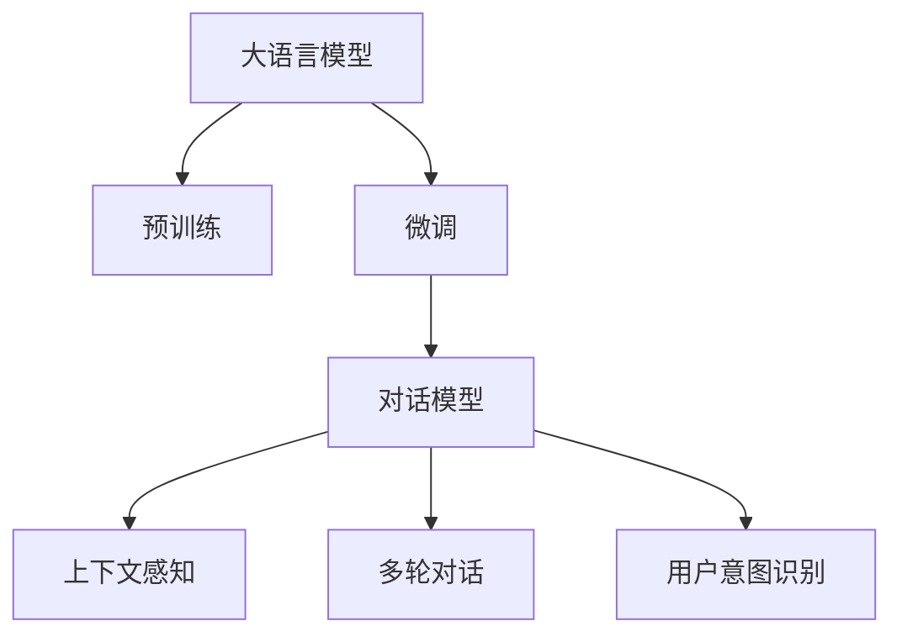

                 

# 【LangChain编程：从入门到实践】聊天模型

## 1. 背景介绍

### 1.1 问题由来
随着人工智能（AI）技术的快速发展，聊天机器人（Chatbot）已成为企业和个人应用中的重要工具。它们能够提供即时响应，处理常见问题，并在客户服务、信息获取和自动化任务中发挥作用。然而，传统的聊天机器人通常依赖于规则或模板，缺乏理解上下文的能力。这些限制使得它们在处理复杂对话时表现不佳，无法提供个性化和有意义的交流。

近年来，自然语言处理（NLP）技术的进步，特别是大语言模型（Large Language Models, LLMs）的突破，为构建更加智能和自然的聊天机器人提供了新的可能。利用预训练模型和微调技术，聊天机器人在理解和生成自然语言方面取得了显著进展。这使得它们能够更好地理解上下文，处理多轮对话，并提供高质量的响应。

### 1.2 问题核心关键点
聊天模型的核心问题在于如何有效地利用预训练语言模型的知识，通过微调（Fine-Tuning）来提升其对话能力。微调是指在预训练模型的基础上，使用对话数据集对模型进行有监督的训练，以适应特定的对话场景和需求。

成功的聊天模型需要满足以下核心要求：
1. **理解上下文**：能够理解对话历史，并基于之前的交流生成响应。
2. **多轮对话处理**：处理多轮对话中的信息流动，避免响应不符合上下文。
3. **个性化响应**：提供针对用户需求和情境的个性化回答。
4. **生成自然语言**：生成的响应自然流畅，逻辑合理。
5. **高效响应**：能够在短时间内生成响应，提高用户体验。

### 1.3 问题研究意义
聊天模型的研究意义在于其对提升用户交互体验、降低人工客服成本、提高工作效率的巨大潜力。通过智能聊天机器人，企业和组织能够全天候提供优质服务，减少对人工客服的依赖，同时收集用户反馈，优化服务质量。此外，聊天模型还能辅助人类处理大量重复性任务，提高生产力。

在技术层面，聊天模型的研究有助于推动NLP技术的发展，特别是在上下文理解、多轮对话生成、自然语言生成等前沿问题上的突破。这些技术进步将为智能对话系统的广泛应用提供坚实的技术基础。

## 2. 核心概念与联系

### 2.1 核心概念概述

为更好地理解聊天模型的构建和微调过程，本节将介绍几个关键概念及其联系：

- **大语言模型（LLMs）**：以自回归（如GPT）或自编码（如BERT）模型为代表的大规模预训练语言模型。通过在大规模无标签文本数据上进行预训练，学习通用的语言表示，具备强大的语言理解和生成能力。
- **预训练（Pre-training）**：指在大规模无标签文本语料上，通过自监督学习任务训练通用语言模型的过程。常见的预训练任务包括掩码语言模型（Masked Language Model, MLM）、下一句预测（Next Sentence Prediction, NSP）等。
- **微调（Fine-Tuning）**：指在预训练模型的基础上，使用对话数据集对模型进行有监督的训练，以适应特定的对话场景和需求。
- **对话模型（Dialogue Model）**：一种专门设计用于处理多轮对话的语言模型，能够理解上下文、生成自然语言并处理多轮信息流。
- **多轮对话（Multi-turn Dialogue）**：指一个对话由多轮交互组成，对话模型需要处理和记忆对话历史，以便生成响应。
- **上下文感知（Context-Aware）**：指模型能够理解对话上下文，并将其纳入响应生成的考虑因素。
- **用户意图识别（User Intent Recognition）**：指模型能够理解用户意图，并基于此生成相应的回答。

这些概念之间的逻辑关系可以通过以下Mermaid流程图来展示：



这个流程图展示了从预训练到大语言模型微调，再到对话模型和上下文感知，以及用户意图识别的整个流程。

## 3. 核心算法原理 & 具体操作步骤

### 3.1 算法原理概述

聊天模型的核心思想是通过微调大语言模型，使其能够理解和生成对话，以适应特定的对话场景和需求。微调过程可以看作是一个有监督学习的过程，其中模型被训练以最小化与对话数据集中的真实标签之间的差距。

假设对话数据集为 $D=\{(x_i, y_i)\}_{i=1}^N$，其中 $x_i$ 是对话历史，$y_i$ 是对话模型生成的响应。聊天模型的目标是找到一个模型参数 $\theta$，使得模型在对话数据集上的预测与真实响应之间的差距最小化，即：

$$
\theta^* = \mathop{\arg\min}_{\theta} \mathcal{L}(M_{\theta},D)
$$

其中 $\mathcal{L}$ 为损失函数，用于衡量模型预测输出与真实标签之间的差异。常见的损失函数包括交叉熵损失、均方误差损失等。

### 3.2 算法步骤详解

聊天模型的微调过程包括以下几个关键步骤：

**Step 1: 准备预训练模型和对话数据集**
- 选择合适的预训练语言模型 $M_{\theta}$ 作为初始化参数，如 BERT、GPT 等。
- 准备对话数据集 $D$，通常包括对话历史和对应的响应。对话数据集需要覆盖多种对话场景和需求，以确保模型的泛化能力。

**Step 2: 添加对话模型适配层**
- 根据任务类型，在预训练模型顶层设计合适的对话模型适配层。对话模型适配层通常包括多个自注意力层和前馈层，用于处理多轮对话和上下文信息。
- 对于对话生成任务，通常使用语言模型的解码器输出概率分布，并以负对数似然为损失函数。

**Step 3: 设置微调超参数**
- 选择合适的优化算法及其参数，如 AdamW、SGD 等，设置学习率、批大小、迭代轮数等。
- 设置正则化技术及强度，包括权重衰减、Dropout、Early Stopping 等，以防止模型过拟合。
- 确定冻结预训练参数的策略，如仅微调顶层，或全部参数都参与微调。

**Step 4: 执行梯度训练**
- 将对话数据集以批为单位输入模型，前向传播计算损失函数。
- 反向传播计算参数梯度，根据设定的优化算法和学习率更新模型参数。
- 周期性在验证集上评估模型性能，根据性能指标决定是否触发 Early Stopping。
- 重复上述步骤直至满足预设的迭代轮数或 Early Stopping 条件。

**Step 5: 测试和部署**
- 在测试集上评估微调后模型 $M_{\hat{\theta}}$ 的性能，对比微调前后的效果。
- 使用微调后的模型对新对话数据进行推理预测，集成到实际的应用系统中。

以上步骤详细阐述了聊天模型的微调过程。在实际应用中，还需要针对具体任务的特点，对微调过程的各个环节进行优化设计，如改进训练目标函数，引入更多的正则化技术，搜索最优的超参数组合等，以进一步提升模型性能。

### 3.3 算法优缺点

聊天模型具有以下优点：
1. **通用性**：适用于各种对话场景，如客户服务、信息获取、问答系统等。
2. **效率高**：使用预训练模型作为初始化参数，减少了从头训练所需的计算资源和时间。
3. **性能好**：在对话生成、意图识别、多轮对话处理等方面表现优异。
4. **灵活性**：通过微调可以适应特定的对话场景和需求。

然而，聊天模型也存在以下缺点：
1. **依赖标注数据**：对话数据集需要大量标注样本，获取高质量标注数据的成本较高。
2. **过拟合风险**：微调过程可能会引入过拟合，需要采取适当措施防止过拟合。
3. **可解释性不足**：聊天模型的决策过程难以解释，缺乏可解释性。
4. **泛化能力有限**：对话数据集覆盖的对话场景和需求可能有限，模型泛化能力有限。
5. **维护成本高**：聊天模型需要持续更新对话数据集和微调模型，维护成本较高。

尽管存在这些局限性，但聊天模型在自然语言处理和人工智能领域具有重要应用价值，其研究和应用仍在不断进步中。

### 3.4 算法应用领域

聊天模型已经在多个领域得到了应用，例如：

- **客户服务**：自动回答客户咨询，处理常见问题，提高服务效率。
- **信息获取**：提供信息查询服务，如天气预报、股票信息等。
- **问答系统**：自动回答用户提出的问题，提供知识库查询和推荐。
- **智能助手**：协助用户完成各种任务，如日程安排、邮件管理等。
- **娱乐互动**：提供游戏、聊天和社交互动服务。

除了上述这些经典应用外，聊天模型还被创新性地应用到更多场景中，如医疗咨询、教育辅导、心理咨询等，为社会带来了新的交互方式和服务模式。

## 4. 数学模型和公式 & 详细讲解  
### 4.1 数学模型构建

本节将使用数学语言对聊天模型的微调过程进行更加严格的刻画。

假设对话数据集为 $D=\{(x_i, y_i)\}_{i=1}^N$，其中 $x_i$ 是对话历史，$y_i$ 是对话模型生成的响应。聊天模型的目标是最小化经验风险，即找到最优参数 $\theta$：

$$
\theta^* = \mathop{\arg\min}_{\theta} \mathcal{L}(\theta)
$$

其中 $\mathcal{L}$ 为损失函数，定义为：

$$
\mathcal{L}(\theta) = -\frac{1}{N}\sum_{i=1}^N \ell(M_{\theta}(x_i), y_i)
$$

其中 $\ell$ 为针对对话生成任务设计的损失函数，如负对数似然损失函数。

在实际应用中，我们通常使用基于梯度的优化算法（如SGD、Adam等）来近似求解上述最优化问题。设 $\eta$ 为学习率，$\lambda$ 为正则化系数，则参数的更新公式为：

$$
\theta \leftarrow \theta - \eta \nabla_{\theta}\mathcal{L}(\theta) - \eta\lambda\theta
$$

其中 $\nabla_{\theta}\mathcal{L}(\theta)$ 为损失函数对参数 $\theta$ 的梯度，可通过反向传播算法高效计算。

### 4.2 公式推导过程

以下我们以对话生成任务为例，推导负对数似然损失函数的梯度计算公式。

假设模型 $M_{\theta}$ 在输入 $x$ 上的输出为 $\hat{y}=M_{\theta}(x)$，表示模型预测的响应。真实标签 $y$ 是对话模型生成的响应。则负对数似然损失函数定义为：

$$
\ell(M_{\theta}(x),y) = -\log P(y | x)
$$

其中 $P(y | x)$ 表示在对话历史 $x$ 下生成响应 $y$ 的概率。

将其代入经验风险公式，得：

$$
\mathcal{L}(\theta) = -\frac{1}{N}\sum_{i=1}^N \log P(y_i | x_i)
$$

根据链式法则，损失函数对参数 $\theta_k$ 的梯度为：

$$
\frac{\partial \mathcal{L}(\theta)}{\partial \theta_k} = -\frac{1}{N}\sum_{i=1}^N \frac{1}{P(y_i | x_i)} \frac{\partial P(y_i | x_i)}{\partial \theta_k}
$$

其中 $\frac{\partial P(y_i | x_i)}{\partial \theta_k}$ 可以通过对模型 $M_{\theta}$ 的输出 $\hat{y}_i$ 进行对数似然函数求导得到。

在得到损失函数的梯度后，即可带入参数更新公式，完成模型的迭代优化。重复上述过程直至收敛，最终得到适应对话任务的最优模型参数 $\theta^*$。

## 5. 项目实践：代码实例和详细解释说明
### 5.1 开发环境搭建

在进行聊天模型微调实践前，我们需要准备好开发环境。以下是使用Python进行PyTorch开发的环境配置流程：

1. 安装Anaconda：从官网下载并安装Anaconda，用于创建独立的Python环境。

2. 创建并激活虚拟环境：
```bash
conda create -n pytorch-env python=3.8 
conda activate pytorch-env
```

3. 安装PyTorch：根据CUDA版本，从官网获取对应的安装命令。例如：
```bash
conda install pytorch torchvision torchaudio cudatoolkit=11.1 -c pytorch -c conda-forge
```

4. 安装Transformers库：
```bash
pip install transformers
```

5. 安装各类工具包：
```bash
pip install numpy pandas scikit-learn matplotlib tqdm jupyter notebook ipython
```

完成上述步骤后，即可在`pytorch-env`环境中开始微调实践。

### 5.2 源代码详细实现

这里我们以对话生成任务为例，给出使用Transformers库对GPT模型进行微调的PyTorch代码实现。

首先，定义对话生成任务的训练数据处理函数：

```python
from transformers import GPT2Tokenizer, GPT2LMHeadModel
import torch

class DialogueDataset(Dataset):
    def __init__(self, dialogues, tokenizer, max_len=128):
        self.dialogues = dialogues
        self.tokenizer = tokenizer
        self.max_len = max_len
        
    def __len__(self):
        return len(self.dialogues)
    
    def __getitem__(self, item):
        dialogue = self.dialogues[item]
        text = dialogue[0] + dialogue[1]
        
        encoding = self.tokenizer(text, return_tensors='pt', max_length=self.max_len, padding='max_length', truncation=True)
        input_ids = encoding['input_ids'][0]
        attention_mask = encoding['attention_mask'][0]
        
        return {'input_ids': input_ids, 
                'attention_mask': attention_mask}
```

然后，定义模型和优化器：

```python
from transformers import AdamW

model = GPT2LMHeadModel.from_pretrained('gpt2', num_labels=2)
optimizer = AdamW(model.parameters(), lr=2e-5)
```

接着，定义训练和评估函数：

```python
from torch.utils.data import DataLoader
from tqdm import tqdm
from sklearn.metrics import accuracy_score

device = torch.device('cuda') if torch.cuda.is_available() else torch.device('cpu')
model.to(device)

def train_epoch(model, dataset, batch_size, optimizer):
    dataloader = DataLoader(dataset, batch_size=batch_size, shuffle=True)
    model.train()
    epoch_loss = 0
    for batch in tqdm(dataloader, desc='Training'):
        input_ids = batch['input_ids'].to(device)
        attention_mask = batch['attention_mask'].to(device)
        model.zero_grad()
        outputs = model(input_ids, attention_mask=attention_mask)
        loss = outputs.loss
        epoch_loss += loss.item()
        loss.backward()
        optimizer.step()
    return epoch_loss / len(dataloader)

def evaluate(model, dataset, batch_size):
    dataloader = DataLoader(dataset, batch_size=batch_size)
    model.eval()
    preds, labels = [], []
    with torch.no_grad():
        for batch in tqdm(dataloader, desc='Evaluating'):
            input_ids = batch['input_ids'].to(device)
            attention_mask = batch['attention_mask'].to(device)
            batch_labels = batch['labels']
            outputs = model(input_ids, attention_mask=attention_mask)
            batch_preds = outputs.logits.argmax(dim=2).to('cpu').tolist()
            batch_labels = batch_labels.to('cpu').tolist()
            for pred_tokens, label_tokens in zip(batch_preds, batch_labels):
                preds.append(pred_tokens[:len(label_tokens)])
                labels.append(label_tokens)
                
    print(f"Accuracy: {accuracy_score(labels, preds)}")
```

最后，启动训练流程并在验证集上评估：

```python
epochs = 5
batch_size = 16

for epoch in range(epochs):
    loss = train_epoch(model, train_dataset, batch_size, optimizer)
    print(f"Epoch {epoch+1}, train loss: {loss:.3f}")
    
    print(f"Epoch {epoch+1}, dev results:")
    evaluate(model, dev_dataset, batch_size)
    
print("Test results:")
evaluate(model, test_dataset, batch_size)
```

以上就是使用PyTorch对GPT模型进行对话生成任务微调的完整代码实现。可以看到，得益于Transformers库的强大封装，我们可以用相对简洁的代码完成GPT模型的加载和微调。

### 5.3 代码解读与分析

让我们再详细解读一下关键代码的实现细节：

**DialogueDataset类**：
- `__init__`方法：初始化对话数据集，将对话转换为文本，进行分词编码。
- `__len__`方法：返回对话数据集的长度。
- `__getitem__`方法：对单个对话进行编码，得到模型所需的输入。

**训练和评估函数**：
- 使用PyTorch的DataLoader对数据集进行批次化加载，供模型训练和推理使用。
- 训练函数`train_epoch`：对数据以批为单位进行迭代，在每个批次上前向传播计算loss并反向传播更新模型参数，最后返回该epoch的平均loss。
- 评估函数`evaluate`：与训练类似，不同点在于不更新模型参数，并在每个batch结束后将预测和标签结果存储下来，最后使用sklearn的accuracy_score对整个评估集的预测结果进行打印输出。

**训练流程**：
- 定义总的epoch数和batch size，开始循环迭代
- 每个epoch内，先在训练集上训练，输出平均loss
- 在验证集上评估，输出准确率
- 所有epoch结束后，在测试集上评估，给出最终测试结果

可以看到，PyTorch配合Transformers库使得GPT模型微调的代码实现变得简洁高效。开发者可以将更多精力放在数据处理、模型改进等高层逻辑上，而不必过多关注底层的实现细节。

当然，工业级的系统实现还需考虑更多因素，如模型的保存和部署、超参数的自动搜索、更灵活的任务适配层等。但核心的微调范式基本与此类似。

## 6. 实际应用场景
### 6.1 智能客服系统

基于聊天模型的智能客服系统，可以广泛应用于各种服务场景，如银行、电商、医疗等。通过智能客服系统，企业能够提供24小时不间断的客户服务，减少人工客服的工作量，同时提高服务效率和质量。

在技术实现上，可以收集企业的历史客服对话记录，将问题和最佳答复构建成监督数据，在此基础上对预训练模型进行微调。微调后的模型能够自动理解用户意图，匹配最合适的答复。对于用户提出的新问题，还可以接入检索系统实时搜索相关内容，动态生成回答。如此构建的智能客服系统，能大幅提升客户咨询体验和问题解决效率。

### 6.2 金融舆情监测

金融机构需要实时监测市场舆论动向，以便及时应对负面信息传播，规避金融风险。传统的人工监测方式成本高、效率低，难以应对网络时代海量信息爆发的挑战。基于聊天模型的金融舆情监测技术，为金融舆情监测提供了新的解决方案。

具体而言，可以收集金融领域相关的新闻、报道、评论等文本数据，并对其进行情感标注。在此基础上对预训练语言模型进行微调，使其能够自动判断文本的情感倾向。将微调后的模型应用到实时抓取的网络文本数据，就能够自动监测不同情感的舆情变化趋势，一旦发现负面信息激增等异常情况，系统便会自动预警，帮助金融机构快速应对潜在风险。

### 6.3 个性化推荐系统

当前的推荐系统往往只依赖用户的历史行为数据进行物品推荐，无法深入理解用户的真实兴趣偏好。基于聊天模型的个性化推荐系统可以更好地挖掘用户行为背后的语义信息，从而提供更精准、多样的推荐内容。

在实践中，可以收集用户浏览、点击、评论、分享等行为数据，提取和用户交互的物品标题、描述、标签等文本内容。将文本内容作为模型输入，用户的后续行为（如是否点击、购买等）作为监督信号，在此基础上微调预训练语言模型。微调后的模型能够从文本内容中准确把握用户的兴趣点。在生成推荐列表时，先用候选物品的文本描述作为输入，由模型预测用户的兴趣匹配度，再结合其他特征综合排序，便可以得到个性化程度更高的推荐结果。

### 6.4 未来应用展望

随着聊天模型和大语言模型微调技术的不断发展，其在更多领域的应用前景广阔：

- **医疗领域**：智能诊断、病历分析、医疗咨询等。聊天模型能够辅助医生进行诊断和治疗决策，提升医疗服务水平。
- **教育领域**：智能辅导、作业批改、知识推荐等。聊天模型能够辅助教师进行个性化教学，提升教育效果。
- **文娱领域**：智能推荐、内容生成等。聊天模型能够推荐用户感兴趣的内容，生成符合用户口味的文本。
- **智能家居**：智能对话、语音交互、智能控制等。聊天模型能够与智能家居设备进行自然对话，提供便捷的交互体验。

随着技术的不断进步，聊天模型将逐步应用于各个行业，带来更智能、更高效、更个性化的交互体验，进一步推动人工智能技术的发展。

## 7. 工具和资源推荐
### 7.1 学习资源推荐

为了帮助开发者系统掌握聊天模型的理论基础和实践技巧，这里推荐一些优质的学习资源：

1. **《Dialogue Systems: From Theory to Implementation》**：这本书系统介绍了对话系统的基本原理、建模方法和实现技术，适合初学者入门。

2. **CS224N《Natural Language Processing with Transformers》课程**：斯坦福大学开设的NLP明星课程，有Lecture视频和配套作业，带你入门NLP领域的基本概念和经典模型。

3. **Transformers官方文档**：详细介绍了Transformers库的各项功能和使用方式，适合实践开发者查阅。

4. **HuggingFace官方博客**：提供丰富的实践案例和应用场景，适合解决具体问题的开发者参考。

5. **Dialogue Model Zoo**：收集了多种对话模型，提供预训练模型和微调样例，适合开发者快速上手。

通过对这些资源的学习实践，相信你一定能够快速掌握聊天模型的精髓，并用于解决实际的NLP问题。

### 7.2 开发工具推荐

高效的开发离不开优秀的工具支持。以下是几款用于聊天模型微调开发的常用工具：

1. **PyTorch**：基于Python的开源深度学习框架，灵活动态的计算图，适合快速迭代研究。大多数预训练语言模型都有PyTorch版本的实现。

2. **TensorFlow**：由Google主导开发的开源深度学习框架，生产部署方便，适合大规模工程应用。同样有丰富的预训练语言模型资源。

3. **Transformers库**：HuggingFace开发的NLP工具库，集成了众多SOTA语言模型，支持PyTorch和TensorFlow，是进行聊天模型微调开发的利器。

4. **Weights & Biases**：模型训练的实验跟踪工具，可以记录和可视化模型训练过程中的各项指标，方便对比和调优。与主流深度学习框架无缝集成。

5. **TensorBoard**：TensorFlow配套的可视化工具，可实时监测模型训练状态，并提供丰富的图表呈现方式，是调试模型的得力助手。

6. **Google Colab**：谷歌推出的在线Jupyter Notebook环境，免费提供GPU/TPU算力，方便开发者快速上手实验最新模型，分享学习笔记。

合理利用这些工具，可以显著提升聊天模型微调任务的开发效率，加快创新迭代的步伐。

### 7.3 相关论文推荐

聊天模型的研究意义在于其对提升用户交互体验、降低人工客服成本、提高工作效率的巨大潜力。以下是几篇奠基性的相关论文，推荐阅读：

1. **Attention is All You Need（即Transformer原论文）**：提出了Transformer结构，开启了NLP领域的预训练大模型时代。

2. **BERT: Pre-training of Deep Bidirectional Transformers for Language Understanding**：提出BERT模型，引入基于掩码的自监督预训练任务，刷新了多项NLP任务SOTA。

3. **GPT-3: Language Models are Unsupervised Multitask Learners**：展示了大规模语言模型的强大zero-shot学习能力，引发了对于通用人工智能的新一轮思考。

4. **GPT-4: On Training Neural Language Models Using Self-Supervision**：进一步提升了GPT模型的性能，引入更多自监督任务和参数高效的微调方法。

5. **Dialogue Model Zoo**：提供了多种对话模型，包括微调样例和预训练模型，帮助开发者快速上手。

这些论文代表了大语言模型微调技术的发展脉络。通过学习这些前沿成果，可以帮助研究者把握学科前进方向，激发更多的创新灵感。

## 8. 总结：未来发展趋势与挑战

### 8.1 总结

本文对聊天模型及其微调方法进行了全面系统的介绍。首先阐述了聊天模型和大语言模型的研究背景和意义，明确了微调在拓展预训练模型应用、提升对话能力方面的独特价值。其次，从原理到实践，详细讲解了微调过程的数学原理和关键步骤，给出了微调任务开发的完整代码实例。同时，本文还广泛探讨了微调方法在客户服务、金融舆情、个性化推荐等多个行业领域的应用前景，展示了微调范式的巨大潜力。此外，本文精选了微调技术的各类学习资源，力求为读者提供全方位的技术指引。

通过本文的系统梳理，可以看到，聊天模型及其微调技术正在成为NLP领域的重要范式，极大地拓展了预训练语言模型的应用边界，催生了更多的落地场景。受益于大规模语料的预训练，聊天模型在对话生成、意图识别、多轮对话处理等方面表现优异，为智能对话系统的广泛应用提供了坚实的技术基础。未来，伴随预训练语言模型和微调方法的持续演进，相信NLP技术将在更广阔的应用领域大放异彩。

### 8.2 未来发展趋势

展望未来，聊天模型微调技术将呈现以下几个发展趋势：

1. **模型规模持续增大**：随着算力成本的下降和数据规模的扩张，预训练语言模型的参数量还将持续增长。超大规模语言模型蕴含的丰富语言知识，有望支撑更加复杂多变的对话生成任务。

2. **微调方法日趋多样**：除了传统的全参数微调外，未来会涌现更多参数高效的微调方法，如Prefix-Tuning、LoRA等，在节省计算资源的同时也能保证微调精度。

3. **持续学习成为常态**：随着数据分布的不断变化，微调模型也需要持续学习新知识以保持性能。如何在不遗忘原有知识的同时，高效吸收新样本信息，将成为重要的研究课题。

4. **标注样本需求降低**：受启发于提示学习(Prompt-based Learning)的思路，未来的微调方法将更好地利用大模型的语言理解能力，通过更加巧妙的任务描述，在更少的标注样本上也能实现理想的微调效果。

5. **多模态微调崛起**：当前的微调主要聚焦于纯文本数据，未来会进一步拓展到图像、视频、语音等多模态数据微调。多模态信息的融合，将显著提升语言模型对现实世界的理解和建模能力。

6. **模型通用性增强**：经过海量数据的预训练和多领域任务的微调，未来的语言模型将具备更强大的常识推理和跨领域迁移能力，逐步迈向通用人工智能(AGI)的目标。

以上趋势凸显了大语言模型微调技术的广阔前景。这些方向的探索发展，必将进一步提升NLP系统的性能和应用范围，为构建人机协同的智能对话系统铺平道路。

### 8.3 面临的挑战

尽管聊天模型微调技术已经取得了瞩目成就，但在迈向更加智能化、普适化应用的过程中，它仍面临着诸多挑战：

1. **标注成本瓶颈**：对话数据集需要大量标注样本，获取高质量标注数据的成本较高。如何进一步降低微调对标注样本的依赖，将是一大难题。

2. **模型鲁棒性不足**：微调模型面对域外数据时，泛化性能往往大打折扣。对于测试样本的微小扰动，微调模型的预测也容易发生波动。如何提高微调模型的鲁棒性，避免灾难性遗忘，还需要更多理论和实践的积累。

3. **推理效率有待提高**：大规模语言模型虽然精度高，但在实际部署时往往面临推理速度慢、内存占用大等效率问题。如何在保证性能的同时，简化模型结构，提升推理速度，优化资源占用，将是重要的优化方向。

4. **可解释性亟需加强**：聊天模型的决策过程难以解释，缺乏可解释性。对于医疗、金融等高风险应用，算法的可解释性和可审计性尤为重要。如何赋予聊天模型更强的可解释性，将是亟待攻克的难题。

5. **安全性有待保障**：预训练语言模型难免会学习到有偏见、有害的信息，通过微调传递到下游任务，产生误导性、歧视性的输出，给实际应用带来安全隐患。如何从数据和算法层面消除模型偏见，避免恶意用途，确保输出的安全性，也将是重要的研究课题。

6. **知识整合能力不足**：现有的微调模型往往局限于任务内数据，难以灵活吸收和运用更广泛的先验知识。如何让微调过程更好地与外部知识库、规则库等专家知识结合，形成更加全面、准确的信息整合能力，还有很大的想象空间。

正视聊天模型面临的这些挑战，积极应对并寻求突破，将是大语言模型微调走向成熟的必由之路。相信随着学界和产业界的共同努力，这些挑战终将一一被克服，聊天模型必将在构建安全、可靠、可解释、可控的智能对话系统中发挥重要作用。

### 8.4 未来突破

面对聊天模型微调所面临的种种挑战，未来的研究需要在以下几个方面寻求新的突破：

1. **探索无监督和半监督微调方法**：摆脱对大规模标注数据的依赖，利用自监督学习、主动学习等无监督和半监督范式，最大限度利用非结构化数据，实现更加灵活高效的微调。

2. **研究参数高效和计算高效的微调范式**：开发更加参数高效的微调方法，在固定大部分预训练参数的同时，只更新极少量的任务相关参数。同时优化微调模型的计算图，减少前向传播和反向传播的资源消耗，实现更加轻量级、实时性的部署。

3. **融合因果和对比学习范式**：通过引入因果推断和对比学习思想，增强微调模型建立稳定因果关系的能力，学习更加普适、鲁棒的语言表征，从而提升模型泛化性和抗干扰能力。

4. **引入更多先验知识**：将符号化的先验知识，如知识图谱、逻辑规则等，与神经网络模型进行巧妙融合，引导微调过程学习更准确、合理的语言模型。同时加强不同模态数据的整合，实现视觉、语音等多模态信息与文本信息的协同建模。

5. **结合因果分析和博弈论工具**：将因果分析方法引入微调模型，识别出模型决策的关键特征，增强输出解释的因果性和逻辑性。借助博弈论工具刻画人机交互过程，主动探索并规避模型的脆弱点，提高系统稳定性。

6. **纳入伦理道德约束**：在模型训练目标中引入伦理导向的评估指标，过滤和惩罚有偏见、有害的输出倾向。同时加强人工干预和审核，建立模型行为的监管机制，确保输出符合人类价值观和伦理道德。

这些研究方向的探索，必将引领聊天模型微调技术迈向更高的台阶，为构建安全、可靠、可解释、可控的智能对话系统铺平道路。面向未来，聊天模型微调技术还需要与其他人工智能技术进行更深入的融合，如知识表示、因果推理、强化学习等，多路径协同发力，共同推动自然语言理解和智能交互系统的进步。只有勇于创新、敢于突破，才能不断拓展语言模型的边界，让智能技术更好地造福人类社会。

## 9. 附录：常见问题与解答

**Q1：聊天模型是否适用于所有对话场景？**

A: 聊天模型在大多数对话场景上都能取得不错的效果，特别是对于数据量较大的任务。但对于一些特定领域的任务，如医学、法律等，仅仅依靠通用语料预训练的模型可能难以很好地适应。此时需要在特定领域语料上进一步预训练，再进行微调，才能获得理想效果。此外，对于一些需要时效性、个性化很强的任务，如对话、推荐等，微调方法也需要针对性的改进优化。

**Q2：如何选择合适的学习率？**

A: 聊天模型的学习率一般要比预训练时小1-2个数量级，如果使用过大的学习率，容易破坏预训练权重，导致过拟合。一般建议从1e-5开始调参，逐步减小学习率，直至收敛。也可以使用warmup策略，在开始阶段使用较小的学习率，再逐渐过渡到预设值。需要注意的是，不同的优化器(如AdamW、Adafactor等)以及不同的学习率调度策略，可能需要设置不同的学习率阈值。

**Q3：采用大模型微调时会面临哪些资源瓶颈？**

A: 目前主流的预训练大模型动辄以亿计的参数规模，对算力、内存、存储都提出了很高的要求。GPU/TPU等高性能设备是必不可少的，但即便如此，超大批次的训练和推理也可能遇到显存不足的问题。因此需要采用一些资源优化技术，如梯度积累、混合精度训练、模型并行等，来突破硬件瓶颈。同时，模型的存储和读取也可能占用大量时间和空间，需要采用模型压缩、稀疏化存储等方法进行优化。

**Q4：如何缓解微调过程中的过拟合问题？**

A: 过拟合是微调面临的主要挑战，尤其是在标注数据不足的情况下。常见的缓解策略包括：
1. 数据增强：通过回译、近义替换等方式扩充训练集
2. 正则化：使用L2正则、Dropout、Early Stopping 等避免过拟合
3. 对抗训练：引入对抗样本，提高模型鲁棒性
4. 参数高效微调：只调整少量参数(如Adapter、Prefix等)，减小过拟合风险
5. 多模型集成：训练多个微调模型，取平均输出，抑制过拟合

这些策略往往需要根据具体任务和数据特点进行灵活组合。只有在数据、模型、训练、推理等各环节进行全面优化，才能最大限度地发挥大模型微调的威力。

**Q5：聊天模型在落地部署时需要注意哪些问题？**

A: 将聊天模型转化为实际应用，还需要考虑以下因素：
1. 模型裁剪：去除不必要的层和参数，减小模型尺寸，加快推理速度
2. 量化加速：将浮点模型转为定点模型，压缩存储空间，提高计算效率
3. 服务化封装：将模型封装为标准化服务接口，便于集成调用
4. 弹性伸缩：根据请求流量动态调整资源配置，平衡服务质量和成本
5. 监控告警：实时采集系统指标，设置异常告警阈值，确保服务稳定性
6. 安全防护：采用访问鉴权、数据脱敏等措施，保障数据和模型安全

聊天模型微调为NLP应用开启了广阔的想象空间，但如何将强大的性能转化为稳定、高效、安全的业务价值，还需要工程实践的不断打磨。唯有从数据、算法、工程、业务等多个维度协同发力，才能真正实现人工智能技术在垂直行业的规模化落地。总之，微调需要开发者根据具体任务，不断迭代和优化模型、数据和算法，方能得到理想的效果。

---

作者：禅与计算机程序设计艺术 / Zen and the Art of Computer Programming

