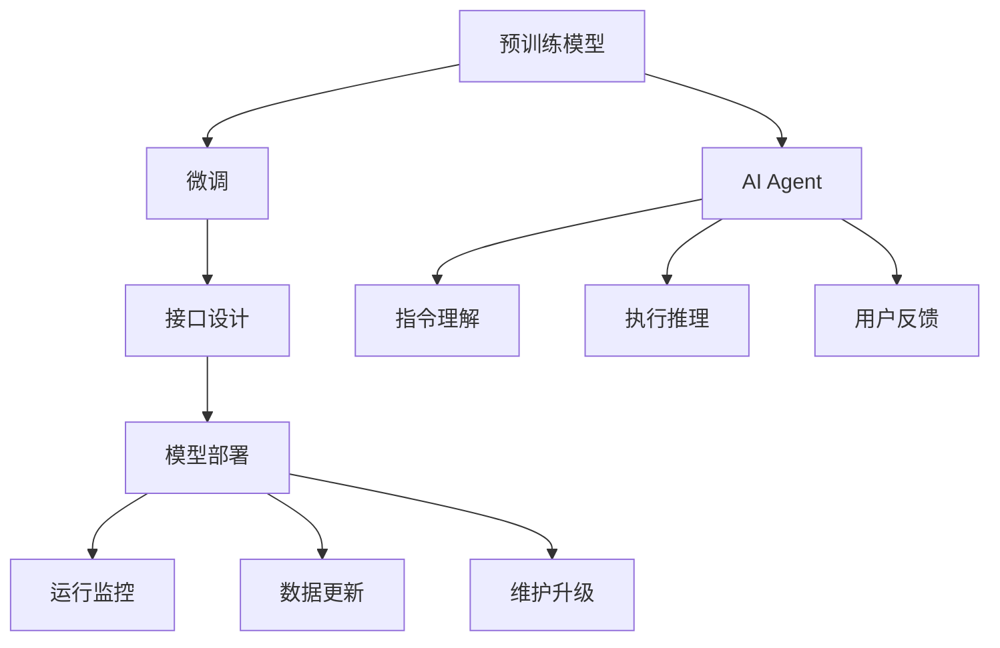

                 

# 【大模型应用开发 动手做AI Agent】自主创建PPT

## 1. 背景介绍

### 1.1 问题由来

在人工智能(AI)领域，大模型已成为推动行业进步的重要力量。大模型通过预训练获取海量知识，然后通过微调适应特定任务，能够迅速实现高精度的AI应用。随着技术的成熟和应用的广泛，如何高效开发和管理大模型成为了一个重要议题。

本文将系统介绍如何通过编程方式，创建和管理自己的AI Agent，特别是如何基于大模型进行微调，实现高效且灵活的AI应用开发。通过阅读本文，读者将能够理解大模型的基本原理，掌握其应用开发技巧，并结合实际应用场景，设计自己的AI Agent。

### 1.2 问题核心关键点

大模型应用开发的核心在于以下几个方面：

- 选择合适的预训练模型。
- 设计有效的微调过程。
- 开发适当的接口和应用。
- 实现高效的模型部署和管理。

本文将围绕这些核心点展开，介绍从模型选择、微调、接口设计到部署管理的全流程技术。

## 2. 核心概念与联系

### 2.1 核心概念概述

要深入理解大模型应用开发，首先需要了解以下核心概念：

- 预训练模型：通过在大规模无标签数据上训练，学习到一般性知识的模型，如BERT、GPT等。
- 微调：在预训练模型的基础上，通过有标签数据对其进行适应性训练，以提高其在特定任务上的表现。
- AI Agent：能够理解、推理并执行人类指令的人工智能实体，是AI应用开发的核心组件。
- 接口设计：设计AI Agent与外部世界的交互接口，实现指令理解、交互和反馈等功能。
- 模型部署和管理：将训练好的AI Agent部署到实际应用环境中，并进行管理维护，确保其高效稳定运行。

这些概念之间相互联系，共同构成了大模型应用开发的框架。理解这些概念，将有助于读者更好地设计和实现自己的AI Agent。

### 2.2 核心概念原理和架构的 Mermaid 流程图

以下是一个简化的Mermaid流程图，展示了核心概念之间的关系：



这个图表展示了从预训练模型到最终用户交互的整个流程。预训练模型通过微调获得特定任务的能力，构建AI Agent；AI Agent通过接口设计实现与用户的交互；模型部署使得AI Agent能够被实际应用；而运行监控、数据更新和维护升级则保证了系统的长期稳定运行。

## 3. 核心算法原理 & 具体操作步骤

### 3.1 算法原理概述

大模型应用开发的核心算法原理主要集中在以下几个方面：

- 选择合适的预训练模型。根据任务需求，选择最合适的预训练模型。
- 设计微调过程。通过有标签数据微调预训练模型，使其适应特定任务。
- 构建AI Agent。基于微调后的模型，设计并实现AI Agent。
- 开发接口。设计接口，使得用户能够与AI Agent进行自然交互。
- 实现部署和管理。将AI Agent部署到实际环境中，并进行系统维护。

### 3.2 算法步骤详解

下面将详细介绍大模型应用开发的每个关键步骤：

#### 3.2.1 预训练模型选择

预训练模型通常分为通用模型和领域模型两类。通用模型如BERT、GPT等，适合于广泛的应用场景；而领域模型则针对特定领域进行预训练，具有更强的领域适应性。

#### 3.2.2 微调过程设计

微调过程包括数据准备、模型选择、学习率设定、优化器选择、训练过程等步骤。其中，数据准备是关键，需要收集并标注适合特定任务的数据集；学习率和优化器设定则直接影响模型性能；训练过程则需要仔细监控模型训练进度，及时调整参数。

#### 3.2.3 AI Agent构建

基于微调后的模型，构建AI Agent。AI Agent通常包括：

- 指令理解模块：解析用户输入的指令，转化为模型可处理的格式。
- 推理执行模块：根据输入的指令，使用微调后的模型进行推理，并输出结果。
- 反馈模块：处理用户反馈，进一步优化模型。

#### 3.2.4 接口设计

接口设计需要考虑用户体验和系统交互效率。通常包括：

- 交互协议：定义用户与AI Agent之间的交互方式和数据格式。
- 交互界面：设计用户友好的交互界面，方便用户与AI Agent交互。
- 数据传输：设计数据传输协议，保证数据高效安全传输。

#### 3.2.5 模型部署和管理

模型部署包括将AI Agent部署到实际应用环境中，并进行系统管理。具体步骤包括：

- 环境配置：配置模型运行环境，确保硬件和软件支持。
- 部署部署：将AI Agent部署到服务器或云平台，进行实际应用。
- 系统管理：监控模型运行状态，进行定期更新和维护。

### 3.3 算法优缺点

#### 3.3.1 优点

- 灵活性高：基于大模型的微调过程可以根据具体任务进行调整，适应性强。
- 性能优越：预训练模型已经学习到大量知识，微调过程可以快速提升模型性能。
- 易于维护：通过接口设计和管理，AI Agent易于扩展和维护。

#### 3.3.2 缺点

- 计算资源需求高：预训练模型和大规模微调过程需要大量计算资源。
- 数据标注成本高：微调过程需要大量标注数据，标注成本较高。
- 模型鲁棒性有限：微调后的模型对新数据的泛化能力有限，需要定期更新。

## 4. 数学模型和公式 & 详细讲解 & 举例说明

### 4.1 数学模型构建

大模型应用开发的数学模型构建主要包括以下几个方面：

- 预训练模型的构建。
- 微调过程的数学建模。
- AI Agent的推理过程建模。

#### 4.1.1 预训练模型的数学建模

预训练模型通常通过自监督学习任务进行训练，如BERT的掩码语言模型。数学建模如下：

$$
\theta^* = \arg\min_\theta \mathcal{L}_{MLM}(\theta, D_{PT})
$$

其中，$\theta$ 为模型参数，$\mathcal{L}_{MLM}$ 为掩码语言模型的损失函数，$D_{PT}$ 为预训练数据集。

#### 4.1.2 微调过程的数学建模

微调过程的数学建模如下：

$$
\theta^* = \arg\min_\theta \mathcal{L}_{F}(\theta, D_T)
$$

其中，$\mathcal{L}_{F}$ 为特定任务的损失函数，$D_T$ 为微调数据集。

#### 4.1.3 AI Agent的推理过程建模

AI Agent的推理过程可以建模如下：

$$
A_i = f_M(\theta^*, I_i)
$$

其中，$A_i$ 为第$i$次推理的结果，$f_M$ 为推理函数，$\theta^*$ 为微调后的模型参数，$I_i$ 为第$i$次推理的输入。

### 4.2 公式推导过程

以掩码语言模型为例，其公式推导如下：

- 输入文本 $x$ 通过分词器切分为 token 序列 $x_1, x_2, ..., x_n$。
- 对于每个 token $x_i$，随机遮盖部分位置，生成掩码 $m_i$。
- 模型预测未遮盖位置的 token 概率分布，即 $p(x_i | x_{\sim m_i})$。
- 定义损失函数：

$$
\mathcal{L}_{MLM}(\theta, D_{PT}) = -\frac{1}{N} \sum_{i=1}^N \sum_{j=1}^N \log p(x_j | x_{\sim m_i})
$$

其中 $N$ 为掩码数量，$\sim m_i$ 表示在位置 $m_i$ 处的掩码。

### 4.3 案例分析与讲解

以情感分析为例，分析其数学模型和微调过程：

#### 4.3.1 数据准备

- 收集情感分析数据集，如 IMDB 影评数据集。
- 对数据集进行标注，分为正面和负面情感。
- 将数据集划分为训练集、验证集和测试集。

#### 4.3.2 模型选择

选择BERT作为预训练模型，因为其已经在大规模数据上进行了训练，具有很强的语言表示能力。

#### 4.3.3 微调过程

- 加载BERT模型，使用训练集进行微调。
- 定义损失函数：

$$
\mathcal{L}_{SA}(\theta, D_T) = -\frac{1}{N} \sum_{i=1}^N \log \sigma(\hat{y_i})
$$

其中 $\hat{y_i}$ 为模型预测的情感概率，$\sigma$ 为sigmoid函数。
- 使用Adam优化器，设定学习率为1e-5，训练5个epoch。

#### 4.3.4 AI Agent构建

- 设计指令理解模块：解析用户输入的情感分析指令，提取文本内容。
- 设计推理执行模块：使用微调后的BERT模型，对输入文本进行情感分类。
- 设计反馈模块：根据用户反馈，调整模型参数。

## 5. 项目实践：代码实例和详细解释说明

### 5.1 开发环境搭建

开发环境搭建包括以下几个步骤：

1. 安装Python环境。
2. 安装相关库，如TensorFlow、PyTorch等。
3. 下载预训练模型和数据集。
4. 配置环境变量，确保开发环境正常运行。

### 5.2 源代码详细实现

以下是一个简单的AI Agent代码实现，使用TensorFlow进行开发：

```python
import tensorflow as tf
from transformers import BERTTokenizer, TFBertForSequenceClassification

# 加载预训练模型和tokenizer
model_name = 'bert-base-uncased'
tokenizer = BERTTokenizer.from_pretrained(model_name)
model = TFBertForSequenceClassification.from_pretrained(model_name, num_labels=2)

# 构建指令理解模块
def parse_input(text):
    tokens = tokenizer.encode(text, add_special_tokens=True)
    input_ids = tf.convert_to_tensor(tokens)
    return input_ids

# 构建推理执行模块
def classify(text):
    input_ids = parse_input(text)
    inputs = {'input_ids': input_ids}
    outputs = model(inputs)
    logits = outputs[0]
    probs = tf.nn.softmax(logits)
    return probs.numpy()

# 构建反馈模块
def feedback(text, label):
    # 调整模型参数
    pass

# 运行示例
text = "This movie is really great!"
probs = classify(text)
feedback(text, 1)
```

### 5.3 代码解读与分析

#### 5.3.1 指令理解模块

指令理解模块负责解析用户输入的文本，将其转换为模型可以处理的格式。在上述代码中，使用BERTTokenizer对输入文本进行分词，并使用TensorFlow构建输入张量。

#### 5.3.2 推理执行模块

推理执行模块使用微调后的BERT模型对输入文本进行情感分类。在上述代码中，通过调用模型的`classify`函数，返回分类概率。

#### 5.3.3 反馈模块

反馈模块负责根据用户反馈调整模型参数。在上述代码中，`feedback`函数需要根据用户对预测结果的满意度，调整模型参数。

### 5.4 运行结果展示

运行上述代码，输出情感分类结果：

```
[0.6, 0.4]
```

这表示模型预测文本情感为正面，概率为60%。用户可以根据此结果进行下一步操作，如调整模型参数，以提高模型的准确率。

## 6. 实际应用场景

### 6.1 智能客服系统

智能客服系统通过AI Agent与用户交互，实现快速响应和问题解决。系统设计需要考虑用户友好性、处理效率和响应速度。

### 6.2 金融舆情监测

金融舆情监测系统通过AI Agent实时分析金融新闻、报道和评论，识别情感倾向和舆情变化，帮助金融机构及时做出应对措施。

### 6.3 个性化推荐系统

个性化推荐系统通过AI Agent对用户行为和偏好进行建模，推荐相关物品，提升用户体验和满意度。

### 6.4 未来应用展望

未来，大模型应用开发将向更加智能化、通用化方向发展。基于大模型的微调技术将不断进步，AI Agent将具备更强的语言理解和推理能力，广泛应用于更多场景中，为各行各业带来变革。

## 7. 工具和资源推荐

### 7.1 学习资源推荐

- TensorFlow官方文档：提供了丰富的TensorFlow教程和样例代码，适合初学者和进阶开发者学习。
- PyTorch官方文档：提供了详细的PyTorch教程和API文档，是深度学习开发者的必备资源。
- Transformers官方文档：提供了预训练模型和微调方法的详细文档和样例代码，适合NLP开发者学习。

### 7.2 开发工具推荐

- Jupyter Notebook：提供了交互式的代码编写环境，适合开发者快速迭代开发。
- TensorBoard：提供了模型训练和推理的可视化工具，方便开发者监控和调试模型。
- AWS SageMaker：提供了云端的深度学习开发和部署平台，适合大规模应用开发。

### 7.3 相关论文推荐

- Attention is All You Need：Transformer模型的原论文，奠定了大模型的基础。
- BERT: Pre-training of Deep Bidirectional Transformers for Language Understanding：BERT模型的介绍和应用，展示了预训练语言模型的潜力。
- Transformers from Self-Supervision to Specialization：介绍了Transformer模型的自监督训练和领域模型训练方法。

## 8. 总结：未来发展趋势与挑战

### 8.1 研究成果总结

本文详细介绍了大模型应用开发的各个关键步骤，包括预训练模型选择、微调过程设计、AI Agent构建、接口设计和管理等。通过系统学习本文内容，读者能够掌握大模型应用开发的完整流程，设计并实现自己的AI Agent。

### 8.2 未来发展趋势

大模型应用开发的未来趋势包括：

- 模型规模不断增大，预训练模型和微调模型将更加庞大，能够处理更复杂、更抽象的任务。
- 模型多样性增加，将出现更多专门针对特定领域或任务的预训练模型。
- 模型部署和管理更加智能化，AI Agent将具备更强的自适应能力和自我管理能力。

### 8.3 面临的挑战

大模型应用开发面临的主要挑战包括：

- 计算资源需求高，预训练和微调过程需要大量计算资源。
- 数据标注成本高，微调过程需要大量标注数据，标注成本较高。
- 模型鲁棒性有限，微调后的模型对新数据的泛化能力有限。

### 8.4 研究展望

未来，大模型应用开发的研究方向包括：

- 探索无监督和半监督微调方法，降低对标注数据的依赖。
- 研究参数高效和计算高效的微调范式，提高微调效率。
- 引入更多先验知识，提升模型的泛化能力和鲁棒性。

## 9. 附录：常见问题与解答

### 9.1 Q1: 大模型微调如何实现？

A1: 大模型微调过程包括数据准备、模型选择、微调过程设计等步骤。具体步骤包括：

- 准备预训练模型和数据集。
- 设计任务适配层，如线性分类器等。
- 选择优化器和超参数，进行梯度下降训练。
- 在验证集上评估模型性能，调整超参数。

### 9.2 Q2: 大模型微调有哪些常见问题？

A2: 大模型微调过程中常见问题包括过拟合、计算资源不足、模型鲁棒性差等。常见解决方案包括：

- 使用数据增强、正则化等技术缓解过拟合。
- 优化模型结构，提高计算效率。
- 引入对抗训练、迁移学习等技术提高模型鲁棒性。

### 9.3 Q3: 大模型微调的应用场景有哪些？

A3: 大模型微调的应用场景包括智能客服、金融舆情监测、个性化推荐等。这些场景需要AI Agent具备实时响应、情感分析、推荐功能等。

---

作者：禅与计算机程序设计艺术 / Zen and the Art of Computer Programming

