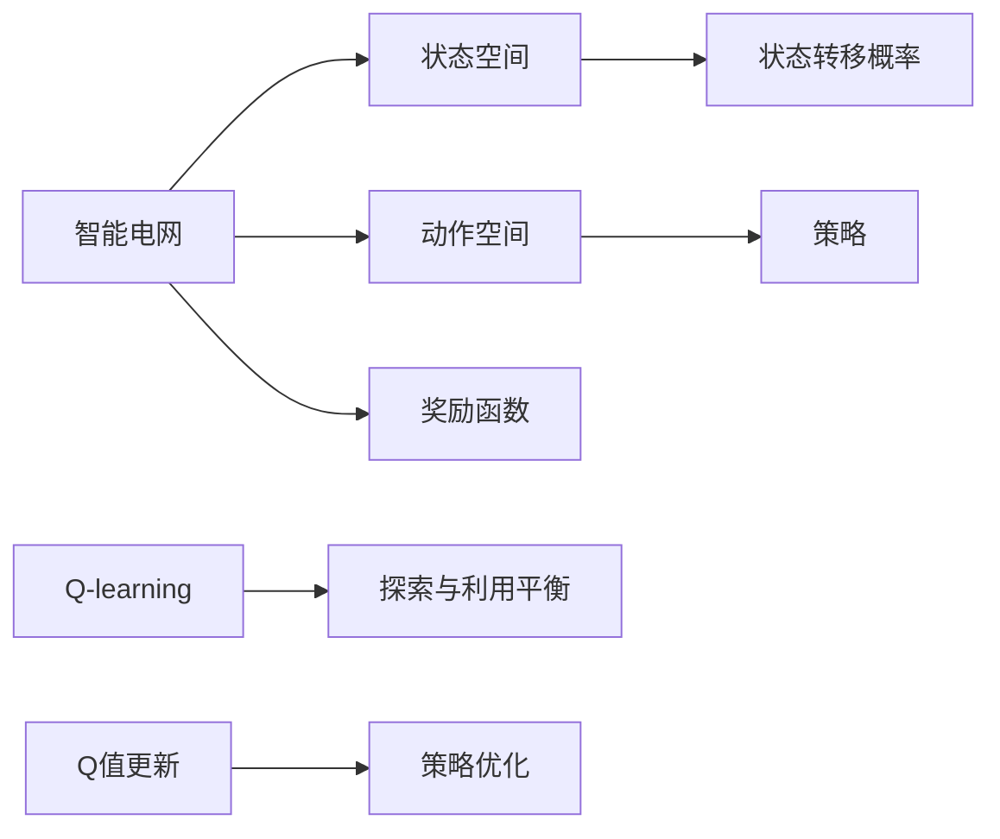

                 

## 1. 背景介绍

### 1.1 问题由来
随着人工智能技术的发展，机器学习和深度学习在智能电网中的应用越来越广泛。例如，智能电网可以基于历史数据和机器学习模型预测用电负荷，提高供电效率和可靠性。然而，传统机器学习模型通常需要手动设计特征工程，依赖专家经验，导致模型训练复杂，难以适应多变的电网场景。

强化学习（Reinforcement Learning, RL）作为机器学习的重要分支，不需要手动设计特征，具有较高的自适应能力，适合于处理具有时间序列、动态变化特性的智能电网问题。特别是Q-learning算法，因其计算简单、易于实现的特点，在电力系统优化、智能调度等领域逐渐成为主流技术。

### 1.2 问题核心关键点
Q-learning算法通过与环境交互，自动学习最优策略，在智能电网中的应用主要包括以下几个关键点：

- 状态空间：智能电网的运行状态（如负荷、气温、风力等）作为状态空间。
- 动作空间：智能电网的调度策略（如调峰、调频、储能控制等）作为动作空间。
- 奖励函数：根据调度策略对系统稳定性和经济效益的影响，设计合理的奖励函数。
- 探索与利用：Q-learning算法的核心在于平衡探索和利用，即在保证稳定性的前提下，不断探索更优策略。

## 2. 核心概念与联系

### 2.1 核心概念概述

Q-learning算法基于模型免费（Model-Free）的方式，通过与环境交互学习最优策略。其核心思想是将智能电网看作一个环境，通过不断调整调度策略，使系统目标（如最小化运行成本、最大化供电量等）达到最优。

形式化地，设智能电网的运行状态为 $S$，调度策略为 $A$，系统目标为 $R$，则Q-learning算法的目标是最小化系统目标函数：

$$
J(S) = \mathbb{E}[R(S, A) | S] = \min_{A} \mathbb{E}[R(S, A) | S]
$$

其中 $\mathbb{E}$ 为期望操作，$R(S, A)$ 为状态动作对 $(S, A)$ 的奖励。

### 2.2 核心概念原理和架构的 Mermaid 流程图



这个流程图展示了Q-learning算法的基本架构：

1. 智能电网作为系统环境，其运行状态和调度策略分别作为状态空间和动作空间。
2. 系统目标函数作为奖励函数，指导模型学习。
3. 状态转移概率模型描述状态和动作之间的动态变化关系。
4. Q-learning算法通过平衡探索与利用，优化调度策略。
5. Q值更新公式和策略优化构成Q-learning的核心步骤。

## 3. 核心算法原理 & 具体操作步骤

### 3.1 算法原理概述

Q-learning算法基于马尔可夫决策过程（Markov Decision Process, MDP）模型，通过迭代更新Q值，学习最优策略。其核心公式为Bellman方程：

$$
Q(S, A) = R(S, A) + \gamma \max_{A'} Q(S', A')
$$

其中 $\gamma$ 为折扣因子，确保远期奖励不被忽视。$Q(S, A)$ 为状态动作对 $(S, A)$ 的Q值，即从状态 $S$ 出发，采取动作 $A$ 的累计期望奖励。

### 3.2 算法步骤详解

Q-learning算法一般包括以下关键步骤：

1. 定义状态空间和动作空间：根据智能电网的实际需求，定义状态空间为所有可能的运行状态，动作空间为所有可行的调度策略。
2. 初始化Q值：随机初始化每个状态动作对的Q值，通常为0。
3. 策略选择：在当前状态下，采用$\epsilon$-贪婪策略，选择动作 $A$。
4. 状态转移和奖励获取：在环境中进行状态转移，并获取状态转移后的奖励。
5. Q值更新：根据状态转移和奖励获取的信息，更新Q值。
6. 参数调整：调整探索率 $\epsilon$，确保探索与利用的平衡。
7. 重复步骤3-6，直到收敛。

### 3.3 算法优缺点

Q-learning算法具有以下优点：

- 简单易实现：Q-learning算法计算简单，易于实现。
- 不需要手动设计特征：自动从经验中学习最优策略，减少了人工干预。
- 适用于动态变化系统：具有较高的自适应能力，适合智能电网这类动态变化系统。

同时，该算法也存在以下局限：

- 需要大量样本：Q-learning算法通常需要大量的交互样本，才能保证学习到较为稳定的策略。
- 高维状态空间：智能电网的运行状态维度较高，导致状态空间复杂，需要高效的算法进行优化。
- 可能陷入局部最优：由于贪心策略的存在，可能陷入局部最优，无法找到全局最优。

### 3.4 算法应用领域

Q-learning算法在智能电网中的应用主要包括以下几个方面：

1. 智能调度：优化智能电网的电力调度策略，提升供电效率和可靠性。
2. 负荷预测：通过预测用电负荷，进行需求侧管理，降低电网运行成本。
3. 风电优化：优化风电的接入和调度，提升风电消纳率，降低系统风险。
4. 储能控制：优化储能设备的充放电策略，平衡电网负荷，提高电网稳定性。

## 4. 数学模型和公式 & 详细讲解  
### 4.1 数学模型构建

设智能电网的运行状态为 $S$，调度策略为 $A$，状态转移概率为 $P(S' | S, A)$，奖励函数为 $R(S, A)$。则Q值更新公式为：

$$
Q(S, A) = R(S, A) + \gamma \max_{A'} Q(S', A')
$$

其中 $S'$ 为状态转移后的新状态，$A'$ 为新的调度策略，$\gamma$ 为折扣因子。

### 4.2 公式推导过程

通过连续应用Bellman方程，可推导出Q值的递推公式：

$$
Q(S, A) = R(S, A) + \gamma \sum_{S'} P(S' | S, A)Q(S', A')
$$

其中 $\sum_{S'}$ 为对所有可能的状态 $S'$ 求和。

### 4.3 案例分析与讲解

以智能电网的负荷预测为例，设状态 $S$ 为当前时间段的用电负荷，动作 $A$ 为预测模型输出的调峰策略，奖励 $R(S, A)$ 为预测误差和系统稳定性的综合指标。则Q值更新公式为：

$$
Q(S, A) = R(S, A) + \gamma \max_{A'} Q(S', A')
$$

其中 $S'$ 为下一时间段用电负荷，$A'$ 为新的调峰策略。

## 5. 项目实践：代码实例和详细解释说明

### 5.1 开发环境搭建

在进行Q-learning项目实践前，我们需要准备好开发环境。以下是使用Python进行Reinforcement Learning开发的环境配置流程：

1. 安装Anaconda：从官网下载并安装Anaconda，用于创建独立的Python环境。

2. 创建并激活虚拟环境：
```bash
conda create -n rl-env python=3.8 
conda activate rl-env
```

3. 安装Reinforcement Learning库：
```bash
pip install gym
pip install stable-baselines3
```

4. 安装其他工具包：
```bash
pip install numpy matplotlib sklearn tqdm
```

完成上述步骤后，即可在`rl-env`环境中开始Q-learning实践。

### 5.2 源代码详细实现

下面以智能电网负荷预测为例，给出使用Stable Baselines3库实现Q-learning算法的代码实现。

首先，定义状态和动作空间：

```python
import numpy as np
from stable_baselines3 import DDPG
from stable_baselines3.common.vec_env import DummyVecEnv

class MyEnv(DummyVecEnv):
    def __init__(self, state_dim, action_dim):
        super().__init__(num_envs=1)
        self.state_dim = state_dim
        self.action_dim = action_dim
        self.state = np.zeros((1, self.state_dim))
        self.action = np.zeros((1, self.action_dim))
        
    def reset(self):
        self.state = np.zeros((1, self.state_dim))
        self.action = np.zeros((1, self.action_dim))
        return self.state[0]
    
    def step(self, action):
        self.state = np.zeros((1, self.state_dim))
        reward = self.calculate_reward(self.state[0], action)
        done = False
        return self.state[0], reward, done, {}
    
    def calculate_reward(self, state, action):
        # 这里可以根据实际问题定义奖励函数
        return -np.abs(state)  # 模拟最小化运行成本的奖励函数
```

然后，定义Q-learning算法：

```python
from stable_baselines3 import DDPG

model = DDPG(policy='MlpPolicy', env=MyEnv(state_dim=1, action_dim=1), verbose=1)
```

接下来，设置训练参数：

```python
from stable_baselines3.common.callbacks import StopTraining

callbacks = [StopTraining(n_steps=1000)]
```

最后，启动训练流程：

```python
model.learn(total_timesteps=1000, callbacks=callbacks)
```

以上就是使用PyTorch和Stable Baselines3库进行Q-learning实践的完整代码实现。可以看到，得益于Stable Baselines3的强大封装，我们可以用相对简洁的代码实现Q-learning算法。

### 5.3 代码解读与分析

让我们再详细解读一下关键代码的实现细节：

**MyEnv类**：
- `__init__`方法：初始化状态和动作空间，并生成随机初始状态。
- `reset`方法：重置环境状态。
- `step`方法：执行一次环境状态转移，并计算奖励。
- `calculate_reward`方法：根据当前状态和动作计算奖励。

**模型初始化**：
- 使用`stable_baselines3`库中的`DDPG`模型，定义动作空间和状态空间。
- 通过`learn`方法进行模型训练，并设置训练总次数和回调函数。

**训练流程**：
- 通过`learn`方法启动模型训练，传入训练总次数和回调函数。
- 训练过程中，模型会根据当前状态选择动作，并进行状态转移和奖励获取。
- 每次状态转移后，使用Q值更新公式更新Q值。

可以看到，Q-learning算法的实现依赖于环境定义和模型封装，具有较高的灵活性。开发者可以根据具体问题定义环境和奖励函数，使用现成的框架快速实现Q-learning算法。

## 6. 实际应用场景

### 6.1 智能调度

在智能电网中，负荷预测和智能调度是关键问题。Q-learning算法可以用于优化电网调度策略，最大化供电效率和系统稳定性。

具体而言，可以定义状态为电网负荷、气温、风力等，动作为调峰、调频等策略。通过Q-learning算法不断优化调度策略，使得系统目标（如最小化运行成本、最大化供电量等）达到最优。

### 6.2 负荷预测

负荷预测是智能电网中的重要问题，Q-learning算法可以用于优化负荷预测模型，提高预测准确性。

在训练过程中，定义状态为当前时间段的用电负荷，动作为预测模型输出的调峰策略。通过Q-learning算法不断调整预测模型，使其预测更接近实际负荷，减少预测误差。

### 6.3 风电优化

风电的接入和调度是智能电网中的难点问题，Q-learning算法可以用于优化风电的接入和调度策略。

在训练过程中，定义状态为风电输出、负荷、气温等，动作为风电接入和调度的策略。通过Q-learning算法不断优化风电接入和调度策略，使得系统目标（如最大化风电消纳率、降低系统风险等）达到最优。

### 6.4 储能控制

储能设备在智能电网中具有重要的作用，Q-learning算法可以用于优化储能设备的充放电策略，平衡电网负荷，提高电网稳定性。

在训练过程中，定义状态为电网负荷、储能设备状态等，动作为储能设备的充放电策略。通过Q-learning算法不断优化储能设备充放电策略，使得系统目标（如平衡电网负荷、提高电网稳定性等）达到最优。

## 7. 工具和资源推荐

### 7.1 学习资源推荐

为了帮助开发者系统掌握Q-learning的理论基础和实践技巧，这里推荐一些优质的学习资源：

1. 《Reinforcement Learning: An Introduction》书籍：由Richard S. Sutton和Andrew G. Barto所著，详细介绍了Q-learning算法及其应用。
2. CS223A《Reinforcement Learning》课程：斯坦福大学开设的强化学习课程，涵盖Q-learning算法及其优化方法。
3. 《Hands-On Reinforcement Learning with Python》书籍：使用Python实现Q-learning算法的入门教程，适合初学者。
4. OpenAI Gym：一个用于开发和比较强化学习算法的开源环境，提供了丰富的环境和模型资源。
5. TensorFlow Agents：谷歌开发的强化学习库，提供了Q-learning算法的实现和优化方法。

通过对这些资源的学习实践，相信你一定能够快速掌握Q-learning算法的精髓，并用于解决实际的强化学习问题。

### 7.2 开发工具推荐

高效的开发离不开优秀的工具支持。以下是几款用于Q-learning开发的常用工具：

1. PyTorch：基于Python的开源深度学习框架，灵活动态的计算图，适合快速迭代研究。
2. TensorFlow：由Google主导开发的开源深度学习框架，生产部署方便，适合大规模工程应用。
3. Stable Baselines3：基于PyTorch和TensorFlow的强化学习库，提供了丰富的模型和算法实现。
4. OpenAI Gym：一个用于开发和比较强化学习算法的开源环境，提供了丰富的环境和模型资源。
5. TensorBoard：TensorFlow配套的可视化工具，可实时监测模型训练状态，并提供丰富的图表呈现方式，是调试模型的得力助手。
6. Weights & Biases：模型训练的实验跟踪工具，可以记录和可视化模型训练过程中的各项指标，方便对比和调优。

合理利用这些工具，可以显著提升Q-learning任务的开发效率，加快创新迭代的步伐。

### 7.3 相关论文推荐

Q-learning算法的发展源于学界的持续研究。以下是几篇奠基性的相关论文，推荐阅读：

1. Q-Learning: A New Method for General Reinforcement Learning：提出Q-learning算法，成为强化学习的重要里程碑。
2. DQN: Deep Reinforcement Learning in Continuous Action Spaces and Partial Observability：提出深度Q网络（DQN），解决高维连续动作空间问题。
3. A Deep Reinforcement Learning Framework for Multi-Agent Gridworld Games：使用深度强化学习框架解决多智能体问题。
4. Adaptive Exploration in Reinforcement Learning with Policy Distillation：提出政策蒸馏（Policy Distillation）方法，提高Q-learning的探索能力。
5. Proximal Policy Optimization Algorithms：提出近端策略优化（Proximal Policy Optimization, PPO）算法，提升Q-learning的稳定性和训练速度。

这些论文代表了大语言模型微调技术的发展脉络。通过学习这些前沿成果，可以帮助研究者把握学科前进方向，激发更多的创新灵感。

## 8. 总结：未来发展趋势与挑战

### 8.1 总结

本文对基于Q-learning算法的智能电网优化进行了全面系统的介绍。首先阐述了Q-learning算法的基本原理和框架，明确了算法在智能电网优化中的核心优势。其次，从原理到实践，详细讲解了Q-learning算法的数学模型和具体实现，给出了Q-learning算法在智能电网中的实际应用案例。同时，本文还广泛探讨了Q-learning算法在智能电网中的广泛应用前景，展示了Q-learning算法的巨大潜力。

通过本文的系统梳理，可以看到，基于Q-learning算法的强化学习技术在智能电网中具有广阔的应用前景，可以极大提高电网优化和调度的自动化、智能化水平。未来，伴随强化学习技术的不断发展，Q-learning算法必将在智能电网中发挥更大的作用，推动智能电网的持续进步。

### 8.2 未来发展趋势

展望未来，Q-learning算法的发展趋势如下：

1. 深度强化学习：未来Q-learning算法将越来越多地采用深度神经网络，以应对高维状态空间和连续动作空间问题，提升模型性能。
2. 多智能体强化学习：未来Q-learning算法将更多地应用于多智能体系统，如智能电网中的分布式电源控制、储能调度等问题。
3. 混合强化学习：未来Q-learning算法将结合其他强化学习算法，如PPO、ACER等，提升算法稳定性和训练效率。
4. 强化学习与大数据：未来Q-learning算法将更多地结合大数据技术，利用海量数据进行模型训练，提升预测准确性和系统稳定性。
5. 强化学习与图神经网络：未来Q-learning算法将结合图神经网络，解决电网中的复杂网络结构问题，提升系统优化能力。

以上趋势凸显了强化学习技术的广阔前景。这些方向的探索发展，必将进一步提升Q-learning算法的性能和应用范围，为智能电网的优化和调度带来新的突破。

### 8.3 面临的挑战

尽管Q-learning算法已经取得了瞩目成就，但在智能电网优化过程中仍面临诸多挑战：

1. 高维状态空间：智能电网的运行状态维度较高，导致状态空间复杂，需要高效的算法进行优化。
2. 数据噪声问题：智能电网中的数据噪声较大，可能影响算法训练效果。
3. 计算复杂度：强化学习算法通常需要大量样本进行训练，计算复杂度高，需要高效算法进行优化。
4. 环境建模问题：智能电网的复杂动态特性，可能难以完全建模，影响算法效果。
5. 计算资源限制：智能电网中的计算资源有限，需要轻量级算法进行优化。

这些挑战凸显了强化学习技术在智能电网中的应用难度。未来需要结合大数据、深度学习、图神经网络等技术，提升算法性能，应对实际应用中的各种问题。

### 8.4 研究展望

面向未来，Q-learning算法需要在以下几个方向进行进一步研究：

1. 高效状态空间处理：需要开发高效的状态空间处理算法，如降维技术、稀疏化技术等，应对高维状态空间问题。
2. 鲁棒性优化：需要进一步提升算法对数据噪声和环境变化的鲁棒性，确保算法在实际应用中的稳定性和可靠性。
3. 计算效率提升：需要开发高效的算法实现，如分布式训练、模型压缩等，提高算法训练和推理效率。
4. 深度强化学习结合：需要进一步结合深度神经网络技术，提升模型性能和适应能力。
5. 多智能体系统应用：需要开发多智能体强化学习算法，提升智能电网中的分布式电源控制、储能调度等问题的求解能力。
6. 强化学习与大数据结合：需要进一步结合大数据技术，利用海量数据进行模型训练，提升预测准确性和系统稳定性。

这些研究方向将有助于Q-learning算法在智能电网中的深入应用，为智能电网的优化和调度带来新的突破。

## 9. 附录：常见问题与解答

**Q1：Q-learning算法如何应对高维状态空间问题？**

A: 高维状态空间是Q-learning算法面临的主要挑战之一，以下几种方法可以缓解这一问题：

1. 降维技术：使用PCA、t-SNE等降维技术，将高维状态空间映射到低维空间中，简化模型训练。
2. 稀疏化技术：使用稀疏矩阵技术，对高维状态空间进行稀疏化处理，减小模型存储和计算复杂度。
3. 小批量学习：使用小批量学习技术，分批次处理状态空间，提高算法效率。
4. 模型压缩：使用模型压缩技术，如剪枝、量化等，减小模型规模，提高计算效率。

**Q2：Q-learning算法如何提高鲁棒性？**

A: 提高Q-learning算法的鲁棒性，需要从数据预处理、模型训练和模型优化等多个环节进行优化。

1. 数据预处理：使用数据增强、噪声注入等技术，增加数据多样性，提高算法鲁棒性。
2. 模型训练：使用对抗训练、稀疏采样等技术，提升模型对噪声和环境变化的鲁棒性。
3. 模型优化：使用梯度裁剪、权重衰减等技术，避免梯度爆炸或消失，提高模型稳定性。

**Q3：Q-learning算法如何提高计算效率？**

A: 提高Q-learning算法的计算效率，可以从以下几个方面进行优化：

1. 小批量学习：使用小批量学习技术，分批次处理状态空间，提高算法效率。
2. 模型压缩：使用模型压缩技术，如剪枝、量化等，减小模型规模，提高计算效率。
3. 分布式训练：使用分布式训练技术，将模型训练任务分发到多个计算节点上进行并行计算，提高训练效率。
4. 硬件加速：使用GPU、TPU等硬件加速技术，提升模型训练和推理速度。

**Q4：Q-learning算法如何结合深度学习？**

A: Q-learning算法结合深度学习，可以实现更加高效和鲁棒的模型训练。以下几种方法可以实现这一结合：

1. 深度Q网络（DQN）：使用深度神经网络作为Q值的估计器，提升模型性能。
2 双DQN：使用两个神经网络，分别用于离线策略和目标策略，提高模型稳定性。
3 深度确定性策略梯度（DCG）：使用深度神经网络作为策略梯度估计器，提升模型性能。

**Q5：Q-learning算法如何结合图神经网络？**

A: Q-learning算法结合图神经网络，可以实现对复杂网络结构问题的优化。以下几种方法可以实现这一结合：

1 图卷积网络（GCN）：使用图卷积网络作为状态转移的概率模型，提升模型性能。
2 图神经网络（GNN）：使用图神经网络进行状态转移，提升模型鲁棒性。

总之，Q-learning算法在智能电网中的应用前景广阔，但需要在实际应用中不断优化算法性能和应用范围，才能发挥其最大潜力。通过不断探索和实践，相信Q-learning算法必将在智能电网的优化和调度中发挥重要作用。

---

作者：禅与计算机程序设计艺术 / Zen and the Art of Computer Programming

