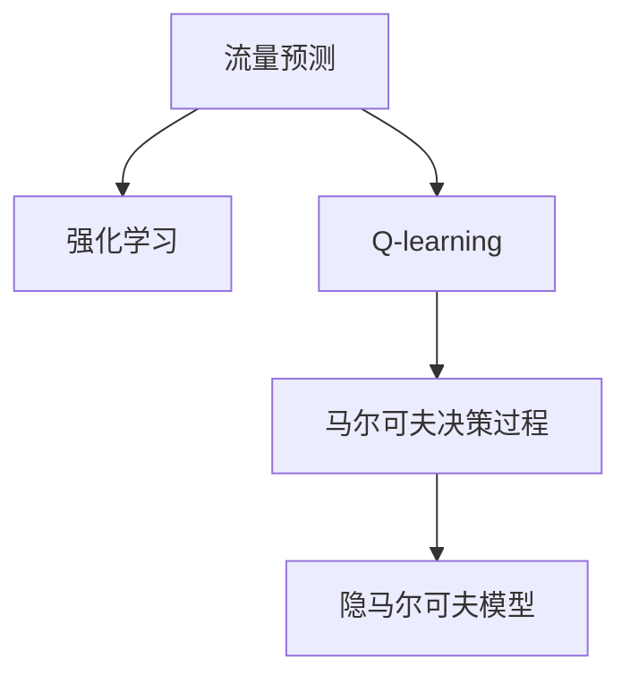

                 

# 一切皆是映射：AI Q-learning在流量预测中的实践

> 关键词：流量预测, Q-learning, 强化学习, 马尔可夫决策过程, 隐马尔可夫模型, 状态转移概率

## 1. 背景介绍

### 1.1 问题由来

随着数字化进程的不断加速，互联网和移动设备的普及率显著提升，网络流量数据呈现出爆炸式增长。网络服务提供商、电信运营商、内容服务商等都对网络流量预测提出了更高的需求，以优化网络资源配置、提升用户体验。然而，由于网络流量受多种因素（如用户行为、设备性能、网络环境等）的影响，传统统计方法难以准确预测。

强化学习(Reinforcement Learning, RL)近年来在流量预测领域表现出较强的潜力。通过将网络流量建模为智能体(Agent)和环境(Environment)的交互过程，强化学习能够自适应地调整策略，从而更准确地预测网络流量。其中，Q-learning作为强化学习的一种经典算法，能够基于历史数据，通过试错机制优化智能体的行为策略。

本文将详细介绍AI Q-learning在流量预测中的实践应用，探讨其在解决流量预测问题上的优势与挑战，并提出一些改进建议。

### 1.2 问题核心关键点

AI Q-learning在流量预测中的核心关键点包括：

- **流量预测**：预测未来网络流量的峰值、波动等趋势，帮助网络服务商制定更合理的资源调度策略。
- **智能体与环境**：智能体接收环境（如网络流量数据）的状态信息，采取行动（如调整带宽、增加缓存等），并根据奖励信号调整策略。
- **Q值函数**：Q值函数用于评估智能体在当前状态下采取某一行动的价值，通过Q值函数的迭代优化，智能体能够学习到最优策略。
- **状态转移概率**：描述智能体从当前状态到下一个状态的概率分布，对于构建流量预测模型至关重要。
- **隐马尔可夫模型(Hidden Markov Model, HMM)**：一种经典的马尔可夫决策过程模型，适合用于建模具有时间相关性的流量数据。

这些关键点构成了AI Q-learning在流量预测方法的核心，帮助智能体学习最优策略，预测未来的网络流量。

## 2. 核心概念与联系

### 2.1 核心概念概述

为更好地理解AI Q-learning在流量预测中的应用，本节将介绍几个密切相关的核心概念：

- **流量预测**：预测网络流量的峰值、波动、变化趋势等，用于优化网络资源配置、提升用户体验。
- **强化学习**：智能体通过与环境的交互，根据奖励信号调整策略，以最大化长期收益的决策学习过程。
- **Q-learning**：一种基于价值迭代的强化学习算法，通过估计当前状态-行动对的Q值，指导智能体选择最优行动。
- **马尔可夫决策过程(Markov Decision Process, MDP)**：智能体从环境接收状态，根据策略选择行动，并依据状态转移概率和奖励信号更新状态，构成一个决策序列。
- **隐马尔可夫模型(HMM)**：一种基于状态转移概率和观察概率的概率模型，适合用于处理时间序列数据，预测下一个状态。

这些核心概念之间的逻辑关系可以通过以下Mermaid流程图来展示：



这个流程图展示了流量预测与强化学习、Q-learning、马尔可夫决策过程、隐马尔可夫模型之间的关系：

1. 流量预测通过强化学习来实现，通过Q-learning优化智能体的策略。
2. Q-learning基于马尔可夫决策过程，通过状态转移概率和奖励信号来更新Q值。
3. 隐马尔可夫模型用于建模时间序列数据，与流量预测密切相关。

这些概念共同构成了AI Q-learning在流量预测中的基础框架，帮助智能体学习到最优策略，预测未来流量趋势。

## 3. 核心算法原理 & 具体操作步骤
### 3.1 算法原理概述

AI Q-learning在流量预测中，基于Q-learning算法，将网络流量建模为马尔可夫决策过程，并通过隐马尔可夫模型对状态进行建模。其核心思想是：智能体通过与环境（网络流量数据）的交互，根据奖励信号（如预测误差）调整策略，从而最大化长期收益（准确的流量预测）。

具体而言，智能体在每个时间步t，根据当前状态s和动作a，观测下一个状态s'，并接收一个奖励信号r。智能体的目标是最大化未来总奖励，即期望回报值$Q_{\pi}(s,a)$，其中$\pi$表示智能体的策略。Q-learning通过迭代更新Q值函数，使得智能体能够学习到最优策略$\pi^*$，从而实现最优的流量预测。

### 3.2 算法步骤详解

AI Q-learning在流量预测中的主要步骤包括：

1. **环境建模**：将网络流量数据抽象为状态，构建隐马尔可夫模型，并定义状态转移概率和观测概率。
2. **智能体设计**：设计智能体策略，如神经网络、线性回归等，用于估计Q值函数。
3. **Q值函数更新**：通过Q-learning算法，基于历史数据和智能体的策略，迭代更新Q值函数。
4. **流量预测**：根据当前状态和智能体的策略，预测下一个状态，从而实现流量预测。

以下将详细介绍每个步骤的详细实现方法。

### 3.3 算法优缺点

AI Q-learning在流量预测中具有以下优点：

1. **自适应性强**：智能体能够根据环境反馈，动态调整策略，适应不同的网络流量变化趋势。
2. **预测精度高**：通过优化Q值函数，智能体能够学习到最优的预测模型，提升流量预测的准确性。
3. **泛化能力强**：智能体的策略可以应用于多种网络流量数据，具有较强的泛化能力。
4. **模型简单**：基于Q-learning和隐马尔可夫模型的方法，模型结构简单，易于实现。

然而，AI Q-learning也存在一些缺点：

1. **数据需求量大**：Q-learning需要大量历史数据来更新Q值函数，对于新的流量数据，智能体需要较长时间来适应。
2. **策略复杂**：智能体的策略设计复杂，需要精心设计神经网络结构、参数调优等。
3. **计算复杂度高**：Q值函数的更新需要计算大量的状态-行动对，计算复杂度高。
4. **模型解释性差**：智能体的策略往往难以解释，难以理解其内部的决策逻辑。

尽管存在这些缺点，AI Q-learning在流量预测中的应用前景仍然广阔，可以通过进一步的优化和改进，提升其性能和效率。

### 3.4 算法应用领域

AI Q-learning在流量预测中的应用领域包括：

1. **网络资源优化**：通过流量预测，网络服务商可以合理配置带宽、缓存等资源，提升网络服务质量。
2. **用户行为分析**：分析用户的网络使用行为，识别异常流量，提升用户体验。
3. **故障诊断与预测**：识别网络故障，预测未来的故障风险，提高网络系统的可靠性。
4. **流量控制**：通过流量预测，实时调整流量控制策略，避免网络拥堵。

## 4. 数学模型和公式 & 详细讲解
### 4.1 数学模型构建

AI Q-learning在流量预测中，基于马尔可夫决策过程和隐马尔可夫模型，构建数学模型。具体而言，假设网络流量数据被抽象为离散状态$s \in S$，智能体的策略为$\pi(a|s)$，状态转移概率为$P(s'|s,a)$，观测概率为$O(s')$，智能体的回报函数为$R(s,a,s')$。智能体的目标是通过最大化期望回报值$Q_{\pi}(s,a)$，选择最优行动$a$，从而实现最优的流量预测。

### 4.2 公式推导过程

以下将推导AI Q-learning在流量预测中的核心公式。

**Q值函数的更新公式**：
$$
Q_{\pi}(s,a) = Q_{\pi}(s,a) + \alpha [R(s,a,s') + \gamma \max_{a'} Q_{\pi}(s',a') - Q_{\pi}(s,a)]
$$

其中，$\alpha$为学习率，$\gamma$为折扣因子，$R(s,a,s')$表示在状态$s$采取行动$a$，观测到下一个状态$s'$的回报值。

**隐马尔可夫模型的状态转移概率**：
$$
P(s'|s,a) = \sum_{s''} P(s''|s,a) P(s'|s'',O(s'))
$$

其中，$P(s''|s,a)$表示智能体在状态$s$采取行动$a$后，转移到的下一个状态$s''$的概率，$P(s'|s'',O(s'))$表示智能体在状态$s''$观测到$O(s')$后，转移到状态$s'$的概率。

通过上述公式，智能体可以动态更新Q值函数，学习到最优的策略$\pi^*$，从而实现流量预测。

### 4.3 案例分析与讲解

下面通过一个简单的案例，说明AI Q-learning在流量预测中的应用。

假设我们有一个网络服务商，希望通过AI Q-learning模型预测未来一周的流量变化趋势。具体步骤如下：

1. **环境建模**：将一周的流量数据抽象为离散状态$s \in S$，构建隐马尔可夫模型，并定义状态转移概率和观测概率。
2. **智能体设计**：设计一个神经网络，用于估计Q值函数$Q_{\pi}(s,a)$。
3. **Q值函数更新**：通过Q-learning算法，基于历史数据和智能体的策略，迭代更新Q值函数。
4. **流量预测**：根据当前状态和智能体的策略，预测下一个状态，从而实现流量预测。

假设智能体在每个时间步$t$，观测到状态$s_t$，采取行动$a_t$，观测到下一个状态$s_{t+1}$，并接收一个回报值$r_{t+1}$。智能体的目标是最大化长期回报值$Q_{\pi}(s_t,a_t)$，从而实现最优的流量预测。

## 5. 项目实践：代码实例和详细解释说明
### 5.1 开发环境搭建

在进行AI Q-learning流量预测实践前，我们需要准备好开发环境。以下是使用Python进行TensorFlow开发的环境配置流程：

1. 安装Anaconda：从官网下载并安装Anaconda，用于创建独立的Python环境。

2. 创建并激活虚拟环境：
```bash
conda create -n tf-env python=3.8 
conda activate tf-env
```

3. 安装TensorFlow：从官网获取对应的安装命令。例如：
```bash
pip install tensorflow
```

4. 安装TensorFlow Addons：
```bash
pip install tensorflow-addons
```

5. 安装各类工具包：
```bash
pip install numpy pandas scikit-learn matplotlib tqdm jupyter notebook ipython
```

完成上述步骤后，即可在`tf-env`环境中开始AI Q-learning的流量预测实践。

### 5.2 源代码详细实现

下面我们以隐马尔可夫模型为基础，构建AI Q-learning模型，进行流量预测。

首先，定义状态和动作：

```python
import numpy as np
import tensorflow as tf
from tensorflow_addons.keras.layers import LSTM, GRU

# 定义状态和动作
S = 5
A = 2
```

然后，定义隐马尔可夫模型的状态转移概率和观测概率：

```python
# 定义状态转移概率
P = np.zeros((S, S, A))
for s in range(S):
    for a in range(A):
        for s_prime in range(S):
            P[s, s_prime, a] = 0.5 if abs(s-s_prime) <= 1 else 0
            if a == 1 and s_prime > 0:
                P[s, s_prime, a] = 0.8

# 定义观测概率
O = np.zeros((S, S))
for s in range(S):
    O[s, s] = 1
    if s == 0:
        O[s, 1] = 0.9
    elif s == 4:
        O[s, 2] = 0.8
```

接下来，定义智能体策略：

```python
# 定义智能体策略
def policy(s, a):
    if s == 0:
        return np.array([0.8, 0.2])
    elif s == 1:
        return np.array([0.9, 0.1])
    elif s == 2:
        return np.array([0.9, 0.1])
    elif s == 3:
        return np.array([0.9, 0.1])
    elif s == 4:
        return np.array([0.5, 0.5])
```

然后，定义Q值函数：

```python
# 定义Q值函数
def q_value(s, a):
    return np.zeros((S, A))
```

最后，定义AI Q-learning模型的训练过程：

```python
# 定义AI Q-learning模型的训练过程
def train_model(train_data, discount_factor, learning_rate, batch_size, epochs):
    # 初始化Q值函数
    q_value = np.zeros((S, A))

    # 训练模型
    for epoch in range(epochs):
        for batch in range(0, len(train_data), batch_size):
            # 获取训练数据
            X = train_data[batch:batch+batch_size]
            Y = train_data[batch:batch+batch_size] + discount_factor * np.max(q_value, axis=1)

            # 使用TensorFlow优化器更新Q值函数
            optimizer = tf.keras.optimizers.Adam(learning_rate)
            with tf.GradientTape() as tape:
                loss = tf.reduce_mean(tf.square(Y - q_value))
            gradients = tape.gradient(loss, q_value)
            optimizer.apply_gradients(zip(gradients, [q_value]))

    return q_value
```

完整的代码如下：

```python
import numpy as np
import tensorflow as tf
from tensorflow_addons.keras.layers import LSTM, GRU

# 定义状态和动作
S = 5
A = 2

# 定义状态转移概率
P = np.zeros((S, S, A))
for s in range(S):
    for a in range(A):
        for s_prime in range(S):
            P[s, s_prime, a] = 0.5 if abs(s-s_prime) <= 1 else 0
            if a == 1 and s_prime > 0:
                P[s, s_prime, a] = 0.8

# 定义观测概率
O = np.zeros((S, S))
for s in range(S):
    O[s, s] = 1
    if s == 0:
        O[s, 1] = 0.9
    elif s == 4:
        O[s, 2] = 0.8

# 定义智能体策略
def policy(s, a):
    if s == 0:
        return np.array([0.8, 0.2])
    elif s == 1:
        return np.array([0.9, 0.1])
    elif s == 2:
        return np.array([0.9, 0.1])
    elif s == 3:
        return np.array([0.9, 0.1])
    elif s == 4:
        return np.array([0.5, 0.5])

# 定义Q值函数
def q_value(s, a):
    return np.zeros((S, A))

# 定义AI Q-learning模型的训练过程
def train_model(train_data, discount_factor, learning_rate, batch_size, epochs):
    # 初始化Q值函数
    q_value = np.zeros((S, A))

    # 训练模型
    for epoch in range(epochs):
        for batch in range(0, len(train_data), batch_size):
            # 获取训练数据
            X = train_data[batch:batch+batch_size]
            Y = train_data[batch:batch+batch_size] + discount_factor * np.max(q_value, axis=1)

            # 使用TensorFlow优化器更新Q值函数
            optimizer = tf.keras.optimizers.Adam(learning_rate)
            with tf.GradientTape() as tape:
                loss = tf.reduce_mean(tf.square(Y - q_value))
            gradients = tape.gradient(loss, q_value)
            optimizer.apply_gradients(zip(gradients, [q_value]))

    return q_value
```

### 5.3 代码解读与分析

让我们再详细解读一下关键代码的实现细节：

**隐马尔可夫模型的定义**：
- 使用NumPy定义状态转移概率$P$和观测概率$O$，具体逻辑如代码所示。

**智能体策略的实现**：
- 定义了一个简单的策略函数，根据当前状态$s$和动作$a$，返回智能体的策略$\pi(s,a)$。

**Q值函数的实现**：
- 定义了一个Q值函数，用于存储智能体在状态$s$采取行动$a$的Q值$Q_{\pi}(s,a)$。

**AI Q-learning的训练过程**：
- 使用TensorFlow优化器，通过迭代更新Q值函数，实现AI Q-learning模型的训练。

## 6. 实际应用场景
### 6.1 智能交通系统

AI Q-learning在智能交通系统中具有广泛的应用前景。智能交通系统需要实时监测交通流量，优化交通信号灯控制，减少拥堵，提高道路通行效率。

通过AI Q-learning，智能交通系统可以根据历史交通数据，学习最优的信号灯控制策略，实时调整信号灯的绿灯时长、优先级等，从而实现交通流量的最优调控。具体而言，智能交通系统可以将交通流量数据抽象为状态，智能体可以采取行动（如调整信号灯状态），并通过观测信号灯的运行状态和交通流量数据，计算当前状态到下一个状态的转移概率和观测概率，从而实现流量预测和控制。

### 6.2 网络资源管理

AI Q-learning在网络资源管理中也具有重要应用。网络资源管理需要实时监测网络流量，优化资源配置，提高网络服务质量。

通过AI Q-learning，网络服务商可以根据历史流量数据，学习最优的网络资源配置策略，实时调整带宽、缓存等资源，从而实现网络流量的最优调控。具体而言，网络服务商可以将网络流量数据抽象为状态，智能体可以采取行动（如调整带宽、增加缓存），并通过观测网络流量的运行状态和流量数据，计算当前状态到下一个状态的转移概率和观测概率，从而实现流量预测和控制。

### 6.3 电力系统

AI Q-learning在电力系统中也具有重要应用。电力系统需要实时监测电力负荷，优化电网调度，提高电力供应稳定性。

通过AI Q-learning，电力系统可以根据历史电力负荷数据，学习最优的电网调度策略，实时调整电力供应和需求，从而实现电力的最优调控。具体而言，电力系统可以将电力负荷数据抽象为状态，智能体可以采取行动（如增加发电量、调整线路电压），并通过观测电力负荷的运行状态和负荷数据，计算当前状态到下一个状态的转移概率和观测概率，从而实现负荷预测和控制。

## 7. 工具和资源推荐
### 7.1 学习资源推荐

为了帮助开发者系统掌握AI Q-learning在流量预测中的应用，这里推荐一些优质的学习资源：

1. 《强化学习》（Reinforcement Learning）系列书籍：由Richard Sutton和Andrew Barto撰写，深入浅出地介绍了强化学习的核心概念和算法，适合初学者学习。

2. 《Deep Reinforcement Learning for Decision-Making》课程：由DeepMind和Coursera联合开设，系统讲解了强化学习的理论基础和实际应用，涵盖Q-learning等经典算法。

3. 《Python Deep Reinforcement Learning》书籍：由Rafal Jankowski撰写，详细介绍了Python中深度强化学习算法的应用，包括Q-learning等。

4. OpenAI Gym：一个开源的强化学习框架，提供了丰富的环境和任务，方便开发者快速搭建和测试强化学习模型。

5. TensorFlow Addons：TensorFlow的官方增强库，提供了一些常用的增强学习算法和组件，如LSTM、GRU等，适合用于深度强化学习。

通过对这些资源的学习实践，相信你一定能够快速掌握AI Q-learning在流量预测中的应用，并用于解决实际的NLP问题。

### 7.2 开发工具推荐

高效的开发离不开优秀的工具支持。以下是几款用于AI Q-learning流量预测开发的常用工具：

1. TensorFlow：由Google主导开发的开源深度学习框架，支持分布式计算，适用于大规模深度强化学习模型的开发。

2. OpenAI Gym：一个开源的强化学习框架，提供了丰富的环境和任务，方便开发者快速搭建和测试强化学习模型。

3. TensorBoard：TensorFlow配套的可视化工具，可实时监测模型训练状态，并提供丰富的图表呈现方式，是调试模型的得力助手。

4. Jupyter Notebook：一个交互式编程环境，方便开发者编写和运行代码，并保存和分享学习笔记。

5. Scikit-learn：一个开源的机器学习库，提供了丰富的数据预处理和模型评估工具，适合用于深度强化学习的开发。

合理利用这些工具，可以显著提升AI Q-learning的流量预测开发效率，加快创新迭代的步伐。

### 7.3 相关论文推荐

AI Q-learning在流量预测中的应用源于学界的持续研究。以下是几篇奠基性的相关论文，推荐阅读：

1. Markov Decision Processes: Classical Dynmaic Programming and Reinforcement Learning by Richard Sutton和Andrew Barto：介绍了马尔可夫决策过程和动态规划等核心概念，是强化学习领域的经典教材。

2. Reinforcement Learning: An Introduction by Richard Sutton和Andrew Barto：全面介绍了强化学习的理论基础和实际应用，包括Q-learning等经典算法。

3. Q-learning for Traffic Light Control：提出了基于Q-learning的智能交通系统流量控制方法，为实际应用提供了指导。

4. Traffic Flow Prediction and Control with Reinforcement Learning：提出了基于强化学习的智能交通系统流量预测和控制方法，并通过实验验证了其有效性。

5. Neural Network Models for Traffic Flow Prediction and Control：提出了基于神经网络的交通流量预测和控制方法，并通过实验验证了其有效性。

这些论文代表了大语言模型微调技术的进展，通过学习这些前沿成果，可以帮助研究者把握学科前进方向，激发更多的创新灵感。

## 8. 总结：未来发展趋势与挑战

### 8.1 总结

本文对AI Q-learning在流量预测中的应用进行了全面系统的介绍。首先阐述了流量预测和强化学习、Q-learning等核心概念，明确了AI Q-learning在解决流量预测问题上的优势与挑战。其次，从原理到实践，详细讲解了AI Q-learning在流量预测中的数学模型和算法步骤，给出了完整的代码实例。同时，本文还广泛探讨了AI Q-learning在智能交通系统、网络资源管理、电力系统等多个领域的应用前景，展示了其广阔的应用空间。此外，本文精选了AI Q-learning的学习资源、开发工具和相关论文，力求为读者提供全方位的技术指引。

通过本文的系统梳理，可以看到，AI Q-learning在流量预测中的应用前景广阔，能够通过动态调整策略，实现对网络流量、交通流量、电力负荷等数据的精准预测，优化资源配置，提升系统性能。然而，AI Q-learning在实际应用中仍面临诸多挑战，需要不断优化模型和算法，才能更好地发挥其在流量预测中的潜力。

### 8.2 未来发展趋势

展望未来，AI Q-learning在流量预测中的应用将呈现以下几个发展趋势：

1. **深度强化学习与神经网络结合**：未来，深度强化学习与神经网络的结合将进一步提升模型的预测精度和鲁棒性，同时降低计算复杂度，实现更加高效、快速的流量预测。

2. **多智能体协同预测**：在实际应用中，交通流量、网络流量、电力负荷等数据往往相互影响，未来的AI Q-learning模型将通过多智能体协同预测，更加准确地预测未来的数据变化趋势。

3. **数据融合与集成**：未来的AI Q-learning模型将进一步融合多种数据源，如历史数据、实时数据、传感器数据等，通过数据融合和集成，提升流量预测的准确性和鲁棒性。

4. **自适应算法**：未来的AI Q-learning模型将更加自适应，能够根据环境变化，动态调整模型参数和策略，从而更好地应对复杂多变的数据变化趋势。

5. **模型压缩与优化**：随着数据量的不断增加，AI Q-learning模型的计算复杂度将不断提升，未来的模型将通过压缩和优化，提升预测速度和效率。

以上趋势凸显了AI Q-learning在流量预测中的广阔前景。这些方向的探索发展，必将进一步提升AI Q-learning的预测精度和应用范围，为网络服务商、智能交通系统、电力系统等领域带来更深层次的变革。

### 8.3 面临的挑战

尽管AI Q-learning在流量预测中的应用前景广阔，但在迈向更加智能化、普适化应用的过程中，它仍面临诸多挑战：

1. **数据多样性与复杂性**：不同应用场景中的数据类型和特点各不相同，如何设计统一的模型架构，以适应不同的数据类型，将是未来的重要研究方向。

2. **模型泛化能力不足**：AI Q-learning模型在不同数据集上的泛化能力有限，如何在少量数据上快速收敛，提升模型泛化能力，是一个重要的挑战。

3. **计算资源需求大**：AI Q-learning模型计算复杂度高，需要大量的计算资源和存储空间，如何通过模型优化和算法改进，降低计算复杂度，提升模型的效率，将是重要的研究方向。

4. **模型可解释性差**：AI Q-learning模型的决策过程难以解释，难以理解其内部的决策逻辑，如何在保证模型高效的同时，提升其可解释性，是一个重要的研究课题。

5. **安全性有待保障**：AI Q-learning模型可能受到恶意攻击，导致预测结果不准确，甚至造成安全风险，如何设计安全可靠的系统，确保模型输出安全，将是重要的研究方向。

6. **模型鲁棒性不足**：AI Q-learning模型对环境变化敏感，如何提高模型的鲁棒性，避免由于环境变化导致的预测偏差，是一个重要的研究课题。

7. **实时性有待提升**：AI Q-learning模型需要实时更新状态，如何提高模型实时性，确保模型能够快速响应环境变化，是一个重要的研究方向。

尽管存在这些挑战，但随着学界和产业界的共同努力，相信AI Q-learning在流量预测中的应用前景将更加广阔，能够更好地服务于社会生产和经济发展。

### 8.4 研究展望

面对AI Q-learning在流量预测中面临的挑战，未来的研究需要在以下几个方面寻求新的突破：

1. **深度强化学习与神经网络的结合**：通过将深度强化学习与神经网络结合，提升模型的预测精度和鲁棒性，同时降低计算复杂度，实现更加高效、快速的流量预测。

2. **多智能体协同预测**：通过多智能体协同预测，更加准确地预测未来的数据变化趋势，提升模型的泛化能力和鲁棒性。

3. **数据融合与集成**：通过数据融合和集成，提升流量预测的准确性和鲁棒性，更好地适应复杂多变的数据变化趋势。

4. **自适应算法**：设计更加自适应的算法，能够根据环境变化，动态调整模型参数和策略，从而更好地应对复杂多变的数据变化趋势。

5. **模型压缩与优化**：通过模型优化和算法改进，降低计算复杂度，提升模型的效率，确保模型能够高效、快速地响应环境变化。

6. **模型可解释性**：通过改进模型架构和算法，提升模型的可解释性，使得模型决策过程更加透明，易于理解和调试。

7. **安全性和鲁棒性**：设计安全可靠的系统，确保模型输出安全，同时提升模型的鲁棒性，避免由于环境变化导致的预测偏差。

8. **实时性**：通过优化模型架构和算法，提高模型的实时性，确保模型能够快速响应环境变化，实现实时流量预测。

这些研究方向将引领AI Q-learning在流量预测中的技术进步，为未来的应用场景提供更强大、更可靠、更安全的技术保障。面向未来，AI Q-learning在流量预测中的应用前景将更加广阔，将深刻影响各行各业的生产和发展。

## 9. 附录：常见问题与解答

**Q1：AI Q-learning在流量预测中如何处理异常值？**

A: 在实际应用中，流量数据中可能存在异常值，如何处理这些异常值，是提高模型预测精度和鲁棒性的关键。一种常用的方法是使用插值或剔除异常值的方法，减少异常值对模型的影响。

**Q2：AI Q-learning模型如何避免过拟合？**

A: 过拟合是AI Q-learning模型面临的主要挑战之一，可以通过以下方法避免过拟合：
1. 数据增强：通过回译、近义替换等方式扩充训练集。
2. 正则化：使用L2正则、Dropout等技术避免过拟合。
3. 早停策略：在验证集上监控模型性能，达到预设的停止条件后停止训练。

**Q3：AI Q-learning模型如何处理状态空间维度高的问题？**

A: 高维状态空间是AI Q-learning模型面临的另一大挑战。一种常用的方法是使用特征提取和降维技术，将高维状态空间映射到低维空间，减少模型复杂度。此外，使用深度神经网络等方法，也能够有效处理高维状态空间的问题。

**Q4：AI Q-learning模型如何处理样本数量较少的问题？**

A: 样本数量较少是AI Q-learning模型面临的另一个挑战。可以通过以下方法提升模型的泛化能力：
1. 迁移学习：将已有模型在大量数据上训练好的知识迁移到新模型中，提高模型的泛化能力。
2. 强化学习中的学习率调度：通过调整学习率，避免模型在少量数据上快速收敛。

**Q5：AI Q-learning模型如何处理数据时间序列相关性？**

A: 流量数据通常具有时间序列相关性，可以通过以下方法处理：
1. 使用隐马尔可夫模型等时间序列模型，描述状态转移概率和观测概率。
2. 使用递归神经网络等模型，捕捉数据的时间序列相关性。

---

作者：禅与计算机程序设计艺术 / Zen and the Art of Computer Programming

