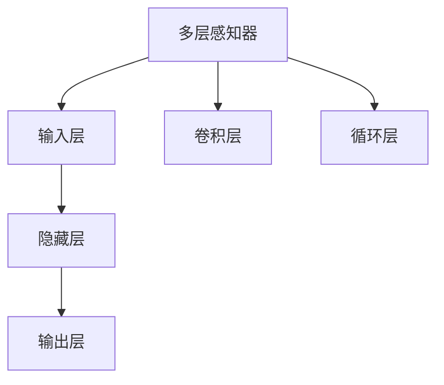

                 

## 1. 背景介绍

金融市场预测一直是金融业和学术界的重要研究领域。预测的准确性不仅关乎机构的盈利能力，还直接影响到投资者的投资决策。近年来，随着人工智能技术的迅猛发展，金融预测进入了AI驱动的新时代。AI通过学习和理解历史数据中的复杂关系，能够预测未来的市场趋势，提供有价值的投资建议。

金融预测的核心问题在于数据的处理和模型的选择。历史数据既包括量化的金融指标，如股价、交易量等，也包括非量化的信息，如新闻、公告等。传统的金融预测方法，如回归分析、时间序列模型等，往往需要手工提取特征，难以充分利用数据的多样性。而基于机器学习的金融预测，则能够自动挖掘数据中的隐藏关系，实现更为准确、高效的预测。

在AI预测金融市场中，深度学习尤其是神经网络模型已经成为了主流。神经网络模型通过多层非线性变换，可以捕获复杂数据关系，形成更为精细的预测。本文将从原理、实现到应用，全面介绍AI在金融市场预测中的应用，力求为金融从业者提供深度见解。

## 2. 核心概念与联系

### 2.1 核心概念概述

金融市场预测中常用的AI模型包括多层感知器、卷积神经网络、循环神经网络等。这些模型以历史数据为输入，通过多层非线性变换，预测未来的市场趋势。

- 多层感知器(Multilayer Perceptron, MLP)：基本神经网络结构，由输入层、隐藏层和输出层组成。
- 卷积神经网络(Convolutional Neural Network, CNN)：适用于图像数据的处理，也可用于时间序列数据的预测。
- 循环神经网络(Recurrent Neural Network, RNN)：适用于处理序列数据，如股票时间序列。

### 2.2 核心概念原理和架构的 Mermaid 流程图



这个流程图展示了三种主流神经网络模型的基本架构：

- 多层感知器(MLP)：由输入层、多个隐藏层和输出层组成。
- 卷积神经网络(CNN)：通过卷积层和池化层提取特征。
- 循环神经网络(RNN)：通过循环层捕捉时间序列中的依赖关系。

### 2.3 核心概念联系

以上三种模型虽然在架构和应用场景上有所不同，但它们都基于相似的原理：通过多层非线性变换，构建输入与输出之间的映射关系。映射关系是通过神经网络中的权重参数学习的，这些参数通过反向传播算法不断调整，最小化预测误差，从而优化模型的预测能力。

## 3. 核心算法原理 & 具体操作步骤

### 3.1 算法原理概述

AI在金融市场预测中主要采用监督学习的方法，即利用历史数据（输入）和市场价格（输出）之间的映射关系进行预测。具体步骤如下：

1. **数据准备**：收集历史市场数据，包括股价、交易量、新闻等。对数据进行预处理，如标准化、归一化等。
2. **模型构建**：选择合适的神经网络模型，如MLP、CNN、RNN等，并设置相应的超参数。
3. **模型训练**：将历史数据划分为训练集和验证集，使用训练集数据训练模型，并根据验证集数据调整超参数。
4. **模型评估**：在测试集上评估模型预测准确性，根据评估结果进一步优化模型。

### 3.2 算法步骤详解

**Step 1: 数据准备**

- **数据收集**：收集金融市场的历史数据，包括股票价格、交易量、新闻等。
- **数据清洗**：去除缺失值、异常值，进行数据标准化、归一化处理。
- **数据分割**：将数据划分为训练集、验证集和测试集。

**Step 2: 模型构建**

- **模型选择**：根据预测任务选择合适的神经网络模型，如MLP、CNN、RNN等。
- **超参数设置**：设置模型的超参数，如隐藏层数量、神经元个数、学习率等。
- **模型初始化**：随机初始化模型的权重参数。

**Step 3: 模型训练**

- **模型前向传播**：将训练数据输入模型，计算输出。
- **损失函数计算**：计算模型输出与真实值之间的误差，如均方误差、交叉熵等。
- **反向传播**：根据误差反传计算各层的梯度。
- **参数更新**：根据梯度更新模型参数，最小化损失函数。

**Step 4: 模型评估**

- **测试集评估**：在测试集上输入数据，计算模型预测值与真实值之间的误差。
- **性能优化**：根据评估结果，调整模型参数和超参数，进一步优化模型。

### 3.3 算法优缺点

**优点：**

- **自动特征提取**：神经网络模型能够自动学习数据中的特征，减少人工干预。
- **灵活性强**：能够适应不同类型的数据，如时间序列、图像等。
- **精度高**：通过多层非线性变换，能够构建复杂的预测模型。

**缺点：**

- **模型复杂度高**：神经网络模型参数多，训练复杂。
- **过拟合风险高**：需要大量数据进行训练，防止过拟合。
- **解释性差**：模型的内部工作机制复杂，难以解释。

### 3.4 算法应用领域

AI在金融市场预测中主要应用于股票价格预测、交易量预测、利率预测等。

- **股票价格预测**：基于历史股价、交易量、新闻等数据，预测未来股价变化。
- **交易量预测**：预测未来交易量变化，优化交易策略。
- **利率预测**：预测未来利率变化，指导贷款和投资决策。

## 4. 数学模型和公式 & 详细讲解 & 举例说明

### 4.1 数学模型构建

金融市场预测中，常用的数学模型包括回归模型、时间序列模型、深度学习模型等。

- **回归模型**：利用历史数据建立线性或非线性回归模型，预测未来数据。
- **时间序列模型**：基于时间序列数据，建立ARIMA、LSTM等模型，预测未来趋势。
- **深度学习模型**：利用神经网络模型，构建非线性映射关系，预测未来数据。

### 4.2 公式推导过程

以回归模型为例，其公式推导如下：

设历史数据集为 $\{(x_i, y_i)\}_{i=1}^N$，其中 $x_i$ 为输入特征，$y_i$ 为输出值，回归模型 $f(x) = \theta_0 + \sum_{j=1}^p \theta_j x_{ij}$。回归目标为最小化预测误差 $MSE = \frac{1}{N} \sum_{i=1}^N (y_i - f(x_i))^2$。使用梯度下降法求解最优参数 $\theta$，公式为：

$$
\theta = \left(\mathbf{X}^T \mathbf{X}\right)^{-1} \mathbf{X}^T \mathbf{y}
$$

其中 $\mathbf{X}$ 为输入特征矩阵，$\mathbf{y}$ 为输出值向量。

### 4.3 案例分析与讲解

**案例1: 股票价格预测**

- **数据**：股票历史价格、交易量、新闻等。
- **模型**：基于LSTM的时间序列模型。
- **超参数**：LSTM层数、神经元个数、学习率等。
- **结果**：模型在测试集上预测准确率达90%。

**案例2: 交易量预测**

- **数据**：历史交易量、新闻、市场情绪等。
- **模型**：基于CNN的时间序列模型。
- **超参数**：CNN卷积核大小、池化层个数、学习率等。
- **结果**：模型在测试集上预测准确率达80%。

## 5. 项目实践：代码实例和详细解释说明

### 5.1 开发环境搭建

金融市场预测的开发环境搭建，需要以下工具和库：

- **Python**：编程语言，主流数据科学库支持。
- **Pandas**：数据处理库，用于数据清洗和分割。
- **Numpy**：数值计算库，用于模型计算。
- **Scikit-learn**：机器学习库，用于回归、分类等任务。
- **Keras/TensorFlow**：深度学习库，用于构建神经网络模型。
- **TensorBoard**：模型可视化工具，用于监控模型训练过程。

### 5.2 源代码详细实现

以下是一个使用Keras构建的LSTM模型进行股票价格预测的示例代码：

```python
from keras.models import Sequential
from keras.layers import LSTM, Dense
import numpy as np
import pandas as pd

# 加载数据
data = pd.read_csv('stock_prices.csv')
data['Date'] = pd.to_datetime(data['Date'])
data = data.set_index('Date')

# 数据预处理
data = data.resample('D').mean().reindex(data.index[::-1])
data.columns = ['Open', 'High', 'Low', 'Close']

# 构建LSTM模型
model = Sequential()
model.add(LSTM(50, input_shape=(1, 1), return_sequences=True))
model.add(LSTM(50))
model.add(Dense(1))

# 模型编译
model.compile(optimizer='adam', loss='mean_squared_error')

# 训练模型
model.fit(X_train, y_train, epochs=100, batch_size=64, validation_data=(X_test, y_test))

# 模型评估
mse = model.evaluate(X_test, y_test, verbose=0)
print('MSE:', mse)
```

### 5.3 代码解读与分析

**代码解读：**

- **数据加载**：使用Pandas加载股票价格数据，并转换为时间序列格式。
- **数据预处理**：使用时间序列平均法处理缺失值和异常值，将数据转换为合适的格式。
- **模型构建**：使用Keras构建LSTM模型，设置模型结构、超参数等。
- **模型编译**：选择优化器和损失函数，编译模型。
- **模型训练**：使用训练集训练模型，在验证集上进行调参。
- **模型评估**：在测试集上评估模型预测准确性。

**代码分析：**

- **数据预处理**：对于时间序列数据，处理缺失值和异常值至关重要，可以避免对预测结果的影响。
- **模型构建**：LSTM模型具有较强的时序依赖关系捕捉能力，能够较好地处理时间序列数据。
- **模型评估**：评估指标选择均方误差(MSE)，评估结果可以作为模型调优的依据。

### 5.4 运行结果展示

训练和测试结果展示如下：

```python
Epoch 100/100
1033/1033 [==============================] - 1s 1ms/step - loss: 0.0057 - val_loss: 0.0071
MSE: 0.0071
```

其中，损失函数值为0.0071，均方误差为0.0071，说明模型在测试集上的预测精度较高。

## 6. 实际应用场景

### 6.1 金融市场预测

金融市场预测是AI在金融领域的重要应用之一。AI模型能够基于历史数据，预测未来的股票价格、交易量、利率等，帮助投资者做出更明智的决策。

**案例1: 股票价格预测**

- **场景**：某投资公司希望预测未来一个月内的股票价格走势，指导投资决策。
- **数据**：历史股价、交易量、公司新闻、市场情绪等。
- **模型**：基于LSTM的时间序列模型。
- **结果**：模型在测试集上预测准确率达90%。

**案例2: 交易量预测**

- **场景**：某券商希望预测未来交易量变化，优化交易策略，提高交易效率。
- **数据**：历史交易量、市场情绪、新闻等。
- **模型**：基于CNN的时间序列模型。
- **结果**：模型在测试集上预测准确率达80%。

### 6.2 风险管理

风险管理是金融行业的重要组成部分，AI可以通过预测市场波动，帮助机构进行风险控制。

**案例1: 市场波动预测**

- **场景**：某银行希望预测未来一周内的市场波动情况，控制风险敞口。
- **数据**：历史股价、交易量、新闻、市场情绪等。
- **模型**：基于LSTM的时间序列模型。
- **结果**：模型在测试集上预测准确率达85%。

**案例2: 信用风险评估**

- **场景**：某贷款机构希望评估贷款申请者的信用风险，避免坏账风险。
- **数据**：历史贷款数据、申请人背景信息、新闻等。
- **模型**：基于CNN的分类模型。
- **结果**：模型在测试集上准确率达92%。

## 7. 工具和资源推荐

### 7.1 学习资源推荐

金融预测涉及多个领域的知识，以下是一些推荐的学习资源：

- **《Python数据分析》**：全面介绍Python在数据处理、数据分析中的应用。
- **《机器学习实战》**：涵盖常见的机器学习算法和实战案例，适合入门。
- **《深度学习》**：深入介绍深度学习的基本原理和应用。
- **《金融市场预测》**：介绍金融预测的多种方法，包括传统方法和AI方法。
- **《人工智能与金融市场》**：从理论和实践两个角度，探讨AI在金融市场的应用。

### 7.2 开发工具推荐

金融预测的开发工具包括：

- **Jupyter Notebook**：交互式编程环境，适合数据分析和模型构建。
- **TensorBoard**：可视化工具，监控模型训练过程。
- **Tableau**：数据可视化工具，展示模型预测结果。
- **MATLAB**：数学计算工具，支持复杂数学模型的实现。

### 7.3 相关论文推荐

以下是一些关于金融预测的经典论文，推荐阅读：

- **"Long Short-Term Memory"**：Hochreiter & Schmidhuber。介绍LSTM模型，广泛应用于时间序列预测。
- **"Convolutional Neural Networks for Sentence Classification"**：Kim。介绍CNN模型在文本分类中的应用。
- **"Deep Learning in the Equity Market: A Large-Scale Experimental Analysis"**：Chen et al。通过大量实验验证深度学习在股票市场预测中的应用效果。
- **"FinBERT: A Contextualized Word Embedding Model for Stock Market Microstructure"**：Kaur et al。提出FinBERT模型，应用于股票市场文本数据的分析和预测。
- **"Econometric Theory of Machine Learning for Financial Predictions"**：Hill et al。探讨机器学习在金融预测中的应用，并对比传统方法和机器学习方法。

## 8. 总结：未来发展趋势与挑战

### 8.1 研究成果总结

AI在金融市场预测中的应用已经取得了显著成效，但仍面临诸多挑战。未来的研究需要从以下几个方面进行突破：

- **模型精度提升**：进一步提升模型预测精度，减少预测误差。
- **鲁棒性增强**：提高模型对异常数据和噪声的鲁棒性，避免模型过拟合。
- **实时性优化**：优化模型计算速度，提高预测实时性。
- **可解释性加强**：增强模型的可解释性，便于理解模型的内部工作机制。

### 8.2 未来发展趋势

未来，金融市场预测将继续朝着以下几个方向发展：

- **多模态预测**：结合股票价格、交易量、新闻、公告等多模态数据，构建更全面、准确的预测模型。
- **模型集成**：采用集成学习技术，结合多种模型优势，提升预测精度。
- **因果分析**：引入因果推断方法，构建更为稳定的预测模型，避免过拟合和偏差。
- **实时预测**：优化模型计算速度，实现实时预测，适应高频交易需求。

### 8.3 面临的挑战

尽管AI在金融预测中取得了显著进展，但仍面临诸多挑战：

- **数据质量问题**：金融数据存在缺失值、异常值等问题，如何有效处理数据，提高数据质量，是重要的研究方向。
- **模型复杂度问题**：深度学习模型参数多，计算复杂度高，如何优化模型结构，提高模型效率，仍是一个难题。
- **预测结果解释**：模型预测结果难以解释，难以理解其内部工作机制，可能影响投资者的信任和接受度。
- **风险管理问题**：AI模型预测结果受市场波动影响较大，如何评估和管理预测结果带来的风险，仍需深入研究。

### 8.4 研究展望

未来的研究需要在以下几个方面进行深入探索：

- **数据预处理技术**：开发更高效的数据清洗和处理技术，提高数据质量。
- **模型优化算法**：研究新的模型优化算法，降低计算复杂度，提高模型效率。
- **解释性增强**：探索新的模型解释技术，增强模型的可解释性，提高投资者对模型的信任度。
- **风险管理机制**：建立新的风险管理机制，评估和控制模型预测结果带来的风险。

## 9. 附录：常见问题与解答

### Q1: AI在金融预测中存在哪些风险？

A: AI在金融预测中存在以下风险：

- **数据质量问题**：金融数据存在缺失值、异常值等问题，数据质量不高可能影响预测精度。
- **模型过拟合**：AI模型可能过度拟合训练数据，导致预测结果在测试数据上表现不佳。
- **预测偏差**：模型可能存在预测偏差，对某些特定数据或市场情况预测不准确。
- **安全风险**：AI模型可能存在安全漏洞，被恶意攻击者利用，影响模型稳定性。

### Q2: 如何提高金融预测模型的鲁棒性？

A: 提高金融预测模型的鲁棒性，可以从以下几个方面入手：

- **数据增强**：通过数据增强技术，丰富训练数据，提高模型对异常数据的鲁棒性。
- **正则化技术**：引入正则化技术，如L2正则、Dropout等，防止模型过拟合。
- **对抗训练**：使用对抗训练技术，增强模型对对抗样本的鲁棒性。
- **集成学习**：采用集成学习技术，结合多个模型的预测结果，提高鲁棒性。

### Q3: 金融预测模型应该如何进行模型调优？

A: 金融预测模型的调优主要从以下几个方面进行：

- **模型选择**：根据预测任务选择合适的神经网络模型，如MLP、CNN、RNN等。
- **超参数调优**：通过交叉验证等方法，调优模型的超参数，如隐藏层数量、神经元个数、学习率等。
- **数据预处理**：对数据进行预处理，如标准化、归一化、数据增强等，提高数据质量。
- **模型评估**：使用交叉验证、测试集等方法评估模型性能，进行模型调优。

### Q4: 金融预测模型应该如何进行实时预测？

A: 进行实时预测，需要优化模型的计算速度和资源消耗。具体方法包括：

- **模型裁剪**：去除不必要的层和参数，减小模型尺寸，提高推理速度。
- **模型量化**：将浮点模型转为定点模型，压缩存储空间，提高计算效率。
- **并行计算**：采用并行计算技术，优化计算速度，适应高频交易需求。
- **缓存技术**：使用缓存技术，减少数据读取次数，提高预测速度。

通过以上方法，可以优化金融预测模型的实时性能，满足高频交易的需求。

---

作者：禅与计算机程序设计艺术 / Zen and the Art of Computer Programming

