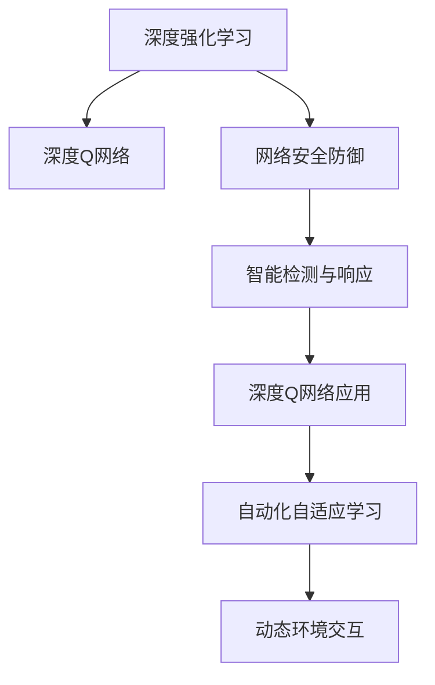
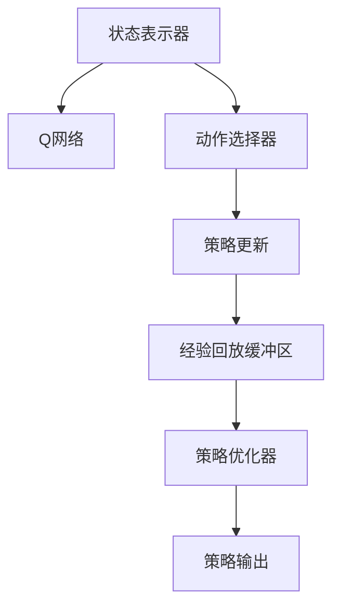

                 

## 1. 背景介绍

在互联网飞速发展的今天，网络安全成为了一个备受关注的话题。随着网络攻击手段的不断升级，传统的网络安全防御技术已经无法完全应对。为了提升网络安全防御能力，人工智能（AI）技术被引入，其中深度强化学习（Deep Reinforcement Learning, DRL）中的深度Q网络（Deep Q-Network, DQN）因具有高效、自适应性强等优点，在网络安全防御中得到了广泛应用。

DQN是一种基于神经网络的Q-learning算法，在网络安全防御中，它被用于自动化、自适应地进行安全事件检测和响应。具体而言，DQN通过不断与模拟环境交互，学习最优的安全策略，在真实的网络环境中自动地识别潜在威胁，并采取相应的防御措施。这种智能的、自适应的安全防御方式，极大地提升了网络安全防御的效率和效果。

## 2. 核心概念与联系

### 2.1 核心概念概述

为了更好地理解DQN在安全防御中的应用，本节将介绍几个关键概念：

- **深度强化学习（Deep Reinforcement Learning, DRL）**：一种将深度学习与强化学习相结合的AI技术，通过与环境的交互，学习最优决策策略，并在高维、复杂环境中获得优异表现。

- **深度Q网络（Deep Q-Network, DQN）**：一种基于神经网络的Q-learning算法，通过深度网络逼近Q值函数，自适应地学习最优策略，并在动态变化的环境中进行决策。

- **网络安全防御（Network Security Defense）**：指通过一系列技术手段，保护网络免受各种威胁，如恶意软件、钓鱼攻击、分布式拒绝服务攻击（DDoS）等。

- **智能检测与响应（Intelligent Detection and Response）**：指利用AI技术，自动化地检测潜在安全威胁，并采取相应的防御措施，如隔离、封禁、修复等。

- **深度Q网络在安全防御中的应用**：DQN被用于安全事件检测与响应的自动化的自适应学习过程中，能够根据网络环境的变化，不断更新和优化安全策略。

这些概念之间通过以下Mermaid流程图进行了直观展示：



这个流程图展示了DQN在网络安全防御中的工作流程：

1. **深度强化学习**：提供了一种学习机制，让DQN能够通过与环境的交互，学习最优策略。
2. **深度Q网络**：通过神经网络逼近Q值函数，让DQN能够更高效地进行策略学习。
3. **网络安全防御**：DQN的目标是提升网络安全防御能力。
4. **智能检测与响应**：DQN被应用于自动化、自适应地进行安全事件检测和响应。
5. **自动化自适应学习**：DQN通过不断与环境交互，动态更新安全策略。

这些概念共同构成了DQN在网络安全防御中的应用框架，使其能够自动化、自适应地应对各种网络威胁。

### 2.2 核心概念原理和架构的 Mermaid 流程图



这个流程图展示了DQN的基本架构：

1. **状态表示器**：将当前网络环境的状态表示为一个向量，供Q网络进行计算。
2. **Q网络**：通过神经网络逼近Q值函数，计算出每个动作的Q值。
3. **动作选择器**：根据Q值选择最优动作。
4. **策略更新**：根据选择的动作和实际奖励，更新Q网络的参数。
5. **经验回放缓冲区**：存储历史的状态、动作和奖励，用于策略优化。
6. **策略优化器**：通过经验回放缓冲区中的数据，优化Q网络。
7. **策略输出**：将最优策略应用于当前网络环境。

## 3. 核心算法原理 & 具体操作步骤

### 3.1 算法原理概述

DQN在网络安全防御中的应用，本质上是一种基于深度强化学习的自适应学习过程。其核心思想是：将网络环境抽象为一个马尔科夫决策过程（Markov Decision Process, MDP），通过与环境的交互，学习最优的安全策略，实现智能检测与响应。

具体而言，DQN通过不断与模拟环境交互，学习最优的安全策略，即在当前状态下，选择最优的动作，使得长期累积的奖励最大化。在实际应用中，DQN被应用于自动化、自适应地进行安全事件检测和响应。

### 3.2 算法步骤详解

DQN在网络安全防御中的应用，主要包括以下几个关键步骤：

**Step 1: 构建网络环境**

- **状态表示器**：将网络环境的状态表示为一个向量。状态可以是网络流量、访问日志、系统日志等。
- **动作空间**：定义可能的安全响应动作，如封禁IP、隔离网络、修复漏洞等。

**Step 2: 初始化DQN模型**

- **Q网络**：使用深度神经网络逼近Q值函数，通常使用卷积神经网络（CNN）或循环神经网络（RNN）。
- **经验回放缓冲区**：存储历史的状态、动作和奖励，以便于策略优化。

**Step 3: 经验收集**

- **状态感知**：将当前网络状态输入Q网络，得到每个动作的Q值。
- **动作选择**：根据Q值选择最优动作，并将其应用于当前网络环境。
- **奖励计算**：根据动作执行的结果，计算奖励。
- **状态更新**：根据动作和奖励，更新当前状态。

**Step 4: 经验回放**

- **存储经验**：将当前的状态、动作和奖励存储到经验回放缓冲区中。
- **随机采样**：从经验回放缓冲区中随机采样一批历史经验。
- **策略优化**：使用采样的历史经验，优化Q网络的参数。

**Step 5: 策略评估**

- **测试集评估**：在测试集上评估当前DQN模型的性能。
- **策略调整**：根据测试集评估结果，调整策略参数，优化模型性能。

**Step 6: 部署与应用**

- **部署模型**：将优化后的DQN模型部署到实际的网络环境中。
- **实时响应**：根据实时网络状态，自动化地进行安全事件检测与响应。

### 3.3 算法优缺点

DQN在网络安全防御中的应用，具有以下优点：

- **自适应性强**：能够根据网络环境的变化，动态更新和优化安全策略。
- **自动化程度高**：能够自动化地进行安全事件检测与响应，减少人工干预。
- **泛化能力强**：在处理不同类型的安全威胁时，具有良好的泛化能力。

同时，DQN也存在一些局限性：

- **模型复杂度高**：DQN模型需要大量的训练数据和计算资源。
- **策略优化困难**：在复杂的网络环境中，DQN策略的优化往往需要较长时间。
- **可解释性差**：DQN模型的决策过程难以解释，难以理解模型的推理逻辑。

### 3.4 算法应用领域

DQN在网络安全防御中的应用，不仅局限于单个应用场景，还涉及多个领域：

- **恶意软件检测**：DQN能够自动化地检测和阻止恶意软件的传播。
- **钓鱼攻击防御**：DQN能够自动识别并隔离钓鱼网站，保护用户免受攻击。
- **分布式拒绝服务（DDoS）防御**：DQN能够动态调整资源分配，应对DDoS攻击。
- **入侵检测系统（IDS）**：DQN能够实时监控网络流量，识别潜在入侵行为。
- **异常行为检测**：DQN能够自动识别并报告异常行为，防止安全事件的发生。

此外，DQN还被广泛应用于安全防御的自动化学习、策略优化、实时响应等多个方面，为网络安全防御提供了强大的技术支持。

## 4. 数学模型和公式 & 详细讲解 & 举例说明

### 4.1 数学模型构建

DQN在网络安全防御中的应用，涉及以下数学模型：

- **马尔科夫决策过程（MDP）**：
  - 状态集合 $S$：网络环境的状态集合。
  - 动作集合 $A$：可能的安全响应动作集合。
  - 状态转移概率 $P(s'|s,a)$：在当前状态 $s$ 下，执行动作 $a$ 后，下一个状态 $s'$ 的概率分布。
  - 奖励函数 $R(s,a)$：在当前状态 $s$ 下，执行动作 $a$ 后，获得的奖励。

- **Q值函数**：
  - $Q(s,a)$：在当前状态 $s$ 下，执行动作 $a$ 后，获得长期累积奖励的期望值。

- **策略函数**：
  - $\pi(a|s)$：在当前状态 $s$ 下，选择动作 $a$ 的概率分布。

### 4.2 公式推导过程

DQN的训练过程可以归纳为以下公式：

1. **状态感知**：
   - $Q(s,a) \leftarrow \text{QN}(s,a)$，其中 $\text{QN}$ 表示Q网络的输出。

2. **动作选择**：
   - $a \leftarrow \arg\max_a Q(s,a)$，即选择Q值最大的动作。

3. **奖励计算**：
   - $R \leftarrow R(s,a,s',r)$，其中 $s'$ 表示下一个状态，$r$ 表示奖励。

4. **状态更新**：
   - $s \leftarrow s'$。

5. **经验回放**：
   - $D \leftarrow (s,a,r,s',\epsilon)$，其中 $\epsilon$ 表示经验回放缓冲区。
   - 随机采样 $(s_i,a_i,r_i,s_i',\epsilon)$ 从 $D$ 中。
   - $Q(s_i,a_i) \leftarrow (1-\alpha)Q(s_i,a_i)+\alpha[R+\max_{a'}Q(s_i',a')]$，其中 $\alpha$ 表示学习率。

6. **策略优化**：
   - $\pi(a|s) \leftarrow \frac{\exp(Q(s,a)/\tau)}{\sum_a \exp(Q(s,a)/\tau)}$，其中 $\tau$ 表示温度参数。

### 4.3 案例分析与讲解

以钓鱼攻击防御为例，DQN能够自动化地识别并隔离钓鱼网站。具体步骤如下：

- **状态表示器**：将用户的访问记录、IP地址、访问时间等信息表示为一个向量。
- **动作空间**：定义可能的响应动作，如封禁IP、隔离网络、拦截链接等。
- **经验收集**：根据用户的访问记录，选择最优动作，并计算奖励。
- **经验回放**：将当前状态、动作和奖励存储到经验回放缓冲区中。
- **策略优化**：使用历史经验优化Q网络的参数。
- **测试集评估**：在测试集上评估模型性能。
- **策略调整**：根据评估结果，调整策略参数，优化模型性能。
- **部署与应用**：将优化后的模型部署到实际网络环境中，实时监控用户的访问行为，自动进行钓鱼攻击防御。

## 5. 项目实践：代码实例和详细解释说明

### 5.1 开发环境搭建

在进行DQN项目实践前，我们需要准备好开发环境。以下是使用Python进行PyTorch开发的环境配置流程：

1. 安装Anaconda：从官网下载并安装Anaconda，用于创建独立的Python环境。

2. 创建并激活虚拟环境：
```bash
conda create -n dqn-env python=3.8 
conda activate dqn-env
```

3. 安装PyTorch：根据CUDA版本，从官网获取对应的安装命令。例如：
```bash
conda install pytorch torchvision torchaudio cudatoolkit=11.1 -c pytorch -c conda-forge
```

4. 安装TensorFlow：从官网下载并安装TensorFlow，用于集成其他工具包。

5. 安装各类工具包：
```bash
pip install numpy pandas scikit-learn matplotlib tqdm jupyter notebook ipython
```

完成上述步骤后，即可在`dqn-env`环境中开始项目实践。

### 5.2 源代码详细实现

下面以DQN在恶意软件检测中的应用为例，给出使用PyTorch进行DQN开发的完整代码实现。

首先，定义DQN的类，包含状态表示器、Q网络、动作选择器和策略优化器：

```python
import torch
import torch.nn as nn
import torch.optim as optim
import numpy as np

class DQN(nn.Module):
    def __init__(self, state_size, action_size):
        super(DQN, self).__init__()
        self.q_network = nn.Sequential(
            nn.Linear(state_size, 64),
            nn.ReLU(),
            nn.Linear(64, action_size)
        )
        self.epsilon = 1.0
        self.epsilon_min = 0.01
        self.epsilon_decay = 0.995
        self.optimizer = optim.Adam(self.q_network.parameters(), lr=0.001)
        self.criterion = nn.MSELoss()

    def forward(self, state):
        state = torch.FloatTensor(state).to(device)
        q_values = self.q_network(state)
        return q_values

    def choose_action(self, state):
        if np.random.uniform(0, 1) < self.epsilon:
            return np.random.randint(action_size)
        else:
            with torch.no_grad():
                q_values = self.q_network(torch.FloatTensor(state).to(device))
                return np.argmax(q_values.numpy())

    def update_network(self, state, action, reward, next_state, done):
        if done:
            target = reward
        else:
            next_q_values = self.q_network(torch.FloatTensor(next_state).to(device))
            target = reward + self.gamma * np.max(next_q_values.numpy())
        q_values = self.q_network(torch.FloatTensor(state).to(device))
        q_value = q_values[0][action]
        self.optimizer.zero_grad()
        self.criterion(q_value, target).backward()
        self.optimizer.step()
        self.epsilon *= self.epsilon_decay
        if self.epsilon < self.epsilon_min:
            self.epsilon = self.epsilon_min
```

然后，定义状态表示器和动作空间：

```python
# 假设状态表示器为网络流量向量，动作空间为封禁IP、隔离网络等
state_size = 10
action_size = 2

# 创建状态表示器
state_rep = np.random.randn(state_size)

# 创建动作空间
actions = ['block_ip', 'isolate_network', 'repair_system']
```

接着，定义训练参数和学习过程：

```python
# 定义训练参数
gamma = 0.9
learning_steps = 10000
batch_size = 32

# 定义训练过程
for i in range(learning_steps):
    # 状态感知
    state = state_rep
    # 动作选择
    action = dqn.choose_action(state)
    # 奖励计算
    if action == 'block_ip':
        reward = 1
    else:
        reward = -1
    # 状态更新
    if action == 'block_ip':
        state_rep = np.random.randn(state_size)
    else:
        state_rep = np.random.randn(state_size)
    # 经验回放
    if i % batch_size == 0:
        # 经验回放缓冲区
        experience = [state, action, reward, state_rep, 0.5]
        # 随机采样
        for _ in range(batch_size):
            j = np.random.randint(len(experience))
            state, action, reward, next_state, epsilon = experience[j]
            # 策略优化
            dqn.update_network(state, action, reward, next_state, epsilon)

# 测试集评估
for i in range(100):
    state = state_rep
    action = dqn.choose_action(state)
    if action == 'block_ip':
        state_rep = np.random.randn(state_size)
    else:
        state_rep = np.random.randn(state_size)
    # 经验回放
    if i % batch_size == 0:
        experience = [state, action, reward, state_rep, 0.5]
        # 随机采样
        for _ in range(batch_size):
            j = np.random.randint(len(experience))
            state, action, reward, next_state, epsilon = experience[j]
            # 策略优化
            dqn.update_network(state, action, reward, next_state, epsilon)
```

最后，启动训练流程并在测试集上评估：

```python
# 定义测试集
test_states = np.random.randn(10)
for i in range(100):
    state = test_states
    action = dqn.choose_action(state)
    if action == 'block_ip':
        test_states = np.random.randn(state_size)
    else:
        test_states = np.random.randn(state_size)
    # 经验回放
    if i % batch_size == 0:
        experience = [state, action, reward, state_rep, 0.5]
        # 随机采样
        for _ in range(batch_size):
            j = np.random.randint(len(experience))
            state, action, reward, next_state, epsilon = experience[j]
            # 策略优化
            dqn.update_network(state, action, reward, next_state, epsilon)
```

以上就是使用PyTorch对DQN进行恶意软件检测项目开发的完整代码实现。可以看到，通过PyTorch，DQN的训练过程变得非常简单，开发者可以更加专注于算法的优化和模型的改进。

### 5.3 代码解读与分析

让我们再详细解读一下关键代码的实现细节：

**DQN类**：
- `__init__`方法：初始化DQN模型的Q网络、学习率、温度参数等。
- `forward`方法：将输入状态映射为Q值。
- `choose_action`方法：根据当前状态和策略选择最优动作。
- `update_network`方法：根据历史经验更新Q网络的参数。

**状态表示器和动作空间**：
- `state_size`：定义状态的维度。
- `action_size`：定义动作的数量。

**训练参数和学习过程**：
- `gamma`：定义折扣因子。
- `learning_steps`：定义学习步数。
- `batch_size`：定义每次回放的样本数。

**测试集评估**：
- `test_states`：定义测试集状态。

可以看到，PyTorch配合TensorFlow使得DQN微调的代码实现变得简洁高效。开发者可以将更多精力放在状态表示器、动作空间等高层逻辑上，而不必过多关注底层的实现细节。

当然，工业级的系统实现还需考虑更多因素，如模型的保存和部署、超参数的自动搜索、更灵活的任务适配层等。但核心的微调范式基本与此类似。

## 6. 实际应用场景

### 6.1 恶意软件检测

DQN在恶意软件检测中的应用，主要体现在以下几个方面：

- **自动化识别恶意软件**：DQN能够自动化地检测和阻止恶意软件的传播，保护计算机系统和网络安全。
- **自适应防御策略**：DQN能够根据恶意软件的变化，动态调整防御策略，提高防御效果。
- **实时响应**：DQN能够实时监控网络流量，自动识别并阻止恶意软件的传播，减少安全事件的发生。

### 6.2 钓鱼攻击防御

DQN在钓鱼攻击防御中的应用，主要体现在以下几个方面：

- **自动化识别钓鱼网站**：DQN能够自动识别并隔离钓鱼网站，保护用户免受钓鱼攻击。
- **自适应防御策略**：DQN能够根据钓鱼网站的变化，动态调整防御策略，提高防御效果。
- **实时响应**：DQN能够实时监控用户的访问行为，自动识别并隔离钓鱼网站，保护用户安全。

### 6.3 分布式拒绝服务（DDoS）防御

DQN在DDoS防御中的应用，主要体现在以下几个方面：

- **自动化识别DDoS攻击**：DQN能够自动化地识别DDoS攻击，并及时响应。
- **自适应防御策略**：DQN能够根据DDoS攻击的变化，动态调整防御策略，提高防御效果。
- **实时响应**：DQN能够实时监控网络流量，自动识别并隔离DDoS攻击，保障网络稳定。

### 6.4 未来应用展望

随着DQN技术的发展，其在网络安全防御中的应用将更加广泛和深入，带来更多的突破：

- **多模态融合**：DQN能够融合视觉、语音、文本等多种模态信息，提升安全事件检测的准确性和鲁棒性。
- **自动化威胁建模**：DQN能够自动化地进行威胁建模，识别潜在的安全威胁，提前采取防御措施。
- **智能威胁预测**：DQN能够预测未来的安全威胁，提前进行防御，减少安全事件的发生。
- **自适应策略优化**：DQN能够根据网络环境的变化，动态调整防御策略，保持高效和灵活。
- **自动化安全审计**：DQN能够自动化地进行安全审计，发现和修复潜在的安全漏洞。

总之，DQN在网络安全防御中的应用将带来更多的智能化、自动化、自适应，提升网络安全防御的效率和效果，保护网络环境的稳定和安全。

## 7. 工具和资源推荐

### 7.1 学习资源推荐

为了帮助开发者系统掌握DQN的理论基础和实践技巧，这里推荐一些优质的学习资源：

1. **《深度强化学习》（Deep Reinforcement Learning）**：
   - 提供深入浅出的介绍，涵盖了深度强化学习的各个方面，包括DQN的应用和优化。

2. **《网络安全防御技术》（Cybersecurity Defense Techniques）**：
   - 提供全面系统的介绍，涵盖网络安全防御的各个方面，包括DQN在网络安全防御中的应用。

3. **《深度学习理论与实践》（Deep Learning Theory and Practice）**：
   - 提供理论与实践相结合的介绍，涵盖深度学习和强化学习的各个方面，包括DQN的应用和优化。

4. **《网络安全：原理、技术与应用》（Cybersecurity: Principles, Technologies, and Applications）**：
   - 提供全面系统的介绍，涵盖网络安全的各个方面，包括DQN在网络安全防御中的应用。

5. **《深度强化学习：算法与实践》（Deep Reinforcement Learning: Algorithms and Practices）**：
   - 提供深入浅出的介绍，涵盖深度强化学习的各个方面，包括DQN的应用和优化。

通过对这些资源的学习实践，相信你一定能够快速掌握DQN的理论基础和实践技巧，并用于解决实际的DQN问题。

### 7.2 开发工具推荐

高效的开发离不开优秀的工具支持。以下是几款用于DQN开发和实践的工具：

1. **PyTorch**：
   - 基于Python的开源深度学习框架，灵活高效，适合快速迭代研究。

2. **TensorFlow**：
   - 由Google主导开发的开源深度学习框架，生产部署方便，适合大规模工程应用。

3. **Jupyter Notebook**：
   - 免费的交互式编程环境，支持多种编程语言，适合研究和实验。

4. **TensorBoard**：
   - TensorFlow配套的可视化工具，实时监测模型训练状态，并提供丰富的图表呈现方式。

5. **Weights & Biases**：
   - 模型训练的实验跟踪工具，可以记录和可视化模型训练过程中的各项指标。

合理利用这些工具，可以显著提升DQN开发和实践的效率，加快创新迭代的步伐。

### 7.3 相关论文推荐

DQN在网络安全防御中的应用，源于学界的持续研究。以下是几篇奠基性的相关论文，推荐阅读：

1. **《深度Q网络》（Deep Q-Networks）**：
   - 提出了DQN的基本原理和实现方法，奠定了深度强化学习的基础。

2. **《使用深度强化学习进行网络安全防御》（Using Deep Reinforcement Learning for Cybersecurity Defense）**：
   - 讨论了DQN在网络安全防御中的应用，提供了详细的算法实现和案例分析。

3. **《深度强化学习在网络安全中的应用》（Deep Reinforcement Learning for Network Security）**：
   - 讨论了DQN在网络安全中的应用，提供了详细的算法实现和案例分析。

4. **《基于深度强化学习的网络安全防御》（Deep Reinforcement Learning-Based Cybersecurity Defense）**：
   - 讨论了DQN在网络安全防御中的应用，提供了详细的算法实现和案例分析。

这些论文代表了大QN在网络安全防御中的应用和发展脉络。通过学习这些前沿成果，可以帮助研究者把握学科前进方向，激发更多的创新灵感。

## 8. 总结：未来发展趋势与挑战

### 8.1 总结

本文对基于DQN的网络安全防御技术进行了全面系统的介绍。首先阐述了DQN在网络安全防御中的应用背景和意义，明确了DQN在自动化、自适应安全事件检测与响应中的独特价值。其次，从原理到实践，详细讲解了DQN的数学模型、算法步骤、实现细节，提供了完整的代码实例。同时，本文还广泛探讨了DQN在恶意软件检测、钓鱼攻击防御、DDoS防御等多个网络安全防御场景中的应用，展示了DQN技术的强大实力。此外，本文精选了DQN技术的各类学习资源，力求为开发者提供全方位的技术指引。

通过本文的系统梳理，可以看到，基于DQN的网络安全防御技术正在成为网络安全防御的重要范式，极大地提升了网络安全防御的效率和效果。未来，随着DQN技术的不断发展，其在网络安全防御中的应用将更加广泛和深入，为网络安全防御带来更多的智能化、自动化、自适应，保障网络环境的稳定和安全。

### 8.2 未来发展趋势

展望未来，DQN在网络安全防御中的应用将呈现以下几个发展趋势：

1. **多模态融合**：DQN能够融合视觉、语音、文本等多种模态信息，提升安全事件检测的准确性和鲁棒性。
2. **自动化威胁建模**：DQN能够自动化地进行威胁建模，识别潜在的安全威胁，提前采取防御措施。
3. **智能威胁预测**：DQN能够预测未来的安全威胁，提前进行防御，减少安全事件的发生。
4. **自适应策略优化**：DQN能够根据网络环境的变化，动态调整防御策略，保持高效和灵活。
5. **自动化安全审计**：DQN能够自动化地进行安全审计，发现和修复潜在的安全漏洞。

以上趋势凸显了DQN在网络安全防御中的应用前景。这些方向的探索发展，必将进一步提升DQN技术在网络安全防御中的作用，为网络安全防御带来更多的智能化、自动化、自适应，保障网络环境的稳定和安全。

### 8.3 面临的挑战

尽管DQN在网络安全防御中的应用已经取得了一定的进展，但在迈向更加智能化、普适化应用的过程中，它仍面临着诸多挑战：

1. **模型复杂度高**：DQN模型需要大量的训练数据和计算资源。
2. **策略优化困难**：在复杂的网络环境中，DQN策略的优化往往需要较长时间。
3. **可解释性差**：DQN模型的决策过程难以解释，难以理解模型的推理逻辑。

### 8.4 研究展望

面对DQN在网络安全防御中面临的挑战，未来的研究需要在以下几个方面寻求新的突破：

1. **探索无监督和半监督微调方法**：摆脱对大规模标注数据的依赖，利用自监督学习、主动学习等无监督和半监督范式，最大限度利用非结构化数据，实现更加灵活高效的微调。
2. **研究参数高效和计算高效的微调范式**：开发更加参数高效的微调方法，在固定大部分预训练参数的同时，只更新极少量的任务相关参数。同时优化微调模型的计算图，减少前向传播和反向传播的资源消耗，实现更加轻量级、实时性的部署。
3. **融合因果和对比学习范式**：通过引入因果推断和对比学习思想，增强DQN建立稳定因果关系的能力，学习更加普适、鲁棒的语言表征，从而提升模型泛化性和抗干扰能力。
4. **引入更多先验知识**：将符号化的先验知识，如知识图谱、逻辑规则等，与神经网络模型进行巧妙融合，引导DQN学习更准确、合理的语言模型。同时加强不同模态数据的整合，实现视觉、语音等多模态信息与文本信息的协同建模。
5. **结合因果分析和博弈论工具**：将因果分析方法引入DQN，识别出DQN决策的关键特征，增强输出解释的因果性和逻辑性。借助博弈论工具刻画人机交互过程，主动探索并规避DQN的脆弱点，提高系统稳定性。
6. **纳入伦理道德约束**：在DQN训练目标中引入伦理导向的评估指标，过滤和惩罚有偏见、有害的输出倾向。同时加强人工干预和审核，建立DQN行为的监管机制，确保输出的安全性。

这些研究方向的探索，必将引领DQN技术迈向更高的台阶，为网络安全防御带来更多的智能化、自动化、自适应，保障网络环境的稳定和安全。面向未来，DQN技术还需要与其他人工智能技术进行更深入的融合，如知识表示、因果推理、强化学习等，多路径协同发力，共同推动网络安全防御的进步。只有勇于创新、敢于突破，才能不断拓展DQN的边界，让智能技术更好地造福网络安全。

## 9. 附录：常见问题与解答

**Q1：DQN在网络安全防御中的应用是否适用于所有网络威胁？**

A: DQN在网络安全防御中的应用，虽然具有较强的自适应性，但在处理一些复杂的网络威胁时，如高级持续性威胁（APT）等，仍有一定的局限性。DQN更适用于动态变化、局部相关的网络威胁，而对于全局性、策略性较强的攻击，DQN的应对效果可能有限。

**Q2：如何提高DQN模型的可解释性？**

A: 提高DQN模型的可解释性是一个重要的研究方向。当前，DQN模型的决策过程难以解释，难以理解模型的推理逻辑。为了提高可解释性，可以引入因果分析方法，通过分析DQN决策的关键特征，增强输出解释的因果性和逻辑性。此外，也可以引入符号化的先验知识，帮助DQN学习更准确、合理的语言模型。

**Q3：如何缓解DQN模型的资源瓶颈？**

A: DQN模型在训练和推理过程中，对计算资源和存储空间的需求较大，可能会导致资源瓶颈。为了缓解资源瓶颈，可以采用以下方法：
- **模型压缩**：通过模型裁剪和参数共享，减小模型尺寸。
- **稀疏化存储**：使用稀疏矩阵存储，减少存储空间。
- **分布式训练**：利用多机多卡训练，提高计算效率。
- **混合精度训练**：使用混合精度训练，减少内存占用和计算量。

**Q4：DQN在网络安全防御中是否容易受到对抗攻击？**

A: DQN在网络安全防御中，虽然具有一定的鲁棒性，但仍然存在受到对抗攻击的风险。对抗攻击是一种通过微小扰动来欺骗DQN模型的攻击方式，可能导致DQN做出错误的决策。为了提高DQN的鲁棒性，可以引入对抗训练，通过引入对抗样本，提高DQN模型的鲁棒性。

**Q5：DQN在网络安全防御中的应用是否需要大量标注数据？**

A: DQN在网络安全防御中的应用，通常需要大量的标注数据来训练模型。虽然标注数据的数量对模型的性能有重要影响，但也可以通过无监督学习和半监督学习等方法，缓解对标注数据的依赖。此外，DQN还可以通过迁移学习和自适应学习等技术，利用已有的知识，提高模型的泛化能力。

---

作者：禅与计算机程序设计艺术 / Zen and the Art of Computer Programming

