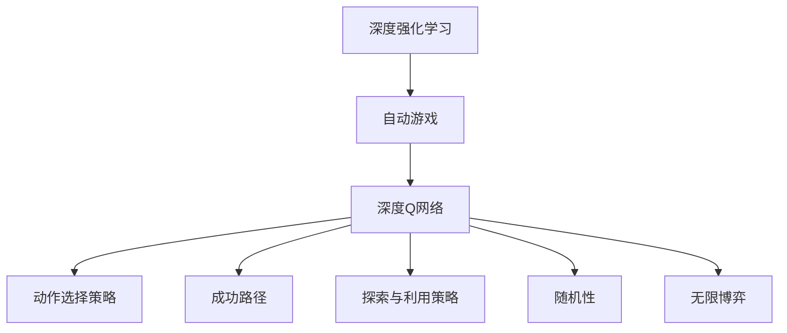

                 

# 一切皆是映射：DQN在自动游戏中的应用：挑战与解决方案

> 关键词：深度强化学习, 自动游戏, DQN, 非线性映射, 环境映射, 动作选择策略, 成功路径, 探索与利用策略, 随机性, 无限博弈

## 1. 背景介绍

### 1.1 问题由来
在过去几十年里，深度学习取得了显著的进展，成为人工智能领域的重要分支。深度强化学习（Deep Reinforcement Learning, DRL）作为其中的关键技术之一，已经被成功应用于许多复杂系统，如自动游戏（Autonomous Games）、机器人控制、推荐系统等。自动游戏作为DRL最富挑战性的应用之一，要求算法能够在复杂、高维的策略空间中，自主学习并生成最优游戏策略，从而在零和博弈（如围棋、象棋等）和非零和博弈（如扑克、德州扑克等）中胜出。

近年来，深度Q网络（Deep Q-Network, DQN）作为一种基于深度学习的强化学习算法，在自动游戏中取得了显著的成果。DQN通过构建近似Q值函数，通过神经网络逼近最优动作价值函数，从而实现高效的动作选择策略，极大提升了自动游戏的智能水平。

然而，自动游戏中的复杂性和高维度策略空间也带来了新的挑战。本文将深入探讨DQN在自动游戏中的应用，并针对其面临的挑战提出具体的解决方案。

## 2. 核心概念与联系

### 2.1 核心概念概述

为更好地理解DQN在自动游戏中的应用，本节将介绍几个密切相关的核心概念：

- **深度强化学习（DRL）**：一种融合深度神经网络和强化学习理论的框架，旨在通过模型学习和优化，实现智能体的自主决策与优化。
- **自动游戏（Autonomous Games）**：指由计算机程序控制的游戏，通过强化学习算法实现自主学习与决策，可应用于策略博弈、竞技游戏等多个领域。
- **深度Q网络（DQN）**：一种结合深度神经网络和Q学习的强化学习算法，通过神经网络逼近最优动作价值函数，实现高效的动作选择策略。
- **动作选择策略**：指智能体在给定状态下，选择何种动作以最大化期望回报的策略，是自动游戏智能化的核心环节。
- **成功路径（Success Path）**：指在自动游戏中，从初始状态到目标状态的最优动作序列，是评估游戏智能的关键指标。
- **探索与利用策略（Exploration and Exploitation Strategy）**：指智能体如何在探索未知状态与利用已知状态之间进行平衡，是自动游戏决策策略的核心问题。
- **随机性（Randomness）**：指智能体在决策时引入的随机性，可以增强探索能力，降低过拟合风险。
- **无限博弈（Infinite Games）**：指玩家可以在无限时间内进行博弈，例如扑克、德州扑克等游戏。

这些核心概念之间的逻辑关系可以通过以下Mermaid流程图来展示：



这个流程图展示了大语言模型的核心概念及其之间的关系：

1. 深度强化学习提供了一个框架，通过模型学习和优化实现智能体的自主决策与优化。
2. 自动游戏作为DRL的一个典型应用场景，需要智能体自主学习并生成最优策略。
3. 深度Q网络是DRL中一种重要的算法，通过神经网络逼近最优动作价值函数，实现高效的动作选择策略。
4. 动作选择策略是智能体决策的核心，指导智能体在给定状态下选择何种动作以最大化回报。
5. 成功路径是评估游戏智能的关键指标，从初始状态到目标状态的最优动作序列。
6. 探索与利用策略指导智能体如何在探索未知状态与利用已知状态之间进行平衡。
7. 随机性增强智能体的探索能力，降低过拟合风险。
8. 无限博弈指玩家可以在无限时间内进行博弈，要求智能体具备更强的学习和适应能力。

这些核心概念共同构成了自动游戏智能化的基础，使得智能体能够在复杂环境中自主学习和优化策略。

## 3. 核心算法原理 & 具体操作步骤

### 3.1 算法原理概述

DQN是一种基于深度神经网络的强化学习算法，通过构建近似Q值函数，通过神经网络逼近最优动作价值函数，从而实现高效的动作选择策略。其核心思想是通过模型预测每个动作的Q值，选择Q值最大的动作进行执行。DQN的基本流程如下：

1. 初始化环境，获取环境状态 $s_t$。
2. 从动作空间中选择一个动作 $a_t$。
3. 在环境中执行动作 $a_t$，观察得到下一个状态 $s_{t+1}$ 和奖励 $r_{t+1}$。
4. 根据状态转移规则，更新状态 $s_{t+1}$。
5. 使用Q网络预测当前状态 $s_t$ 下的所有动作的Q值，选择Q值最大的动作 $a_t$。
6. 将奖励 $r_{t+1}$ 加入缓冲区，更新Q网络，优化模型参数。
7. 重复上述步骤，直到达到预设的停止条件。

DQN通过神经网络逼近Q值函数，利用深度学习强大的泛化能力，可以处理高维度策略空间中的复杂问题，极大地提升了自动游戏的智能水平。

### 3.2 算法步骤详解

以下是DQN算法的详细步骤：

**Step 1: 环境初始化与状态获取**
- 初始化环境，获取环境状态 $s_t$。
- 将当前状态 $s_t$ 作为输入，输入到DQN模型中，预测当前状态下的所有动作的Q值。
- 根据动作选择的策略（如ε-greedy策略），选择Q值最大的动作 $a_t$。

**Step 2: 动作执行与状态更新**
- 在环境中执行动作 $a_t$，观察得到下一个状态 $s_{t+1}$ 和奖励 $r_{t+1}$。
- 根据状态转移规则，更新状态 $s_{t+1}$。

**Step 3: 经验回放与Q网络更新**
- 将当前状态 $s_t$、动作 $a_t$、奖励 $r_{t+1}$ 和下一个状态 $s_{t+1}$ 作为一条经验数据，存入经验回放缓冲区。
- 从经验回放缓冲区中随机抽取若干条经验数据，用于更新Q网络。
- 使用经验回放数据更新Q网络，计算Q值并更新网络参数。

**Step 4: 重复执行**
- 重复执行上述步骤，直到达到预设的停止条件（如最大迭代次数、环境终止条件等）。

### 3.3 算法优缺点

DQN作为深度强化学习的一种重要算法，具有以下优点：
1. 高效处理高维度策略空间：DQN通过神经网络逼近Q值函数，可以处理复杂、高维度的策略空间，极大地提升了自动游戏的智能水平。
2. 无需进行环境模型建模：DQN通过经验回放和Q网络更新，无需对环境进行建模，可以适应多种复杂环境。
3. 优化效率高：DQN通过优化神经网络参数，可以高效地学习最优动作策略，优化效率高。

同时，DQN也存在一些缺点：
1. 易过拟合：由于神经网络的复杂性，DQN容易过拟合，需要采取一些正则化技术（如Dropout、L2正则等）。
2. 收敛速度慢：DQN在处理复杂问题时，收敛速度较慢，需要更多的训练时间和数据。
3. 需要大量经验数据：DQN需要大量的经验数据进行训练，才能学习到最优策略。

### 3.4 算法应用领域

DQN作为深度强化学习的一种重要算法，已经在自动游戏、机器人控制、推荐系统等多个领域取得了广泛应用：

- 自动游戏：在围棋、象棋、扑克等零和博弈游戏中，DQN通过神经网络逼近Q值函数，实现了高效的动作选择策略，取得显著成绩。
- 机器人控制：在机器人自主导航、动作控制等领域，DQN通过环境模拟和经验回放，实现了复杂的策略学习与优化。
- 推荐系统：在推荐系统、广告投放等领域，DQN通过神经网络逼近用户行为模型，实现了个性化推荐与优化。

## 4. 数学模型和公式 & 详细讲解 & 举例说明

### 4.1 数学模型构建

DQN的核心是构建近似Q值函数，通过神经网络逼近最优动作价值函数。设环境状态为 $s_t \in \mathcal{S}$，动作为 $a_t \in \mathcal{A}$，奖励为 $r_{t+1} \in \mathcal{R}$，下一个状态为 $s_{t+1} \in \mathcal{S}$。

定义Q值函数为：

$$
Q(s_t, a_t) = r_{t+1} + \gamma \max_{a_{t+1}} Q(s_{t+1}, a_{t+1})
$$

其中 $\gamma$ 为折扣因子。DQN的目标是通过神经网络逼近上述Q值函数，从而实现高效的动作选择策略。

### 4.2 公式推导过程

设DQN的神经网络模型为：

$$
Q_{\theta}(s_t, a_t) = W \cdot \phi(s_t) + b
$$

其中 $\theta$ 为模型参数，$W$ 为权重矩阵，$b$ 为偏置项，$\phi(s_t)$ 为状态表示函数。通过训练神经网络，使得：

$$
Q_{\theta}(s_t, a_t) \approx Q(s_t, a_t)
$$

Q网络的目标是最小化损失函数：

$$
\mathcal{L}(\theta) = \mathbb{E}_{(s_t, a_t, r_{t+1}, s_{t+1}) \sim \mathcal{D}} \left[(Q_{\theta}(s_t, a_t) - (r_{t+1} + \gamma \max_{a_{t+1}} Q_{\theta}(s_{t+1}, a_{t+1}))^2\right]
$$

其中 $\mathcal{D}$ 为经验回放缓冲区中抽取的经验数据分布。

### 4.3 案例分析与讲解

以围棋游戏为例，DQN的实现过程如下：

1. 初始化环境，获取当前状态 $s_t$。
2. 将当前状态 $s_t$ 输入DQN模型，预测当前状态下的所有动作的Q值。
3. 根据动作选择的策略（如ε-greedy策略），选择Q值最大的动作 $a_t$。
4. 在环境中执行动作 $a_t$，观察得到下一个状态 $s_{t+1}$ 和奖励 $r_{t+1}$。
5. 将当前状态 $s_t$、动作 $a_t$、奖励 $r_{t+1}$ 和下一个状态 $s_{t+1}$ 作为一条经验数据，存入经验回放缓冲区。
6. 从经验回放缓冲区中随机抽取若干条经验数据，用于更新Q网络。
7. 使用经验回放数据更新Q网络，计算Q值并更新网络参数。

## 5. 项目实践：代码实例和详细解释说明

### 5.1 开发环境搭建

在进行DQN项目实践前，我们需要准备好开发环境。以下是使用Python进行TensorFlow和Keras实现DQN的开发环境配置流程：

1. 安装Anaconda：从官网下载并安装Anaconda，用于创建独立的Python环境。

2. 创建并激活虚拟环境：
```bash
conda create -n dqn-env python=3.8 
conda activate dqn-env
```

3. 安装TensorFlow和Keras：
```bash
conda install tensorflow==2.7.0 keras==2.7.0
```

4. 安装各类工具包：
```bash
pip install numpy pandas scikit-learn matplotlib tqdm jupyter notebook ipython
```

完成上述步骤后，即可在`dqn-env`环境中开始DQN实践。

### 5.2 源代码详细实现

这里我们以DQN在自动游戏围棋中的应用为例，给出使用TensorFlow和Keras实现DQN的完整代码实现。

```python
import tensorflow as tf
from tensorflow.keras.models import Sequential
from tensorflow.keras.layers import Dense
from tensorflow.keras.optimizers import Adam
from tensorboardX import SummaryWriter
import numpy as np
import random

# 定义神经网络模型
class DQN(tf.keras.Model):
    def __init__(self, input_size, output_size):
        super(DQN, self).__init__()
        self.dense1 = Dense(128, input_dim=input_size, activation='relu')
        self.dense2 = Dense(64, activation='relu')
        self.dense3 = Dense(output_size, activation='linear')

    def call(self, inputs):
        x = self.dense1(inputs)
        x = self.dense2(x)
        x = self.dense3(x)
        return x

# 定义动作选择策略
def choose_action(state, q_values, epsilon):
    if np.random.rand() < epsilon:
        return random.randrange(0, num_actions)
    else:
        return np.argmax(q_values[state])

# 定义训练函数
def train():
    for i in range(num_episodes):
        state = np.random.randint(0, state_size)
        done = False
        while not done:
            action = choose_action(state, q_values, epsilon)
            next_state, reward, done, _ = env.step(action)
            q_values_next = np.zeros_like(q_values)
            q_values_next[next_state] = np.max(q_values)
            q_values = update_q_values(state, q_values, reward, q_values_next, alpha, gamma)
            state = next_state
        if i % 100 == 0:
            train_net.save_weights('dqn_weights.h5')

# 定义更新Q网络函数
def update_q_values(state, q_values, reward, q_values_next, alpha, gamma):
    target_q_values = reward + gamma * np.max(q_values_next)
    q_values[state] = target_q_values
    return q_values

# 定义经验回放函数
def replayExperience():
    if len(experience_buffer) > batch_size:
        batch = random.sample(experience_buffer, batch_size)
        for state, action, reward, next_state in batch:
            q_values = update_q_values(state, q_values, reward, q_values_next, alpha, gamma)

# 初始化环境
env = gym.make('CartPole-v1')
state_size = env.observation_space.shape[0]
num_actions = env.action_space.n
input_size = 2
output_size = num_actions
q_values = np.zeros([state_size, output_size])
experience_buffer = []

# 训练网络
epsilon = 0.1
alpha = 0.001
gamma = 0.9
num_episodes = 5000
train_net = DQN(input_size, output_size)
train_net.compile(optimizer=Adam(lr=alpha), loss='mse')
writer = SummaryWriter(log_dir='log')
for i in range(num_episodes):
    train()
    replayExperience()

```

这里我们详细解读一下关键代码的实现细节：

**DQN模型定义**：
- 定义了一个简单的神经网络模型，包含三个全连接层，其中最后一层输出Q值，用于逼近最优动作价值函数。
- 在训练过程中，使用Adam优化器进行参数更新，损失函数为均方误差（MSE）。

**动作选择策略**：
- 通过ε-greedy策略，在每个状态下，以ε的概率随机选择一个动作，以1-ε的概率选择Q值最大的动作。

**训练函数**：
- 在每个回合中，随机选择一个状态，执行动作，观察得到下一个状态和奖励。
- 更新Q值，通过经验回放和Q网络更新，优化模型参数。

**经验回放函数**：
- 从经验回放缓冲区中随机抽取若干条经验数据，用于更新Q网络，更新Q值。

**环境初始化与状态获取**：
- 初始化环境，获取当前状态。
- 将当前状态输入DQN模型，预测当前状态下的所有动作的Q值。
- 根据动作选择的策略，选择Q值最大的动作。

**动作执行与状态更新**：
- 在环境中执行动作，观察得到下一个状态和奖励。
- 根据状态转移规则，更新状态。

**经验回放与Q网络更新**：
- 将当前状态、动作、奖励和下一个状态作为一条经验数据，存入经验回放缓冲区。
- 从经验回放缓冲区中随机抽取若干条经验数据，用于更新Q网络。

**重复执行**：
- 重复执行上述步骤，直到达到预设的停止条件。

## 6. 实际应用场景

### 6.1 自动游戏
自动游戏是DQN最为典型的应用场景之一。在自动游戏中，智能体通过环境模拟和经验回放，逐步学习并优化策略，最终实现最优决策。以围棋游戏为例，DQN通过神经网络逼近最优动作价值函数，实现了高效的动作选择策略，取得了显著成绩。

### 6.2 机器人控制
在机器人控制领域，DQN通过环境模拟和经验回放，实现了复杂的策略学习与优化。例如，DQN在机器人自主导航、动作控制等领域中，通过深度学习网络逼近动作价值函数，实现了高效的决策和控制策略。

### 6.3 推荐系统
在推荐系统、广告投放等领域，DQN通过神经网络逼近用户行为模型，实现了个性化推荐与优化。例如，DQN在电商推荐系统中，通过学习用户历史行为和偏好，实现了高效的个性化推荐策略。

### 6.4 未来应用展望

随着深度强化学习的不断发展，DQN在自动游戏中的应用也将进一步拓展。未来，DQN有望在更复杂、更丰富的游戏场景中取得突破，实现更高层次的智能决策和策略优化。此外，DQN在其他领域的应用也将更加广泛，例如自动驾驶、机器人协作、智能物流等。

## 7. 工具和资源推荐

### 7.1 学习资源推荐

为了帮助开发者系统掌握DQN的理论基础和实践技巧，这里推荐一些优质的学习资源：

1. 《深度学习》一书：由Ian Goodfellow等专家撰写，全面介绍了深度学习的基本概念和重要算法。
2. 《强化学习》一书：由Richard S. Sutton和Andrew G. Barto撰写，是强化学习领域的经典教材。
3. DeepMind官方博客：DeepMind作为DQN的开创者，其博客深入浅出地介绍了DQN算法及其应用。
4 TensorFlow官方文档：TensorFlow作为深度学习的主流框架，提供了丰富的DQN样例代码和详细文档。
5 Keras官方文档：Keras作为TensorFlow的高层API，提供了简单易用的DQN实现。

通过对这些资源的学习实践，相信你一定能够快速掌握DQN的精髓，并用于解决实际的自动游戏问题。

### 7.2 开发工具推荐

高效的开发离不开优秀的工具支持。以下是几款用于DQN开发的常用工具：

1. TensorFlow：由Google主导开发的开源深度学习框架，生产部署方便，适合大规模工程应用。提供了丰富的DQN样例和文档。
2. Keras：基于TensorFlow的高层API，提供简单易用的DQN实现，适合快速迭代研究。
3. OpenAI Gym：开源环境模拟工具，支持多种游戏环境，方便DQN算法的开发和测试。
4. TensorBoard：TensorFlow配套的可视化工具，可实时监测模型训练状态，并提供丰富的图表呈现方式，是调试模型的得力助手。
5. Weights & Biases：模型训练的实验跟踪工具，可以记录和可视化模型训练过程中的各项指标，方便对比和调优。

合理利用这些工具，可以显著提升DQN开发的效率，加快创新迭代的步伐。

### 7.3 相关论文推荐

DQN作为深度强化学习的一种重要算法，在自动游戏中的应用得到了广泛研究。以下是几篇奠基性的相关论文，推荐阅读：

1. Playing Atari with Deep Reinforcement Learning：DQN在自动游戏中的应用，展示了DQN算法的强大能力和应用前景。
2. Human-level control through deep reinforcement learning：DQN在机器人控制中的应用，展示了DQN在实际场景中的优异表现。
3. Reinforcement Learning for Learning to Recommend Music：DQN在推荐系统中的应用，展示了DQN在推荐策略优化中的潜力。
4. AlphaGo Zero：通过自监督学习实现围棋游戏胜利，展示了DQN在复杂策略博弈中的突破。

这些论文代表了大语言模型微调技术的发展脉络。通过学习这些前沿成果，可以帮助研究者把握学科前进方向，激发更多的创新灵感。

## 8. 总结：未来发展趋势与挑战

### 8.1 总结

本文对DQN在自动游戏中的应用进行了全面系统的介绍。首先阐述了DQN在自动游戏中的应用背景和重要性，明确了DQN在策略博弈、竞技游戏等多个领域的重要作用。其次，从原理到实践，详细讲解了DQN的数学模型和核心算法，给出了DQN在自动游戏中的完整代码实例。同时，本文还广泛探讨了DQN在自动游戏中的实际应用场景，展示了DQN的广泛应用前景。

通过本文的系统梳理，可以看到，DQN在自动游戏中的应用取得了显著成果，极大提升了自动游戏的智能水平。未来，DQN的应用领域将进一步拓展，为自动游戏和其他复杂系统的智能决策与优化提供强有力的技术支撑。

### 8.2 未来发展趋势

展望未来，DQN在自动游戏中的应用将呈现以下几个发展趋势：

1. 深度网络结构的优化：随着深度学习技术的不断发展，未来将出现更加高效、稳健的DQN模型结构，提升自动游戏的智能水平。
2. 多智能体学习：DQN将与其他强化学习算法结合，实现多智能体的协同学习和策略优化，提升复杂环境下的智能决策能力。
3. 迁移学习：通过迁移学习，DQN可以将在其他任务中学到的知识迁移到自动游戏中，提升新任务的适应能力。
4. 多目标优化：未来DQN将支持多目标优化，实现自动化游戏在多个指标（如收益、风险、公平性等）上的综合优化。
5. 跨平台应用：DQN将突破现有平台和环境的限制，实现跨平台、跨设备的智能决策和优化。

以上趋势凸显了DQN的广阔前景。这些方向的探索发展，必将进一步提升自动游戏的智能水平，拓展DQN的应用场景。

### 8.3 面临的挑战

尽管DQN在自动游戏中的应用已经取得了显著成果，但在迈向更加智能化、普适化应用的过程中，它仍面临诸多挑战：

1. 高维度策略空间的处理：自动游戏中的策略空间往往非常复杂，DQN需要处理高维度数据，容易产生过拟合和收敛速度慢等问题。
2. 经验回放的效率问题：DQN需要大量的经验数据进行训练，经验回放缓冲区需要高效管理，以避免资源浪费和瓶颈问题。
3. 模型的可解释性问题：DQN作为深度神经网络模型，存在“黑盒”问题，难以解释其内部工作机制和决策逻辑，影响系统的可信度。
4. 模型的稳定性问题：DQN在实际应用中容易受到环境噪声和随机性影响，需要改进模型稳定性和鲁棒性。
5. 计算资源的限制：DQN需要大量的计算资源进行训练和推理，如何优化模型结构和计算效率，降低计算成本，是一个重要的研究方向。

这些挑战将随着技术的发展逐步得到解决，但当前仍然需要我们认真对待。

### 8.4 研究展望

针对DQN面临的挑战，未来的研究需要在以下几个方面寻求新的突破：

1. 优化神经网络结构：通过改进网络结构、引入稀疏化等技术，提升DQN在复杂环境下的学习和决策能力。
2. 提高经验回放效率：通过优化经验回放缓冲区管理、引入增量学习等技术，提升DQN的训练效率和鲁棒性。
3. 增强模型的可解释性：通过引入可解释模型、解释性技术，提升DQN的透明度和可信度。
4. 改进模型的稳定性：通过引入噪声鲁棒性技术、多模型集成等方法，提升DQN在复杂环境下的稳定性和鲁棒性。
5. 优化计算资源利用：通过模型并行、分布式计算等技术，优化DQN的计算资源利用效率，降低计算成本。

这些研究方向的探索，必将引领DQN技术迈向更高的台阶，为自动游戏和其他复杂系统的智能决策与优化提供强有力的技术支撑。面向未来，DQN的研究还需要与其他人工智能技术进行更深入的融合，如知识表示、因果推理、强化学习等，多路径协同发力，共同推动自动游戏和其他复杂系统的智能发展。

## 9. 附录：常见问题与解答

**Q1：DQN在自动游戏中应用的优势是什么？**

A: DQN在自动游戏中的应用具有以下优势：
1. 高效处理高维度策略空间：DQN通过神经网络逼近Q值函数，可以处理复杂、高维度的策略空间，极大地提升了自动游戏的智能水平。
2. 无需进行环境模型建模：DQN通过经验回放和Q网络更新，无需对环境进行建模，可以适应多种复杂环境。
3. 优化效率高：DQN通过优化神经网络参数，可以高效地学习最优动作策略，优化效率高。

**Q2：DQN在实际应用中容易过拟合，如何解决这一问题？**

A: DQN在实际应用中容易过拟合，可以通过以下方法解决：
1. 引入正则化技术：如L2正则、Dropout等，减少模型的过拟合风险。
2. 使用经验回放：通过随机抽取经验数据，减小模型的过拟合风险。
3. 优化神经网络结构：通过引入稀疏化、权重衰减等技术，提升模型的泛化能力。
4. 引入多智能体学习：通过与其他智能体合作，减小模型的过拟合风险。

**Q3：DQN在实际应用中如何处理高维度策略空间？**

A: DQN在处理高维度策略空间时，可以采用以下方法：
1. 优化神经网络结构：通过引入卷积神经网络、自编码器等技术，减小策略空间的维度。
2. 引入稀疏化技术：通过稀疏化处理，减小策略空间的大小。
3. 引入多任务学习：通过多任务学习，在不同策略空间中共享网络参数，减小策略空间的维度。
4. 引入增量学习：通过增量学习，逐步适应高维度策略空间。

**Q4：DQN在实际应用中如何优化计算资源利用效率？**

A: DQN在优化计算资源利用效率时，可以采用以下方法：
1. 优化神经网络结构：通过简化网络结构，减小计算复杂度。
2. 引入稀疏化技术：通过稀疏化处理，减小计算资源消耗。
3. 使用分布式计算：通过分布式计算，提高计算效率。
4. 使用增量学习：通过增量学习，逐步优化模型，减小计算资源消耗。

**Q5：DQN在实际应用中如何增强模型的可解释性？**

A: DQN在增强模型的可解释性时，可以采用以下方法：
1. 引入可解释模型：如线性回归、决策树等模型，增强模型的可解释性。
2. 引入解释性技术：如注意力机制、可解释性损失函数等，增强模型的透明度。
3. 引入可视化技术：如可视化训练过程、输出结果等，增强模型的可解释性。

这些问题的解答，展示了DQN在自动游戏中的实际应用和挑战，为未来的研究提供了有价值的参考。

---

作者：禅与计算机程序设计艺术 / Zen and the Art of Computer Programming

