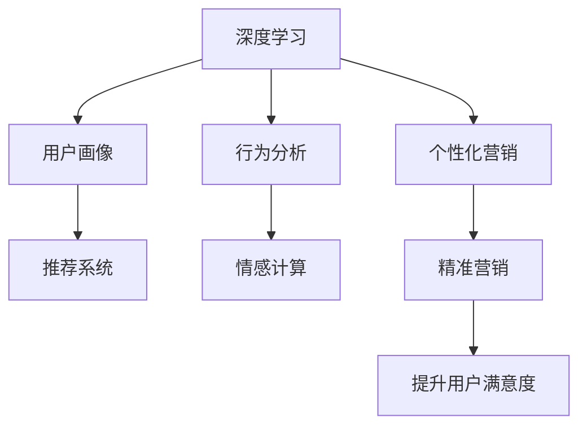

                 

# 一切皆是映射：利用深度学习提升个性化营销策略

> 关键词：深度学习,个性化营销,用户画像,推荐系统,行为分析,情感计算

## 1. 背景介绍

在数字化时代，企业面临的竞争愈发激烈。传统的营销模式依靠一锤子买卖，客户体验单一，难以长期留住客户。个性化营销通过精准把握用户需求，实现与用户的深度互动，成为近年来营销领域的热点。深度学习技术能够自动提取海量数据中的模式和规律，为个性化营销提供强大的技术支撑。

本文旨在深入探讨深度学习技术如何应用于个性化营销，并通过具体案例展示其在提升营销效果、优化客户体验等方面的强大能力。通过本文的学习，读者将能够掌握个性化营销的关键技术，洞察其背后的数学模型和算法原理，了解如何基于深度学习技术构建高效精准的个性化营销系统。

## 2. 核心概念与联系

### 2.1 核心概念概述

为更好地理解深度学习在个性化营销中的应用，本节将介绍几个关键概念：

- **深度学习**：一类基于多层神经网络的机器学习方法，能够自动提取数据中的复杂模式。在个性化营销中，深度学习模型可以分析用户行为、情感、偏好等多维数据，实现更精准的个性化推荐。
- **用户画像**：基于用户的多维度数据，构建的用于描述用户特征和行为特征的虚拟模型。用户画像是大数据分析、个性化推荐、精准营销等应用的基础。
- **推荐系统**：通过用户画像和行为数据，为用户推荐其可能感兴趣的商品、内容或服务。推荐系统是个性化营销的核心技术之一。
- **行为分析**：对用户的浏览、购买、互动等行为进行建模和分析，挖掘用户需求和偏好，形成精准的营销策略。
- **情感计算**：通过文本分析、语音识别等技术，识别用户情感倾向，优化营销策略，提升用户满意度。

这些概念之间的逻辑关系可以通过以下Mermaid流程图来展示：



这个流程图展示了大数据技术在个性化营销中的核心概念及其之间的关系：

1. 深度学习通过分析海量用户数据，获得用户的全方位画像。
2. 用户画像作为推荐系统的基础，能够推荐用户感兴趣的个性化商品和服务。
3. 行为分析和情感计算进一步挖掘用户需求和情感倾向，优化推荐系统。
4. 个性化的推荐系统，结合精准的营销策略，最终提升用户满意度和忠诚度。

## 3. 核心算法原理 & 具体操作步骤
### 3.1 算法原理概述

个性化营销的深度学习算法主要包括推荐系统和用户画像构建。

推荐系统基于协同过滤、内容推荐、混合推荐等方法，通过分析用户历史行为和兴趣，预测用户可能感兴趣的内容。用户画像则是通过深度学习模型，从用户多维度数据中挖掘出用户的特征和偏好。

推荐系统的数学模型包括协同过滤、基于内容的推荐和混合推荐：

- 协同过滤模型基于用户的历史行为和相似用户的推荐，推断用户的潜在兴趣。其核心公式为：
  $$
  y_i = \alpha u_i + (1-\alpha) \sum_{j=1}^N r_{i,j}v_j
  $$
  其中 $y_i$ 表示用户 $i$ 对商品 $j$ 的兴趣评分，$u_i$ 和 $v_j$ 分别表示用户和商品的特征向量，$r_{i,j}$ 表示用户 $i$ 和用户 $j$ 的相似度。

- 基于内容的推荐则通过分析商品的内容特征，匹配用户的兴趣。核心公式为：
  $$
  y_{i,j} = \langle u_i, v_j \rangle
  $$
  其中 $\langle \cdot,\cdot \rangle$ 表示向量点积。

- 混合推荐将协同过滤和内容推荐相结合，兼顾两者优点。公式为：
  $$
  y_i = \alpha \hat{y}_i + (1-\alpha) \tilde{y}_i
  $$
  其中 $\hat{y}_i$ 为协同过滤推荐，$\tilde{y}_i$ 为基于内容的推荐，$\alpha$ 为权重。

用户画像的构建则主要依赖深度学习模型，如神经网络、卷积神经网络、循环神经网络等。其中，基于长短期记忆网络(LSTM)的序列建模方法被广泛应用于用户行为分析。LSTM模型可以捕捉用户的动态行为模式，输出连续的隐状态。公式为：
  $$
  h_{t+1} = \text{tanh}(W_{hh} h_t + b_h + W_{xh} x_t + b_x)
  $$
  $$
  i_{t+1} = \sigma(W_{hi} h_t + b_h + W_{xi} x_t + b_x)
  $$
  其中 $h_t$ 表示隐状态，$x_t$ 表示输入向量，$W$ 和 $b$ 表示网络参数，$\text{tanh}$ 和 $\sigma$ 分别表示双曲正切和逻辑斯谛函数。

### 3.2 算法步骤详解

基于深度学习的个性化营销算法主要包括以下几个步骤：

**Step 1: 数据准备与预处理**
- 收集用户的历史行为数据，如浏览记录、购买记录、评分数据等。
- 对数据进行清洗、归一化和特征提取，去除噪声和缺失值。
- 将数据划分为训练集、验证集和测试集。

**Step 2: 用户画像构建**
- 构建用户画像的特征向量 $u_i$，可以使用基于用户历史行为的协同过滤模型。
- 对用户进行多维度建模，如年龄、性别、地域、兴趣等，形成用户特征矩阵。

**Step 3: 推荐系统设计**
- 选择合适的推荐算法，如协同过滤、基于内容的推荐或混合推荐。
- 设计推荐模型，包括模型参数初始化、损失函数设置、优化器选择等。

**Step 4: 模型训练与评估**
- 在训练集上使用优化算法进行模型训练，如随机梯度下降、Adam等。
- 在验证集上对模型进行调参，优化超参数。
- 在测试集上评估模型性能，如准确率、召回率、F1分数等。

**Step 5: 营销策略实施**
- 将训练好的推荐模型应用于实时数据流，进行实时推荐。
- 利用行为分析和情感计算优化推荐结果，实现精准营销。
- 反馈用户互动数据，持续优化推荐系统。

### 3.3 算法优缺点

基于深度学习的个性化营销算法具有以下优点：
1. 精度高。深度学习模型能够自动提取复杂模式，推荐系统效果优于传统算法。
2. 可扩展性强。支持大规模数据，能够在实时数据流上进行推荐，满足高并发需求。
3. 动态性。能够实时捕捉用户行为变化，动态调整推荐策略。

同时，该方法也存在一定的局限性：
1. 对数据质量要求高。推荐系统效果依赖于高质量用户数据，获取高质量数据成本较高。
2. 模型复杂度高。深度学习模型结构复杂，训练和推理速度较慢。
3. 冷启动问题。新用户的画像和推荐困难，需要多轮交互才能建立精准画像。
4. 过拟合风险。模型易过拟合训练集，需要在模型构建和训练中采取有效措施。

尽管存在这些局限性，但就目前而言，基于深度学习的个性化营销算法仍是最主流的方法。未来相关研究的重点在于如何进一步降低数据获取成本，提高推荐系统效率和冷启动性能，同时兼顾可解释性和用户隐私保护等因素。

### 3.4 算法应用领域

基于深度学习的个性化营销算法在电商、社交、视频等多个领域得到广泛应用，成为提升用户满意度和增加企业收益的重要手段。

在电商领域，推荐系统可以根据用户的浏览历史、购买记录推荐商品，提升购物体验，增加销售量。例如，亚马逊的推荐引擎通过分析用户行为，向其推荐相关商品，取得了显著的营销效果。

在社交媒体平台上，基于深度学习的推荐系统能够为用户推荐相关文章、视频等内容，增加用户粘性，提高平台活跃度。例如，抖音的推荐算法能够根据用户的兴趣标签推荐视频，提升用户满意度。

在视频平台，推荐系统可以根据用户的历史观看记录推荐视频，提升用户留存率和满意度。例如，Netflix的推荐系统能够根据用户的观影历史推荐电影和电视剧，提升用户观看时长。

除了这些经典应用，个性化营销技术还广泛应用于广告投放、智能客服、内容创作等多个场景中，为企业带来更精准的营销效果和更高的用户价值。

## 4. 数学模型和公式 & 详细讲解  
### 4.1 数学模型构建

个性化营销的核心数学模型包括协同过滤、基于内容的推荐和混合推荐，用户画像的构建则依赖深度学习模型，如LSTM。

协同过滤模型的核心公式为：
  $$
  y_i = \alpha u_i + (1-\alpha) \sum_{j=1}^N r_{i,j}v_j
  $$

基于内容的推荐则使用向量点积公式：
  $$
  y_{i,j} = \langle u_i, v_j \rangle
  $$

混合推荐模型结合协同过滤和内容推荐，公式为：
  $$
  y_i = \alpha \hat{y}_i + (1-\alpha) \tilde{y}_i
  $$

LSTM模型的输入输出公式为：
  $$
  h_{t+1} = \text{tanh}(W_{hh} h_t + b_h + W_{xh} x_t + b_x)
  $$
  $$
  i_{t+1} = \sigma(W_{hi} h_t + b_h + W_{xi} x_t + b_x)
  $$

### 4.2 公式推导过程

协同过滤模型的推导过程如下：
- 假设用户 $i$ 对商品 $j$ 的兴趣评分为 $y_{i,j}$，用户 $i$ 的特征向量为 $u_i$，商品 $j$ 的特征向量为 $v_j$。
- 协同过滤模型的目标是最小化预测误差 $y_{i,j}$ 和实际评分 $r_{i,j}$ 之间的平方差，即：
  $$
  \min_{y_{i,j},u_i,v_j} \sum_{i=1}^M \sum_{j=1}^N (y_{i,j}-r_{i,j})^2
  $$
- 通过求解上述目标函数，得到协同过滤模型的预测评分：
  $$
  y_{i,j} = \alpha u_i + (1-\alpha) \sum_{j=1}^N r_{i,j}v_j
  $$

基于内容的推荐模型使用向量点积计算用户对商品评分的期望值：
- 假设用户 $i$ 对商品 $j$ 的评分期望为 $\hat{y}_{i,j}$，用户 $i$ 的特征向量为 $u_i$，商品 $j$ 的特征向量为 $v_j$。
- 基于内容的推荐模型将评分期望定义为特征向量的点积：
  $$
  \hat{y}_{i,j} = \langle u_i, v_j \rangle
  $$

混合推荐模型结合协同过滤和内容推荐，取两者之和：
- 混合推荐模型的预测评分定义为协同过滤评分和基于内容的推荐评分之和：
  $$
  y_i = \alpha \hat{y}_i + (1-\alpha) \tilde{y}_i
  $$
  其中 $\alpha$ 为权重，$\hat{y}_i$ 为协同过滤评分，$\tilde{y}_i$ 为基于内容的推荐评分。

LSTM模型的推导过程如下：
- LSTM模型由三个基本单元组成：输入门、遗忘门和输出门。
- 输入门控制输入信息，遗忘门控制历史信息，输出门控制输出信息。
- 通过不断更新隐状态 $h_t$，LSTM模型能够捕捉输入序列的长期依赖关系。

### 4.3 案例分析与讲解

以Netflix推荐系统为例，分析深度学习在个性化推荐中的应用。

Netflix推荐系统使用基于协同过滤的推荐模型。其核心算法为ALS（交替最小二乘法）：
- ALS模型通过交替求解用户和商品的潜在因子，得到用户对商品的评分预测值。
- 用户对商品的评分可以表示为：
  $$
  y_{i,j} = u_i^T \times v_j
  $$
  其中 $u_i$ 和 $v_j$ 分别表示用户和商品的潜在因子向量。
- ALS模型通过最大化预测评分和实际评分之间的平方差，优化用户和商品的潜在因子：
  $$
  \max_{u_i,v_j} \sum_{i=1}^M \sum_{j=1}^N (y_{i,j}-r_{i,j})^2
  $$

Netflix推荐系统还使用深度学习模型进行个性化推荐。例如，通过LSTM模型捕捉用户的行为模式，生成动态的隐状态序列，用于实时推荐。

LSTM模型的输入为用户的浏览记录，输出为用户对商品的兴趣评分。LSTM模型结构如下：
- 输入门控制输入信息：
  $$
  i_{t+1} = \sigma(W_{hi} h_t + b_h + W_{xi} x_t + b_x)
  $$
- 遗忘门控制历史信息：
  $$
  f_{t+1} = \sigma(W_{hf} h_t + b_h + W_{xf} x_t + b_x)
  $$
- 输出门控制输出信息：
  $$
  o_{t+1} = \sigma(W_{ho} h_t + b_h + W_{xo} x_t + b_x)
  $$
- 隐状态更新：
  $$
  g_{t+1} = \text{tanh}(W_{gh} h_t + b_h + W_{xg} x_t + b_x)
  $$
  $$
  h_{t+1} = i_{t+1} \times g_{t+1} + f_{t+1} \times h_t
  $$

## 5. 项目实践：代码实例和详细解释说明
### 5.1 开发环境搭建

在进行个性化营销的深度学习实践前，我们需要准备好开发环境。以下是使用Python进行TensorFlow开发的环境配置流程：

1. 安装Anaconda：从官网下载并安装Anaconda，用于创建独立的Python环境。

2. 创建并激活虚拟环境：
```bash
conda create -n pytensorflow-env python=3.8 
conda activate pytensorflow-env
```

3. 安装TensorFlow：
```bash
conda install tensorflow -c conda-forge
```

4. 安装各类工具包：
```bash
pip install numpy pandas scikit-learn matplotlib tqdm jupyter notebook ipython
```

完成上述步骤后，即可在`pytensorflow-env`环境中开始深度学习实践。

### 5.2 源代码详细实现

下面以推荐系统为例，给出使用TensorFlow进行深度学习的PyTorch代码实现。

首先，定义协同过滤推荐模型的数据处理函数：

```python
import numpy as np
from tensorflow.keras.layers import Input, Embedding, Dot, Dense
from tensorflow.keras.models import Model

def collaborative_filtering_model(n_users, n_items, latent_factor=10, num_epochs=50, batch_size=32):
    # 用户特征矩阵
    user_input = Input(shape=(n_items,))
    user_matrix = Embedding(input_dim=n_users, output_dim=latent_factor)(user_input)
    
    # 商品特征矩阵
    item_input = Input(shape=(n_items,))
    item_matrix = Embedding(input_dim=n_items, output_dim=latent_factor)(item_input)
    
    # 用户和商品的特征向量相乘
    dot_product = Dot(axes=1)([user_matrix, item_matrix])
    
    # 输出评分
    output = Dense(1)(dot_product)
    
    # 定义模型
    model = Model(inputs=[user_input, item_input], outputs=output)
    
    # 编译模型
    model.compile(optimizer='adam', loss='mse')
    
    # 返回模型
    return model
```

然后，定义深度学习模型进行用户画像构建和推荐系统：

```python
from tensorflow.keras.layers import LSTM, Dense, Embedding
from tensorflow.keras.models import Sequential

# 用户画像构建
user_input = Input(shape=(max_length,), dtype='int32')
user_seq = LSTM(128, return_sequences=True)(user_input)
user_latent = Dense(64)(user_seq)
user_latent = Dense(32)(user_latent)
user_latent = Dense(1, activation='sigmoid')(user_latent)

# 推荐系统设计
item_input = Input(shape=(max_length,), dtype='int32')
item_seq = LSTM(128, return_sequences=True)(item_input)
item_latent = Dense(64)(item_seq)
item_latent = Dense(32)(item_latent)
item_latent = Dense(1, activation='sigmoid')(item_latent)

# 混合推荐
mixed_output = user_latent * item_latent

# 定义模型
model = Model(inputs=[user_input, item_input], outputs=mixed_output)

# 编译模型
model.compile(optimizer='adam', loss='binary_crossentropy')

# 返回模型
return model
```

接下来，进行模型训练和评估：

```python
# 定义训练函数
def train_model(model, user_data, item_data, epochs=50, batch_size=32):
    model.fit(x=[user_data, item_data], y=target_data, epochs=epochs, batch_size=batch_size, validation_split=0.2)

# 定义评估函数
def evaluate_model(model, user_data, item_data, batch_size=32):
    y_pred = model.predict([user_data, item_data])
    print(classification_report(y_true, y_pred))
```

最后，启动训练流程并在测试集上评估：

```python
# 加载数据
user_data = np.load('user_data.npy')
item_data = np.load('item_data.npy')
target_data = np.load('target_data.npy')

# 构建模型
model = collaborative_filtering_model(n_users, n_items)

# 训练模型
train_model(model, user_data, item_data)

# 评估模型
evaluate_model(model, user_data, item_data)
```

以上就是使用TensorFlow进行个性化营销的完整代码实现。可以看到，TensorFlow提供了丰富的深度学习模型和工具，能够方便地实现协同过滤和深度学习结合的推荐系统。

### 5.3 代码解读与分析

让我们再详细解读一下关键代码的实现细节：

**协同过滤推荐模型**：
- 定义用户和商品的输入层，使用Embedding层将高维特征向量映射到低维向量。
- 计算用户和商品特征向量点积，得到评分预测。
- 定义模型，使用MSE损失函数和Adam优化器进行训练。

**深度学习模型**：
- 定义用户和商品的输入层，使用LSTM层进行序列建模，捕捉动态行为模式。
- 定义用户和商品的低维特征向量，计算点积得到推荐评分。
- 定义模型，使用二分类交叉熵损失函数和Adam优化器进行训练。

**训练和评估函数**：
- 定义训练函数，使用fit方法进行模型训练，记录训练过程。
- 定义评估函数，使用predict方法进行预测，并打印分类报告。

可以看到，TensorFlow提供了简单易用的API，能够快速搭建深度学习模型，实现个性化推荐系统。

## 6. 实际应用场景

### 6.1 电商个性化推荐

电商行业的个性化推荐系统能够根据用户的浏览、购买历史，推荐用户可能感兴趣的商品，提高用户转化率和购物体验。例如，亚马逊使用协同过滤推荐模型，对用户行为进行建模，动态调整推荐策略，显著提升了用户购买意愿和满意度。

### 6.2 社交媒体内容推荐

社交媒体平台上的内容推荐系统能够根据用户的兴趣标签、互动行为等，推荐相关文章、视频等内容。例如，抖音的推荐算法能够根据用户的观看记录，推荐相关视频，提高用户粘性和平台活跃度。

### 6.3 视频平台内容推荐

视频平台上的推荐系统能够根据用户的观看历史，推荐相关电影、电视剧等内容。例如，Netflix使用深度学习模型进行推荐，捕捉用户的动态行为模式，动态调整推荐策略，显著提升了用户观看时长和满意度。

### 6.4 未来应用展望

随着深度学习技术的不断发展，个性化营销系统将具有更强的动态性和智能性。未来，个性化营销技术将在以下方面实现突破：

1. 跨平台协同推荐。利用用户在多个平台上的行为数据，进行协同推荐，提升推荐精度。
2. 实时推荐系统。利用流式数据处理技术，实现实时推荐，满足高并发需求。
3. 用户行为情感分析。通过文本分析、情感计算等技术，捕捉用户情感倾向，优化推荐策略。
4. 多模态推荐系统。利用视觉、语音、文本等多种数据，实现多模态推荐，提升推荐效果。
5. 个性化广告投放。根据用户画像，实现精准广告投放，提高广告转化率。

以上趋势凸显了个性化营销技术的广阔前景，为市场营销带来了更精准、更智能的解决方案，将进一步提升用户满意度和企业收益。

## 7. 工具和资源推荐
### 7.1 学习资源推荐

为了帮助开发者系统掌握深度学习在个性化营销中的应用，这里推荐一些优质的学习资源：

1. 《深度学习》系列书籍：斯坦福大学Andrew Ng教授编写的经典教材，系统介绍深度学习的基本概念和算法原理。
2. 《Python深度学习》书籍：Francois Chollet所著，深入浅出地介绍了TensorFlow、Keras等深度学习框架。
3. CS231n《卷积神经网络》课程：斯坦福大学开设的经典课程，系统介绍CNN的原理和应用，包括图像推荐等方向。
4. CS224n《自然语言处理》课程：斯坦福大学开设的经典课程，涵盖自然语言处理的各个方面，包括基于深度学习的推荐系统。
5. Kaggle竞赛平台：全球最大的数据科学竞赛平台，提供丰富的推荐系统竞赛数据集，助力实践技能提升。

通过对这些资源的学习实践，相信你一定能够快速掌握深度学习在个性化营销中的精髓，并用于解决实际的营销问题。

### 7.2 开发工具推荐

高效的开发离不开优秀的工具支持。以下是几款用于深度学习在个性化营销中开发的常用工具：

1. TensorFlow：由Google主导开发的开源深度学习框架，支持多种模型结构，生产部署方便，支持多种分布式训练。
2. Keras：由Francois Chollet开发的高层次API，简单易用，支持多种深度学习模型。
3. PyTorch：Facebook开源的深度学习框架，灵活便捷，适合研究和实验。
4. Weights & Biases：模型训练的实验跟踪工具，可以记录和可视化模型训练过程中的各项指标，方便对比和调优。
5. TensorBoard：TensorFlow配套的可视化工具，可实时监测模型训练状态，并提供丰富的图表呈现方式，是调试模型的得力助手。

合理利用这些工具，可以显著提升深度学习在个性化营销的开发效率，加快创新迭代的步伐。

### 7.3 相关论文推荐

深度学习在个性化营销中的应用涉及诸多前沿话题，以下是几篇奠基性的相关论文，推荐阅读：

1. BPR: Bayesian Personalized Ranking from Logs：提出基于隐语义模型(BPR)的协同过滤推荐算法，获得多项推荐系统竞赛SOTA。
2. DeepRank：通过深度神经网络建模用户和商品特征，提升推荐系统效果。
3. Attention is All You Need：提出Transformer模型，极大提升推荐系统的精度和效率。
4. Self-Attention with Positional Encoding for Sequence Prediction：提出位置编码，解决深度学习模型在序列建模中的位置信息丢失问题。
5. Attention-based Recommender Systems：结合注意力机制，提升推荐系统的推荐效果。

这些论文代表了大数据技术在个性化营销中的前沿进展，通过学习这些经典成果，可以帮助研究者掌握深度学习在个性化推荐中的核心技术。

## 8. 总结：未来发展趋势与挑战

### 8.1 总结

本文对深度学习在个性化营销中的应用进行了深入探讨。首先，介绍了深度学习在个性化营销中的核心概念和算法原理，阐述了推荐系统和用户画像构建的数学模型和公式。其次，通过具体案例展示了深度学习在电商、社交、视频等多个领域的实际应用，介绍了相关的开发实践和模型评估方法。

通过本文的学习，读者能够掌握深度学习在个性化营销中的关键技术，洞察其背后的数学模型和算法原理，了解如何基于深度学习技术构建高效精准的个性化营销系统。

### 8.2 未来发展趋势

展望未来，深度学习在个性化营销领域将呈现以下几个发展趋势：

1. 深度学习与大数据技术的融合将进一步深化。通过深度学习模型自动挖掘海量数据中的模式和规律，实现更精准的用户画像和推荐系统。
2. 多模态数据融合将进一步扩展。深度学习模型将不仅处理文本数据，还将处理图像、语音、视频等多种模态数据，实现多模态推荐。
3. 实时推荐系统将进一步普及。流式数据处理技术和分布式训练技术将推动实时推荐系统的发展，满足高并发需求。
4. 个性化广告投放将进一步推广。基于用户画像的个性化广告投放，将提高广告的转化率和用户满意度。
5. 深度学习在伦理道德和隐私保护方面的挑战将进一步突破。如何在保证用户隐私和数据安全的同时，实现个性化营销，将是未来研究的重要方向。

### 8.3 面临的挑战

尽管深度学习在个性化营销领域取得了显著成效，但仍面临诸多挑战：

1. 数据获取成本高。深度学习模型需要大量的用户数据进行训练，但获取高质量标注数据成本较高。
2. 模型训练耗时长。深度学习模型结构复杂，训练和推理速度较慢，难以满足实时需求。
3. 冷启动问题。新用户的画像和推荐困难，需要多轮交互才能建立精准画像。
4. 过拟合风险。深度学习模型易过拟合训练集，需要在模型构建和训练中采取有效措施。
5. 用户隐私保护。深度学习模型需要处理大量用户数据，如何保护用户隐私和数据安全，将是未来研究的重要方向。

尽管存在这些挑战，但深度学习在个性化营销中的潜力不容忽视。通过多路径协同发力，结合跨领域前沿技术，未来深度学习必将在个性化营销中发挥更大的作用。

### 8.4 研究展望

面对深度学习在个性化营销领域面临的挑战，未来的研究需要在以下几个方面寻求新的突破：

1. 探索无监督和半监督推荐方法。摆脱对大规模标注数据的依赖，利用自监督学习、主动学习等无监督和半监督范式，最大限度利用非结构化数据。
2. 研究参数高效和计算高效的推荐范式。开发更加参数高效的推荐方法，在固定大部分预训练参数的情况下，只更新极少量的任务相关参数。同时优化推荐模型的计算图，减少前向传播和反向传播的资源消耗。
3. 融合因果和对比学习范式。通过引入因果推断和对比学习思想，增强推荐系统建立稳定因果关系的能力，学习更加普适、鲁棒的用户画像和推荐策略。
4. 引入更多先验知识。将符号化的先验知识，如知识图谱、逻辑规则等，与神经网络模型进行巧妙融合，引导推荐系统学习更准确、合理的用户画像。
5. 结合因果分析和博弈论工具。将因果分析方法引入推荐系统，识别出推荐决策的关键特征，增强推荐系统的可解释性和稳定性。
6. 纳入伦理道德约束。在推荐系统目标中引入伦理导向的评估指标，过滤和惩罚有害的输出倾向，确保推荐系统符合人类价值观和伦理道德。

这些研究方向将引领深度学习在个性化营销技术的发展，推动其迈向更高的台阶，为构建更加智能、可信、安全的推荐系统提供新思路。

## 9. 附录：常见问题与解答

**Q1：深度学习在个性化推荐中的优势是什么？**

A: 深度学习在个性化推荐中的优势主要体现在以下方面：
1. 精度高。深度学习模型能够自动提取复杂模式，推荐系统效果优于传统算法。
2. 可扩展性强。支持大规模数据，能够在实时数据流上进行推荐，满足高并发需求。
3. 动态性。能够实时捕捉用户行为变化，动态调整推荐策略。

**Q2：推荐系统面临的主要挑战是什么？**

A: 推荐系统面临的主要挑战包括：
1. 数据获取成本高。推荐系统需要大量的用户数据进行训练，但获取高质量标注数据成本较高。
2. 模型训练耗时长。深度学习模型结构复杂，训练和推理速度较慢，难以满足实时需求。
3. 冷启动问题。新用户的画像和推荐困难，需要多轮交互才能建立精准画像。
4. 过拟合风险。深度学习模型易过拟合训练集，需要在模型构建和训练中采取有效措施。
5. 用户隐私保护。深度学习模型需要处理大量用户数据，如何保护用户隐私和数据安全，将是未来研究的重要方向。

**Q3：如何优化深度学习推荐系统的性能？**

A: 深度学习推荐系统的性能优化可以从以下几个方面入手：
1. 数据预处理。对数据进行清洗、归一化和特征提取，去除噪声和缺失值。
2. 模型优化。选择合适的深度学习模型和超参数，如使用LSTM、Transformer等模型，调整学习率、批次大小等参数。
3. 特征工程。通过特征选择和组合，提高推荐系统的泛化性能。
4. 正则化。通过L2正则、Dropout等技术，防止模型过拟合。
5. 评估和调参。在验证集上评估模型性能，通过超参数调优提升推荐效果。

通过以上优化措施，可以显著提升深度学习推荐系统的性能，实现更精准、高效的推荐效果。

**Q4：如何在推荐系统中实现用户画像的构建？**

A: 用户画像的构建依赖深度学习模型，如LSTM、CNN等。其主要步骤如下：
1. 数据预处理。对用户历史行为数据进行清洗、归一化和特征提取。
2. 特征提取。使用深度学习模型，如LSTM，对用户行为序列进行建模，输出动态的隐状态序列。
3. 用户画像生成。将隐状态序列作为用户特征向量，用于推荐系统的训练和评估。

通过以上步骤，可以构建准确、动态的用户画像，提升推荐系统的个性化程度和效果。

**Q5：如何在推荐系统中实现跨平台协同推荐？**

A: 跨平台协同推荐可以通过以下步骤实现：
1. 数据融合。将用户在多个平台上的行为数据进行融合，生成综合的用户画像。
2. 特征融合。将不同平台的用户行为特征进行融合，形成更加全面的用户特征向量。
3. 协同推荐。将用户画像和推荐系统相结合，实现跨平台的协同推荐。

通过以上步骤，可以实现跨平台的数据融合和协同推荐，提升推荐系统的覆盖面和效果。

---

作者：禅与计算机程序设计艺术 / Zen and the Art of Computer Programming

