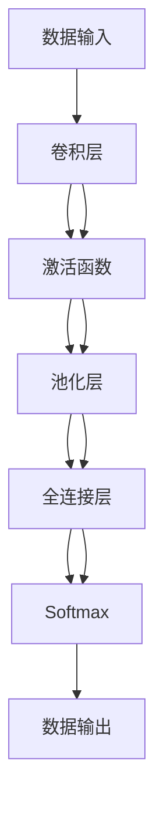

                 

# 一切皆是映射：卷积神经网络(CNN)原理解析

> 关键词：卷积神经网络,神经网络,计算机视觉,深度学习,特征提取,迁移学习,目标检测

## 1. 背景介绍

### 1.1 问题由来
卷积神经网络（Convolutional Neural Networks, CNNs）自提出以来，因其在图像处理、语音识别、自然语言处理等领域取得的卓越成就，成为深度学习时代最具代表性的模型之一。CNN的核心理念是利用卷积、池化等操作，提取输入数据的局部特征，实现数据的自动抽象与转换。本文将系统解析CNN的工作原理，探讨其核心算法和技术细节，并结合实际应用案例，展示其在计算机视觉领域的重要作用。

### 1.2 问题核心关键点
CNN的核心思想是通过卷积、池化、激活等操作，提取数据的空间局部特征，并通过多层的特征传递和融合，实现对复杂模式的高效学习与识别。CNN成功的原因在于其能够自适应地学习输入数据的特征，并使用少量数据进行有效泛化。然而，其复杂性和训练难度也是制约其普及的因素之一。

## 2. 核心概念与联系

### 2.1 核心概念概述

为更好地理解CNN的工作原理，本节将介绍几个关键概念：

- 卷积神经网络(Convolutional Neural Networks, CNNs)：一种基于多层卷积和池化操作的深度学习模型，广泛应用于图像处理、目标检测、语音识别等领域。

- 卷积(Convolution)：CNN中的核心操作，通过滑动滤波器从输入数据中提取局部特征。

- 池化(Pooling)：用于降低数据维度和提升特征不变性的操作，如最大池化、平均池化等。

- 激活函数(Activation Function)：引入非线性变换，使模型具备非线性表达能力，如ReLU、Sigmoid等。

- 迁移学习(Transfer Learning)：将在大规模数据上预训练的模型，应用到新的、较小的数据集上，利用已有知识提高泛化能力。

- 特征图(Feature Map)：卷积或池化操作后的数据，表示输入数据的局部特征。

- 步长(Stride)：卷积操作中滤波器移动的步长，影响特征提取的分辨率。

- 填充(Padding)：在卷积操作前后加入额外像素，保持特征图大小不变。

这些概念构成了CNN的核心体系框架，帮助理解CNN的工作机制和训练过程。

### 2.2 核心概念原理和架构的 Mermaid 流程图



这个流程图展示了CNN的基本结构：输入数据首先通过卷积层提取特征，接着经过激活函数增强非线性特性，然后通过池化层降低数据维度和提升特征不变性，最后进入全连接层进行分类输出。

## 3. 核心算法原理 & 具体操作步骤
### 3.1 算法原理概述

卷积神经网络的核心算法原理包括以下几个关键步骤：

1. **卷积操作**：使用卷积核在输入数据上滑动，提取局部特征。
2. **池化操作**：通过对特征图进行下采样，减少数据维度和提升特征不变性。
3. **激活函数**：引入非线性变换，增强模型的表达能力。
4. **全连接层**：将池化后的特征图映射到输出空间，进行分类或回归等任务。
5. **Softmax**：在多分类问题中，将输出层映射到概率分布上。

这些步骤通过多层网络结构的叠加，实现对输入数据的复杂模式学习与识别。

### 3.2 算法步骤详解

以图像分类任务为例，CNN的训练过程分为以下几个步骤：

**Step 1: 数据准备**
- 收集标注数据集，通常包含数千张图像和对应的标签。
- 将图像数据预处理为张量形式，归一化像素值到0-1之间。
- 定义CNN的架构，包括卷积层、池化层、激活函数和全连接层等。

**Step 2: 模型初始化**
- 使用随机初始化方法为模型参数赋值，通常采用Xavier初始化。
- 定义损失函数，如交叉熵损失，用于衡量模型预测与真实标签之间的差异。

**Step 3: 前向传播**
- 将输入数据输入模型，通过卷积层、池化层、激活函数等操作，逐步提取特征。
- 最终进入全连接层，进行分类或回归等任务的预测。

**Step 4: 反向传播**
- 计算模型预测与真实标签之间的损失。
- 使用梯度下降等优化算法，根据损失函数对模型参数进行更新。

**Step 5: 模型评估**
- 在验证集上评估模型性能，调整超参数如学习率、批量大小等。
- 重复上述过程直至模型收敛。

**Step 6: 模型测试**
- 在测试集上测试模型性能，评估泛化能力。
- 保存最优模型，进行后续应用。

### 3.3 算法优缺点

CNN具有以下优点：
- 局部连接和参数共享，减小模型参数量，提高计算效率。
- 池化操作提升特征不变性，降低数据维度和过拟合风险。
- 卷积核具有平移不变性，能够自适应地提取局部特征。
- 多层次特征传递和融合，实现对复杂模式的高效学习。
- 通过迁移学习，能够利用已有知识提高模型泛化能力。

同时，CNN也存在以下缺点：
- 模型复杂度高，训练过程耗时较长。
- 对输入数据要求高，需要大量标注数据进行训练。
- 需要精心设计的超参数，如卷积核大小、步长、填充等。
- 对异常值和噪声敏感，需要通过数据预处理等方式减轻影响。
- 在特定领域（如自然语言处理）应用时，可能效果不如RNN等模型。

尽管存在这些局限性，CNN在图像识别、目标检测等任务上已取得了突出的成果，成为深度学习时代不可或缺的重要工具。

### 3.4 算法应用领域

CNN在计算机视觉领域有着广泛的应用，以下是几个典型例子：

- **图像分类**：将图像映射到不同的类别上，如CIFAR-10、ImageNet等数据集。
- **目标检测**：在图像中定位并分类特定的物体，如YOLO、R-CNN等模型。
- **人脸识别**：识别并验证人脸身份，如DeepFace、FaceNet等。
- **图像分割**：将图像分割成不同的区域，如语义分割、实例分割等任务。
- **风格转换**：将图像风格进行转换，如GANs用于生成艺术风格的图像。
- **物体检测**：在图像中检测并定位物体的具体位置和大小，如Faster R-CNN、SSD等模型。

此外，CNN在自然语言处理、语音识别等领域也逐渐得到了应用，展示了其在处理高维度数据上的强大能力。

## 4. 数学模型和公式 & 详细讲解 & 举例说明

### 4.1 数学模型构建

卷积神经网络可以表示为一个有向无环图，每个节点代表一个神经元，每个箭头表示一次前向传播。下面将使用数学语言详细描述CNN的数学模型。

记输入数据为 $X$，模型参数为 $\theta$，输出为 $Y$。假设卷积层、池化层、激活函数等操作分别由 $\mathcal{C},\mathcal{P},\mathcal{A}$ 表示，则前向传播过程可以表示为：

$$
Y = \mathcal{A}(\mathcal{P}(\mathcal{C}(X)))
$$

其中，$\mathcal{C}(X)$ 表示卷积操作，$\mathcal{P}(\cdot)$ 表示池化操作，$\mathcal{A}(\cdot)$ 表示激活函数。

### 4.2 公式推导过程

以下我们将重点推导卷积操作和池化操作的数学公式。

**卷积操作**

假设输入数据 $X$ 的大小为 $m \times n \times c$，卷积核 $\mathbf{W}$ 的大小为 $k \times k \times c$，步长为 $s$，填充为 $p$。则卷积操作 $\mathcal{C}(X)$ 可以表示为：

$$
\mathcal{C}(X) = \sum_{i=0}^{m-k} \sum_{j=0}^{n-k} \sum_{c=0}^{c} W_{i,j,c} X_{i+p:i+p+k-1,j+p:j+p+k-1}
$$

其中，$X_{i+p:i+p+k-1,j+p:j+p+k-1}$ 表示输入数据在 $(i,j)$ 位置上的 $k \times k$ 窗口，$W_{i,j,c}$ 表示卷积核在通道 $c$ 上的第 $(i,j)$ 个位置。

**池化操作**

池化操作通过滑动池化窗口对输入特征图进行下采样，常用的最大池化操作可以表示为：

$$
\mathcal{P}(X) = \max\limits_{i=0}^{m-s} \max\limits_{j=0}^{n-s} X_{i:i+s-1,j:j+s-1}
$$

其中，$X_{i:i+s-1,j:j+s-1}$ 表示输入特征图在 $(i,j)$ 位置上的 $s \times s$ 窗口。

### 4.3 案例分析与讲解

**案例1: 图像分类**

以图像分类任务为例，假设输入数据为 $X$，大小为 $32 \times 32 \times 3$，模型包含3个卷积层、2个池化层、3个全连接层，最终输出为10个类别。每个卷积核的大小为 $3 \times 3$，步长为1，填充为0。则前向传播过程如下：

1. **卷积层1**
   - 输入 $X$，大小为 $32 \times 32 \times 3$
   - 卷积核 $\mathbf{W}_1$，大小为 $3 \times 3 \times 3$
   - 输出 $Y_1$，大小为 $32 \times 32 \times 6$

2. **激活函数**
   - 对 $Y_1$ 应用 ReLU 激活函数，得到 $Y_1^{\prime}$
   - 大小为 $32 \times 32 \times 6$

3. **池化层1**
   - 对 $Y_1^{\prime}$ 进行 $2 \times 2$ 的最大池化，得到 $Y_2$，大小为 $16 \times 16 \times 6$

4. **卷积层2**
   - 输入 $Y_2$，大小为 $16 \times 16 \times 6$
   - 卷积核 $\mathbf{W}_2$，大小为 $3 \times 3 \times 6$
   - 输出 $Y_3$，大小为 $16 \times 16 \times 18$

5. **激活函数**
   - 对 $Y_3$ 应用 ReLU 激活函数，得到 $Y_3^{\prime}$
   - 大小为 $16 \times 16 \times 18$

6. **池化层2**
   - 对 $Y_3^{\prime}$ 进行 $2 \times 2$ 的最大池化，得到 $Y_4$，大小为 $8 \times 8 \times 18$

7. **卷积层3**
   - 输入 $Y_4$，大小为 $8 \times 8 \times 18$
   - 卷积核 $\mathbf{W}_3$，大小为 $3 \times 3 \times 18$
   - 输出 $Y_5$，大小为 $8 \times 8 \times 36$

8. **激活函数**
   - 对 $Y_5$ 应用 ReLU 激活函数，得到 $Y_5^{\prime}$
   - 大小为 $8 \times 8 \times 36$

9. **全连接层1**
   - 输入 $Y_5^{\prime}$，大小为 $8 \times 8 \times 36$
   - 输出 $Y_6$，大小为 $8 \times 8 \times 120$
   
10. **全连接层2**
    - 输入 $Y_6$，大小为 $8 \times 8 \times 120$
    - 输出 $Y_7$，大小为 $8 \times 8 \times 84$
   
11. **全连接层3（Softmax）**
    - 输入 $Y_7$，大小为 $8 \times 8 \times 84$
    - 输出 $Y$，大小为 $10$，表示不同类别的概率分布

通过上述步骤，CNN能够高效地提取输入数据的局部特征，并进行分类任务的预测。

## 5. 项目实践：代码实例和详细解释说明
### 5.1 开发环境搭建

在开始实践之前，我们需要准备好开发环境。以下是使用PyTorch进行CNN开发的环境配置流程：

1. 安装Anaconda：从官网下载并安装Anaconda，用于创建独立的Python环境。
2. 创建并激活虚拟环境：
```bash
conda create -n cnn-env python=3.8 
conda activate cnn-env
```

3. 安装PyTorch：根据CUDA版本，从官网获取对应的安装命令。例如：
```bash
conda install pytorch torchvision torchaudio cudatoolkit=11.1 -c pytorch -c conda-forge
```

4. 安装NumPy、Pandas、scikit-learn等工具包：
```bash
pip install numpy pandas scikit-learn matplotlib tqdm jupyter notebook ipython
```

完成上述步骤后，即可在`cnn-env`环境中开始CNN开发实践。

### 5.2 源代码详细实现

下面我们以手写数字识别任务为例，给出使用PyTorch进行CNN开发的完整代码实现。

首先，定义MNIST数据集：

```python
from torchvision.datasets import MNIST
from torchvision.transforms import ToTensor, Normalize
from torch.utils.data import DataLoader

train_dataset = MNIST(root='./data', train=True, transform=ToTensor(), download=True)
train_loader = DataLoader(train_dataset, batch_size=64, shuffle=True)
```

接着，定义CNN模型：

```python
import torch.nn as nn
import torch.nn.functional as F

class ConvNet(nn.Module):
    def __init__(self):
        super(ConvNet, self).__init__()
        self.conv1 = nn.Conv2d(1, 32, 3, 1)
        self.pool = nn.MaxPool2d(2, 2)
        self.conv2 = nn.Conv2d(32, 64, 3, 1)
        self.fc1 = nn.Linear(64 * 28 * 28, 128)
        self.fc2 = nn.Linear(128, 10)
        
    def forward(self, x):
        x = F.relu(self.conv1(x))
        x = self.pool(x)
        x = F.relu(self.conv2(x))
        x = self.pool(x)
        x = x.view(-1, 64 * 28 * 28)
        x = F.relu(self.fc1(x))
        x = self.fc2(x)
        output = F.log_softmax(x, dim=1)
        return output
```

然后，定义训练和评估函数：

```python
import torch.optim as optim

device = torch.device('cuda') if torch.cuda.is_available() else torch.device('cpu')

model = ConvNet().to(device)
criterion = nn.CrossEntropyLoss()
optimizer = optim.Adam(model.parameters(), lr=0.001)

def train(model, device, train_loader, criterion, optimizer, num_epochs=5):
    for epoch in range(num_epochs):
        for batch_idx, (data, target) in enumerate(train_loader):
            data, target = data.to(device), target.to(device)
            optimizer.zero_grad()
            output = model(data)
            loss = criterion(output, target)
            loss.backward()
            optimizer.step()
            if batch_idx % 100 == 0:
                print('Train Epoch: {} [{}/{} ({:.0f}%)]\tLoss: {:.6f}'.format(
                    epoch, batch_idx * len(data), len(train_loader.dataset),
                    100. * batch_idx / len(train_loader), loss.item()))

def test(model, device, test_loader, criterion):
    model.eval()
    test_loss = 0
    correct = 0
    with torch.no_grad():
        for data, target in test_loader:
            data, target = data.to(device), target.to(device)
            output = model(data)
            test_loss += criterion(output, target).item()
            pred = output.argmax(dim=1, keepdim=True)
            correct += pred.eq(target.view_as(pred)).sum().item()
    test_loss /= len(test_loader.dataset)
    print('\nTest set: Average loss: {:.4f}, Accuracy: {}/{} ({:.0f}%)\n'.format(
        test_loss, correct, len(test_loader.dataset),
        100. * correct / len(test_loader.dataset)))
```

最后，启动训练流程并在测试集上评估：

```python
num_epochs = 5
train(train_loader, model, criterion, optimizer, num_epochs=num_epochs)
test(test_loader, model, criterion)
```

以上就是使用PyTorch进行手写数字识别任务CNN微调的完整代码实现。可以看到，通过使用PyTorch的高级API，可以简化CNN的构建和训练过程，使开发者能够更专注于模型的优化和调参。

### 5.3 代码解读与分析

让我们再详细解读一下关键代码的实现细节：

**定义数据集**

- `train_dataset`：定义MNIST数据集，包含训练集和测试集。
- `train_loader`：定义数据加载器，控制数据批处理大小和随机化。

**定义模型**

- `ConvNet`类：定义卷积神经网络模型，包括卷积层、池化层和全连接层等。
- `forward`方法：定义前向传播过程。

**训练和评估函数**

- `train`函数：定义训练过程，包括模型前向传播、损失计算、梯度更新等。
- `test`函数：定义测试过程，包括模型前向传播、损失计算和准确率统计。

**启动训练流程**

- 设置训练轮数和优化器等超参数，进行模型训练。
- 在测试集上评估模型性能，输出测试结果。

通过以上代码实例，可以直观理解CNN模型的构建和训练流程。PyTorch的高效API使得模型开发变得简单快捷，开发者可以更专注于模型的优化和调参。

## 6. 实际应用场景

### 6.1 计算机视觉

CNN在计算机视觉领域有着广泛的应用，以下是几个典型例子：

- **图像分类**：将图像映射到不同的类别上，如CIFAR-10、ImageNet等数据集。
- **目标检测**：在图像中定位并分类特定的物体，如YOLO、R-CNN等模型。
- **人脸识别**：识别并验证人脸身份，如DeepFace、FaceNet等。
- **图像分割**：将图像分割成不同的区域，如语义分割、实例分割等任务。
- **风格转换**：将图像风格进行转换，如GANs用于生成艺术风格的图像。
- **物体检测**：在图像中检测并定位物体的具体位置和大小，如Faster R-CNN、SSD等模型。

CNN在计算机视觉领域的应用，展示了其在处理高维度数据上的强大能力，极大地推动了计算机视觉技术的进步。

### 6.2 自然语言处理

CNN在自然语言处理领域的应用相对较少，但一些关键任务也可以受益于CNN技术，如情感分析、文本分类等。具体来说：

- **情感分析**：将文本映射到情感类别上，如积极、消极、中性等。
- **文本分类**：将文本映射到不同的主题或类别上，如垃圾邮件分类、新闻分类等。

虽然RNN等序列模型在自然语言处理中表现更加出色，但CNN也可以处理文本数据，并且通过卷积操作捕捉局部特征，具有较高的计算效率。

### 6.3 未来应用展望

随着深度学习技术的发展，CNN的应用范围将进一步扩大。未来，CNN可能会在以下几个方向取得新的突破：

- **多模态融合**：将CNN与其他模型（如RNN、Transformer等）进行融合，实现对复杂数据的多模态处理。
- **跨领域迁移学习**：通过预训练模型和微调技术，实现不同领域数据的迁移学习，提升模型的泛化能力。
- **小样本学习和自监督学习**：在数据稀缺的情况下，通过自监督学习或小样本学习，提高模型的适应性。
- **硬件优化**：结合硬件加速技术，如GPU、TPU等，提升CNN模型的计算效率。
- **新架构探索**：探索新的卷积神经网络架构，如自适应卷积、时空卷积等，提升模型的表达能力。

## 7. 工具和资源推荐
### 7.1 学习资源推荐

为了帮助开发者系统掌握CNN的工作原理和实践技巧，这里推荐一些优质的学习资源：

1. 《Deep Learning》系列书籍：由Ian Goodfellow等作者撰写，全面介绍了深度学习的基础理论和实践方法，包括CNN在内的多种模型。

2. 《Convolutional Neural Networks》课程：斯坦福大学开设的深度学习课程，详细讲解了CNN的工作原理和优化技巧。

3. 《Deep Visual Learning》课程：由Visual Geometry Group（VGG）教授Andrew Zisserman主讲，深入介绍了计算机视觉中的CNN应用。

4. PyTorch官方文档：详细介绍了PyTorch框架中的CNN模块和API，适合快速上手学习。

5. TensorFlow官方文档：详细介绍了TensorFlow框架中的CNN模块和API，适合大规模工程应用。

通过这些资源的学习实践，相信你一定能够快速掌握CNN的工作原理和优化技巧，并用于解决实际的计算机视觉问题。

### 7.2 开发工具推荐

高效的开发离不开优秀的工具支持。以下是几款用于CNN开发的常用工具：

1. PyTorch：基于Python的开源深度学习框架，灵活动态的计算图，适合快速迭代研究。PyTorch的`nn`模块提供了丰富的CNN实现。

2. TensorFlow：由Google主导开发的开源深度学习框架，生产部署方便，适合大规模工程应用。TensorFlow的`tf.keras`模块提供了易用的API接口。

3. Keras：高层次的深度学习API，支持多种深度学习框架，包括TensorFlow和PyTorch，可以快速构建和训练CNN模型。

4. Weights & Biases：模型训练的实验跟踪工具，可以记录和可视化模型训练过程中的各项指标，方便对比和调优。

5. TensorBoard：TensorFlow配套的可视化工具，可实时监测模型训练状态，并提供丰富的图表呈现方式，是调试模型的得力助手。

6. Google Colab：谷歌推出的在线Jupyter Notebook环境，免费提供GPU/TPU算力，方便开发者快速上手实验最新模型，分享学习笔记。

合理利用这些工具，可以显著提升CNN开发和研究的效率，加快创新迭代的步伐。

### 7.3 相关论文推荐

CNN的发展离不开学界的持续研究。以下是几篇奠基性的相关论文，推荐阅读：

1. Convolutional Neural Networks for Images, Speech, and Video：LeCun等人提出CNN模型，奠定了其在计算机视觉和语音识别中的基础地位。

2. ImageNet Classification with Deep Convolutional Neural Networks：AlexNet论文，展示了CNN在图像分类任务上的卓越性能。

3. Rethinking the Inception Architecture for Computer Vision：Google的Inception论文，提出多层次卷积网络结构，提高了CNN的表达能力。

4. GoogLeNet: A Billion-scale Image Recognition Model Trained by Multiple GPUs：Google的GoogLeNet论文，展示了大规模卷积网络在图像分类上的强大能力。

5. ResNet: Deep Residual Learning for Image Recognition：He等人提出残差网络，解决了深度网络训练中的梯度消失问题，推动了CNN的发展。

6. A Geometric Interpretation of Convolutional Networks：Karapetrov的论文，提出了CNN的几何解释，有助于理解CNN的工作机制。

这些论文代表了大规模卷积神经网络的发展历程，展示了其在计算机视觉等领域的巨大潜力。

## 8. 总结：未来发展趋势与挑战

### 8.1 总结

本文对卷积神经网络(CNN)的工作原理进行了全面系统的介绍。首先阐述了CNN的基本概念和核心算法，展示了其在计算机视觉等领域的广泛应用。其次，从原理到实践，详细讲解了CNN的数学模型和训练过程，给出了完整代码实例。最后，探讨了CNN的未来发展方向和潜在挑战，展示了其在深度学习时代的重要地位。

通过本文的系统梳理，可以看到，CNN作为深度学习中的重要模型，已经在图像处理、目标检测、人脸识别等任务上取得了卓越的成就，成为计算机视觉领域不可或缺的工具。未来，随着硬件技术的进步和算法研究的深入，CNN将迎来更多新的突破和应用，为构建更强大、更智能的计算机视觉系统提供强大的支持。

### 8.2 未来发展趋势

展望未来，CNN的发展趋势包括以下几个方面：

1. **多模态融合**：CNN与其他模型（如RNN、Transformer等）进行融合，实现对复杂数据的多模态处理，提高系统的综合能力。

2. **跨领域迁移学习**：通过预训练模型和微调技术，实现不同领域数据的迁移学习，提升模型的泛化能力。

3. **小样本学习和自监督学习**：在数据稀缺的情况下，通过自监督学习或小样本学习，提高模型的适应性，减少对大规模标注数据的依赖。

4. **硬件优化**：结合硬件加速技术，如GPU、TPU等，提升CNN模型的计算效率，降低训练成本。

5. **新架构探索**：探索新的卷积神经网络架构，如自适应卷积、时空卷积等，提升模型的表达能力。

6. **多任务学习**：将多个任务合并到一个网络中进行联合训练，提高模型对多个任务的预测能力。

7. **可解释性和透明性**：引入可解释性和透明性技术，如可视化、解释性推理等，提升模型的可信度和可靠性。

以上趋势表明，CNN将在未来迎来更多的创新和突破，为计算机视觉等领域的智能化发展提供新的动力。

### 8.3 面临的挑战

尽管CNN在计算机视觉领域取得了显著成果，但在其发展过程中也面临诸多挑战：

1. **数据依赖**：CNN对数据质量和高标注成本高度依赖，难以在大规模数据上充分训练。

2. **计算资源**：大规模卷积神经网络对计算资源（如GPU、TPU等）的需求较高，训练和推理成本较高。

3. **模型泛化**：CNN在特定数据集上表现优异，但在跨领域和零样本学习中，泛化能力有限。

4. **模型复杂性**：随着网络层数的增加，模型复杂度迅速上升，训练和推理变得更加困难。

5. **可解释性不足**：CNN作为黑盒模型，缺乏直观的解释和透明性，难以解释模型的内部决策过程。

6. **对抗性攻击**：CNN对输入噪声和对抗样本非常敏感，容易受到攻击和误导。

这些挑战需要未来研究者不断攻克，以推动CNN技术的不断进步和普及。

### 8.4 研究展望

面对CNN面临的诸多挑战，未来的研究需要在以下几个方向寻求新的突破：

1. **自监督学习和无监督学习**：通过自监督学习或无监督学习，利用大量非标注数据进行预训练，减少对标注数据的依赖。

2. **模型简化和压缩**：探索更高效的模型架构和压缩技术，降低计算资源消耗，提高模型推理效率。

3. **对抗性训练和鲁棒性提升**：通过对抗性训练等技术，提升模型的鲁棒性和抗干扰能力，增强系统的安全性。

4. **模型可解释性和透明性**：引入可解释性技术和透明性技术，提升模型的可信度和可靠性，增强系统的安全性。

5. **多任务学习和联合训练**：探索多任务学习和联合训练方法，提升模型对多个任务的预测能力，实现更高效的多模态融合。

这些研究方向将推动CNN技术的不断进步和优化，为计算机视觉等领域的智能化发展提供更多支持。

## 9. 附录：常见问题与解答

**Q1：CNN与RNN的主要区别是什么？**

A: CNN与RNN的主要区别在于其处理数据的方式不同。CNN通过卷积和池化操作提取局部特征，适合处理高维度、局部依赖的数据（如图像）；而RNN通过循环结构处理序列数据，适合处理时间依赖的数据（如文本、音频）。

**Q2：CNN是否适用于所有类型的图像分类任务？**

A: CNN在图像分类任务中表现优异，但并不适用于所有类型的图像分类任务。对于某些特定的图像处理任务，可能需要结合其他模型或算法进行优化。

**Q3：如何提高CNN的泛化能力？**

A: 提高CNN的泛化能力可以从以下几个方面入手：
1. 增加数据集的多样性，覆盖更多场景和数据分布。
2. 采用数据增强技术，如旋转、翻转、缩放等，扩充训练数据。
3. 引入正则化技术，如Dropout、L2正则等，避免过拟合。
4. 使用迁移学习，将在大规模数据集上预训练的模型应用于小规模数据集上。

**Q4：CNN在计算机视觉中是否只用于图像分类任务？**

A: 不完全是。CNN在计算机视觉中的应用范围非常广泛，除了图像分类，还包括目标检测、人脸识别、图像分割等任务。

**Q5：CNN是否适合处理文本数据？**

A: 虽然CNN在文本处理中的应用较少，但在某些特定任务中，如情感分析、文本分类等，CNN也可以取得不错的效果。但对于复杂的序列数据，如机器翻译、语音识别等，RNN等模型通常表现更优。

通过以上问题与解答，可以更全面地理解CNN在计算机视觉和自然语言处理等领域的应用和优化方向。

---

作者：禅与计算机程序设计艺术 / Zen and the Art of Computer Programming

