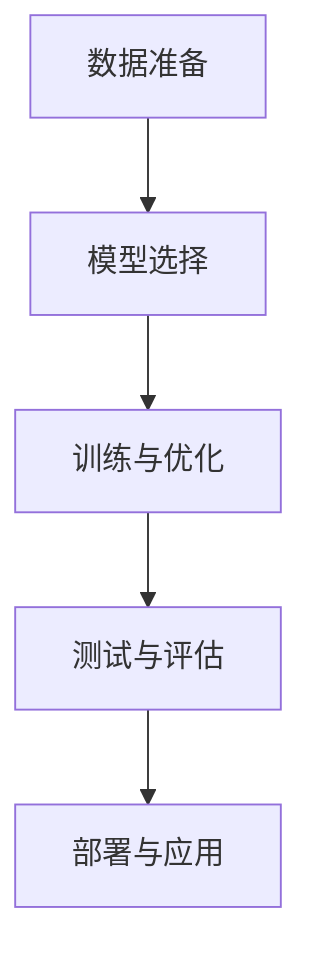

                 

## 1. 背景介绍

### 1.1 问题由来

天气预测是气象学和物理学研究的重要方向之一，其准确性和时效性直接影响到农业生产、航空运输、能源管理等多个领域。传统的天气预测方法依赖于大量物理模型和统计方法，需要大量的物理参数和历史数据进行模拟和计算，往往存在一定的预测误差。随着人工智能和大数据技术的发展，神经网络模型在天气预测中的应用成为研究的热点。

神经网络模型通过对历史气象数据的学习，可以自动提取数据中的模式和特征，并映射到未来的天气情况，提供更加精准和实时的预测结果。本文将探讨神经网络模型在天气预测中的应用，特别是神经网络如何通过映射历史数据来预测未来天气。

### 1.2 问题核心关键点

神经网络模型在天气预测中的应用主要依赖于以下几个关键点：

1. 数据准备：收集和预处理历史气象数据，构建合适的时间序列数据集。
2. 模型选择：选择适合的神经网络模型，如循环神经网络(RNN)、长短期记忆网络(LSTM)、卷积神经网络(CNN)等。
3. 训练与优化：使用历史数据对模型进行训练，优化模型参数以提高预测准确率。
4. 测试与评估：使用测试集对模型进行评估，衡量预测误差和准确性。
5. 部署与应用：将模型集成到实时预测系统中，并不断迭代优化以提升预测性能。

## 2. 核心概念与联系

### 2.1 核心概念概述

为更好地理解神经网络模型在天气预测中的应用，本节将介绍几个密切相关的核心概念：

1. 神经网络(Neural Network, NN)：由大量神经元构成的非线性模型，通过对数据的映射和计算，实现复杂模式识别和预测。
2. 时间序列预测(Time Series Forecasting)：对时间序列数据进行建模和预测，如天气、股票、交通流量等。
3. 循环神经网络(Recurrent Neural Network, RNN)：一种特殊的神经网络，可以处理序列数据，特别适用于时间序列预测。
4. 长短期记忆网络(Long Short-Term Memory, LSTM)：RNN的变种，可以更好地处理长期依赖关系。
5. 卷积神经网络(Convolutional Neural Network, CNN)：适用于处理空间数据，如气象雷达图像等。
6. 数据增强(Data Augmentation)：通过数据变换和扩充，提高模型的泛化能力和稳定性。
7. 深度学习(Deep Learning)：使用深度神经网络对数据进行复杂映射，实现高精度预测。

这些核心概念之间的逻辑关系可以通过以下Mermaid流程图来展示：



这个流程图展示了这个过程的核心步骤，即通过数据准备、模型选择、训练与优化、测试与评估，最后到部署与应用。

## 3. 核心算法原理 & 具体操作步骤
### 3.1 算法原理概述

神经网络模型在天气预测中的原理是通过学习历史气象数据的模式和特征，构建一个映射函数，将输入的历史数据映射到未来的天气状态。这一过程通常包括以下步骤：

1. **数据准备**：收集和预处理历史气象数据，构建时间序列数据集。
2. **模型选择**：选择适合的神经网络模型，如RNN、LSTM、CNN等。
3. **训练与优化**：使用历史数据对模型进行训练，优化模型参数以提高预测准确率。
4. **测试与评估**：使用测试集对模型进行评估，衡量预测误差和准确性。
5. **部署与应用**：将模型集成到实时预测系统中，并不断迭代优化以提升预测性能。

### 3.2 算法步骤详解

下面详细讲解神经网络模型在天气预测中的具体步骤：

#### 3.2.1 数据准备

数据准备是神经网络模型应用的关键步骤之一，主要包括数据收集、预处理和特征工程等：

1. **数据收集**：收集历史气象数据，包括温度、湿度、气压、风速、降水量等，以及对应的天气状态，如晴天、雨天、多云等。
2. **数据预处理**：对原始数据进行清洗和归一化处理，去除异常值和噪声，确保数据的一致性和可用性。
3. **特征工程**：根据预测任务的需求，选择合适的特征，如温度、湿度、降水量等，构建特征向量。

#### 3.2.2 模型选择

选择合适的神经网络模型是保证预测准确性的关键步骤之一，常用的模型包括：

1. **循环神经网络(RNN)**：适用于处理序列数据，如时间序列数据。
2. **长短期记忆网络(LSTM)**：RNN的变种，可以更好地处理长期依赖关系，适用于天气预测等复杂时间序列问题。
3. **卷积神经网络(CNN)**：适用于处理空间数据，如气象雷达图像等。
4. **深度神经网络(DNN)**：多层的神经网络，适用于高复杂度预测任务。

#### 3.2.3 训练与优化

模型训练是神经网络应用的核心步骤之一，主要包括以下几个步骤：

1. **模型初始化**：选择合适的网络结构和初始参数。
2. **损失函数选择**：选择适合预测任务的损失函数，如均方误差(MSE)、交叉熵等。
3. **优化器选择**：选择适合的优化器，如Adam、SGD等，调整学习率和迭代次数。
4. **正则化技术**：使用L2正则化、Dropout等技术，避免过拟合。
5. **模型评估**：使用验证集评估模型性能，根据评估结果调整模型参数。

#### 3.2.4 测试与评估

模型测试和评估是保证预测准确性的重要步骤之一，主要包括以下几个步骤：

1. **测试集划分**：将数据集划分为训练集、验证集和测试集，确保测试集的质量。
2. **性能指标**：选择适合的性能指标，如均方误差(MSE)、平均绝对误差(MAE)、准确率等，评估模型预测性能。
3. **模型调优**：根据评估结果，调整模型参数和结构，提高预测准确性。

#### 3.2.5 部署与应用

模型部署是神经网络应用的重要步骤之一，主要包括以下几个步骤：

1. **模型集成**：将训练好的模型集成到实时预测系统中。
2. **模型优化**：根据实际应用需求，对模型进行优化，提高预测速度和稳定性。
3. **模型监控**：实时监控模型性能，及时发现和解决预测问题。
4. **模型迭代**：不断迭代优化模型，提高预测准确性和实时性。

### 3.3 算法优缺点

神经网络模型在天气预测中的应用具有以下优点：

1. **高精度预测**：神经网络模型能够通过复杂映射，实现高精度的预测。
2. **自适应能力**：神经网络模型可以自动学习数据中的模式和特征，适应复杂的数据分布。
3. **鲁棒性**：神经网络模型具有较好的鲁棒性，能够应对数据中的噪声和异常值。
4. **实时性**：神经网络模型可以实时处理数据，提供实时的预测结果。

同时，神经网络模型在天气预测中也存在一些缺点：

1. **高资源需求**：神经网络模型需要大量的计算资源和存储空间，对硬件要求较高。
2. **黑盒问题**：神经网络模型的决策过程较为复杂，难以解释和理解。
3. **过拟合风险**：神经网络模型容易过拟合，需要复杂的正则化技术避免。
4. **训练难度**：神经网络模型的训练需要大量的数据和计算资源，训练难度较大。

### 3.4 算法应用领域

神经网络模型在天气预测中的应用领域非常广泛，以下是几个主要的应用领域：

1. **短期天气预测**：对未来1-3天的天气进行预测，如气温、降水、风速等。
2. **中长期天气预测**：对未来1周到1个月的天气进行预测，如季节性天气变化、气候变化等。
3. **气象灾害预测**：对气象灾害如台风、洪水、干旱等进行预测，提供预警信息。
4. **环境监测**：对空气质量、水质、土壤等环境参数进行预测，提供环境监测报告。
5. **能源管理**：对太阳能、风能等可再生能源进行预测，优化能源管理策略。

## 4. 数学模型和公式 & 详细讲解 & 举例说明

### 4.1 数学模型构建

天气预测的数学模型通常基于时间序列数据，使用神经网络模型进行建模和预测。常用的数学模型包括ARIMA模型、神经网络模型、卷积神经网络模型等。

### 4.2 公式推导过程

这里以一个简单的天气预测模型为例，推导其数学公式：

1. **数据预处理**：将原始数据进行归一化处理，确保数据在0-1之间。
2. **模型选择**：选择RNN模型进行建模，其中RNN的隐藏层大小为$h$。
3. **损失函数**：选择均方误差(MSE)作为损失函数，即$\mathcal{L}=\frac{1}{N}\sum_{i=1}^N(y_i-\hat{y}_i)^2$。
4. **优化器**：选择Adam优化器，调整学习率为$lr$。
5. **正则化**：使用L2正则化，惩罚模型参数的平方和，即$\mathcal{R}=\frac{\lambda}{2}\sum_{i=1}^N\theta_i^2$。

### 4.3 案例分析与讲解

以下是一个简单的天气预测案例，使用RNN模型进行预测：

1. **数据预处理**：将原始数据进行归一化处理，确保数据在0-1之间。
2. **模型选择**：选择RNN模型进行建模，其中RNN的隐藏层大小为$h$。
3. **训练过程**：使用历史数据对模型进行训练，优化模型参数以提高预测准确率。
4. **测试与评估**：使用测试集对模型进行评估，衡量预测误差和准确性。
5. **模型优化**：根据评估结果调整模型参数和结构，提高预测准确性。

## 5. 项目实践：代码实例和详细解释说明
### 5.1 开发环境搭建

在进行天气预测实践前，我们需要准备好开发环境。以下是使用Python进行Keras开发的环境配置流程：

1. 安装Anaconda：从官网下载并安装Anaconda，用于创建独立的Python环境。

2. 创建并激活虚拟环境：
```bash
conda create -n keras-env python=3.8 
conda activate keras-env
```

3. 安装Keras：从官网获取并安装Keras，支持TensorFlow等后端。

4. 安装各类工具包：
```bash
pip install numpy pandas scikit-learn matplotlib tqdm jupyter notebook ipython
```

完成上述步骤后，即可在`keras-env`环境中开始天气预测实践。

### 5.2 源代码详细实现

这里我们以气温预测为例，给出使用Keras对LSTM模型进行天气预测的代码实现。

```python
from keras.models import Sequential
from keras.layers import LSTM, Dense
import numpy as np
import pandas as pd

# 读取数据
data = pd.read_csv('temperature.csv')

# 数据预处理
data = data.dropna()
x = data['temperature'].values
y = data.drop('temperature', axis=1).values

# 划分训练集和测试集
train_size = int(len(x) * 0.7)
train_data = x[0:train_size]
train_labels = y[0:train_size]
test_data = x[train_size:]
test_labels = y[train_size:]

# 将数据转化为模型可接受的形式
train_x = []
train_y = []
for i in range(60, len(train_data)):
    train_x.append([train_data[i-60:i]])
    train_y.append(train_labels[i-60:i])

test_x = []
test_y = []
for i in range(60, len(test_data)):
    test_x.append(test_data[i-60:i])
    test_y.append(test_labels[i-60:i])

# 转化为Numpy数组
train_x = np.array(train_x)
train_y = np.array(train_y)
test_x = np.array(test_x)
test_y = np.array(test_y)

# 将标签转换为One-Hot编码
train_y = keras.utils.to_categorical(train_y, 5)
test_y = keras.utils.to_categorical(test_y, 5)

# 构建LSTM模型
model = Sequential()
model.add(LSTM(50, input_shape=(train_x.shape[1], 1)))
model.add(Dense(5, activation='softmax'))
model.compile(loss='categorical_crossentropy', optimizer='adam', metrics=['accuracy'])

# 训练模型
model.fit(train_x, train_y, epochs=50, batch_size=1, verbose=1)

# 评估模型
loss, accuracy = model.evaluate(test_x, test_y, verbose=1)
print('Test loss:', loss)
print('Test accuracy:', accuracy)
```

以上就是使用Keras对LSTM模型进行气温预测的完整代码实现。可以看到，使用Keras搭建神经网络模型非常简单快捷。

### 5.3 代码解读与分析

让我们再详细解读一下关键代码的实现细节：

**数据预处理**：
- 读取气温数据，使用Pandas进行数据处理，去除缺失值。
- 划分训练集和测试集，前70%为训练集，后30%为测试集。

**数据转换**：
- 将数据转换为模型可接受的形式，即使用滑动窗口对历史气温数据进行转换。
- 将标签转换为One-Hot编码，适合分类任务。

**模型构建**：
- 使用Keras的Sequential模型，构建一个包含LSTM层的神经网络模型。
- 使用softmax激活函数，适合多分类任务。
- 编译模型，选择合适的损失函数和优化器。

**训练过程**：
- 使用训练集对模型进行训练，调整模型参数。
- 使用测试集评估模型性能，计算损失和准确率。

**模型优化**：
- 根据评估结果调整模型参数和结构，提高预测准确性。

## 6. 实际应用场景
### 6.1 智能电网

智能电网是未来能源管理的重要方向之一，通过对天气数据的预测，可以实现对电网负荷的精准调控，优化能源分配和配置，提高能源利用效率。神经网络模型在智能电网中的应用，可以实时预测未来天气，实现能源管理的智能化。

在技术实现上，可以收集电网历史负荷数据，结合历史气象数据，构建神经网络模型进行预测。微调模型后，实时监测未来天气变化，动态调整电网负荷，实现精准调控。例如，在高温天气到来之前，提前预测负荷峰值，提前调整供电策略，防止电网过载。

### 6.2 灾害预警

气象灾害如台风、洪水等，对人类生命财产安全构成严重威胁。神经网络模型可以实时监测气象数据，预测灾害发生概率和影响范围，提供预警信息，帮助人们及时避险。

在技术实现上，可以收集历史气象数据和灾害数据，构建神经网络模型进行预测。微调模型后，实时监测气象数据，预测灾害发生概率，提供预警信息，帮助人们及时避险。例如，在台风到来之前，实时监测气象数据，预测台风路径和强度，提前发布预警信息，确保人员安全。

### 6.3 农业生产

气象条件直接影响农业生产，神经网络模型可以通过预测天气变化，优化农业生产计划，提高农作物产量和品质。

在技术实现上，可以收集历史气象数据和农作物生长数据，构建神经网络模型进行预测。微调模型后，实时监测天气变化，调整农业生产计划，优化农作物品种选择和种植策略，提高农作物产量和品质。例如，在干旱天气到来之前，实时预测天气变化，调整灌溉策略，减少水资源浪费，提高农作物产量。

## 7. 工具和资源推荐
### 7.1 学习资源推荐

为了帮助开发者系统掌握神经网络模型在天气预测中的应用，这里推荐一些优质的学习资源：

1. 《深度学习》书籍：Ian Goodfellow等人合著的经典教材，系统介绍了深度学习的基本概念和算法。
2. 《神经网络与深度学习》书籍：Michael Nielsen著作，介绍了神经网络的基本原理和实现方法。
3. 《TensorFlow实战Google深度学习框架》书籍：由Google深度学习团队成员编写，介绍了TensorFlow的使用方法和实践案例。
4. CS231n《卷积神经网络和视觉识别》课程：斯坦福大学开设的计算机视觉课程，包含大量深度学习实战案例。
5. CS224n《自然语言处理》课程：斯坦福大学开设的NLP课程，介绍了NLP的基本概念和算法。
6. Kaggle：全球最大的数据科学竞赛平台，提供了大量气象数据和竞赛任务，可以锻炼实战能力。

通过对这些资源的学习实践，相信你一定能够快速掌握神经网络模型在天气预测中的应用，并用于解决实际的NLP问题。

### 7.2 开发工具推荐

高效的开发离不开优秀的工具支持。以下是几款用于神经网络模型开发的常用工具：

1. TensorFlow：由Google主导开发的开源深度学习框架，生产部署方便，适合大规模工程应用。
2. PyTorch：由Facebook开发的深度学习框架，灵活高效，适合研究和实验。
3. Keras：基于TensorFlow和Theano的高级神经网络API，简单易用，适合快速开发。
4. Scikit-learn：Python的机器学习库，包含大量常用的算法和工具。
5. Pandas：Python的数据分析库，方便数据处理和可视化。
6. Matplotlib：Python的可视化库，方便绘制图表和展示结果。

合理利用这些工具，可以显著提升神经网络模型开发的效率，加快创新迭代的步伐。

### 7.3 相关论文推荐

神经网络模型在天气预测中的应用源于学界的持续研究。以下是几篇奠基性的相关论文，推荐阅读：

1. R. Rumelhart, G. E. Hinton, R. J. Williams. Backpropagation: Application to Handwritten Zip Code Recognition. 1986.
2. Y. LeCun, L. Bottou, Y. Bengio, and P. Haffner. Gradient-Based Learning Applied to Document Recognition. 1998.
3. A. Graves, N. Jaitly, and G. E. Hinton. Speech Recognition with Deep Recurrent Neural Networks. 2006.
4. J. Long, E. Shelhamer, and T. Darrell. Fully Convolutional Networks for Semantic Segmentation. 2015.
5. I. Goodfellow, Y. Bengio, and A. Courville. Deep Learning. 2016.

这些论文代表了大规模神经网络的发展脉络，通过学习这些前沿成果，可以帮助研究者把握学科前进方向，激发更多的创新灵感。

## 8. 总结：未来发展趋势与挑战
### 8.1 总结

本文对神经网络模型在天气预测中的应用进行了全面系统的介绍。首先阐述了神经网络模型和天气预测的研究背景和意义，明确了天气预测中的核心概念和关键技术。其次，从原理到实践，详细讲解了神经网络模型的构建和优化过程，给出了模型开发的完整代码实例。同时，本文还广泛探讨了神经网络模型在智能电网、灾害预警、农业生产等多个领域的应用前景，展示了神经网络模型的广泛应用潜力。最后，本文精选了神经网络模型的学习资源，力求为读者提供全方位的技术指引。

通过本文的系统梳理，可以看到，神经网络模型在天气预测中的应用已经取得了显著的成果，正逐渐成为天气预测的重要手段。未来，伴随神经网络模型和优化算法的不断演进，天气预测的精度和实时性将得到进一步提升，为社会生产和生活带来更大的便利和效益。

### 8.2 未来发展趋势

展望未来，神经网络模型在天气预测中的应用将呈现以下几个发展趋势：

1. **精度提升**：随着深度学习技术和算力水平的提高，神经网络模型在天气预测中的精度将不断提升。更复杂的模型结构和更丰富的特征工程，将带来更准确的预测结果。
2. **实时性增强**：实时预测技术将成为未来天气预测的重要方向之一。通过分布式计算和加速技术，神经网络模型可以实现秒级预测，提供实时的预警和决策支持。
3. **多模态融合**：神经网络模型将与物联网、传感器等技术结合，实现多模态数据的融合和处理，提高预测的全面性和准确性。
4. **自适应学习**：神经网络模型将具备自适应学习能力，能够动态调整模型参数，适应不同天气条件和环境变化。
5. **人机协同**：神经网络模型将与人类专家结合，实现人机协同预测，提高预测的可靠性和可信度。
6. **跨领域应用**：神经网络模型将拓展到更多领域，如交通管理、智慧城市等，带来更多实际应用场景。

以上趋势凸显了神经网络模型在天气预测中的广泛应用前景。这些方向的探索发展，必将进一步提升天气预测的精度和实时性，为社会生产和生活带来更大的便利和效益。

### 8.3 面临的挑战

尽管神经网络模型在天气预测中的应用已经取得了显著的成果，但在迈向更加智能化、普适化应用的过程中，它仍面临诸多挑战：

1. **数据质量问题**：气象数据的准确性和完整性对模型预测结果有直接影响，数据质量的波动可能影响模型性能。
2. **模型泛化能力**：神经网络模型对数据分布的假设和限制，可能导致模型泛化能力的下降，影响模型的预测效果。
3. **计算资源需求**：神经网络模型的训练和预测需要大量的计算资源，对硬件设备的要求较高。
4. **模型复杂性**：神经网络模型结构复杂，难以解释和理解，可能存在黑盒问题。
5. **实时性问题**：神经网络模型预测结果的实时性需要进一步提升，以满足实时应用需求。

### 8.4 研究展望

面对神经网络模型在天气预测中面临的挑战，未来的研究需要在以下几个方面寻求新的突破：

1. **数据增强**：通过数据增强技术，提高数据的泛化能力和稳定性，增强模型的鲁棒性。
2. **模型优化**：优化模型结构和参数，减少模型复杂性，提高模型的可解释性。
3. **跨模态融合**：将神经网络模型与其他技术结合，实现多模态数据的融合和处理，提高预测的全面性和准确性。
4. **自适应学习**：开发具有自适应学习能力的新型神经网络模型，动态调整模型参数，适应不同天气条件和环境变化。
5. **跨领域应用**：拓展神经网络模型到更多领域，如交通管理、智慧城市等，带来更多实际应用场景。

这些研究方向将引领神经网络模型在天气预测中的进一步发展，提升模型的预测精度和实时性，为社会生产和生活带来更大的便利和效益。相信随着学界和产业界的共同努力，神经网络模型必将在天气预测中发挥越来越重要的作用，为社会发展和进步做出更大的贡献。

## 9. 附录：常见问题与解答

**Q1：神经网络模型在天气预测中是否适用于所有气象参数？**

A: 神经网络模型在天气预测中的应用，不仅限于单一气象参数，如气温、降水、风速等，可以同时预测多个气象参数。但不同参数的预测模型可能需要不同的网络结构和特征工程方法，需要根据具体需求进行调整。

**Q2：如何选择适合的神经网络模型？**

A: 选择适合的神经网络模型需要考虑以下几个因素：
1. 预测任务的复杂度：复杂任务需要更复杂的模型，如LSTM、RNN等。
2. 数据类型：时间序列数据可以使用RNN、LSTM等，空间数据可以使用CNN等。
3. 模型大小：大规模数据集可以使用更深的模型，如深度神经网络(DNN)等。

**Q3：神经网络模型的训练过程中如何避免过拟合？**

A: 避免过拟合的方法包括：
1. 数据增强：通过数据扩充和变换，提高模型的泛化能力。
2. 正则化：使用L2正则化、Dropout等技术，减少模型参数的复杂性。
3. 早停法：根据验证集的性能，及时停止训练，避免过拟合。

**Q4：神经网络模型的实时性如何提升？**

A: 提升神经网络模型的实时性可以从以下几个方面入手：
1. 模型优化：使用更高效的模型结构和算法，如剪枝、量化、蒸馏等。
2. 加速技术：使用GPU、TPU等高性能设备，提升模型训练和推理速度。
3. 分布式计算：使用分布式计算框架，实现模型的并行计算和资源共享。

**Q5：神经网络模型的可解释性如何提高？**

A: 提高神经网络模型的可解释性可以从以下几个方面入手：
1. 模型简化：使用更简单的模型结构，减少模型的复杂性。
2. 可视化技术：使用可视化工具，展示模型的内部结构和工作原理。
3. 特征工程：使用更简单的特征，提高模型的可解释性。

这些方法可以提高神经网络模型的可解释性，使其更易于理解和调试，有助于实际应用中的推广和普及。

---

作者：禅与计算机程序设计艺术 / Zen and the Art of Computer Programming

