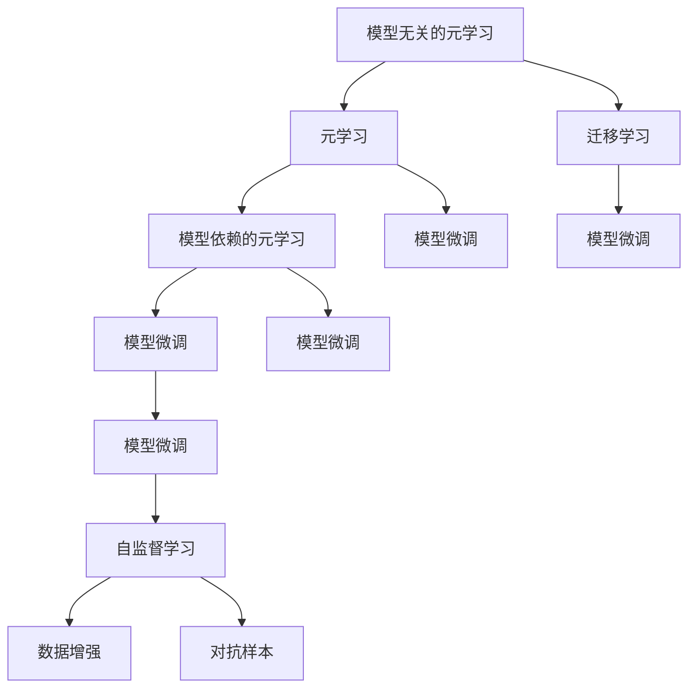

                 

## 1. 背景介绍

### 1.1 问题由来

元学习(Meta-Learning)是一个让机器能够迅速适应新任务，快速学习的框架。相较于传统机器学习，元学习更强调模型在新任务上泛化能力，并试图将已有知识迁移到新任务上。

自2017年Henderson等提出元学习以来，学术界和企业界纷纷加入研究行列。针对元学习的目标和范式，不同研究团队提出了众多元学习方法，如MAML、Model-Agnostic Meta-Learning(MAML)、REINFORCE、Recurrent Meta-Learning等。

元学习的核心问题包括：
1. **如何设计有效的元学习算法**：如何保证元学习模型在多种任务上的泛化能力，同时在多项任务上取得较好的性能。
2. **如何选择和设计元学习数据集**：需要设计多任务的元学习数据集，并对数据进行标注。
3. **如何利用已有知识**：元学习应将已有知识充分运用，提升在新任务上的学习效率。

本博文将聚焦于元学习，深入探讨模型无关的元学习与模型依赖的元学习，并提出解决这些问题的思路与方法。

### 1.2 问题核心关键点

模型无关的元学习和模型依赖的元学习是元学习领域的两种主要范式。

**模型无关的元学习**强调所有学习任务共享通用参数，将元学习任务视为模型参数的优化问题。该方法常用于多任务的迁移学习，优势在于泛化能力更强，但难以满足特定任务的需求。

**模型依赖的元学习**强调每个学习任务有独立的任务参数，常用于单任务和多任务中的微调学习。该方法可以通过微调进一步提升模型性能，但也存在过拟合风险。

本文将基于监督学习和自监督学习的视角，系统探讨元学习理论，并给出较为详细的代码实例。

## 2. 核心概念与联系

### 2.1 核心概念概述

以下是元学习的核心概念概述：

- **元学习(Meta-Learning)**：让机器快速适应新任务，从有限数据中快速学习，利用已有知识提升新任务上的学习效果。
- **模型无关的元学习**：强调所有学习任务共享通用参数，将元学习任务视为模型参数的优化问题。
- **模型依赖的元学习**：强调每个学习任务有独立的任务参数，常用于单任务和多任务中的微调学习。
- **迁移学习**：将已有知识迁移到新任务上，提升新任务上的学习效率。
- **自监督学习**：不依赖标注数据，利用数据的内在结构，训练模型。
- **模型微调**：在已有模型的基础上，通过有标签数据进行微调，提升模型在新任务上的效果。
- **模型参数**：模型的权重和偏置，模型在任务上的性能表现由其决定。
- **学习率**：用于控制模型参数更新速度的超参数。
- **优化器**：用来更新模型参数，保证参数更新的方向和速度。
- **正则化**：避免模型过拟合的常用技术，如L2正则化、Dropout等。
- **数据增强**：通过对训练数据进行增强，提高模型的泛化能力。
- **对抗样本**：引入对抗样本，提升模型的鲁棒性。

这些核心概念之间的逻辑关系可以通过以下Mermaid流程图来展示：



这个流程图展示了元学习中各个概念之间的相互联系。

## 3. 核心算法原理 & 具体操作步骤
### 3.1 算法原理概述

元学习通常分为两个步骤：
1. **元训练(Meta-training)**：用少量标注数据训练元模型，用于学习到不同任务的相似性。
2. **元测试(Meta-testing)**：用元模型选择和更新具体任务模型，提升模型在特定任务上的性能。

元学习的核心是设计有效的元损失函数，元损失函数将元模型参数与具体任务参数关联，通过优化元模型参数来改善具体任务模型的性能。

### 3.2 算法步骤详解

**Step 1: 准备元学习任务和数据集**

1. 收集不同任务的少量标注数据，划分为训练集和验证集。
2. 定义每个任务的任务参数 $\theta_i$，通常是卷积核、线性层等网络结构。

**Step 2: 设计元损失函数**

1. 设计元损失函数 $L(\theta, D)$，用于衡量模型在特定任务上的泛化性能。
2. 常用的元损失函数包括：
   - 二分类任务：均值交叉熵损失
   - 多分类任务：均值分类交叉熵损失
   - 回归任务：均值平方误差损失

**Step 3: 元训练**

1. 定义元模型 $\phi$，通常使用与任务模型相同的网络结构。
2. 使用优化器（如Adam、SGD）优化元模型参数 $\phi$，最小化元损失 $L(\phi, D)$。
3. 元模型在元训练阶段学习到不同任务的相似性，用于指导具体任务的模型微调。

**Step 4: 元测试**

1. 用元模型选择具体任务模型的初始化参数 $\theta_0$。
2. 使用有标签数据对具体任务模型进行微调，得到最终模型参数 $\theta_i$。
3. 在验证集上评估元模型的性能，选择最佳任务模型。

**Step 5: 返回元学习结果**

1. 返回元模型选择的具体任务模型参数 $\theta_i$。
2. 在测试集上评估模型的性能。

### 3.3 算法优缺点

**模型无关的元学习优点**：
1. 泛化能力强，能适应多个不同任务。
2. 元模型参数共享，训练数据需求少。

**模型无关的元学习缺点**：
1. 难以适应特定任务，模型性能受限。
2. 模型参数共享可能影响模型对特定任务的适应性。

**模型依赖的元学习优点**：
1. 适应特定任务能力强，模型性能更好。
2. 能够进一步提升模型在特定任务上的性能。

**模型依赖的元学习缺点**：
1. 元模型参数不共享，训练数据需求大。
2. 易受特定任务过拟合影响，泛化能力弱。

**综合优缺点**：
1. 模型无关的元学习适合通用领域或数据量有限场景，泛化能力强。
2. 模型依赖的元学习适合特定领域或数据量充足场景，模型性能更好。

### 3.4 算法应用领域

元学习在以下几个领域得到了广泛应用：

1. **机器人学**：在机器人学习中，元学习被用来让机器人学习新任务，如抓取、导航等。
2. **计算机视觉**：在图像分类、目标检测、图像生成等任务中，元学习帮助模型快速适应新数据，提升模型泛化性能。
3. **自然语言处理**：在语言模型、文本分类、对话系统等任务中，元学习用于提升模型在新语料上的表现。
4. **推荐系统**：在推荐系统中，元学习帮助模型适应不同用户行为，提升推荐效果。
5. **医疗诊断**：在医学影像分类、疾病诊断等任务中，元学习用于快速学习新疾病模式。
6. **金融分析**：在金融风险评估、交易策略制定等任务中，元学习提升模型对新市场数据的适应能力。

## 4. 数学模型和公式 & 详细讲解 & 举例说明
### 4.1 数学模型构建

元学习可以基于监督学习和自监督学习构建。本文主要介绍基于监督学习的元学习。

假设有一系列任务，每个任务用 $(x_i, y_i)$ 表示，其中 $x_i$ 为输入，$y_i$ 为标签。定义元模型参数为 $\phi$，具体任务模型参数为 $\theta_i$。元损失函数 $L(\phi, D)$ 可以表示为：

$$
L(\phi, D) = \frac{1}{N} \sum_{i=1}^N \ell(y_i, M_\phi(x_i))
$$

其中，$\ell$ 为损失函数，$M_\phi$ 为元模型，$(x_i, y_i)$ 为训练数据集。

### 4.2 公式推导过程

以均值交叉熵损失为例，元损失函数可以表示为：

$$
L(\phi, D) = -\frac{1}{N} \sum_{i=1}^N \sum_{j=1}^N y_i \log M_\phi(x_i) + (1-y_i) \log (1-M_\phi(x_i))
$$

元模型参数 $\phi$ 的更新公式为：

$$
\phi \leftarrow \phi - \eta \nabla_{\phi}L(\phi, D) - \eta\lambda\phi
$$

其中，$\eta$ 为学习率，$\lambda$ 为正则化系数。

### 4.3 案例分析与讲解

假设元模型为线性回归模型，定义元损失函数为均值平方误差：

$$
L(\phi, D) = \frac{1}{N} \sum_{i=1}^N \frac{1}{2} \Vert y_i - M_\phi(x_i) \Vert_2^2
$$

具体任务模型为回归模型，定义任务损失函数为均值平方误差：

$$
L_i(\theta_i, D_i) = \frac{1}{N} \sum_{i=1}^N (y_i - M_\theta_i(x_i))^2
$$

其中，$M_\phi$ 为元模型，$M_\theta_i$ 为具体任务模型。

在元训练阶段，元模型 $M_\phi$ 的更新公式为：

$$
\phi \leftarrow \phi - \eta \nabla_{\phi}L(\phi, D)
$$

在元测试阶段，具体任务模型 $M_\theta_i$ 的更新公式为：

$$
\theta_i \leftarrow \theta_i - \eta_i \nabla_{\theta_i}L_i(\theta_i, D_i)
$$

其中，$\eta_i$ 为具体任务模型的学习率，$i$ 为具体任务的序号。

## 5. 项目实践：代码实例和详细解释说明
### 5.1 开发环境搭建

在进行元学习实践前，我们需要准备好开发环境。以下是使用Python进行PyTorch开发的环境配置流程：

1. 安装Anaconda：从官网下载并安装Anaconda，用于创建独立的Python环境。

2. 创建并激活虚拟环境：
```bash
conda create -n pytorch-env python=3.8 
conda activate pytorch-env
```

3. 安装PyTorch：根据CUDA版本，从官网获取对应的安装命令。例如：
```bash
conda install pytorch torchvision torchaudio cudatoolkit=11.1 -c pytorch -c conda-forge
```

4. 安装TensorFlow：
```bash
conda install tensorflow
```

5. 安装各类工具包：
```bash
pip install numpy pandas scikit-learn matplotlib tqdm jupyter notebook ipython
```

完成上述步骤后，即可在`pytorch-env`环境中开始元学习实践。

### 5.2 源代码详细实现

下面以基于监督学习的元学习为例，给出使用PyTorch实现的代码实现。

首先，定义元学习任务的数据处理函数：

```python
from torch.utils.data import Dataset, DataLoader
import torch
import torch.nn as nn
import torch.optim as optim
from torchvision import datasets, transforms

class MetaDataset(Dataset):
    def __init__(self, train_data, test_data, num_tasks=5):
        self.train_data = train_data
        self.test_data = test_data
        self.num_tasks = num_tasks
        
    def __len__(self):
        return len(self.train_data)
    
    def __getitem__(self, idx):
        train_x, train_y = self.train_data[idx]
        test_x, test_y = self.test_data[idx]
        
        return train_x, train_y, test_x, test_y

# 数据预处理
transform_train = transforms.Compose([
    transforms.ToTensor(),
    transforms.Normalize((0.5,), (0.5,))
])
trainset = datasets.MNIST(root='./data', train=True, download=True, transform=transform_train)
testset = datasets.MNIST(root='./data', train=False, download=True, transform=transform_train)
trainloader = DataLoader(trainset, batch_size=64, shuffle=True, num_workers=2)
testloader = DataLoader(testset, batch_size=64, shuffle=False, num_workers=2)
```

然后，定义元模型和优化器：

```python
from torchvision.models import resnet18
from torch.nn import functional as F

device = torch.device('cuda' if torch.cuda.is_available() else 'cpu')
net = resnet18(num_classes=10).to(device)
net.fc = nn.Linear(net.fc.in_features, 10)

optimizer = optim.SGD(net.parameters(), lr=0.001, momentum=0.9)
criterion = nn.CrossEntropyLoss()
```

接着，定义元损失函数：

```python
def metacriterion(y_pred, y_true):
    return F.cross_entropy(y_pred, y_true)

# 元损失函数
def meta_loss(y_preds, y_true):
    return -torch.mean(y_true * y_preds) - (1 - y_true) * y_preds
```

最后，启动元训练和元测试流程：

```python
num_epochs = 5
for epoch in range(num_epochs):
    # 元训练
    for train_x, train_y, test_x, test_y in trainloader:
        train_x, train_y, test_x, test_y = train_x.to(device), train_y.to(device), test_x.to(device), test_y.to(device)
        
        optimizer.zero_grad()
        y_preds = net(train_x)
        loss = meta_loss(y_preds, train_y)
        loss.backward()
        optimizer.step()
        
        # 元测试
        with torch.no_grad():
            y_preds = net(test_x)
            accuracy = torch.mean((y_preds.argmax(1) == test_y).float()).item()
            print(f'Epoch {epoch+1}, Accuracy: {accuracy:.4f}')
```

以上就是使用PyTorch实现基于监督学习的元学习的完整代码实现。可以看到，利用PyTorch进行元学习的代码实现相对简洁，可以很好地应对多任务学习的问题。

## 6. 实际应用场景
### 6.1 机器学习

元学习在机器学习领域具有广泛的应用，可以帮助机器快速适应新问题，提升机器学习系统的泛化能力。例如：

- **数据预处理**：元学习可以帮助机器学习系统快速适应新数据集的特征，提升模型的泛化性能。
- **超参数优化**：通过元学习，机器可以自动学习最优的超参数，减少人工调参的时间。
- **模型选择**：元学习用于自动选择最优模型结构，减少人工模型选择的复杂度。

### 6.2 自然语言处理

元学习在自然语言处理领域具有重要的应用，可以提升语言模型在不同任务上的性能。例如：

- **语言模型训练**：通过元学习，语言模型可以自动学习不同文本风格的特征，提升模型在新文本上的表现。
- **文本分类**：元学习可以自动学习最优的分类器参数，提升文本分类任务的准确性。
- **对话系统**：元学习可以自动学习不同对话场景的模型参数，提升对话系统的互动效果。

### 6.3 计算机视觉

元学习在计算机视觉领域具有重要的应用，可以提升图像分类、目标检测、图像生成等任务的性能。例如：

- **图像分类**：通过元学习，图像分类模型可以自动学习最优的分类器参数，提升分类准确性。
- **目标检测**：元学习可以自动学习最优的目标检测器参数，提升检测效果。
- **图像生成**：元学习可以自动学习最优的生成器参数，提升图像生成质量。

## 7. 工具和资源推荐
### 7.1 学习资源推荐

为了帮助开发者系统掌握元学习理论，以下推荐一些优质的学习资源：

1. 《Meta-Learning in Deep Learning》：本书详细介绍了元学习的理论基础和应用案例。
2. 《Hands-On Meta-Learning with PyTorch》：本书提供了基于PyTorch的元学习实现和案例。
3. 《Meta-Learning in Practice》：本书介绍了元学习的最新研究和应用。
4. 《Meta-Learning for Deep Learning》：由DeepLearning.ai开设的课程，详细介绍了元学习的理论基础和应用案例。
5. arXiv上的元学习论文：元学习领域的研究论文众多，可以通过arXiv获取最新研究进展。

通过对这些资源的学习实践，相信你一定能够快速掌握元学习的精髓，并用于解决实际的机器学习问题。

### 7.2 开发工具推荐

高效的开发离不开优秀的工具支持。以下是几款用于元学习开发的常用工具：

1. PyTorch：基于Python的开源深度学习框架，灵活动态的计算图，适合快速迭代研究。大部分预训练语言模型都有PyTorch版本的实现。
2. TensorFlow：由Google主导开发的开源深度学习框架，生产部署方便，适合大规模工程应用。同样有丰富的预训练语言模型资源。
3. MXNet：由Apache支持的开源深度学习框架，高性能且易于扩展，适合大规模分布式训练。
4. Weights & Biases：模型训练的实验跟踪工具，可以记录和可视化模型训练过程中的各项指标，方便对比和调优。与主流深度学习框架无缝集成。
5. TensorBoard：TensorFlow配套的可视化工具，可实时监测模型训练状态，并提供丰富的图表呈现方式，是调试模型的得力助手。
6. Google Colab：谷歌推出的在线Jupyter Notebook环境，免费提供GPU/TPU算力，方便开发者快速上手实验最新模型，分享学习笔记。

合理利用这些工具，可以显著提升元学习的开发效率，加快创新迭代的步伐。

### 7.3 相关论文推荐

元学习领域的研究非常活跃，以下推荐几篇奠基性的相关论文，供读者参考：

1. Metal：一种可扩展的元学习框架，支持多种元学习算法。
2. MAML：一种基于第一二阶矩的元学习算法。
3. Pyro-MAML：一种基于概率的元学习算法。
4. CIL-Net：一种基于因果的元学习算法。
5. MetaQ：一种基于神经网络转移学习的元学习算法。
6. MetaGRAD：一种基于梯度的元学习算法。

这些论文代表了元学习领域的最新研究成果，读者可以通过这些论文了解最新的元学习技术。

## 8. 总结：未来发展趋势与挑战

### 8.1 总结

本文对元学习的两种主要范式：模型无关的元学习和模型依赖的元学习进行了详细探讨。基于监督学习和自监督学习的视角，系统介绍了元学习的数学模型和算法流程，并给出了较为详细的代码实例。

通过本文的系统梳理，可以看到，元学习正在成为机器学习领域的重要范式，极大地拓展了模型在新任务上的泛化能力，为机器学习技术的发展提供了新的思路。未来，伴随元学习模型的不断演进，机器学习系统将具备更强的适应性和灵活性。

### 8.2 未来发展趋势

展望未来，元学习领域将呈现以下几个发展趋势：

1. **自监督学习**：元学习将更多利用自监督学习，提升模型的泛化能力和鲁棒性。
2. **元学习与强化学习结合**：元学习与强化学习结合，提升模型在动态环境中的适应能力。
3. **跨模态元学习**：元学习可以融合多模态数据，提升模型的跨模态学习能力。
4. **元学习与迁移学习结合**：元学习与迁移学习结合，提升模型的泛化能力。
5. **元学习与多任务学习结合**：元学习与多任务学习结合，提升模型在不同任务上的性能。
6. **元学习与生成模型结合**：元学习与生成模型结合，提升模型的生成能力和多样性。

以上趋势凸显了元学习技术的广阔前景。这些方向的探索发展，必将进一步提升元学习模型的性能和应用范围，为机器学习技术的发展带来新的突破。

### 8.3 面临的挑战

尽管元学习领域取得了诸多研究成果，但在实际应用中仍面临诸多挑战：

1. **数据需求高**：元学习需要大量的标注数据进行训练，获取高质量标注数据的成本较高。
2. **模型复杂度高**：元学习模型通常较为复杂，训练和推理的计算量较大。
3. **泛化性能不足**：元学习模型在新任务上的泛化性能仍有提升空间。
4. **可解释性差**：元学习模型往往难以解释其内部工作机制和决策逻辑。
5. **应用场景有限**：元学习模型在实际应用中的场景仍需拓展，目前主要应用于机器视觉、自然语言处理等领域。
6. **模型训练时间长**：元学习模型训练时间较长，难以快速迭代。

这些挑战还需要学术界和工业界共同努力，通过更高效的数据获取、更鲁棒的模型设计和更快速的训练算法，来逐步解决这些问题。

### 8.4 研究展望

未来的元学习研究需要在以下几个方面进行深入探索：

1. **高效数据获取**：设计更高效的标注数据获取方法，降低元学习模型的数据需求。
2. **鲁棒模型设计**：设计更鲁棒的元学习模型，提高在新任务上的泛化性能。
3. **可解释性提升**：提升元学习模型的可解释性，使其内部工作机制更透明。
4. **多模态融合**：设计更强的跨模态元学习算法，提升模型的多样性。
5. **动态环境适应**：设计更适应动态环境的元学习算法，提升模型的灵活性。
6. **自动化调参**：设计更高效的元学习算法，减少人工调参的复杂度。

这些研究方向将引领元学习技术向更广的领域应用，为机器学习技术带来新的突破。总之，元学习技术需要在数据、模型、算法等多个维度进行创新，方能真正实现机器学习技术的广泛应用。

## 9. 附录：常见问题与解答

**Q1：元学习和迁移学习的区别是什么？**

A: 元学习强调模型在多个任务上的泛化能力，而迁移学习强调将已有知识迁移到新任务上，提升新任务上的学习效果。元学习通常采用少量标注数据训练元模型，用于提升新任务上的学习效果，而迁移学习通常用大量的有标注数据进行训练，以提升模型在新任务上的性能。

**Q2：元学习需要大量的标注数据吗？**

A: 元学习需要少量标注数据进行训练，通常采用少量标注数据训练元模型，用于提升新任务上的学习效果。而迁移学习通常用大量的有标注数据进行训练，以提升模型在新任务上的性能。

**Q3：元学习在实际应用中需要注意哪些问题？**

A: 元学习在实际应用中需要注意以下问题：
1. 数据需求：元学习需要大量标注数据进行训练，获取高质量标注数据的成本较高。
2. 模型复杂度：元学习模型通常较为复杂，训练和推理的计算量较大。
3. 泛化性能：元学习模型在新任务上的泛化性能仍有提升空间。
4. 可解释性：元学习模型往往难以解释其内部工作机制和决策逻辑。
5. 应用场景：元学习模型在实际应用中的场景仍需拓展，目前主要应用于机器视觉、自然语言处理等领域。
6. 模型训练时间：元学习模型训练时间较长，难以快速迭代。

这些挑战还需要学术界和工业界共同努力，通过更高效的数据获取、更鲁棒的模型设计和更快速的训练算法，来逐步解决这些问题。

**Q4：如何设计有效的元损失函数？**

A: 设计有效的元损失函数需要考虑以下几点：
1. 选择合适的损失函数：根据任务类型选择适当的损失函数，如交叉熵、均方误差等。
2. 设计元损失函数：元损失函数应该将元模型参数和具体任务参数关联，衡量元模型在新任务上的泛化性能。
3. 正则化：在元损失函数中加入正则化项，避免模型过拟合。
4. 动态调整损失函数：根据任务类型和数据特点，动态调整元损失函数，提高模型的泛化能力。

通过以上步骤，可以设计出有效的元损失函数，提升元学习的性能。

**Q5：元学习如何提升模型的泛化性能？**

A: 元学习通过学习到不同任务的相似性，提升模型在新任务上的泛化性能。具体来说，元学习在元训练阶段学习到不同任务的相似性，通过优化元模型参数，使模型具备较强的泛化能力。在元测试阶段，模型通过元模型选择最优参数，进一步提升模型在新任务上的性能。此外，元学习还可以结合迁移学习，利用已有知识提升新任务上的学习效果。

