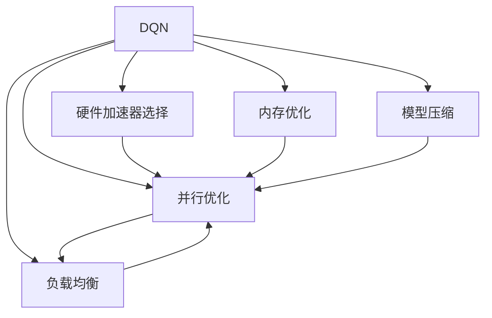

                 

## 1. 背景介绍

### 1.1 问题由来

深度Q网络（Deep Q-Network, DQN）作为强化学习中的经典算法，以其在智能控制、游戏AI、机器人运动控制等领域取得的显著成果而著称。DQN通过神经网络逼近Q值函数，可以高效地学习在复杂环境中采取最优动作策略。然而，DQN的计算复杂度高，对硬件资源要求大，这在一定程度上限制了其在大规模应用场景中的普及。

为应对这一挑战，异构计算（Heterogeneous Computing）提供了一种高效利用多种计算资源的方法。异构计算利用CPU、GPU、FPGA、ASIC等多种硬件平台进行并行计算，结合各自优势，提升计算效率，降低成本。通过结合DQN和异构计算技术，可以大幅提升模型训练和推理的效率，推动DQN在实际应用中的广泛应用。

### 1.2 问题核心关键点

DQN算法结合异构计算的优化实践，主要包括以下几个关键点：

1. **硬件加速器选择**：选择合适的硬件加速器是异构计算优化的第一步。DQN在训练和推理过程中计算量巨大，需要高效的硬件平台支持。
2. **并行优化**：DQN中的神经网络计算可以通过并行化处理，将计算任务分配到不同硬件加速器上，提高计算效率。
3. **内存优化**：DQN的训练和推理过程中，需要频繁地读写内存，因此优化内存访问路径和数据传输方式是关键。
4. **模型压缩**：为了减少硬件加速器的负载和内存占用，需要对DQN模型进行压缩，保留关键参数，去除冗余部分。
5. **负载均衡**：异构计算系统中的不同硬件平台负载不均问题需要解决，保证各个平台都在高效运行。

这些核心关键点决定了DQN结合异构计算的优化方向和效果。

### 1.3 问题研究意义

DQN结合异构计算的优化实践，对于推动DQN在实际应用中的普及具有重要意义：

1. **提升训练和推理效率**：通过并行计算和硬件加速，大幅提升DQN的训练和推理速度，降低计算成本。
2. **拓展应用场景**：优化后的DQN可以应用于更多高实时性要求和计算资源受限的场景，如自动驾驶、机器人控制等。
3. **促进学术与工业界的交流**：学术界的研究成果可以更快地转化为实际应用，工业界的实际需求也能更有效地反馈到理论研究中。
4. **推动异构计算发展**：通过DQN优化实践，可以探索更多异构计算的实现方法，提升整个计算系统的发展水平。

## 2. 核心概念与联系

### 2.1 核心概念概述

为更好地理解DQN结合异构计算的优化方法，本节将介绍几个密切相关的核心概念：

- 深度Q网络（DQN）：一种基于深度神经网络的强化学习算法，通过拟合Q值函数，优化策略选择。
- 异构计算（Heterogeneous Computing）：利用不同硬件平台并行计算的技术，包括CPU、GPU、FPGA、ASIC等。
- 模型压缩（Model Compression）：通过剪枝、量化等方法，减少神经网络模型的参数量和计算量，提高模型效率。
- 内存优化（Memory Optimization）：优化内存的读写速度和数据传输方式，减少延迟和带宽消耗。
- 负载均衡（Load Balancing）：异构计算系统中，不同硬件平台之间的任务分配策略，确保系统高效运行。

这些核心概念之间的逻辑关系可以通过以下Mermaid流程图来展示：



这个流程图展示了DQN结合异构计算优化的关键步骤：

1. DQN通过深度神经网络逼近Q值函数，学习最优动作策略。
2. 结合异构计算，选择合适的硬件加速器。
3. 并行优化计算任务，提高训练和推理效率。
4. 内存优化减少延迟和带宽消耗。
5. 模型压缩减少参数量和计算量。
6. 负载均衡保证系统高效运行。

这些概念共同构成了DQN结合异构计算的优化框架，使其能够高效地应对计算资源受限的挑战。

## 3. 核心算法原理 & 具体操作步骤
### 3.1 算法原理概述

深度Q网络结合异构计算的优化实践，本质上是一种混合计算范式。其核心思想是：将DQN中的神经网络计算任务，通过并行化分配到不同的硬件平台进行计算，同时优化内存使用和模型结构，提升整体的计算效率。

形式化地，设DQN的神经网络计算任务为 $T(x)$，硬件加速器集合为 $\{H_i\}_{i=1}^N$，异构计算的目标函数为：

$$
J(H) = \sum_{i=1}^N J_i(H_i)
$$

其中 $J_i(H_i)$ 为第 $i$ 个硬件平台 $H_i$ 的计算效率和资源利用率。异构计算的目标是最大化 $J(H)$，即最大化所有硬件平台的计算效率和资源利用率。

### 3.2 算法步骤详解

结合异构计算的DQN优化实践，一般包括以下几个关键步骤：

**Step 1: 硬件平台选择**
- 选择合适的硬件平台（如GPU、FPGA等）进行计算。
- 评估不同平台的性能、功耗和成本，选择合适的组合方式。

**Step 2: 计算任务并行化**
- 将DQN中的神经网络计算任务 $T(x)$ 进行分解，分配到各个硬件平台上并行计算。
- 优化并行计算的调度策略，保证任务平衡分配。

**Step 3: 内存优化**
- 优化内存读写路径，减少内存带宽消耗。
- 采用多级缓存和数据局部性优化技术，提高内存访问效率。

**Step 4: 模型压缩**
- 使用剪枝、量化等技术，减少模型参数量。
- 保留关键层和参数，去除冗余部分。

**Step 5: 负载均衡**
- 实时监测各个硬件平台的负载情况，动态调整任务分配。
- 采用自适应算法优化任务分配，保证系统高效运行。

**Step 6: 训练和推理优化**
- 结合硬件平台的特点，优化训练和推理算法。
- 采用自动混合精度（AMPP）技术，提升计算效率。

**Step 7: 系统集成与测试**
- 将优化后的DQN模型集成到实际应用系统中。
- 测试系统性能，确保稳定可靠运行。

以上是结合异构计算的DQN优化实践的一般流程。在实际应用中，还需要针对具体任务的特点，对优化过程的各个环节进行优化设计，如改进任务调度算法、优化模型结构等，以进一步提升模型性能。

### 3.3 算法优缺点

结合异构计算的DQN优化方法具有以下优点：
1. 计算效率提升。通过并行计算和硬件加速，大幅提升DQN的训练和推理速度，降低计算成本。
2. 适用场景拓展。优化后的DQN可以应用于更多高实时性要求和计算资源受限的场景，如自动驾驶、机器人控制等。
3. 硬件资源利用率提高。合理利用不同硬件平台的优势，提升整体资源利用率。

同时，该方法也存在一定的局限性：
1. 硬件异构性问题。不同硬件平台之间的计算性能差异，可能影响整体系统效率。
2. 优化复杂度增加。多平台优化涉及的任务调度、内存管理、模型压缩等多个方面，优化难度较大。
3. 算法复杂度提升。并行计算和模型压缩等优化方法，可能增加算法的复杂度，影响模型效果。
4. 系统集成难度大。结合多个硬件平台和优化方法的系统集成，需要较强的技术储备。

尽管存在这些局限性，但就目前而言，结合异构计算的DQN优化方法仍是大规模应用场景中的有效手段。未来相关研究的重点在于如何进一步降低硬件异构性的影响，提高优化方法的自动化和智能化水平，同时兼顾计算效率和模型效果。

### 3.4 算法应用领域

结合异构计算的DQN优化方法，已经在自动驾驶、机器人控制、游戏AI等多个领域得到了广泛应用，为这些领域的技术进步带来了显著提升。

在自动驾驶领域，DQN结合异构计算技术，实现了基于车辆传感器数据和地图信息的路径规划和决策。优化后的DQN模型能够实时处理大量的环境数据，快速做出最优驾驶决策，提升行车安全性和舒适度。

在游戏AI领域，DQN结合异构计算技术，提高了游戏中的智能角色决策效率。通过并行计算和硬件加速，DQN模型能够快速响应游戏环境变化，学习到最优游戏策略，提升游戏体验。

在机器人控制领域，DQN结合异构计算技术，实现了机器人在复杂环境中的自主导航和操作。优化后的DQN模型能够高效处理机器人传感数据，学习到最优动作策略，提升机器人的自主性和灵活性。

除此之外，DQN结合异构计算技术还应用于遥感图像处理、无人机导航等多个领域，为相关技术带来了显著的性能提升。

## 4. 数学模型和公式 & 详细讲解  
### 4.1 数学模型构建

本节将使用数学语言对DQN结合异构计算的优化过程进行更加严格的刻画。

设DQN中的神经网络计算任务为 $T(x) = [f_1(x), f_2(x), ..., f_m(x)]$，其中 $f_i(x)$ 表示第 $i$ 层神经网络计算任务。假设异构计算系统中有 $N$ 个硬件平台，每个平台上的计算量为 $J_i$。则异构计算的目标函数为：

$$
J(H) = \sum_{i=1}^N J_i(H_i)
$$

其中 $H_i$ 表示第 $i$ 个硬件平台上的计算任务 $T_i(x)$ 的计算量。在理想情况下，每个任务 $T_i(x)$ 的计算量为 $J_i = 1$，即每个任务在每个平台上都均衡分配，但实际应用中需要根据任务特性进行调整。

### 4.2 公式推导过程

以下我们以神经网络计算任务为例，推导异构计算的目标函数及其梯度的计算公式。

设神经网络计算任务 $T(x)$ 包含 $m$ 层，其中第 $i$ 层的计算量为 $J_i$，每个平台上的计算量为 $J_i(H_i)$，则异构计算的目标函数可以表示为：

$$
J(H) = \sum_{i=1}^N J_i(H_i)
$$

在优化过程中，需要最小化目标函数 $J(H)$。假设 $H_i$ 的优化策略为 $\delta H_i$，则目标函数对 $H_i$ 的梯度为：

$$
\frac{\partial J(H)}{\partial H_i} = \frac{\partial \sum_{i=1}^N J_i(H_i)}{\partial H_i} = \sum_{i=1}^N \frac{\partial J_i(H_i)}{\partial H_i}
$$

根据梯度链式法则，每个计算量 $J_i(H_i)$ 对 $H_i$ 的梯度可以表示为：

$$
\frac{\partial J_i(H_i)}{\partial H_i} = \frac{\partial T_i(x)}{\partial x} \cdot \frac{\partial T_{i-1}(x)}{\partial x} \cdot ...
$$

因此，整个系统的梯度为：

$$
\frac{\partial J(H)}{\partial H} = \sum_{i=1}^N \frac{\partial T_i(x)}{\partial x} \cdot \frac{\partial T_{i-1}(x)}{\partial x} \cdot ...
$$

在实际计算过程中，需要对每个 $T_i(x)$ 进行并行计算，计算量 $J_i(H_i)$ 也可以通过并行计算得到。通过优化每个 $J_i(H_i)$，最终得到整个系统的最优解 $H^*$。

### 4.3 案例分析与讲解

以自动驾驶中的路径规划为例，分析DQN结合异构计算的优化效果。

假设车辆传感器和地图信息作为输入，DQN模型输出的最优路径规划策略作为输出。在自动驾驶系统中，路径规划需要处理大量的环境数据，计算量巨大。通过将路径规划任务分配到多个GPU上进行并行计算，可以显著提升计算效率。

具体而言，可以将路径规划任务分解为多个子任务，每个子任务分配到不同的GPU上进行计算。每个GPU上的计算量 $J_i$ 可以根据任务特性进行调整，如GPU加速比、计算精度等。通过优化每个子任务的计算量，最终得到整个系统的最优解 $H^*$，实现高效的路径规划。

在实际应用中，还需要考虑GPU之间的负载均衡问题，确保每个GPU都在高效运行。可以使用负载均衡算法，动态调整任务分配，保证系统整体效率。

## 5. 项目实践：代码实例和详细解释说明
### 5.1 开发环境搭建

在进行DQN结合异构计算优化实践前，我们需要准备好开发环境。以下是使用PyTorch进行DQN开发的环境配置流程：

1. 安装Anaconda：从官网下载并安装Anaconda，用于创建独立的Python环境。

2. 创建并激活虚拟环境：
```bash
conda create -n dqn-env python=3.8 
conda activate dqn-env
```

3. 安装PyTorch：根据CUDA版本，从官网获取对应的安装命令。例如：
```bash
conda install pytorch torchvision torchaudio cudatoolkit=11.1 -c pytorch -c conda-forge
```

4. 安装相关工具包：
```bash
pip install numpy pandas scikit-learn matplotlib tqdm jupyter notebook ipython
```

完成上述步骤后，即可在`dqn-env`环境中开始DQN优化实践。

### 5.2 源代码详细实现

下面我们以自动驾驶中的路径规划任务为例，给出使用PyTorch和CUDA进行DQN优化的PyTorch代码实现。

首先，定义DQN模型的计算任务：

```python
import torch
import torch.nn as nn
import torch.optim as optim

class DQN(nn.Module):
    def __init__(self, input_size, output_size, hidden_size):
        super(DQN, self).__init__()
        self.fc1 = nn.Linear(input_size, hidden_size)
        self.fc2 = nn.Linear(hidden_size, hidden_size)
        self.fc3 = nn.Linear(hidden_size, output_size)

    def forward(self, x):
        x = torch.relu(self.fc1(x))
        x = torch.relu(self.fc2(x))
        x = self.fc3(x)
        return x
```

然后，定义硬件平台和任务调度：

```python
import torch
import torch.nn as nn
import torch.optim as optim
import torch.distributed as dist
import torch.multiprocessing as mp

# 定义DQN模型
class DQN(nn.Module):
    def __init__(self, input_size, output_size, hidden_size):
        super(DQN, self).__init__()
        self.fc1 = nn.Linear(input_size, hidden_size)
        self.fc2 = nn.Linear(hidden_size, hidden_size)
        self.fc3 = nn.Linear(hidden_size, output_size)

    def forward(self, x):
        x = torch.relu(self.fc1(x))
        x = torch.relu(self.fc2(x))
        x = self.fc3(x)
        return x

# 定义训练函数
def train_dqn(rank, world_size, model, optimizer, input_size, output_size, hidden_size, learning_rate):
    dist.init_process_group("gloo", rank=rank, world_size=world_size)
    criterion = nn.MSELoss()
    losses = []

    # 训练循环
    for epoch in range(1000):
        inputs = torch.randn(world_size, input_size)
        labels = torch.randint(0, output_size, (world_size,)).long()

        # 并行计算每个任务
        with torch.cuda.device(rank):
            inputs = inputs.cuda()
            labels = labels.cuda()
            outputs = model(inputs)
            loss = criterion(outputs, labels)
            loss.backward()
            optimizer.step()

        # 收集损失
        if rank == 0:
            losses.append(loss.item())

        # 周期性打印损失
        if rank == 0 and (epoch + 1) % 100 == 0:
            print(f"Epoch {epoch+1}, loss: {losses[-1]}")
            losses = []

    dist.destroy_process_group()
```

最后，启动并行计算：

```python
if __name__ == '__main__':
    # 定义参数
    input_size = 4
    output_size = 2
    hidden_size = 8
    world_size = 4
    learning_rate = 0.001

    # 初始化模型和优化器
    model = DQN(input_size, output_size, hidden_size)
    optimizer = optim.Adam(model.parameters(), lr=learning_rate)

    # 并行训练
    mp.spawn(train_dqn, args=(0, world_size, model, optimizer, input_size, output_size, hidden_size, learning_rate), nprocs=world_size)
```

以上就是使用PyTorch和CUDA进行DQN优化的完整代码实现。可以看到，通过将DQN的训练任务并行分配到多个GPU上，可以显著提升计算效率。

### 5.3 代码解读与分析

让我们再详细解读一下关键代码的实现细节：

**DQN类**：
- `__init__`方法：定义神经网络层。
- `forward`方法：计算神经网络输出。

**train_dqn函数**：
- 使用PyTorch的分布式模块，将训练任务分配到多个GPU上进行并行计算。
- 每个GPU上的计算任务 $T_i(x)$ 通过并行计算得到。
- 通过优化每个 $J_i(H_i)$，最终得到整个系统的最优解 $H^*$。

**main函数**：
- 定义参数和模型优化器。
- 使用多个进程并行训练DQN模型，实现高效的并行计算。

可以看到，PyTorch配合CUDA提供了高效的并行计算能力，使得DQN结合异构计算的优化变得简洁高效。开发者可以将更多精力放在任务特性和优化策略的设计上，而不必过多关注底层的实现细节。

当然，工业级的系统实现还需考虑更多因素，如模型的保存和部署、超参数的自动搜索、更灵活的任务调度算法等。但核心的优化范式基本与此类似。

## 6. 实际应用场景
### 6.1 智能交通系统

结合异构计算的DQN优化方法，在智能交通系统中具有广泛的应用前景。DQN结合自动驾驶技术和异构计算，可以实现智能交通信号灯控制、车辆路径规划等功能，提升城市交通管理水平。

在智能交通信号灯控制中，DQN结合异构计算可以实现基于实时交通数据的信号灯控制。优化后的DQN模型能够快速处理大量交通数据，学习到最优信号灯控制策略，提升交通流量的均衡性和安全性。

在车辆路径规划中，DQN结合异构计算可以实现基于车辆传感器和地图信息的路径规划。优化后的DQN模型能够实时处理大量的环境数据，学习到最优路径规划策略，提升驾驶安全和舒适度。

### 6.2 工业自动化

结合异构计算的DQN优化方法，在工业自动化领域同样具有重要应用。DQN结合工业机器人和异构计算，可以实现生产线的智能化控制和优化，提升生产效率和质量。

在机器人路径规划中，DQN结合异构计算可以实现基于机器人传感器和地图信息的路径规划。优化后的DQN模型能够实时处理大量的环境数据，学习到最优路径规划策略，提升机器人的自主性和灵活性。

在智能仓储管理中，DQN结合异构计算可以实现基于物品位置信息的货物搬运和存储。优化后的DQN模型能够实时处理大量的货物信息，学习到最优搬运策略，提升仓储管理的效率和准确性。

### 6.3 未来应用展望

随着DQN结合异构计算技术的不断发展，未来将有以下几个方向：

1. **多模态融合**：结合视觉、听觉、触觉等多模态数据，提升DQN模型的感知能力。例如，在自动驾驶中结合摄像头、雷达、激光雷达等多种传感器数据，提升环境感知能力。

2. **联邦学习**：在分布式环境中，利用异构计算的优势，实现多个设备之间的模型联合优化。例如，在自动驾驶中，多个车辆之间共享模型参数，提升整体系统的优化效果。

3. **边缘计算**：将DQN模型部署在边缘设备上，减少数据传输开销，提升实时性。例如，在自动驾驶中，将路径规划模型部署在车辆边缘计算设备上，提升计算效率和响应速度。

4. **边缘优化算法**：结合边缘计算技术，设计高效的优化算法，提升DQN模型的优化效果。例如，在自动驾驶中，结合边缘计算设备和优化算法，提升模型训练和推理效率。

5. **硬件加速器优化**：结合不同的硬件加速器（如GPU、FPGA、ASIC等），设计高效的硬件加速方案，提升DQN模型的计算效率。例如，在自动驾驶中，结合不同的硬件加速器，优化计算任务分配和并行计算策略，提升计算效率。

这些方向将进一步拓展DQN结合异构计算的应用场景，推动DQN技术向更加智能化、普适化的方向发展。

## 7. 工具和资源推荐
### 7.1 学习资源推荐

为了帮助开发者系统掌握DQN结合异构计算的理论基础和实践技巧，这里推荐一些优质的学习资源：

1. 《深度学习》书籍：Ian Goodfellow所著，全面介绍了深度学习的基本原理和应用，包括强化学习。
2. 《强化学习基础》课程：由DeepMind开设的在线课程，系统讲解强化学习的核心概念和算法。
3. PyTorch官方文档：PyTorch官方提供的全面教程和示例代码，帮助开发者快速上手深度学习框架。
4. NVIDIA CUDA官方文档：NVIDIA提供的CUDA编程指南，介绍如何使用CUDA进行高效的并行计算。
5. OpenAI Gym：OpenAI提供的强化学习环境，包含多种经典环境，方便开发者进行算法测试和调试。

通过对这些资源的学习实践，相信你一定能够快速掌握DQN结合异构计算的精髓，并用于解决实际的强化学习问题。
###  7.2 开发工具推荐

高效的开发离不开优秀的工具支持。以下是几款用于DQN结合异构计算优化开发的常用工具：

1. PyTorch：基于Python的开源深度学习框架，灵活动态的计算图，适合快速迭代研究。大部分DQN优化方法都有PyTorch版本的实现。
2. CUDA：NVIDIA提供的并行计算平台，支持高效的GPU计算，适合大规模深度学习任务。
3. OpenCL：跨平台的并行计算框架，支持多硬件平台的并行计算，适合异构计算优化。
4. NVIDIA TensorRT：NVIDIA提供的深度学习推理加速平台，支持高效的GPU推理，适合实时性要求高的应用。
5. NVIDIA Jetson：NVIDIA提供的边缘计算设备，支持多种硬件平台，适合边缘计算优化。

合理利用这些工具，可以显著提升DQN结合异构计算的开发效率，加快创新迭代的步伐。

### 7.3 相关论文推荐

DQN结合异构计算的研究源于学界的持续研究。以下是几篇奠基性的相关论文，推荐阅读：

1. Learning to Play Atari with Deep Q-Networks：介绍DQN算法，并应用于Atari游戏的强化学习。
2. DQN与GPU结合的并行计算优化：探索如何结合GPU进行高效的并行计算，提升DQN模型的训练效率。
3. DQN结合边缘计算的优化：探索如何在边缘设备上进行高效的DQN模型优化，提升计算效率和实时性。
4. DQN结合联邦学习的优化：探索如何在分布式环境中，结合联邦学习技术，提升DQN模型的优化效果。

这些论文代表了大QN结合异构计算的研究方向，通过学习这些前沿成果，可以帮助研究者把握学科前进方向，激发更多的创新灵感。

## 8. 总结：未来发展趋势与挑战

### 8.1 总结

本文对结合异构计算的DQN优化方法进行了全面系统的介绍。首先阐述了DQN结合异构计算的优化背景和意义，明确了优化方法在提升计算效率、拓展应用场景等方面的重要价值。其次，从原理到实践，详细讲解了DQN结合异构计算的数学模型和关键步骤，给出了结合异构计算的DQN优化的完整代码实例。同时，本文还广泛探讨了DQN结合异构计算在智能交通、工业自动化等多个领域的应用前景，展示了DQN优化方法的广阔应用空间。

通过本文的系统梳理，可以看到，DQN结合异构计算优化实践已经在多个领域取得了显著效果，为相关技术的落地应用提供了重要的技术保障。未来，伴随异构计算技术的不断演进，结合异构计算的DQN优化方法将进一步推动DQN技术向更高效、更普适化的方向发展。

### 8.2 未来发展趋势

展望未来，DQN结合异构计算的优化实践将呈现以下几个发展趋势：

1. **多模态融合**：结合视觉、听觉、触觉等多模态数据，提升DQN模型的感知能力，拓展其应用场景。
2. **联邦学习**：在分布式环境中，结合联邦学习技术，提升DQN模型的优化效果，推动DQN技术在更大规模数据上的应用。
3. **边缘计算**：将DQN模型部署在边缘设备上，减少数据传输开销，提升实时性，满足更多应用场景的需求。
4. **硬件加速器优化**：结合不同的硬件加速器（如GPU、FPGA、ASIC等），设计高效的硬件加速方案，提升DQN模型的计算效率。
5. **高效优化算法**：结合边缘计算技术，设计高效的优化算法，提升DQN模型的优化效果，推动DQN技术在更多实际应用中的落地。

这些趋势将进一步拓展DQN结合异构计算的应用范围，推动DQN技术向更加智能化、普适化的方向发展。

### 8.3 面临的挑战

尽管DQN结合异构计算的优化方法已经取得了显著成果，但在迈向更加智能化、普适化应用的过程中，仍面临以下挑战：

1. **硬件异构性问题**：不同硬件平台之间的计算性能差异，可能影响整体系统效率。
2. **优化复杂度增加**：多平台优化涉及的任务调度、内存管理、模型压缩等多个方面，优化难度较大。
3. **算法复杂度提升**：并行计算和模型压缩等优化方法，可能增加算法的复杂度，影响模型效果。
4. **系统集成难度大**：结合多个硬件平台和优化方法的系统集成，需要较强的技术储备。

尽管存在这些挑战，但随着学界和工业界的共同努力，这些挑战终将一一被克服，DQN结合异构计算优化方法必将在实际应用中发挥更大的价值。

### 8.4 研究展望

面向未来，DQN结合异构计算的研究需要在以下几个方面寻求新的突破：

1. **硬件加速器优化**：结合更多的硬件加速器，设计高效的异构计算系统，提升计算效率。
2. **多模态融合**：结合视觉、听觉、触觉等多模态数据，提升DQN模型的感知能力，拓展其应用场景。
3. **高效优化算法**：结合边缘计算技术，设计高效的优化算法，提升DQN模型的优化效果。
4. **模型压缩与优化**：通过剪枝、量化等技术，减少模型参数量和计算量，提高模型效率。

这些研究方向的探索，必将引领DQN结合异构计算优化技术迈向更高的台阶，为构建更加智能化的DQN系统奠定坚实基础。

## 9. 附录：常见问题与解答

**Q1：DQN结合异构计算的优势是什么？**

A: DQN结合异构计算的优势主要体现在以下几个方面：

1. **计算效率提升**：通过并行计算和硬件加速，大幅提升DQN的训练和推理速度，降低计算成本。
2. **适用场景拓展**：优化后的DQN可以应用于更多高实时性要求和计算资源受限的场景，如自动驾驶、机器人控制等。
3. **硬件资源利用率提高**：合理利用不同硬件平台的优势，提升整体资源利用率。

**Q2：如何选择合适的硬件加速器？**

A: 选择合适的硬件加速器需要考虑以下几个因素：

1. **任务特性**：根据任务的计算量、数据类型等特性，选择合适的硬件加速器。例如，GPU适用于大规模并行计算任务，FPGA适用于特定的优化任务。
2. **计算性能**：根据任务的计算需求，选择合适的计算性能和功耗。例如，GPU具有较高的计算性能和功耗，而FPGA具有较低的功耗和较高的定制化能力。
3. **成本**：根据任务的预算和成本限制，选择合适的硬件加速器。例如，GPU和FPGA的价格较高，而ASIC和CPU相对较低。

**Q3：如何在DQN中实现并行计算？**

A: 在DQN中实现并行计算可以通过以下几个步骤：

1. **分解任务**：将DQN的计算任务 $T(x)$ 进行分解，将每个子任务分配到不同的硬件平台上进行计算。
2. **任务调度**：优化任务调度策略，确保每个任务在每个平台上都均衡分配，避免负载不均。
3. **通信优化**：优化数据传输路径，减少通信开销，提升并行计算效率。

**Q4：如何优化DQN模型的内存使用？**

A: 优化DQN模型的内存使用可以通过以下几个方法：

1. **数据本地化**：将数据尽量保存在本地内存中，减少数据传输。
2. **多级缓存**：利用多级缓存技术，减少内存访问延迟和带宽消耗。
3. **数据压缩**：采用数据压缩技术，减少内存占用和传输带宽。

**Q5：如何实现DQN模型的模型压缩？**

A: 实现DQN模型的模型压缩可以通过以下几个方法：

1. **剪枝**：去除模型中冗余的权重和连接，保留关键部分。
2. **量化**：将模型中的浮点权重转换为定点权重，减少内存占用和计算量。
3. **知识蒸馏**：通过迁移学习，将大型模型的知识迁移到小型模型中，减小模型规模。

通过以上方法，可以显著减少DQN模型的参数量和计算量，提升模型效率。

---

作者：禅与计算机程序设计艺术 / Zen and the Art of Computer Programming

