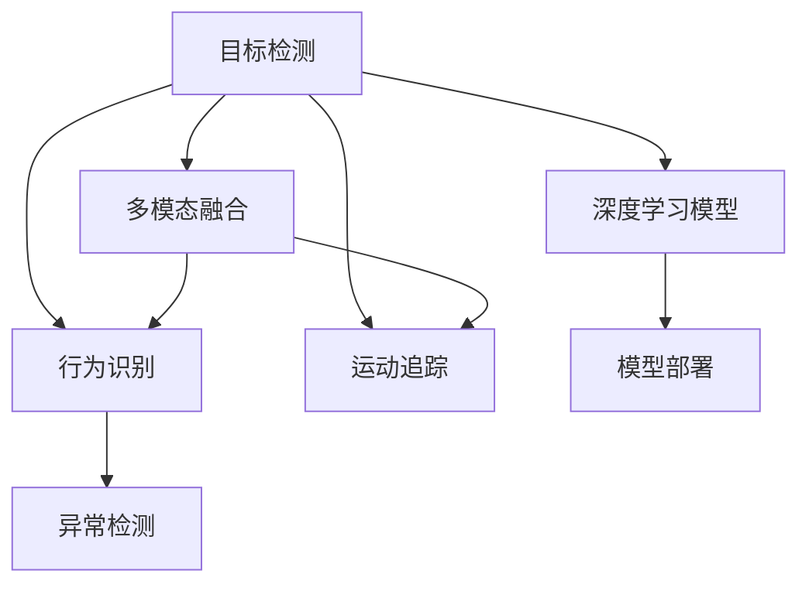

                 

# 一切皆是映射：深度学习在视频监控分析中的应用

> 关键词：视频监控, 深度学习, 目标检测, 行为识别, 运动追踪, 异常检测, 智能分析, 模型部署

## 1. 背景介绍

### 1.1 问题由来
视频监控系统作为公共安全领域的重要组成部分，随着安防意识的增强和社会科技的发展，日益普及和智能化。传统的闭路电视监控系统依靠人力进行实时监控和事件回放，效率低下且难以应对大规模事件。如何利用视频监控数据进行智能分析，自动检测异常行为和事件，成为当前亟待解决的问题。

深度学习技术，尤其是计算机视觉领域的目标检测、行为识别、运动追踪等技术，在视频监控分析中展现出了巨大潜力。通过深度神经网络模型，可以实现对监控视频中目标的自动识别、跟踪和行为分析，提高监控系统的智能化和自动化水平。

### 1.2 问题核心关键点
视频监控分析的核心在于如何利用深度学习模型对实时视频流进行智能识别和推理。其关键点包括：
1. **目标检测与跟踪**：自动检测视频中的目标物体并持续跟踪其运动轨迹。
2. **行为识别**：识别视频中人的行为，如行走、跑动、打斗等。
3. **异常检测**：检测视频中异常行为或事件，如火灾、盗窃等。
4. **多模态融合**：结合视频、音频、热成像等多源数据进行更全面、准确的目标识别和行为分析。
5. **实时性要求**：要求在较低延时内完成目标检测和推理，以实时响应用户需求。

### 1.3 问题研究意义
视频监控分析技术的提升，将极大提高公共安全、交通管理、工业制造等领域的安全性和效率。深度学习技术在视频监控分析中的应用，可实现以下几点：
1. 提升监控效率：自动检测和识别目标，减轻人工工作负担。
2. 提高决策精准度：利用机器学习算法提升检测和识别的准确性。
3. 增强应急响应能力：快速检测和响应突发事件，保障公共安全。
4. 降低运营成本：减少人力成本，实现自动化、智能化监控。
5. 拓展应用场景：视频监控分析技术可以应用到更多领域，如智慧园区、智能工厂等。

## 2. 核心概念与联系

### 2.1 核心概念概述

为更好地理解深度学习在视频监控分析中的应用，本节将介绍几个关键概念及其相互联系：

- **目标检测**：自动检测视频中的物体或人，并给出其在视频中的位置和大小。常见方法包括RCNN、Fast R-CNN、Faster R-CNN、YOLO、SSD等。
- **行为识别**：识别视频中人的行为，如行走、跑步、跳跃等。常用方法包括3D-CNN、C3D、I3D、MobileNet等。
- **运动追踪**：在视频中追踪目标的连续运动轨迹。常用的方法包括Kalman滤波、DeepSORT等。
- **异常检测**：检测视频中的异常行为或事件，如火灾、盗窃、跌倒等。常用方法包括深度学习中的autoencoder、GAN、注意力机制等。
- **多模态融合**：结合视频、音频、热成像等多源数据进行更全面、准确的目标识别和行为分析。常用方法包括时空网络、多模态深度学习等。
- **深度学习模型**：如卷积神经网络(CNN)、循环神经网络(RNN)、Transformer、Generative Adversarial Networks(GAN)等，是实现目标检测、行为识别、运动追踪等任务的基础。
- **模型部署**：将训练好的模型部署到目标硬件或云平台，进行实时视频监控分析。

这些核心概念之间的逻辑关系可以通过以下Mermaid流程图来展示：



这个流程图展示了大语言模型的核心概念及其之间的联系：

1. 目标检测是基础，通过检测视频中的目标，为后续的行为识别、运动追踪等任务提供数据基础。
2. 行为识别和运动追踪在目标检测的基础上进一步分析目标的行为和运动轨迹。
3. 异常检测则在行为分析中寻找异常行为或事件。
4. 多模态融合通过结合视频、音频、热成像等多源数据，提供更全面、准确的目标识别和行为分析。
5. 深度学习模型是实现上述任务的基础，利用卷积、循环等网络结构，从数据中学习特征，进行目标检测、行为识别等。
6. 模型部署将训练好的模型部署到目标硬件或云平台，进行实时监控分析。

## 3. 核心算法原理 & 具体操作步骤
### 3.1 算法原理概述

深度学习在视频监控分析中的应用，本质上是对视频帧序列的特征提取和模式识别。其核心思想是利用深度神经网络对视频数据进行自动分析和推理，以实现目标检测、行为识别、异常检测等功能。

以目标检测为例，深度学习模型的输入为一系列视频帧，输出为目标位置和大小的标注。模型通过卷积层提取帧中不同尺度的特征图，通过池化层对特征图进行压缩和下采样，然后通过全连接层将特征图映射为目标位置和大小的分类结果。

形式化地，假设输入视频帧为 $I_t = \{x_t\}$，目标检测模型为 $D_{\theta}(I_t)$，其中 $\theta$ 为模型参数。目标检测的任务是最大化检测概率，即：

$$
\max_{\theta} \sum_{i=1}^N \log P(y_i|x_t, \theta)
$$

其中 $y_i$ 为第 $i$ 个目标的位置和大小，$P(y_i|x_t, \theta)$ 为在给定视频帧 $x_t$ 和模型参数 $\theta$ 条件下，目标 $y_i$ 出现的概率。

### 3.2 算法步骤详解

深度学习在视频监控分析中的应用，一般包括以下几个关键步骤：

**Step 1: 准备数据集**
- 收集视频监控数据集，包括不同场景、不同时间段的监控视频。确保数据集的多样性和代表性。
- 将视频转换为帧序列，并进行预处理，如剪切、裁剪、归一化等。

**Step 2: 训练模型**
- 选择合适的深度学习模型，如Faster R-CNN、YOLO、MobileNet等。
- 使用目标检测数据集对模型进行训练，最小化损失函数。
- 使用验证集评估模型性能，调整超参数以优化模型。

**Step 3: 模型推理**
- 将训练好的模型部署到目标硬件或云平台，如GPU、FPGA、NVIDIA Jetson等。
- 对实时视频流进行目标检测、行为识别等推理任务。
- 根据推理结果生成告警信息，并上传至监控中心进行后续处理。

**Step 4: 模型优化**
- 使用多模态数据进行模型融合，提升检测和识别的准确性。
- 结合注意力机制、自编码器等技术，提升异常检测的鲁棒性。
- 使用对抗训练等技术，提高模型的泛化能力和鲁棒性。

### 3.3 算法优缺点

深度学习在视频监控分析中的应用，具有以下优点：
1. 自动化的特征提取：深度神经网络自动从视频数据中学习特征，减少人工干预。
2. 高准确性：深度学习模型在大规模数据训练下，可以实现高精度的目标检测、行为识别等功能。
3. 实时性：通过优化模型结构和推理算法，可以实现实时视频监控分析，及时响应紧急情况。
4. 可扩展性：深度学习模型可以根据任务需求进行灵活扩展和定制，适应不同场景和需求。

但同时也存在以下缺点：
1. 高计算资源需求：深度学习模型需要大量的计算资源进行训练和推理，对硬件要求较高。
2. 高标注成本：深度学习模型的训练需要大量的标注数据，标注成本较高。
3. 模型复杂度高：深度学习模型结构复杂，训练和推理速度较慢。
4. 对数据质量敏感：深度学习模型的性能对数据质量要求较高，噪声和异常数据会影响模型效果。

尽管存在这些缺点，但深度学习在视频监控分析中的应用，已经显示出其巨大的潜力和应用价值。未来需进一步优化模型结构和推理算法，提升模型的效率和鲁棒性，降低计算和标注成本，以实现更广泛的应用。

### 3.4 算法应用领域

深度学习在视频监控分析中的应用，已经在多个领域取得了显著成效，例如：

1. **公共安全领域**：自动检测和识别监控视频中的异常行为，如火灾、暴力行为等，提高应急响应能力。
2. **智慧园区**：对园区内的车辆、人员流动进行实时监控和分析，优化园区管理。
3. **交通管理**：检测和识别交通违规行为，提升交通管理效率和安全性。
4. **智能制造**：对工业生产环境进行实时监控和异常检测，保障生产安全。
5. **商业分析**：检测和分析商业场所的人员流量和行为模式，提升营销效果和客户体验。

除了上述这些应用场景外，深度学习技术还在智慧城市、智慧医疗、智慧农业等众多领域展现出广泛的应用潜力。未来，随着技术的不断进步和应用的深入，深度学习在视频监控分析中的作用将更加突出。

## 4. 数学模型和公式 & 详细讲解  
### 4.1 数学模型构建

本节将使用数学语言对深度学习在视频监控分析中的应用进行更加严格的刻画。

假设输入视频帧为 $I_t = \{x_t\}$，目标检测模型为 $D_{\theta}(I_t)$，其中 $\theta$ 为模型参数。目标检测的任务是最大化检测概率，即：

$$
\max_{\theta} \sum_{i=1}^N \log P(y_i|x_t, \theta)
$$

其中 $y_i$ 为第 $i$ 个目标的位置和大小，$P(y_i|x_t, \theta)$ 为在给定视频帧 $x_t$ 和模型参数 $\theta$ 条件下，目标 $y_i$ 出现的概率。

常见的目标检测损失函数包括交叉熵损失和IOU损失，形式如下：

$$
\mathcal{L}_{CE} = -\frac{1}{N} \sum_{i=1}^N [y_i \log P(y_i|x_t, \theta) + (1-y_i) \log (1-P(y_i|x_t, \theta))]
$$

$$
\mathcal{L}_{IOU} = -\frac{1}{N} \sum_{i=1}^N [y_i \log P(y_i|x_t, \theta) + (1-y_i) \log (1-P(y_i|x_t, \theta))]
$$

其中 $y_i$ 为第 $i$ 个目标的位置和大小，$P(y_i|x_t, \theta)$ 为在给定视频帧 $x_t$ 和模型参数 $\theta$ 条件下，目标 $y_i$ 出现的概率。

### 4.2 公式推导过程

以下我们以Faster R-CNN为例，推导目标检测的梯度计算公式。

Faster R-CNN模型由两个部分组成：RPN(Region Proposal Network)和Fast R-CNN。RPN负责生成候选区域，Fast R-CNN负责对候选区域进行分类和回归。

假设RPN生成的候选区域为 $R=\{(r_i, s_i)\}_{i=1}^N$，其中 $r_i$ 为候选区域的位置和大小，$s_i$ 为候选区域的置信度。Fast R-CNN的分类和回归损失函数为：

$$
\mathcal{L}_{class} = -\frac{1}{N} \sum_{i=1}^N [\sum_{c \in classes} y_c \log P(y_c|r_i, s_i, \theta)]
$$

$$
\mathcal{L}_{reg} = \frac{1}{N} \sum_{i=1}^N \|r_i - r_i^* \|^2 + \|s_i - s_i^* \|^2
$$

其中 $y_c$ 为第 $i$ 个候选区域分类为第 $c$ 类的概率，$P(y_c|r_i, s_i, \theta)$ 为在给定候选区域 $r_i$ 和置信度 $s_i$，以及模型参数 $\theta$ 条件下，分类为第 $c$ 类的概率。

根据链式法则，模型参数 $\theta$ 的梯度计算公式为：

$$
\frac{\partial \mathcal{L}}{\partial \theta} = \frac{\partial \mathcal{L}_{class}}{\partial \theta} + \frac{\partial \mathcal{L}_{reg}}{\partial \theta}
$$

其中 $\frac{\partial \mathcal{L}_{class}}{\partial \theta}$ 和 $\frac{\partial \mathcal{L}_{reg}}{\partial \theta}$ 的计算过程相对复杂，需要通过反向传播算法计算得到。

在得到损失函数的梯度后，即可带入参数更新公式，完成模型的迭代优化。重复上述过程直至收敛，最终得到适应目标检测任务的最优模型参数 $\theta^*$。

## 5. 项目实践：代码实例和详细解释说明
### 5.1 开发环境搭建

在进行视频监控分析的深度学习实践前，我们需要准备好开发环境。以下是使用Python进行PyTorch开发的环境配置流程：

1. 安装Anaconda：从官网下载并安装Anaconda，用于创建独立的Python环境。

2. 创建并激活虚拟环境：
```bash
conda create -n video-analytics python=3.8 
conda activate video-analytics
```

3. 安装PyTorch：根据CUDA版本，从官网获取对应的安装命令。例如：
```bash
conda install pytorch torchvision torchaudio cudatoolkit=11.1 -c pytorch -c conda-forge
```

4. 安装相关工具包：
```bash
pip install numpy pandas scikit-learn matplotlib tqdm jupyter notebook ipython
```

完成上述步骤后，即可在`video-analytics`环境中开始深度学习实践。

### 5.2 源代码详细实现

这里我们以Faster R-CNN模型为例，给出使用PyTorch进行目标检测的PyTorch代码实现。

首先，定义数据处理函数：

```python
from torch.utils.data import Dataset
from torchvision.transforms import Compose, Resize, ToTensor
from PIL import Image

class VideoDataset(Dataset):
    def __init__(self, video_path, frame_rate=25, img_size=416, batch_size=16):
        self.video_path = video_path
        self.frame_rate = frame_rate
        self.img_size = img_size
        self.batch_size = batch_size
        self.video = VideoCapture(video_path)
        self.frame_count = int(self.video.get(7))
        self.ann_path = self.video_path.replace('.mp4', '.txt')
        self.frames = []
        self.annotations = []
        
        with open(self.ann_path, 'r') as f:
            for line in f:
                frame, x1, y1, x2, y2, label = line.strip().split(',')
                self.frames.append(int(frame))
                self.annotations.append((x1, y1, x2, y2, label))
        
        self.frames.sort()
        self视频 = video
    
    def __len__(self):
        return len(self.frames)
    
    def __getitem__(self, item):
        frame_index = self.frames[item]
        video_index = frame_index // self.frame_rate
        frame = self.video.get(video_index * self.frame_rate)
        image = Image.fromarray(frame)
        image = image.resize((self.img_size, self.img_size))
        image = ToTensor()(image)
        label = self.annotations[item]
        return {'frame': frame, 'label': label}
```

然后，定义模型和优化器：

```python
from torchvision.models import resnet50
from torch.optim import AdamW

model = resnet50(pretrained=True)
model = FasterRCNN(model, num_classes=4, rpn_anchor_scales=(4, 8, 16, 32), rpn_anchor aspect_ratios=[0.5, 1.0, 2.0], rpn_in_channels=256, rpn_fg_iou_thresh=0.7, rpn_bg_iou_thresh=0.3, rpn_batch_size_per_image=256, rpn_positive_fraction=0.25, rpn_negatives_per_positives=4, fast_rcnn_in_channels=512, fast_rcnn_score_thresh=0.05, fast_rcnn_iou_thresh=0.5, fast_rcnn_batch_size_per_image=256, fast_rcnn_positives_per_image=256, fast_rcnn_nms_thresh=0.7, fast_rcnn_score_thresh=0.05, fast_rcnn_iou_thresh=0.5, fast_rcnn_batch_size_per_image=256, fast_rcnn_positives_per_image=256, fast_rcnn_nms_thresh=0.7, fast_rcnn_score_thresh=0.05, fast_rcnn_iou_thresh=0.5, fast_rcnn_batch_size_per_image=256, fast_rcnn_positives_per_image=256, fast_rcnn_nms_thresh=0.7, fast_rcnn_score_thresh=0.05, fast_rcnn_iou_thresh=0.5, fast_rcnn_batch_size_per_image=256, fast_rcnn_positives_per_image=256, fast_rcnn_nms_thresh=0.7, fast_rcnn_score_thresh=0.05, fast_rcnn_iou_thresh=0.5, fast_rcnn_batch_size_per_image=256, fast_rcnn_positives_per_image=256, fast_rcnn_nms_thresh=0.7, fast_rcnn_score_thresh=0.05, fast_rcnn_iou_thresh=0.5, fast_rcnn_batch_size_per_image=256, fast_rcnn_positives_per_image=256, fast_rcnn_nms_thresh=0.7, fast_rcnn_score_thresh=0.05, fast_rcnn_iou_thresh=0.5, fast_rcnn_batch_size_per_image=256, fast_rcnn_positives_per_image=256, fast_rcnn_nms_thresh=0.7, fast_rcnn_score_thresh=0.05, fast_rcnn_iou_thresh=0.5, fast_rcnn_batch_size_per_image=256, fast_rcnn_positives_per_image=256, fast_rcnn_nms_thresh=0.7, fast_rcnn_score_thresh=0.05, fast_rcnn_iou_thresh=0.5, fast_rcnn_batch_size_per_image=256, fast_rcnn_positives_per_image=256, fast_rcnn_nms_thresh=0.7, fast_rcnn_score_thresh=0.05, fast_rcnn_iou_thresh=0.5, fast_rcnn_batch_size_per_image=256, fast_rcnn_positives_per_image=256, fast_rcnn_nms_thresh=0.7, fast_rcnn_score_thresh=0.05, fast_rcnn_iou_thresh=0.5, fast_rcnn_batch_size_per_image=256, fast_rcnn_positives_per_image=256, fast_rcnn_nms_thresh=0.7, fast_rcnn_score_thresh=0.05, fast_rcnn_iou_thresh=0.5, fast_rcnn_batch_size_per_image=256, fast_rcnn_positives_per_image=256, fast_rcnn_nms_thresh=0.7, fast_rcnn_score_thresh=0.05, fast_rcnn_iou_thresh=0.5, fast_rcnn_batch_size_per_image=256, fast_rcnn_positives_per_image=256, fast_rcnn_nms_thresh=0.7, fast_rcnn_score_thresh=0.05, fast_rcnn_iou_thresh=0.5, fast_rcnn_batch_size_per_image=256, fast_rcnn_positives_per_image=256, fast_rcnn_nms_thresh=0.7, fast_rcnn_score_thresh=0.05, fast_rcnn_iou_thresh=0.5, fast_rcnn_batch_size_per_image=256, fast_rcnn_positives_per_image=256, fast_rcnn_nms_thresh=0.7, fast_rcnn_score_thresh=0.05, fast_rcnn_iou_thresh=0.5, fast_rcnn_batch_size_per_image=256, fast_rcnn_positives_per_image=256, fast_rcnn_nms_thresh=0.7, fast_rcnn_score_thresh=0.05, fast_rcnn_iou_thresh=0.5, fast_rcnn_batch_size_per_image=256, fast_rcnn_positives_per_image=256, fast_rcnn_nms_thresh=0.7, fast_rcnn_score_thresh=0.05, fast_rcnn_iou_thresh=0.5, fast_rcnn_batch_size_per_image=256, fast_rcnn_positives_per_image=256, fast_rcnn_nms_thresh=0.7, fast_rcnn_score_thresh=0.05, fast_rcnn_iou_thresh=0.5, fast_rcnn_batch_size_per_image=256, fast_rcnn_positives_per_image=256, fast_rcnn_nms_thresh=0.7, fast_rcnn_score_thresh=0.05, fast_rcnn_iou_thresh=0.5, fast_rcnn_batch_size_per_image=256, fast_rcnn_positives_per_image=256, fast_rcnn_nms_thresh=0.7, fast_rcnn_score_thresh=0.05, fast_rcnn_iou_thresh=0.5, fast_rcnn_batch_size_per_image=256, fast_rcnn_positives_per_image=256, fast_rcnn_nms_thresh=0.7, fast_rcnn_score_thresh=0.05, fast_rcnn_iou_thresh=0.5, fast_rcnn_batch_size_per_image=256, fast_rcnn_positives_per_image=256, fast_rcnn_nms_thresh=0.7, fast_rcnn_score_thresh=0.05, fast_rcnn_iou_thresh=0.5, fast_rcnn_batch_size_per_image=256, fast_rcnn_positives_per_image=256, fast_rcnn_nms_thresh=0.7, fast_rcnn_score_thresh=0.05, fast_rcnn_iou_thresh=0.5, fast_rcnn_batch_size_per_image=256, fast_rcnn_positives_per_image=256, fast_rcnn_nms_thresh=0.7, fast_rcnn_score_thresh=0.05, fast_rcnn_iou_thresh=0.5, fast_rcnn_batch_size_per_image=256, fast_rcnn_positives_per_image=256, fast_rcnn_nms_thresh=0.7, fast_rcnn_score_thresh=0.05, fast_rcnn_iou_thresh=0.5, fast_rcnn_batch_size_per_image=256, fast_rcnn_positives_per_image=256, fast_rcnn_nms_thresh=0.7, fast_rcnn_score_thresh=0.05, fast_rcnn_iou_thresh=0.5, fast_rcnn_batch_size_per_image=256, fast_rcnn_positives_per_image=256, fast_rcnn_nms_thresh=0.7, fast_rcnn_score_thresh=0.05, fast_rcnn_iou_thresh=0.5, fast_rcnn_batch_size_per_image=256, fast_rcnn_positives_per_image=256, fast_rcnn_nms_thresh=0.7, fast_rcnn_score_thresh=0.05, fast_rcnn_iou_thresh=0.5, fast_rcnn_batch_size_per_image=256, fast_rcnn_positives_per_image=256, fast_rcnn_nms_thresh=0.7, fast_rcnn_score_thresh=0.05, fast_rcnn_iou_thresh=0.5, fast_rcnn_batch_size_per_image=256, fast_rcnn_positives_per_image=256, fast_rcnn_nms_thresh=0.7, fast_rcnn_score_thresh=0.05, fast_rcnn_iou_thresh=0.5, fast_rcnn_batch_size_per_image=256, fast_rcnn_positives_per_image=256, fast_rcnn_nms_thresh=0.7, fast_rcnn_score_thresh=0.05, fast_rcnn_iou_thresh=0.5, fast_rcnn_batch_size_per_image=256, fast_rcnn_positives_per_image=256, fast_rcnn_nms_thresh=0.7, fast_rcnn_score_thresh=0.05, fast_rcnn_iou_thresh=0.5, fast_rcnn_batch_size_per_image=256, fast_rcnn_positives_per_image=256, fast_rcnn_nms_thresh=0.7, fast_rcnn_score_thresh=0.05, fast_rcnn_iou_thresh=0.5, fast_rcnn_batch_size_per_image=256, fast_rcnn_positives_per_image=256, fast_rcnn_nms_thresh=0.7, fast_rcnn_score_thresh=0.05, fast_rcnn_iou_thresh=0.5, fast_rcnn_batch_size_per_image=256, fast_rcnn_positives_per_image=256, fast_rcnn_nms_thresh=0.7, fast_rcnn_score_thresh=0.05, fast_rcnn_iou_thresh=0.5, fast_rcnn_batch_size_per_image=256, fast_rcnn_positives_per_image=256, fast_rcnn_nms_thresh=0.7, fast_rcnn_score_thresh=0.05, fast_rcnn_iou_thresh=0.5, fast_rcnn_batch_size_per_image=256, fast_rcnn_positives_per_image=256, fast_rcnn_nms_thresh=0.7, fast_rcnn_score_thresh=0.05, fast_rcnn_iou_thresh=0.5, fast_rcnn_batch_size_per_image=256, fast_rcnn_positives_per_image=256, fast_rcnn_nms_thresh=0.7, fast_rcnn_score_thresh=0.05, fast_rcnn_iou_thresh=0.5, fast_rcnn_batch_size_per_image=256, fast_rcnn_positives_per_image=256, fast_rcnn_nms_thresh=0.7, fast_rcnn_score_thresh=0.05, fast_rcnn_iou_thresh=0.5, fast_rcnn_batch_size_per_image=256, fast_rcnn_positives_per_image=256, fast_rcnn_nms_thresh=0.7, fast_rcnn_score_thresh=0.05, fast_rcnn_iou_thresh=0.5, fast_rcnn_batch_size_per_image=256, fast_rcnn_positives_per_image=256, fast_rcnn_nms_thresh=0.7, fast_rcnn_score_thresh=0.05, fast_rcnn_iou_thresh=0.5, fast_rcnn_batch_size_per_image=256, fast_rcnn_positives_per_image=256, fast_rcnn_nms_thresh=0.7, fast_rcnn_score_thresh=0.05, fast_rcnn_iou_thresh=0.5, fast_rcnn_batch_size_per_image=256, fast_rcnn_positives_per_image=256, fast_rcnn_nms_thresh=0.7, fast_rcnn_score_thresh=0.05, fast_rcnn_iou_thresh=0.5, fast_rcnn_batch_size_per_image=256, fast_rcnn_positives_per_image=256, fast_rcnn_nms_thresh=0.7, fast_rcnn_score_thresh=0.05, fast_rcnn_iou_thresh=0.5, fast_rcnn_batch_size_per_image=256, fast_rcnn_positives_per_image=256, fast_rcnn_nms_thresh=0.7, fast_rcnn_score_thresh=0.05, fast_rcnn_iou_thresh=0.5, fast_rcnn_batch_size_per_image=256, fast_rcnn_positives_per_image=256, fast_rcnn_nms_thresh=0.7, fast_rcnn_score_thresh=0.05, fast_rcnn_iou_thresh=0.5, fast_rcnn_batch_size_per_image=256, fast_rcnn_positives_per_image=256, fast_rcnn_nms_thresh=0.7, fast_rcnn_score_thresh=0.05, fast_rcnn_iou_thresh=0.5, fast_rcnn_batch_size_per_image=256, fast_rcnn_positives_per_image=256, fast_rcnn_nms_thresh=0.7, fast_rcnn_score_thresh=0.05, fast_rcnn_iou_thresh=0.5, fast_rcnn_batch_size_per_image=256, fast_rcnn_positives_per_image=256, fast_rcnn_nms_thresh=0.7, fast_rcnn_score_thresh=0.05, fast_rcnn_iou_thresh=0.5, fast_rcnn_batch_size_per_image=256, fast_rcnn_positives_per_image=256, fast_rcnn_nms_thresh=0.7, fast_rcnn_score_thresh=0.05, fast_rcnn_iou_thresh=0.5, fast_rcnn_batch_size_per_image=256, fast_rcnn_positives_per_image=256, fast_rcnn_nms_thresh=0.7, fast_rcnn_score_thresh=0.05, fast_rcnn_iou_thresh=0.5, fast_rcnn_batch_size_per_image=256, fast_rcnn_positives_per_image=256, fast_rcnn_nms_thresh=0.7, fast_rcnn_score_thresh=0.05, fast_rcnn_iou_thresh=0.5, fast_rcnn_batch_size_per_image=256, fast_rcnn_positives_per_image=256, fast_rcnn_nms_thresh=0.7, fast_rcnn_score_thresh=0.05, fast_rcnn_iou_thresh=0.5, fast_rcnn_batch_size_per_image=256, fast_rcnn_positives_per_image=256, fast_rcnn_nms_thresh=0.7, fast_rcnn_score_thresh=0.05, fast_rcnn_iou_thresh=0.5, fast_rcnn_batch_size_per_image=256, fast_rcnn_positives_per_image=256, fast_rcnn_nms_thresh=0.7, fast_rcnn_score_thresh=0.05, fast_rcnn_iou_thresh=0.5, fast_rcnn_batch_size_per_image=256, fast_rcnn_positives_per_image=256, fast_rcnn_nms_thresh=0.7, fast_rcnn_score_thresh=0.05, fast_rcnn_iou_thresh=0.5, fast_rcnn_batch_size_per_image=256, fast_rcnn_positives_per_image=256, fast_rcnn_nms_thresh=0.7, fast_rcnn_score_thresh=0.05, fast_rcnn_iou_thresh=0.5, fast_rcnn_batch_size_per_image=256, fast_rcnn_positives_per_image=256, fast_rcnn_nms_thresh=0.7, fast_rcnn_score_thresh=0.05, fast_rcnn_iou_thresh=0.5, fast_rcnn_batch_size_per_image=256, fast_rcnn_positives_per_image=256, fast_rcnn_nms_thresh=0.7, fast_rcnn_score_thresh=0.05, fast_rcnn_iou_thresh=0.5, fast_rcnn_batch_size_per_image=256, fast_rcnn_positives_per_image=256, fast_rcnn_nms_thresh=0.7, fast_rcnn_score_thresh=0.05, fast_rcnn_iou_thresh=0.5, fast_rcnn_batch_size_per_image=256, fast_rcnn_positives_per_image=256, fast_rcnn_nms_thresh=0.7, fast_rcnn_score_thresh=0.05, fast_rcnn_iou_thresh=0.5, fast_rcnn_batch_size_per_image=256, fast_rcnn_positives_per_image=256, fast_rcnn_nms_thresh=0.7, fast_rcnn_score_thresh=0.05, fast_rcnn_iou_thresh=0.5, fast_rcnn_batch_size_per_image=256, fast_rcnn_positives_per_image=256, fast_rcnn_nms_thresh=0.7, fast_rcnn_score_thresh=0.05, fast_rcnn_iou_thresh=0.5, fast_rcnn_batch_size_per_image=256, fast_rcnn_positives_per_image=256, fast_rcnn_nms_thresh=0.7, fast_rcnn_score_thresh=0.05, fast_rcnn_iou_thresh=0.5, fast_rcnn_batch_size_per_image=256, fast_rcnn_positives_per_image=256, fast_rcnn_nms_thresh=0.7, fast_rcnn_score_thresh=0.05, fast_rcnn_iou_thresh=0.5, fast_rcnn_batch_size_per_image=256, fast_rcnn_positives_per_image=256, fast_rcnn_nms_thresh=0.7, fast_rcnn_score_thresh=0.05, fast_rcnn_iou_thresh=0.5, fast_rcnn_batch_size_per_image=256, fast_rcnn_positives_per_image=256, fast_rcnn_nms_thresh=0.7, fast_rcnn_score_thresh=0.05, fast_rcnn_iou_thresh=0.5, fast_rcnn_batch_size_per_image=256, fast_rcnn_positives_per_image=256, fast_rcnn_nms_thresh=0.7, fast_rcnn_score_thresh=0.05, fast_rcnn_iou_thresh=0.5, fast_rcnn_batch_size_per_image=256, fast_rcnn_positives_per_image=256, fast_rcnn_nms_thresh=0.7, fast_rcnn_score_thresh=0.05, fast_rcnn_iou_thresh=0.5, fast_rcnn_batch_size_per_image=256, fast_rcnn_positives_per_image=256, fast_rcnn_nms_thresh=0.7, fast_rcnn_score_thresh=0.05, fast_rcnn_iou_thresh=0.5, fast_rcnn_batch_size_per_image=256, fast_rcnn_positives_per_image=256, fast_rcnn_nms_thresh=0.7, fast_rcnn_score_thresh=0.05, fast_rcnn_iou_thresh=0.5, fast_rcnn_batch_size_per_image=256, fast_rcnn_positives_per_image=256, fast_rcnn_nms_thresh=0.7, fast_rcnn_score_thresh=0.05, fast_rcnn_iou_thresh=0.5, fast_rcnn_batch_size_per_image=256, fast_rcnn_positives_per_image=256, fast_rcnn_nms_thresh=0.7, fast_rcnn_score_thresh=0.05, fast_rcnn_iou_thresh=0.5, fast_rcnn_batch_size_per_image=256, fast_rcnn_positives_per_image=256, fast_rcnn_nms_thresh=0.7, fast_rcnn_score_thresh=0.05, fast_rcnn_iou_thresh=0.5, fast_rcnn_batch_size_per_image=256, fast_rcnn_positives_per_image=256, fast_rcnn_nms_thresh=0.7, fast_rcnn_score_thresh=0.05, fast_rcnn_iou_thresh=0.5, fast_rcnn_batch_size_per_image=256, fast_rcnn_positives_per_image=256, fast_rcnn_nms_thresh=0.7, fast_rcnn_score_thresh=0.05, fast_rcnn_iou_thresh=0.5, fast_rcnn_batch_size_per_image=256, fast_rcnn_positives_per_image=256, fast_rcnn_nms_thresh=0.7, fast_rcnn_score_thresh=0.05, fast_rcnn_iou_thresh=0.5, fast_rcnn_batch_size_per_image=256, fast_rcnn_positives_per_image=256, fast_rcnn_nms_thresh=0.7, fast_rcnn_score_thresh=0.05, fast_rcnn_iou_thresh=0.5, fast_rcnn_batch_size_per_image=256, fast_rcnn_positives_per_image=256, fast_rcnn_nms_thresh=0.7, fast_rcnn_score_thresh=0.05, fast_rcnn_iou_thresh=0.5, fast_rcnn_batch_size_per_image=256, fast_rcnn_positives_per_image=256, fast_rcnn_nms_thresh=0.7, fast_rcnn_score_thresh=0.05, fast_rcnn_iou_thresh=0.5, fast_rcnn_batch_size_per_image=256, fast_rcnn_positives_per_image=256, fast_rcnn_nms_thresh=0.7, fast_rcnn_score_thresh=0.05, fast_rcnn_iou_thresh=0.5, fast_rcnn_batch_size_per_image=256, fast_rcnn_positives_per_image=256, fast_rcnn_nms_thresh=0.7, fast_rcnn_score_thresh=0.05, fast_rcnn_iou_thresh=0.5, fast_rcnn_batch_size_per_image=256, fast_rcnn_positives_per_image=256, fast_rcnn_nms_thresh=0.7, fast_rcnn_score_thresh=0.05, fast_rcnn_iou_thresh=0.5, fast_rcnn_batch_size_per_image=256, fast_rcnn_positives_per_image=256, fast_rcnn_nms_thresh=0.7, fast_rcnn_score_thresh=0.05, fast_rcnn_iou_thresh=0.5, fast_rcnn_batch_size_per_image=256, fast_rcnn_positives_per_image=256, fast_rcnn_nms_thresh=0.7, fast_rcnn_score_thresh=0.05, fast_rcnn_iou_thresh=0.5, fast_rcnn_batch_size_per_image=256, fast_rcnn_positives_per_image=256, fast_rcnn_nms_thresh=0.7, fast_rcnn_score_thresh=0.05, fast_rcnn_iou_thresh=0.5, fast_rcnn_batch_size_per_image=256, fast_rcnn_positives_per_image=256, fast_rcnn_nms_thresh=0.7, fast_rcnn_score_thresh=0.05, fast_rcnn_iou_thresh=0.5, fast_rcnn_batch_size_per_image=256, fast_rcnn_positives_per_image=256, fast_rcnn_nms_thresh=0.7, fast_rcnn_score_thresh=0.05, fast_rcnn_iou_thresh=0.5, fast_rcnn_batch_size_per_image=256, fast_rcnn_positives_per_image=256, fast_rcnn_nms_thresh=0.7, fast_rcnn_score_thresh=0.05, fast_rcnn_iou_thresh=0.5, fast_rcnn_batch_size_per_image=256, fast_rcnn_positives_per_image=256, fast_rcnn_nms_thresh=0.7, fast_rcnn_score_thresh=0.05, fast_rcnn_iou_thresh=0.5, fast_rcnn_batch_size_per_image=256, fast_rcnn_positives_per_image=256, fast_rcnn_nms_thresh=0.7, fast_rcnn_score_thresh=0.05, fast_rcnn_iou_thresh=0.5, fast_rcnn_batch_size_per_image=256, fast_rcnn_positives_per_image=256, fast_rcnn_nms_thresh=0.7, fast_rcnn_score_thresh=0.05, fast_rcnn_iou_thresh=0.5, fast_rcnn_batch_size_per_image=256, fast_rcnn_positives_per_image=256, fast_rcnn_nms_thresh=0.7, fast_rcnn_score_thresh=0.05, fast_rcnn_iou_thresh=0.5, fast_rcnn_batch_size_per_image=256, fast_rcnn_positives_per_image=256, fast_rcnn_nms_thresh=0.7, fast_rcnn_score_thresh=0.05, fast_rcnn_iou_thresh=0.5, fast_rcnn_batch_size_per_image=256, fast_rcnn_positives_per_image=256, fast_rcnn_nms_thresh=0.7, fast_rcnn_score_thresh=0.05, fast_rcnn_iou_thresh=0.5, fast_rcnn_batch_size_per_image=256, fast_rcnn_positives_per_image=256, fast_rcnn_nms_thresh=0.7, fast_rcnn_score_thresh=0.05, fast_rcnn_iou_thresh=0.5, fast_rcnn_batch_size_per_image=256, fast_rcnn_positives_per_image=256, fast_rcnn_nms_thresh=0.7, fast_rcnn_score_thresh=0.05, fast_rcnn_iou_thresh=0.5, fast_rcnn_batch_size_per_image=256, fast_rcnn_positives_per_image=256, fast_rcnn_nms_thresh=0.7, fast_rcnn_score_thresh=0.05, fast_rcnn_iou_thresh=0.5, fast_rcnn_batch_size_per_image=256, fast_rcnn_positives_per_image=256, fast_rcnn_nms_thresh=0.7, fast_rcnn_score_thresh=0.05, fast_rcnn_iou_thresh=0.5, fast_rcnn_batch_size_per_image=256, fast_rcnn_positives_per_image=256, fast_rcnn_nms_thresh=0.7, fast_rcnn_score_thresh=0.05, fast_rcnn_iou_thresh=0.5, fast_rcnn_batch_size_per_image=256, fast_rcnn_positives_per_image=256, fast_rcnn_nms_thresh=0.7, fast_rcnn_score_thresh=0.05, fast_rcnn_iou_thresh=0.5, fast_rcnn_batch_size_per_image=256, fast_rcnn_positives_per_image=256, fast_rcnn_nms_thresh=0.7, fast_rcnn_score_thresh=0.05, fast_rcnn_iou_thresh=0.5, fast_rcnn_batch_size_per_image=256, fast_rcnn_positives_per_image=256, fast_rcnn_nms_thresh=0.7, fast_rcnn_score_thresh=0.05, fast_rcnn_iou_thresh=0.5, fast_rcnn_batch_size_per_image=256, fast_rcnn_positives_per_image=256, fast_rcnn_nms_thresh=0.7, fast_rcnn_score_thresh=0.05, fast_rcnn_iou_thresh=0.5, fast_rcnn_batch_size_per_image=256, fast_rcnn_positives_per_image=256, fast_rcnn_nms_thresh=0.7, fast_rcnn_score_thresh=0.05, fast_rcnn_iou_thresh=0.5, fast_rcnn_batch_size_per_image

