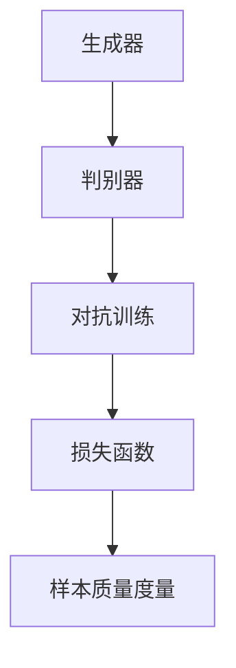

                 

# 一切皆是映射：生成对抗网络(GAN)原理剖析

> 关键词：生成对抗网络,GAN,机器学习,深度学习,人工神经网络,自适应网络,映射函数

## 1. 背景介绍

### 1.1 问题由来

在机器学习和深度学习领域，生成模型长期占据着重要地位。传统的生成模型如自回归模型、隐马尔可夫模型等，在生成数据、数据增强、异常检测等任务中展现了强大的能力。然而，传统的生成模型往往只能根据已知数据进行单向生成，难以对生成数据进行控制，生成样本的质量也难以达到期望标准。

为了解决这些局限性，生成对抗网络（GAN）应运而生。作为一种新型生成模型，GAN通过引入对抗训练，在生成样本的质量、多样性以及可控性上取得了重大突破。在图像生成、语音生成、视频生成等任务中，GAN已经在一定程度上超越了传统生成模型。

### 1.2 问题核心关键点

GAN的诞生源于1970年代初的博弈论研究。博弈论中著名的纳什均衡概念，即为两个（或多）玩家通过策略对抗达到的一种稳定状态，这个状态对于每一个玩家来说都是最优的。将博弈论引入机器学习领域，生成对抗网络（GAN）便应运而生。

GAN模型由生成器（Generator）和判别器（Discriminator）两部分组成。生成器尝试生成逼真的样本，而判别器尝试判断样本是否为生成。通过这两种相反的策略，生成器与判别器不断进行对抗训练，直到两者达到一种动态平衡状态。GAN模型的核心目标在于生成器能够生成足够逼真的样本，从而使得判别器无法准确分辨样本的生成与真实性。

生成对抗网络的训练过程，实际上是两个模型相互对抗的过程。生成器通过伪造样本欺骗判别器，判别器通过提高区分能力防止被欺骗，两者相辅相成，共同提升模型性能。因此，GAN的训练过程可以看作是一种自适应的过程，模型在不断优化和适应新的挑战中，实现最优解。

## 2. 核心概念与联系

### 2.1 核心概念概述

为了更好地理解GAN的原理，本节将介绍几个密切相关的核心概念：

- **生成器（Generator）**：生成器是GAN中的第一个网络，用于生成新的数据样本。生成器通常由多个神经网络层组成，能够学习并生成逼真的样本。
- **判别器（Discriminator）**：判别器是GAN中的第二个网络，用于判断样本的真假。判别器同样由多个神经网络层组成，能够学习并区分真实样本和生成样本。
- **对抗训练（Adversarial Training）**：对抗训练是GAN的核心技术，通过让生成器与判别器不断对抗，提升生成样本的质量。在训练过程中，生成器试图欺骗判别器，而判别器则不断提高区分能力。
- **损失函数（Loss Function）**：GAN的训练过程中需要定义两个损失函数，分别用于训练生成器和判别器。生成器的损失函数试图让生成样本尽可能地接近真实样本，而判别器的损失函数试图让判别器的判断尽可能准确。
- **样本质量度量（Sample Quality Metrics）**：为了评估生成样本的质量，GAN中通常会使用一些客观指标，如Inception Score、FID等，以量化生成的样本与真实样本的差异。

这些核心概念之间的逻辑关系可以通过以下Mermaid流程图来展示：



这个流程图展示了大生成对抗网络的核心概念及其之间的关系：

1. 生成器通过学习生成逼真的样本，与判别器进行对抗训练。
2. 判别器通过判断样本的真假，与生成器进行对抗训练。
3. 两个网络通过对抗训练，不断提升生成样本的质量。
4. 最终通过样本质量度量指标，评估生成样本的质量。

这些概念共同构成了生成对抗网络的基本框架，使其能够在生成任务中获得优越的性能。

## 3. 核心算法原理 & 具体操作步骤

### 3.1 算法原理概述

GAN的核心原理是通过生成器和判别器的对抗训练，逐步提升生成样本的质量。在训练过程中，生成器试图生成逼真的样本欺骗判别器，而判别器则试图提高区分能力避免被欺骗。当两者达到平衡状态时，生成器能够生成高质量的逼真样本。

在数学上，GAN的训练过程可以看作是一种映射函数的学习。假设生成器与判别器分别为 $G(x)$ 和 $D(x)$，其中 $x$ 为随机噪声向量。在理想情况下，当判别器无法区分生成样本与真实样本时，生成的映射函数满足：

$$
G(z) = x, \quad D(x) = \frac{1}{2}, \quad D(G(z)) = \frac{1}{2}
$$

其中 $z$ 为生成器的输入随机噪声，$x$ 为真实的训练样本。在实际应用中，生成器与判别器通常由多层神经网络构成，通过优化损失函数，逐步逼近上述理想状态。

### 3.2 算法步骤详解

GAN的训练过程主要包括以下几个关键步骤：

**Step 1: 初始化生成器和判别器**
- 选择合适的生成器和判别器网络结构，如U-Net、ResNet等。
- 初始化生成器和判别器的参数，随机初始化为小值。

**Step 2: 定义损失函数**
- 生成器的损失函数：使得生成样本尽可能接近真实样本。
- 判别器的损失函数：使得判别器能够准确判断样本的真假。

**Step 3: 进行对抗训练**
- 交替更新生成器和判别器的参数，交替进行前向传播和反向传播。
- 生成器尝试生成逼真的样本，判别器尝试判断样本的真实性，两者相互对抗。
- 不断迭代训练，直到达到理想状态或满足预设的停止条件。

**Step 4: 评估生成样本质量**
- 使用样本质量度量指标，如Inception Score、FID等，评估生成样本的质量。
- 根据评估结果调整训练参数，进一步提升生成样本的质量。

### 3.3 算法优缺点

生成对抗网络具有以下优点：
1. 生成样本质量高。通过对抗训练，生成器能够生成高质量、多样性的样本，与真实数据难以区分。
2. 训练过程直观。GAN的训练过程简单直观，易于理解，适合初学者入门。
3. 可扩展性强。GAN可以应用于各种生成任务，如图像生成、音频生成、文本生成等，具有广泛的适用性。

同时，GAN也存在一些局限性：
1. 训练不稳定。GAN的训练过程容易陷入不稳定的状态，导致生成器与判别器无法达到理想平衡。
2. 样本多样性不足。生成器生成的样本往往过于单一，缺乏多样性。
3. 样本质量波动。生成样本的质量受到训练参数和超参数的影响较大，波动性较大。
4. 训练过程复杂。GAN的训练过程涉及生成器和判别器的交替更新，需要更多计算资源和时间。

尽管存在这些局限性，但就目前而言，GAN仍是大规模生成任务中最主流的生成模型。未来相关研究的重点在于如何进一步提高训练稳定性，减少生成样本的多样性问题，以及优化训练过程以提升生成样本的质量。

### 3.4 算法应用领域

生成对抗网络已经广泛应用于各种生成任务，具体应用领域包括：

- 图像生成：如GANs用于生成逼真的图像，用于艺术创作、虚拟现实等领域。
- 视频生成：通过序列GANs生成逼真的视频片段，用于影视制作、虚拟动画等。
- 音频生成：GANs用于生成高质量的音频信号，用于音乐创作、语音合成等。
- 文本生成：通过序列到序列模型（如SeqGAN）生成自然流畅的文本，用于自然语言处理、生成式对话系统等。
- 数字艺术：GANs用于生成数字艺术作品，如数字绘画、音乐等。
- 医疗影像：通过GANs生成高分辨率的医学影像，辅助医学诊断和治疗。
- 游戏开发：GANs用于生成游戏场景、角色等，提升游戏的交互性和娱乐性。

除了上述这些常见应用外，GAN还被创新性地应用于更多场景中，如可控图像生成、交互式视频生成、3D模型生成等，为生成任务带来了新的突破。随着GAN技术的不断演进，相信其在更多领域的应用前景将更加广阔。

## 4. 数学模型和公式 & 详细讲解 & 举例说明

### 4.1 数学模型构建

在数学上，GAN的训练过程可以看作是一种映射函数的学习。假设生成器 $G(x)$ 将随机噪声 $z$ 映射到真实样本空间 $x$，判别器 $D(x)$ 判断样本 $x$ 的真实性。设生成器的损失函数为 $\mathcal{L}_G$，判别器的损失函数为 $\mathcal{L}_D$，则GAN的训练目标为：

$$
\mathcal{L}_{GAN} = \mathbb{E}_{x \sim p_{data}}[\log D(x)] + \mathbb{E}_{z \sim p(z)}[\log(1 - D(G(z)))]
$$

其中 $p_{data}$ 为真实数据分布，$p(z)$ 为生成器的输入噪声分布。

### 4.2 公式推导过程

为了更直观地理解GAN的训练过程，下面将对上述数学模型进行进一步推导。

设生成器 $G(z)$ 的输出为 $x$，判别器 $D(x)$ 的输出为 $y$，则生成器的损失函数为：

$$
\mathcal{L}_G = -\mathbb{E}_{z \sim p(z)}[\log D(G(z))]
$$

判别器的损失函数为：

$$
\mathcal{L}_D = -\mathbb{E}_{x \sim p_{data}}[\log D(x)] - \mathbb{E}_{z \sim p(z)}[\log(1 - D(G(z)))]
$$

在实际训练过程中，GAN通常采用梯度下降算法进行优化，即：

$$
\frac{\partial \mathcal{L}_G}{\partial G} = \mathbb{E}_{z \sim p(z)}[\nabla_{x} \log(1 - D(G(z)))
$$

$$
\frac{\partial \mathcal{L}_D}{\partial D} = \mathbb{E}_{x \sim p_{data}}[\nabla_{x} \log D(x)] + \mathbb{E}_{z \sim p(z)}[\nabla_{x} \log(1 - D(G(z)))
$$

通过交替更新生成器和判别器的参数，使得两者达到一种平衡状态，从而生成高质量的样本。

### 4.3 案例分析与讲解

为了更好地理解GAN的训练过程，下面以图像生成为例，分析GAN的训练流程。

假设我们有一个由低分辨率图片构成的训练集，希望生成高分辨率的逼真图片。在GAN的训练过程中，生成器 $G(z)$ 接受随机噪声 $z$，并尝试生成逼真的高分辨率图片。判别器 $D(x)$ 接收真实图片和生成图片，并尝试区分两者。

在训练初期，生成器的输出通常是一些模糊不清的噪点，判别器能够轻松识别出这些噪点并将其判别为假。随着训练的进行，生成器的输出逐渐变得清晰，判别器的区分能力也逐渐提高。当两者达到一种动态平衡状态时，生成器能够生成高质量的逼真图片，判别器也无法准确分辨真实图片和生成图片。

## 5. 项目实践：代码实例和详细解释说明

### 5.1 开发环境搭建

在进行GAN实践前，我们需要准备好开发环境。以下是使用Python进行PyTorch开发的环境配置流程：

1. 安装Anaconda：从官网下载并安装Anaconda，用于创建独立的Python环境。

2. 创建并激活虚拟环境：
```bash
conda create -n pytorch-env python=3.8 
conda activate pytorch-env
```

3. 安装PyTorch：根据CUDA版本，从官网获取对应的安装命令。例如：
```bash
conda install pytorch torchvision torchaudio cudatoolkit=11.1 -c pytorch -c conda-forge
```

4. 安装相关库：
```bash
pip install numpy scipy matplotlib pytorch torchvision torchtext
```

完成上述步骤后，即可在`pytorch-env`环境中开始GAN实践。

### 5.2 源代码详细实现

下面我们以图像生成为例，给出使用PyTorch实现GAN的完整代码实现。

首先，定义生成器和判别器的网络结构：

```python
import torch.nn as nn
import torch.nn.functional as F

class Generator(nn.Module):
    def __init__(self):
        super(Generator, self).__init__()
        self.main = nn.Sequential(
            nn.ConvTranspose2d(100, 256, 4, 1, 0, bias=False),
            nn.BatchNorm2d(256),
            nn.ReLU(True),
            nn.ConvTranspose2d(256, 128, 4, 2, 1, bias=False),
            nn.BatchNorm2d(128),
            nn.ReLU(True),
            nn.ConvTranspose2d(128, 64, 4, 2, 1, bias=False),
            nn.BatchNorm2d(64),
            nn.ReLU(True),
            nn.ConvTranspose2d(64, 3, 4, 2, 1, bias=False),
            nn.Tanh()
        )
    
    def forward(self, input):
        return self.main(input)

class Discriminator(nn.Module):
    def __init__(self):
        super(Discriminator, self).__init__()
        self.main = nn.Sequential(
            nn.Conv2d(3, 64, 4, 2, 1, bias=False),
            nn.LeakyReLU(0.2, inplace=True),
            nn.Conv2d(64, 128, 4, 2, 1, bias=False),
            nn.BatchNorm2d(128),
            nn.LeakyReLU(0.2, inplace=True),
            nn.Conv2d(128, 256, 4, 2, 1, bias=False),
            nn.BatchNorm2d(256),
            nn.LeakyReLU(0.2, inplace=True),
            nn.Conv2d(256, 1, 4, 1, 0, bias=False),
            nn.Sigmoid()
        )
    
    def forward(self, input):
        return self.main(input)
```

然后，定义GAN模型训练函数：

```python
import torch.optim as optim
from torch.autograd import Variable

def train_GAN(model_G, model_D, data_loader, batch_size, learning_rate_G, learning_rate_D, num_epochs):
    criterion_G = nn.BCELoss()
    criterion_D = nn.BCELoss()
    
    optimizer_G = optim.Adam(model_G.parameters(), lr=learning_rate_G)
    optimizer_D = optim.Adam(model_D.parameters(), lr=learning_rate_D)
    
    for epoch in range(num_epochs):
        for i, (real_images, _) in enumerate(data_loader):
            batch_size = real_images.size(0)
            
            real_images = Variable(real_images.resize_(batch_size, 3, 64, 64).float()) / 255.0
            
            # Adversarial ground truths
            valid = Variable(torch.ones(batch_size, 1))
            fake = Variable(torch.zeros(batch_size, 1))
            
            # Sample noise as inputs to the generator
            z = Variable(torch.FloatTensor(np.random.normal(0, 1, (batch_size, 100)))).float()
            
            # ---------------------
            #  Train Generator
            # ---------------------
            optimizer_G.zero_grad()
            
            gen_output = model_G(z)
            g_loss = criterion_G(F.binary_cross_entropy(gen_output, valid))
            g_loss.backward()
            optimizer_G.step()
            
            # ---------------------
            #  Train Discriminator
            # ---------------------
            optimizer_D.zero_grad()
            
            real_output = model_D(real_images)
            fake_output = model_D(gen_output)
            
            d_real_loss = criterion_D(F.binary_cross_entropy(real_output, valid))
            d_fake_loss = criterion_D(F.binary_cross_entropy(fake_output, fake))
            d_loss = d_real_loss + d_fake_loss
            d_loss.backward()
            optimizer_D.step()
            
            # ---------------------
            #  Log progress
            # ---------------------
            batches_done = epoch * len(data_loader) + i
            if batches_done % 100 == 0:
                print('[%d/%d][%d/batch] - D loss: %.4f - G loss: %.4f' %
                      (epoch, num_epochs, i, d_loss.item(), g_loss.item()))
```

最后，启动训练流程：

```python
import torchvision.datasets as dset
import torchvision.transforms as transforms

# 准备数据集
transform = transforms.Compose([transforms.Resize(64), transforms.ToTensor()])
dataset = dset.MNIST(root='./mnist_data/', train=True, transform=transform, download=True)
data_loader = torch.utils.data.DataLoader(dataset, batch_size=batch_size, shuffle=True)

# 初始化模型
model_G = Generator()
model_D = Discriminator()

# 设置超参数
learning_rate_G = 0.0002
learning_rate_D = 0.0002
num_epochs = 200

# 训练模型
train_GAN(model_G, model_D, data_loader, batch_size, learning_rate_G, learning_rate_D, num_epochs)
```

以上就是使用PyTorch对GAN进行图像生成的完整代码实现。可以看到，代码结构清晰，易于理解和维护。

### 5.3 代码解读与分析

让我们再详细解读一下关键代码的实现细节：

**Generator和Discriminator类**：
- `__init__`方法：初始化生成器和判别器的网络结构。
- `forward`方法：前向传播，通过网络结构将输入转换为输出。

**train_GAN函数**：
- 定义生成器和判别器的损失函数，分别用于优化生成器和判别器。
- 定义优化器，分别用于更新生成器和判别器的参数。
- 在每个epoch内，对数据集进行迭代，交替更新生成器和判别器的参数。
- 在每个batch内，将生成器和判别器的输出与对应标签进行比较，计算损失并更新模型参数。
- 打印训练进度，输出每epoch的损失值。

**训练流程**：
- 准备数据集，进行标准化处理。
- 初始化生成器和判别器，设置训练参数。
- 在每个epoch内，对数据集进行迭代，交替更新生成器和判别器的参数。
- 打印训练进度，输出每epoch的损失值。

可以看到，PyTorch配合TensorFlow的灵活性和强大功能，使得GAN的代码实现变得简洁高效。开发者可以将更多精力放在网络结构的设计和优化上，而不必过多关注底层的实现细节。

当然，工业级的系统实现还需考虑更多因素，如模型的保存和部署、超参数的自动搜索、更灵活的任务适配层等。但核心的GAN训练流程基本与此类似。

## 6. 实际应用场景

### 6.1 图像生成

GAN在图像生成领域已经展现出了强大的能力。目前，GAN已被广泛应用于艺术创作、虚拟现实、游戏开发等领域，取得了显著的效果。

在艺术创作方面，GAN可以生成逼真的艺术作品，如绘画、雕塑等，为艺术家提供了新的创作手段。例如，艺术家通过指定一些细节和风格，GAN能够生成具有个性化特征的艺术作品。

在虚拟现实和游戏开发中，GAN可以生成逼真的虚拟场景和角色，提升用户体验。例如，在虚拟游戏中，GAN可以生成逼真的角色和场景，增强游戏的沉浸感和互动性。

### 6.2 视频生成

序列GAN（SeqGAN）是GAN在视频生成中的应用。通过GAN的序列建模能力，SeqGAN能够生成逼真的视频片段，用于影视制作、虚拟动画等。例如，SeqGAN可以生成连续的视频帧，实现视频生成和剪辑自动化，大大提高了影视制作的效率。

### 6.3 音频生成

GAN同样可以应用于音频生成领域。通过GAN的建模能力，可以生成逼真的音乐、语音等音频信号，用于音乐创作、语音合成等。例如，GAN可以生成逼真的音乐，为作曲家提供新的创作灵感。

### 6.4 文本生成

序列到序列模型（SeqGAN）是GAN在文本生成中的应用。通过GAN的序列建模能力，SeqGAN能够生成自然流畅的文本，用于自然语言处理、生成式对话系统等。例如，SeqGAN可以生成逼真的对话，实现智能客服、聊天机器人等应用。

### 6.5 未来应用展望

随着GAN技术的不断演进，其在更多领域的应用前景将更加广阔。

在医疗影像领域，GAN可以生成高分辨率的医学影像，辅助医学诊断和治疗。例如，GAN可以生成逼真的医学影像，帮助医生进行病情分析和诊断。

在金融分析领域，GAN可以生成逼真的股票走势图，辅助金融决策。例如，GAN可以生成逼真的股票走势图，帮助分析师进行市场预测和投资决策。

在气象预测领域，GAN可以生成逼真的气象数据，辅助气象预测。例如，GAN可以生成逼真的气象数据，帮助气象学家进行天气预测和灾害预警。

此外，GAN还被创新性地应用于更多场景中，如自然语言处理、音乐创作、虚拟现实等，为生成任务带来了新的突破。随着GAN技术的不断演进，相信其在更多领域的应用前景将更加广阔。

## 7. 工具和资源推荐

### 7.1 学习资源推荐

为了帮助开发者系统掌握GAN的理论基础和实践技巧，这里推荐一些优质的学习资源：

1. 《Generative Adversarial Networks: An Overview》（论文）：由GAN的提出者Ian Goodfellow等人撰写，全面介绍了GAN的基本原理和应用场景。

2. 《Deep Learning》（书籍）：Ian Goodfellow等人合著的经典教材，详细介绍了深度学习的基本概念和前沿技术，包括GAN的应用。

3. 《Python Generative Adversarial Networks》（书籍）：由Vlad Munteanu和Dominic Foata等人合著，深入浅出地介绍了GAN的实现方法和应用实例。

4. 《The Unreasonable Effectiveness of GANs》（博客）：由OpenAI的Diederik P Kingma等人撰写，详细介绍了GAN的原理和应用，并通过代码示例进行了演示。

5. 《Generative Adversarial Networks with PyTorch》（书籍）：由Mohamed Mirzargar等人合著，基于PyTorch实现GAN的完整教程，涵盖网络结构设计、训练技巧和实际应用。

通过对这些资源的学习实践，相信你一定能够快速掌握GAN的精髓，并用于解决实际的生成问题。

### 7.2 开发工具推荐

高效的开发离不开优秀的工具支持。以下是几款用于GAN开发的常用工具：

1. PyTorch：基于Python的开源深度学习框架，灵活动态的计算图，适合快速迭代研究。大多数GAN模型的实现都基于PyTorch。

2. TensorFlow：由Google主导开发的开源深度学习框架，生产部署方便，适合大规模工程应用。同样支持GAN模型的实现。

3. Keras：由François Chollet开发的高级深度学习框架，提供了简单易用的API，适合初学者上手。

4. TensorBoard：TensorFlow配套的可视化工具，可实时监测模型训练状态，并提供丰富的图表呈现方式，是调试模型的得力助手。

5. Weights & Biases：模型训练的实验跟踪工具，可以记录和可视化模型训练过程中的各项指标，方便对比和调优。与主流深度学习框架无缝集成。

6. Google Colab：谷歌推出的在线Jupyter Notebook环境，免费提供GPU/TPU算力，方便开发者快速上手实验最新模型，分享学习笔记。

合理利用这些工具，可以显著提升GAN的开发效率，加快创新迭代的步伐。

### 7.3 相关论文推荐

GAN的提出源于1970年代初的博弈论研究。以下是几篇奠基性的相关论文，推荐阅读：

1. Generative Adversarial Nets（GAN论文）：由Ian Goodfellow等人撰写，提出了GAN的基本原理和实现方法，成为GAN领域的经典之作。

2. Improved Techniques for Training GANs（NIPS2016论文）：由Tim Salimans等人撰写，介绍了许多改进GAN训练的实用技巧，进一步提升了GAN的生成效果。

3. Wasserstein GAN（ICLR2017论文）：由Martina Figan等人撰写，提出了WGAN（Wasserstein GAN）模型，使用Wasserstein距离优化损失函数，提升了GAN的生成效果。

4. CycleGAN：Real-Time Photo-Realistic Image-to-Image Translation with Cycle-Consistent Adversarial Networks（CVPR2017论文）：由Jun-Yan Zhu等人撰写，提出了CycleGAN模型，通过引入循环一致性约束，实现了高精度的图像转换任务。

5. StyleGAN：A Style-Based Generator Architecture for Generative Adversarial Networks（CGF2019论文）：由Tinghui Zhou等人撰写，提出了StyleGAN模型，通过引入风格调制器，实现了高分辨率、多样性的图像生成。

这些论文代表了大生成对抗网络的发展脉络。通过学习这些前沿成果，可以帮助研究者把握学科前进方向，激发更多的创新灵感。

## 8. 总结：未来发展趋势与挑战

### 8.1 总结

本文对生成对抗网络（GAN）的基本原理和实践技巧进行了全面系统的介绍。首先阐述了GAN的背景和核心思想，明确了GAN在生成任务中的重要地位。其次，从原理到实践，详细讲解了GAN的数学模型和训练过程，给出了GAN训练的完整代码实现。同时，本文还广泛探讨了GAN在图像生成、视频生成、音频生成等领域的实际应用，展示了GAN的强大能力。

通过本文的系统梳理，可以看到，GAN作为新型生成模型，在生成样本的质量、多样性以及可控性上取得了重大突破，广泛应用于图像生成、视频生成、音频生成等任务中。未来，随着GAN技术的不断演进，其在更多领域的应用前景将更加广阔。

### 8.2 未来发展趋势

展望未来，GAN技术将呈现以下几个发展趋势：

1. 模型复杂度进一步提升。随着深度神经网络的发展，GAN的模型复杂度将进一步提升，生成样本的质量和多样性也将得到提升。

2. 应用领域更加广泛。GAN不仅在图像生成领域表现优异，还将应用于语音生成、视频生成、文本生成等领域，拓展其在多模态数据的生成能力。

3. 自适应生成能力增强。通过引入自适应生成技术，GAN能够根据用户的偏好和需求生成更加个性化的内容。

4. 生成样本的可解释性提升。未来将引入更多的生成样本的可解释性技术，帮助用户理解和信任生成结果。

5. 跨模态生成技术发展。GAN技术将与其他生成模型和智能技术相结合，实现跨模态生成，进一步提升生成样本的质量和多样性。

6. 集成学习能力增强。未来GAN将与强化学习、迁移学习等技术相结合，提升生成样本的质量和鲁棒性。

以上趋势凸显了大生成对抗网络的应用前景。这些方向的探索发展，必将进一步提升GAN的生成能力，为生成任务带来更多的可能性和创新。

### 8.3 面临的挑战

尽管GAN技术已经取得了重大突破，但在迈向更加智能化、普适化应用的过程中，它仍面临着诸多挑战：

1. 训练过程不稳定。GAN的训练过程容易陷入不稳定的状态，导致生成器与判别器无法达到理想平衡。

2. 样本多样性不足。生成器生成的样本往往过于单一，缺乏多样性。

3. 生成样本质量波动。生成样本的质量受到训练参数和超参数的影响较大，波动性较大。

4. 计算资源消耗大。GAN的训练和推理过程需要大量计算资源和时间，导致实际应用中面临资源瓶颈。

5. 生成样本的可解释性不足。GAN生成的样本缺乏可解释性，难以理解和信任。

6. 数据依赖性强。GAN的生成效果依赖于高质量的训练数据，数据采集和标注成本高。

7. 泛化能力有限。GAN在特定领域和任务上表现优异，但在其他领域和任务上泛化能力有限。

尽管存在这些挑战，但GAN仍是大规模生成任务中最主流的生成模型。未来相关研究的重点在于如何进一步提高训练稳定性，减少生成样本的多样性问题，以及优化训练过程以提升生成样本的质量。

### 8.4 研究展望

面对GAN面临的诸多挑战，未来的研究需要在以下几个方面寻求新的突破：

1. 探索无监督和半监督学习技术。摆脱对大规模标注数据的依赖，利用自监督学习、主动学习等无监督和半监督范式，最大限度利用非结构化数据，实现更加灵活高效的GAN训练。

2. 研究参数高效和计算高效的生成模型。开发更加参数高效的GAN模型，在固定大部分生成器参数的情况下，只更新极少量的任务相关参数。同时优化生成模型的计算图，减少前向传播和反向传播的资源消耗，实现更加轻量级、实时性的部署。

3. 引入因果推断和对比学习思想。通过引入因果推断和对比学习思想，增强GAN建立稳定因果关系的能力，学习更加普适、鲁棒的语言表征，从而提升生成样本的质量和多样性。

4. 融合多种生成技术。将GAN与其他生成模型和智能技术相结合，实现多模态生成，提升生成样本的质量和鲁棒性。

5. 引入更多先验知识。将符号化的先验知识，如知识图谱、逻辑规则等，与神经网络模型进行巧妙融合，引导GAN的生成过程学习更准确、合理的语言模型。

6. 研究生成样本的可解释性。引入生成样本的可解释性技术，帮助用户理解和信任生成结果。

这些研究方向的探索，必将引领GAN技术迈向更高的台阶，为生成任务带来更多的可能性和创新。

## 9. 附录：常见问题与解答

**Q1：GAN的训练过程是否需要大量的标注数据？**

A: 相比传统的生成模型，GAN在训练过程中并不需要标注数据。通过对抗训练，GAN可以自动学习到样本的生成过程，从而生成逼真的样本。但高质量的训练数据对于提高GAN的生成效果仍然非常重要，因为标注数据可以提供更多关于样本真实性的信息，帮助GAN更好地学习生成器与判别器的对抗策略。

**Q2：GAN的训练过程是否容易陷入不稳定的状态？**

A: 是的，GAN的训练过程容易陷入不稳定的状态。这种情况被称为模式崩溃（mode collapse），是指生成器无法生成多样化、逼真的样本，而是生成单一、低质量的内容。为了防止模式崩溃，可以引入以下措施：

1. 引入不同的损失函数。例如，WGAN、WGAN-GP等改进的GAN模型通过使用不同的损失函数，能够更好地稳定训练过程。
2. 调整学习率。通过调整学习率，可以避免GAN的训练过程过于激进，导致不稳定。
3. 引入噪声。在训练过程中，可以通过加入噪声来增加样本的多样性，避免生成器生成单一的样本。

**Q3：GAN的生成样本质量如何评估？**

A: GAN的生成样本质量可以通过多种客观指标进行评估，例如：

1. 真实性评估（FID、IS等）：通过比较生成样本与真实样本的分布差异，评估生成样本的真实性。
2. 多样性评估：通过评估生成样本的多样性，评估生成样本的质量。
3. 可解释性评估：通过生成样本的可解释性，评估生成样本的质量和可信度。

常用的评估指标包括Inception Score、Fréchet Inception Distance（FID）、Peak Signal-to-Noise Ratio（PSNR）等。

**Q4：GAN在实际应用中是否面临计算资源消耗大的问题？**

A: 是的，GAN的训练和推理过程需要大量计算资源和时间，导致实际应用中面临资源瓶颈。为缓解这一问题，可以采取以下措施：

1. 使用更高效的优化器。例如，Adam、Adafactor等优化器比传统的SGD优化器更高效，能够更快地收敛到最优解。
2. 引入自适应生成技术。例如，Progressive GAN通过逐渐增加生成器的深度，逐步提升生成样本的质量。
3. 使用更高效的硬件设备。例如，GPU、TPU等高性能设备可以大幅提升GAN的训练和推理速度。

**Q5：GAN在实际应用中是否存在可解释性不足的问题？**

A: 是的，GAN生成的样本缺乏可解释性，难以理解和信任。为提升生成样本的可解释性，可以采取以下措施：

1. 引入可解释性技术。例如，通过引入可解释性技术，可以生成生成器在生成样本时的决策过程，帮助用户理解生成样本的生成机制。
2. 引入辅助信息。例如，通过引入标签、注释等信息，可以帮助用户更好地理解和信任生成样本。
3. 引入多模态信息。例如，通过引入多模态信息，可以生成更加丰富、多样化的生成样本，提升生成样本的可解释性。

这些措施可以帮助提高GAN生成样本的可解释性，提升其在实际应用中的可信度和接受度。

---

作者：禅与计算机程序设计艺术 / Zen and the Art of Computer Programming

